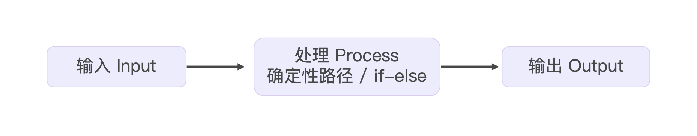
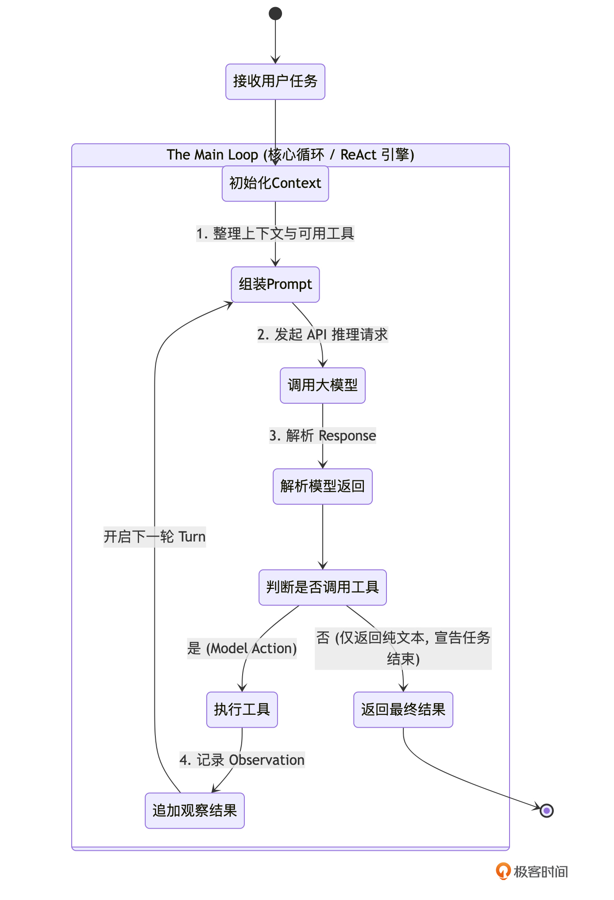

# 02｜核心心脏：手写 Agent 的 Main Loop

你好，我是Tony Bai。欢迎来到《从0开始构建 Agent Harness》专栏的第二讲。

在上一讲中，我们完成了一次底层的认知重塑：我们不再把开发 Agent 当作是调用大模型 API 的填空题，而是把它当作是为大模型（CPU）编写一个微型操作系统（Harness / 驾驭工程）。我们确立了 `go-tiny-claw` 的四层架构，并搭建了基础的目录骨架和启动占位符。

今天，我们要深入到核心引擎层（Core Engine Layer），去亲手实现这台操作系统的 **心脏起搏器**——Main Loop。

所有顶级的 Agent 引擎（无论是早期的 AutoGPT，还是如今最先进的 Claude Code、OpenClaw），它们表面上看起来像魔法一样能在你的本地项目里来回穿梭、修改代码、执行测试。但在代码的最底层，它们都在跑着一个极其朴素、但极其强健的无限循环。

这个循环，在学术界通常被称为 **ReAct (Reason + Act)** 范式，而在工程界，我们通常称之为 **Agent Loop** 或 **Main Loop**。

准备好了吗？我们将先从学术理论追根溯源，然后一步步把这个跳动的心脏拼装起来。

## 解密 Main Loop 与 ReAct 范式

在传统的软件开发中，程序的执行流是确定且线性的（如下图所示）。你写下 `if-else`，程序就严格按照路径执行。



但大模型（LLM）面对的是一个 **开放的、动态的、需要不断探索** 的环境。当它拿到一个宏大的任务（比如：“找出项目中计算错误的原因并修复”）时，它不可能像传统的纯问答（QA）机器人助手那样，在一次 API 调用中就吐出最终的完美代码。因为它缺少实时信息——它不知道当前目录下有什么文件，也不知道运行 `go test` 会报什么错。

为了解决大模型“睁眼瞎”的问题，研究人员经历了几次重要的范式演进。

### 1\. 纯推理（Reasoning Only）与纯行动（Acting Only）的局限性

在早期的尝试中，主要有两种流派：

- **纯推理模式（如 Chain of Thought, CoT）**：通过在 Prompt 中加入“Let’s think step by step”，强迫模型把思考过程写出来。这极大地提升了模型的逻辑推导能力，但致命缺陷是它 **无法与外部世界交互**。如果代码库更新了，或者报错信息变了，模型依然在用过时的、基于训练数据的“幻觉”在推理。

- **纯行动模式（Acting Only）**：直接给模型一堆工具（Tools），让它直接预测下一个要执行的动作。这种模式下，模型缺乏深度的状态跟踪和自我反思，往往就像一个横冲直撞的莽夫，很容易因为上一步的报错而陷入迷茫。

### 2\. ReAct：智能体的觉醒时刻

直到 2022 年 10 月，普林斯顿大学博士生 Shunyu Yao（在 Google 实习期间）与 Google 研究人员联合发表了预印本论文《 [ReAct: Synergizing Reasoning and Acting in Language Models](https://arxiv.org/pdf/2210.03629)》，并于 2023 年正式发表在 ICLR 2023 上。

这篇论文提出了一个极其优雅但影响深远的范式： **将“思考（Reasoning）”与“行动（Acting）”在一个循环中交织起来。** ReAct 范式认为，一个真正的智能体，必须像人类解决问题一样，在每次行动前先思考，在每次行动后观察结果：

1. **思考（Reason / Thought）**：分析当前拿到的线索，规划下一步的意图。例如：“我看到了 `calc.go` 这个文件，里面可能有 Bug，下一步我要读取它。”

2. **行动（Act / Action）**：向外部环境发出指令。例如：调用 `read_file` 工具。

3. **观察（Observe / Observation）**：外部环境（比如我们的 Harness 引擎）将工具执行的结果返回给模型。例如返回了 `calc.go` 的具体代码。

4. 然后再回到第 1 步，结合新获得的 Observation 再次思考，形成闭环。

在驾驭工程（Harness Engineering）中，我们将这套理论抽象为一个底层的 `for` 循环。我们可以用下面这张状态机图来精确描述它在 `go-tiny-claw` 中的流转过程：



### 3\. Harness 视角的 Main Loop 特征

正如你所见，只要大模型返回的结果中包含“工具调用请求（Tool Call Request）”，这个 Loop 就会一直循环下去。每一次从“组装Prompt”到“追加观察结果”，我们称之为一个 **Turn（轮次）**。

在顶级引擎（如 Claude Code、OpenClaw）中，这个 Main Loop 的设计有几个极其鲜明的特征：

1. **极度纯粹，没有预设分支**：循环中没有业务逻辑，全凭模型决定走向。

2. **不设硬性的最大步骤限制**：传统的玩具框架喜欢设置 `max_turns=10`，但真实的工业任务可能需要 50 步。顶级引擎不在此处做生硬的截断，而是依赖后续我们将会讲到的 Context Compaction（内存压缩） 和 System Reminders（系统级防死循环干预）来维持稳定。

3. **上下文（Context）是唯一的记忆载体**：在这个循环中，数据会像滚雪球一样不断累加，记录下每一次的思考、动作和观察结果。

理论铺垫完毕。接下来，我们就将这些理论转化为纯粹的代码。

## 构建 go-tiny-claw 的核心心脏

为了让引擎的代码易于测试且职责单一，我们需要在不同的目录下定义好几个核心的数据结构和接口。

### 目录结构回顾与更新

回顾我们在上一讲创建的目录。今天我们将丰富 `schema`（定义统一的血液）、 `provider`（大脑接口）、 `tools`（手脚接口）以及 `engine`（核心心脏）。

```plain
go-tiny-claw/
├── cmd/
│   └── claw/
│       └── main.go          # 测试入口：将挂载 Mock 组件运行 Main Loop
├── internal/
│   ├── engine/              # 【核心引擎层】
│   │   └── loop.go          # 本讲核心：Main Loop 逻辑
│   ├── provider/            # 【模型适配层】
│   │   └── interface.go     # LLM Provider 接口定义
│   ├── schema/              # 【公共数据结构】
│   │   └── message.go       # 统一的消息与工具调用类型定义
│   └── tools/               # 【工具与执行层】
│       └── registry.go      # 工具注册与分发接口
├── go.mod
└── README.md

```

### 第 1 步：定义系统的统一血液 (Schema)

在 Harness 驾驭引擎中，各个组件（大模型、工具、主循环）之间传递的数据就是上下文（Context）。由于市面上不同大模型（Claude、OpenAI模型等）的 API 格式千差万别，我们必须定义一套属于 `go-tiny-claw` 自己的标准数据结构，来承载 ReAct 范式中的“思考”与“行动”。

新建 `internal/schema/message.go`：

```go
package schema

import "encoding/json"

// Role 定义消息的角色，这是与大模型沟通的基石
type Role string

const (
    RoleSystem    Role = "system"    // 系统提示词：确立 Agent 的性格与红线
    RoleUser      Role = "user"      // 用户输入 / 工具执行的返回结果 (Observation)
    RoleAssistant Role = "assistant" // 模型的输出：包含推理(Reasoning)或工具调用(ToolCall)
)

// Message 代表上下文中传递的单条消息
type Message struct {
    Role    Role   `json:"role"`
    Content string `json:"content"` // 存放纯文本内容

    // 如果模型决定调用工具，此字段将被填充 (支持并行调用多个工具)
    ToolCalls []ToolCall `json:"tool_calls,omitempty"`

    // 如果这是对某个工具调用的响应，此字段必须填写，以告知模型上下文的关联性
    ToolCallID string `json:"tool_call_id,omitempty"`
}

// ToolCall 代表模型请求调用某个具体的工具
type ToolCall struct {
    ID        string          `json:"id"`   // 工具调用的唯一 ID
    Name      string          `json:"name"` // 想要调用的工具名称 (例如 "bash")
    // Arguments 存放 JSON 参数。使用 RawMessage 是为了延迟解析，将解析责任交给具体的工具
    Arguments json.RawMessage `json:"arguments"`
}

// ToolResult 代表工具在本地执行完毕后返回的物理结果
type ToolResult struct {
    ToolCallID string `json:"tool_call_id"`
    Output     string `json:"output"`   // 工具执行的控制台输出或报错堆栈
    IsError    bool   `json:"is_error"` // 标记是否失败，供后续的驾驭工程进行错误自愈
}

// ToolDefinition 描述了一个大模型可以调用的工具元信息 (供模型理解工具有什么用)
type ToolDefinition struct {
    Name        string      `json:"name"`
    Description string      `json:"description"`
    InputSchema interface{} `json:"input_schema"` // 对应 JSON Schema
}

```

这段代码确立了我们微型 OS 的通信协议。注意 `ToolCall` 中的 `Arguments` 使用了 `json.RawMessage`，这意味着 Main Loop 根本不关心具体的工具需要什么参数，实现了极致的解耦。

### 第 2 步：抽象 Provider 和 Tool 接口

在写 `for` 循环之前，Engine 需要知道去哪里调用大模型，去哪里执行工具。我们通过接口（Interface）来隔离底层实现。

新建 `internal/provider/interface.go`：

```go
package provider

import (
    "context"
    "github.com/yourname/go-tiny-claw/internal/schema"
)

// LLMProvider 定义了与大模型通信的统一契约
type LLMProvider interface {
    // Generate 接收当前的上下文历史、可用工具列表，并发起一次大模型推理
    Generate(ctx context.Context, messages []schema.Message, availableTools []schema.ToolDefinition) (*schema.Message, error)
}

```

接着，在 `internal/tools/registry.go` 中定义工具注册表的接口：

```go
package tools

import (
    "context"
    "github.com/yourname/go-tiny-claw/internal/schema"
)

// Registry 定义了工具的注册与分发执行接口
type Registry interface {
    // GetAvailableTools 返回当前系统挂载的所有可用工具的 Schema
    GetAvailableTools() []schema.ToolDefinition

    // Execute 实际执行模型请求的工具，并返回结果
    Execute(ctx context.Context, call schema.ToolCall) schema.ToolResult
}

```

### 第 3 步：实现心脏起搏器 —— Main Loop

现在，所有的拼图都准备好了。让我们进入 `internal/engine/loop.go`，写下这台微型 OS 最核心的心跳逻辑。

```go
package engine

import (
    "context"
    "fmt"
    "log"

    "github.com/yourname/go-tiny-claw/internal/provider"
    "github.com/yourname/go-tiny-claw/internal/schema"
    "github.com/yourname/go-tiny-claw/internal/tools"
)

// AgentEngine 是微型 OS 的核心驱动
type AgentEngine struct {
    provider provider.LLMProvider
    registry tools.Registry

    // WorkDir (工作区): 借鉴 OpenClaw 的理念，Agent 必须有一个明确的物理边界
    WorkDir string
}

func NewAgentEngine(p provider.LLMProvider, r tools.Registry, workDir string) *AgentEngine {
    return &AgentEngine{
        provider: p,
        registry: r,
        WorkDir:  workDir,
    }
}

// Run 启动 Agent 的生命周期
func (e *AgentEngine) Run(ctx context.Context, userPrompt string) error {
    log.Printf("[Engine] 引擎启动，锁定工作区: %s\n", e.WorkDir)

    // 1. 初始化会话的 Context (上下文内存)
    // 在真实的场景中，这里会由动态 Prompt 组装器加载 AGENTS.md。目前我们先硬编码。
    contextHistory := []schema.Message{
        {
            Role:    schema.RoleSystem,
            Content: "You are go-tiny-claw, an expert coding assistant. You have full access to tools in the workspace.",
        },
        {
            Role:    schema.RoleUser,
            Content: userPrompt,
        },
    }

    turnCount := 0

    // 2. The Main Loop: 心跳开始 (标准的 ReAct 循环)
    for {
        turnCount++
        log.Printf("========== [Turn %d] 开始 ==========\n", turnCount)

        // 获取当前挂载的所有工具定义
        availableTools := e.registry.GetAvailableTools()

        // 向大模型发起推理请求 (包含 Reasoning)
        log.Println("[Engine] 正在思考 (Reasoning)...")
        responseMsg, err := e.provider.Generate(ctx, contextHistory, availableTools)
        if err != nil {
            return fmt.Errorf("模型生成失败: %w", err)
        }

        // 将模型的响应完整追加到上下文历史中
        contextHistory = append(contextHistory, *responseMsg)

        // 如果模型回复了纯文本，打印出来 (这通常是它的思考过程，或是最终结果)
        if responseMsg.Content != "" {
            fmt.Printf("🤖 模型: %s\n", responseMsg.Content)
        }

        // 3. 退出条件判断
        // 如果模型没有请求任何工具调用，说明它认为任务已经完成，跳出循环。
        if len(responseMsg.ToolCalls) == 0 {
            log.Println("[Engine] 任务完成，退出循环。")
            break
        }

        // 4. 执行行动 (Action) 与 获取观察结果 (Observation)
        log.Printf("[Engine] 模型请求调用 %d 个工具...\n", len(responseMsg.ToolCalls))

        for _, toolCall := range responseMsg.ToolCalls {
            log.Printf("  -> 🛠️ 执行工具: %s, 参数: %s\n", toolCall.Name, string(toolCall.Arguments))

            // 通过 Registry 路由并执行底层工具
            result := e.registry.Execute(ctx, toolCall)

            if result.IsError {
                log.Printf("  -> ❌ 工具执行报错: %s\n", result.Output)
            } else {
                log.Printf("  -> ✅ 工具执行成功 (返回 %d 字节)\n", len(result.Output))
            }

            // 将工具执行的观察结果 (Observation) 封装为 User Message 追加到上下文中
            // 注意：ToolCallID 必须携带！这是维系大模型推理链条的关键
            observationMsg := schema.Message{
                Role:       schema.RoleUser,
                Content:    result.Output,
                ToolCallID: toolCall.ID,
            }
            contextHistory = append(contextHistory, observationMsg)
        }

        // 循环回到开头，模型将带着新加入的 Observation 继续它的下一轮思考...
    }

    return nil
}

```

看这段代码，你会惊叹于驾驭工程的极简之美。

- `loop.go` 根本不关心 `bash` 工具是怎么运行的，也不关心 Claude 模型的 HTTP 请求怎么发。

- 它只负责维护这根脆弱但重要的“上下文时间线”（ `contextHistory`）。它像一个忠实的书记员，严格执行了 ReAct 范式：把模型的意图（ToolCall）交给执行层，再把物理世界的反馈（Observation）原封不动地追加回内存中。

## 运行与验证：连接 Mock 桩代码

为了让你能在本地把这个空心引擎跑起来，验证我们的 Main Loop 是否健壮，我们在 `main.go` 中快速写两个“假肢（Mock）”实现。

打开 `cmd/claw/main.go`：

```go
package main

import (
    "context"
    "log"
    "os"

    "github.com/yourname/go-tiny-claw/internal/engine"
    "github.com/yourname/go-tiny-claw/internal/provider"
    "github.com/yourname/go-tiny-claw/internal/schema"
    "github.com/yourname/go-tiny-claw/internal/tools"
)

// ==========================================
// 1. 伪造的大模型 Provider
// ==========================================
type mockProvider struct {
    turn int
}

// 模拟大模型的响应：第一轮请求执行 bash，第二轮输出最终结果
func (m *mockProvider) Generate(ctx context.Context, msgs []schema.Message, _ []schema.ToolDefinition) (*schema.Message, error) {
    m.turn++
    if m.turn == 1 {
        return &schema.Message{
            Role:    schema.RoleAssistant,
            Content: "让我来看看当前目录下有什么文件。",
            ToolCalls: []schema.ToolCall{
                {ID: "call_123", Name: "bash", Arguments: []byte(`{"command": "ls -la"}`)},
            },
        }, nil
    }

    return &schema.Message{
        Role:    schema.RoleAssistant,
        Content: "我看到了文件列表，里面包含 main.go，任务完成！",
    }, nil
}

// ==========================================
// 2. 伪造的 Tool Registry
// ==========================================
type mockRegistry struct{}

func (m *mockRegistry) GetAvailableTools() []schema.ToolDefinition { return nil }

func (m *mockRegistry) Execute(ctx context.Context, call schema.ToolCall) schema.ToolResult {
    // 直接返回一段伪造的终端输出
    return schema.ToolResult{
        ToolCallID: call.ID,
        Output:     "-rw-r--r--  1 user group  234 Oct 24 10:00 main.go\n",
        IsError:    false,
    }
}

// ==========================================
// 3. 组装运行
// ==========================================
func main() {
    // 获取当前执行目录作为 WorkDir 物理边界
    workDir, _ := os.Getwd()

    p := &mockProvider{}
    r := &mockRegistry{}

    // 实例化核心引擎
    eng := engine.NewAgentEngine(p, r, workDir)

    // 发起任务指令
    err := eng.Run(context.Background(), "帮我检查当前目录的文件")
    if err != nil {
        log.Fatalf("引擎崩溃: %v", err)
    }
}

```

### 运行步骤与预期输出

在终端中执行启动命令：

```bash
go run cmd/claw/main.go

```

你将清晰地看到 Main Loop 在终端中完美地驱动了两个 Turn 的循环：

```plain
2026/03/29 17:12:13 [Engine] 引擎启动，锁定工作区: build-agent-harness-from-scratch/part1/source/ch02/go-tiny-claw
2026/03/29 17:12:13 ========== [Turn 1] 开始 ==========
2026/03/29 17:12:13 [Engine] 正在思考 (Reasoning)...
🤖 模型: 让我来看看当前目录下有什么文件。
2026/03/29 17:12:13 [Engine] 模型请求调用 1 个工具...
2026/03/29 17:12:13   -> 🛠️ 执行工具: bash, 参数: {"command": "ls -la"}
2026/03/29 17:12:13   -> ✅ 工具执行成功 (返回 51 字节)
2026/03/29 17:12:13 ========== [Turn 2] 开始 ==========
2026/03/29 17:12:13 [Engine] 正在思考 (Reasoning)...
🤖 模型: 我看到了文件列表，里面包含 main.go，任务完成！
2026/03/29 17:12:13 [Engine] 任务完成，退出循环。

```

至此，虽然我们接入的还是“假肢”，但这个基于 ReAct 范式的微型操作系统“心脏”，已经确确实实、稳定地跳动起来了！

## 本讲小结

今天，我们完成了 `go-tiny-claw` 核心引擎层（Core Engine Layer）的构建。

1. **解构 ReAct 模型**：我们追溯了 AI Agent 的学术演进，将复杂的任务流转抽象为了一个极简的“思考（Reason）- 行动（Act）- 观察（Observe）”无限循环。只要大模型吐出工具请求，我们就执行并追加结果；只要它输出纯文本，我们就视为任务结束。

2. **统一定义架构“血液”**：我们在 `schema` 模块定义了 `Message`、 `ToolCall` 和 `ToolResult`。这些纯粹的数据结构，彻底隔绝了外部大模型 SDK 和底层工具代码之间的依赖，是 Harness 驾驭工程中解耦的基石。

3. **确立物理边界（WorkDir）**：在 `AgentEngine` 中，我们显式地绑定了 `WorkDir`。这是极其重要的安全与设计理念——Agent 不是全局幽灵，它必须像一个普通开发者一样，受限于某个具体的项目工作区。

现在，引擎的心跳已经稳健。但在真实的复杂项目中，大模型在拿到可用工具后，往往会产生一种“冲动”：遇到问题还没想清楚，就立刻凭直觉生成一个 `ToolCall` 去盲目尝试。这种缺乏全局规划的试错，不仅浪费 Token，更会导致项目结构被改得一团糟。

在下一讲，我们将深度借鉴顶级 Agent的最新架构，在我们的 ReAct 循环中剥离出一个 **独立的“慢思考与自省（Thinking）”阶段**，让 Agent 在每次动手前，被迫进行深度的全局规划！

> 注：本讲的示例代码，可以在 [这里](https://github.com/bigwhite/publication/tree/master/column/timegeek/build-agent-harness-from-scratch/ch02) 下载。

## 思考题

仔细观察目前的 `loop.go` 代码，当大模型在一个 Turn 里返回了多个 `ToolCall` 时，我们是通过一个 `for` 循环串行（Sequential）地去调用 `e.registry.Execute` 的：

```go
for _, toolCall := range responseMsg.ToolCalls {
    result := e.registry.Execute(ctx, toolCall)
    // ...
}

```

假设大模型非常聪明，它为了加快速度，同时请求了读取 3 个完全独立的文件。以我们目前的串行写法，必须等第一个文件读完并返回，才会去读第二个文件。

作为一名专业的 Go 开发工程师，你能想到如何利用 Go 语言的原生特性（比如 Goroutine 和 WaitGroup），将这里的工具执行改造为并行执行（Parallel Execution）吗？如果在并行执行中某个工具报错了，又该如何将所有并行的结果（Observation）按照正确的顺序组装回 `Context` 中？

欢迎在留言区分享你的代码思路。我们将在本专栏的第 08 讲中为你揭晓工业级的并行标准答案。下一讲见！
