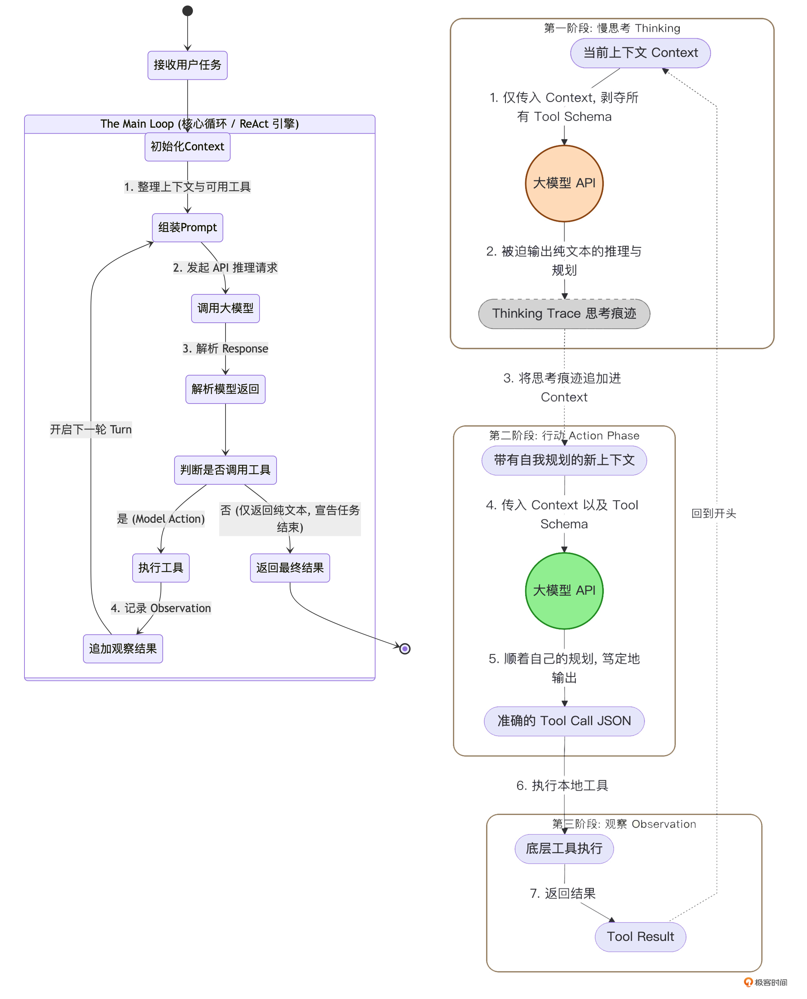

# 03｜慢思考与自省：在 ReAct 循环中剥离独立的 Thinking 阶段
你好，我是Tony Bai。欢迎来到《从0开始构建 Agent Harness》专栏的第三讲。

在上一讲中，我们从学术界的 ReAct 论文出发，用 Go 语言手写了 `go-tiny-claw` 的心脏——Main Loop。我们成功地让一个“假肢”模型在“思考-行动-观察”的无尽循环中跑了起来。

看似我们已经掌握了智能体运行的终极密码。但是，如果现在就把真实的前沿大模型（如 Claude 4.x 或 GPT-5.x）接入这个基础循环，并且给它挂载上能够修改本地代码的 `edit` 和 `bash` 工具，你会遭遇一个极其普遍但又令人抓狂的现象： **大模型变得极其“冲动”。**

当你给它一个复杂的任务：“帮我分析整个订单模块的并发逻辑，并重构它”时。它可能连其他文件都没看，瞬间就发出了一个 `edit` 工具的调用请求，去盲目修改它看到的第一个文件。

为什么会这样？在这一讲中，我们将深入探讨大模型在面对工具时的“认知陷阱”，并学习顶级驾驭工程（Harness Engineering）是如何通过 **在底层架构上强制剥离出一个独立的 Thinking（慢思考）阶段**，来让 Agent 从“莽夫”蜕变为“架构师”的。

## 大模型的“快思考”与“慢思考”

诺贝尔经济学奖得主丹尼尔·卡尼曼在《思考，快与慢》中提出，人类的大脑包含两套系统：

- **系统 1（快思考）**：直觉的、本能的、自动的。比如你看到 `2+2` 立刻就能想到 `4`。

- **系统 2（慢思考）**：逻辑的、深思熟虑的、需要消耗精力的。比如让你计算 `17 × 24`，你必须拿出一张草稿纸，一步步推导。


大语言模型的本质是预测下一个 Token。从架构上看，它天生就是一个完美的“系统 1”。

当你向大模型发起一次普通的 API 请求时，它只能顺着当前的上下文，凭借概率直觉“一口气”把答案生成出来。如果问题极其复杂，它无法在生成第一个字之前，在脑海里预演几十步的完整计划。

### 提示词工程的破产与驾驭工程的解法

为了激发大模型的“系统 2（慢思考）”，学术界发明了 **Chain of Thought（思维链，CoT）** 技术。我们会在提示词里加上一句咒语：“Let’s think step by step（让我们一步步思考） _”_。这就相当于给了大模型一张“草稿纸”，让它在输出最终答案前，先把中间推理过程写出来。

但在 Agent 的工具调用（Function Calling）场景下，这种单纯的提示词工程彻底破产了。因为 AI 工程师在构建长程 Coding Agent 时，发现了一个致命的规律：

> _“When tools are available, models tend to act quickly rather than think deeply.”_
>
> （当工具可用时，模型倾向于迅速采取行动，而不是深入思考。）

如果你在系统提示词里写：“请你先仔细规划，然后再调用工具”。大模型往往会无视这句话。只要它在上下文的 Schema 里看到了诱人的 `bash` 或 `edit` 工具，它的预测概率就会瞬间坍塌，转而生成一段 JSON 参数去调用工具。

如何解决呢？既然提示词管不住它的“手”，那我们就用架构锁住它的“手”！驾驭工程（Harness Engineering）给出的解法是： **机制决定行为**。

在每一次大模型采取行动前，Harness 引擎会向它发起一次没有附带任何工具 Schema 的纯文本 API 请求。在这个绝对没有工具诱惑的“小黑屋”里，模型别无选择，只能乖乖地输出一段纯文本的深度推理与规划。

等它想清楚了，Harness 会把这段推理记录追加到上下文中，然后再发起第二次附带工具的请求，让它去执行。

这就是工业级 Agent 循环中的 Two-Stage ReAct（两阶段 ReAct 循环）。

### 架构演进：Two-Stage ReAct 循环

我们可以用一张示意图，对比一下我们在上一讲实现的基础循环，与今天我们要重构的“两阶段循环”的差异：



通过这种物理层面的隔离，我们将 Agent 的“谋”与“动”彻底分开了。

## 代码实战：在 Main Loop 中剥离 Thinking 阶段

理解了理论，落实到 Go 语言的代码层面其实非常简单。

得益于我们在上一讲中设计的 `LLMProvider` 接口极其纯粹（ `Generate(ctx, msgs, tools)`），我们只需要在传参时动一点手脚：如果不传 `tools` 数组，大模型自然就只能输出文本了。

### 目录结构回顾与更新

我们今天的核心修改全部集中在 `internal/engine/loop.go` 和测试入口 `cmd/claw/main.go` 中。

```plain
go-tiny-claw/
├── cmd/
│   └── claw/
│       └── main.go          # 【修改】升级 Mock Provider，支持区分推理和行动请求
├── internal/
│   ├── engine/
│   │   └── loop.go          # 【核心修改】引入 EnableThinking 开关，重构为两阶段循环
│   ├── provider/
│   │   └── interface.go     # 保持不变
│   ├── schema/
│   │   └── message.go       # 保持不变
│   └── tools/
│       └── registry.go      # 保持不变
├── go.mod
└── README.md

```

### 第 1 步：改造 AgentEngine，增加思维开关

打开 `internal/engine/loop.go`，我们为引擎增加一个 `EnableThinking` 的配置项。在处理简单任务（比如只问个天气）时，我们可以关闭它以节省 Token；但在处理复杂代码任务时，我们将其打开。

```go
// internal/engine/loop.go
package engine

import (
    "context"
    "fmt"
    "log"

    "github.com/yourname/go-tiny-claw/internal/provider"
    "github.com/yourname/go-tiny-claw/internal/schema"
    "github.com/yourname/go-tiny-claw/internal/tools"
)

type AgentEngine struct {
    provider       provider.LLMProvider
    registry       tools.Registry
    WorkDir        string
    EnableThinking bool // 【新增】慢思考模式开关
}

func NewAgentEngine(p provider.LLMProvider, r tools.Registry, workDir string, enableThinking bool) *AgentEngine {
    return &AgentEngine{
        provider:       p,
        registry:       r,
        WorkDir:        workDir,
        EnableThinking: enableThinking,
    }
}

```

### 第 2 步：重构 Main Loop，实现两阶段流转

接下来，我们修改 `Run` 方法。在原来的向大模型发起请求的地方，将其拆分为明显的两步：Phase 1（Thinking）和 Phase 2（Action）。

```go
// internal/engine/loop.go (续)

func (e *AgentEngine) Run(ctx context.Context, userPrompt string) error {
    log.Printf("[Engine] 引擎启动，锁定工作区: %s\n", e.WorkDir)
    log.Printf("[Engine] 慢思考模式 (Thinking Phase): %v\n", e.EnableThinking)

    contextHistory := []schema.Message{
        {
            Role:    schema.RoleSystem,
            Content: "You are go-tiny-claw, an expert coding assistant. You have full access to tools in the workspace.",
        },
        {
            Role:    schema.RoleUser,
            Content: userPrompt,
        },
    }

    turnCount := 0

    for {
        turnCount++
        log.Printf("\n========== [Turn %d] 开始 ==========\n", turnCount)

        // 获取当前挂载的所有工具定义
        availableTools := e.registry.GetAvailableTools()

        // ====================================================================
        // Phase 1: 慢思考阶段 (Thinking) - 剥夺工具，强制规划
        // ====================================================================
        if e.EnableThinking {
            log.Println("[Engine][Phase 1] 剥夺工具访问权，强制进入慢思考与规划阶段...")

            // 核心机制：传入的 availableTools 为 nil！
            // 大模型看不到任何 JSON Schema，被迫只能输出纯文本的思考过程。
            thinkResp, err := e.provider.Generate(ctx, contextHistory, nil)
            if err != nil {
                return fmt.Errorf("Thinking 阶段生成失败: %w", err)
            }

            // 如果模型输出了思考过程，我们将其作为 Assistant 消息追加到上下文中
            if thinkResp.Content != "" {
                fmt.Printf("🧠 [内部思考 Trace]: %s\n", thinkResp.Content)
                contextHistory = append(contextHistory, *thinkResp)
            }
        }

        // ====================================================================
        // Phase 2: 行动阶段 (Action) - 恢复工具，顺着规划执行
        // ====================================================================
        log.Println("[Engine][Phase 2] 恢复工具挂载，等待模型采取行动...")

        // 此时的 contextHistory 中已经包含了上一阶段模型自己的 Thinking Trace。
        // 模型会顺着自己的逻辑，结合恢复的 availableTools 发起精准的工具调用。
        actionResp, err := e.provider.Generate(ctx, contextHistory, availableTools)
        if err != nil {
            return fmt.Errorf("Action 阶段生成失败: %w", err)
        }

        contextHistory = append(contextHistory, *actionResp)

        if actionResp.Content != "" {
            fmt.Printf("🤖 [对外回复]: %s\n", actionResp.Content)
        }

        // ====================================================================
        // 退出与执行逻辑 (与上一讲保持一致)
        // ====================================================================
        if len(actionResp.ToolCalls) == 0 {
            log.Println("[Engine] 模型未请求调用工具，任务宣告完成。")
            break
        }

        log.Printf("[Engine] 模型请求调用 %d 个工具...\n", len(actionResp.ToolCalls))

        for _, toolCall := range actionResp.ToolCalls {
            log.Printf("  -> 🛠️ 执行工具: %s, 参数: %s\n", toolCall.Name, string(toolCall.Arguments))

            result := e.registry.Execute(ctx, toolCall)

            if result.IsError {
                log.Printf("  -> ❌ 工具执行报错: %s\n", result.Output)
            } else {
                log.Printf("  -> ✅ 工具执行成功 (返回 %d 字节)\n", len(result.Output))
            }

            // 将工具执行的观察结果追加到 Context，准备进入下一轮
            observationMsg := schema.Message{
                Role:       schema.RoleUser,
                Content:    result.Output,
                ToolCallID: toolCall.ID,
            }
            contextHistory = append(contextHistory, observationMsg)
        }
    }

    return nil
}

```

请注意看 Phase 1 中的 `e.provider.Generate(ctx, contextHistory, nil)`。这个 `nil` 就是驾驭工程中四两拨千斤的魔法。

由于大模型是自回归（Auto-regressive）的，当它在 Phase 1 自己输出了“我应该先用 bash 看看系统日志”这句话并被存入 `contextHistory` 后，在 Phase 2 时，它自己看到自己说的话，就会顺理成章、毫无幻觉地生成一个调用 `bash` 的 JSON。这极大降低了模型瞎调工具的概率。

## 运行与验证：升级 Mock Provider

为了验证这个两阶段架构，我们需要升级一下 `cmd/claw/main.go` 中的 `mockProvider`。

我们要让这个“假肢”变得智能一点：当它发现 `availableTools == nil` 时，它必须假装在进行慢思考；当它发现传入了工具时，它才返回 `ToolCall`。

打开 `cmd/claw/main.go`：

```go
package main

import (
    "context"
    "log"
    "os"

    "github.com/yourname/go-tiny-claw/internal/engine"
    "github.com/yourname/go-tiny-claw/internal/provider"
    "github.com/yourname/go-tiny-claw/internal/schema"
    "github.com/yourname/go-tiny-claw/internal/tools"
)

// 升级版 Mock Provider
type mockProvider struct {
    turn int
}

func (m *mockProvider) Generate(ctx context.Context, msgs []schema.Message, tools []schema.ToolDefinition) (*schema.Message, error) {
    // 如果工具列表为空，说明这是引擎发起的 Phase 1: Thinking 阶段
    if len(tools) == 0 {
        return &schema.Message{
            Role:    schema.RoleAssistant,
            Content: "【推理中】目标是检查文件。我不能直接盲猜，我需要先调用 bash 工具执行 ls 命令，看看当前目录下有什么，然后再做定夺。",
        }, nil
    }

    // 如果工具列表不为空，说明这是 Phase 2: Action 阶段
    m.turn++
    if m.turn == 1 {
        // 第一轮 Action：顺着刚才的 Thinking，精准调用工具
        return &schema.Message{
            Role:    schema.RoleAssistant,
            Content: "我要执行我刚才计划的步骤了。",
            ToolCalls: []schema.ToolCall{
                {ID: "call_123", Name: "bash", Arguments: []byte(`{"command": "ls -la"}`)},
            },
        }, nil
    }

    // 第二轮 Action：直接总结退出
    return &schema.Message{
        Role:    schema.RoleAssistant,
        Content: "根据工具返回的结果，我看到了 main.go，任务圆满完成！",
    }, nil
}

type mockRegistry struct{}

func (m *mockRegistry) GetAvailableTools() []schema.ToolDefinition {
    // 为了让 Phase 2 能检测到工具，这里返回一个伪造的工具定义数组
    return []schema.ToolDefinition{​{Name: "bash"}​}
}

func (m *mockRegistry) Execute(ctx context.Context, call schema.ToolCall) schema.ToolResult {
    return schema.ToolResult{
        ToolCallID: call.ID,
        Output:     "-rw-r--r--  1 user group  234 Oct 24 10:00 main.go\n",
        IsError:    false,
    }
}

func main() {
    workDir, _ := os.Getwd()

    p := &mockProvider{}
    r := &mockRegistry{}

    // 实例化引擎，开启 EnableThinking = true
    eng := engine.NewAgentEngine(p, r, workDir, true)

    err := eng.Run(context.Background(), "帮我检查当前目录的文件")
    if err != nil {
        log.Fatalf("引擎崩溃: %v", err)
    }
}

```

### 运行步骤与预期输出

在终端中执行启动命令：

```bash
go run cmd/claw/main.go

```

你将看到如下极具层次感的执行日志：

```plain
2026/03/29 14:37:57 [Engine] 引擎启动，锁定工作区: build-agent-harness-from-scratch/part1/source/ch03/go-tiny-claw
2026/03/29 14:37:57 [Engine] 慢思考模式 (Thinking Phase): true
2026/03/29 14:37:57
========== [Turn 1] 开始 ==========
2026/03/29 14:37:57 [Engine][Phase 1] 剥夺工具访问权，强制进入慢思考与规划阶段...
🧠 [内部思考 Trace]: 【推理中】目标是检查文件。我不能直接盲猜，我需要先调用 bash 工具执行 ls 命令，看看当前目录下有什么，然后再做定夺。
2026/03/29 14:37:57 [Engine][Phase 2] 恢复工具挂载，等待模型采取行动...
🤖 [对外回复]: 我要执行我刚才计划的步骤了。
2026/03/29 14:37:57 [Engine] 模型请求调用 1 个工具...
2026/03/29 14:37:57   -> 🛠️ 执行工具: bash, 参数: {"command": "ls -la"}
2026/03/29 14:37:57   -> ✅ 工具执行成功 (返回 51 字节)
2026/03/29 14:37:57
========== [Turn 2] 开始 ==========
2026/03/29 14:37:57 [Engine][Phase 1] 剥夺工具访问权，强制进入慢思考与规划阶段...
🧠 [内部思考 Trace]: 【推理中】目标是检查文件。我不能直接盲猜，我需要先调用 bash 工具执行 ls 命令，看看当前目录下有什么，然后再做定夺。
2026/03/29 14:37:57 [Engine][Phase 2] 恢复工具挂载，等待模型采取行动...
🤖 [对外回复]: 根据工具返回的结果，我看到了 main.go，任务圆满完成！
2026/03/29 14:37:57 [Engine] 模型未请求调用工具，任务宣告完成。

```

注：在 Turn 2 中的 Thinking 输出与 Turn 1 一致，是因为我们的 mock 逻辑比较简单。在真实的 LLM 接入后，它会在 Turn 2 思考：“我已经看到了结果，下一步应该总结输出了”。

看到这里，你是否体会到了 Harness 驾驭工程的魅力？我们没有在 Prompt 里写一句“求求你先思考再行动”，仅仅是通过 **在架构层面做了一次精妙的剥离拦截**，大模型的行为范式就发生了根本性的翻覆。

### 反思：静态慢思考的局限性

细心的同学可能已经发现，我们目前在 `AgentEngine` 中引入的 `EnableThinking` 是一个 **静态的全局开关**。

只要在启动时传了 `true`，大模型在未来的几十轮（Turn）交互中，每一轮都必须先被关进“小黑屋”强制做一次纯文本的推理与规划（Phase 1），然后再去执行动作（Phase 2）。

对于诸如“帮我写一个 Web 服务器”这样复杂的开局任务，强制慢思考确实能极大地提升成功率。但是，当任务进行到中后期，大模型仅仅只是需要逐个完成一些简单微小的任务时，强制它做一次慢思考，不仅显得极其啰嗦，还会白白浪费大量的 API Token 成本和响应时间。

那么，如何才能让大模型在宏观上拥有长程的规划能力，而在微观执行上又能在简单任务时做到“免思考、极速响应”呢？

这个解法，将在本专栏的 **第 13 讲（记忆沉淀：引入 Plan Mode）** 中为你揭晓！我们将探讨“慢思考”与“Plan 模式”的本质区别。现在，让我们带着这个疑问，继续打磨我们的基础引擎。

## 本讲小结

今天，我们在上一讲基础 Main Loop 的框架内，完成了一次非常高级的架构重构。

1. **洞察模型的“冲动”陷阱**：我们从理论上揭示了当工具 Schema 存在于请求上下文中时，大模型（作为系统 1）天生倾向于立刻采取行动，而忽视全局规划。提示词层面的约束对此收效甚微。

2. **两阶段 ReAct（Two-Stage ReAct）**：借鉴业界顶级框架的实践，我们在代码层面上强制将 `Thinking` 和 `Action` 物理拆分。

3. **驾驭工程的四两拨千斤**：在具体实现时，我们通过在第一次调用 Provider 时传入 `availableTools = nil`，极其优雅地“逼迫”大模型输出纯文本的思考轨迹（Thinking Trace），并将其固化为接下来的上下文，利用其自回归特性引导精准的行动。


现在，这台引擎不仅有强健的心跳，更拥有了深邃的思考能力。但是，一直依赖 Mock 的假肢是没有成就感的。

在下一讲中，我们将正式拔掉这个 `mockProvider`，通过抽象的适配层，全面接入官方的 **Claude 大模型** 和 **OpenAI兼容的国内大模型**。届时，我们将用真实的 AI 大脑，来检验这套两阶段引擎在面对真实环境时的澎湃算力！

> 注：本讲的示例代码，可以在 [这里](https://github.com/bigwhite/publication/tree/master/column/timegeek/build-agent-harness-from-scratch/ch03) 下载。

## 思考题

在当前的实现中，我们在 Phase 1（Thinking）得到的 `thinkResp` 被作为一条普通的 `schema.RoleAssistant` 消息追加到了上下文中。

但在真实的工业级大模型调用中，这不仅会消耗不菲的 Token，还会暴露模型内部极其冗长的“自言自语”给终端用户（在某些产品设计中，我们希望对用户隐藏这些内部 Trace）。

不仅如此，如果模型在 Phase 1 想出的计划本身就是荒谬或错误的，我们在 Phase 2 直接让它去执行，依然会导致失败。结合这些痛点，你认为在驾驭工程中，我们能不能在 Phase 1 之后、Phase 2 之前，再插入一个“自我审查”的微循环？如果有，它的逻辑该怎么写？

欢迎在留言区分享你的架构洞察。我们下一讲见！