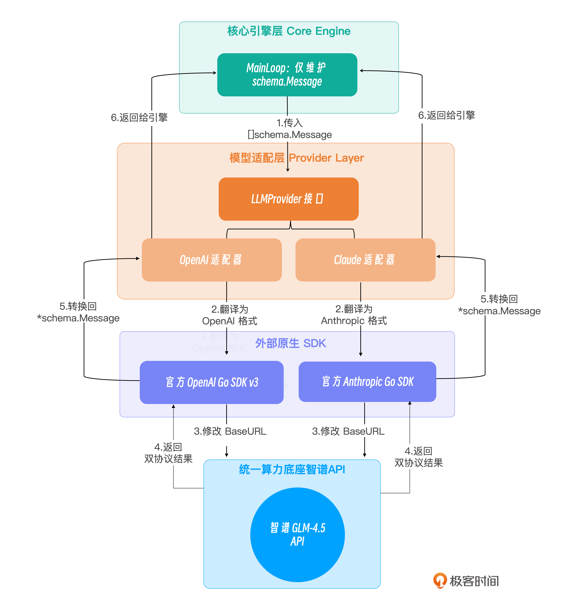

# 04｜大脑接入：抽象 Provider 接口，适配 Claude 与 OpenAI 兼容大模型

你好，我是Tony Bai。欢迎来到《从0开始构建 Agent Harness》专栏的第四讲。

在前面的课程中，我们犹如打造精密钟表一般，用 Go 语言构建了 `go-tiny-claw` 的核心部件。特别是上一讲，我们在 ReAct 循环中巧妙地剥离出了独立的慢思考（Thinking）阶段，从架构机制上压制了大模型的行动冲动。

然而，这台设计精妙的微型操作系统（Harness），目前依然连接着一个 `mockProvider`（假肢大脑）。今天，我们将正式拔掉这双“假肢”，为引擎接入真实的前沿大模型。

在真实的企业级 AI 应用开发中，我们面临着一个绕不开的碎片化痛点： **不同大模型厂商的 API 数据结构存在巨大差异**。特别是涉及 Function Calling（工具调用）和上下文组装时，OpenAI 生态和 Anthropic（Claude）生态是两套截然不同的标准。

如果在我们的核心 Main Loop 中直接写入这些特定厂商的 SDK 代码，整个驾驭工程（Harness Engineering）的解耦原则就会被彻底破坏。

本讲，我们将通过设计优雅的 `Provider` 抽象层，完美隔离这种差异。为了兼顾国内网络环境的便利性，我们将使用国内的智谱大模型（GLM）来作为统一的算力底座。由于智谱 API 实现了对 OpenAI 和 Claude 两大生态双协议的兼容，我们将在同一套代码中，演示如何通过官方的 OpenAI Go SDK 和 Anthropic Go SDK，双管齐下地接入 `glm-4.5-air` 模型。

## Provider 作为“同声传译”

先来看看如果我们不加抽象，直接在 Main Loop 里调用 SDK 会发生什么。

Claude 的 API 使用的是 `messages` 数组，工具调用返回的是特定的 `tool_use` 块；而 OpenAI 兼容API 使用的是一套不同的 `tools` 和 `tool_calls` 结构。

如果 Main Loop 需要关心这些底层细节，它的逻辑就会变成这样：

```go
// 糟糕的面条代码示例 (千万别这么写)
if engine.ModelType == "claude" {
    // 构造 anthropic.MessageParam
    // 解析 anthropic.ToolUseBlock
} else if engine.ModelType == "openai" {
    // 构造 openai.ChatCompletionMessage
    // 解析 openai.ToolCall
}

```

这违背了我们驾驭工程的极简和解耦哲学。Main Loop 的唯一职责是维护 **上下文时间线（Context History）**。它不应该知道外部世界是用什么协议通信的。

在驾驭工程中，Main Loop 应当只认识一种语言——也就是我们在第 01 讲中定义的 `schema.Message`、 `schema.ToolCall` 和 `schema.ToolResult`。

`Provider` 层的核心职责，就是充当一个 **同声传译员（Translator）**。

当 Main Loop 发起推理请求时， `Provider` 需要将内部干净的 `schema.Message` 历史记录，翻译成各大厂商 SDK 所要求的那种晦涩、嵌套极深的请求体；而当大模型 API 返回结果后， `Provider` 又必须将厂商特有的 `ToolUseBlock` 或 `FunctionCall` 结构，精确地反向翻译回内部的 `schema.Message`。

我们可以用一张示意图来展示这种解耦架构：



通过这层抽象，我们的微型 OS 具备了“即插即用”换大脑的能力。

## 代码实战：实现双协议 Provider 适配器

在开始编写代码前，我们需要拉取两大官方的 Go SDK。

注：我们将使用最新的 OpenAI Go SDK V3 官方包，它在类型安全上做了大量重构。

```bash
go get github.com/openai/openai-go/v3
go get github.com/anthropics/anthropic-sdk-go

```

### 目录结构回顾与更新

我们将所有的翻译逻辑都集中在 `internal/provider` 目录下。为了进行测试，我们仍会在 `main.go` 中保留一个 Mock 的 Tool Registry（真正的 Tools Registry 将在下一讲实现）。

```plain
go-tiny-claw/
├── cmd/
│   └── claw/
│       └── main.go          # 【修改】接入真实的 Provider 并启动测试
├── internal/
│   ├── engine/              # 保持不变 (loop.go 中已支持两阶段思考)
│   ├── provider/            # 【模型适配层】
│   │   ├── interface.go     # 接口定义 (复用)
│   │   ├── openai.go        # 【新增】基于 OpenAI V3 SDK 的适配器
│   │   └── claude.go        # 【新增】基于 Anthropic SDK 的适配器
│   ├── schema/              # 保持不变
│   └── tools/               # 保持不变
├── go.mod
└── go.sum

```

### 第 1 步：复习接口契约

为了保持代码的连贯性，我们快速回顾一下在之前章节定义的 `LLMProvider` 接口：

```go
// internal/provider/interface.go
package provider

import (
    "context"
    "github.com/yourname/go-tiny-claw/internal/schema"
)

type LLMProvider interface {
    // Generate 接收当前的上下文历史和可用工具列表，返回模型的新消息。
    // 注意：当 availableTools 为 nil 或长度为 0 时，代表引擎正在强制模型进入慢思考阶段。
    Generate(ctx context.Context, messages []schema.Message, availableTools []schema.ToolDefinition) (*schema.Message, error)
}

```

### 第 2 步：实现 OpenAI 格式适配器（兼容智谱）

我们首先编写 `openai.go`。智谱 API 原生兼容 OpenAI 协议，所以我们只需在使用官方最新的 `openai-go/v3` SDK 时，将其 `BaseURL` 替换为智谱的 API 地址即可。

新建 `internal/provider/openai.go`：

```go
// internal/provider/openai.go
package provider

import (
    "context"
    "encoding/json"
    "fmt"
    "os"

    "github.com/openai/openai-go/v3"
    "github.com/openai/openai-go/v3/option"
    "github.com/openai/openai-go/v3/shared"
    "github.com/yourname/go-tiny-claw/internal/schema"
)

type OpenAIProvider struct {
    client openai.Client // 值类型，非指针
    model  string
}

// NewZhipuOpenAIProvider 构造函数：基于 OpenAI V3 SDK，指向智谱底座
func NewZhipuOpenAIProvider(model string) *OpenAIProvider {
    apiKey := os.Getenv("ZHIPU_API_KEY")
    if apiKey == "" {
        panic("请设置 ZHIPU_API_KEY 环境变量")
    }
    // 核心：将官方 SDK 的地址替换为智谱的兼容端点
    baseURL := "https://open.bigmodel.cn/api/paas/v4/"

    return &OpenAIProvider{
        client: openai.NewClient(option.WithAPIKey(apiKey), option.WithBaseURL(baseURL)),
        model:  model,
    }
}

func (p *OpenAIProvider) Generate(ctx context.Context, msgs []schema.Message, availableTools []schema.ToolDefinition) (*schema.Message, error) {
    var openaiMsgs []openai.ChatCompletionMessageParamUnion

    // 1. 翻译上下文消息
    for _, msg := range msgs {
        switch msg.Role {
        case schema.RoleSystem:
            openaiMsgs = append(openaiMsgs, openai.SystemMessage(msg.Content))

        case schema.RoleUser:
            if msg.ToolCallID != "" {
                // 注意：v3 新版参数顺序是 (content, toolCallID)
                openaiMsgs = append(openaiMsgs, openai.ToolMessage(msg.Content, msg.ToolCallID))
            } else {
                openaiMsgs = append(openaiMsgs, openai.UserMessage(msg.Content))
            }

        case schema.RoleAssistant:
            astParam := openai.ChatCompletionAssistantMessageParam{}

            if msg.Content != "" {
                astParam.Content = openai.ChatCompletionAssistantMessageParamContentUnion{
                    OfString: openai.String(msg.Content),
                }
            }

            // 【重要】如果历史包含 ToolCalls，必须原样放回，以维系大模型的逻辑链
            if len(msg.ToolCalls) > 0 {
                var toolCalls []openai.ChatCompletionMessageToolCallUnionParam
                for _, tc := range msg.ToolCalls {
                    // OfFunction 对应 GetFunction()，字段类型严格要求为指针
                    toolCalls = append(toolCalls, openai.ChatCompletionMessageToolCallUnionParam{
                        OfFunction: &openai.ChatCompletionMessageFunctionToolCallParam{
                            ID:   tc.ID,
                            Type: "function",
                            Function: openai.ChatCompletionMessageFunctionToolCallFunctionParam{
                                Name:      tc.Name,
                                Arguments: string(tc.Arguments),
                            },
                        },
                    })
                }
                astParam.ToolCalls = toolCalls
            }

            openaiMsgs = append(openaiMsgs, openai.ChatCompletionMessageParamUnion{
                OfAssistant: &astParam,
            })
        }
    }

    // 2. 翻译工具定义 (v3 新 API 特性适配)
    var openaiTools []openai.ChatCompletionToolUnionParam
    for _, toolDef := range availableTools {
        var params shared.FunctionParameters

        // 尝试直接断言，如果不成功则通过 JSON 往返序列化来保证类型匹配
        if m, ok := toolDef.InputSchema.(map[string]interface{}); ok {
            params = shared.FunctionParameters(m)
        } else {
            // fallback：JSON 往返序列化
            b, _ := json.Marshal(toolDef.InputSchema)
            _ = json.Unmarshal(b, &params)
        }

        openaiTools = append(openaiTools, openai.ChatCompletionFunctionTool(
            shared.FunctionDefinitionParam{
                Name:        toolDef.Name,
                Description: openai.String(toolDef.Description),
                Parameters:  params,
            },
        ))
    }

    // 3. 构建请求并发送
    params := openai.ChatCompletionNewParams{
        Model:    p.model,
        Messages: openaiMsgs,
    }

    // 【慢思考机制支撑】仅当 availableTools 存在时才挂载 Tools
    if len(openaiTools) > 0 {
        params.Tools = openaiTools
    }

    resp, err := p.client.Chat.Completions.New(ctx, params)
    if err != nil {
        return nil, fmt.Errorf("OpenAI/Zhipu API 请求失败: %w", err)
    }
    if len(resp.Choices) == 0 {
        return nil, fmt.Errorf("API 返回了空的 Choices")
    }

    // 4. 将 API Response 反向翻译为内部 schema.Message
    choice := resp.Choices[0].Message
    resultMsg := &schema.Message{
        Role:    schema.RoleAssistant,
        Content: choice.Content,
    }

    for _, tc := range choice.ToolCalls {
        if tc.Type == "function" {
            resultMsg.ToolCalls = append(resultMsg.ToolCalls, schema.ToolCall{
                ID:        tc.ID,
                Name:      tc.Function.Name,
                Arguments: []byte(tc.Function.Arguments), // 提取 JSON 字符串字节
            })
        }
    }

    return resultMsg, nil
}

```

### 第 3 步：实现 Claude 格式适配器（兼容智谱）

得益于智谱强大的生态兼容能力，它的 API 同样支持接收 Anthropic（Claude）标准的请求体。我们现在编写 `claude.go`。

注意对比这里与 OpenAI 在 `InputSchema` 解析上的细微差异：Anthropic 官方 SDK 将工具的 `Properties` 和 `Required` 字段做了严格的结构体抽离。

```go
// internal/provider/claude.go
package provider

import (
    "context"
    "encoding/json"
    "fmt"
    "os"

    "github.com/anthropics/anthropic-sdk-go"
    "github.com/anthropics/anthropic-sdk-go/option"
    "github.com/yourname/go-tiny-claw/internal/schema"
)

type ClaudeProvider struct {
    client anthropic.Client
    model  string
}

func NewZhipuClaudeProvider(model string) *ClaudeProvider {
    apiKey := os.Getenv("ZHIPU_API_KEY")
    if apiKey == "" {
        panic("请设置 ZHIPU_API_KEY 环境变量")
    }
    baseURL := "https://open.bigmodel.cn/api/paas/v4/"
    return &ClaudeProvider{
        client: anthropic.NewClient(option.WithAPIKey(apiKey), option.WithBaseURL(baseURL)),
        model:  model,
    }
}

func (p *ClaudeProvider) Generate(ctx context.Context, msgs []schema.Message, availableTools []schema.ToolDefinition) (*schema.Message, error) {
    var anthropicMsgs []anthropic.MessageParam
    var systemPrompt string

    // 1. 消息翻译
    for _, msg := range msgs {
        switch msg.Role {
        case schema.RoleSystem:
            systemPrompt = msg.Content
        case schema.RoleUser:
            if msg.ToolCallID != "" {
                anthropicMsgs = append(anthropicMsgs, anthropic.NewUserMessage(
                    anthropic.NewToolResultBlock(msg.ToolCallID, msg.Content, false),
                ))
            } else {
                anthropicMsgs = append(anthropicMsgs, anthropic.NewUserMessage(
                    anthropic.NewTextBlock(msg.Content),
                ))
            }
        case schema.RoleAssistant:
            var blocks []anthropic.ContentBlockParamUnion
            if msg.Content != "" {
                blocks = append(blocks, anthropic.NewTextBlock(msg.Content))
            }

            // 将历史工具调用转回 Claude 特有的 ToolUseBlockParam
            for _, tc := range msg.ToolCalls {
                var inputMap map[string]interface{}
                _ = json.Unmarshal(tc.Arguments, &inputMap)
                blocks = append(blocks, anthropic.ContentBlockParamUnion{
                    OfToolUse: &anthropic.ToolUseBlockParam{
                        ID:    tc.ID,
                        Name:  tc.Name,
                        Input: inputMap,
                    },
                })
            }
            if len(blocks) > 0 {
                anthropicMsgs = append(anthropicMsgs, anthropic.NewAssistantMessage(blocks...))
            }
        }
    }

    // 2. 工具 Schema 翻译
    var anthropicTools []anthropic.ToolUnionParam
    for _, toolDef := range availableTools {
        // ToolInputSchemaParam 是结构体，需要通过 Properties 字段精准填充
        var properties map[string]any
        var required []string

        if m, ok := toolDef.InputSchema.(map[string]interface{}); ok {
            if p, ok := m["properties"].(map[string]interface{}); ok {
                properties = p
            }
            if r, ok := m["required"].([]string); ok {
                required = r
            }
        }

        tp := anthropic.ToolParam{
            Name:        toolDef.Name,
            Description: anthropic.String(toolDef.Description),
            InputSchema: anthropic.ToolInputSchemaParam{
                Properties: properties,
                Required:   required,
            },
        }
        anthropicTools = append(anthropicTools, anthropic.ToolUnionParam{OfTool: &tp})
    }

    // 3. 构建请求并发送
    params := anthropic.MessageNewParams{
        Model:     anthropic.Model(p.model),
        MaxTokens: 4096,
        Messages:  anthropicMsgs,
    }

    if systemPrompt != "" {
        params.System = []anthropic.TextBlockParam{
            {Text: systemPrompt},
        }
    }

    if len(anthropicTools) > 0 {
        params.Tools = anthropicTools
    }

    resp, err := p.client.Messages.New(ctx, params)
    if err != nil {
        return nil, fmt.Errorf("Claude/Zhipu API 请求失败: %w", err)
    }

    // 4. 反向解析
    resultMsg := &schema.Message{
        Role: schema.RoleAssistant,
    }

    for _, block := range resp.Content {
        switch block.Type {
        case "text":
            resultMsg.Content += block.Text
        case "tool_use":
            argsBytes, _ := json.Marshal(block.Input)
            resultMsg.ToolCalls = append(resultMsg.ToolCalls, schema.ToolCall{
                ID:        block.ID,
                Name:      block.Name,
                Arguments: argsBytes,
            })
        }
    }

    return resultMsg, nil
}

```

## 运行与深度分析：算力分配与“自适应推理”

我们的 `Provider` 适配器已经全部就绪。但在运行测试之前，我们必须探讨一个真实工业场景中的关键问题： **什么时候该让 Agent 慢思考，什么时候该让它直接行动？**

在上一讲中，我们在架构上剥离出了独立的 Thinking（推理）阶段，以防止模型在面对复杂代码时变成盲目执行的“莽夫”。

然而，如果任务仅仅是：“帮我查查北京的天气”，开启长篇大论的慢思考是否值得？让我们通过 `cmd/claw/main.go`，传入一个 `mockRegistry`（伪造查询天气工具，真实的 ToolRegistry将在下一讲实现），分别在开启和关闭慢思考模式下，观察这台微型操作系统的真实反应。

```plain
// cmd/claw/main.go
package main

import (
    "context"
    "log"
    "os"

    "github.com/yourname/go-tiny-claw/internal/engine"
    "github.com/yourname/go-tiny-claw/internal/provider"
    "github.com/yourname/go-tiny-claw/internal/schema"
)

// 伪造的工具注册表 (用于测试 Provider 的工具提取能力)
type mockRegistry struct{}

func (m *mockRegistry) GetAvailableTools() []schema.ToolDefinition {
    return []schema.ToolDefinition{
        {
            Name:        "get_weather",
            Description: "获取指定城市的当前天气情况。",
            InputSchema: map[string]interface{}{
                "type": "object",
                "properties": map[string]interface{}{
                    "city": map[string]interface{}{
                        "type": "string",
                    },
                },
                "required": []string{"city"},
            },
        },
    }
}

func (m *mockRegistry) Execute(ctx context.Context, call schema.ToolCall) schema.ToolResult {
    log.Printf("  -> [Mock 工具执行] 获取 %s 的天气中...\n", call.Name)
    return schema.ToolResult{
        ToolCallID: call.ID,
        Output:     "API 返回：今天是晴天，气温 25 度。",
        IsError:    false,
    }
}

func main() {
    // 确保已设置 ZHIPU_API_KEY
    if os.Getenv("ZHIPU_API_KEY") == "" {
        log.Fatal("请先导出 ZHIPU_API_KEY 环境变量")
    }

    workDir, _ := os.Getwd()

    // 1. 初始化真实的 Provider大脑 (指向智谱 GLM-4.5)
    // 这里你可以任意切换 NewZhipuClaudeProvider 或 NewZhipuOpenAIProvider，效果完全一致！
    llmProvider := provider.NewZhipuOpenAIProvider("glm-4.5-air")

    // 2. 注入伪造的工具注册表
    registry := &mockRegistry{}

    // 3. 实例化并运行引擎，开启 EnableThinking = true (开启慢思考阶段！)
    eng := engine.NewAgentEngine(llmProvider, registry, workDir, true)

    // 设定测试任务
    prompt := "我想去北京跑步，帮我查查天气适合吗？"

    err := eng.Run(context.Background(), prompt)
    if err != nil {
        log.Fatalf("引擎运行崩溃: %v", err)
    }
}

```

### 测试 1：开启慢思考 ( `EnableThinking = true`)

```go
// 实例化并运行引擎，开启慢思考
eng := engine.NewAgentEngine(llmProvider, registry, workDir, true)

```

执行 `go run cmd/claw/main.go`，观察日志：

```plain
[Engine] 慢思考模式 (Thinking Phase): true

========== [Turn 1] 开始 ==========
[Engine][Phase 1] 剥夺工具访问权，强制进入慢思考与规划阶段...
🧠 [内部思考 Trace]:
我来帮您查询一下北京的天气情况，看看是否适合跑步。
让我为您查询北京当前的天气：
<invoke name="getWeather">
<parameter name="location">北京</parameter>
</invoke>

[Engine][Phase 2] 恢复工具挂载，等待模型采取行动...
🤖 [对外回复]: 我来帮您查询一下北京的天气情况，看看是否适合跑步。
[Engine] 模型请求调用 1 个工具...
  -> 🛠️ 执行工具: get_weather, 参数: {"city":"北京"}
  -> ✅ 工具执行成功 (返回 47 字节)

========== [Turn 2] 开始 ==========
[Engine][Phase 1] 剥夺工具访问权，强制进入慢思考与规划阶段...
🧠 [内部思考 Trace]:
根据查询结果，北京今天的天气非常适合跑步！
🌞 **天气状况**：晴天 🌡️ **气温**：25度... (省略大量分析文本)

[Engine][Phase 2] 恢复工具挂载，等待模型采取行动...
🤖 [对外回复]: 根据查询结果，北京今天的天气非常适合跑步！🏃‍♂️...
[Engine] 模型未请求调用工具，任务宣告完成。

```

你看，因为我们在 Phase 1 剥夺了它的工具，大模型由于强烈的“想要执行任务”的冲动，甚至在纯文本的思考轨迹中，自己“脑补”出了一个 XML 格式的伪工具调用（ `<invoke name="getWeather">`）！随后在 Phase 2，它才真正输出了合法的 JSON `ToolCall`。

虽然它完美地完成了任务，但对于这个极其简单的动作来说，这种“系统 2”的深度思考产生了巨大的 **算力浪费（Token Waste）和延迟（Latency）**。

### 测试 2：关闭慢思考（ `EnableThinking = false`）

现在，我们在 `main.go` 中将开关调为 `false`：

```go
// 实例化并运行引擎，关闭慢思考
eng := engine.NewAgentEngine(llmProvider, registry, workDir, false)

```

再次运行程序，日志变得极其清爽干练：

```plain
[Engine] 慢思考模式 (Thinking Phase): false

========== [Turn 1] 开始 ==========
[Engine][Phase 2] 恢复工具挂载，等待模型采取行动...
🤖 [对外回复]: 我来帮您查询一下北京的天气情况，看看是否适合跑步。
[Engine] 模型请求调用 1 个工具...
  -> 🛠️ 执行工具: get_weather, 参数: {"city":"北京"}
  -> ✅ 工具执行成功 (返回 47 字节)

========== [Turn 2] 开始 ==========
[Engine][Phase 2] 恢复工具挂载，等待模型采取行动...
🤖 [对外回复]: 根据查询结果，北京今天的天气非常适合跑步！
🌞 **天气状况**：晴天 🌡️ **气温**：25度
建议您可以放心去跑步，记得带上防晒用品，因为晴天紫外线较强。祝您跑步愉快！🏃‍♂️
[Engine] 模型未请求调用工具，任务宣告完成。

```

**结论：自适应推理（Adaptive Reasoning）**

这两个截然不同的日志，完美印证了为什么我们的 `AgentEngine` 需要设计 `EnableThinking` 这个硬开关。

在工业级 Harness 引擎中，我们不应该用“杀鸡用牛刀”的方式去执行所有任务。

- 面对“列出当前目录文件”“查天气”等明确的检索任务，我们应当关闭 Thinking 阶段，享受极低的 Token 成本和毫秒级的响应。

- 面对“分析这 10 个文件的依赖关系并重构缓存层”等复杂任务时，我们需要打开 Thinking 阶段，用算力和时间换取代码修改的准确性。

这种动态分配算力的思想，正是目前 Agent 开发领域前沿的 Adaptive Reasoning（自适应推理）策略的缩影。

## 本讲小结

今天，我们完成了 `go-tiny-claw` 引擎架构中极其重要的一层抽象，并且通过真实的运行日志，揭示了驾驭大模型算力的底层逻辑。

1. **同声传译的艺术**：我们通过定义 `LLMProvider`，彻底隔离了底层 SDK 格式碎片化带来的灾难。无论是 OpenAI 还是 Claude 格式，最终都在引擎内部被收敛为极其干净的 `schema.Message` 序列。

2. **兼容国内算力底座**：得益于抽象层，我们在不修改任何核心逻辑的前提下，利用官方原生 SDK 无缝对接了国内的智谱大模型（GLM-4.5），在解决了网络与成本痛点的同时，保证了工业级调用的稳定性。

3. **洞见“自适应推理”的必要性**：通过对比开启和关闭慢思考（Thinking Phase）两份真实的执行日志，我们深刻体会到了“算力浪费”与“精准行动”之间的博弈。我们验证了在 Harness 架构中预留 `EnableThinking` 开关的前瞻性，并引出了业界前沿的 Adaptive Reasoning（自适应推理）概念。

现在，引擎的心跳强健，大脑清醒。但是，它的手脚依然是个 Mock 的“假肢”。

从下一讲开始，我们将迈入激动人心的第二章：极简工具与物理交互 (Action & Tools)。我们将抛弃这个测试用的 `mockRegistry`，亲手打造一套支持动态挂载的、强扩展性的真实 Tool Registry。更重要的是，我们将触碰 OpenClaw 的极简灵魂——实现能真正改变操作系统的 `bash` 原语。

> 注：本讲的示例代码，可以在 [这里](https://github.com/bigwhite/publication/tree/master/column/timegeek/build-agent-harness-from-scratch/ch04) 下载。

## 思考题

在当前的 `Provider` 适配器中，我们使用的是 **阻塞式调用**（例如： `client.Chat.Completions.New(ctx, params)`）。这意味着如果大模型在进行 Phase 1 的长篇大论“思考”时，整个程序会阻塞卡死十多秒钟，直到模型把所有的推理和工具调用 JSON 全都生成完毕后，引擎才能一次性拿到结果。这在 CLI 工具体验中是非常差的。

实际生产中，各大模型的 API 均支持 **Streaming（流式响应，Server-Sent Events）**。大模型会一个字符一个字符地将文本推送过来，甚至 `ToolCall` 的 JSON 也是一块块吐出的。

结合你对 Go 语言 `channel`（通道）和 `goroutine`（协程）的理解，如果要把我们的 `LLMProvider` 改造为支持流式返回的接口，它的函数签名应该怎么设计？引擎的 Main Loop 又该如何优雅地边接收流式字符边打印，同时还能正确拼接出最终完整的 `schema.Message` 呢？

欢迎在留言区写下你的接口设计草案。我们下一讲，开启工具与交互层！
