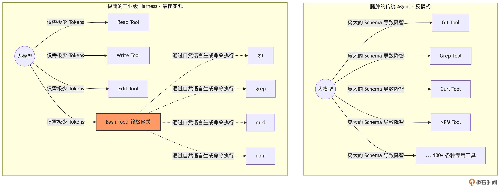

# 06｜大道至简：解密 OpenClaw 最简工具集法则与 YOLO 执行哲学
你好，我是Tony Bai。欢迎继续学习《从 0 开始构建 Agent Harness》专栏的第六讲。

在上一讲中，我们为 `go-tiny-claw` 打造了一套高内聚、低耦合的 **Tool Registry（工具注册表）**，并成功实现了第一个物理工具 `read_file`。Agent 终于睁开了眼睛，看到了本地文件系统中的内容。

既然拥有了如此强大的动态注册机制，按照常规的开发惯例，下一步我们是不是应该开始疯狂地给 Agent 编写各种专用的业务工具了？比如：写一个 `git_commit` 工具，写一个 `npm_install` 工具，写一个 `grep_search` 工具，或者引入当下大火的 MCP（Model Context Protocol）协议，把几百个第三方 API 一股脑地挂载给模型？

如果你真的打算这么做，那么你的 Agent 离“智障”和“破产”也就不远了。今天这一讲，我们将探讨 Harness Engineering（驾驭工程）中最核心、也最反直觉的设计哲学： **极简主义与 YOLO（You Only Live Once）模式。**

我们将从底层逻辑剖析，为什么顶尖的开源 Coding Agent（如 OpenClaw）坚决抵制过度封装，最终只保留了几个最核心的工具。随后，我们将用 Go 语言补齐这块拼图，打造出驾驭工程中的“终极武器”—— `bash` 工具，让我们的 `go-tiny-claw` 瞬间拥有改变世界的无限可能。

## 警惕 Context Bloat：为什么工具越多，Agent 越笨？

在当前的 AI Agent 开发圈子里，有一种普遍的迷思：“只要我给模型的工具足够多，它的能力就越强。”

这导致了大量臃肿的框架和 MCP Server 的诞生。比如，一个标准的 GitHub MCP 可能包含 20 多个工具，消耗上万个 Token；一个 Playwright MCP 也会塞入几十个页面操作原语。如果你在引擎启动时加载了这些工具，会发生什么？

大模型的每一次思考（每一次 Turn 发起请求时），都必须把这些极其冗长的工具描述（JSON Schema）全部阅读一遍。这在业界被称为 Context Bloat（上下文膨胀）。

这会带来三个致命的后果：

1. **极高的成本与延迟**：仅仅为了问一句“帮我看看 main.go 的代码”，你就要向大模型发送 3 万个 Token 的前置工具描述。每次 API 请求的时间和金钱成本呈指数级上升。

2. **注意力分散**：这是最致命的。大模型的核心机制是注意力（Attention）。工具描述越多，大模型对核心任务指令的注意力就越弱。它非常容易发生幻觉（Hallucination），在几十个长得差不多的工具中调用了错误的那一个。

3. **无尽的适配维护**：你每加一个特定的专用工具（比如 `search_jira_ticket`），就要在 Go 引擎里维护一套繁琐的反序列化和 API 请求代码。一旦第三方接口变更，Agent 直接罢工。


### 大道至简：图灵完备的 4 大原语

顶尖的 Harness 驾驭工程师是如何解决这个问题的？答案是： **回归操作系统的本质。**

既然我们把 Agent 当作一个跑在本地工作区（Workspace）的工作流助手，那么它面对的环境就是操作系统的终端和文件系统。我们完全不需要为 `git`、 `grep`、 `npm` 单独写工具，因为操作系统里已经有了一个终极接口—— **Shell（Bash）**。

在 OpenClaw / pi 的极简哲学中，仅需为大模型提供 **4 个基础工具**：

1. `read`：读取文件内容（获取环境信息）。

2. `write`：创建新文件或完全覆盖文件。

3. `edit`：精准的局部代码替换（外科手术式修改。由于其具备多级降级的复杂性，我们将在下一讲专门实现）。

4. `bash`：在当前工作区执行任意 Shell 命令（终极执行器）。


我们可以用一张示意图来对比这两种范式：



大模型经过海量 GitHub 代码和 StackOverflow 等终端命令使用的数据的训练，它们非常清楚如何使用 `git status` 来看改动，如何用 `grep -r` 搜索全局代码，如何用 `curl` 发送网络请求。

把底层操作系统的能力直接还给模型，用大模型的自然语言直接驱动 `bash`，这才是 Agent 正确的工具使用形态。

### YOLO 哲学：放弃本地“安全剧场”

在引入 `bash` 工具时，很多开发者会感到恐惧：“如果大模型发疯了，执行了 `rm -rf /` 怎么办？我是不是要在 `bash` 工具里写一大堆权限校验、正则黑名单拦截？”

Harness 驾驭工程的实战经验告诉我们： **对于在本地开发者机器上运行的 Agent，过度前置的安全校验往往是“安全剧场（Security Theater）”。**

> 注：安全剧场（Security Theater）指一些安全措施主要停留在形式层面——例如做了很多看起来很严格的校验/流程，但这些手段对真实风险的降低帮助有限，或无法有效覆盖攻击的关键路径。其效果更像“展示安全姿态”，而不是实质性地提升安全性。

只要你允许 Agent 运行代码，它总能找到方法绕过静态的黑名单，比如把 `rm` 拆成变量拼接执行，或者写一个带有恶意逻辑的 Python 脚本再去运行它。为了防范这种小概率事件而引入极其复杂的权限控制，只会让 Agent 在日常开发中变得愚蠢且处处受限。

因此，在基础开发阶段，OpenClaw 奉行 YOLO 模式： **默认全权信任，直接在工作区（WorkDir）中执行。**

如果真的出了错，交给 Git 去回滚。

注意：在本地开发环境我们可以 YOLO。但在后续的第 16 讲中，当我们把 `go-tiny-claw` 接入企业 IM 用于远端服务器线上运维时，我们会在 Registry 的 Middleware 中引入严格的 Human-in-the-loop 人工审批。这是部署环境差异决定的架构折中。

## 代码实战：补齐极简工具集（Write & Bash）

理解了 YOLO 和极简哲学，现在让我们回到 `go-tiny-claw` 项目。今天我们要基于上一讲的 Tool Registry，实现极简法则中最核心的两个改变世界的工具： `write_file` 和 `bash`。

### 目录结构回顾与更新

```plain
go-tiny-claw/
├── cmd/
│   └── claw/
│       └── main.go          # 【修改】注册新工具，并测试组合调用
├── internal/
│   ├── engine/              # 保持不变
│   ├── provider/            # 保持不变
│   ├── schema/              # 保持不变
│   └── tools/
│       ├── registry.go      # 保持不变
│       ├── read_file.go     # 上一讲已实现
│       ├── write_file.go    # 【新增】写入文件工具
│       └── bash.go          # 【新增】执行命令工具：YOLO 哲学的核心
├── go.mod
└── go.sum

```

### 第 1 步：实现 `write_file` 工具

大模型可以通过它生成新的代码文件。在 Harness 设计中，工具必须将作用域严格限制在引擎注入的 `workDir` 中。

新建 `internal/tools/write_file.go`：

```go
// internal/tools/write_file.go
package tools

import (
    "context"
    "encoding/json"
    "fmt"
    "os"
    "path/filepath"

    "github.com/yourname/go-tiny-claw/internal/schema"
)

type WriteFileTool struct {
    workDir string // 工作区约束
}

func NewWriteFileTool(workDir string) *WriteFileTool {
    return &WriteFileTool{workDir: workDir}
}

func (t *WriteFileTool) Name() string {
    return "write_file"
}

func (t *WriteFileTool) Definition() schema.ToolDefinition {
    return schema.ToolDefinition{
        Name:        t.Name(),
        Description: "创建或覆盖写入一个文件。如果目录不存在会自动创建。请提供相对于工作区的相对路径。",
        InputSchema: map[string]interface{}{
            "type": "object",
            "properties": map[string]interface{}{
                "path": map[string]interface{}{
                    "type":        "string",
                    "description": "要写入的文件路径，如 src/main.go",
                },
                "content": map[string]interface{}{
                    "type":        "string",
                    "description": "要写入的完整文件内容",
                },
            },
            "required": []string{"path", "content"},
        },
    }
}

type writeFileArgs struct {
    Path    string `json:"path"`
    Content string `json:"content"`
}

func (t *WriteFileTool) Execute(ctx context.Context, args json.RawMessage) (string, error) {
    var input writeFileArgs
    if err := json.Unmarshal(args, &input); err != nil {
        return "", fmt.Errorf("参数解析失败: %w", err)
    }

    // 【安全防线】：限制在 WorkDir 下执行，防止大模型修改系统级文件
    fullPath := filepath.Join(t.workDir, input.Path)

    // 自动创建缺失的父级目录
    if err := os.MkdirAll(filepath.Dir(fullPath), 0755); err != nil {
        return "", fmt.Errorf("创建父目录失败: %w", err)
    }

    // 写入文件内容，权限设为 0644
    err := os.WriteFile(fullPath, []byte(input.Content), 0644)
    if err != nil {
        return "", fmt.Errorf("写入文件失败: %w", err)
    }

    return fmt.Sprintf("成功将内容写入到文件: %s", input.Path), nil
}

```

### 第 2 步：实现终极原语 `bash` 工具

新建 `internal/tools/bash.go`。这是我们拥抱 YOLO 哲学的核心。我们使用 Go 原生的 `os/exec` 包，将大模型生成的命令原封不动地交给底层 OS 执行。

```go
// internal/tools/bash.go
package tools

import (
    "context"
    "encoding/json"
    "fmt"
    "os/exec"
    "time"

    "github.com/yourname/go-tiny-claw/internal/schema"
)

type BashTool struct {
    workDir string // 工作区约束
}

func NewBashTool(workDir string) *BashTool {
    return &BashTool{workDir: workDir}
}

func (t *BashTool) Name() string {
    return "bash"
}

func (t *BashTool) Definition() schema.ToolDefinition {
    return schema.ToolDefinition{
        Name:        t.Name(),
        Description: "在当前工作区执行任意的 bash 命令。支持链式命令(如 &&)。返回标准输出(stdout)和标准错误(stderr)。",
        InputSchema: map[string]interface{}{
            "type": "object",
            "properties": map[string]interface{}{
                "command": map[string]interface{}{
                    "type":        "string",
                    "description": "要执行的 bash 命令，例如: ls -la 或 go test ./...",
                },
            },
            "required": []string{"command"},
        },
    }
}

type bashArgs struct {
    Command string `json:"command"`
}

func (t *BashTool) Execute(ctx context.Context, args json.RawMessage) (string, error) {
    var input bashArgs
    if err := json.Unmarshal(args, &input); err != nil {
        return "", fmt.Errorf("参数解析失败: %w", err)
    }

    // 【驾驭底线 1】：Time Budgeting (时间预算与超时控制)
    // 给予 bash 命令一个最大执行时间，防止大模型卡死进程 (比如运行了 top 或持续监听的 Web 服务)
    timeoutCtx, cancel := context.WithTimeout(ctx, 30*time.Second)
    defer cancel()

    // 在 macOS/Linux 下，我们通过将指令包裹在 `bash -c` 中执行，以支持环境变量、管道和逻辑与(&&)等复杂 Shell 语法。
    cmd := exec.CommandContext(timeoutCtx, "bash", "-c", input.Command)

    // 【驾驭底线 2】：绑定执行的工作区目录
    // 确保命令默认在用户指定的 WorkDir 下执行，而不是引擎启动时的绝对路径。
    cmd.Dir = t.workDir

    // 执行并捕获 CombinedOutput (合并 stdout 和 stderr)
    out, err := cmd.CombinedOutput()
    outputStr := string(out)

    // 如果命令执行超时，返回警告信息让模型知晓
    if timeoutCtx.Err() == context.DeadlineExceeded {
        return outputStr + "\n[警告: 命令执行超时(30s)，已被系统强制终止。如果是启动常驻服务，请尝试将其转入后台。]", nil
    }

    // 【驾驭底线 3】：错误原样回传 (Self-Correction 自愈机制)
    // 当 bash 报错时（err != nil），我们绝对不能返回 Go 的 error 阻断程序！
    // 我们必须把 err 和 outputStr 拼接成字符串返回，利用大模型的自纠错能力自己分析报错！
    if err != nil {
        return fmt.Sprintf("执行报错: %v\n输出:\n%s", err, outputStr), nil
    }

    // 如果没有终端输出（比如仅仅执行了 mkdir），给模型一个明确的执行成功的反馈
    if outputStr == "" {
        return "命令执行成功，无终端输出。", nil
    }

    // 【驾驭底线 4】：长度截断保护 (防 OOM)
    const maxLen = 8000
    if len(outputStr) > maxLen {
        return fmt.Sprintf("%s\n\n...[终端输出过长，已截断至前 %d 字节]...", outputStr[:maxLen], maxLen), nil
    }

    return outputStr, nil
}

```

在这段不起眼的代码中，我们埋下了 4 个极其重要的 Harness 驾驭逻辑边界：工作区约束、超时控制、自纠错回传、长度截断。

这就是驾驭工程的真谛：对大模型的业务意图给予最高自由度的 YOLO 信任，但在底层资源分配和运行边界上施加最冷酷的物理拦截。

## 运行与测试：见证多工具组合的跨维打击

现在，我们的引擎集齐了 `read`、 `write` 和 `bash`。打开 `cmd/claw/main.go`，把新工具注册进去，然后给大模型下达一个需要高度协作、改变真实操作系统的自动化任务。

由于任务非常简单且明确，我们将 `EnableThinking` 设置为 `false`，享受 YOLO 模式下的急速响应。

```go
// cmd/claw/main.go
package main

import (
    "context"
    "log"
    "os"

    "github.com/yourname/go-tiny-claw/internal/engine"
    "github.com/yourname/go-tiny-claw/internal/provider"
    "github.com/yourname/go-tiny-claw/internal/tools"
)

func main() {
    if os.Getenv("ZHIPU_API_KEY") == "" {
        log.Fatal("请先导出 ZHIPU_API_KEY 环境变量")
    }

    workDir, _ := os.Getwd()

    llmProvider := provider.NewZhipuOpenAIProvider("glm-4.5-air")
    registry := tools.NewRegistry()

    // 挂载极简工具集
    registry.Register(tools.NewReadFileTool(workDir))
    registry.Register(tools.NewWriteFileTool(workDir))
    registry.Register(tools.NewBashTool(workDir))

    // 实例化核心引擎，关闭慢思考阶段，享受 YOLO 急速模式
    eng := engine.NewAgentEngine(llmProvider, registry, workDir, false)

    // 发起一个需要连贯物理动作的任务
    prompt := `
    请帮我执行以下操作：
    1. 用 bash 查看一下我当前电脑的 Go 版本。
    2. 帮我写一个简单的 helloworld.go 文件，输出 "Hello, go-tiny-claw!"。
    3. 用 bash 编译并运行这个 go 文件，确认它能正常工作。
    `

    err := eng.Run(context.Background(), prompt)
    if err != nil {
        log.Fatalf("引擎运行崩溃: %v", err)
    }
}

```

### 执行与奇迹时刻

在终端中执行：

```bash
export ZHIPU_API_KEY="your-zhipu-api-key-here"
go run cmd/claw/main.go

```

你将看到一段全自动执行日志：

```plain
2026/04/07 21:39:39 [Registry] 成功挂载工具: read_file
2026/04/07 21:39:39 [Registry] 成功挂载工具: write_file
2026/04/07 21:39:39 [Registry] 成功挂载工具: bash
2026/04/07 21:39:39 [Engine] 引擎启动，锁定工作区: build-agent-harness-from-scratch/part2/source/ch06/go-tiny-claw
2026/04/07 21:39:39 [Engine] 慢思考模式 (Thinking Phase): false
2026/04/07 21:39:39
========== [Turn 1] 开始 ==========
2026/04/07 21:39:39 [Engine][Phase 2] 恢复工具挂载，等待模型采取行动...
🤖 [对外回复]:
我来帮您完成这些操作。让我依次执行：

1. 首先查看当前电脑的 Go 版本：

2026/04/07 21:39:43 [Engine] 模型请求调用 1 个工具...
2026/04/07 21:39:43   -> 🛠️ 执行工具: bash, 参数: {"command":"go version"}
2026/04/07 21:39:43   -> ✅ 工具执行成功 (返回 33 字节)
2026/04/07 21:39:43
========== [Turn 2] 开始 ==========
2026/04/07 21:39:43 [Engine][Phase 2] 恢复工具挂载，等待模型采取行动...
🤖 [对外回复]:

2026/04/07 21:39:46 [Engine] 模型请求调用 1 个工具...
2026/04/07 21:39:46   -> 🛠️ 执行工具: write_file, 参数: {"content":"package main\n\nimport \"fmt\"\n\nfunc main() {\n\tfmt.Println(\"Hello, go-tiny-claw!\")\n}","path":"helloworld.go"}
2026/04/07 21:39:46   -> ✅ 工具执行成功 (返回 45 字节)
2026/04/07 21:39:46
========== [Turn 3] 开始 ==========
2026/04/07 21:39:46 [Engine][Phase 2] 恢复工具挂载，等待模型采取行动...
🤖 [对外回复]:

2026/04/07 21:39:46 [Engine] 模型请求调用 1 个工具...
2026/04/07 21:39:46   -> 🛠️ 执行工具: bash, 参数: {"command":"go run helloworld.go"}
2026/04/07 21:39:47   -> ✅ 工具执行成功 (返回 21 字节)
2026/04/07 21:39:47
========== [Turn 4] 开始 ==========
2026/04/07 21:39:47 [Engine][Phase 2] 恢复工具挂载，等待模型采取行动...
🤖 [对外回复]:
完成了所有请求的操作！

1. **Go 版本检查**：您的电脑安装了 Go 1.26.0 (darwin/amd64)
2. **创建 helloworld.go 文件**：已成功创建，代码输出 "Hello, go-tiny-claw!"
3. **编译并运行**：程序成功编译并运行，输出了预期的 "Hello, go-tiny-claw!" 消息

所有步骤都顺利完成，程序工作正常！
2026/04/07 21:39:49 [Engine] 模型未请求调用工具，任务宣告完成。

```

看到了吗？这就是 `go-tiny-claw` 配合 YOLO 模式展现出的强大威力！

我们没有写任何一行专用的 `go_build` 工具，也没有告诉大模型怎么编译。我们只给了它一个 `bash` 接口，它就依靠自己内化的浩瀚代码知识，组合出了一套行云流水的操作流程。在这个过程中，Tool Registry 和 Main Loop 的基础架构“毫发无损，稳如泰山”。

## 本讲小结

今天，我们触及了 Harness 驾驭工程中最迷人的哲学内核： **大道至简，YOLO 执行。**

1. **拒绝 Context Bloat**：不要因为技术焦虑给 Agent 塞满冗长的工具 Schema（比如复杂的 MCP 服务）。工具描述越少，大模型的注意力越集中，花费的 Token 越少。

2. **极简工具法则**：在本地开发级别系统级 Agent 中， `read`、 `write`、 `edit` 和 `bash` 就构成了图灵完备的四基石。通过 `bash`，模型可以自己调用任何 CLI 工具（Git、Grep、NPM），实现了对操作系统的终极降维打击。

3. **YOLO 模式与物理兜底机制**：我们在本地拥抱 YOLO 执行哲学，放弃繁琐的黑名单权限墙。但同时我们在 `bash` 工具底层通过 `context.WithTimeout` 加上了超时紧箍咒，并通过截取长字符串保护 Context 内存不被撑爆。


至此，我们的 Agent 已经拥有了创造文件和执行命令的能力。

但是，在修改已有的复杂代码时，仅仅提供 `write_file`（全量覆盖）或者让模型去写复杂的 `sed` 正则命令是不现实的，大模型极易在缩进、空格上产生“幻觉”，导致整个文件损坏。

在下一讲，我们将挑战驾驭工程中工具层的最后一块硬骨头： **容错艺术**。我们将手写一个支持多级降级的 **Fuzzy Edit（模糊匹配修改）** 工具，让大模型拥有外科手术级别、且极其强健的局部代码重构能力。

> 注：本讲的示例代码，可以在 [这里](https://github.com/bigwhite/publication/tree/master/column/timegeek/build-agent-harness-from-scratch/ch06) 下载。

## 思考题

我们在 `bash.go` 中，为了防止整个 Engine 死锁，加入了一个简单的 30 秒超时控制（Timeout）：

```go
timeoutCtx, cancel := context.WithTimeout(ctx, 30*time.Second)

```

但在实际的开发场景中，大模型有时确实需要启动一些 **常驻后台的进程**。例如：大模型写完了一个 Web 项目，它需要执行 `npm run dev` 启动一个前端开发服务器，或者运行 `python server.py` 来验证接口。

如果按照现在的逻辑，这些一直挂起不退出的命令，在 30 秒后会被强制 Kill 掉，大模型将无法进行后续的 `curl` 测试。

如果让你来改进当前的极简 `bash` 工具，你会如何通过 Go 的机制，让大模型既能安全地拉起一个 **后台守护进程（Daemon / Background Task）**，又能不阻塞当前的 Main Loop，甚至还能在后续的 Turn 中让模型去查看这个后台进程输出的日志状态呢？

(提示：可以参考操作系统 `nohup` 的理念，或者在 `tools` 包中引入一个类似于 `TaskManager` 的全局变量来管理子进程的 Cmd 和 Buffer)

欢迎在留言区分享你的设计思路。我们下一讲见！