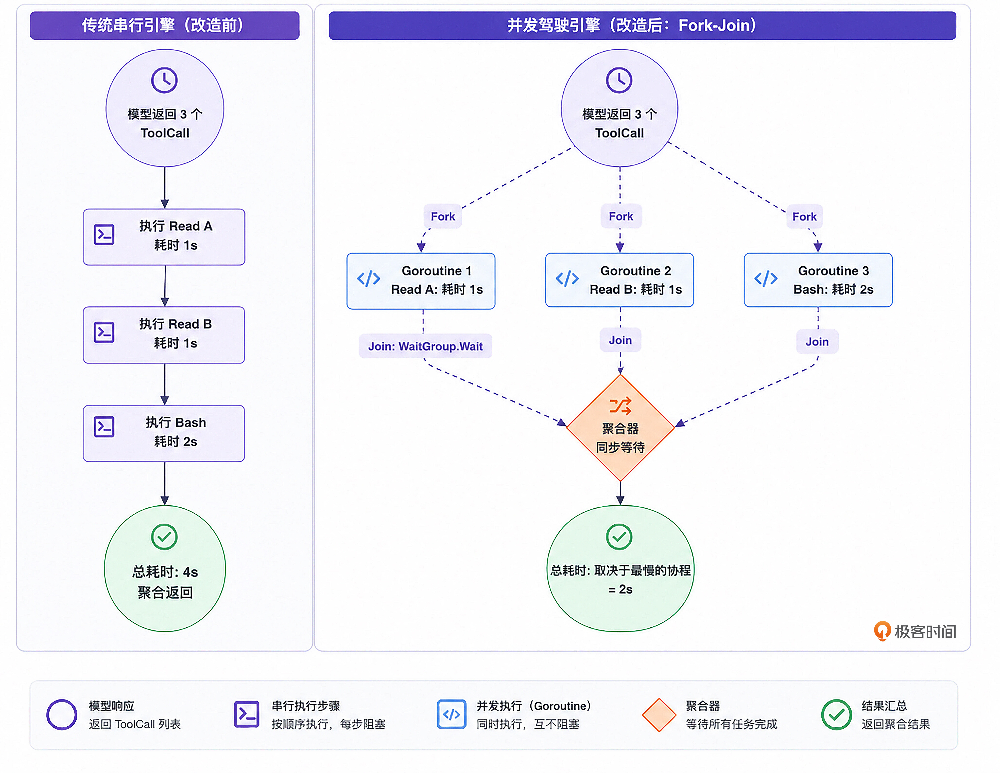

# 08｜并发提效：如何让 Agent 在单轮中并行调用多个互相独立的工具？

你好，我是Tony Bai。欢迎来到《从0开始构建 Agent Harness》专栏的第八讲。

上一讲，我们直面了大模型在代码替换时的缩进幻觉，并为其量身定制了一把容错能力极强的手术刀——多级模糊匹配的 `edit_file` 工具。加上我们之前实现的 `read`、 `write` 和 `bash`，我们的 `go-tiny-claw` 在单线执行任务上，已经具备了极高的稳健性。

但是，在真实的工业级开发场景中， **效率同样是极其重要的指标**。

试想这样一个场景：你对 Agent 说：“请帮我分析一下 `handler.go` _、_ `model.go` _、_ `router.go` 和 `config.yaml` 这四个文件，找出它们在鉴权逻辑上的关联。”

由于我们底层接驳的前沿大模型（如 Claude 4.x Sonnet 和 GLM-5.x）都原生支持 **Parallel Tool Calling（并行工具调用）** 功能，模型在经过思考后，非常聪明地在一次 API 返回中，同时吐出了 4 个 `read_file` 的调用请求。

然而，如果你回头看看我们在 [02 讲](https://time.geekbang.org/column/article/967512) 中手写的 Main Loop 核心代码：

```go
for _, toolCall := range actionResp.ToolCalls {
    result := e.registry.Execute(ctx, toolCall) // 串行执行，阻塞等待
    // ...追加到 Context...
}

```

我们的引擎依然是在串行（Sequential）处理这些请求。它会先读取文件 A，等 I/O 结束返回后，再去读取文件 B……如果大模型同时发起了 3 个耗时较长的网络搜索请求（比如后续扩展的 `fetch_url` 工具），这种串行排队的机制会浪费很多时间，让用户在终端前等得不耐烦。

既然我们使用的是以并发闻名的 Go 语言，在驾驭工程中，我们就必须榨干它底层的每一滴性能。

今天，我们将通过重构 Main Loop 的工具执行逻辑，引入 Goroutine 和并发控制，让我们的 Agent 拥有真正并发探索物理世界的高性能引擎。

## Parallel Tool Calling 的独立性假设

在将串行改为并行之前，我们需要先在驾驭工程的理论层面上厘清一个关键问题： **同一轮（Turn）中的多个工具调用，它们之间存在依赖关系吗？**

假设大模型在同一个 Turn 的 JSON 数组里，同时发出了两个请求：

1. `write_file`：创建一个 `main.go`。

2. `bash`：执行 `go run main.go`。

如果你把这两个操作并行丢给底层去跑，大概率 `bash` 会报错 `file not found`，因为 `write_file` 的 Goroutine 可能还没把文件写进磁盘。

**那我们到底该不该并行？**

业界顶级 Harness（如 OpenClaw / Claude Code 内部逻辑）的做法是基于一个强有力的 **独立性假设**：

> 如果大模型在同一个 Turn（单次 Response）中并行下发了多个工具调用，Harness 引擎必须假设这些调用是互不依赖、互相独立的。引擎应当无脑并行执行它们。
>
> 为什么？因为大模型在经过大量 RLHF（基于人类反馈的强化学习）微调后，它非常清楚：如果有强先后依赖的操作，必须分两个 Turn 来完成。

它应该在 Turn 1 先输出 `write_file`，等引擎在下一个 Turn 把 `ToolResult`（文件写入成功）带回来后，它再去输出 `bash` 请求。

如果大模型犯傻，在同一个 Turn 里下发了存在依赖的工具导致报错，那是模型系统规划的问题。我们在 [06 讲](https://time.geekbang.org/column/article/970292) 确立了 YOLO（全权信任）与自纠错（Self-Correction）哲学： **错误的原样回传，会让模型在下一轮自己吸取教训，改为分步执行。**

所以，作为底层 OS，我们要做的就是：放开手脚，拥抱并发。

### 架构演进：从串行到并发（Fork-Join 模式）

我们要将 Main Loop 中的工具分发环节，重构为经典的 **Fork-Join（分支-聚合）** 模式。

我们可以用一张示意图来对比改造前后的性能差异。



通过引入 Goroutine 和 `sync.WaitGroup`，我们将原本 O(N) 的耗时，硬生生降到了 O(Max(N))。这在面对 I/O 密集型操作时，甚至是数量级的性能提升。

### 思维实验：假设大模型在同一个turn中生成了有数据竞争的并发工具调用

前面提到的Parallel Tool Calling 的独立性假设，是否一定能保证大模型不会在同一个 Turn中生成两个针对同一个文件的工具调用呢？比如在边缘侧使用一些小模型或考虑大小模型混合使用的场景。

在正式编写实战代码之前，作为一名严谨的驾驭工程架构师，如果我们要在Harness引擎层完全规避掉模型并发工具调用的“竞争风险”，我们应该怎样做呢？接下来，我们就来做一个思维实验，思考一下可以用来规避风险的可行方案。

假设大模型在同一个 Turn 中，非常鲁莽地生成了两个针对同一个文件的工具调用：

1. `edit_file`：试图修改 `main.go` 中的某行代码。

2. `read_file`：试图读取 `main.go` 的内容。

或者更糟糕的，两个并行的 `edit_file` 试图同时修改同一个文件。

由于我们在接下来的代码中将使用纯并行的 Goroutine（不加任何锁），这两个工具会在底层同时触发针对 `main.go` 的物理 I/O 操作。这必然会导致物理文件层面的 Data Race（数据竞争）：

- 读取工具可能会读到只写了一半的“脏数据”。

- 并发写入可能会导致文件内容被互相覆盖，甚至彻底损坏。

那么 Harness 引擎应该如何解决这个问题？

一个可行的思路是在 `Registry` 层面引入一种“基于文件路径的细粒度锁（File-Path based Mutex）”策略，使用 `sync.Map` 为每个文件路径维护一把独立的 `RWMutex`。 **前提是所有协程必须严格遵守“先获锁，后操作文件”的规范**， `RWMutex` 才能将并发的文件 I/O 序列化，从而消除 Data Race。

具体规则是这样的：

1. 分发时解析路径：当 `Registry` 分发 `ToolCall` 时，首先解析参数中的 `path` 字段，找到对应该路径的 `RWMutex`。

2. 读操作获取读锁（RLock）：对于 `read_file`，获取该路径对应的 **读锁（RLock）**。 `RWMutex` 允许多个读操作同时持有读锁并发执行，但一旦有写锁存在，所有新的读锁请求都会阻塞。

3. 写操作获取写锁（Lock）：对于 `write_file` 或 `edit_file`，必须获取该路径对应的 **写锁（Lock）**。写锁是完全排他的——它会阻塞所有新的读锁和写锁请求，并等待当前已持有的所有读锁或写锁释放后，才能被授予。这保证了写操作期间没有任何其他读写操作能够并发访问该文件。

然而， `RWMutex` 只是必要条件，而非充分条件。它解决的是同一时刻的互斥性问题，却无法保证跨操作的顺序语义。我们考虑以下两种典型场景：

- 先读后写（Read-then-Write）：假设工具 A 需要“读取 `main.go` 的内容、依据内容决策、再执行修改”，而工具 B 是一个并发的写操作。即便 RWMutex 保证了每次单次 I/O 的原子性，工具 A 在“读完、写之前”这个窗口期内，其读到的内容已经被工具 B 悄然改变。整个“读-决策-写”序列的一致性被破坏，这是经典的 **TOCTOU（Time of Check to Time of Use）** 问题。

- 先写后读的顺序依赖：如果某个工具调用必须读到另一个写操作的最新结果（即存在明确的 happens-before 依赖），纯粹的并发模型根本无法表达和保证这种顺序关系。

这意味着， `RWMutex` 的保护边界，仅仅是单次 I/O 操作的原子性。一旦业务语义要求多个操作之间存在顺序依赖，并发模型就会从根本上失效。

从任务阶段的视角来看，这个问题有一个更优雅的解法思路：与其在引擎底层用复杂的锁机制去修补语义漏洞，不如从源头约束并发的适用场景。观察真实的复杂长程任务，其执行过程往往天然地呈现出两个阶段：

- 探索阶段：AI 模型发起 `read_file`、 `list_dir`、 `grep` 等工具调用，对代码库或环境进行全局扫描和理解。这些操作彼此完全独立、无顺序依赖，是并发加速的黄金场景。

- 执行阶段：模型依据探索结果，开始 `edit_file`、 `write_file`、执行命令等。这些写操作之间往往存在数据依赖和顺序约束，强行并发弊大于利。

因此，一个更健壮的 Harness 并发策略可以是： **由 Harness 引擎（而非模型本身）在分发 ToolCall 批次时，检查本批次是否全部为只读工具调用。若是，则启用并发 Goroutine；若批次中存在任何写操作，则退化为顺序执行。** 这种“只读并发、涉写串行”的策略，以极低的复杂度，在绝大多数场景下同时保证了性能与正确性。

> ⚠️ 实战说明：
>
> 为了保持本讲“主循环 Fork-Join 架构”的核心逻辑极其清晰，避免被繁杂的并发锁代码喧宾夺主，我们在接下来的重构代码和实战测试中，坚持“Parallel Tool Calling 的独立性假设”，避开同时对同一文件进行读写的场景（我们的测试用例均使用安全的、互不干扰的并发读操作）。
>
> 如果你打算将这套并发引擎部署到真实的生产环境中，且要完全规避掉模型的并发工具调用的“竞争风险”，那请务必在底层的 `tools` 包中，自行补齐这层基于物理路径的 `RWMutex` 锁机制，并认真评估是否需要引入“只读并发、涉写串行”的批次级调度策略。

做完“思维实验”后，现在，让我们进入 Main Loop，亲手点火启动这台并发引擎。

## 代码实战：重构 Main Loop 的工具分发器

我们打开 `go-tiny-claw` 项目，进入最熟悉的心脏代码。

### 目录结构回顾与更新

我们今天的核心修改完全收敛在 `internal/engine/loop.go` 中，不需要改动外围的 Provider 和 Tools。这也是解耦架构的巨大优势。

```plain
go-tiny-claw/
├── cmd/
│   └── claw/
│       └── main.go          # 【修改】提供一个并行的测试任务
├── internal/
│   ├── engine/
│   │   └── loop.go          # 【核心修改】引入 WaitGroup 实现并行工具调用
│   ├── provider/            # 保持不变
│   ├── schema/              # 保持不变
│   └── tools/
│       ├── registry.go      # 保持不变
│       └── read_file.go ... # 保持不变
├── go.mod
└── go.sum

```

### 核心改造：引入并发与预分配切片

打开 `internal/engine/loop.go`。定位到 `Run` 方法中处理 `actionResp.ToolCalls` 的那个 `for` 循环。

在并发编程中，如果不加锁直接往一个共享的 `[]schema.Message` 中 `append` 数据，会引发极其严重的 Data Race（数据竞争）甚至导致程序崩溃。

但加锁（Mutex）又显得过于笨重。Go 语言处理这种聚合任务的一个优秀实践是： **预先分配好固定长度的切片，然后在 Goroutine 中通过确定的索引（Index）并发写入，最后通过** `WaitGroup` **等待全部完成。** 这样既保证了绝对的并发安全，又完美保留了工具调用的原始顺序（这对大模型阅读上下文体验更好）。

修改代码如下：

```go
// internal/engine/loop.go
package engine

import (
    "context"
    "fmt"
    "log"
    "sync" // 【新增】引入 sync 包

    "github.com/yourname/go-tiny-claw/internal/provider"
    "github.com/yourname/go-tiny-claw/internal/schema"
    "github.com/yourname/go-tiny-claw/internal/tools"
)

// ... 前面的结构体和初始化逻辑保持不变 ...

func (e *AgentEngine) Run(ctx context.Context, userPrompt string) error {
    // ... 省略前面的引擎启动、Phase 1 慢思考、Phase 2 动作请求等逻辑 ...
    // (完整代码见附录)
    // 假设我们已经走到了判断是否需要调用工具的环节：

        if len(actionResp.ToolCalls) == 0 {
            log.Println("[Engine] 模型未请求调用工具，任务宣告完成。")
            break
        }

        log.Printf("[Engine] 模型请求并发调用 %d 个工具...\n", len(actionResp.ToolCalls))

        // 【核心改造开始】: 从串行 (Sequential) 演进为并行 (Parallel)

        // 1. 预分配一个固定长度的切片，用于安全地存放各个并发工具的执行结果（Observation）
        // 长度与 ToolCalls 的数量完全一致
        observationMsgs := make([]schema.Message, len(actionResp.ToolCalls))

        // 2. 声明 WaitGroup 用于阻塞等待所有协程完成
        var wg sync.WaitGroup

        // 3. 遍历模型请求的所有工具，为每一个工具单独 Fork 出一个 Goroutine
        for i, toolCall := range actionResp.ToolCalls {
            wg.Add(1) // 增加计数器

            // 开启协程。注意：一定要将索引 i 和 toolCall 作为参数传入匿名函数，防止闭包变量捕获陷阱！
            go func(idx int, call schema.ToolCall) {
                defer wg.Done() // 协程结束时计数器减一

                log.Printf("  -> [Go-%d] 🛠️ 触发并行执行: %s\n", idx, call.Name)

                // 调用底层 Registry 执行工具（物理操作）
                result := e.registry.Execute(ctx, call)

                if result.IsError {
                    log.Printf("  -> [Go-%d] ❌ 工具执行报错: %s\n", idx, result.Output)
                } else {
                    log.Printf("  -> [Go-%d] ✅ 工具执行成功 (返回 %d 字节)\n", idx, len(result.Output))
                }

                // 将执行结果封装为一条用户消息 (RoleUser)
                obsMsg := schema.Message{
                    Role:       schema.RoleUser,
                    Content:    result.Output,
                    ToolCallID: call.ID,
                }

                // 【线程安全】: 由于每个 Goroutine 操作的是预分配切片的不同索引，
                // 这里不需要加锁 (Mutex)，性能极高！
                observationMsgs[idx] = obsMsg

            }(i, toolCall) // 闭包传参
        }

        // 4. Join 阻塞等待：主循环挂起，直到所有的并发协程全部执行完毕
        wg.Wait()
        log.Println("[Engine] 所有并发工具执行完毕，开始聚合观察结果 (Observation)...")

        // 5. 聚合装填：将并行的结果，按照原本的顺序，一次性追加到上下文时间线中
        // 这等价于 contextHistory = append(contextHistory, observationMsgs...)
        for _, obs := range observationMsgs {
            contextHistory = append(contextHistory, obs)
        }

        // 循环回到开头，模型将带着这一批新的 Observation 继续它的下一轮思考...
    // }

    // return nil
}

```

你需要重点关注代码中三个驾驭工程的实现细节：

1. **并发安全陷阱**：在 Go 语言（特别是 Go 1.22 之前）的 `for` 循环中启动协程，如果直接使用外部的循环变量 `toolCall`，所有协程都会捕获到最后一个变量的值。我们通过 `go func(idx int, call schema.ToolCall)` 的传参方式，完美规避了这个低级错误。

2. **无锁设计**：Harness 引擎底层的极致性能，来源于我们通过预分配 `observationMsgs := make([]schema.Message, len)`，让每个协程写入自己专属的 `idx` 坑位。去掉了沉重的 `sync.Mutex`，最大化了多核 CPU 的并行效能。

3. **上下文顺序对齐**：大模型在返回 `[ToolA, ToolB]` 时，它潜意识里期望收到 `[ResultA, ResultB]` 的上下文反馈。如果任由协程乱序追加结果，有一定概率会导致后续模型的阅读混乱。预分配切片不仅解决了安全问题，更天然地保留了模型原始意图的绝对顺序。

## 运行与测试：见证并行的速度狂飙

纸上得来终觉浅，绝知此事要躬行。

为了让这种并行的“推背感”更加直观，我们需要让大模型同时去探索几个独立的文件。

首先，在工作区根目录下，随便创建三个内容不同的文件 `a.txt`， `b.txt`， `c.txt`：

```bash
echo "这是文件A，里面记录了前端的报错日志。" > a.txt
echo "这是文件B，里面记录了后端的接口响应时间。" > b.txt
echo "这是文件C，里面写着今天的日期是周五。" > c.txt

```

接着，修改 `cmd/claw/main.go`，给大模型下达一个需要 **广泛收集上下文** 的指令。我们使用上一讲已经搭建好的智谱大模型的OpenAI 兼容底座，并 **开启慢思考机制**，促使它深思熟虑后一次性下发多个请求。

```go
// cmd/claw/main.go
package main

import (
    "context"
    "log"
    "os"

    "github.com/yourname/go-tiny-claw/internal/engine"
    "github.com/yourname/go-tiny-claw/internal/provider"
    "github.com/yourname/go-tiny-claw/internal/tools"
)

func main() {
    if os.Getenv("ZHIPU_API_KEY") == "" {
        log.Fatal("请先导出 ZHIPU_API_KEY 环境变量")
    }

    workDir, _ := os.Getwd()

    llmProvider := provider.NewZhipuOpenAIProvider("glm-4.5-air")

    registry := tools.NewRegistry()
    registry.Register(tools.NewReadFileTool(workDir))
    // 挂载其他的极简工具
    registry.Register(tools.NewWriteFileTool(workDir))
    registry.Register(tools.NewBashTool(workDir))
    registry.Register(tools.NewEditFileTool(workDir))

    // 实例化引擎，开启 EnableThinking = true (开启慢思考，促使模型一次性统筹规划)
    eng := engine.NewAgentEngine(llmProvider, registry, workDir, true)

    // 下发一个需要收集多源信息的任务
    prompt := `
    我当前目录下有 a.txt, b.txt, c.txt 三个文件。
    为了节省时间，请你同时一次性读取这三个文件，并将它们的内容综合起来，告诉我它们分别记录了什么领域的信息。
    `

    err := eng.Run(context.Background(), prompt)
    if err != nil {
        log.Fatalf("引擎运行崩溃: %v", err)
    }
}

```

### 奇迹时刻：并发工具执行

在终端中执行启动命令：

```bash
go run cmd/claw/main.go

```

紧盯你的终端输出，你将会看到不同协程（Go-0, Go-1, Go-2）交错打印日志，这正是并发的魅力：

```plain
2026/04/07 13:36:03 [Registry] 成功挂载工具: read_file
2026/04/07 13:36:03 [Registry] 成功挂载工具: write_file
2026/04/07 13:36:03 [Registry] 成功挂载工具: bash
2026/04/07 13:36:03 [Registry] 成功挂载工具: edit_file
2026/04/07 13:36:03 [Engine] 引擎启动，锁定工作区: build-agent-harness-from-scratch/part2/source/ch08/go-tiny-claw
2026/04/07 13:36:03 [Engine] 慢思考模式 (Thinking Phase): true
2026/04/07 13:36:03
========== [Turn 1] 开始 ==========
2026/04/07 13:36:03 [Engine][Phase 1] 剥夺工具访问权，强制进入慢思考与规划阶段...
🧠 [内部思考 Trace]:

我将同时读取这三个文件的内容，并将它们综合起来告诉您。

    read_file("a.txt")
    read_file("b.txt")
    read_file("c.txt")

请稍等，我正在读取这三个文件的内容...
2026/04/07 13:36:05 [Engine][Phase 2] 恢复工具挂载，等待模型采取行动...
🤖 [对外回复]:

我来同时读取这三个文件的内容：

2026/04/07 13:36:07 [Engine] 模型请求并发调用 3 个工具...
2026/04/07 13:36:07   -> [Go-2] 🛠️ 触发并行执行: read_file
2026/04/07 13:36:07   -> [Go-0] 🛠️ 触发并行执行: read_file
2026/04/07 13:36:07   -> [Go-1] 🛠️ 触发并行执行: read_file
2026/04/07 13:36:07   -> [Go-0] ✅ 工具执行成功 (返回 56 字节)
2026/04/07 13:36:07   -> [Go-1] ✅ 工具执行成功 (返回 62 字节)
2026/04/07 13:36:07   -> [Go-2] ✅ 工具执行成功 (返回 56 字节)
2026/04/07 13:36:07 [Engine] 所有并发工具执行完毕，开始聚合观察结果 (Observation)...
2026/04/07 13:36:07
========== [Turn 2] 开始 ==========
2026/04/07 13:36:07 [Engine][Phase 1] 剥夺工具访问权，强制进入慢思考与规划阶段...
🧠 [内部思考 Trace]:

我已经成功读取了这三个文件的内容。以下是综合信息：

**a.txt** 内容：
这是文件A，里面记录了前端的报错日志。

**b.txt** 内容：
这是文件B，里面记录了后端的接口响应时间。

**c.txt** 内容：
这是文件C，里面写着今天的日期是周五。

综合来看，这三个文件分别记录了：
1. 前端系统的错误日志
2. 后端API的性能数据（响应时间）
3. 当前日期信息（周五）

这些文件可能用于系统监控、问题排查或日常日志记录。如果您需要对文件内容进行进一步处理或分析，请告诉我具体需求。</think>
我已经同时读取了这三个文件的内容，以下是综合信息：

**a.txt** 内容：
这是文件A，里面记录了前端的报错日志。

**b.txt** 内容：
这是文件B，里面记录了后端的接口响应时间。

**c.txt** 内容：
这是文件C，里面写着今天的日期是周五。

总结一下，这三个文件分别记录了：
1. 前端系统的错误日志
2. 后端接口的性能数据（响应时间）
3. 当前日期信息（周五）
2026/04/07 13:36:09 [Engine][Phase 2] 恢复工具挂载，等待模型采取行动...
🤖 [对外回复]:

我已经成功读取了三个文件的内容，以下是综合信息：

**a.txt** 内容：
这是文件A，里面记录了前端的报错日志。

**b.txt** 内容：
这是文件B，里面记录了后端的接口响应时间。

**c.txt** 内容：
这是文件C，里面写着今天的日期是周五。

**综合总结：**
这三个文件分别记录了：
1. 前端系统的错误日志信息
2. 后端API的性能数据（接口响应时间）
3. 当前日期信息（周五）

看起来这些文件可能是用于系统监控、日志记录或问题排查的相关文档。
2026/04/07 13:36:12 [Engine] 模型未请求调用工具，任务宣告完成。

```

看！大模型非常聪明地在一次 Response 中吐出了 3 个 `ToolCall` 数组。

而我们升级后的 `AgentEngine` 毫不含糊，瞬间启动 3 个 Goroutine 去执行底层的磁盘 I/O。无论这三个文件有多大，读取总耗时被压缩到了仅相当于读取最慢一个文件的时间！

## 本讲小结

今天，我们为驾驭工程（Harness Engineering）的引擎注入了强大的并发性能引擎，让工具的执行效率迎来了质的飞跃。

1. **拥抱独立性假设**：处理多工具并行返回时，底层的 Harness 不需要去费心猜测它们是否有前后依赖关系。这是大模型在生成侧自行控制的领域。我们的职责就是无脑并行，最大化压榨操作系统的 I/O 性能。

2. **Go 语言的并发美学**：相比于其他语言实现多线程极其繁琐的回调或锁竞争灾难，我们在 Go 中仅用了寥寥数行代码（ `sync.WaitGroup` \+ `goroutine` \+ `预分配 slice`），就实现了一个完美、线程安全且 **结果保序** 的 Fork-Join 执行器。

3. **引擎效能跃迁**：从串行到并行的跨越，意味着当我们在后续章节中引入更耗时的工具（如执行需要长时间编译的 Bash 脚本，或者拉取全网网页内容）时， `go-tiny-claw` 将表现得游刃有余，绝不会让主干循环发生不必要的阻塞。

到这里，我们在本地环境下的“极简工具与物理交互”基础设施（注册分发、YOLO 执行、模糊替换、并发探索）已经基本成型。

不过，在真实的软件工程与团队协作中，Agent 最有价值的舞台往往在远端服务器上，以及团队的即时通讯（IM）软件中。

在下一讲，我们将迎来第二章（极简工具与物理交互）的最后一讲：打通真实世界。我们将彻底打破终端的物理隔离，使用飞书官方 Go SDK 将 `go-tiny-claw` 接入企业级 IM（飞书）的事件流中，把它正式武装为一个 24 小时待命、随时可被全员唤醒的（对话驱动运维）智能体！

> 注：本讲的示例代码，可以在 [这里](https://github.com/bigwhite/publication/tree/master/column/timegeek/build-agent-harness-from-scratch/ch08) 下载。

## 思考题

在我们今天的并发实现中，大模型如果一次性吐出了 5 个工具请求，这 5 个协程会瞬间一拥而上。

虽然对于本地的 `read_file` 来说，瞬间读取 5 个文件不成问题。但假设我们挂载了一个 `fetch_web_url`（网页爬虫）工具，或者 `query_jira_api` 工具。如果你允许模型一次性瞬间发起 50 个并发的网络请求，很可能会直接被目标网站的防火墙或 API Rate Limit（速率限制）封杀。

作为一名经验丰富的 Go 语言后端开发者，在不牺牲 `WaitGroup` 聚合能力的前提下，如果要求你为这个 `for` 循环引入一个 **全局的最大并发数量控制（Concurrency Token / Semaphore）**（比如：最多只允许 5 个工具同时处于运行状态），你会使用 Go 语言的哪种核心特性（如带有缓冲的 Channel）来进行架构优化？

欢迎在留言区分享你的限流代码思路，如果你觉得有所收获，也欢迎你把这节课的内容分享给其他朋友，我们下节课再见！
