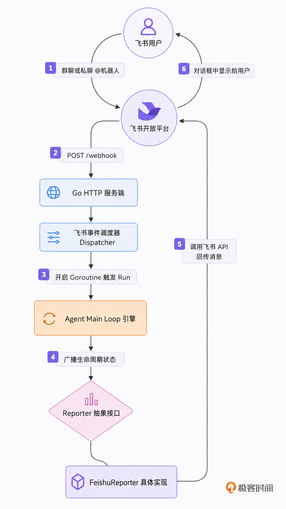
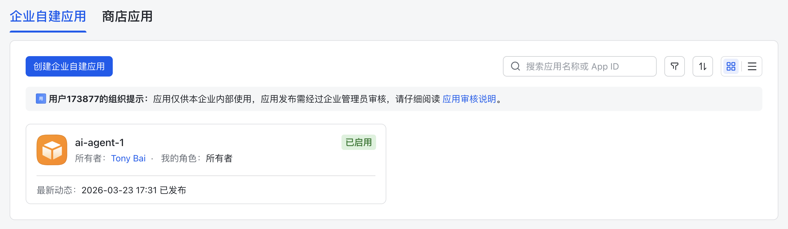
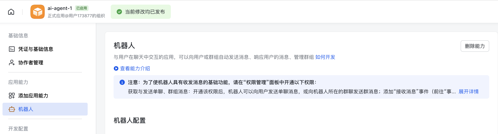
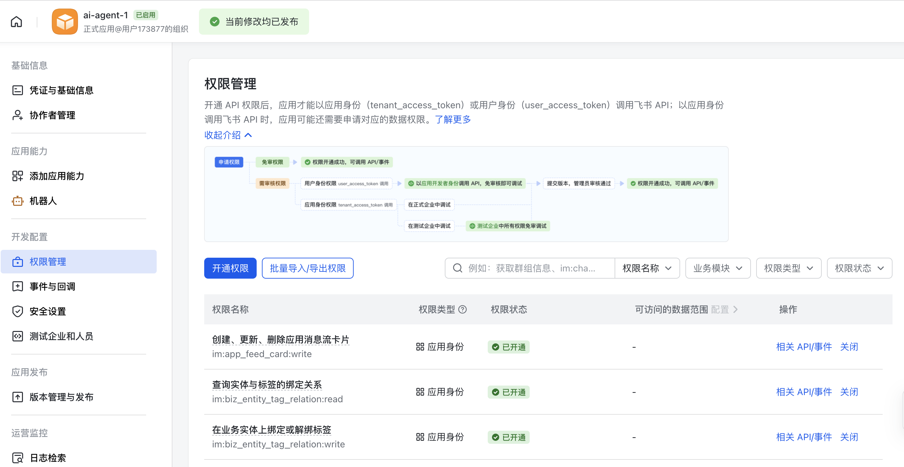
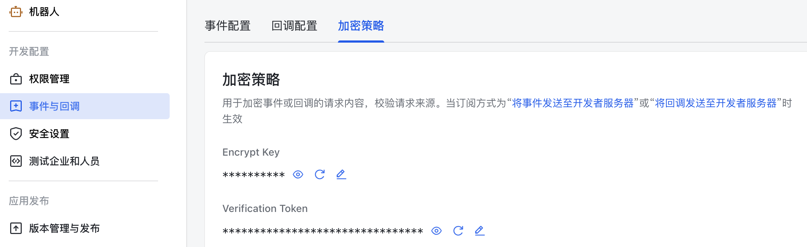
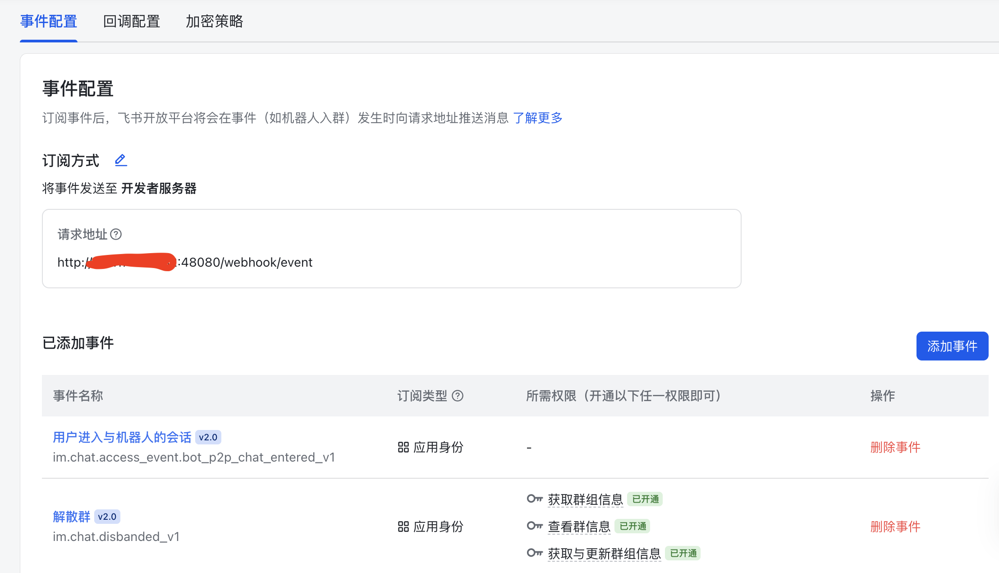
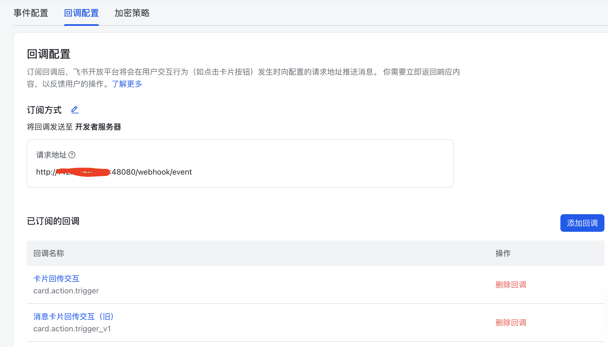
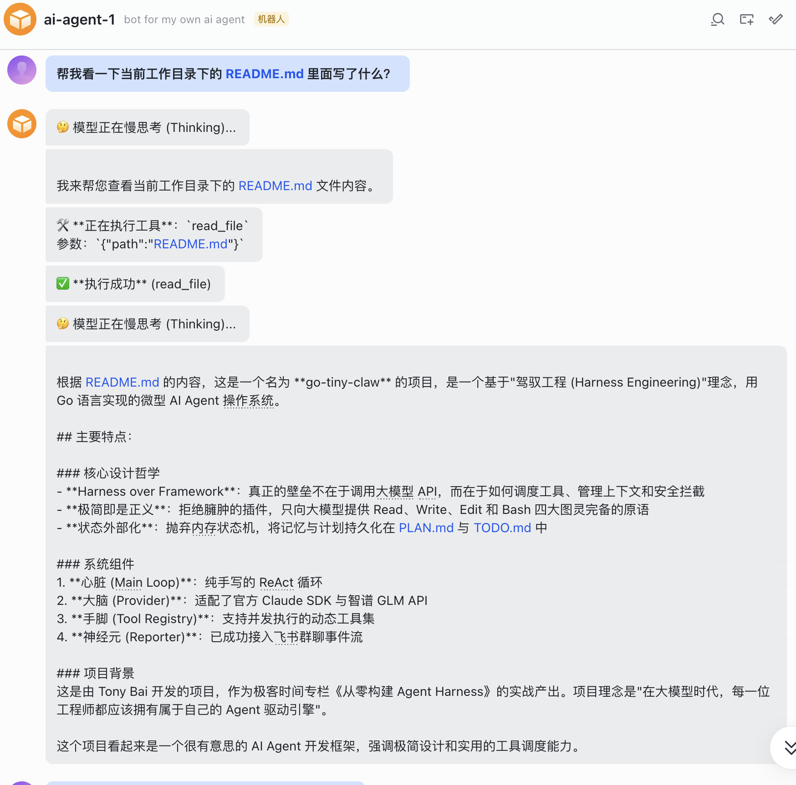
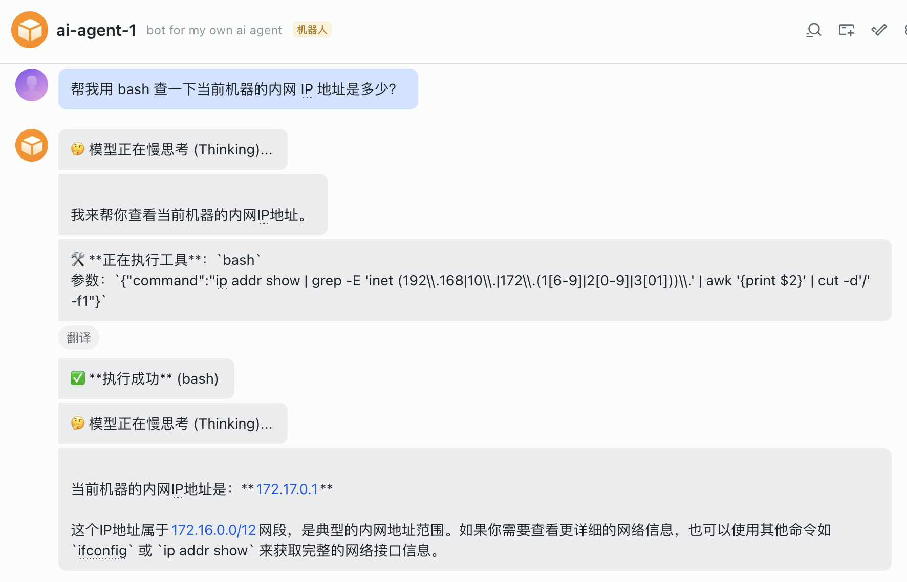

# 09｜飞书集成：打通真实世界，将 go-tiny-claw 接入飞书机器人的事件流
你好，我是Tony Bai。欢迎来到《从0开始构建 Agent Harness》专栏的第九讲。

在前面的 8 讲中，我们潜心于 `go-tiny-claw` 的底层基础设施建设。我们用纯 Go 代码手写了带“慢思考”的两阶段 ReAct 循环，设计了优雅的 Provider 接口对接智谱与 Claude，打造了支持极简 4 大原语的 Tool Registry，甚至在上一讲中，利用 Goroutine 将工具的执行效率推向了并发的极限。

只要你在终端运行 `go run`，你的 Agent 已经像一个成熟的本地开发者一样，能在你的电脑上穿梭自如了。但是，在真实的软件工程与团队协作中，触发 Agent 工作的场景往往是这样的：

- 线上系统突然爆出 502，运维老哥在飞书群里发了一句：“@机器人 帮我去这台机器上查一下 nginx 报错日志。”

- CI/CD 流水线构建失败了，测试同学在群里吼了一句：“@机器人 帮我看看昨天的提交是不是破坏了什么配置？”

- 当你允许 Agent 执行高危的 `bash` 命令时，你希望它在执行前能通过一张交互卡片弹到你的手机上，等你点击“Approve（同意）”后它才真正动手。


这一切，都要求我们的驾驭工程（Harness Engineering）必须拥有一个极其灵活的 **“入口交互层”**。

今天这一讲，我们将打破终端的物理隔离。利用飞书官方的 Go SDK（ `oapi-sdk-go/v3`），将 `go-tiny-claw` 从一个孤独的本地进程，进化为随时随地响应团队召唤的 **ChatOps（对话驱动运维）机器人**。

## I/O 彻底解耦与 Reporter 反转

如果你回看我们在 [02 讲](https://time.geekbang.org/column/article/967512) 和 [03 讲](https://time.geekbang.org/column/article/967578) 中编写的 `internal/engine/loop.go`，当 Agent 开始思考、决定调用工具或者输出最终结果时，我们使用的是 `fmt.Printf` 和 `log.Println`。

如果我们将这个引擎放在一台云服务器上作为后台进程运行，用户在飞书群里发了一条消息，引擎在云端默默 `fmt.Printf` 了一堆日志……飞书里的用户怎么可能看得到呢？

因此，在 Harness 架构设计中， **引擎的核心循环（Main Loop）必须与输入输出（I/O）彻底解耦**。

这就像 Linux 的设计哲学：内核（Kernel）只负责调度和运算，显示内容交给终端设备。我们的引擎也不应该关心自己是在哪里运行，它只需要在特定的生命周期节点（如：开始思考、执行工具、结束回答），向外“广播”事件即可。

我们可以用一张示意图来展示这种解耦与飞书交互的消息流转：



通过引入 `Reporter` 接口，输出能力被完全剥离。当在终端运行时，我们注入 `TerminalReporter`；当接入飞书时，我们注入 `FeishuReporter`。这就是驾驭工程的灵活性所在。

## 代码实战：解耦引擎与接入飞书事件流

为了实现上述架构，请确保你已经安装了飞书官方的 Go SDK。

```bash
go get github.com/larksuite/oapi-sdk-go/v3

```

### 目录结构回顾与更新

我们将在这个模块中新增 `reporter.go` 用于定义接口，并在 `internal/feishu` 中实现机器人的回调服务。同时，我们将改造入口 `main.go`，让它变成一个 Web Server。

```plain
go-tiny-claw/
├── cmd/
│   └── claw/
│       └── main.go          # 【重构】启动 HTTP Server 监听飞书 Webhook
├── internal/
│   ├── engine/
│   │   ├── loop.go          # 【重构】将 fmt.Println 替换为 Reporter 接口调用
│   │   ├── reporter.go      # 【新增】定义 Reporter 接口规范
│   │   └── terminal_reporter.go # (本讲暂时用不到，预留给后续的 CLI)
│   ├── feishu/              # 【新增】飞书集成层
│   │   └── bot.go           # 实现事件监听与飞书消息 API 的封装
│   ├── provider/            # 保持不变
│   ├── schema/              # 保持不变
│   └── tools/               # 保持不变
├── go.mod
└── go.sum

```

### 第 1 步：定义 Reporter 接口（引擎解耦）

新建 `internal/engine/reporter.go`。这定义了 Agent 在运行期间会向外界汇报的 4 个核心动作。

```go
// internal/engine/reporter.go
package engine

import "context"

// Reporter 定义了 Agent 引擎向外界输出信息的规范。
// 这使得引擎可以无缝切换终端 (CLI)、飞书、钉钉甚至 WebUI 等不同的展现层。
type Reporter interface {
    // OnThinking 当模型开始进行慢思考 (Reasoning) 时调用
    OnThinking(ctx context.Context)

    // OnToolCall 当模型决定并发调用工具时调用
    OnToolCall(ctx context.Context, toolName string, args string)

    // OnToolResult 当工具在底层执行完毕并返回结果时调用
    OnToolResult(ctx context.Context, toolName string, result string, isError bool)

    // OnMessage 当模型宣告任务完成，向用户输出最终纯文本回答时调用
    OnMessage(ctx context.Context, content string)
}

```

### 第 2 步：改造 Main Loop 使用 Reporter 回调

回到我们熟悉的 `internal/engine/loop.go`，修改 `Run` 方法的签名，要求传入一个 `Reporter` 实例。并将之前用来打印日志的 `fmt.Printf` 替换掉。

```go
// internal/engine/loop.go
package engine

import (
    "context"
    "fmt"
    "log"
    "sync"

    "github.com/yourname/go-tiny-claw/internal/provider"
    "github.com/yourname/go-tiny-claw/internal/schema"
    "github.com/yourname/go-tiny-claw/internal/tools"
)

// ... 前置结构体定义不变 ...

// Run 方法新增了 Reporter 参数
func (e *AgentEngine) Run(ctx context.Context, userPrompt string, reporter Reporter) error {
    log.Printf("[Engine] 引擎启动，锁定工作区: %s\n", e.WorkDir)

    contextHistory := []schema.Message{
        {Role: schema.RoleSystem, Content: "You are go-tiny-claw, an expert coding assistant."},
        {Role: schema.RoleUser, Content: userPrompt},
    }

    turnCount := 0

    for {
        turnCount++
        availableTools := e.registry.GetAvailableTools()

        // ================= Phase 1: Thinking =================
        if e.EnableThinking {
            if reporter != nil {
                // 【触发 Reporter】: 开始慢思考
                reporter.OnThinking(ctx)
            }

            thinkResp, err := e.provider.Generate(ctx, contextHistory, nil)
            if err != nil {
                return fmt.Errorf("Thinking 生成失败: %w", err)
            }
            if thinkResp.Content != "" {
                contextHistory = append(contextHistory, *thinkResp)
            }
        }

        // ================= Phase 2: Action =================
        actionResp, err := e.provider.Generate(ctx, contextHistory, availableTools)
        if err != nil {
            return fmt.Errorf("Action 生成失败: %w", err)
        }

        contextHistory = append(contextHistory, *actionResp)

        if actionResp.Content != "" && reporter != nil {
            // 【触发 Reporter】: 输出阶段性总结或最终回复
            reporter.OnMessage(ctx, actionResp.Content)
        }

        // ================= 执行退出与并发控制 =================
        if len(actionResp.ToolCalls) == 0 {
            break
        }

        observationMsgs := make([]schema.Message, len(actionResp.ToolCalls))
        var wg sync.WaitGroup

        for i, toolCall := range actionResp.ToolCalls {
            wg.Add(1)

            go func(idx int, call schema.ToolCall) {
                defer wg.Done()

                if reporter != nil {
                    // 【触发 Reporter】: 报告即将在底层执行的工具
                    reporter.OnToolCall(ctx, call.Name, string(call.Arguments))
                }

                result := e.registry.Execute(ctx, call)

                if reporter != nil {
                    // 为了防止大文件读取导致飞书消息过长被截断，我们仅汇报工具执行状态
                    // 注意：传递给大模型的 observationMsgs 依然是完整数据，只是人类看到的 Reporter 是缩略版
                    displayOutput := result.Output
                    if len(displayOutput) > 200 {
                        displayOutput = displayOutput[:200] + "... (已截断)"
                    }
                    // 【触发 Reporter】: 汇报工具物理执行的结果
                    reporter.OnToolResult(ctx, call.Name, displayOutput, result.IsError)
                }

                observationMsgs[idx] = schema.Message{
                    Role:       schema.RoleUser,
                    Content:    result.Output,
                    ToolCallID: call.ID,
                }
            }(i, toolCall)
        }

        wg.Wait()

        for _, obs := range observationMsgs {
            contextHistory = append(contextHistory, obs)
        }
    }

    return nil
}

```

至此，我们的引擎成为了一台完美的、没有任何输出硬编码（Hardcode）的纯净状态机。

### 第 3 步：实现飞书 Bot 服务与 Reporter

新建 `internal/feishu/bot.go`。在这个文件里，我们需要实现两件事：

1. 监听飞书的 Webhook 回调（解析用户发的指令消息）。

2. 实现 `FeishuReporter`，通过飞书 OpenAPI 将大模型的状态发回给那个发消息的用户。


```go
// internal/feishu/bot.go
package feishu

import (
    "context"
    "encoding/json"
    "fmt"
    "log"
    "os"
    "strings"

    "github.com/larksuite/oapi-sdk-go/v3/event/dispatcher"
    larkim "github.com/larksuite/oapi-sdk-go/v3/service/im/v1"
    "github.com/yourname/go-tiny-claw/internal/engine"

    lark "github.com/larksuite/oapi-sdk-go/v3"
)

// FeishuBot 封装了飞书机器人的配置与核心业务流
type FeishuBot struct {
    client    *lark.Client
    appID     string
    appSecret string
    engine    *engine.AgentEngine // 持有核心引擎引用
}

func NewFeishuBot(eng *engine.AgentEngine) *FeishuBot {
    appID := os.Getenv("FEISHU_APP_ID")
    appSecret := os.Getenv("FEISHU_APP_SECRET")

    if appID == "" || appSecret == "" {
        log.Fatal("请设置 FEISHU_APP_ID 和 FEISHU_APP_SECRET")
    }

    // 实例化飞书官方客户端
    client := lark.NewClient(appID, appSecret)

    return &FeishuBot{
        client:    client,
        appID:     appID,
        appSecret: appSecret,
        engine:    eng,
    }
}

// GetEventDispatcher 用于注册到 HTTP 服务器，处理来自飞书的 POST 事件
func (b *FeishuBot) GetEventDispatcher() *dispatcher.EventDispatcher {
    encryptKey := os.Getenv("FEISHU_ENCRYPT_KEY")
    verifyToken := os.Getenv("FEISHU_VERIFY_TOKEN")

    // 使用官方 SDK 构建调度器，监听 "接收消息" 事件
    handler := dispatcher.NewEventDispatcher(verifyToken, encryptKey).
        OnP2MessageReceiveV1(func(ctx context.Context, event *larkim.P2MessageReceiveV1) error {
            // 由于飞书消息体是 JSON，我们需要粗略地提取其中的文本内容。
            // 这里简单处理：去掉开头结尾的特殊转义字符和引用的机器人名字。
            contentStr := *event.Event.Message.Content
            contentStr = strings.TrimPrefix(contentStr, `{"text":"`)
            contentStr = strings.TrimSuffix(contentStr, `"}`)

            chatId := *event.Event.Message.ChatId
            log.Printf("[Feishu] 收到会话 %s 消息: %s\n", chatId, contentStr)

            // 【驾驭并发】：收到消息后，绝不能阻塞 HTTP 回调。
            // 我们要为每个请求开启一个独立的 Goroutine 跑 Agent 任务！
            go b.handleAgentRun(chatId, contentStr)

            return nil
        }).
        OnP2MessageReadV1(func(ctx context.Context, event *larkim.P2MessageReadV1) error {
            // 消息已读事件，静默忽略（避免日志干扰）
            return nil
        })

    return handler
}

// handleAgentRun 是连接飞书与底层引擎的桥梁
func (b *FeishuBot) handleAgentRun(chatId string, prompt string) {
    // 为当前聊天窗口实例化一个专属的 Reporter
    reporter := &FeishuReporter{
        client: b.client,
        chatId: chatId,
    }

    // 启动引擎！
    err := b.engine.Run(context.Background(), prompt, reporter)
    if err != nil {
        reporter.sendMsg(fmt.Sprintf("❌ Agent 运行崩溃: %v", err))
    }
}

// ==========================================
// FeishuReporter: 将引擎的输出格式化后发给飞书
// ==========================================
type FeishuReporter struct {
    client *lark.Client
    chatId string
}

// sendMsg 封装了调用飞书 OpenAPI 发送卡片/文本的操作
func (r *FeishuReporter) sendMsg(text string) {
    // 构建文本消息内容
    textContent := map[string]string{
        "text": text,
    }
    contentBytes, _ := json.Marshal(textContent)
    contentStr := string(contentBytes)

    msgReq := larkim.NewCreateMessageReqBuilder().
        ReceiveIdType(larkim.ReceiveIdTypeChatId).
        Body(larkim.NewCreateMessageReqBodyBuilder().
            ReceiveId(r.chatId).
            MsgType(larkim.MsgTypeText).
            Content(contentStr).
            Build()).
        Build()

    _, _ = r.client.Im.Message.Create(context.Background(), msgReq)
}

func (r *FeishuReporter) OnThinking(ctx context.Context) {
    // 仅发一个轻量级提示，避免飞书刷屏
    r.sendMsg("🤔 模型正在慢思考 (Thinking)...")
}

func (r *FeishuReporter) OnToolCall(ctx context.Context, toolName string, args string) {
    r.sendMsg(fmt.Sprintf("🛠️ **正在执行工具**：`%s`\n参数：`%s`", toolName, args))
}

func (r *FeishuReporter) OnToolResult(ctx context.Context, toolName string, result string, isError bool) {
    if isError {
        r.sendMsg(fmt.Sprintf("⚠️ **执行报错** (%s)：\n%s", toolName, result))
    } else {
        // 成功时仅汇报成功，不刷全量日志
        r.sendMsg(fmt.Sprintf("✅ **执行成功** (%s)", toolName))
    }
}

func (r *FeishuReporter) OnMessage(ctx context.Context, content string) {
    // 将模型最终的纯文本回答发给用户
    r.sendMsg(content)
}

// 编译时类型检查：确保 FeishuReporter 实现了 Reporter 接口
var _ engine.Reporter = (*FeishuReporter)(nil)

```

这段代码精妙地利用了 Go 的 `go` 关键字（协程）。当你在飞书群里同时发了三条指令，服务器瞬间会拉起三个完全独立的 ReAct 循环，它们各自思考，各干各的，最后各自回传给对应的飞书聊天窗口。

### 第 4 步：启动服务器（ `main.go`）

最后，我们在 `cmd/claw/main.go` 中，抛弃在终端写代码的自嗨模式，改用 `net/http` 启动一个 Web 服务器。

```go
// cmd/claw/main.go
package main

import (
    "log"
    "net/http"
    "os"

    "github.com/larksuite/oapi-sdk-go/v3/core/httpserverext"
    "github.com/yourname/go-tiny-claw/internal/engine"
    "github.com/yourname/go-tiny-claw/internal/feishu"
    "github.com/yourname/go-tiny-claw/internal/provider"
    "github.com/yourname/go-tiny-claw/internal/tools"
)

func main() {
    // 1. 初始化引擎依赖
    workDir, _ := os.Getwd()

    // 默认使用智谱 GLM-4
    if os.Getenv("ZHIPU_API_KEY") == "" {
        log.Fatal("请先导出 ZHIPU_API_KEY 环境变量")
    }
    llmProvider := provider.NewZhipuOpenAIProvider("glm-4.5-air")

    registry := tools.NewRegistry()
    registry.Register(tools.NewReadFileTool(workDir))
    registry.Register(tools.NewWriteFileTool(workDir))
    registry.Register(tools.NewBashTool(workDir))
    registry.Register(tools.NewEditFileTool(workDir))

    // 开启慢思考
    eng := engine.NewAgentEngine(llmProvider, registry, workDir, true)

    // 2. 初始化飞书 Bot 调度器
    bot := feishu.NewFeishuBot(eng)
    handler := httpserverext.NewEventHandlerFunc(bot.GetEventDispatcher())

    // 3. 注册路由并启动 HTTP 服务
    http.HandleFunc("/webhook/event", handler)

    port := ":48080"
    log.Printf("🚀 go-tiny-claw 飞书服务端已启动，正在监听 %s 端口\n", port)

    err := http.ListenAndServe(port, nil)
    if err != nil {
        log.Fatalf("服务器启动失败: %v", err)
    }
}

```

## 运行与实战测试：在飞书中“隔空取物”

由于飞书要求 Webhook 必须是公网可访问的 HTTP 地址，如果你运行 `go-tiny-claw` 的服务器没有公网可访问的端口，你可能需要使用内网穿透工具（如 `ngrok` ）。

### 测试前准备

1. 在飞书开发者后台（open.feishu.cn）创建一个企业自建应用，并添加“机器人”应用能力。





2\. 在权限管理中，至少开通接收群聊消息和接收单聊消息的权限。



3. 在凭证与基础信息中获取 `App ID`、 `App Secret`，在“事件与回调”的“加密策略”下获取 `Encrypt Key` 和 `Verification Token`。



4. 将 `http://<你的go-tiny-claw主机ip>:48080/webhook/event` 填入飞书的事件配置和回调配置的请求地址中，并添加相关事件：





> 注意：添加事件或回调的请求地址时，你需要启动 `go-tiny-claw`，feishu平台会发消息验证（challenge）你的请求地址的正确性与合法性。 `go-tiny-claw` 的启动方式见下面说明。当验证ok，你的 `go-tiny-claw` 会输出类似 `[Info] [AuthByChallenge Success]` 的日志。

5. 发布机器人后，这个飞书机器人便可以正常使用了。

### 见证奇迹的时刻

在终端导出所有的环境变量，启动你的服务器：

```bash
export ZHIPU_API_KEY="your-api-key"
export FEISHU_APP_ID="cli_a7..."
export FEISHU_APP_SECRET="xxxx..."
export FEISHU_VERIFY_TOKEN="xxxx..."
export FEISHU_ENCRYPT_KEY="xxxx..." # 如果没开请求体加密，可以忽略 FEISHU_ENCRYPT_KEY

go run cmd/claw/main.go

```

现在，打开飞书，找到你的机器人私聊窗口。随便在这个测试电脑上放一个有意思的文本文件，比如当前目录下的 `README.md`。

你在飞书中给它发送一条消息：

> “帮我看一下当前工作目录下的 README.md 里面写了什么？”

短短几秒后，你会看到飞书对话框的交互消息。机器人会实时给你发送状态推送，就好像你坐在它的身后看它干活一样：



如果你再在飞书中给它发送另外一条消息：

> “帮我用 bash 查一下当前机器的内网 IP 地址是多少？”

`go-tiny-claw` 在收到消息后，会启动一个新Goroutine来处理这条消息，你的飞书机器人窗口也会看到下面这样的输出：



到这里，你的 Agent 正式突破了仅能在终端与你交互的“束缚”，变成了一个随时随地可以通过飞书被指挥的自动化小助手！

## 本讲小结

今天，我们完成了一次优雅的架构解耦与企业级生态接入，这体现了 Harness 驾驭工程的扩展之美：

1. **I/O 解耦的降维打击**：通过引入 `Reporter` 接口，我们将底层的心跳循环（Main Loop）与具体的输出载体（终端 vs 飞书）物理剥离。不管未来你换成钉钉、Slack 还是微信，Engine 的核心逻辑都不需要改动。

2. **拥抱 Go 的高并发哲学**：每当飞书收到一条新消息，我们就 `go b.handleAgentRun(...)`。这意味着 `go-tiny-claw` 天生就是一个支持海量并发的高并发后台系统。

3. **ChatOps 范式成型**：结合我们在前两讲实现的 `read` / `bash` 极简工具，Agent 正式具备了从群聊指令直接转化为系统行为的能力，为自动化工作（比如运维）奠定了入口。


然而，在这个看似极客且炫酷的 ChatOps 系统背后，隐藏着两个极其致命的问题。

第一，如果你仔细看看 `bot.go` 中的代码： `err := b.engine.Run(context.Background(), prompt, reporter)`。每当用户发一条消息，我们就启动了一次全新的 `Run`！这意味着如果刚才那个用户接着发第二句：“在刚才那个文件末尾加一行字”。Agent 完全不可能做到！ **因为上一轮的上下文（Context）没有被保存，Agent 是严重失忆的！**

第二，如果你让它去读取一个 `50MB` 的系统日志文件，大模型的 Context Window 会在一瞬间爆炸。而在 Web Server 中出现这种 Panic，是不可接受的。

从下一讲开始，我们将正式迈入驾驭工程的第三大模块： **上下文工程体系（Context Engineering）**。我们将深入探讨如何模块化地组装极其复杂的系统指令（AGENTS.md），如何像操作系统回收内存一样对 Context 进行压缩，以及如何通过物理隔离（Session ID）和短期工作记忆，让飞书机器人在无状态的 HTTP 请求中拥有顺畅的长程对话能力。

> 注：本讲的示例代码，可以在 [这里](https://github.com/bigwhite/publication/tree/master/column/timegeek/build-agent-harness-from-scratch/ch09) 下载。

## 思考题

我们目前在 `handleAgentRun` 方法中，是直接通过 `go b.handleAgentRun(...)` 启动一个新的 Goroutine 开启一轮完整的 ReAct 循环的。

如果你在一个几百人的飞书运维群里部署了这个机器人。某天发生线上事故，群里大家同时焦急地艾特了机器人发了 10 条指令。

此时，后台瞬间拉起了 10 个 `Main Loop`，这意味着它们会并发地在同一个 `WorkDir`（工作区目录）下执行 `bash` 命令、甚至是执行 `write_file` 去覆写同一个文件！

这无疑会引发灾难性的文件锁冲突和状态混乱（Data Race in Physical World）。

在不改变大模型本身特性的前提下，如果要为你的 `go-tiny-claw` 飞书服务端增加一个工作区读写锁（Workspace Mutex/Lock）或者任务调度队列（Task Queue），确保同一个目录下同一时刻只有一个 Agent 任务在运行文件修改，你会如何在架构上（比如在 Dispatcher 层或 Engine 初始化层）进行设计？

欢迎在留言区分享你的高并发防御方案，如果你觉得有所收获，欢迎你分享给其他朋友。我们下一讲，开启上下文工程之旅！