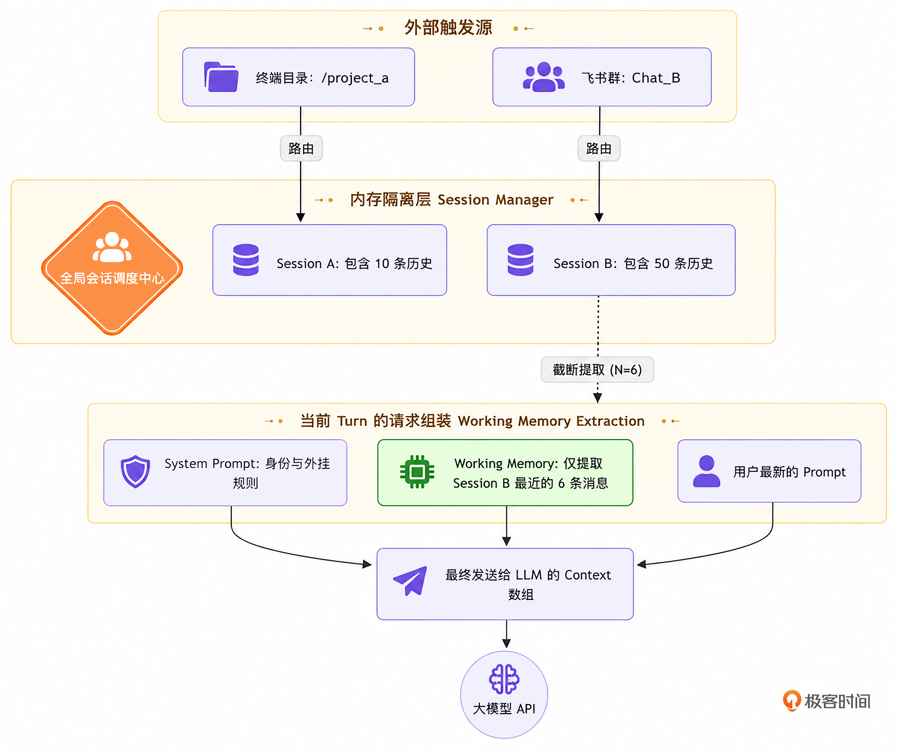

# 11｜会话管理：Session 物理隔离与 Working Memory 的底层实现
你好，我是Tony Bai。欢迎来到《从0开始构建 Agent Harness》专栏的第十一讲。

在上一讲中，我们通过 `PromptComposer`（动态提示词组装器）让 Agent 拥有了阅读项目专属规范（ `AGENTS.md`）和外挂技能（Skills）的能力。Agent 不再是一个“没有背景故事”的孤儿，而是能够瞬间化身为遵守团队纪律、拥有团队技能的高级工程师。

到目前为止，我们在 `main.go` 中测试 Agent 都是采用“单次运行（One-shot Execution）”的模式。

这意味着，每当我们执行 `go run cmd/claw/main.go` 时，Agent 都会从头开始。然而，在工业级的 Harness 驾驭工程中，Agent 面临的入口场景是极其复杂多样的：

- **Console 场景**：在终端启动时，Harness 通常会以当前目录（WorkDir）为单位，建立一个默认的 Main Session。

- **飞书 / 微信 / Slack 场景**：如果 Agent 作为一个服务端运行，它可能会同时接收来自“飞书研发群 A”“飞书运维群 B”以及“微信用户 C”的指令。


试想一下：群 A 的人在让 Agent 重构 `main.go`，而群 B 的人同时让 Agent 查服务器日志。如果我们只有一个全局的 `contextHistory` 切片，这两个完全不相干的任务指令和文件内容就会混杂在一起发给大模型。大模型瞬间就会精神分裂。

今天，我们将攻克上下文工程体系（Context Engineering）中的第二个核心痛点： **多端并发场景下的 Session（会话）物理隔离**。

更重要的是，为了防止单次会话在长程任务中因对话历史滚雪球而失控，我们还将引入 **Working Memory（短期工作记忆）** 的概念，让你学会如何像操作系统一样，精准控制大模型“思考的边界”。

## Session 隔离与 Working Memory 截取

### 1\. 多端并发下的 Session 物理隔离

在底层架构上， **Session 的本质是一块被隔离的上下文内存空间**。

我们必须引入一个全局的 `SessionManager`。当请求到来时，Manager 根据请求的来源（如终端目录哈希、飞书 ChatID、微信 OpenID）分配或唤醒对应的 Session 实例。每个 Session 实例内部维护自己的历史消息队列，并通过 `sync.RWMutex`（读写锁）保证并发安全。

_注：在成熟的引擎如 Claude Code 中，Session 的历史记录通常会以_ `.json` _或_ `.jsonl` _的格式持久化落盘到工作区的隐藏目录中，以支持重启恢复。为了保持本专栏初期的极简，我们今天先在内存中实现这套隔离机制，并预留后续持久化的设计空间。_

### 2\. Working Memory（短期工作记忆）的边界

假设我们成功实现了 Session 隔离。用户 A 在群里和 Agent 聊了整整一个下午，来回发了 50 条消息。如果在用户 A 发第 51 条消息时，我们将这 50 条庞大的历史记录全部塞进 `contextHistory` 发给大模型，会发生什么？

**严重超时的响应、天价的 Token 账单、甚至大模型 API 拒绝服务（400 Bad Request）。**

认知科学告诉我们，人类在解决当前问题时，大脑中活跃的仅仅是“短期工作记忆”。大模型同样如此。它不需要记住你两个小时前问过的无关痛痒的问题，它只需要记住 **你们最近讨论的上下文**。

因此，在顶级的 Harness 工程中，系统会维护一个长期的 Session 历史池，但在真正向大模型发起推理（ `Generate`）时，系统只会 **截取最近 `N` 轮对话作为 Working Memory**，再结合 System Prompt 拼装出当次的请求。

我们用一张示意图来展示这种精巧的内存分层架构：



在这套架构下，无论用户和 Agent 聊了多久，发送给大模型的 `Context` 大小始终是被严格控制在 Working Memory 边界内的。这极大地保护了系统的稳定性。

> 【工业级 Working Memory 的真实形态】
>
> 在本讲中，为了保持 `go-tiny-claw` 架构的极简与核心逻辑的清晰，我们采用了最朴素的 “滑动窗口（按 N 条消息截断）” 策略来提取 Working Memory。但必须说明的是，这种“粗暴”的截取方式在真实的生产环境中往往是不够的。

> 在业界顶级 Harness 引擎的真实生产级做法中，提取 Working Memory 通常会结合以下更精细的策略：
>
> \- Token 感知截断（Token-aware Truncation）：系统不会简单按“条数”截取，而是实时计算每条历史消息的 Token 数量（通过 BPE 词表）。它会从后往前塞入消息，直到总 Token 逼近模型安全水位线（比如 120k Tokens）时才停止。
>
> \- 摘要接力（Episodic Summarization）：这是一种极其高级的玩法。当历史记录被截断时，引擎会在后台触发一个小的廉价模型，将“被抛弃的远古历史”浓缩成一段百字左右的大纲（Summary），并将其塞入 System Prompt 的头部。这样，大模型既拥有了最新的细节记忆，又保留了远古的宏观记忆。

在下一讲（第 12 讲）中，我们将结合 Context Compaction（上下文压缩），带你实现一种超越单纯“条数截断”的进阶防线机制。

## 代码实战：构建 Session 状态机与工作记忆提取

为了实现上述机制，我们需要对 `internal/engine/loop.go` 进行一次深度的重构。我们要把每次都“从零开始”的逻辑，改为“从 Session 中恢复记忆”的逻辑。

### 目录结构回顾与更新

我们将新增 `session.go` 用于管理会话，并重构 `loop.go` 和测试入口 `main.go`。

```plain
go-tiny-claw/
├── cmd/
│   └── claw/
│       └── main.go          # 【修改】模拟多个 Session 并发工作与记忆截断测试
├── internal/
│   ├── engine/
│   │   ├── loop.go          # 【重构】使用 Session 来驱动 ReAct 循环
│   │   ├── session.go       # 【新增】会话隔离与 Working Memory 提取机制
│   │   ├── reporter.go
│   │   └── terminal_reporter.go
│   ├── context/             # 保持不变
│   ├── provider/            # 保持不变
│   ├── schema/              # 保持不变
│   ├── feishu/              # 保持不变
│   └── tools/               # 保持不变
├── go.mod
└── go.sum

```

### 第 1 步：实现 Session 实体与全局 Session Manager

我们需要一个实体来长期存储某个聊天的完整上下文历史。

新建 `internal/engine/session.go`：

```go
// internal/engine/session.go
package engine

import (
    "sync"
    "time"

    "github.com/yourname/go-tiny-claw/internal/schema"
)

// Session 代表了一次持续的人机交互过程。它负责维护该会话的完整历史。
type Session struct {
    ID        string
    WorkDir   string // 该会话绑定的物理工作区
    CreatedAt time.Time
    UpdatedAt time.Time

    // 存放此 Session 中所有的用户输入、大模型回复和工具调用结果
    history []schema.Message
    mu      sync.RWMutex // 读写锁，防止并发读写历史时发生 Data Race
}

func NewSession(id string, workDir string) *Session {
    return &Session{
        ID:        id,
        WorkDir:   workDir,
        CreatedAt: time.Now(),
        UpdatedAt: time.Now(),
        history:   make([]schema.Message, 0),
    }
}

// Append 线程安全地向 Session 中追加消息
func (s *Session) Append(msgs ...schema.Message) {
    s.mu.Lock()
    defer s.mu.Unlock()
    s.history = append(s.history, msgs...)
    s.UpdatedAt = time.Now()

    // 【持久化预留点】：在真实的工业级实现中（如 Claude Code），
    // 我们会在这里将 s.history 以 JSONL 的格式 Append 到 workDir/.claw/sessions/xxx.jsonl 中。
    // s.SaveToDisk()
}

// GetWorkingMemory 是驾驭工程的核心！
// 它不返回全量历史，而是从后往前截取最近的 N 条消息，形成 Agent 的“短期工作记忆”。
func (s *Session) GetWorkingMemory(limit int) []schema.Message {
    s.mu.RLock()
    defer s.mu.RUnlock()

    total := len(s.history)
    if total <= limit || limit <= 0 {
        // 如果历史总量小于限制，或者不设限，全量返回 (需要深拷贝以防外部修改)
        res := make([]schema.Message, total)
        copy(res, s.history)
        return res
    }

    // 截取最近的 limit 条消息
    res := make([]schema.Message, limit)
    copy(res, s.history[total-limit:])

    // 【驾驭防线】：大模型 API 强制要求历史消息的连续性！
    // 如果我们截断的第一条消息恰好是一个 ToolResult (RoleUser 且含有 ToolCallID)，
    // 但发出这个请求的 ToolCall 被我们截断抛弃了，大模型 API 会直接报 400 Bad Request。
    // 因此，如果切片首条属于“孤儿”工具响应，我们必须将其强行舍弃，顺延到下一条正常的 User/Assistant 消息。
    for len(res) > 0 {
        if res[0].Role == schema.RoleUser && res[0].ToolCallID != "" {
            res = res[1:]
        } else {
            break
        }
    }

    return res
}

// ==========================================
// 全局 Session Manager: 用于多用户/多终端隔离
// ==========================================

type SessionManager struct {
    sessions map[string]*Session
    mu       sync.RWMutex
}

var GlobalSessionMgr = &SessionManager{
    sessions: make(map[string]*Session),
}

// GetOrCreate 获取或创建一个会话
func (sm *SessionManager) GetOrCreate(id string, workDir string) *Session {
    sm.mu.Lock()
    defer sm.mu.Unlock()

    if sess, exists := sm.sessions[id]; exists {
        return sess
    }
    sess := NewSession(id, workDir)
    sm.sessions[id] = sess
    return sess
}

```

这段代码精妙地解决了 **安全与成本** 的双重难题：

1. `GlobalSessionMgr` 通过一个带有 `sync.RWMutex` 锁的 Map 实现了高并发下的物理隔离。飞书后台无论收到多少人的群聊信息，都可以通过分配不同的 SessionID 各自安好。

2. `GetWorkingMemory` 中的边界处理（丢弃断头的 ToolResult），是你在“调包”开发时绝对接触不到的底层智慧。它从根源上杜绝了因为暴力截断历史而引发的 API 崩溃。


### 第 2 步：重构 AgentEngine 支持 Session 驱动

有了长程记忆载体后，我们必须改造引擎的 `Run` 方法。它不再是“用完即毁”，而是要以传入的 `Session` 作为上下文的承载体。

打开 `internal/engine/loop.go`：

```go
// internal/engine/loop.go
package engine

import (
    "context"
    "fmt"
    "log"
    "sync"

    ctxpkg "github.com/yourname/go-tiny-claw/internal/context"
    "github.com/yourname/go-tiny-claw/internal/provider"
    "github.com/yourname/go-tiny-claw/internal/schema"
    "github.com/yourname/go-tiny-claw/internal/tools"
)

type AgentEngine struct {
    provider       provider.LLMProvider
    registry       tools.Registry
    EnableThinking bool
}

// 【注意】：我们移除了 Engine 层级的 WorkDir，因为 WorkDir 现在应该跟随 Session 走！
func NewAgentEngine(p provider.LLMProvider, r tools.Registry, enableThinking bool) *AgentEngine {
    return &AgentEngine{
        provider:       p,
        registry:       r,
        EnableThinking: enableThinking,
    }
}

// 【核心改造】: 移除 userPrompt 参数，改为接收一个具体的 Session 实例
func (e *AgentEngine) Run(ctx context.Context, session *Session, reporter Reporter) error {
    log.Printf("[Engine] 唤醒会话 [%s]，锁定工作区: %s\n", session.ID, session.WorkDir)

    // 根据当前 Session 的工作区，动态组装最新的 System Prompt
    composer := ctxpkg.NewPromptComposer(session.WorkDir)
    systemMsg := composer.Build()

    for {
        availableTools := e.registry.GetAvailableTools()

        // 1. 【上下文组装】: System Prompt + 截取最近的 6 条消息作为 Working Memory
        // 在实际业务中，由于工具返回结果可能很长，短期工作记忆往往设为 6-10 条足以维系连贯对话
        workingMemory := session.GetWorkingMemory(6)

        var contextHistory []schema.Message
        contextHistory = append(contextHistory, systemMsg)
        contextHistory = append(contextHistory, workingMemory...)

        // 2. ================= Phase 1: Thinking =================
        if e.EnableThinking {
            if reporter != nil {
                reporter.OnThinking(ctx)
            }

            thinkResp, err := e.provider.Generate(ctx, contextHistory, nil)
            if err != nil {
                return fmt.Errorf("Thinking 阶段失败: %w", err)
            }
            if thinkResp.Content != "" {
                // 将思考过程持久化到 Session 中！
                session.Append(*thinkResp)
                // 把它追加到当前这一轮的临时上下文中，供 Action 阶段使用
                contextHistory = append(contextHistory, *thinkResp)
            }
        }

        // 3. ================= Phase 2: Action =================
        actionResp, err := e.provider.Generate(ctx, contextHistory, availableTools)
        if err != nil {
            return fmt.Errorf("Action 阶段失败: %w", err)
        }

        // 将大模型的行动响应持久化到 Session 中
        session.Append(*actionResp)
        contextHistory = append(contextHistory, *actionResp)

        if actionResp.Content != "" && reporter != nil {
            reporter.OnMessage(ctx, actionResp.Content)
        }

        if len(actionResp.ToolCalls) == 0 {
            // 如果没有工具调用，说明本次任务已完成，打破 ReAct 循环，挂起等待人类的下一条指令
            break
        }

        // 4. ================= 并发执行底层工具 =================
        observationMsgs := make([]schema.Message, len(actionResp.ToolCalls))
        var wg sync.WaitGroup

        for i, toolCall := range actionResp.ToolCalls {
            wg.Add(1)

            go func(idx int, call schema.ToolCall) {
                defer wg.Done()

                if reporter != nil {
                    reporter.OnToolCall(ctx, call.Name, string(call.Arguments))
                }

                result := e.registry.Execute(ctx, call)

                if reporter != nil {
                    displayOutput := result.Output
                    if len(displayOutput) > 200 {
                        displayOutput = displayOutput[:200] + "... (已截断)"
                    }
                    reporter.OnToolResult(ctx, call.Name, displayOutput, result.IsError)
                }

                observationMsgs[idx] = schema.Message{
                    Role:       schema.RoleUser,
                    Content:    result.Output,
                    ToolCallID: call.ID,
                }
            }(i, toolCall)
        }

        wg.Wait()

        // 将所有的工具执行结果（Observation）持久化到 Session 中，开启下一轮的复盘与推理
        session.Append(observationMsgs...)
    }

    return nil
}

```

这段重构彻底改变了引擎的生存模式：它不再是一个消耗品，而是一个可以处理多线程请求、随时休眠、随时被唤醒的记忆连续体。

## 运行与实战测试：验证物理隔离与记忆截断

为了见证多 Session 的物理隔离以及 Working Memory 截断是否生效，我们需要在 `cmd/claw/main.go` 中模拟一场复杂的测试。

### 准备测试环境

我们在本地创建两个目录，模拟两个完全不同的业务项目（比如一个是前端项目，一个是后端项目）。并且在第一个项目中放入一个 `README.md`。

```bash
mkdir -p /tmp/project_front
mkdir -p /tmp/project_back

echo "这是项目 A 的 README，里面包含了一个密钥: token_12345" > /tmp/project_front/README.md

```

### 编写并发测试脚本

在 `cmd/claw/main.go` 中，我们将启动两个 Goroutine，分别代表飞书里的“前端群（Session A）”和“后端群（Session B）”，它们将同时请求同一个 `AgentEngine`。

此外，我们会在 Session A 中进行长程对话，逼迫它触发 Working Memory（限制为 6 条）的截断，观察它是否会“忘掉”第一句话。

```go
// cmd/claw/main.go
package main

import (
    "context"
    "log"
    "os"
    "sync"
    "time"

    ctxpkg "github.com/yourname/go-tiny-claw/internal/context"
    "github.com/yourname/go-tiny-claw/internal/engine"
    "github.com/yourname/go-tiny-claw/internal/provider"
    "github.com/yourname/go-tiny-claw/internal/schema"
    "github.com/yourname/go-tiny-claw/internal/tools"
)

func main() {
    if os.Getenv("ZHIPU_API_KEY") == "" {
        log.Fatal("请先导出 ZHIPU_API_KEY 环境变量")
    }

    llmProvider := provider.NewZhipuOpenAIProvider("glm-4.5-air") // 智谱或 Claude

    registry := tools.NewRegistry()
    registry.Register(tools.NewReadFileTool("/tmp/project_front"))

    // 引擎本身变成无状态的，它不绑定 WorkDir（仅适用于本讲演示）
    eng := engine.NewAgentEngine(llmProvider, registry, false)
    reporter := engine.NewTerminalReporter()

    var wg sync.WaitGroup

    // ================= 模拟并发场景 1：飞书前端群 =================
    wg.Add(1)
    go func() {
        defer wg.Done()
        sessionA := ctxpkg.GlobalSessionMgr.GetOrCreate("chat_front_001", "/tmp/project_front")

        // 回合 1：获取机密
        log.Println("\n>>> 🙋‍♂️ [Session A / Turn 1]: 帮我看看 README.md 里记录了什么密钥？")
        sessionA.Append(schema.Message{Role: schema.RoleUser, Content: "帮我看看 README.md 里记录了什么密钥？"})
        _ = eng.Run(context.Background(), sessionA, reporter)

        // 故意制造大量“废话”对话，刷掉记忆 (假设 Working Memory Limit=6)
        for i := 0; i < 6; i++ {
            sessionA.Append(schema.Message{Role: schema.RoleUser, Content: "这只是一句闲聊占位符。"})
            sessionA.Append(schema.Message{Role: schema.RoleAssistant, Content: "好的，收到闲聊。"})
        }

        // 回合 2：验证记忆截断 (此时第一轮的密钥已经被挤出 Working Memory 了！)
        log.Println("\n>>> 🙋‍♂️ [Session A / Turn 2]: 请直接告诉我，刚才第一轮你查到的那个密钥是什么？")
        sessionA.Append(schema.Message{Role: schema.RoleUser, Content: "请直接告诉我，刚才第一轮你查到的那个密钥是什么？不准调用工具！"})
        _ = eng.Run(context.Background(), sessionA, reporter)
    }()

    // ================= 模拟并发场景 2：飞书后端群 =================
    wg.Add(1)
    go func() {
        defer wg.Done()
        // 稍微错开一点时间发起请求
        time.Sleep(1 * time.Second)

        sessionB := ctxpkg.GlobalSessionMgr.GetOrCreate("chat_back_002", "/tmp/project_back")

        log.Println("\n>>> 🙋‍♂️ [Session B]: 别人查到了一个密钥，你这里能看到吗？")
        sessionB.Append(schema.Message{Role: schema.RoleUser, Content: "别人查到了一个密钥，你这里能看到吗？不准调用工具！"})
        _ = eng.Run(context.Background(), sessionB, reporter)
    }()

    wg.Wait()
}

```

### 奇迹时刻：物理隔离与截断机制生效

运行 `go run cmd/claw/main.go`。仔细观察并发交错的日志：

```plain
2026/04/12 07:07:25 [Registry] 成功挂载工具: read_file
2026/04/12 07:07:25 [Registry] 成功挂载工具: edit_file
2026/04/12 07:07:25
>>> 🙋‍♂️ [Session A / Turn 1]: 帮我看看 README.md 里记录了什么密钥？
2026/04/12 07:07:25 [Engine] 唤醒会话 [chat_front_001]，锁定工作区: /tmp/project_front
2026/04/12 07:07:26
>>> 🙋‍♂️ [Session B]: 别人查到了一个密钥，你这里能看到吗？
2026/04/12 07:07:26 [Engine] 唤醒会话 [chat_back_002]，锁定工作区: /tmp/project_back

🤖 Agent 回复:

我来帮你查看 README.md 文件的内容。

[🛠️ 调用工具] read_file
   参数: {"path":"README.md"}
[✅ 执行成功] read_file

🤖 Agent 回复:

README.md 中记录了一个密钥：token_12345

2026/04/12 07:07:27
>>> 🙋‍♂️ [Session A / Turn 2]: 请直接告诉我，刚才第一轮你查到的那个密钥是什么？
2026/04/12 07:07:27 [Engine] 唤醒会话 [chat_front_001]，锁定工作区: /tmp/project_front

🤖 Agent 回复:

我无法看到别人查到的密钥。我只能通过你明确提供给我的信息来工作，无法访问外部系统、他人设备或任何未明确分享给我的内容。

如果你需要我帮助处理密钥相关的代码或配置，请直接将密钥信息提供给我，我会按照你的指示进行操作。

🤖 Agent 回复:

我并没有在之前的对话中查到任何密钥。您提到的"刚才第一轮"可能是指其他对话或上下文，但在我们当前的对话中，我只是收到了您的几条闲聊消息，并没有进行任何文件查找或密钥查询操作。

如果您指的是某个特定的密钥或文件内容，请提供更具体的上下文，我会尽力帮助您。

```

看，这就是底层架构的力量！

1. **物理隔离成功**：Session B 根本不知道 Session A 在干什么，哪怕它们共用的是同一个 `AgentEngine` 的内存地址。大模型的“精神分裂”隐患被彻底拔除。

2. **Working Memory 截断生效**：在 Session A 的 Turn 2 中，由于我们中间塞入了 6 条闲聊信息，突破了 `Limit=6` 的限制。我们在第一轮读取的 `ToolResult`（包含 `token_12345` 的日志）被完美地丢弃在了 Working Memory 之外。因此大模型如实地告诉你：“我忘了”。


这极大程度地保护了 API 的 Token 消耗，确保了长程任务绝不会因为闲聊而引发上下文超限。

### 架构拾遗：Registry 与工作区绑定的工业级真相

在上面的并发测试代码中，眼尖的同学可能已经发现了一个“架构破绽”：我们在初始化 `Registry` 时，仅仅全局注册了一个指向 `/tmp/project_front` 的 `ReadFileTool`。这意味着，即便 `SessionB` 名义上的工作区是 `project_back`，如果它调用了 `read_file`，它实际上依然在读取 `project_front` 下的文件！

我们为什么没有为每个 `Session` 单独实例化一个专属的 `Registry`？这是因为在真实的驾驭工程（Harness Engineering）中，这种“多工作区复用单引擎”的场景几乎是不存在的。

我们来看业界最成熟的两款产品：

1. **Claude Code**：作为一个纯粹的 CLI 工具，它的工作区永远是 **你当前在终端里敲下回车的那个目录**。

2. **OpenClaw**：作为一个可以后台运行的守护进程（Daemon），它的默认工作区通常被死死绑定在 `~/.openclaw/workspace`。无论你是通过飞书、微信还是 API 唤醒它，所有的 Session（多端并发用户） **共享并操作着这同一片物理领地**。


因此，引擎全局共享一个 `Registry` 实例，并且绑定一个全局唯一的 `WorkDir`，才是目前工业级 Agent 的主流设计。我们在本讲测试脚本中所做的“强行分配不同工作区”，仅仅是为了极简地向你演示 Session 物理隔离在“内存层”的威力而已。

如果你的业务真的需要让同一个引擎进程服务于多个互不干扰的项目目录，那么你必须在底层的 `BaseTool.Execute(ctx, args)` 接口中，通过 `context.Context` 将当前 Session 的动态 `WorkDir` 透传给工具，而不是像我们现在这样在 `NewReadFileTool` 时就把路径写死。

## 本讲小结

今天，我们在驾驭工程的版图上，拼上了一块连接真实多用户业务场景的核心拼图：

1. **物理级别的隔离（Session Manager）**：在面向多用户的后台架构中，绝不能复用单例的 `contextHistory`。我们通过 `SessionManager` 和读写锁（Mutex），为每一个用户对话框分配了独立的安全数据池。

2. **截断与连续性（Working Memory）**：大模型的内存不仅极其昂贵，而且塞入过多无关的“古老记忆”会导致幻觉。我们通过 `GetWorkingMemory(limit)` 方法，将向 API 发起请求的上下文规模严格限制在了最近 N 个回合。更重要的是，我们巧妙地处理了截断边缘的 `ToolResult` 孤儿问题，规避了底层的 400 报错。

3. **彻底的生命周期解耦**：经过本讲的重构， `engine.Run` 方法彻底沦为了一个纯粹的“打工执行器”。它不在内部维护状态，而是依靠你喂给它的 `Session` 实例进行推理。


然而，我们虽然通过 Working Memory 限制了对话轮数（条数），但并没有限制单条消息的体积。在真实的 Coding Agent 场景中，往往只需要一个大动作——比如调用 `read_file` 误读了一个 5MB 的 JSON 数据库文件。这仅仅是一轮（1 条消息）的返回结果，就能瞬间打穿模型的物理极限（比如128K Token），引发灾难性崩溃。

在下一讲中，我们将正式迎战内存管理的“地狱模式”。我们将手写一个类似系统 OOM Killer 的核心机制： **基于阶梯降级的 Context Compaction (上下文压缩与掩码) 策略**。只有配合它，我们的引擎才能成为真正的“不死鸟”。

## 思考题

在我们的 `GetWorkingMemory(limit)` 的实现中，我们仅仅采用了简单的“固定条数截取（比如截取最近的 6 条消息）”的策略。

但在实际使用中，如果大模型在倒数第 5 条消息中返回了一个长达 1 万行的 `ToolResult`，而我们的 `limit` 设置得比较宽容（比如 10 条），那么我们提取出来的工作记忆总 Token 数，依然有可能瞬间超出模型底座的物理上限。

结合你在后端开发中对于“限流”或者“滑动窗口”的理解，如果要求你改造 `GetWorkingMemory` 函数，使其不仅能基于“消息条数（limit）”进行截断，更能引入基于“预估 Token 长度（或字符总数）”的双维度截取算法，你会如何修改 `session.go` 中的这段代码？

欢迎在留言区分享你的代码思路，如果你觉得今天的内容对你有帮助，也欢迎你分享给其他朋友。我们下一讲，开启阶梯掩码压缩之旅！