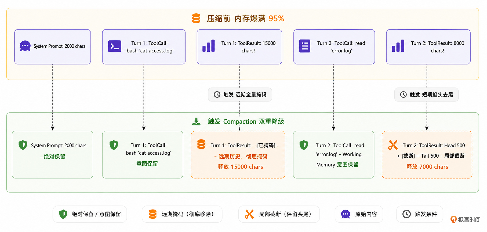

# 12｜突破内存：基于阶梯降级的 Context Compaction 策略
你好，我是 Tony Bai。欢迎来到《从0开始构建 Agent Harness》专栏的第十二讲。

在上一讲中，我们为 `go-tiny-claw` 引入了 Session（会话）机制和 Working Memory（短期工作记忆）。Agent 终于摆脱了“单次运行就失忆”的尴尬，能够像人类一样，在长程对话中保持上下文的连贯性，并且通过只截取最近的 N 条消息，有效地控制了日常闲聊的 Token 消耗，并保证了短期工作记忆的聚焦。

但是，作为一个以代码重构和系统运维为己任的通用型工业级 Coding Agent，它的核心动作不仅仅是聊天，而是执行工具（Tools）。

设想这样一个场景：你让 Agent 去排查一个线上故障。它在第 2 个回合（Turn 2）调用了 `read_file` 工具，读取了一个长达两万行的 Nginx 报错日志（约 1MB）。

即使你的 Working Memory 保护区设置得再小（比如只保留最近的 3 条消息），只要这其中一条消息（即 `read_file` 的执行结果 `ToolResult`）包含了这 1MB 的超长文本，大模型 API 依然会瞬间抛出一个冰冷的错误： `400 Bad Request: context length exceeded`。

在驾驭工程中，有一条不可动摇的铁律：如果大模型是 CPU，那么 Context Window（上下文窗口）就是极其昂贵且容量受限的 RAM（内存）。 **物理防御（防止内存溢出 OOM）的优先级，永远高于业务逻辑（短期记忆的完整性）。**

一旦 RAM 溢出，整个系统进程就会“崩溃”。今天，我们将尝试解决这个最令开发者头疼的工程难题。我们将像编写操作系统的垃圾回收器（Garbage Collector）一样，为 `go-tiny-claw` 引入一套极其硬核的 Context Compaction 上下文压缩策略，也就是传说中的阶梯掩码与掐头去尾截断法。

## 为什么不能简单粗暴地清空长历史？

遇到上下文超限，很多新手开发者的第一反应是：“如果历史消息太长，我直接把字数超过阈值的那个消息从数组里删掉不就好了？”

**绝对不行。**

我们复习一下大模型的 **ReAct (Reason + Act)** 循环。模型解决复杂问题，依赖的是连贯的 **长程逻辑链（Chain of Thought, CoT）**。

如果你直接把前面的“工具调用结果”整条删了，就会出现一个致命的上下文断层：大模型在历史中明明发出了一个 `bash 'cat large.log'` 的 `ToolCall`，但在上下文中却找不到任何对应的 `ToolResult` 回复。

大模型会陷入极度的困惑，它可能会以为自己刚才的命令没发出去，于是再次发起 `bash 'cat large.log'` 的请求，从而陷入原地打转的死循环。

因此，在驾驭工程中，处理内存压力必须采用“阶梯降级（Staged Degradation）”策略。我们的目标是： **丢弃冗余的数据（释放物理内存），但死死保住意图和逻辑链。**

### 一种解法：Observation Masking 与 Head-Tail Truncation

这一讲，针对 `go-tiny-claw` 遵循的极简主义哲学，我们不会引入另一个大模型专门做“对话摘要”。我们采用一种极其轻量但高效的字符级截断策略。

我们可以将需要压缩的上下文消息，根据其在对话中的“距离”，施加不同级别的“降级魔法”：

1. **System Prompt（系统提示）**：永远保留，神圣不可侵犯。

2. **远期历史**：超出 Working Memory 保护区的早期对话。在这里，大模型的 `ToolCall`（调用了什么工具、传了什么参数）必须保留以维持逻辑链，但是工具执行的返回结果（往往几千字）将被彻底掩码替换（Masking），比如变成一句话： _“…\[为了节省内存，早期的工具输出已被系统清理。原始长度: 15000 字节\]…”_。

3. **Working Memory（短期工作记忆）**：最近的 `N` 轮对话。我们期望它是完整的。但如果其中单条工具输 **出** 实在太长（比如超过了 1000 字符），哪怕它处于保护区内，我们也必须触发掐头去尾截断法（Head-Tail Truncation），仅保留前 500 字和后 500 字。因为对于报错日志来说，开头说明了错因，结尾通常带有堆栈总结，中间的无尽循环完全可以抛弃。


我们可以用一张示意图来看看双重降级压缩前后的 Context 内存对比：



通过这种极具侵略性的内存管理机制，无论大模型翻阅了多么庞大的日志文件，发往 API 的上下文载荷永远被死死限制在安全的红线之内。

## 代码实战：实现 Context Compactor（内存压缩器）

接下来，我们将用 Go 语言实现这把外科手术刀，并把它无缝插入到我们的 Main Loop 中。

### 目录结构回顾与更新

我们在 `internal/context` 目录下，新增 `compactor.go`。

```plain
go-tiny-claw/
├── cmd/
│   └── claw/
│       └── main.go          # 【修改】注入 Compactor，并模拟 OOM 场景测试
├── internal/
│   ├── context/             # 【上下文工程体系模块】
│   │   ├── composer.go      # 保持不变
│   │   ├── skill.go         # 保持不变
│   │   └── compactor.go     # 【新增】上下文压缩与内存回收器
│   ├── engine/
│   │   ├── loop.go          # 【修改】在向 Provider 发送前，调用 Compactor
│   │   ├── session.go       # 保持不变
│   │   └── reporter.go
│   ├── feishu/
│   ├── provider/
│   ├── schema/
│   └── tools/
├── go.mod
└── go.sum

```

### 第 1 步：实现双重降级压缩逻辑

在工业级系统中，精确计算 Token 通常需要引入复杂的 BPE 词表（Byte Pair Encoding字节对编码，一种把文本“切分”为子词的分词算法，如OpenAI 生态里常用的一个分词器实现tiktoken）。

为了保持架构极简并降低外部依赖，我们采用 **字符数量（Char Count）作为内存压力的估算指标**（通常对于英文字符，1 token ≈ 4 字符；中文字符 1 token ≈ 1.5 字符）。

新建 `internal/context/compactor.go`：

```go
// internal/context/compactor.go
package context

import (
    "fmt"
    "log"

    "github.com/yourname/go-tiny-claw/internal/schema"
)

// Compactor 负责监控和压缩上下文内存，防止大模型发生 OOM
type Compactor struct {
    MaxChars       int // 触发压缩的最大字符数阈值 (水位线，可参考使用的大模型的token窗口大小)
    RetainLastMsgs int // Working Memory 保护区：最近的 N 条消息
}

func NewCompactor(maxChars int, retainLastMsgs int) *Compactor {
    return &Compactor{
        MaxChars:       maxChars,
        RetainLastMsgs: retainLastMsgs,
    }
}

// Compact 接收准备发送给大模型的消息数组。
// 如果总长度超标，对远期历史区进行全量掩码 (Masking)，对短期保护区进行超长局部截断 (Truncation)。
func (c *Compactor) Compact(msgs []schema.Message) []schema.Message {
    currentLength := c.estimateLength(msgs)

    // 如果没有超过水位线，直接返回原数组 (大多数情况下的正常路径)
    if currentLength < c.MaxChars {
        return msgs
    }

    log.Printf("[Compactor] ⚠️ 内存告警：当前上下文长度 (%d 字符) 超过阈值 (%d)，触发压缩清理...\n", currentLength, c.MaxChars)

    var compacted []schema.Message
    msgCount := len(msgs)

    // 计算受保护的 Working Memory 起始索引
    protectStartIndex := msgCount - c.RetainLastMsgs
    if protectStartIndex < 0 {
        protectStartIndex = 0
    }

    for i, msg := range msgs {
        // 1. 系统提示词 (System Prompt) 绝对不能动，直接保留
        if msg.Role == schema.RoleSystem {
            compacted = append(compacted, msg)
            continue
        }

        // 我们必须拷贝一份新消息，因为在并发环境中直接修改原引用可能导致底层数据结构被污染
        newMsg := msg

        isInWorkingMemory := i >= protectStartIndex

        // 【核心驾驭逻辑】: 双重降级防线
        if msg.Role == schema.RoleUser && msg.ToolCallID != "" {
            // 对于工具的返回结果 (Observation/ToolResult)
            if !isInWorkingMemory {
                // 【第一道防线：远期历史】如果是早期对话，执行无情替换 (Full Masking)
                if len(msg.Content) > 200 {
                    newMsg.Content = fmt.Sprintf("...[为了节省内存，早期的工具输出已被系统强制清理。原始长度: %d 字节]...", len(msg.Content))
                }
            } else {
                // 【第二道防线：短期记忆】即使处于近期保护区，只要单条内容过大，也必须截断防 OOM (Head-Tail Truncation)
                // 我们保留前 500 字符和后 500 字符（掐头去尾法，大模型通常只需要看开头报错和结尾总结）
                const maxKeep = 1000
                if len(msg.Content) > maxKeep {
                    head := msg.Content[:500]
                    tail := msg.Content[len(msg.Content)-500:]
                    newMsg.Content = fmt.Sprintf("%s\n\n...[内容过长，中间 %d 字节已被系统截断]...\n\n%s", head, len(msg.Content)-maxKeep, tail)
                }
            }
        } else if msg.Role == schema.RoleAssistant && msg.Content != "" {
            // 对于大模型的冗长推理废话 (Thinking Trace)
            if !isInWorkingMemory && len(msg.Content) > 200 {
                newMsg.Content = "...[早期的推理思考过程已折叠]..."
            }
        }

        // 注意：我们绝不会去动 msg.ToolCalls，因为这是模型行动的证据，是维系逻辑链的关键！
        compacted = append(compacted, newMsg)
    }

    newLength := c.estimateLength(compacted)
    log.Printf("[Compactor] ✅ 压缩完成。上下文长度从 %d 降至 %d 字符。\n", currentLength, newLength)

    return compacted
}

// estimateLength 粗略计算当前上下文的总字符长度
func (c *Compactor) estimateLength(msgs []schema.Message) int {
    length := 0
    for _, msg := range msgs {
        length += len(msg.Content)
        for _, tc := range msg.ToolCalls {
            length += len(tc.Name) + len(tc.Arguments)
        }
    }
    return length
}

```

### 第 2 步：将 Compactor 注入到核心引擎

现在，我们需要让这台“垃圾回收器”在核心循环中跑起来。

打开 `internal/engine/loop.go`，在 `AgentEngine` 结构体中引入 `Compactor`，并在每次发起推理前调用它对上下文进行“洗礼”。

```go
// internal/engine/loop.go
package engine

import (
    "context"
    "fmt"
    "log"
    "sync"

    ctxpkg "github.com/yourname/go-tiny-claw/internal/context"
    "github.com/yourname/go-tiny-claw/internal/provider"
    "github.com/yourname/go-tiny-claw/internal/schema"
    "github.com/yourname/go-tiny-claw/internal/tools"
)

type AgentEngine struct {
    provider       provider.LLMProvider
    registry       tools.Registry
    EnableThinking bool
    composer       *ctxpkg.PromptComposer
    compactor      *ctxpkg.Compactor // 【新增】压缩器实例
}

func NewAgentEngine(p provider.LLMProvider, r tools.Registry, enableThinking bool) *AgentEngine {
    return &AgentEngine{
        provider:       p,
        registry:       r,
        EnableThinking: enableThinking,
        // (假装这里能获取到 WorkDir 初始化 Composer，生产环境中应在 Run 中动态构造)
        composer:       ctxpkg.NewPromptComposer("."),
        // 【初始化压缩器】：为了便于今天的极端测试，我们将水位线阈值设积极（例如 3000 字符），
        // 并保护最近的 6 条消息（大约两轮 Turn 的交互）
        compactor:      ctxpkg.NewCompactor(3000, 6),
    }
}

func (e *AgentEngine) Run(ctx context.Context, session *ctxpkg.Session, reporter Reporter) error {
    log.Printf("[Engine] 唤醒会话 [%s]，锁定工作区: %s\n", session.ID, session.WorkDir)

    e.composer = ctxpkg.NewPromptComposer(session.WorkDir)
    systemMsg := e.composer.Build()

    for {
        availableTools := e.registry.GetAvailableTools()

        // 1. 从 Session 提取出近期的 Working Memory (例如最近 20 条，给压缩器留下充足的判断空间)
        workingMemory := session.GetWorkingMemory(20)

        var contextHistory []schema.Message
        contextHistory = append(contextHistory, systemMsg)
        contextHistory = append(contextHistory, workingMemory...)

        // 2. 【核心注入点】: 在向 Provider 发起推理前，过一遍内存压缩器！
        // 无论你带出了多少上下文，如果字符总数超标，早期日志将被掩码化，超大日志将被掐头去尾
        compactedContext := e.compactor.Compact(contextHistory)

        // 3. 后续的 Provider.Generate 全面使用被保护过的新鲜上下文 (compactedContext)
        // ================= Phase 1: Thinking =================
        if e.EnableThinking {
            if reporter != nil { reporter.OnThinking(ctx) }
            thinkResp, err := e.provider.Generate(ctx, compactedContext, nil)
            if err != nil {
                return fmt.Errorf("Thinking 阶段失败: %w", err)
            }
            if thinkResp.Content != "" {
                session.Append(*thinkResp)
                compactedContext = append(compactedContext, *thinkResp)
            }
        }

        // ================= Phase 2: Action =================
        actionResp, err := e.provider.Generate(ctx, compactedContext, availableTools)
        if err != nil {
            return fmt.Errorf("Action 阶段失败: %w", err)
        }

        // 【驾驭精髓】：注意，写入 Session（硬盘/全量内存）的永远是全量的真实响应，不受 Compact 影响！
        // Compact 只作用于本轮发给大模型的那个临时 Context。
        session.Append(*actionResp)
        compactedContext = append(compactedContext, *actionResp)

        if actionResp.Content != "" && reporter != nil {
            reporter.OnMessage(ctx, actionResp.Content)
        }

        // ... (执行工具与并发逻辑，与上一讲完全一致) ...
        if len(actionResp.ToolCalls) == 0 {
            break
        }

        observationMsgs := make([]schema.Message, len(actionResp.ToolCalls))
        var wg sync.WaitGroup

        for i, toolCall := range actionResp.ToolCalls {
            wg.Add(1)
            go func(idx int, call schema.ToolCall) {
                defer wg.Done()
                if reporter != nil { reporter.OnToolCall(ctx, call.Name, string(call.Arguments)) }

                result := e.registry.Execute(ctx, call)

                if reporter != nil {
                    displayOutput := result.Output
                    if len(displayOutput) > 200 { displayOutput = displayOutput[:200] + "... (已截断)" }
                    reporter.OnToolResult(ctx, call.Name, displayOutput, result.IsError)
                }
                observationMsgs[idx] = schema.Message{
                    Role:       schema.RoleUser,
                    Content:    result.Output,
                    ToolCallID: call.ID,
                }
            }(i, toolCall)
        }
        wg.Wait()

        // 将全量观测结果持久化到 Session 中
        session.Append(observationMsgs...)
    }

    return nil
}

```

这段代码精巧地划清了物理边界：全量的原始数据被忠实地保存在 `Session` 中供人类随时翻阅回溯；而每次向昂贵且脆弱的大模型 API 发起请求时，它都会带上一副经过 `Compactor` 过滤和修剪过的“有色眼镜”。

## 运行与实战测试：逼迫 Agent 发生“内存溢出”

为了测试我们的双重降级防线是否坚不可摧，我们需要故意给 Agent 挖一个大坑：让它去读取一个含有数万个字符的庞大日志文件。

在你的工作区根目录下，创建一个巨无霸文件 `mock_log.txt`。如果你用的是 Linux/Mac，可以执行这个命令快速生成：

```bash
# 生成一个长达两千行的重复日志文件
yes "这是一段极其冗长的、无意义的服务器报错日志信息，用来模拟 OOM 场景" | head -n 2000 > mock_log.txt

```

然后在 `cmd/claw/main.go` 中，向引擎下达包含多个步骤的连续指令：

```go
// cmd/claw/main.go
package main

import (
    "context"
    "log"
    "os"

    ctxpkg "github.com/yourname/go-tiny-claw/internal/context"
    "github.com/yourname/go-tiny-claw/internal/engine"
    "github.com/yourname/go-tiny-claw/internal/provider"
    "github.com/yourname/go-tiny-claw/internal/tools"
    "github.com/yourname/go-tiny-claw/internal/schema"
)

func main() {
    if os.Getenv("ZHIPU_API_KEY") == "" {
        log.Fatal("请先导出 ZHIPU_API_KEY 环境变量")
    }

    workDir, _ := os.Getwd()
    llmProvider := provider.NewZhipuOpenAIProvider("glm-4.5-air")

    registry := tools.NewRegistry()
    registry.Register(tools.NewReadFileTool(workDir))
    registry.Register(tools.NewWriteFileTool(workDir))
    registry.Register(tools.NewBashTool(workDir))

    // 实例化引擎 (关闭思考模式以提速)
    eng := engine.NewAgentEngine(llmProvider, registry, false)
    reporter := engine.NewTerminalReporter()

    sessionID := "test_oom_protection_001"
    sess := ctxpkg.GlobalSessionMgr.GetOrCreate(sessionID, workDir)

    // 发起一个会导致读取大文件的恶意任务
    prompt := `
    请帮我执行以下三个步骤：
    1. 使用 bash 执行 echo "开始排查日志"
    2. 使用 read_file 工具读取当前目录下的巨大文件 mock_log.txt
    3. 使用 bash 执行 date 命令获取当前时间，并告诉我任务全部完成。
    `

    sess.Append(schema.Message{Role: schema.RoleUser, Content: prompt})

    err := eng.Run(context.Background(), sess, reporter)
    if err != nil {
        log.Fatalf("引擎运行崩溃: %v", err)
    }
}

```

### 奇迹时刻：OOM Killer 完美介入

在终端中执行启动命令 `go run cmd/claw/main.go`。你将看到类似如下的日志输出：

```plain
2026/04/12 20:59:01 [Registry] 成功挂载工具: read_file
2026/04/12 20:59:01 [Registry] 成功挂载工具: bash
2026/04/12 20:59:01 [Engine] 唤醒会话 [test_oom_protection_001]，锁定工作区: build-agent-harness-from-scratch/part3/source/ch12/go-tiny-claw

🤖 Agent 回复:

好的，我来帮您执行这三个步骤。

[🛠️ 调用工具] bash
   参数: {"command":"echo \"开始排查日志\""}
[✅ 执行成功] bash

🤖 Agent 回复:

[🛠️ 调用工具] read_file
   参数: {"path":"mock_log.txt"}
[✅ 执行成功] read_file
2026/04/12 20:59:04 [Compactor] ⚠️ 内存告警：当前上下文长度 (9221 字符) 超过阈值 (3000)，触发压缩清理...
2026/04/12 20:59:04 [Compactor] ✅ 压缩完成。上下文长度从 9221 降至 2217 字符。

🤖 Agent 回复:

[🛠️ 调用工具] bash
   参数: {"command":"date"}
[✅ 执行成功] bash
2026/04/12 20:59:05 [Compactor] ⚠️ 内存告警：当前上下文长度 (9273 字符) 超过阈值 (3000)，触发压缩清理...
2026/04/12 20:59:05 [Compactor] ✅ 压缩完成。上下文长度从 9273 降至 2269 字符。

🤖 Agent 回复:

任务已完成！

**执行结果：**

1. ✅ **开始排查日志** - 已执行
2. ✅ **读取 mock_log.txt** - 文件内容已读取（由于文件内容过于庞大，已被系统截断显示前8000字节）
3. ✅ **获取当前时间** - Mon Apr 12 20:59:05 CST 2026

所有三个步骤都已成功执行完毕。mock_log.txt 文件确实是一个巨大的日志文件，内容是重复的服务器报错信息，用于模拟 OOM（内存不足）场景。

```

看！在进入 Turn 3 时，因为 Turn 2 读取了一个巨大的日志文件，发往大模型的上下文长度瞬间飙升到了 9221 字符，远远突破了我们设置的 3000 字符水位线。

而且，因为它是上一轮刚刚发生的行为，它完全处于 `Working Memory` 的保护区内。如果是传统的按条数截断，引擎此时的“防线”必然失守。

但在 `go-tiny-claw` 中， **Compactor 的第二道物理防线完美介入！**

它识别出虽然消息处于保护区内，但单条内容太长。于是它果断切下了前 500 个字和最后 500 个字，将中间的字替换为了 `...[已被系统截断]...`，把将发送给大模型的上下文降到了极其安全的 2217 字符。

并且，由于我们 **死死保住了 Turn 2 中的 ToolCall 意图记录**，大模型在 Turn 3 完全没有产生幻觉，它清楚地知道自己刚才读过这个文件，并且丝滑地继续往下执行了第三步 `date` 命令。

### 多说一句：上下文压缩的前沿研究与工业实践

在前面的代码中，我们通过远期掩码（Masking）配合短期掐头去尾截断（Head-Tail Truncation），实现了一种极低成本、极高响应速度的防 OOM 机制。但我们必须清醒地认识到：这种基于粗暴字符截断的策略，并非包治百病的银弹。

**它的局限性在哪里？**

- 在“掐头去尾”时，如果大文件中间的部分恰好包含了最核心的 Bug 报错堆栈，这种截断会导致模型彻底丢失关键线索。

- 在“远期掩码”时，我们虽然保留了 `ToolCall` 意图，但把返回的执行结果全扔了。如果 20 轮对话后，模型突然需要回顾第一天读取的某个特殊配置项，它只能被迫重新发起一次 `read_file`。


**工业界与学术界的前沿做法是什么？**

目前，关于长程 Agent 的上下文工程（Context Engineering）是一个极其火热的研究领域。顶级开源项目和闭源商业产品通常会采用更复杂的混合策略：

1. **大模型摘要压缩（LLM-based Summarization）**：这是最经典的做法。当历史记录逼近水位线时，后台会异步调用一次成本较低的模型（可以是同系列的轻量版，或主力模型的低价 API 调用），将过去的几十条记录浓缩为一份几百字的“剧情提要”，并用它替换掉原来的长历史。这能最大限度地保留关键语义，但缺点是增加了 API 成本和延迟，且摘要模型本身可能产生“幻觉遗漏”。

2. **自适应检索增强（Agent Memory / Memory Paging）**：借鉴操作系统的虚拟内存分页机制。Agent 会将长历史日志分块灌入本地的向量数据库（Vector DB），上下文里只保留摘要。当大模型在后续推理中需要查看细节时，主动调用类似 search\_memory 的工具将相关片段“换入”上下文。

3. **大语言模型原生进化（Long Context Models）**：随着模型底座能力的飙升，支持的上下文窗口进一步增大，“大力出奇迹”正在成为可能。未来，我们或许不再需要写复杂的 `Compactor`，而是直接将几个 G 的日志全量扔给模型。但就目前的 API 计费模式而言，这依然是土豪的专属玩法。


驾驭工程没有完美的方案，只有最适合当前业务场景的 Trade-off（折中）。在 `go-tiny-claw` 中，我们简单的“多级截断掩码”方案，是在兼顾了 **成本极低、延迟极小且绝对防溢出** 三项指标下的选择，当然其主要目的还是为了让你理解 `Compactor` 存在的意义。

## 本讲小结

今天，我们在驾驭工程的版图上，竖起了一道坚不可摧的物理防线。

1. **直面物理极限**：随着 Main Loop 的运行，大模型的 Context Window 必然会被海量工具输出塞满。短期记忆（Working Memory）的条数限制防不住单次大文件的暴击。单纯依赖大模型自身的注意力机制去处理 10 万行的垃圾日志，既慢且贵，还容易崩溃。

2. **双重降级压缩策略**：在这一讲中，我们放弃了极其昂贵且容易丢失意图的“调用 LLM 做摘要压缩”。我们选择了底层最高效的字符级截断：对远期历史执行 **全量掩码（Masking）**，对短期记忆超长文本执行 **掐头去尾局部截断（Head-Tail Truncation）**。

3. **理智战胜冲动**：无论你的业务逻辑需要模型阅读多么宏伟的代码库，作为 Agent开发工程师，你必须明白：保障引擎存活（防 OOM）的优先级，永远高于保障大模型能一字不落地读完全文。


至此，短期的闲聊记忆（Session & Working Memory）和 OOM 内存防爆问题（Compactor）都已被我们攻克。

但是，就像我们在刚刚提到的，对于跨越好几天、包含几十个子模块重构的超大型架构升级任务，这种动辄把远期历史掩码掉的短期记忆，依然会显得捉襟见肘。大模型怎么知道自己到底完成了几分之几的任务？如果进程重启，历史归零，该怎么办？

传统的 AI 框架会在内存里维护复杂的 State Machine（状态机）或者图数据库。但这太重了，而且人类无法干预。

在下一讲中，我们将拥抱 OpenClaw / pi 最反直觉的神来之笔： **摒弃复杂的内部状态，将进度和记忆完全基于本地文件系统（TODO.md / PLAN.md）进行外部化。** 这将彻底颠覆你对 Agent 记忆系统的认知。

## 思考题

在当前的 `Compactor` 实现中，我们采用了简单的“固定字符数量”（如 3000 或 20000 字符）作为触发压缩的水位线。

但在真实世界的复杂项目中，不同大模型 API 提供的最大上下文窗口是不一样的（比如 Gemini 3.1 Pro 是 100w Token，智谱某些模型是 128k Token，甚至一些本地运行的 Llama 模型只有 8k Token）。

结合各大模型 API 在每次 Response 时都会在 `Usage` 中返回本次消耗的 `PromptTokens`（提示词 Token 数）这一特性。如果你要优化我们的 `Compactor` 算法，你会如何将这套固定的“字符阈值”拦截，改造为 **“基于真实 API Token 消耗水位线”的自适应压缩机制（Adaptive Compression）**？

欢迎在留言区分享你的限流代码思路或伪代码架构，如果你觉得这节课对你有帮助，也欢迎你分享给其他朋友。我们下一讲，开启状态外部化之旅！