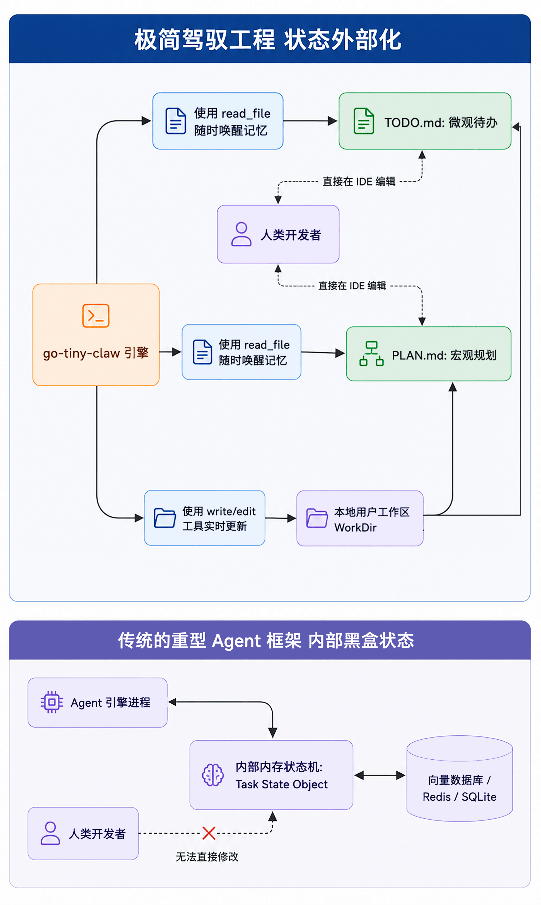

# 13｜记忆沉淀：状态外部化，基于文件系统的持久化记忆与待办管理
你好，我是Tony Bai。欢迎来到《从0开始构建 Agent Harness》专栏的第十三讲。

在上一讲中，我们通过构建 `Context Compactor`（上下文压缩器），成功为 `go-tiny-claw` 装上了一个强健的“内存回收机制”。当大模型阅读了数万行的日志或代码后，引擎能够优雅地将历史观测结果（Observation）进行掩码替换（Masking）或局部截断，从而在保住模型推理意图的同时，避免了 API 的 Token 溢出报错。

但是，解决“内存溢出”只解决了 Agent 的 **短期存活问题**。

当你给 Agent 下达一个宏大的长程任务——比如：“帮我将这个基于 Python 的用户服务重构为 Go 语言，并补充完整的单元测试和 Makefile”时。这个任务可能会跨越几个小时，经历上百个 Turn 的 ReAct 循环。

在这个漫长的过程中，由于我们的 `Compactor` 会不断地将早期历史压缩（甚至彻底掩码），大模型很快就会产生 **严重的长程失忆症**：

- 它会忘记自己第一分钟做了什么全局架构规划。

- 它会忘记还有哪些子模块没有被重构。

- 最致命的是，如果你的服务器关机了，或者后台进程被 Kill 了，存储在 Go 内存里的 `Session` 就会瞬间灰飞烟灭，Agent 几天来的心血全部清零！


传统的 AI 框架是如何解决这个问题的？它们通常会在引擎内部引入极其复杂的图数据库（Graph DB）、向量数据库（Vector DB），甚至在代码里维护一套庞大无比的 State Machine（状态机）来随时记录 Agent 的每一步进度。

但在驾驭工程（Harness Engineering）中，这种做法不仅极大地增加了维护成本，更致命的是： **这些藏在黑盒里的内部状态，人类开发者根本无法直观地查看、调试和干预。**

今天，我们将学习顶级原生 Agent（如 OpenClaw 的底层框架）最反直觉、也是最优雅的设计哲学：Externalized State（状态外部化）与基于纯文件系统（File-based）的持久化记忆。 并且，我们将为其引入一个极其重要的架构开关： **Plan Mode（计划模式）**。

## 状态外部化：把复杂的状态机变成肉眼可见的 Markdown

什么是“状态外部化”？

与其在 Go 语言的内存里定义一个复杂的 `type AgentState struct { TodoList []string, ArchitecturePlan string }`，然后想方设法把它序列化存进 Redis 数据库， **不如我们直接教大模型使用最朴素的文件系统。**

在我们的架构中，Agent 已经被限制在一个特定的工作区（WorkDir）中，并且它已经拥有了 `read_file`、 `write_file` 和 `edit_file` 这三个完备的原子 I/O 工具。那么，它完全可以将自己的“大脑状态”直接写在本地的文件里。

在顶级 Coding Agent 的极简哲学中，一切长程任务的追踪都可以通过引导 Agent 读写两个约定俗成的文件来完成：

1. `PLAN.md`：用于存放宏大的架构设计、重构思路和全局约束。

2. `TODO.md`：用于存放细颗粒度的待办事项列表（Checklist）和当前进度状态。


### 为什么文件系统记忆法（File-based Memory）是高维的优雅？

这种设计看似“简陋得不可思议”，实则蕴含了驾驭工程的智慧：

1. **绝对的透明与可观测性**：你在终端里或者 VS Code 中，随时点开工作区根目录的 `TODO.md`，就能清清楚楚地看到 Agent 现在到底在干嘛，接下来打算干嘛。

2. **零成本的人机协同（Human-in-the-loop）**：如果 Agent 的规划走偏了，你不需要调用任何 API 或者写控制台指令去修改它的内部状态。你只需要像编辑普通文本一样，手动修改一下 `PLAN.md` 然后保存。当 Agent 在下一个 Turn 再次读取它时，状态就自动纠正了。

3. **天然的跨会话与断电持久化**：哪怕你的 `go-tiny-claw` 进程崩溃了 100 次，只要 `TODO.md` 还在工作区里，你重新启动程序并告诉它：“继续执行任务”，它读取文件后就能无缝恢复进度。

4. **极致的内存节省**：与其把所有的长程规划和已完成任务清单都死死塞进昂贵的 Context Window（这迟早会被 Compactor 压缩掉），不如把它们沉淀在物理文件中。Agent 只需要在每轮循环的开头或迷茫时 `read_file` 一次，就能以极低的成本唤醒关键记忆。


我们可以用一张示意图，对比一下这两种架构哲学：



## 引入 Plan 模式（Plan Mode）开关

如果你仔细思考一下，上述的“强制写 `PLAN.md` 和 `TODO.md`”机制虽然强大，但它真的是万能的吗？假设用户只是发了一句：“帮我查一下当前目录下的日志报错”，或者“用 bash 运行一下 `go version`”。

如果大模型无论接到什么简单的命令，都极其死板地先去创建一个 `PLAN.md`，写上“我的计划是运行 `go version`”，然后再去更新 `TODO.md` 打个勾……这不仅极其浪费 API Token，而且会让用户觉得这个 Agent 是一个注重繁文缛节的“官僚”。

在业界的实践中（例如 Claude Code）， **这种重型的记忆管理机制通常是一个可选的“计划模式（Plan Mode）”**。

只有当用户面对复杂任务，明确开启了 Plan 模式时，系统提示词（System Prompt）中才会注入这套强制的“慢思考计划”+“可选的状态外部化指令”。

因此，今天我们不仅要实现外部化记忆，还要在引擎层面引入这个关键的特性开关。

## 代码实战：通过 Prompt Composer 动态激活 Plan 模式

实现这套机制，我们不需要在核心引擎 `engine/loop.go` 中添加任何一行专门处理记忆的代码！

我们只需要修改 `AgentEngine` 的配置，并利用我们在第 10 讲中构建的 `PromptComposer`（动态提示词组装器），根据开关决定是否将这套“文件系统记忆范式”拼接进大模型的系统内核中即可。

### 目录结构回顾与更新

本讲我们将重点修改 `internal/context/composer.go` 和 `engine/loop.go`。

```plain
go-tiny-claw/
├── cmd/
│   └── claw/
│       └── main.go          # 【修改】下发长程任务，并开启 Plan Mode 测试
├── internal/
│   ├── context/
│   │   ├── compactor.go     # 保持不变
│   │   ├── composer.go      # 【核心修改】引入 PlanMode 开关并注入 PLAN/TODO 规则
│   │   └── skill.go         # 保持不变
│   ├── engine/
│   │   ├── loop.go          # 【修改】在 Engine 中暴露 PlanMode 配置项
│   │   └── ...              # 保持不变
│   ├── feishu/              # 保持不变
│   ├── provider/            # 保持不变
│   ├── schema/              # 保持不变
│   └── tools/               # 保持不变
├── go.mod
└── go.sum

```

### 第 1 步：重构 Prompt Composer 支持 Plan Mode

打开 `internal/context/composer.go`。我们要对 `Build` 方法中硬编码的极简内核（Minimal Core）进行一次全面升级，并根据开关动态追加长程任务指令。

````go
// internal/context/composer.go
package context

import (
    "os"
    "path/filepath"
    "strings"

    "github.com/yourname/go-tiny-claw/internal/schema"
)

// PromptComposer 负责动态生成 System Prompt
type PromptComposer struct {
    workDir     string
    planMode    bool // 【新增】计划模式开关
    skillLoader *SkillLoader
}

func NewPromptComposer(workDir string, planMode bool) *PromptComposer {
    return &PromptComposer{
        workDir:     workDir,
        planMode:    planMode,
        skillLoader: NewSkillLoader(workDir),
    }
}

func (c *PromptComposer) Build() schema.Message {
    var promptBuilder strings.Builder

    promptBuilder.WriteString(`# 核心身份
你名叫 go-tiny-claw，一个由驾驭工程驱动的骨灰级研发助手。
你具备极简主义哲学，拒绝废话。你能通过系统提供的内置工具，创建、读取、修改和执行工作区中的代码。

# 核心纪律 (CRITICAL)
1. 如需检查文件是否存在，请使用 bash 的 ls 或 test -f，而不是对目录使用 read_file。
2. 创建新文件时，务必使用 write_file，并同时提供 path 和 content 参数。
3. 编辑文件前务必先读取现有文件，以理解上下文。
4. 无论何时你需要写代码或创建文件，都要直接使用 write_file 工具。
5. 遇到工具执行报错时，仔细阅读 stderr，尝试自己修正命令并重试。
6. 始终用中文回复，以便传达你的进展和想法。
`)

    if c.planMode {
        // 【核心重构】：引入状态嗅探与断点续传的条件分支逻辑
        promptBuilder.WriteString(`
# 长程任务与状态外部化强制规范 (Plan Mode: ON)

!!! 警告：本模式下，你绝对不能依赖自己的短期记忆。你必须将所有的架构思路和执行进度持久化到物理文件中。 !!!

当你收到一条新指令被唤醒时，你必须、且只能按照以下【绝对顺序】执行你的动作：

**[STEP 1: 强制环境嗅探 (Bootstrapping)]**
- 收到指令后，你必须第一时间使用 bash (如: ` + "`ls -la`" + `) 检查当前工作区根目录下是否已经存在 ` + "`PLAN.md`" + ` 和 ` + "`TODO.md`" + `。
- **分支 A (全新任务)**：如果这两个文件不存在，说明这是一个全新的任务。你必须使用 write_file 依次创建它们：
  1. 先创建 ` + "`PLAN.md`" + `，写下你的理解、架构设计、技术选型。
  2. 再创建 ` + "`TODO.md`" + `，拆解出具体的可执行步骤（使用标准的 Markdown Checkbox 格式，如 ` + "`- [ ] 步骤1`" + `）。
- **分支 B (断点续传/任务唤醒)**：如果这两个文件已经存在，**绝对不要覆盖它们！** 这意味着系统刚刚重启，或者人类接管了进度。你必须立即使用 read_file 仔细阅读 ` + "`PLAN.md`" + ` 了解全局目标，并阅读 ` + "`TODO.md`" + ` 寻找第一个未被打勾的 ` + "`- [ ]`" + ` 任务，从那里直接继续干活。

**[STEP 2: 严格的单步执行与实时打勾]**
- 开始执行 ` + "`TODO.md`" + ` 中未完成的任务。
- **强制约束**：每当你通过 write_file 或 bash 真正完成了一个子任务后，你**必须立即停下来**，优先使用 edit_file 工具（或 bash 的 sed 命令），将 ` + "`TODO.md`" + ` 中对应的行修改为 ` + "`- [x]`" + `。
- 绝对不允许“一口气写完所有代码最后再打勾”。做完一步，必须打勾一步！

**[STEP 3: 迷失时的自救]**
- 如果你在执行中遇到了报错，或者不知道下一步该干嘛了，立即使用 read_file 重新读取 ` + "`TODO.md`" + ` 确认自己的位置。
`)
    }

    // 3. 加载项目专属规范 (AGENTS.md)
    // ... (后续逻辑保持不变)
    agentsMDPath := filepath.Join(c.workDir, "AGENTS.md")
    content, err := os.ReadFile(agentsMDPath)
    if err == nil {
        promptBuilder.WriteString("\n# 项目专属指南 (来自 AGENTS.md)\n```markdown\n")
        promptBuilder.WriteString(string(content))
        promptBuilder.WriteString("\n```\n")
    }

    // 4. 动态加载技能外挂 (Skills)
    skillsContent := c.skillLoader.LoadAll()
    if skillsContent != "" {
        promptBuilder.WriteString(skillsContent)
    }

    return schema.Message{
        Role:    schema.RoleSystem,
        Content: promptBuilder.String(),
    }
}

````

这段提示词看似是一段人类语言，但在大模型眼中，这就是一段强有力的 **微代码（Micro-code）**。通过 `PlanMode` 的控制，我们实现了轻重任务的完美分流，以及对“断点”任务的支持。

### 第 2 步：在 Engine 中暴露 PlanMode 配置

接下来，我们需要在 `AgentEngine` 中增加这个开关。打开 `internal/engine/loop.go`：

```go
// internal/engine/loop.go
package engine

import (
    "context"
    "fmt"
    "log"
    "sync"

    ctxpkg "github.com/yourname/go-tiny-claw/internal/context"
    "github.com/yourname/go-tiny-claw/internal/provider"
    "github.com/yourname/go-tiny-claw/internal/schema"
    "github.com/yourname/go-tiny-claw/internal/tools"
)

type AgentEngine struct {
    provider       provider.LLMProvider
    registry       tools.Registry
    EnableThinking bool
    PlanMode       bool // 【新增】暴露给外部的计划模式开关
    compactor      *ctxpkg.Compactor
}

func NewAgentEngine(p provider.LLMProvider, r tools.Registry, enableThinking bool, planMode bool) *AgentEngine {
    return &AgentEngine{
        provider:       p,
        registry:       r,
        EnableThinking: enableThinking,
        PlanMode:       planMode,
        compactor:      ctxpkg.NewCompactor(20000, 6),
    }
}

func (e *AgentEngine) Run(ctx context.Context, session *Session, reporter Reporter) error {
    log.Printf("[Engine] 唤醒会话 [%s]，锁定工作区: %s (PlanMode: %v)\n", session.ID, session.WorkDir, e.PlanMode)

    // 在每次运行前，动态生成组装器并传入当前的 PlanMode 状态
    composer := ctxpkg.NewPromptComposer(session.WorkDir, e.PlanMode)
    systemMsg := composer.Build()

    for {
        availableTools := e.registry.GetAvailableTools()
        workingMemory := session.GetWorkingMemory(20)

        var contextHistory []schema.Message
        contextHistory = append(contextHistory, systemMsg)
        contextHistory = append(contextHistory, workingMemory...)
        compactedContext := e.compactor.Compact(contextHistory)

        // ... (Phase 1 慢思考与 Phase 2 行动的代码保持与上一讲完全一致) ...

        // 截取核心逻辑以示连贯
        if e.EnableThinking {
            // ...
        }

        actionResp, err := e.provider.Generate(ctx, compactedContext, availableTools)
        // ...

        if len(actionResp.ToolCalls) == 0 {
            break
        }

        // ... 并发工具执行 ...
    }

    return nil
}

```

## 运行与实战测试：见证外部记忆的诞生与断点支持

为了验证这种“状态外部化”的威力，我们要向 `go-tiny-claw` 下达一个“宏大”的任务。并且，我们将分两次独立的运行（模拟进程重启），来观察它的“断点续传”能力。

为此，我们修改一下 `cmd/claw/main.go`。我们将放弃在代码里硬编码 `prompt`，而是通过命令行参数（ `flag`）来接收人类的指令。这样，我们就能在不改动代码的情况下，多次唤醒 Agent。

```go
// cmd/claw/main.go
package main

import (
    "context"
    "flag"
    "fmt"
    "log"
    "os"

    ctxpkg "github.com/yourname/go-tiny-claw/internal/context"
    "github.com/yourname/go-tiny-claw/internal/engine"
    "github.com/yourname/go-tiny-claw/internal/provider"
    "github.com/yourname/go-tiny-claw/internal/schema"
    "github.com/yourname/go-tiny-claw/internal/tools"
)

func main() {
    // 通过命令行参数接收用户的 prompt
    promptPtr := flag.String("prompt", "", "要交给 Agent 执行的任务描述")
    flag.Parse()

    if *promptPtr == "" {
        fmt.Println("用法: go run cmd/claw/main.go -prompt \"你的任务指令\"")
        os.Exit(1)
    }

    if os.Getenv("ZHIPU_API_KEY") == "" {
        log.Fatal("请先导出 ZHIPU_API_KEY 环境变量")
    }

    workDir, _ := os.Getwd()
    workDir += "/workspace"
    llmProvider := provider.NewZhipuOpenAIProvider("glm-4.5-air")

    // 挂载 4 大基础工具
    registry := tools.NewRegistry()
    registry.Register(tools.NewReadFileTool(workDir))
    registry.Register(tools.NewWriteFileTool(workDir))
    registry.Register(tools.NewBashTool(workDir))
    registry.Register(tools.NewEditFileTool(workDir))

    // 实例化引擎并开启计划模式 (PlanMode=true)
    eng := engine.NewAgentEngine(llmProvider, registry, false, true)
    reporter := engine.NewTerminalReporter()

    // 我们使用一个固定的 SessionID，以便在多次运行之间共享基于内存的“短期工作记忆”。
    // (在真实的 CLI 中，如果进程重启，Session 的内存历史其实是丢失的。
    // 但这正是我们要演示的重点：即便短期内存丢失，只要 TODO.md 还在，任务就能继续！)
    sessionID := "task_web_server_01"
    sess := ctxpkg.GlobalSessionMgr.GetOrCreate(sessionID, workDir)

    log.Printf("\n>>> 🚀 收到指令: %s\n", *promptPtr)

    // 将用户的 Prompt 压入 Session
    sess.Append(schema.Message{Role: schema.RoleUser, Content: *promptPtr})

    // 唤醒引擎执行
    err := eng.Run(context.Background(), sess, reporter)
    if err != nil {
        log.Fatalf("引擎运行崩溃: %v", err)
    }
}

```

### 第一阶段：排雷与自我管理 (生成 Plan)

新建workspace目录，然后在终端中执行第一次启动命令，我们给它下达一个完整的任务：

```bash
go run cmd/claw/main.go -prompt="我需要你搭建一个极简的 Go 语言 Web Server 项目。"

```

观察终端输出，你会看到 Agent 有条不紊地开始探索并写入计划：

```plain
$go run cmd/claw/main.go -prompt="我需要你搭建一个极简的 Go 语言 Web Server 项目。"
2026/04/12 09:44:30 [Registry] 成功挂载工具: read_file
2026/04/12 09:44:30 [Registry] 成功挂载工具: write_file
2026/04/12 09:44:30 [Registry] 成功挂载工具: bash
2026/04/12 09:44:30 [Registry] 成功挂载工具: edit_file
2026/04/12 09:44:30
>>> 🚀 收到指令: 我需要你搭建一个极简的 Go 语言 Web Server 项目。
2026/04/12 09:44:30 [Engine] 唤醒会话 [task_web_server_01]，工作区: build-agent-harness-from-scratch/part3/source/ch13/go-tiny-claw/workspace

🤖 Agent 回复:

我需要先检查当前工作区的状态，然后为你搭建一个极简的 Go 语言 Web Server 项目。

[🛠️ 调用工具] bash
   参数: {"command":"ls -la"}
[✅ 执行成功] bash

🤖 Agent 回复:

[🛠️ 调用工具] write_file
   参数: {"content":"# Go Web Server 项目计划\n\n## 项目概述\n搭建一个极简的 Go 语言 Web Server 项目，提供基础的 HTTP 服务功能。\... (已截断)
[✅ 执行成功] write_file

🤖 Agent 回复:

[🛠️ 调用工具] write_file
   参数: {"content":"# Go Web Server 项目任务清单\n\n## 项目初始化\n- [ ] 创建 go.mod 文件\n- [ ] 创建 main.go 主程序文件\n- [ ] 创建 R... (已截断)
[✅ 执行成功] write_file

🤖 Agent 回复:

现在开始执行第一个任务：创建 go.mod 文件。

[🛠️ 调用工具] bash
   参数: {"command":"go mod init go-web-server"}
[✅ 执行成功] bash

🤖 Agent 回复:

[🛠️ 调用工具] edit_file
   参数: {"new_text":"- [x] 创建 go.mod 文件","old_text":"- [ ] 创建 go.mod 文件"}
[❌ 执行失败] edit_file
   错误: Error executing edit_file: 读取文件失败，请确认路径是否正确: read build-agent-harness-from-scratch/part3/sourc... (已截断)

🤖 Agent 回复:

[🛠️ 调用工具] read_file
   参数: {"path":"TODO.md"}
[✅ 执行成功] read_file

🤖 Agent 回复:

[🛠️ 调用工具] edit_file
   参数: {"new_text":"- [x] 创建 go.mod 文件","old_text":"- [ ] 创建 go.mod 文件","path":"TODO.md"}
[✅ 执行成功] edit_file

🤖 Agent 回复:

现在创建 main.go 主程序文件：

[🛠️ 调用工具] write_file
   参数: {"content":"package main\n\nimport (\n\t\"context\"\n\t\"log\"\n\t\"net/http\"\n\t\"os\"\n\t\"os/signal\"\n\t\"syscall\"\n\t\"time\"\n)\n\nfunc main()... (已截断)
[✅ 执行成功] write_file

🤖 Agent 回复:

[🛠️ 调用工具] edit_file
   参数: {"new_text":"- [x] 创建 main.go 主程序文件","old_text":"- [ ] 创建 main.go 主程序文件","path":"TODO.md"}
[✅ 执行成功] edit_file

🤖 Agent 回复:

现在创建 README.md 项目说明文件：

[🛠️ 调用工具] write_file
   参数: {"content":"# Go Web Server\n\n一个极简的 Go 语言 Web Server 项目，使用标准库 net/http 构建。\n\n## 功能特性\n\n- 基础 HTTP ?... (已截断)
[✅ 执行成功] write_file
2026/04/12 09:45:25 引擎运行崩溃: Action 阶段失败: OpenAI/Zhipu API 请求失败: POST "https://open.bigmodel.cn/api/paas/v4/chat/completions": 400 Bad Request {"code":"1214","message":"messages 参数非法。请检查文档。"}
exit status 1

```

我们看到：当Agent顺畅地将几个文件（比如 `main.go`, `go.mod` 等）写完，并在 `TODO.md` 中打了几个勾后，我们遇到大模型API返回的错误。如果你没有遇到错误，你也可以按 `Ctrl+C` 强行终止程序，来制造一个断点。

此时，我们的 Go 进程彻底退出了！Agent 在内存里的短期记忆已经灰飞烟灭。

可能部分同学实际运行上述代码时，也会遇到和我一样的错误：

```plain
引擎运行崩溃: Action 阶段失败: OpenAI/Zhipu API 请求失败: POST "...": 400 Bad Request {"code":"1214","message":"messages 参数非法。"}`

```

**为什么会这样？**

这是工业级调用中极其隐蔽的坑。当模型直接调用工具时，它的纯文本回复（Content）往往是空的。而在 Go 序列化为 JSON 时，空字符串可能会被忽略不传。但我所使用的智谱 API（及严格的 OpenAI 兼容端点）可能强制要求：如果 `assistant` 角色带了 `tool_calls`，即便 `content` 为空，也必须显式传递一个 `""` 字段。

如果我们作为驾驭工程（Harness）的底座未能抹平这种差异，上层应用就会频频“死机”。因此，在这一讲的示例代码中，我们对 `internal/provider/openai.go` 和 `internal/provider/claude.go` 中处理 `RoleAssistant` 时的逻辑进行了加固：即使 `Content` 是空字符串 “”，也要发回给大模型。

### 体验人机协同（Human-in-the-loop）的极致优雅

这时进入workspace目录，你会发现项目根目录下多了 `PLAN.md` 和 `TODO.md` 两个文件，以及生成的Go web server相关源文件（此时可能还不全）。打开 `TODO.md`，你会看到它列出了一堆任务，比如像下面这样：

```plain
# Go 极简 Web Server 项目待办清单

## 项目初始化
- [x] 初始化 Go 模块
- [x] 创建项目目录结构

## 核心代码实现
- [x] 创建 main.go 文件，实现服务器启动逻辑
- [x] 创建 routes.go 文件，定义路由和处理函数
- [x] 实现首页路由处理
- [x] 实现健康检查路由
- [ ] 实现静态文件服务

## 测试与验证
- [ ] 编译项目
- [ ] 启动服务器
- [ ] 测试首页访问
- [ ] 测试健康检查接口
- [ ] 测试静态文件访问

```

假设你突然改变了主意，不想让它去写什么 HTML 模板了。在以前的黑盒框架中，你无从下手。

但在这里，你只需要像编辑普通文档一样，手动把 `TODO.md` 里未完成的步骤改掉并保存即可，当agent下次启动时，会从任务的断点开始完成后续任务。

### 第二阶段：断点“续传”，Agent 瞬间清醒

现在，我们在终端中第二次执行启动命令。这一次，我们什么上下文都不告诉它，还是给它一句最初一样的指令：

```bash
go run cmd/claw/main.go -prompt="我需要你搭建一个极简的 Go 语言 Web Server 项目。"

```

注意观察大模型在重新启动后的反应：

```plain
2026/04/12 09:56:53 [Registry] 成功挂载工具: read_file
2026/04/12 09:56:53 [Registry] 成功挂载工具: write_file
2026/04/12 09:56:53 [Registry] 成功挂载工具: bash
2026/04/12 09:56:53 [Registry] 成功挂载工具: edit_file
2026/04/12 09:56:53
>>> 🚀 收到指令: 我需要你搭建一个极简的 Go 语言 Web Server 项目。
2026/04/12 09:56:53 [Engine] 唤醒会话 [task_web_server_01]，工作区: build-agent-harness-from-scratch/part3/source/ch13/go-tiny-claw/workspace

🤖 Agent 回复:

我来帮你搭建一个极简的 Go 语言 Web Server 项目。首先让我检查当前工作区的情况。

[🛠️ 调用工具] bash
   参数: {"command":"ls -la"}
[✅ 执行成功] bash

🤖 Agent 回复:

[🛠️ 调用工具] read_file
   参数: {"path":"PLAN.md"}
[✅ 执行成功] read_file

🤖 Agent 回复:

[🛠️ 调用工具] read_file
   参数: {"path":"TODO.md"}
[✅ 执行成功] read_file

🤖 Agent 回复:

我看到这是一个断点续传的任务。让我先检查当前的项目状态，然后继续完成未完成的任务。

[🛠️ 调用工具] read_file
   参数: {"path":"main.go"}
[✅ 执行成功] read_file

🤖 Agent 回复:

[🛠️ 调用工具] read_file
   参数: {"path":"go.mod"}
[✅ 执行成功] read_file

🤖 Agent 回复:

很好！我看到项目已经基本搭建完成了。让我检查一下当前的任务状态，然后继续完成剩余的任务。

[🛠️ 调用工具] read_file
   参数: {"path":"README.md"}
[✅ 执行成功] read_file

🤖 Agent 回复:

现在让我更新 TODO.md 文件，标记已完成的任务，并继续完成剩余的任务。

[🛠️ 调用工具] edit_file
   参数: {"path":"TODO.md","new_text":"## 项目初始化\n- [x] 创建 go.mod 文件\n- [x] 创建 main.go 主程序文件\n- [x] 创建 README.md 项目说?... (已截断)
[✅ 执行成功] edit_file

🤖 Agent 回复:

现在让我继续完成测试和验证任务。首先编译并运行服务器：

[🛠️ 调用工具] bash
   参数: {"command":"go build -o server main.go"}
[✅ 执行成功] bash

🤖 Agent 回复:

[🛠️ 调用工具] bash
   参数: {"command":"./server &"}
^Csignal: interrupt

```

**看！这就是状态外部化的威力！**

Agent在“进程重启”复苏后，虽然大脑空空如也，但在 System Prompt 核心纪律以及Plan mode的强制约束下，它主动阅读了 `TODO.md`，定位了其中的任务“断点”，并继续后续的Task。

## 为下一步挖下伏笔：失控的后台进程

然而，请注意上面日志的最后一行：Agent 执行大模型要求的工具调用，试图用 `./server &` 启动刚才编译好的 Web 服务。如果你此时盯着终端，你会发现 **整个** `go-tiny-claw` **进程卡死了！** 没有报错，也没有继续输出，仿佛陷入了停滞。

为什么会这样呢？

`./server &` 虽然在常规 Linux 终端里会转入后台，但在通过 Go 的 `os/exec` 调用时，如果我们没有分离标准输入/输出的管道，子进程依然会与父进程强绑定，导致命令一直“卡”在执行状态无法返回结果！

这就是驾驭工程中极其险恶的一环：大模型不知道它自己所处的执行环境并非真实的 Bash 交互式终端。一旦它调用了阻塞性命令，如果引擎没有兜底，它就会陷入死寂；如果引擎强杀了进程，它又会在下一轮里“不信邪”地继续尝试启动服务，从而陷入无休止的 死循环（Doom Loop）。

在下一模块：稳定性控制中，我们将实现一套惊艳的防呆机制： **System Reminders (运行时提醒) 机制**。我们将让引擎学会在底层工具报错或卡死时，像一位“严厉的导师”一样，主动给大模型一记“当头棒喝”，把它从死胡同里拉出来。

## 思辨：慢思考与 Plan Mode 是一回事吗？

在本讲的实战中，为了追求极简和展示效果，我们开启了 `Plan Mode` 但关闭了慢思考。细心的同学可能会问： **既然 Agent 已经学会了在** `PLAN.md` **里进行宏观规划，是不是就可以取代之前那种每轮都要发生的慢思考了？**

在驾驭工程（Harness Engineering）的视野中，答案是：不能，它们分属于不同维度的防线。

- **Plan Mode 是宏观导航**：它解决的是 “战略方向” 问题。配合 `PLAN.md` / `TODO.md` 等外部记忆文件，它保证 Agent 在跨越数十个 Turn 的长跑中，不会因为上下文压缩（Compaction）导致的失忆而跑偏。

- **Thinking Phase 是微观手术刀**：它解决的是 **推理跳步** 问题。哪怕 Agent 已经在 `TODO.md` 里写好了要重构代码，如果没有每一轮的慢思考约束，它依然可能在选择具体实现路径时走捷径——例如跳过对边界条件的验证，或者在多个可行方案中不加权衡地选择第一个。它是注入在大脑神经元里的"短期推理纠偏"。


如果你关闭了慢思考，只靠 Plan Mode，Agent 依然会变成一个"眼高手低"的建筑师——虽然蓝图画得很漂亮，但每一块砖可能都砌得歪歪扭扭。

**那么，为什么我们现在的慢思考实现感觉很繁琐呢？**

这是因为我们目前的 `loop.go` 还是一个静态的驱动器：只要开关打开，每一轮都必须思考。在更实用的 Harness 引擎中，应该引入 **动态算力分配**，触发条件分两个层次：

- **宏观触发**：当外部记忆文件（ `PLAN.md`）检测到任务目标发生变更时，在下一个 Turn 开始前开启慢思考，重新校准执行策略。

- **微观触发**：当某个工具调用返回了非预期的结果（Error 或与预期严重偏差的输出）时，在 **当前 Turn 内** 动态开启慢思考，对局部异常进行推理后再决定下一步动作。


对于两类触发条件均未命中的确定性执行步骤，则允许直接执行，节省算力。

## Agent Memory 的多层沉淀与检索

在本讲的实战中，我们通过引导 Agent 读写工作区的 `PLAN.md` 和 `TODO.md`，初步解决了 **单个长程任务内** 的断点续传。但是，对于一个像 OpenClaw 这样 7x24 小时运行、随时为你解决数百个不同任务的超级 Agent 而言，这种简单的两个文件显然是不够的。

当你在三个月后问它：“上次我们重构那个并发 Bug 时，最后决定用 Mutex 还是 Channel 来着？”如果没有跨任务的记忆检索，Agent 将对三个月前的重大决策一无所知。

在驾驭工程和学术界实践中，工业级 Agent 的记忆（Memory）通常被设计为严密的 **多层体系（Multi-tiered Memory System）**：

1. **短期工作记忆（Working Memory）**：也就是我们在第 11 讲实现的 `GetWorkingMemory()`。它只保留最近 `N` 轮的会话消息，保证当前 API 请求不会 OOM。这是模型思考的“草稿纸”。

2. **任务级状态记忆（State Memory）**：也就是本讲中的 `PLAN.md` 和 `TODO.md`。它伴随当前具体任务的生灭，任务结束后即被归档。这是模型的任务看板。

3. **情景记忆沉淀池（Episodic Memory）**： 在 OpenClaw 的底层实现中，引擎会在工作区（默认 `~/.openclaw/workspace`）的 `memory/` 目录下，按日期自动生成如 `2026-04-12.md` 的 Markdown 日志文件，同时维护一份汇总长期事实、偏好和关键决策的 `MEMORY.md`。每当上下文即将被 Compaction（压缩）之前，OpenClaw 会自动触发一个静默轮次，将当前会话中尚未落盘的重要信息写入记忆文件，防止上下文丢失。此外，还有可选的 Dreaming（实验性）后台机制，它会对短期记忆信号进行评分，并将高质量条目晋升至长期记忆 `MEMORY.md`。

4. **长程记忆检索（Hybrid Retrieval）**： 当用户提出跨越周期的历史性问题时，Agent 会自动调用 `memory_search` 工具，从上述的情景记忆沉淀池中大海捞针，精准提取过去的经验，再拼接回当前的 Working Memory 中。其底层采用混合检索（Hybrid Search）策略——同时运行向量搜索（语义相似性，用于理解近义表达）和 BM25 关键词搜索（用于精确匹配 ID、错误字符串、配置键名等），并将两路结果合并排序。Embedding 向量由 OpenAI、Gemini、Voyage、Mistral 等提供商生成，开箱即用；也可使用本地模型实现完全离线的语义检索。


这也是 OpenClaw 等框架令人印象深刻的地方：它将记忆存储降维为本地 Markdown 文件的“追加写入（Append）”，同时以内置 SQLite 向量索引支撑"混合语义检索（Hybrid Search），在极简部署成本与强大检索能力之间取得了平衡。

## 本讲小结

今天，我们通过一个极其聪明且反常识的机制，优雅地解决了工业级 Agent 的长程记忆与任务追踪问题：

1. **引入架构开关（Plan Mode）**：我们没有教条地强迫所有任务都生成 `PLAN.md`。通过在 `AgentEngine` 中暴露 `PlanMode` 开关，我们实现了在“问答极速响应”与“长程任务状态管理”之间的平衡。

2. **状态外部化（Externalized State）的落地**：我们摒弃了在 Go 内存里维护复杂的状态机。通过动态注入工作流规范，引导大模型将宏观规划和微观待办以 `PLAN.md` 和 `TODO.md` 的形式实体化到本地文件系统中。

3. **断点续传与零成本协同**：当记忆变成了普通的文件，人类可以在任何时候打开 IDE 进行修改。Agent 在重启后只需一次 `read_file` 就能瞬间清醒并接受人类的纠偏。这是目前实现 Human-in-the-loop 最直接、最高效的手段。


到目前为止，我们的 go-tiny-claw 已经拥有了强健的心跳、精细的内存管理、能改变世界的双手，以及过目不忘的持久化记忆。

但如果大模型在修改代码时，突然遇到了一个难以解决的编译错误。它在这个错误上连续调用了 10 次 bash 工具，陷入了无尽的自我怀疑和重复试错。这时候该怎么办呢？光靠 TODO.md 是无法将它拉出泥潭的。

在下一讲中，我们将实现一套初步的防呆机制：上下文感知的 Error Recovery (错误自愈) 提示模板注入机制。我们将让引擎学会在底层工具报错时，主动给大模型提供“锦囊妙计”，帮助它迅速走出死胡同。

## 思考题

在上面的实战日志中，大模型为了把 `TODO.md` 里的 `[ ]` 变成 `[x]`，调用了我们在第 07 讲中写好的 `edit_file` 工具。

但如果有一天，你为了进一步缩减 Agent 的工具体积，决定去掉 `edit_file` 工具，让大模型只用原生的 `bash`（配合 `sed` 命令）来更新 `TODO.md` 的勾选状态。

如果你这么做，并且在 System Prompt 中命令大模型“请使用 `bash` 结合 `sed` 工具替换 `TODO.md` 中的状态”，你认为大模型在真实操作中，极有可能犯下哪些由特殊字符或转义问题引发的致命错误，从而导致整个文件损坏？

欢迎在留言区分享你与大模型通过 Shell 交互时踩过的坑，如果你觉得这节课的内容对你有帮助，也欢迎你分享给其他朋友。我们下一讲再见。