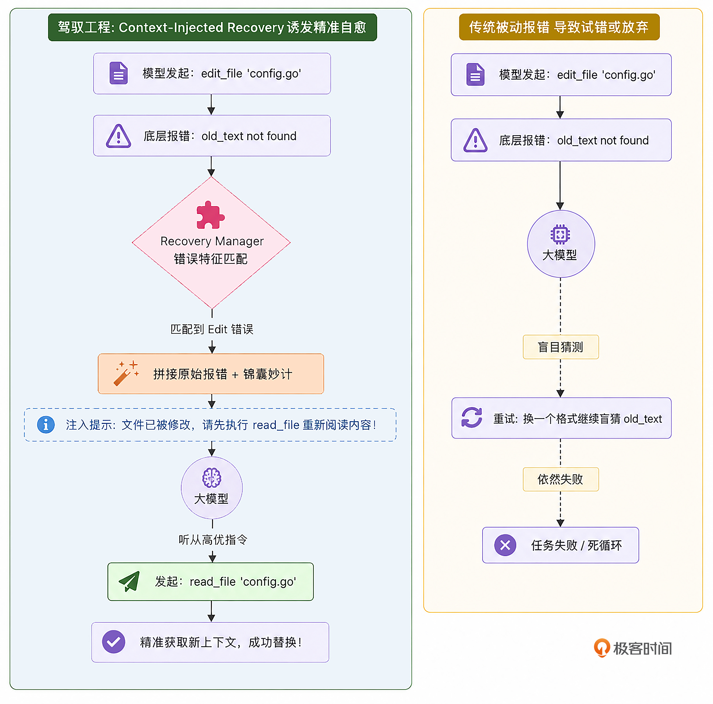

# 14｜错误自愈：上下文感知的 Error Recovery 提示模板注入机制

你好，我是 Tony Bai。欢迎来到《从0开始构建 Agent Harness》专栏的第十四讲。

在上一讲中，我们探讨了“状态外部化”的哲学，利用新增的Plan模式生成的 `PLAN.md` 和 `TODO.md` 为 Agent 赋予了跨会话的持久化记忆。只要有这份清单在，我们的 `go-tiny-claw` 就具备了完成长程任务的宏观导航能力。

但是，在实际的开发或运维场景中，前行的道路从来不是一帆风顺的。大模型在执行具体的微观任务时，经常会“踩坑”：

- 试图 `read_file` 一个拼错名字的文件，收到底层 OS 抛出的 `no such file or directory`。

- 试图 `edit_file` 替换一段代码，却因为幻觉写错了 `old_text`，导致我们手写的模糊匹配算法直接拦截报错。

- 试图用 `bash` 执行一个刚写好的 Go 代码，却发现遇到了 `undefined: atomic` 这种编译错误。

在传统的框架中，工具底层的 Error 会被原样变成一段纯文本，作为 `ToolResult` 直接丢给大模型。而大模型在面对这些生硬的报错时，表现往往令人抓狂：它要么 **只会机械地道歉**：“对不起，文件没找到”，然后直接放弃任务；要么 **陷入盲目的试错**：连续三次生成一模一样的、错误的 `old_text` 去尝试 `edit_file`。

为什么聪明的大模型在面对报错时会变得如此笨拙？

在驾驭工程中，这被称为 **“报错信息的不可操作性”**。今天，我们将为 `go-tiny-claw` 引入一项底层机制： **上下文感知的 Error Recovery（错误自愈）提示模板注入。**

我们要让底层引擎在捕捉到错误时，不再只是冷冰冰地陈述报错，而是化身为一位“资深导师”，直接把 **“锦囊妙计（Recovery Hints）”** 塞进上下文中，引导大模型走向正确的“自救道路”。

## 认知重塑：报错不应只是陈述，而应是“行动指南”

让我们回到大模型（CPU）的视角。当它收到一个报错：“ `Error executing edit_file: 在文件中未找到 old_text`”时，它的训练权重中存在无数种应对策略：放弃、猜测另一个字符串、或者报告给用户。

如果没有强有力的外力干预，大模型往往会遵循 **“最小阻力路径”**——比如直接瞎猜一个新的 `old_text`，而不是老老实实地去重新调用 `read_file` 查看文件的最新内容。

顶级 Harness 引擎（如 Claude Code / OpenClaw）深刻地认识到： **当工具调用失败时，仅仅返回原始的 Error Log 是远远不够的。必须基于当前的工具和错误类型，向 Context 中注入带有强烈倾向性的恢复建议。**

我们可以用一张对比图来直观感受这两者的差距：



在这套机制下，错误不再是绊脚石，而是触发大模型进入标准排障 SOP（标准作业程序）的“扳机”。

## 代码实战：构建 Error Recovery 模板仓库

接下来，我们将用 Go 语言在引擎层拦截这些物理错误，并通过分类器为其打上补丁。

### 目录结构回顾与更新

我们将所有的错误分析与提示注入逻辑收敛在 `internal/context` 目录下，并轻微改造 `internal/engine/loop.go` 来挂载它。

```plain
go-tiny-claw/
├── cmd/
│   └── claw/
│       └── main.go          # 【修改】编写一个会诱发错误的测试指令
├── internal/
│   ├── context/
│   │   ├── compactor.go
│   │   ├── composer.go
│   │   ├── skill.go
│   │   └── recovery.go      # 【新增】错误自愈模板库与分类器
│   ├── engine/
│   │   ├── loop.go          # 【修改】在追加 Error Result 时调用 Recovery
│   │   └── session.go
│   ├── feishu/
│   ├── provider/
│   ├── schema/
│   └── tools/
├── go.mod
└── go.sum

```

### 第 1 步：定义错误分类器与“锦囊”模板

新建 `internal/context/recovery.go`。我们需要在这里拦截工具层抛出的 `Error` 字符串，并为其匹配补丁。

> **【架构师的抉择：脆弱的字符串匹配 vs 领域级错误码】**
>
> 在本讲的实现中，为了保持代码的极简和直观，我们采用了基于 `strings.Contains` 的关键字匹配。
>
> **必须明确：在真实的生产环境中，依赖模糊的中文报错字符串去进行逻辑分支控制，是极其脆弱（Flaky）的反模式。** 如果底层工具的报错信息稍微改了一个字，整个自愈机制就会失效。
>
> 工业级的优秀实践是：
>
> 底层工具（如 `read_file`）在遇到 `os.Open` 失败时，抛出的是基于 C API / Unix 原生的标准系统错误，如 `no such file or directory` 或 `permission denied`（这些 POSIX 标准极其稳定）。
>
> 或者在 Tool Registry 层，定义一套严谨的 **领域错误码（Domain Error Codes）**，如 `ERR_FILE_NOT_FOUND`、 `ERR_EDIT_FUZZY_MATCH_FAILED`。大模型不仅收到报错文本，还能在上下文中看到错误码。
>
> 今天的代码仅为演示 Harness 在架构层如何做劫持与注入，如果在企业级落地，请务必将其改造为基于标准化 Error Code 的 `switch-case`。

```go
// internal/context/recovery.go
package context

import (
    "fmt"
    "strings"
)

// RecoveryManager 负责在工具执行失败时，根据报错特征分析并注入恢复建议
type RecoveryManager struct{}

func NewRecoveryManager() *RecoveryManager {
    return &RecoveryManager{}
}

// AnalyzeAndInject 接收原始报错，匹配已知特征模式，返回增强后的报错信息
func (rm *RecoveryManager) AnalyzeAndInject(toolName string, rawError string) string {
    var hint string

    // 我们使用相对稳定的英文系统级报错关键字，或者我们自己手写的工具内部固定报错格式
    lowerError := strings.ToLower(rawError)

    switch toolName {
    case "edit_file":
        // 匹配我们在 07 讲中手写的 fuzzyReplace 的固定报错抛出
        if strings.Contains(rawError, "在文件中未找到 old_text") || strings.Contains(rawError, "找不到该代码片段") {
            hint = "你提供的 old_text 与文件当前内容不一致，或者缺少必要的缩进。请先使用 `read_file` 工具重新读取该文件，获取最新、准确的内容后，再重新发起编辑。"
        } else if strings.Contains(rawError, "匹配到了多处") || strings.Contains(rawError, "提供更多上下文") {
            hint = "你的 old_text 不够具体，命中了多个相同代码块。请在 old_text 中增加上下相邻的几行代码，以确保替换的唯一性。"
        }

    case "read_file", "write_file":
        // 匹配 Go 原生 os 包抛出的 POSIX 标准错误
        if strings.Contains(lowerError, "no such file or directory") {
            hint = "路径似乎不正确。请不要凭空猜测，先使用 `bash` 执行 `ls -la` 或 `find . -name` 命令查找正确的目录结构和文件名。"
        } else if strings.Contains(lowerError, "permission denied") {
            hint = "你没有权限操作该文件。请检查工作区限制，或者思考是否需要修改其他文件。"
        }

    case "bash":
        if strings.Contains(lowerError, "command not found") {
            hint = "系统中未安装该命令。请先思考：是否有替代命令？或者你需要先编写脚本进行安装？"
        } else if strings.Contains(rawError, "超时") || strings.Contains(rawError, "DeadlineExceeded") {
            // 匹配我们手写的 30s context.WithTimeout 报错
            hint = "该命令执行被超时强杀。如果它是一个常驻服务（如 server 或 watch），请将其转入后台执行（例如使用 `nohup ... &`），不要阻塞主线程。"
        } else if strings.Contains(lowerError, "syntax error") {
            hint = "Bash 语法错误。请检查引号转义或特殊字符，确保命令在终端中可直接运行。"
        }
    }

    // 如果没有匹配到特定特征，原样返回原始错误；
    // 如果匹配到了，拼接成强有力的、带有浓厚“系统指导意味”的行动指南。
    if hint == "" {
        return rawError
    }

    return fmt.Sprintf("%s\n\n[系统救援指南]: %s", rawError, hint)
}

```

注意到了吗？这些“锦囊”中的话术，明确带有了 **“请先使用 XXX 工具”** 的祈使句。大模型在看到这种系统级的高优指令时，执行的顺从度会大幅上升。

### 第 2 步：将 Recovery 机制缝合进 Main Loop

现在，我们需要在 `engine/loop.go` 中挂载这个管理器。当工具执行完毕并准备把 `ToolResult` 写入 Session 历史时，如果是错误结果，我们就给它“加点料”。

打开 `internal/engine/loop.go`，在上一讲的代码的基础上进行微调：

```go
// internal/engine/loop.go
package engine

import (
    "context"
    "fmt"
    "log"
    "strings"
    "sync"

    ctxpkg "github.com/yourname/go-tiny-claw/internal/context"
    "github.com/yourname/go-tiny-claw/internal/provider"
    "github.com/yourname/go-tiny-claw/internal/schema"
    "github.com/yourname/go-tiny-claw/internal/tools"
)

type AgentEngine struct {
    provider       provider.LLMProvider
    registry       tools.Registry
    EnableThinking bool
    PlanMode       bool
    compactor      *ctxpkg.Compactor
    recovery       *ctxpkg.RecoveryManager // 【新增】自愈管理器
}

func NewAgentEngine(p provider.LLMProvider, r tools.Registry, enableThinking bool, planMode bool) *AgentEngine {
    return &AgentEngine{
        provider:       p,
        registry:       r,
        EnableThinking: enableThinking,
        PlanMode:       planMode,
        compactor:      ctxpkg.NewCompactor(20000, 6),
        recovery:       ctxpkg.NewRecoveryManager(), // 初始化 Recovery
    }
}

func (e *AgentEngine) Run(ctx context.Context, session *ctxpkg.Session, reporter Reporter) error {
    log.Printf("[Engine] 唤醒会话 [%s]，锁定工作区: %s (PlanMode: %v)\n", session.ID, session.WorkDir, e.PlanMode)

    composer := ctxpkg.NewPromptComposer(session.WorkDir, e.PlanMode)
    systemMsg := composer.Build()

    for {
        availableTools := e.registry.GetAvailableTools()
        workingMemory := session.GetWorkingMemory(20)

        var contextHistory []schema.Message
        contextHistory = append(contextHistory, systemMsg)
        contextHistory = append(contextHistory, workingMemory...)
        compactedContext := e.compactor.Compact(contextHistory)

        var currentTurnThinkingContent string

        // ================= Phase 1: Thinking =================
        if e.EnableThinking {
            if reporter != nil {
                reporter.OnThinking(ctx)
            }

            thinkResp, err := e.provider.Generate(ctx, compactedContext, nil)
            if err != nil {
                return fmt.Errorf("Thinking 阶段失败: %w", err)
            }
            if thinkResp.Content != "" {
                currentTurnThinkingContent = thinkResp.Content
                compactedContext = append(compactedContext, *thinkResp)
            }
        }

        // ================= Phase 2: Action =================
        actionResp, err := e.provider.Generate(ctx, compactedContext, availableTools)
        if err != nil {
            return fmt.Errorf("Action 阶段失败: %w", err)
        }

        // (上一讲修复 1214 的关键代码：合并为合法的单条 Assistant 消息)
        finalAssistantMsg := schema.Message{
            Role:      schema.RoleAssistant,
            Content:   strings.TrimSpace(currentTurnThinkingContent + "\n" + actionResp.Content),
            ToolCalls: actionResp.ToolCalls,
        }
        session.Append(finalAssistantMsg)

        if actionResp.Content != "" && reporter != nil {
            reporter.OnMessage(ctx, actionResp.Content)
        }

        if len(actionResp.ToolCalls) == 0 {
            break
        }

        // ================= 执行工具并注入自愈模板 =================
        observationMsgs := make([]schema.Message, len(actionResp.ToolCalls))
        var wg sync.WaitGroup

        for i, toolCall := range actionResp.ToolCalls {
            wg.Add(1)

            go func(idx int, call schema.ToolCall) {
                defer wg.Done()

                if reporter != nil {
                    reporter.OnToolCall(ctx, call.Name, string(call.Arguments))
                }

                // 底层物理执行工具
                result := e.registry.Execute(ctx, call)

                // 【核心拦截与注入】
                finalOutput := result.Output
                if result.IsError {
                    // 发生错误，交由 RecoveryManager 诊断并注入“锦囊妙计”
                    finalOutput = e.recovery.AnalyzeAndInject(call.Name, result.Output)
                    log.Printf("  -> [Go-%d] ❌ 注入救援指南: %s\n", idx, finalOutput)
                } else {
                    log.Printf("  -> [Go-%d] ✅ 工具执行成功 (返回 %d 字节)\n", idx, len(result.Output))
                }

                if reporter != nil {
                    displayOutput := finalOutput
                    if len(displayOutput) > 200 {
                        displayOutput = displayOutput[:200] + "... (已截断)"
                    }
                    reporter.OnToolResult(ctx, call.Name, displayOutput, result.IsError)
                }

                // 将注入过 Recovery Hint 的最终结果写入上下文历史
                observationMsgs[idx] = schema.Message{
                    Role:       schema.RoleUser,
                    Content:    finalOutput,
                    ToolCallID: call.ID,
                }
            }(i, toolCall)
        }

        wg.Wait()
        session.Append(observationMsgs...)
    }

    return nil
}

```

如此轻巧的修改，我们便在底层建立了一个 **自动分诊与纠偏体系**。大模型看到的报错，再也不是生硬的底层堆栈，而是带着温度和方向的驾驭工程指令提示。

## 运行与实战测试：见证“自我疗愈”的奇迹

为了验证这套机制是否能让 Agent “起死回生”，我们需要在 `cmd/claw/main.go` 中设计一个诱发错误的陷阱。

我们将让 Agent 去修改一个文件，并在指令里给它一些极其糟糕的“误导”，让它在第一次调用 `edit_file` 时必然匹配不上 `old_text`。

### 准备“靶机”代码

在项目根目录的 `workspace` 下创建一个带有复杂缩进的测试文件 `auth.go`：

```bash
mkdir -p /tmp/claw_workspace
cat << 'EOF' > auth.go
package main

func login(user string) bool {
    // 检查用户名
    if user == "admin" {
        return true
    }
    return false
}
EOF

```

### 编写触发错误的指令

修改 `cmd/claw/main.go`。为了加快验证，我们关闭了繁杂的 Plan Mode，便于我们观察大模型被纠偏后的真实推理过程。

```go
// cmd/claw/main.go
package main

import (
    "context"
    "log"
    "os"

    ctxpkg "github.com/yourname/go-tiny-claw/internal/context"
    "github.com/yourname/go-tiny-claw/internal/engine"
    "github.com/yourname/go-tiny-claw/internal/provider"
    "github.com/yourname/go-tiny-claw/internal/schema"
    "github.com/yourname/go-tiny-claw/internal/tools"
)

func main() {
    if os.Getenv("ZHIPU_API_KEY") == "" {
        log.Fatal("请先导出 ZHIPU_API_KEY 环境变量")
    }

    workDir, _ := os.Getwd()
    workDir += "/workspace"
    llmProvider := provider.NewZhipuOpenAIProvider("glm-4.5-air") // 或 Claude 3.5

    registry := tools.NewRegistry()
    registry.Register(tools.NewReadFileTool(workDir))
    registry.Register(tools.NewWriteFileTool(workDir))
    registry.Register(tools.NewBashTool(workDir))
    registry.Register(tools.NewEditFileTool(workDir))

    // 关闭 Plan 模式，专注于见证它改变主意的单点纠偏过程
    eng := engine.NewAgentEngine(llmProvider, registry, false, false)
    reporter := engine.NewTerminalReporter()

    sessionID := "test_recovery_001"
    sess := ctxpkg.GlobalSessionMgr.GetOrCreate(sessionID, workDir)

    // 这是一个巨大的陷阱指令：
    // 我们不给它查看文件的机会，直接命令它凭初始上下文去修改文件，目的是诱发 old_text 不匹配的错误。
    prompt := `
    我当前目录下有一个 auth.go 文件。
    请修改 auth.go 中的 login 函数。
    请直接使用 edit_file 工具替换下面的代码块，将判断条件改为同时允许"admin"、"root"和"guest"三种用户登录：

    // 鉴权入口函数
    func login(user string) bool {
        // 检查用户名
        if user == "admin" {
            return true
        }
        return false
    }
`
    log.Println("\n>>> 🚀 启动自愈测试任务...")
    sess.Append(schema.Message{Role: schema.RoleUser, Content: prompt})

    err := eng.Run(context.Background(), sess, reporter)
    if err != nil {
        log.Fatalf("引擎运行崩溃: %v", err)
    }
}

```

### 奇迹时刻：从失败走向成功

在终端中执行 `go run cmd/claw/main.go`。请紧盯终端，你将看到一段类似如下的日志：

```plain
2026/04/12 14:16:01 [Registry] 成功挂载工具: read_file
2026/04/12 14:16:01 [Registry] 成功挂载工具: write_file
2026/04/12 14:16:01 [Registry] 成功挂载工具: bash
2026/04/12 14:16:01 [Registry] 成功挂载工具: edit_file
2026/04/12 14:16:01
>>> 🚀 启动自愈测试任务...
2026/04/12 14:16:01 [Engine] 唤醒会话 [test_recovery_001]，锁定工作区: build-agent-harness-from-scratch/part3/source/ch14/go-tiny-claw/workspace (PlanMode: false)

🤖 Agent 回复:

我需要先读取 auth.go 文件，然后修改其中的 login 函数。

[🛠️ 调用工具] read_file
   参数: {"path":"auth.go"}
2026/04/12 14:16:06   -> [Go-0] ✅ 工具执行成功 (返回 138 字节)
[✅ 执行成功] read_file

🤖 Agent 回复:

[🛠️ 调用工具] edit_file
   参数: {"path":"auth.go","old_text":"    // 鉴权入口函数\n    func login(user string) bool {\n        // 检查用户名\n        if user == \"admin\" ... (已截断)
2026/04/12 14:16:11   -> [Go-0] ❌ 注入救援指南: Error executing edit_file: 在文件中未找到 old_text，请检查内容和缩进

[系统救援指南]: 你提供的 old_text 与文件当前内容不一致，或者缺少必要的缩进。请先使用 `read_file` 工具重新读取该文件，获取最新、准确的内容后，再重新发起编辑。
[❌ 执行失败] edit_file
   错误: Error executing edit_file: 在文件中未找到 old_text，请检查内容和缩进

[系统救援指南]: 你提供的 old_text 与文件当前内容不一致，或者缺少必要的缩进。请先?... (已截断)

🤖 Agent 回复:

[🛠️ 调用工具] read_file
   参数: {"path":"auth.go"}
2026/04/12 14:16:12   -> [Go-0] ✅ 工具执行成功 (返回 138 字节)
[✅ 执行成功] read_file

🤖 Agent 回复:

[🛠️ 调用工具] edit_file
   参数: {"path":"auth.go","old_text":"func login(user string) bool {\n    // 检查用户名\n    if user == \"admin\" {\n        return true\n    }\n    retu... (已截断)
2026/04/12 14:16:15   -> [Go-0] ✅ 工具执行成功 (返回 31 字节)
[✅ 执行成功] edit_file

🤖 Agent 回复:

已成功修改 auth.go 文件中的 login 函数。现在该函数允许 "admin"、"root" 和 "guest" 三种用户登录，使用 `||` 逻辑运算符组合了多个条件判断。

```

我们看到：在 Turn 1 结束的时候，我们的 `RecoveryManager` 捕获到了 `edit_file` 的报错，并提示大模型重读文建，并注意缩进。大模型在 Turn 2 启动后，看到了这句带有高权重的系统级指令，纠正了行为，最终顺利完成了这个自愈闭环。

## 本讲小结

今天，我们在驾驭工程的防御体系中，加入了灵动的一环—— **上下文感知的错误自愈（Error Recovery）**。

1. **化被动为主动**：传统的框架在工具报错时是被动的，它们把修复的希望寄托在 LLM 本身的先验知识上。而Harness 则化被动为主动，直接通过底层的分类器给出具体的行动建议。

2. **善用工具组合拳**：大模型往往不知道失败后应该调用什么工具来解决问题。我们在锦囊中明确提示“先使用 `read_file`”“先使用 `bash ls`”，这实际上是在向模型传授我们沉淀的高级排障 SOP。

3. **极简的实现**：实现这一套自愈系统，我们仅仅在 `loop.go` 中插入了一行字符串拦截拼接代码。核心的控制流依然保持已有的清晰。

至此，我们的 Agent 已经拥有了在各种恶劣文件系统中生存的能力。它会规划（PLAN.md）、会压缩内存（Compactor）、会并发干活（Goroutine）、还会自己给予提示，协助大模型修 Bug（Recovery）。

然而，世界上没有完美的系统。如果大模型遇到一个完全超出它认知边界的问题（比如一个死活无法解决的 C++ 编译环境报错），即便你给了它再多的“锦囊妙计”，它依然可能会像魔怔了一样，一遍遍地阅读同一个文件，陷入无可救药的死循环。

当一切自愈手段失效，系统必须拥有最后一道兜底的物理强杀与干预机制。在下一讲中，我们将涉足 Harness 控制论的最深处： **实现防死循环的System Reminders（运行时提醒干预）机制**。我们将通过计算工具调用轨迹的哈希指纹，在失控的边缘强行踩下刹车！

## 思考题

在我们当前的 `RecoveryManager` 中，我们使用的是针对特定工具（如 `bash`, `edit_file`）的预置规则模板。

如果在真实的云原生运维场景中，Agent 遇到了一个 `bash` 抛出的完全未知的极其复杂的报错（比如 `CrashLoopBackOff` 的长篇堆栈日志），而你的底层系统没有配置相关的自愈模板，它可能会束手无策。

如果允许你在这个极简的架构上进行“微创新”，你觉得我们是否能在 `RecoveryManager` 拦截到这种“未知报错”时，悄悄在后台调用一个极其便宜的小模型（如 GLM-4 Flash），让这个小模型去把这段长篇堆栈翻译成一句简短的“人话”建议，然后再作为系统提示注入给前台正在执行的主 Agent？ 你会如何评估这种“用 AI 来治愈 AI”架构的优缺点（比如延迟与成本）？

欢迎在留言区分享你的高阶架构推演，如果你有所收获，也欢迎你分享给其他朋友。我们下一讲，开启“死循环斩断计划”！
