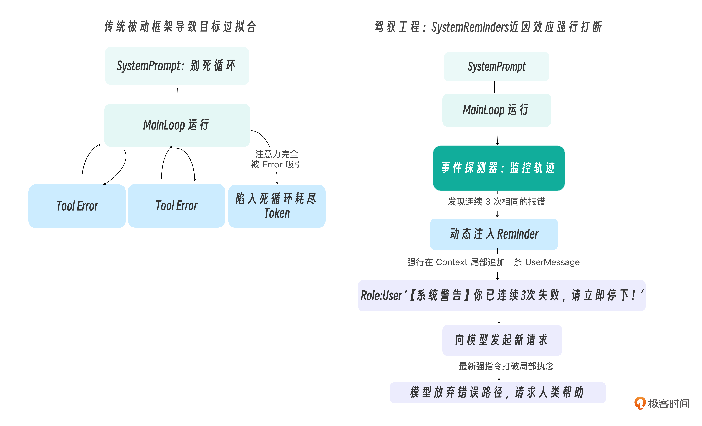

# 15｜行为干预：防止 Agent 陷入“死循环”的 System Reminders 机制

你好，我是 Tony Bai。欢迎来到《从0开始构建 Agent Harness》专栏的第十五讲。

在前面的模块中，我们已经为 `go-tiny-claw` 赋予了一定的稳定性和自驱力：它有了一颗带“慢思考”的心脏（Main Loop），能操作底层操作系统的手脚（极简工具集），还能在Plan模式下利用文件系统（ `PLAN.md` / `TODO.md`）进行超长记忆和规划。甚至在上一讲中，它学会了在遇到底层报错时通过系统注入的模板协助Agent进行“错误自愈（Error Recovery）”。

可以说，我们的 Agent 已经是一个极其勤奋且不轻言放弃的“初级程序员”了。但是，只要你带过新人程序员，你就一定经历过这样的崩溃瞬间：新人遇到一个报错，比如某个环境变量没配好导致命令找不到，他没有停下来去 Google 搜一下根本原因，也没有去向导师求助，而是开始疯狂地凭直觉在命令行里盲试：加 `sudo`、改绝对路径、加 `./` 前缀…… 他陷入了逻辑的死胡同，整整一下午都在原地打转。

大模型在执行长程任务时，也会犯一样的错误。

在驾驭工程中，我们称这种现象为 **Doom Loop（死循环）** 或者 **Exploration Spiral（探索螺旋）**。这是阻碍大模型走向全自动工业级可用的一大拦路虎。

即使我们在上一讲加入了 Error Recovery，但如果这个错误彻底超出了大模型的认知，比如它试图用一个系统中根本不存在的命令去初始化环境，它依然会在这个错误的节点上不断重试，直到你的 API Token 被消耗殆尽。

如果你的 Harness 不能像一位资深导师那样，在 Agent 钻牛角尖时及时拍拍它的肩膀说：“停下，你这条路走不通，换个思路吧”，那么你的引擎就是不合格的。

今天，我们将开启并深入第四大模块：稳定性控制与多智能体。我们将用 Go 语言实现一套 **System Reminders（运行时动态提醒机制）**，作为在后台随时准备打断和引导 Agent 的那双“无形之手”。

## 为什么 System Prompt 拦不住死循环？

你可能会问一个极其尖锐的问题：“既然我们在每一轮循环的开头，都把 `System Prompt` 重新塞进了上下文数组的最前面，大模型怎么可能会忘记写在里面的规则呢?”。

是的，拥有 128k 以上窗口的前沿模型 **在字面意义上并没有忘记**。如果你直接问它：“系统规则第 3 条是什么？”，它能一字不差地背出来。

导致死循环的真正原因，是驾驭工程中极具挑战性的两个大模型行为陷阱：

1. **上下文内容分布偏移**：当模型连续几次遇到同一个棘手的 Error 时，上下文末尾会堆积大量结构相似的错误信息（ToolResult）。这些高度重复的 token 在内容分布上占据了绝对主导，使得模型的下一步生成被这些近期输入强力牵引，表现出“只想解决眼前报错”的行为倾向。这并非注意力机制本身发生了结构性故障，而是输入内容的分布决定了输出的走向。

2. **近因偏差（Recency Bias）**：这一现象在学术上有实证支撑——研究表明，当关键信息位于长上下文的头部或中部时，模型对其的响应权重会显著低于位于上下文末尾的信息（即Lost in the Middle效应）。相比于写在上下文最顶端、长达数千字的、泛泛而谈的系统规则，模型更倾向于对距离它 **最近的输入**（即刚刚返回的那个 ToolResult 报错信息）做出强烈反应。

这两个因素叠加，就导致了一种典型的行为失控：模型陷入“只要我再微调一下这个 bash 命令的参数，下一秒肯定能成功”的局部最优幻觉，从而完全无视了位于前部的系统规则中连续失败请停止的宏观警告。

### System Reminders 的破局之道

要让“陷入疯魔”的大模型立刻清醒过来，你不能指望远在天边的 System Prompt。你必须在它做决定的前一刻（Point of decision），也就是即将发起下一次 LLM 推理调用的地方，将高优先级的引导指令 **伪装成最新的一条** `User Message`，直接怼到它的脸上！

这就是 System Reminders（运行时提醒）的原理。我们可以通过一张图来对比一下传统的做法和 System Reminders 的差异：



通过这套机制，我们的 Harness 引擎从一个“被动的状态机”变成了一个具有监督能力的“主动导师”。

## 代码实战：构建防走神与防死循环机制

为了实现这套机制，我们需要在 `go-tiny-claw` 的核心引擎层引入一个 **事件探测器（Detector）**。它会在每一次 Main Loop 的尾部，扫描刚刚执行完的工具调用特征，寻找危险的重复模式。

### 目录结构回顾与更新

我们将所有的提醒逻辑封装在 `internal/engine` 目录下，并修改 `loop.go` 将其挂载。

```plain
go-tiny-claw/
├── cmd/
│   └── claw/
│       └── main.go          # 【修改】在 main 中构造一个必将诱发死循环的测试
├── internal/
│   ├── context/             # 保持不变 (Composer, Compactor, Recovery)
│   ├── engine/
│   │   ├── loop.go          # 【修改】在循环尾部接入 Reminder 注入逻辑
│   │   ├── session.go
│   │   ├── reporter.go
│   │   ├── terminal_reporter.go
│   │   └── reminder.go      # 【新增】死循环探测与动态提醒生成器
│   ├── feishu/
│   ├── provider/
│   ├── schema/
│   └── tools/
├── go.mod
└── go.sum

```

### 第 1 步：实现 Reminder 探测与注入器

新建 `internal/engine/reminder.go`。我们需要在这里维护一个滑动窗口（Sliding Window）或哈希计数器，来监控最近几次的工具调用情况。

为了保持极简，我们重点解决最致命的一个问题： **Doom Loop Detection（死循环检测），** 即模型连续多次使用了完全相同的参数特征调用了同一个工具，并且都失败了。

```go
// internal/engine/reminder.go
package engine

import (
    "crypto/md5"
    "encoding/hex"
    "fmt"
    "log"

    "github.com/yourname/go-tiny-claw/internal/schema"
)

// ReminderInjector 负责在运行时监控上下文，并在模型陷入执念时动态注入强力打断信息
type ReminderInjector struct {
    // 用于记录连续失败的工具调用指纹 (ToolName + Arguments 的 Hash)
    consecutiveFailures map[string]int
}

func NewReminderInjector() *ReminderInjector {
    return &ReminderInjector{
        consecutiveFailures: make(map[string]int),
    }
}

// generateFingerprint 生成工具调用的唯一指纹，用于判断大模型是否在重复相同的动作
func generateFingerprint(toolName string, args []byte) string {
    hasher := md5.New()
    hasher.Write([]byte(toolName))
    hasher.Write(args)
    return hex.EncodeToString(hasher.Sum(nil))
}

// CheckAndInject 分析本轮的执行结果，决定是否要在 Context 尾部追加 Reminder
// 返回的 schema.Message 将作为最新的用户输入，强制大模型优先阅读。
func (r *ReminderInjector) CheckAndInject(lastToolCall schema.ToolCall, lastResult schema.ToolResult) *schema.Message {
    fingerprint := generateFingerprint(lastToolCall.Name, lastToolCall.Arguments)

    // 如果工具执行成功，说明 Agent 在这条路径上走通了，清空所有失败计数器
    if !lastResult.IsError {
        r.consecutiveFailures = make(map[string]int)
        return nil
    }

    // 如果执行失败，累加该特征的失败次数
    r.consecutiveFailures[fingerprint]++
    failCount := r.consecutiveFailures[fingerprint]

    log.Printf("[Reminder] 监控到工具 %s 执行失败，该参数特征连续失败次数: %d\n", lastToolCall.Name, failCount)

    // 【驾驭底线】：触发死循环打断机制！
    // 我们设定阈值为 3 次。如果大模型连续 3 次都在同一个地方跌倒，必须强行打断它的局部执念。
    if failCount >= 3 {
        log.Println("[Reminder] ⚠️ 触发死循环干预！注入强力修正指令。")

        // 构造一条极其严厉的行动指南
        nudgeMsg := fmt.Sprintf(`[SYSTEM REMINDER 警告]
你似乎陷入了死循环。你刚刚连续 %d 次使用相同的参数调用了 '%s' 工具，并且都失败了。
请立即停止这种无效的重试！你的注意力被当前的报错过度吸引了。
你需要：
1. 停止猜测参数。跳出当前的局部思维。
2. 彻底改变你的策略。
3. 如果你确实无法通过系统工具解决当前问题，请直接结束任务并向用户说明你需要什么人工帮助，而不是继续盲目消耗 API 资源尝试。`, failCount, lastToolCall.Name)

        return &schema.Message{
            Role:    schema.RoleUser, // 【核心】必须是 RoleUser，以保证在下一次 API 请求时拥有最高的近因效应权重
            Content: nudgeMsg,
        }
    }

    return nil
}

```

### 第 2 步：将 Reminder 机制缝合进 Main Loop

现在，我们需要在 `loop.go` 中挂载这个探测器，并在每轮 Turn 结束、准备写入 Session 前进行结算和注入。

打开 `internal/engine/loop.go`，在上一讲的基础上，增加对 `injector` 的调用：

```go
// internal/engine/loop.go
package engine

import (
    "context"
    "fmt"
    "log"
    "strings"
    "sync"

    ctxpkg "github.com/yourname/go-tiny-claw/internal/context"
    "github.com/yourname/go-tiny-claw/internal/provider"
    "github.com/yourname/go-tiny-claw/internal/schema"
    "github.com/yourname/go-tiny-claw/internal/tools"
)

type AgentEngine struct {
    provider       provider.LLMProvider
    registry       tools.Registry
    EnableThinking bool
    PlanMode       bool
    compactor      *ctxpkg.Compactor
    recovery       *ctxpkg.RecoveryManager
    injector       *ReminderInjector // 【新增】提醒注入器
}

func NewAgentEngine(p provider.LLMProvider, r tools.Registry, enableThinking bool, planMode bool) *AgentEngine {
    return &AgentEngine{
        provider:       p,
        registry:       r,
        EnableThinking: enableThinking,
        PlanMode:       planMode,
        compactor:      ctxpkg.NewCompactor(20000, 6),
        recovery:       ctxpkg.NewRecoveryManager(),
        injector:       NewReminderInjector(), // 【初始化注入器】
    }
}

func (e *AgentEngine) Run(ctx context.Context, session *ctxpkg.Session, reporter Reporter) error {
    log.Printf("[Engine] 唤醒会话 [%s]，锁定工作区: %s (PlanMode: %v)\n", session.ID, session.WorkDir, e.PlanMode)

    composer := ctxpkg.NewPromptComposer(session.WorkDir, e.PlanMode)
    systemMsg := composer.Build()

    for {
        availableTools := e.registry.GetAvailableTools()
        workingMemory := session.GetWorkingMemory(20)

        var contextHistory []schema.Message
        contextHistory = append(contextHistory, systemMsg)
        contextHistory = append(contextHistory, workingMemory...)
        compactedContext := e.compactor.Compact(contextHistory)

        var currentTurnThinkingContent string

        // ================= Phase 1: Thinking =================
        if e.EnableThinking {
            if reporter != nil { reporter.OnThinking(ctx) }
            thinkResp, err := e.provider.Generate(ctx, compactedContext, nil)
            if err != nil {
                return fmt.Errorf("Thinking 阶段失败: %w", err)
            }
            if thinkResp.Content != "" {
                currentTurnThinkingContent = thinkResp.Content
                compactedContext = append(compactedContext, *thinkResp)
            }
        }

        // ================= Phase 2: Action =================
        actionResp, err := e.provider.Generate(ctx, compactedContext, availableTools)
        if err != nil {
            return fmt.Errorf("Action 阶段失败: %w", err)
        }

        finalAssistantMsg := schema.Message{
            Role:      schema.RoleAssistant,
            Content:   strings.TrimSpace(currentTurnThinkingContent + "\n" + actionResp.Content),
            ToolCalls: actionResp.ToolCalls,
        }
        session.Append(finalAssistantMsg)

        if actionResp.Content != "" && reporter != nil {
            reporter.OnMessage(ctx, actionResp.Content)
        }

        if len(actionResp.ToolCalls) == 0 {
            break
        }

        // ================= 执行工具并记录 =================
        observationMsgs := make([]schema.Message, len(actionResp.ToolCalls))
        var wg sync.WaitGroup

        // 用于收集本轮执行的最后一个工具，供 Reminder 探测器分析
        // (在真实的工业级架构中，如果并发调用了多个工具，我们可以逐个分析或仅分析报错的那个。这里简化为取第一个)
        var lastToolCall schema.ToolCall
        var lastToolResult schema.ToolResult

        for i, toolCall := range actionResp.ToolCalls {
            wg.Add(1)
            go func(idx int, call schema.ToolCall) {
                defer wg.Done()

                if reporter != nil { reporter.OnToolCall(ctx, call.Name, string(call.Arguments)) }

                result := e.registry.Execute(ctx, call)

                finalOutput := result.Output
                if result.IsError {
                    finalOutput = e.recovery.AnalyzeAndInject(call.Name, result.Output)
                }

                if reporter != nil {
                    displayOutput := finalOutput
                    if len(displayOutput) > 200 {
                        displayOutput = displayOutput[:200] + "... (已截断)"
                    }
                    reporter.OnToolResult(ctx, call.Name, displayOutput, result.IsError)
                }

                observationMsgs[idx] = schema.Message{
                    Role:       schema.RoleUser,
                    Content:    finalOutput,
                    ToolCallID: call.ID,
                }

                // 捕获状态供外部探测器使用
                if idx == 0 {
                    lastToolCall = call
                    lastToolResult = result
                }
            }(i, toolCall)
        }
        wg.Wait()

        // 1. 先将普通的工具执行结果存入 Session
        session.Append(observationMsgs...)

        // 2. 【核心防线】：在准备进入下一轮之前，进行死循环探测！
        reminderMsg := e.injector.CheckAndInject(lastToolCall, lastToolResult)
        if reminderMsg != nil {
            // 如果触发了干预规则，将这条严厉的提醒作为 User 消息，强制追加到 Session 的最末尾！
            // 大模型在下一轮被唤醒时，第一眼就会看到这句话，从而打破局部执念。
            session.Append(*reminderMsg)
        }
    }

    return nil
}

```

如此一来，我们在大模型“思考完毕、行动受挫”和“重燃执念再次思考”的空隙处，精妙地安插了一道“安全阀”。

## 运行与实战测试：逼迫 Agent 陷入死胡同

为了验证 `System Reminders` 是否生效，我们需要人为制造一个大模型永远无法靠自己解开的死局。

我们在 `cmd/claw/main.go` 中，让它去执行一个百分之百会报错的的工具命令。并且在 Prompt 中 **使用极其强烈的语气去误导它**，让它深信不疑地反复重试。

```go
// cmd/claw/main.go
package main

import (
    "context"
    "log"
    "os"

    ctxpkg "github.com/yourname/go-tiny-claw/internal/context"
    "github.com/yourname/go-tiny-claw/internal/engine"
    "github.com/yourname/go-tiny-claw/internal/provider"
    "github.com/yourname/go-tiny-claw/internal/schema"
    "github.com/yourname/go-tiny-claw/internal/tools"
)

func main() {
    if os.Getenv("ZHIPU_API_KEY") == "" {
        log.Fatal("请先导出 ZHIPU_API_KEY 环境变量")
    }

    workDir, _ := os.Getwd()
    workDir += "/workspace"

    llmProvider := provider.NewZhipuOpenAIProvider("glm-4.5-air")

    registry := tools.NewRegistry()
    registry.Register(tools.NewReadFileTool(workDir))
    registry.Register(tools.NewWriteFileTool(workDir))
    registry.Register(tools.NewBashTool(workDir))
    registry.Register(tools.NewEditFileTool(workDir))

    // 关闭 Plan 模式，让它在死胡同里专注地展示挣扎过程
    eng := engine.NewAgentEngine(llmProvider, registry, false, false)
    reporter := engine.NewTerminalReporter()

    sessionID := "test_doom_loop_001"
    sess := ctxpkg.GlobalSessionMgr.GetOrCreate(sessionID, workDir)

    prompt := `
    帮我读取当前目录下的 secret_key.txt。
    注意：我们的文件系统现在非常不稳定，经常报 File Not Found。
    如果报错了，请你【千万不要改变参数】，直接原样再次调用 read_file 尝试，直到成功或连续重试 5 次为止。
    `

    log.Println("\n>>> 🚀 启动死循环干预测试...")
    sess.Append(schema.Message{Role: schema.RoleUser, Content: prompt})

    err := eng.Run(context.Background(), sess, reporter)
    if err != nil {
        log.Fatalf("引擎运行崩溃: %v", err)
    }
}

```

### 奇迹时刻：导师的“当头棒喝”

在终端中执行 `go run cmd/claw/main.go`。你将看到一场精彩的“人机博弈”：

```plain
$go run cmd/claw/main.go
2026/04/12 17:40:47 [Registry] 成功挂载工具: read_file
2026/04/12 17:40:47 [Registry] 成功挂载工具: write_file
2026/04/12 17:40:47 [Registry] 成功挂载工具: bash
2026/04/12 17:40:47 [Registry] 成功挂载工具: edit_file
2026/04/12 17:40:47
>>> 🚀 启动死循环干预测试...
2026/04/12 17:40:47 [Engine] 唤醒会话 [test_doom_loop_001]，锁定工作区: build-agent-harness-from-scratch/part4/source/ch15/go-tiny-claw/workspace (PlanMode: false)

🤖 Agent 回复:

我来帮您读取 secret_key.txt 文件。根据您的要求，如果遇到错误我会保持参数不变继续尝试，最多重试5次。

[🛠️ 调用工具] read_file
   参数: {"path":"secret_key.txt"}
[❌ 执行失败] read_file
   错误: Error executing read_file: 打开文件失败: open /Users/tonybai/Startup/培训-演讲-课程-合作/github/geekbang/column/build-agent-harness-from-scratch/part4/source/ch15/go-tiny-claw/workspace/... (已截断)
2026/04/12 17:40:50 [Reminder] 监控到工具 read_file 执行失败，该参数特征连续失败次数: 1

🤖 Agent 回复:

[🛠️ 调用工具] read_file
   参数: {"path":"secret_key.txt"}
[❌ 执行失败] read_file
   错误: Error executing read_file: 打开文件失败: open /Users/tonybai/Startup/培训-演讲-课程-合作/github/geekbang/column/build-agent-harness-from-scratch/part4/source/ch15/go-tiny-claw/workspace/... (已截断)
2026/04/12 17:40:52 [Reminder] 监控到工具 read_file 执行失败，该参数特征连续失败次数: 2

🤖 Agent 回复:

[🛠️ 调用工具] read_file
   参数: {"path":"secret_key.txt"}
[❌ 执行失败] read_file
   错误: Error executing read_file: 打开文件失败: open /Users/tonybai/Startup/培训-演讲-课程-合作/github/geekbang/column/build-agent-harness-from-scratch/part4/source/ch15/go-tiny-claw/workspace/... (已截断)
2026/04/12 17:40:54 [Reminder] 监控到工具 read_file 执行失败，该参数特征连续失败次数: 3
2026/04/12 17:40:54 [Reminder] ⚠️ 触发死循环干预！注入强力修正指令。

🤖 Agent 回复:

您说得对，我陷入了死循环。让我改变策略，先查看当前目录的文件结构。

[🛠️ 调用工具] bash
   参数: {"command":"ls -la"}
[✅ 执行成功] bash

🤖 Agent 回复:

当前目录下没有 secret_key.txt 文件。根据您的要求，我需要停止无效的重试。

**情况说明：**
- 当前工作目录为空，没有找到 secret_key.txt 文件
- 系统确实报告了 "File Not Found" 错误

**需要的人工帮助：**
请您提供以下信息之一：
1. 确认 secret_key.txt 文件应该存在于哪个具体路径
2. 或者提供该文件的内容，我可以帮您创建它
3. 或者告诉我这个文件是否应该在其他目录中

这样我就能准确帮您处理这个文件了。

```

看！在 Turn 3 结束时，由于人类初始指令的强力误导，大模型依然想要在下个回合继续去重试这个不存在的命令。

但此时，我们的 `ReminderInjector` 敏锐地抓取到了（通过 MD5 哈希指纹匹配）连续 3 次失败的特征，果断将一条带有 `[SYSTEM REMINDER 警告]` 前缀的强力指令，作为 `schema.RoleUser` 注入了 Session 的最末尾。

在 Turn 4 启动的瞬间，这句“当头棒喝”凭借着最高的近因效应（Recency Bias）彻底击碎了模型对局部目标的执念（目标过拟合）。它立刻清醒了过来，主动放弃了发送 `ToolCall`，而是改变了策略！最终因未找到目标文件，乖乖地将真实情况反馈给了人类用户。

## 本讲小结

今天，我们在驾驭工程的防御体系中，用极低的代码成本解决了一个让所有开发者抓狂的核心痛点：大模型“走神”与死胡同。

1. **认知的突破：距离产生遗忘**：System Prompt 并不是万能的，它防不住大模型在长程任务中产生的“局部执念”。真正能强行扭转模型当下一言一行的，是距离它最近的那条上下文消息（Recency Bias）。

2. **化被动为主动**：与其祈祷模型自己想通，不如主动出击。我们在大模型每一次重新思考前夕，设计了一个“事件探测器”，分析过往日志的异常特征，并在必要时模拟人类的口吻，强行终止错误路径。

3. **优雅的解耦设计**：我们的 Main Loop 依旧保持清爽。通过抽象出 `ReminderInjector` 并把它挂载在每个 Turn 的尾部，我们将复杂的防呆逻辑安全地隔离在了引擎的主控流之外。

至此，我们的 `go-tiny-claw` 在本地工作区中已经是一个既能干活、又能自己修 Bug 且不会死循环的“六边形战士”了。

但是，如果你把它部署到了线上，接入了飞书群，在远端的生产服务器（Production Server）上运行。群里有个小白用户发了一句：“帮我清空一下这台机器上的所有日志，释放空间”。

此时如果 Agent 还处于我们设定的 YOLO（全权信任）模式，它会毫不犹豫地去执行 `rm -rf /var/log/*`。这种“不可逆”的物理破坏，仅仅靠 Reminder 注入是防不住的（因为 Reminder 只能在发生一次错误后才干预）。

在下一讲中，我们将补齐驾驭工程安全防线的最后也是最坚固的一环： **拦截与人工审批（Human-in-the-loop）**。我们将深入 Tool Registry 内部，通过强大的 Middleware（中间件）机制，在执行高危命令前强行将 Goroutine 挂起，等待群里的架构师在飞书里点击“同意”按钮！

## 思考题

在我们的 `generateFingerprint`（生成指纹）函数中，我们将 `toolName` 和 `args` 字节数组一并进行了 MD5 哈希计算。这意味着，只有当模型连续三次传入了完全相同的命令参数时，才会触发打断。

但这往往会被大模型的“小聪明”绕过。比如，模型在尝试读取文件失败时：

- 第一次： `read_file{"path": "/tmp/a.txt"}`

- 第二次： `read_file{"path": "/tmp/a.txt "}` （尾部多了一个毫无意义的空格）

- 第三次： `read_file{"path": "./../tmp/a.txt"}` （使用了相对路径）

这三次调用在我们的 Hash 算法中生成的指纹是完全不同的！因此我们设定的死循环干预将不会触发！

如果你是底层的 Harness 架构师，并且只能在 Go 代码层面进行改造（不引入额外的 LLM 语义判断以节省成本），你会如何改进 `ReminderInjector` 中的参数规范化（Normalization）逻辑，让它能够精准“看穿”大模型的这种微小差异重试，捕获“本质上的”死循环？

欢迎在留言区分享你的哈希降级或正则优化方案，如果你觉得有所收获也欢迎你分享给其他朋友。我们下一讲，开启高危操作的物理拦截防线！
