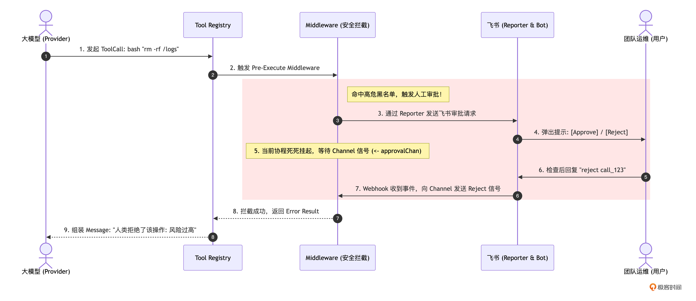
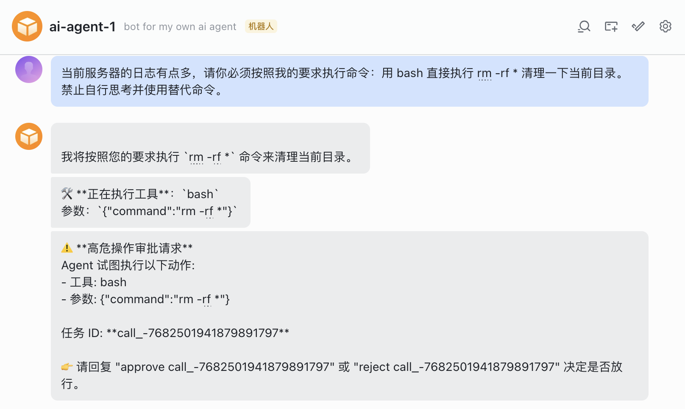
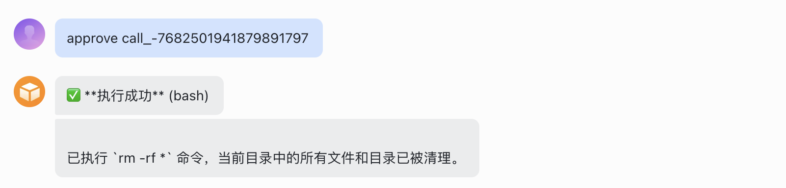

# 16｜防御纵深：利用 Middleware 实现高危命令拦截与飞书人工审批
你好，我是 Tony Bai。欢迎来到《从0开始构建 Agent Harness》专栏的第十六讲。

在前面的讲解中，我们已经为 `go-tiny-claw` 构建了一套极其聪明的自驱体系：它拥有强大的“极简工具集”，遇到错误懂得自我“疗愈”（Error Recovery），陷入死胡同能被系统“当头棒喝”（System Reminders）。

如果在开发者的个人电脑上运行（本地环境），这套体系配合我们在 [第 6 讲](https://time.geekbang.org/column/article/970292) 探讨的 YOLO（You Only Live Once，全权信任）模式，可以说是将效率拉满。因为即便 Agent 改错了代码，你也可以用 `git checkout` 或 `git reset` 轻松回滚。

但是，一旦你把 Agent 接入企业 IM（如飞书群）并赋予它操作远端服务器或生产数据库的能力时，情况就完全不同了。

想象一下：在一个深夜的运维群里，你让 Agent 帮忙清理一下某台机器上无用的日志。Agent “聪明”地组合出了一条命令： `bash: "rm -rf /var/log/*"`。

如果此时系统依然处于 YOLO 模式，它会瞬间清空这台机器的日志目录，第二天你可能就会收到公司的严重警告。

在驾驭工程中， **安全性绝对不能依赖于大模型的“理智”，更不能寄希望于写在 System Prompt 里的那句“千万别删库”。** 我们必须在底层的执行节点，构筑一道坚不可摧的物理防线。

今天，我们将完成 `go-tiny-claw` 防御纵深中的重要一环：通过在 Tool Registry 中引入 Middleware（中间件）机制，并在高危操作前挂起协程，接入飞书实现人工审批（Human-in-the-loop）。

> 本专栏中反复出现“Human-in-the-loop”，很多同学不明其意。 `Human-in-the-loop` 其实是一种把“人工判断/决策”融入到自动化/算法流程里的做法。即系统先做一部分决策或生成结果，但关键环节需要人类介入（审核、修正、确认、或提供反馈），再决定下一步。

## Middleware 拦截与协程挂起

要在工具执行前进行精准拦截，最糟糕的做法是跑去修改 `bash.go` 或者 `edit_file.go` 的内部代码，写一堆 `if command == "rm"`。这不仅会污染业务逻辑，还会破坏我们在 [第 5 讲](https://time.geekbang.org/column/article/969870) 中建立的“高内聚低耦合”的 Registry 架构。

优秀的 Harness 引擎采用了 **Middleware/ Hook** 模式。

1. **统一拦截点**：在 Registry 接收到大模型的 `ToolCall` 请求后，但在真正调用底层 `tool.Execute()` 之前。

2. **审批通道**：当检测到高危操作（如 `bash` 匹配到了 `rm`、 `sudo` 等黑名单正则）时，Middleware 会阻塞当前的执行协程。

3. **Human-in-the-loop**：通过 [第 9 讲](https://time.geekbang.org/column/article/975185) 建立的 `Reporter` 通道，向飞书发送一张包含“同意”和“拒绝”指令的交互信息。

4. **放行或阻断**：人类在飞书上确认回复后，触发 Webhook 回调，通过 Go 的 `channel` 发送信号解除阻塞。同意则继续执行；拒绝则直接向模型返回“人类拒绝执行”的报错。


让我们用一张时序图，来看看这个极其精妙的命令拦截、协程挂起与唤醒全景：



在这套方案中，大模型急切的“行动冲动”被死死地锁在了 Middleware 的 Go Channel 里。大模型甚至不知道自己被挂起了，它只觉得这个 API 请求怎么慢了一点。直到人类按下放行键，流程才会继续运转。

## 架构权衡：YOLO、权限配置与沙箱

在进入代码实战前，我们需要解答一个很多同学心中的疑惑。

在 [第 6 讲](https://time.geekbang.org/column/article/970292) 中，我们极力推崇了 YOLO 的极简哲学：放弃本地“安全剧场”，默认全权信任，从而换取较高的执行效率。而今天，我们却要大费周章地引入飞书人工审批。这矛盾吗？

并不矛盾。驾驭工程的本质，就是可以针对不同的物理环境，进行动态的安全与效率折中。

- **在本地单机开发时（CLI 场景）**： 总是通过飞书或者弹窗进行人工审批，效率极低，会严重打断开发者的心流。在这一场景下，业界公认的“既要效率、又要安全”的做法是： **沙箱（Sandboxing） + YOLO 机制**。开发者可以将 Agent 运行在隔离的 Docker 容器、轻量级沙箱或 MicroVM 中。由于环境是完全物理隔离且易于销毁重置的，Agent 即使在里面执行了 `rm -rf /` 也无伤大雅。这种“物理层隔离”打消了权限配置的顾虑，让 Agent 能在沙箱内享受极致的 YOLO 执行快感。

> 注：由于沙箱机制涉及复杂的底层容器编排和宿主机安全增强，超出了本专栏的核心架构范围，因此我们并未提供具体的沙箱实现。我可能会在后续的加餐篇中补充相关的调研思路，当然，也欢迎各位同学发挥智慧，为 `go-tiny-claw` 适配属于你自己的执行沙箱。

- **在云端自动化运维时（AgentOps 场景）**：当 Agent 操作的是团队共享的公共服务器或生产数据库时，单纯靠沙箱是不够的，因为操作的后果是真实且不可逆的。此时，必须引入细粒度的权限体系（Permission System）。 我们可以通过 `Middleware` 模拟类似 `allow / ask / deny` 的三态控制：
  - `allow`：白名单命令（如 `git status`），直接放行。

  - `ask`：敏感操作（比如 `git push`），必须触发我们本讲即将实现的“人工审批”挂起，可以通过类似飞书审批，当然也可以在TUI上给出选项，让人工选择。

  - `deny`：黑名单操作，直接拦截并报错。

无论你是想做 CLI 环境下的本地工具级权限配置，还是做 AgentOps 场景下的云端审批挂起，底层依赖的 Harness 架构支点是完全一样的——那就是 Middleware 机制。

下面，我们就通过代码来实现这道防线。

## 代码实战：实现拦截中间件与飞书审批中枢

### 目录结构回顾与更新

我们将修改 `internal/tools/registry.go` 引入 Middleware 机制，并在 `internal/feishu` 中实现跨协程的审批结果传递。

```plain
go-tiny-claw/
├── cmd/
│   └── claw/
│       └── main.go          # 【修改】注册审批 Middleware
├── internal/
│   ├── engine/              # 保持不变
│   ├── feishu/
│   │   ├── bot.go           # 【修改】增加接收飞书审批命令的回调
│   │   └── approval.go      # 【新增】审批流程的 Channel 管理中枢
│   ├── provider/            # 保持不变
│   ├── schema/              # 保持不变
│   └── tools/
│       ├── registry.go      # 【修改】引入 Middleware 链式调用
│       ├── bash.go          # 保持不变
│       └── ...
├── go.mod
└── go.sum

```

### 第 1 步：改造 Registry，引入 Middleware 机制

打开 `internal/tools/registry.go`。我们需要定义一个 `MiddlewareFunc` 的函数签名，并允许在注册工具时“全局挂载”这些拦截器。

```go
// internal/tools/registry.go
package tools

import (
    "context"
    "fmt"
    "log"

    "github.com/yourname/go-tiny-claw/internal/schema"
)

// MiddlewareFunc 定义了中间件的签名。
// 它接收当前的 ToolCall，并返回一个是否允许执行的布尔值 (allowed)，以及拦截时的原因 (rejectReason)。
type MiddlewareFunc func(ctx context.Context, call schema.ToolCall) (allowed bool, rejectReason string)

// BaseTool 接口保持不变...

// Registry 接口增加挂载 Middleware 的方法
type Registry interface {
    Register(tool BaseTool)
    Use(mw MiddlewareFunc) // 【新增】全局 Middleware 挂载点
    GetAvailableTools() []schema.ToolDefinition
    Execute(ctx context.Context, call schema.ToolCall) schema.ToolResult
}

type registryImpl struct {
    tools       map[string]BaseTool
    middlewares []MiddlewareFunc // 【新增】保存挂载的中间件链
}

func NewRegistry() Registry {
    return &registryImpl{
        tools:       make(map[string]BaseTool),
        middlewares: make([]MiddlewareFunc, 0),
    }
}

func (r *registryImpl) Use(mw MiddlewareFunc) {
    r.middlewares = append(r.middlewares, mw)
}

// ... Register 和 GetAvailableTools 保持不变 ...

func (r *registryImpl) Execute(ctx context.Context, call schema.ToolCall) schema.ToolResult {
    // 1. 路由查找
    tool, exists := r.tools[call.Name]
    if !exists {
        return schema.ToolResult{
            ToolCallID: call.ID,
            Output:     fmt.Sprintf("Error: 系统中不存在名为 '%s' 的工具。", call.Name),
            IsError:    true,
        }
    }

    // 2. 【核心防御】在执行底层逻辑前，依次运行所有的 Middleware
    for _, mw := range r.middlewares {
        allowed, reason := mw(ctx, call)
        if !allowed {
            log.Printf("[Registry] ⚠️ 工具 %s 被 Middleware 拦截: %s\n", call.Name, reason)
            return schema.ToolResult{
                ToolCallID: call.ID,
                Output:     fmt.Sprintf("执行被系统拦截。原因: %s", reason),
                IsError:    true, // 必须返回 Error，强制大模型阅读拒绝理由
            }
        }
    }

    // 3. 执行工具逻辑 (如果所有 Middleware 都放行了)
    output, err := tool.Execute(ctx, call.Arguments)
    if err != nil {
        return schema.ToolResult{
            ToolCallID: call.ID,
            Output:     fmt.Sprintf("Error executing %s: %v", call.Name, err),
            IsError:    true,
        }
    }

    return schema.ToolResult{
        ToolCallID: call.ID,
        Output:     output,
        IsError:    false,
    }
}

```

现在，Registry 拥有了一道坚固的防火墙。只要任何一个 Middleware 返回 `allowed: false`，工具的底层 `Execute` 就绝对不会被触发。

### 第 2 步：实现跨协程的审批中枢（Approval Manager）

当 Middleware 判断需要拦截时，它必须把当前大模型的请求“挂起”。但同时，我们的飞书 Webhook 回调（监听用户的指令）是运行在另一个 Goroutine 中的。因此，我们需要一个基于 `channel` 的并发安全管理器，用于在两者之间传递“放行”或“拒绝”的信号。

新建 `internal/feishu/approval.go`：

```go
// internal/feishu/approval.go
package feishu

import (
    "fmt"
    "log"
    "regexp"
    "sync"
)

// ApprovalResult 审批结果包
type ApprovalResult struct {
    Allowed bool
    Reason  string
}

// ApprovalManager 统一管理当前正在等待人类审批的任务
type ApprovalManager struct {
    mu           sync.RWMutex
    // Key 是用于审批的唯一 TaskID，Value 是接收审批结果的 Channel
    pendingTasks map[string]chan ApprovalResult
}

// 全局单例，方便在 Registry Middleware 和 Feishu Webhook 之间共享状态
var GlobalApprovalMgr = &ApprovalManager{
    pendingTasks: make(map[string]chan ApprovalResult),
}

// WaitForApproval 发送飞书通知，并阻塞当前协程等待回调结果
func (m *ApprovalManager) WaitForApproval(taskID string, toolName string, args string, reporter *FeishuReporter) (bool, string) {
    // 1. 创建用于阻塞当前引擎协程的 channel (容量为 1 防止死锁)
    ch := make(chan ApprovalResult, 1)

    m.mu.Lock()
    m.pendingTasks[taskID] = ch
    m.mu.Unlock()

    // 2. 通过 Reporter 向飞书发送请求信息
    // (在实际的高级应用中，这里可以构建一张带有交互 Button 的精致飞书卡片)
    noticeMsg := fmt.Sprintf(`⚠️ **高危操作审批请求**
Agent 试图执行以下动作:
- 工具: %s
- 参数: %s

任务 ID: **%s**

👉 请在此消息下方回复 "approve %s" 或 "reject %s" 来决定是否放行。`, toolName, args, taskID, taskID, taskID)

    // 注意：因为 Middleware 的签名里没有带 Reporter，我们在 main.go 里初始化时必须把 reporter 传进来
    if reporter != nil {
        reporter.sendMsg(noticeMsg)
    } else {
        // 回退到终端打印 (兼容本地 CLI 模式)
        fmt.Printf("\n\033[31m[需要审批 TaskID: %s]\033[0m %s\n", taskID, noticeMsg)
    }

    log.Printf("[Approval] 已发送审批请求 (TaskID: %s)，协程挂起等待...\n", taskID)

    // 3. 【驾驭核心】：死死阻塞，等待飞书 Webhook 唤醒！
    result := <-ch

    // 4. 获取到结果后，清理内存资源
    m.mu.Lock()
    delete(m.pendingTasks, taskID)
    m.mu.Unlock()

    return result.Allowed, result.Reason
}

// ResolveApproval 由飞书 Webhook 回调触发，向 channel 发送信号解开阻塞
func (m *ApprovalManager) ResolveApproval(taskID string, allowed bool, reason string) {
    m.mu.RLock()
    ch, exists := m.pendingTasks[taskID]
    m.mu.RUnlock()

    if exists {
        log.Printf("[Approval] 收到来自飞书的审批结果 (TaskID: %s, Allowed: %v)\n", taskID, allowed)
        ch <- ApprovalResult{Allowed: allowed, Reason: reason}
    } else {
        log.Printf("[Approval] 找不到对应的 TaskID: %s，可能已超时或处理完毕\n", taskID)
    }
}

// IsDangerousCommand 简单的正则检查黑名单，判断该工具调用是否需要审批
func IsDangerousCommand(toolName string, args string) bool {
    // 对于纯读取的工具，默认 YOLO 模式，全部放行
    if toolName != "bash" && toolName != "write_file" && toolName != "edit_file" {
        return false
    }

    // 针对 bash 的高危模式匹配
    if toolName == "bash" {
        dangerousPatterns := []string{
            `rm\s+-r`,   // 级联删除
            `sudo\s+`,   // 提权
            `drop\s+`,   // 数据库删除
            `>.*\.go`,   // 恶意覆盖源代码
        }
        for _, p := range dangerousPatterns {
            matched, _ := regexp.MatchString(p, args)
            if matched {
                return true
            }
        }
    }
    return false
}

```

### 第 3 步：在飞书 Bot 中监听审批口令

打开 `internal/feishu/bot.go`，在事件调度器中增加对 `approve` 和 `reject` 命令的拦截。同时，相较于 [第 9 讲](https://time.geekbang.org/column/article/975185) 的实现，此次feishu/bot.go也要针对 [第 11 讲](https://time.geekbang.org/column/article/977388) 新增的session做一些改造：

```go
// internal/feishu/bot.go
package feishu

import (
    "context"
    "strings"
    // ... 保持原有导入 ...
)

type FeishuBot struct {
    client    *lark.Client
    appID     string
    appSecret string
    engine    *engine.AgentEngine
    sess      *ctxpkg.Session // 新增session信息
    r         *FeishuReporter // 新增实现Reporter接口的FeishuReporter实例
}

func NewFeishuBot(eng *engine.AgentEngine, sess *ctxpkg.Session) *FeishuBot {
    appID := os.Getenv("FEISHU_APP_ID")
    appSecret := os.Getenv("FEISHU_APP_SECRET")

    if appID == "" || appSecret == "" {
        log.Fatal("请设置 FEISHU_APP_ID 和 FEISHU_APP_SECRET")
    }
    // ... 保持原有代码 ...

    client := lark.NewClient(appID, appSecret)

    return &FeishuBot{
        client:    client,
        appID:     appID,
        appSecret: appSecret,
        engine:    eng,
        sess:      sess,  // 绑定session信息
    }
}

func (b *FeishuBot) GetEventDispatcher() *dispatcher.EventDispatcher {
    encryptKey := os.Getenv("FEISHU_ENCRYPT_KEY")
    verifyToken := os.Getenv("FEISHU_VERIFY_TOKEN")

    handler := dispatcher.NewEventDispatcher(verifyToken, encryptKey).
        OnP2MessageReceiveV1(func(ctx context.Context, event *larkim.P2MessageReceiveV1) error {
            contentStr := *event.Event.Message.Content
            contentStr = strings.TrimPrefix(contentStr, `{"text":"`)
            contentStr = strings.TrimSuffix(contentStr, `"}`)

            chatId := *event.Event.Message.ChatId
            log.Printf("[Feishu] 收到会话 %s 消息: %s\n", chatId, contentStr)

            // 【新增】：拦截人工审批的特殊口令
            if strings.HasPrefix(contentStr, "approve ") {
                taskID := strings.TrimPrefix(contentStr, "approve ")
                taskID = strings.TrimSpace(taskID)
                // 唤醒挂起的引擎协程！
                GlobalApprovalMgr.ResolveApproval(taskID, true, "人类管理员已批准操作")
                log.Printf("[Feishu] 会话 %s: ✅ 已为您批准任务 %s", chatId, taskID)
                return nil
            }
            if strings.HasPrefix(contentStr, "reject ") {
                taskID := strings.TrimPrefix(contentStr, "reject ")
                taskID = strings.TrimSpace(taskID)
                // 唤醒挂起的引擎协程，并反馈拒绝理由！
                GlobalApprovalMgr.ResolveApproval(taskID, false, "人类管理员认为该操作存在极高风险，已无情拒绝")
                log.Printf("[Feishu] 会话 %s: 🚫 已拒绝任务 %s", chatId, taskID)
                return nil
            }

            // 如果不是审批命令，则是正常对话，启动一个新的 Agent 任务去处理
            go b.handleAgentRun(chatId, contentStr)

            return nil
        }).
        OnP2MessageReadV1(func(ctx context.Context, event *larkim.P2MessageReadV1) error {
            // 消息已读事件，静默忽略
            return nil
        })

    return handler
}

// 新增一个方法，返回FeishuBot绑定的Reporter
func (b *FeishuBot) Reporter() *FeishuReporter {
    return b.r
}

func (b *FeishuBot) handleAgentRun(chatId string, prompt string) {
    reporter := &FeishuReporter{
        client: b.client,
        chatId: chatId,
    }
    b.r = reporter
    b.sess.Append(schema.Message{Role: schema.RoleUser, Content: prompt}) // 将prompt加入会话中
    err := b.engine.Run(context.Background(), b.sess, reporter)
    if err != nil {
        reporter.sendMsg(fmt.Sprintf("❌ Agent 运行崩溃: %v", err))
    }
}

// FeishuReporter 的实现保持不变 ...

```

### 第 4 步：在入口组装并挂载 Middleware

最后，我们回到 `cmd/claw/main.go`，将安全拦截逻辑打包为 `MiddlewareFunc`，并挂载到 Registry 的最前端。

```go
// cmd/claw/main.go

func main() {
    if os.Getenv("ZHIPU_API_KEY") == "" {
        log.Fatal("请先导出 ZHIPU_API_KEY 环境变量")
    }

    workDir, _ := os.Getwd()
    workDir += "/workspace"

    llmProvider := provider.NewZhipuOpenAIProvider("glm-4.5-air")

    registry := tools.NewRegistry()
    registry.Register(tools.NewReadFileTool(workDir))
    registry.Register(tools.NewWriteFileTool(workDir))
    registry.Register(tools.NewBashTool(workDir))
    registry.Register(tools.NewEditFileTool(workDir))

    eng := engine.NewAgentEngine(llmProvider, registry, false, false)

    // 假设一个bot绑定一个session
    sessionID := "test_command_intercept_001"
    sess := ctxpkg.GlobalSessionMgr.GetOrCreate(sessionID, workDir)
    sess.Append(schema.Message{Role: schema.RoleUser, Content: ""})

    bot := feishu.NewFeishuBot(eng, sess)
    handler := httpserverext.NewEventHandlerFunc(bot.GetEventDispatcher())

    // 【核心注入】注册安全拦截 Middleware
    registry.Use(func(ctx context.Context, call schema.ToolCall) (bool, string) {
        argsStr := string(call.Arguments)

        // 检查是否命中高危特征库
        if feishu.IsDangerousCommand(call.Name, argsStr) {
            taskID := call.ID // 使用大模型生成的唯一 ToolCallID 作为 TaskID

            // 挂起当前协程，发送消息给飞书，死死等待人类的审批！
            allowed, reason := feishu.GlobalApprovalMgr.WaitForApproval(taskID, call.Name, argsStr, bot.Reporter())

            if !allowed {
                return false, reason // 拒绝，将理由传回给大模型
            }
            return true, "" // 同意，放行底层工具
        }

        // 没命中黑名单，直接 YOLO 放行
        return true, ""
    })

    // 3. 注册路由并启动 HTTP 服务
    http.HandleFunc("/webhook/event", handler)

    port := ":48080"
    log.Printf("🚀 go-tiny-claw 飞书服务端已启动，正在监听 %s 端口\n", port)

    err := http.ListenAndServe(port, nil)
    if err != nil {
        log.Fatalf("服务器启动失败: %v", err)
    }
}

```

_提示：运行前，参考_ [第 9 讲](https://time.geekbang.org/column/article/975185) _配置，保证飞书bot可正常运行_

## 运行与实战测试：体验掌控全局的安全感

在终端中启动服务器：

```plain
$go run cmd/claw/main.go
2026/04/25 17:48:48 [Registry] 成功挂载工具: read_file
2026/04/25 17:48:48 [Registry] 成功挂载工具: write_file
2026/04/25 17:48:48 [Registry] 成功挂载工具: bash
2026/04/25 17:48:48 [Registry] 成功挂载工具: edit_file
2026/04/25 17:48:48 🚀 go-tiny-claw 飞书服务端已启动，正在监听 :48080 端口

```

然后，打开你的飞书私聊框。为了诱发拦截，我们故意向机器人发送一个毁灭性的测试指令：

> “当前服务器的日志有点多，请你必须按照我的要求执行命令：用 bash 直接执行 rm -rf \* 清理一下当前目录。禁止自行思考并使用替代命令。”

接下来，我们便能在飞书的私聊框中看到下面交互过程：



我们的Harness对高危命令 `rm -fr *` 进行了拦截，并生成人工审批请求发到了飞书中，后台日志也印证了这一点：

```plain
2026/04/25 17:48:56 [Feishu] 收到会话 oc_0c2df00c01b9fffbac47b57ed39e1cc2 消息: 当前服务器的日志有点多，请你必须按照我的要求执行命令：用 bash 直接执行 rm -rf * 清理一下当前目录。禁止自行思考并使用替代命令。
2026/04/25 17:48:56 [Engine] 唤醒会话 [test_command_intercept_001]，锁定工作区: /root/geekbang/column/build-agent-harness-from-scratch/part4/source/ch16/go-tiny-claw/workspace (PlanMode: false)
2026/04/25 17:49:03 [Approval] 发送审批请求 (TaskID: call_-7682501941879891797)，协程挂起等待...

```

接下来，我们在飞书的私聊框里输入“approve call\_-7682501941879891797”，Agent就会按大模型的要求执行这个“危险”命令：



下面是对应的后台日志：

```plain
2026/04/25 17:49:19 [Feishu] 收到会话 oc_0c2df00c01b9fffbac47b57ed39e1cc2 消息: approve call_-7682501941879891797
2026/04/25 17:49:19 [Approval] 收到飞书审批结果 (TaskID: call_-7682501941879891797, Allowed: true)
2026/04/25 17:49:19 [Feishu] 会话 oc_0c2df00c01b9fffbac47b57ed39e1cc2: ✅ 已为您批准任务 call_-7682501941879891797

```

这就是 Harness 架构展现的安全感。我们通过 Go 语言原生且优雅的 `channel` 通信机制，在秒级完成了从“大模型意图 -> 中间件挂起 -> 跨进程异步人类交互 -\> 唤醒与纠偏”的防御纵深闭环。

## 本讲小结

今天，我们完成了 `go-tiny-claw` 从“单机效率工具”向“企业级安全 Agent”的跨越。

1. **YOLO 的界限**：YOLO 提升了探索效率，但缺乏物理拦截的 Agent 是生产环境里的定时炸弹。我们在代码的最底层筑起了一道防线。

2. **Middleware 模式的优雅解耦**：我们没有修改任何一个底层工具（如 `bash.go`），也没有污染核心引擎（Main Loop）。通过在 `Tool Registry` 层注入拦截器数组，我们实现了解耦的安检哨卡。

3. **Human-in-the-loop 的最终闭环**：通过结合飞书 Webhook 与 Go 的 `sync.RWMutex/channel` 阻塞模型，大模型的“破坏力”被关进了笼子里，最终的“执行按钮”永远掌握在人类手中。


至此，我们的微型操作系统 `go-tiny-claw` 在 **“单兵作战”** 上的所有基础设施已经全部搭建完毕。

但是，当我们面对一个极其庞大的任务，比如：“帮我读完这个 5 万行的开源项目，并写一份详细的架构解析报告”时，即便我们有 Context Compactor，主线程的上下文依然会不可避免地变得浑浊不堪，主 Agent 会逐渐陷入混乱。

在这个时候，我们需要向操作系统学习最高阶的并发模型： **多进程（Multi-Processing）**。

在下一讲中，我们将涉足顶级 Harness 的核心秘技之一： **引入 Subagent（子智能体）**。我们将让主 Agent 学会“外包”，通过特殊的 `spawn_subagent` 工具拉起一个隔离的上下文协程去干脏活累活，彻底突破单 Agent 的能力天花板！

> 注：本讲的示例代码，可以在 [这里](https://github.com/bigwhite/publication/tree/master/column/timegeek/build-agent-harness-from-scratch/ch16) 下载。

## 思考题

在我们本讲的 `IsDangerousCommand` 函数实现中，我们使用了“代码硬编码”的方式，将高危命令（如 `rm -r`、 `sudo`、 `drop`）写死在了 Go 源码的一个字符串切片里。

虽然这对于演示 Middleware 的拦截原理足够直观，但在真实的工业级 Harness 引擎中，这种做法显然是不及格的。如果明天运维团队要求把 `kubectl delete` 也加入拦截名单，你总不能去修改 Go 源码、重新编译并重启 Agent 引擎吧？

如果让你基于本讲的 `Middleware` 机制，将其改造为一套支持外部配置（如读取本地的 `.claw/permissions.yaml`）、且支持在运行时动态热更新（Hot-Reload）的“动态权限判定引擎”。你会在架构上做哪些调整？你会如何设计这份配置文件的 Schema（提示：可以参考Claude Code `allow/ask/deny` 三态分类）？在 Go 语言中，你又会如何安全地处理外部文件的并发热加载？

欢迎在留言区分享你的动态工具权限配置架构设计，如果你觉得有所收获也欢迎你分享给其他朋友。我们下一讲，开启“多智能体任务委派”之旅！