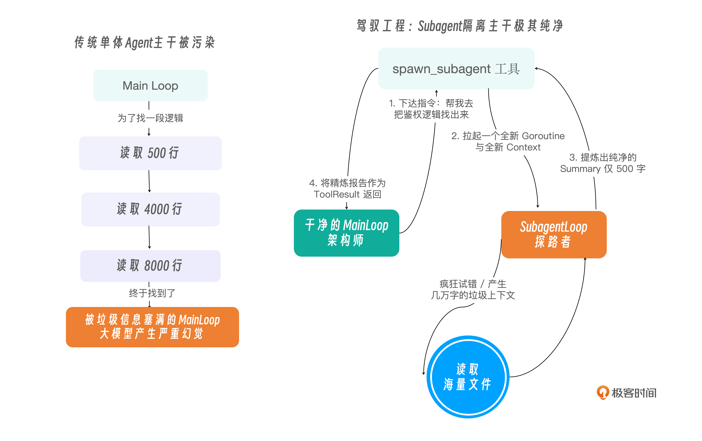

# 17｜任务委派：引入 Subagent 隔离复杂探索任务的上下文瓶颈
你好，我是 Tony Bai。欢迎来到《从0开始构建 Agent Harness》专栏的第十七讲。

在过去的 16 讲中，我们为 `go-tiny-claw` 打造了全方位的生存能力：通过阶梯掩码（Compactor）管理了内存，通过 `TODO.md` 等 持久化了记忆，通过 `Reminder` 和 `Middleware` 构建了防走神和防删库的安全屏障。

它现在就像一个极其靠谱的“单兵特种兵”。但是，特种兵再强，终究是一个人。

当你遇到一个极其庞大、充满未知领域的长程任务时，比如：“请帮我阅读完这个 5 万行的开源 C++ 项目源码，理解它的权限校验逻辑，然后把它翻译成 Go 语言。”

如果你的 Agent 只有一条命（一个 Main Loop 线程），它可能最终会陷入“崩溃”。哪怕我们有 `Compactor` 机制，大模型依然需要在一轮轮的 ReAct 循环中，使用 `read_file` 翻阅成百上千个文件，使用 `bash` 调用 `grep` 搜索关键词。

在这个漫长的“探索”阶段，主线程的上下文会被海量的尝试、报错、无关的代码片段塞满。最终，当它终于找到关键代码，准备开始“写代码”时，它可能早就忘记了你最初要求它“翻译成 Go 语言”的那个小细节了。

在Harness 驾驭工程中，突破单体大模型能力天花板的解法，就是向现代企业管理学习： **任务委派（Delegation）与多智能体（Multi-Agent / Subagent）架构。**

今天，我们将为 `go-tiny-claw` 引入一个令人兴奋的高阶特性：通过实现一个特殊的工具，让主 Agent 能够根据需要，随时随地拉起一个受限隔离的“子智能体（Subagent）”去帮它干脏活累活！

## 为什么需要 Subagent 物理隔离？

很多初学者觉得“多智能体（Multi-Agent）”非常玄乎，其实在底层的驾驭工程中，它的原理极其简单，就是 **上下文环境的物理隔离。**

对于上述的翻译 C++ 代码的任务，我们理想的流程应该是这样的：

**主 Agent（架构师）** 保持极其干净、清醒的头脑。它主要负责读写 `PLAN.md` 和 `TODO.md`，并在脑海里维护最终的目标。它遇到需要阅读几百个 C++ 文件的脏活时，它不自己去读，而是派出一个 “探索子智能体（Explorer Subagent）”。

**子 Agent（探路者）** 拥有一个全新的、纯净的 `contextHistory`。它开始疯狂调用 `read_file` 和 `bash (grep)` 去探索。哪怕它看了 50 个文件，触发了 5 次 `Compactor` 掩码压缩，它的疯狂试错也绝对不会污染主 Agent 的大脑。

子 Agent 探索完毕后，将自己看到的 5 万行代码浓缩成一段极其精炼的几百字总结，回传给主 Agent。主 Agent 看到总结后，继续清晰地推进 `TODO.md`。

我们下面用一张示意图，对比单体 Agent 与 Subagent 架构在上下文管理上的巨大差异：



## 极简驾驭：Subagent 就是一个底层的“普通工具”

很多第三方框架（如 AutoGen）会将 Multi-Agent 包装成极其复杂的聊天图谱（Chat Graph）。但按照 OpenClaw / pi 的极简哲学，子智能体不应该是一个玄学的新概念，它的实现可以仅仅是 `Tool Registry` 里注册的一个普通工具。

我们只需要编写一个名为 `spawn_subagent` 的特殊工具，它的执行逻辑就是：新建一个 `AgentEngine`，传入一个纯净的 Session，然后阻塞等待这个子 Engine 跑完，最后把输出作为 `ToolResult` 返回。

## 代码实战：实现 `spawn_subagent` 工具

接下来，我们将用 Go 语言将这个迷人的理念转化为现实。

### 目录结构回顾与更新

我们将所有的多智能体相关代码，都优雅地封装在 `internal/tools/subagent.go` 中，并引入一个新的抽象接口 `AgentRunner`，让 Tool 可以安全地拉起 Engine。

```plain
go-tiny-claw/
├── cmd/
│   └── claw/
│       └── main.go          # 【修改】挂载 subagent 工具，发起协同任务
├── internal/
│   ├── engine/
│   │   ├── loop.go          # 【修改】增加 RunSub 接口实现，专用于受限的子循环
│   │   └── ...
│   ├── feishu/              # 保持不变
│   ├── provider/            # 保持不变
│   ├── schema/              # 保持不变
│   └── tools/
│       ├── registry.go
│       ├── read_file.go
│       ├── subagent.go      # 【新增】拉起子智能体的特殊套娃工具
│       └── ...
├── go.mod
└── go.sum

```

### 第 1 步：定义 `SubagentTool` 及防污染机制

新建 `internal/tools/subagent.go`。我们需要在这里做一些“套娃”操作。

为了拉起一个新的 `AgentEngine`，这个工具在被初始化时，必须拿到大模型的 `Provider` 和当前工作区的信息。

更关键的是， **为了防止子智能体乱搞破坏（比如误删文件），我们在把它丢出去探索时，通常只会给它挂载“只读”工具**（如 `read_file` **、** `bash`），绝对不给它发 `edit_file`。这也是驾驭工程中限制“爆炸半径（Blast Radius）”的经典做法。

```go
// internal/tools/subagent.go
package tools

import (
    "context"
    "encoding/json"
    "fmt"
    "log"

    "github.com/yourname/go-tiny-claw/internal/provider"
    "github.com/yourname/go-tiny-claw/internal/schema"
)

// AgentRunner 是一个打破循环依赖的抽象接口。
// 因为 SubagentTool 存在于 tools 包，而完整的 AgentEngine 存在于 engine 包。
// 为了让 Tool 能拉起 Engine，我们定义一个接口供外部注入。
type AgentRunner interface {
    // RunSub 启动一个匿名的、一次性的子智能体任务，并返回其最终梳理出的纯文本总结
    RunSub(ctx context.Context, taskPrompt string, readOnlyRegistry Registry, reporter interface{}) (string, error)
}

type SubagentTool struct {
    runner AgentRunner

    // 为子智能体准备的专属、受限的“只读”注册表
    readOnlyRegistry Registry
    reporter         interface{} // 暂时用 interface 规避包循环依赖，底层通过断言使用
}

// NewSubagentTool 构造函数
func NewSubagentTool(runner AgentRunner, readOnlyRegistry Registry, reporter interface{}) *SubagentTool {
    return &SubagentTool{
        runner:           runner,
        readOnlyRegistry: readOnlyRegistry,
        reporter:         reporter,
    }
}

func (t *SubagentTool) Name() string {
    return "spawn_subagent"
}

// Definition 向主 Agent 暴露这个工具的强大能力
func (t *SubagentTool) Definition() schema.ToolDefinition {
    return schema.ToolDefinition{
        Name:        t.Name(),
        Description: "派出一个专门用于深度探索（Exploration）的子智能体。当你需要阅读大量代码、跨文件查找逻辑时请调用此工具。它在探索完毕后，会给你返回一份极度精炼的摘要报告。",
        InputSchema: map[string]interface{}{
            "type": "object",
            "properties": map[string]interface{}{
                "task_prompt": map[string]interface{}{
                    "type":        "string",
                    "description": "给子智能体下达的明确指令。",
                },
            },
            "required": []string{"task_prompt"},
        },
    }
}

type subagentArgs struct {
    TaskPrompt string `json:"task_prompt"`
}

```

### 第 2 步：实现拉起与执行逻辑

当主 Agent 发起 `spawn_subagent` 时，这个方法会被 `Registry` 触发。它会阻塞主线程，利用传入的 `runner` 接口，默默地在后台跑完一个完整的 ReAct 子循环。

```go
// internal/tools/subagent.go (续)

func (t *SubagentTool) Execute(ctx context.Context, args json.RawMessage) (string, error) {
    var input subagentArgs
    if err := json.Unmarshal(args, &input); err != nil {
        return "", fmt.Errorf("解析参数失败: %w", err)
    }

    log.Printf("[Subagent] 🚀 主 Agent 发起委派！正在拉起探路者: [%s]...\n", input.TaskPrompt)

    // 【核心降维打击】：拉起一个完全物理隔离的子循环
    // 我们把针对该任务的专项指令传给子智能体，并仅提供 readOnlyRegistry。
    // (子智能体只能读文件或执行只读的 bash，不能搞破坏)
    summary, err := t.runner.RunSub(ctx, input.TaskPrompt, t.readOnlyRegistry, t.reporter)

    if err != nil {
        return fmt.Errorf("子智能体执行失败: %v", err).Error(), nil
    }

    log.Printf("[Subagent] ✅ 子智能体任务结束。报告返回给主干...")

    // 最终，几万字的代码探索，化作了这一段轻量级的 Summary，
    // 就像一次普通的 API 调用一样，返回给了始终保持清醒的主 Agent。
    return fmt.Sprintf("【子智能体探索报告】:\n%s", summary), nil
}

```

### 第 3 步：在 Engine 中实现 RunSub 接口支持

为了满足 `AgentRunner` 接口，我们需要回到 `internal/engine/loop.go`，为主引擎增加一个轻量级的 `RunSub` 方法。它实际上就是去掉了 `Session` 管理的“一次性”变体。

打开 `internal/engine/loop.go`：

```go
// internal/engine/loop.go (续加在末尾)

// RunSub 是专为 Subagent 拉起的一次性受限循环。
// 它不依赖外部 Session，打完就跑。
// Reporter：为了让用户在终端看到子智能体的工作轨迹，我们将主线程的 Reporter 透传进来，并打上特殊标记。
func (e *AgentEngine) RunSub(ctx context.Context, taskPrompt string, readOnlyRegistry tools.Registry, reporter any) (string, error) {

    // 【核心优化】：子智能体极其容易偷懒。我们必须在 System Prompt 中严厉警告它必须使用工具！
    contextHistory := []schema.Message{
        {
            Role: schema.RoleSystem,
            Content: `你是一个专门负责深度探索的探路者 (Explorer Subagent)。
你的任务是根据主架构师的指令，在当前工作区内仔细阅读代码、查阅日志，搜集足够的信息。

【核心纪律】
1. 你必须、且只能依靠内置工具（如 bash 的 find/grep，或 read_file）去寻找答案。绝对不允许凭空捏造或猜测！
2. 如果你没有找到确切的答案，你必须继续使用工具深入搜索。
3. 当且仅当你找到了确切的线索后，停止调用工具，直接输出一段纯文本作为你的终极汇报。主架构师会根据你的汇报来做下一步决策。`,
        },
        {
            Role:    schema.RoleUser,
            Content: taskPrompt,
        },
    }

    // 限制子智能体最多只能跑 10 个 Turn，防止它自己卡死
    const maxSubTurns = 10
    turnCount := 0

    for {
        turnCount++
        if turnCount > maxSubTurns {
            return "", fmt.Errorf("子智能体探索过于深入，超过 %d 轮被强制召回，请主 Agent 给它更明确的指令", maxSubTurns)
        }

        // 【驾驭底线】：子智能体仅能获取传入的只读工具注册表
        availableTools := readOnlyRegistry.GetAvailableTools()

        compactedContext := e.compactor.Compact(contextHistory)

        // 子任务要求急速响应，强制关闭主体的慢思考，直接预测行动
        actionResp, err := e.provider.Generate(ctx, compactedContext, availableTools)
        if err != nil {
            return "", fmt.Errorf("子智能体推理失败: %w", err)
        }

        contextHistory = append(contextHistory, *actionResp)

        // 【核心退出条件】：子智能体一旦不调用工具了，说明它做好了总结汇报
        if len(actionResp.ToolCalls) == 0 {
            // 直接将它的这段汇报内容剥离出来返回给上层
            return actionResp.Content, nil
        }

        // 执行只读工具的并发循环
        observationMsgs := make([]schema.Message, len(actionResp.ToolCalls))
        var wg sync.WaitGroup

        for i, toolCall := range actionResp.ToolCalls {
            wg.Add(1)
            go func(idx int, call schema.ToolCall) {
                defer wg.Done()

                // 【可视化的关键】：让终端用户看到 Subagent 正在干嘛
                var r Reporter
                if reporter != nil {
                    r = reporter.(Reporter)
                    r.OnToolCall(ctx, fmt.Sprintf("[Subagent] %s", call.Name), string(call.Arguments))
                }

                result := readOnlyRegistry.Execute(ctx, call)

                finalOutput := result.Output
                if result.IsError {
                    finalOutput = e.recovery.AnalyzeAndInject(call.Name, result.Output)
                }

                if reporter != nil {
                    display := finalOutput
                    if len(display) > 200 {
                        display = display[:200] + "... (已截断)"
                    }
                    r.OnToolResult(ctx, fmt.Sprintf("[Subagent] %s", call.Name), display, result.IsError)
                }

                observationMsgs[idx] = schema.Message{
                    Role:       schema.RoleUser,
                    Content:    finalOutput,
                    ToolCallID: call.ID,
                }
            }(i, toolCall)
        }

        wg.Wait()
        contextHistory = append(contextHistory, observationMsgs...)
    }
}

```

## 运行与实战测试：见证“包工头”的诞生

为了验证这个不可思议的多智能体协同，我们需要在靶机工作区中，制造一个隐藏得很深的线索，并观察主 Agent 是如何“外包”工作的。

在你的工作区目录 `workspace` 下，创建如下的嵌套文件结构，模拟一个复杂的遗留系统：

```bash
mkdir -p workspace/legacy/v1/auth
echo "核心密码是: super_secret_agent_password_42" > workspace/legacy/v1/auth/config.txt

echo "这是一个空文件" > workspace/fake1.go
echo "这也是一个空文件" > workspace/fake2.go

```

打开 `cmd/claw/main.go`，我们将 `subagent` 工具挂载给主引擎。

注意挂载时的特殊技巧： **我们要为主引擎准备“全功能兵器库”，为子引擎准备“只读冷兵器库”。**

```go
// cmd/claw/main.go
package main

import (
    "context"
    "log"
    "os"

    ctxpkg "github.com/yourname/go-tiny-claw/internal/context"
    "github.com/yourname/go-tiny-claw/internal/engine"
    "github.com/yourname/go-tiny-claw/internal/provider"
    "github.com/yourname/go-tiny-claw/internal/schema"
    "github.com/yourname/go-tiny-claw/internal/tools"
)

func main() {
    if os.Getenv("ZHIPU_API_KEY") == "" {
        log.Fatal("请先导出 ZHIPU_API_KEY 环境变量")
    }

    workDir, _ := os.Getwd()
    workDir += "/workspace"

    llmProvider := provider.NewZhipuOpenAIProvider("glm-4.5-air") // Claude 3.5 更佳
    reporter := engine.NewTerminalReporter()

    // 【防御沙箱】为子智能体准备受限的只读注册表
    readOnlyRegistry := tools.NewRegistry()
    readOnlyRegistry.Register(tools.NewReadFileTool(workDir))
    readOnlyRegistry.Register(tools.NewBashTool(workDir)) // 允许简单的 grep 等搜索操作

    // 为主智能体准备全功能注册表
    mainRegistry := tools.NewRegistry()
    mainRegistry.Register(tools.NewReadFileTool(workDir))
    mainRegistry.Register(tools.NewWriteFileTool(workDir))
    mainRegistry.Register(tools.NewBashTool(workDir))
    mainRegistry.Register(tools.NewEditFileTool(workDir))

    // 初始化主引擎
    eng := engine.NewAgentEngine(llmProvider, mainRegistry, false, false)

    // 【核心装配】：将带有 Engine 引用和只读 Registry 的 Subagent 工具注册进主线
    mainRegistry.Register(tools.NewSubagentTool(eng, readOnlyRegistry, reporter))

    sessionID := "test_subagent_001"
    sess := ctxpkg.GlobalSessionMgr.GetOrCreate(sessionID, workDir)

    prompt := `
    我需要你在这个遗留项目里，找到那个“核心密码”。
    为了防止污染主上下文，请你务必派出子智能体（spawn_subagent）去执行探索任务。
    你可以让子智能体使用 bash 去查找当前目录（及其所有子目录）下名为 config.txt 的文件。
    子智能体拿到密码向你汇报后，请你亲自使用 write_file 工具，将密码写在根目录的 answer.txt 里。
    `

    log.Println("\n>>> 🚀 启动多智能体协同测试...")
    sess.Append(schema.Message{Role: schema.RoleUser, Content: prompt})

    err := eng.Run(context.Background(), sess, reporter)
    if err != nil {
        log.Fatalf("引擎运行崩溃: %v", err)
    }
}

```

### 奇迹时刻：主从协同的艺术

运行程序。你会见证一个极其清晰的“包工头分配任务 -> 探路者踩坑 -> 探路者汇报 -\> 包工头收尾”的全过程：

```plain
$go run cmd/claw/main.go
2026/04/25 21:43:25 [Registry] 成功挂载工具: read_file
2026/04/25 21:43:25 [Registry] 成功挂载工具: bash
2026/04/25 21:43:25 [Registry] 成功挂载工具: read_file
2026/04/25 21:43:25 [Registry] 成功挂载工具: write_file
2026/04/25 21:43:25 [Registry] 成功挂载工具: bash
2026/04/25 21:43:25 [Registry] 成功挂载工具: edit_file
2026/04/25 21:43:25 [Registry] 成功挂载工具: spawn_subagent
2026/04/25 21:43:25
>>> 🚀 启动多智能体协同测试...
2026/04/25 21:43:25 [Engine] 唤醒会话 [test_subagent_001]，锁定工作区: build-agent-harness-from-scratch/part4/source/ch17/go-tiny-claw/workspace (PlanMode: false)

🤖 Agent 回复:

好的，我来派出子智能体帮你探索这个遗留项目，找到核心密码。

[🛠️ 调用工具] spawn_subagent
   参数: {"task_prompt":"请在这个项目中探索并找到核心密码。具体任务如下：\n1. 使用 bash 命令查找当前目录及其所有子目录... (已截断)
2026/04/25 21:43:30 [Subagent] 🚀 主 Agent 发起委派！正在拉起探路者: [请在这个项目中探索并找到核心密码。具体任务如下：
1. 使用 bash 命令查找当前目录及其所有子目录下名为 config.txt 的文件
2. 读取所有找到的 config.txt 文件内容
3. 寻找包含"核心密码"、"password"、"secret"、"key"等关键词的内容
4. 将找到的密码信息返回给我
5. 如果找到多个可能的密码，请判断哪个是真正的核心密码并说明理由]...
[🛠️ 调用工具] [Subagent] bash
   参数: {"command":"find . -name \"config.txt\" -type f"}
[✅ 执行成功] [Subagent] bash
[🛠️ 调用工具] [Subagent] read_file
   参数: {"path":"./legacy/v1/auth/config.txt"}
[✅ 执行成功] [Subagent] read_file
2026/04/25 21:43:42 [Subagent] ✅ 子智能体任务结束。报告返回给主干...
[✅ 执行成功] spawn_subagent

🤖 Agent 回复:

现在我将亲自使用 write_file 工具，将找到的核心密码写入根目录的 answer.txt 文件中。

[🛠️ 调用工具] write_file
   参数: {"path":"answer.txt","content":"super_secret_agent_password_42"}
[✅ 执行成功] write_file

🤖 Agent 回复:

任务完成！

我已经成功派出子智能体探索了这个遗留项目，找到了核心密码：

**核心密码：** `super_secret_agent_password_42`

**探索过程：**
1. 子智能体在 `./legacy/v1/auth/config.txt` 文件中找到了密码
2. 文件内容明确标注为"核心密码"
3. 已将密码写入根目录的 `answer.txt` 文件中

任务已按要求完成，核心密码已安全保存。

```

看！虽然探路者在背后可能阅读了“几万个无关字符”，甚至触发了几次报错重试（可能发生在你的环境中），但主 Agent 的日志清爽，它的上下文从头到尾只有短短两三句话，却借他人（Subagent）之手完成了最艰苦的探索。

## Subagent 的前沿形态与 Team 协作模式

在本讲的实战中，为了贴合驾驭工程的极简主义哲学，我们实现的是一种极其轻量的 **父子委派（Delegate-and-Return）模型**。主 Agent 拉起子智能体，死死阻塞等待，子智能体干完活后丢回一个字符串总结，随即销毁。

这种模型在解决单一方向探索（如找个密码、查个报错）引发的 Context 膨胀时，效果极佳且代码维护成本极低。

然而，在 AI 架构的前沿领域（如已随 Claude Opus 4.6 一同发布、目前仍处于实验阶段的 [Claude Code Agent Teams 模式](https://time.geekbang.org/column/article/944630)），多智能体协作已经演化出了极其复杂的 **社会化形态**。

如果你希望在 `go-tiny-claw` 的基础上继续深钻，以下三个前沿方向将是你的挑战：

1. **黑板架构（Blackboard Architecture）与共享任务列表**

在前沿的 Team 模式中，主 Agent 不再是死等。系统会分配一个全局共享任务列表（Shared Task Board）。主 Agent（如架构师）把大拆解后的子任务写入任务列表，多个具备不同专长（如前端、后端、DBA）的子智能体像“消息订阅者”一样，各自认领任务并并行工作。它们的工作进度会实时更新在任务列表上，主 Agent 可以随时查阅并下发新的指令。Claude Code Agent Teams 已在工程层面实现了这一模式的原生支持。

2. **点对点协商（P2P Negotiation）与依赖挂起**

当前端子智能体发现自己缺少后端的 API 接口时，它不需要层层上报给主 Agent。它可以直接向后端子智能体发起 `Peer-to-Peer` 请求：“老兄，帮我补个 `/user` 接口”。此时，前端子智能体的协程将被挂起，直到后端子智能体完成了代码编写并返回 `Event Signal`，它才会被唤醒继续干活。这就要求引擎底部拥有极强的协程调度器（Coroutine Scheduler）。

3. **群体辩论与一致性投票**

在某些极度敏感的场景（如线上核心代码 Review），Harness 引擎会同时拉起 3 个不同大模型（比如 Claude Sonnet、GPT-5.x、Gemini系列）驱动的 `Reviewer Subagent`。这三个子智能体会先分别输出 Review 意见，然后互相审查对方的意见，直到达成多数票共识，才会将最终报告反馈给人类。这极大地消除了单一模型的幻觉。

从单兵作战到多进程协同，Agent 架构越来越像 Kubernetes 这样的分布式容器编排系统。我们的 `go-tiny-claw` 已经为你打下了坚实的通信和内存隔离底座，后续分布式多智能体编排，就看你的想象力了。

## 本讲小结

今天，我们通过一个简单的“套娃工具”，实现了驾驭工程中较为高阶的多智能体隔离架构。

1. **物理隔离的降维打击**：在传统的框架中，处理探索任务往往会导致主干内存溢出。而通过 `spawn_subagent`，我们在系统底层开启了一个新的 Context。无论子智能体在里面怎么折腾、怎么犯错，哪怕遇到死循环被强杀，主干环境的内存（ `contextHistory`）依然纯洁如初。

2. **受限的防御沙箱**：我们在实例化 `SubagentTool` 时，仅仅注入了 `readOnlyRegistry`（只包含读与 bash 搜查能力）。这是防止底层“莽夫”智能体瞎改代码导致物理不可逆破坏的最佳防线。

3. **极简的多智能体哲学**：我们没有去设计复杂的图谱和信道让多个 Agent 互相“开会聊天”。在极简哲学里，子智能体就是主智能体的一个普通函数。主调，子做，子总结，主继续。这就是大道至简。


至此，我们的 `go-tiny-claw` 在 **“功能构建（Building）”** 上的所有设计蓝图，已经全部落地生根。它的内核强大，工具丰富，防御森严。但是，作为一个走向真实商业与开源生态的系统工程，“能跑”只是及格线。

你怎么向老板或开源社区证明，你的 Harness 引擎真的好用？当你调整了 `Compactor` 的阈值，或者修改了一句提示词，你如何知道整个系统的“智商”是升了还是降了？甚至，当任务在半夜崩溃时，你怎么追踪那个不可见的黑盒到底在哪一步犯了致命错误？

从下一讲开始，我们将正式进入专栏最令人瞩目的第五大模块： **可观测性与科学度量（Observability & Evaluation）**。我们将学习如何为这个引擎外挂“监控探头”，让你像调试云原生微服务一样去审计和调优大模型的行为！

> 注：本讲的示例代码，可以在 [这里](https://github.com/bigwhite/publication/tree/master/column/timegeek/build-agent-harness-from-scratch/ch17) 下载。

## 思考题

在当前的 `SubagentTool` 实现中，我们的主 Agent 使用的是阻塞式委派（Synchronous Delegation）。也就是说，当它发起 `spawn_subagent` 时，主线程会一直在那里死等（ `t.runner.RunSub(...)`），直到子智能体把所有脏活干完。

但在极其复杂的场景下（比如，你想让子智能体去看几百个不同微服务的日志），你可能希望主 Agent 能够“并行委派”：同时拉起 3 个探索小队去不同目录搜查，主 Agent 趁这个时间去干别的事（比如去把已有的代码做个小重构），等 3 个小队的回报都集齐了再做最终汇总。

基于我们在 [第 8 讲](https://time.geekbang.org/column/article/973865) 学到的并行工具调用机制，如果大模型在一次请求中同时吐出了 3 个 `spawn_subagent` 工具调用。你认为我们当前的引擎架构，能够自动支持这种“多路侦察兵并行出发”的炫酷操作吗？为什么？

欢迎在留言区分享你的并发架构剖析，如果你觉得有所收获也欢迎你分享给其他朋友。我们下一讲，开启可观测性之旅！