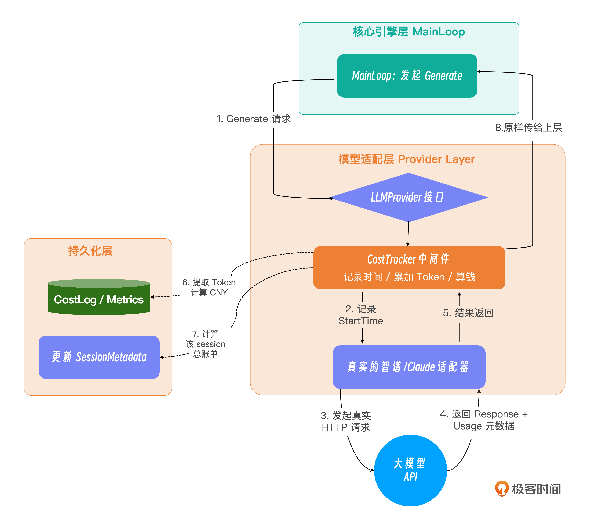
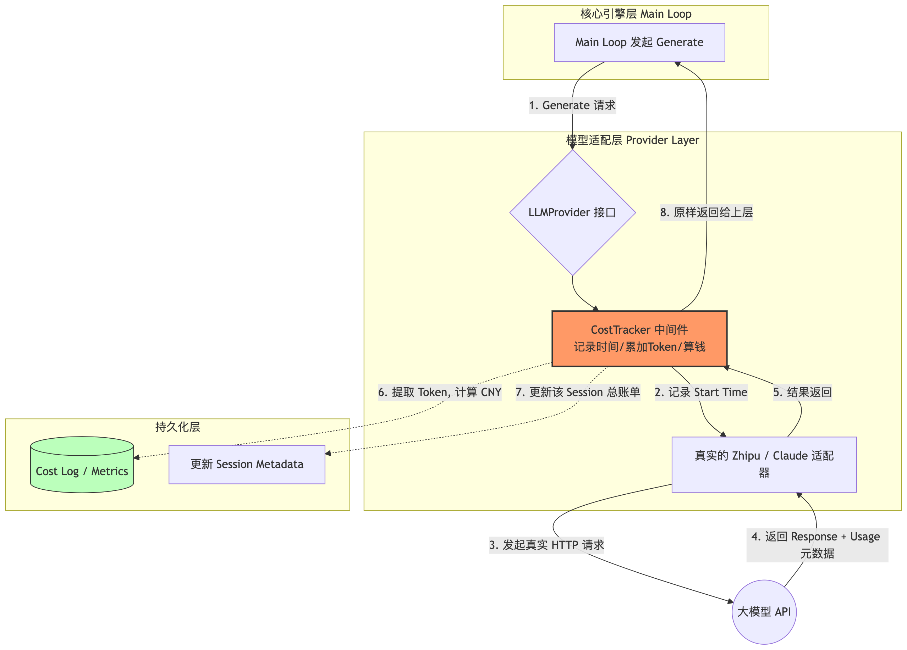

# 18｜成本与状态追踪：在 Harness 层拦截并记录 Token 消耗与执行耗时
你好，我是 Tony Bai。欢迎来到《从0开始构建 Agent Harness》专栏的第十八讲。

在过去的几个模块中，我们如同打造一辆超级跑车般，为 `go-tiny-claw` 组装了强大的 V8 引擎（Main Loop）、防抱死刹车（Safety Middleware）、甚至是能自动寻路的“副驾驶”（Subagent）。但是，如果这辆跑车没有 **“仪表盘（Dashboard）”**，你敢把它开上真实的赛道吗？

想象一下，你把 `go-tiny-claw` 部署到了公司的生产环境中，团队的 10 个开发人员每天都在飞书里唤醒它去做代码 Review 和 Bug 排查。月底结算时，老板拿着一张高达几万元的 API 账单质问你：

- 为什么这个月的大模型费用这么高？

- 到底是哪一个任务、调了哪个工具消耗了最多的 Token？

- Agent 每次回复都要等 30 秒，到底是网络慢、还是它在本地执行 `go test` 慢、还是大模型推理慢？


如果你无法回答这些问题，你的 Agent 依然只能是一个“玩具”，老板不会批准你将其投入到日常生产，也无法成为企业级的数字资产。

这就是我们今天要讲的核心： **可观测性与科学度量**（Observability & Evaluation）。今天，我们将正式开启本专栏的第五大模块。我们将通过极简的代码，在 Harness 层（而非业务层）拦截大模型的返回包，精确记录 Token 消耗、金钱成本和执行耗时。

## 算明“经济账”，才能做好驾驭工程

在调用大模型 API 时，成本主要由两部分构成：

1. **Prompt Tokens（输入 Token）**：这是大模型阅读系统提示词、对话历史和文件内容的成本。在 `go-tiny-claw` 中，由于上下文是在不断累加的，输入 Token 会随着对话轮数呈现出近似 O(n²) 的增长趋势。

2. **Completion Tokens（输出 Token）**：这是大模型生成回答、思考过程（Thinking Trace）和工具调用参数（JSON）的成本。通常比输入 Token 贵 3-5 倍。


除了金钱成本， **时间成本** 也是决定 Agent 体验的关键。

一个 Turn 的耗时 = 大模型推理耗时 + 工具在本地的物理执行耗时（如 `go build`）。

### 为什么必须在 Harness 层拦截？

传统的应用开发者往往会在每次发起 API 请求的前后，手动写几行代码去计算时间和读取返回值。比如：

```go
// 伪代码
start := time.Now()
resp, _ := llm.Generate(...)
cost := calculate(resp.Usage)
log.Printf("耗时: %v, 花费: %f", time.Since(start), cost)

```

这种写法的致命缺陷在于 **代码侵入性太强**。如果系统里有 10 个地方调用了 `Generate`（比如我们上一讲加的 Subagent），你就得复制 10 次这段代码。

在驾驭工程中，我们追求的是对上层业务的绝对透明。我们必须在 **模型适配器（Provider Adapter）的极低层** 进行拦截。我们用一张示意图来展示这种基于“拦截器模式”的无侵入式成本追踪架构：





通过这种 **装饰器模式（Decorator）**， `Main Loop` 根本不知道自己被“监控”了，它依然像以前一样发起调用。而所有的 Token 和耗时数据，都在 `Tracker` 中被截获并记录。

## 代码实战：构建 Cost Tracker 中间件

接下来，我们将用 Go 语言将这个优雅的架构变现。

### 目录结构回顾与更新

我们将新增 `internal/observability` 目录用于存放所有的监控指标代码。同时，我们需要修改之前写好的 `provider/openai.go` 和 `provider/claude.go`，让它们能将 API 原生的 `Usage` 字段透传出来。

```plain
go-tiny-claw/
├── cmd/
│   └── claw/
│       └── main.go              # 【修改】将 Provider 包装进 Tracker 再注入 Engine
├── internal/
│   ├── engine/
│   │   ├── loop.go              # 保持不变 (完全无侵入)
│   │   └── session.go           # 【修改】增加累计 Token 和花费的字段
│   ├── observability/           # 【新增】可观测性模块
│   │   └── tracker.go           # 【新增】成本与耗时追踪装饰器
│   ├── provider/
│   │   ├── interface.go         # 保持不变
│   │   ├── claude.go            # 【修改】解析返回的 Token 数量
│   │   └── openai.go            # 【修改】解析返回的 Token 数量
│   ├── schema/
│   │   └── message.go           # 【修改】Message 结构体增加 Usage 字段
│   └── tools/                   # 保持不变
├── go.mod
└── go.sum

```

### 第 1 步：扩展基础数据结构

大模型 API 会在返回结果中附带 Token 消耗的元数据（Metadata）。我们需要在 `schema` 中找个地方接住它们。

打开 `internal/schema/message.go`：

```go
// internal/schema/message.go
package schema

import "encoding/json"

// Usage 记录了单次大模型 API 调用的 Token 消耗
type Usage struct {
    PromptTokens     int `json:"prompt_tokens"`     // 输入的 Token 数量
    CompletionTokens int `json:"completion_tokens"` // 产生的 Token 数量
}

// Message 代表上下文中传递的单条消息
type Message struct {
    Role       Role       `json:"role"`
    Content    string     `json:"content"`
    ToolCalls  []ToolCall `json:"tool_calls,omitempty"`
    ToolCallID string     `json:"tool_call_id,omitempty"`

    // 【新增】如果这是大模型 (Assistant) 的回复，此字段存放本次调用的 Token 消耗
    Usage *Usage `json:"usage,omitempty"`
}

// ... 其余定义保持不变 ...

```

接着，我们需要让 `Session` 能够记住自己“这辈子”一共花了多少钱。

打开 `internal/engine/session.go`，修改 `Session` 结构体：

```go
// internal/engine/session.go
package engine

import (
    // ... 保持原有导入 ...
)

type Session struct {
    ID        string
    CreatedAt time.Time
    UpdatedAt time.Time

    // 【新增】用于统计该 Session 累计消耗的资源
    TotalPromptTokens     int
    TotalCompletionTokens int
    TotalCostCNY          float64

    history []schema.Message
    mu      sync.RWMutex
}

// RecordUsage 是一个给外部 Tracker 调用的辅助方法，用于累加账单
func (s *Session) RecordUsage(prompt int, completion int, cost float64) {
    s.mu.Lock()
    defer s.mu.Unlock()
    s.TotalPromptTokens += prompt
    s.TotalCompletionTokens += completion
    s.TotalCostCNY += cost
}

// ... 其余方法保持不变 ...

```

### 第 2 步：在 Provider 适配层提取 Token

我们需要修改之前写好的两个大模型适配器，让它们在解析结果时，顺手把 `Usage` 数据捞出来填进 `schema.Message` 里。

以 `internal/provider/openai.go`（兼容openai大模型接口的适配器）为例：

```go
// internal/provider/openai.go
package provider

import (
    // ... 保持原有导入 ...
)

// ... NewZhipuOpenAIProvider 等保持不变 ...

func (p *OpenAIProvider) Generate(ctx context.Context, msgs []schema.Message, availableTools []schema.ToolDefinition) (*schema.Message, error) {
    // ... 前面组装请求的代码完全保持不变 ...

    resp, err := p.client.Chat.Completions.New(ctx, params)
    if err != nil {
        return nil, fmt.Errorf("OpenAI/Zhipu API 请求失败: %w", err)
    }

    choice := resp.Choices[0].Message
    resultMsg := &schema.Message{
        Role:    schema.RoleAssistant,
        Content: choice.Content,
    }

    // 【新增】提取 Usage 信息
    if resp.Usage.PromptTokens > 0 || resp.Usage.CompletionTokens > 0 {
        resultMsg.Usage = &schema.Usage{
            PromptTokens:     int(resp.Usage.PromptTokens),
            CompletionTokens: int(resp.Usage.CompletionTokens),
        }
    }

    // ... 后面解析 ToolCalls 的代码完全保持不变 ...

    return resultMsg, nil
}

```

注意：针对 `claude.go` 的修改也是同理，在返回体中提取 `resp.Usage.InputTokens` 和 `resp.Usage.OutputTokens` 即可，详见本讲的 [完整示例代码仓库](https://github.com/bigwhite/publication/tree/master/column/timegeek/build-agent-harness-from-scratch/ch18)。

### 第 3 步：编写优雅的 Cost Tracker 装饰器

这是本讲最核心的代码。我们要新建 `internal/observability/tracker.go`。

我们将在这个文件里运用 Go 语言经典的 **装饰器模式**。实现一个“假”的 `LLMProvider`，它内部包裹着“真”的 Provider。

```go
// internal/observability/tracker.go
package observability

import (
    "context"
    "log"
    "time"

    "github.com/yourname/go-tiny-claw/internal/provider"
    "github.com/yourname/go-tiny-claw/internal/schema"
    ctxpkg "github.com/yourname/go-tiny-claw/internal/context"
)

// PricingModel 定义了不同大模型的计费标准 (单位: 美元/1M Tokens)
// 为了演示，这里硬编码了当前市面上几个主流模型的官方大致定价。
var PricingModel = map[string]struct {
    InputPrice  float64
    OutputPrice float64
}{
    "glm-4.5-air":              {InputPrice: 0.15, OutputPrice: 0.15}, // 这里假定的大模型价格(每百万Token，tk)
}

// CostTracker 是一个包装了真实 LLMProvider 的装饰器中间件
type CostTracker struct {
    nextProvider provider.LLMProvider
    modelName    string
    session      *ctxpkg.Session // 当前所属的会话 (用于累加总成本)
}

// NewCostTracker 构造函数：接收一个现有的 Provider，返回一个被监控的 Provider
func NewCostTracker(next provider.LLMProvider, modelName string, session *ctxpkg.Session) *CostTracker {
    return &CostTracker{
        nextProvider: next,
        modelName:    modelName,
        session:      session,
    }
}

// Generate 实现了 LLMProvider 接口！这意味着它可以被无缝注入到 Main Loop 中。
func (t *CostTracker) Generate(ctx context.Context, msgs []schema.Message, availableTools []schema.ToolDefinition) (*schema.Message, error) {

    // 1. 记录请求发起的时刻
    startTime := time.Now()

    // 2. 调用真实的底层大模型去执行耗时的网络请求
    respMsg, err := t.nextProvider.Generate(ctx, msgs, availableTools)

    // 3. 计算耗时
    latency := time.Since(startTime)

    // 如果报错了，只打印报错时间，不计费
    if err != nil {
        log.Printf("[Tracker] ❌ API 调用失败，耗时: %v\n", latency)
        return respMsg, err
    }

    // 4. 解析 Token 并计算成本
    if respMsg.Usage != nil {
        promptTokens := respMsg.Usage.PromptTokens
        completionTokens := respMsg.Usage.CompletionTokens

        var cost float64
        if price, exists := PricingModel[t.modelName]; exists {
            // 计算美元花费 = (输入Tokens * 输入单价 + 输出Tokens * 输出单价) / 1000000
            cost = (float64(promptTokens)*price.InputPrice + float64(completionTokens)*price.OutputPrice) / 1000000.0
        }

        // 5. 打印精美的仪表盘日志
        log.Printf("[Tracker] 📊 API 调用完成 | 耗时: %v | 输入: %d tk | 输出: %d tk | 花费: ¥%.6f\n",
            latency, promptTokens, completionTokens, cost)

        // 6. 将账单累加到当前的 Session 中，供人类后续随时查询
        if t.session != nil {
            t.session.RecordUsage(promptTokens, completionTokens, cost)
            log.Printf("[Tracker] 💰 当前会话 (%s) 累计花费: ¥%.6f\n", t.session.ID, t.session.TotalCostCNY)
        }
    } else {
        log.Printf("[Tracker] ⚠️ API 调用完成，但未返回 Usage 数据 | 耗时: %v\n", latency)
    }

    return respMsg, nil
}

```

这段代码写得很具工程美感。 `CostTracker` 本身实现了 `provider.LLMProvider` 接口，这使得它对于调用方（ `AgentEngine`）来说，完全是 **透明** 的。

你可以把它想象成一个安检门：数据必须先经过它，它在数据上盖了个“时间戳”，然后再原封不动地还给你。

### 第 4 步：在 Main 函数中像组装乐高一样串联它们

最后，我们回到 `cmd/claw/main.go`。我们将把这个拦截器“套”在真实的 Provider 外面。

```go
// cmd/claw/main.go
package main

import (
    "context"
    "log"
    "os"

    ctxpkg "github.com/yourname/go-tiny-claw/internal/context"
    "github.com/yourname/go-tiny-claw/internal/engine"
    "github.com/yourname/go-tiny-claw/internal/observability" // 导入监控包
    "github.com/yourname/go-tiny-claw/internal/provider"
    "github.com/yourname/go-tiny-claw/internal/schema"
    "github.com/yourname/go-tiny-claw/internal/tools"
)

func main() {
    if os.Getenv("ZHIPU_API_KEY") == "" {
        log.Fatal("请先导出 ZHIPU_API_KEY 环境变量")
    }

    workDir, _ := os.Getwd()
    modelName := "glm-4.5-air"

    // 1. 初始化真实的底层大脑
    realProvider := provider.NewZhipuOpenAIProvider(modelName)

    sessionID := "test_observability_001"
    sess := ctxpkg.GlobalSessionMgr.GetOrCreate(sessionID, workDir)

    // 2. 核心拼装：用 Tracker 将真实的大脑包裹起来
    trackedProvider := observability.NewCostTracker(realProvider, modelName, sess)

    registry := tools.NewRegistry()
    registry.Register(tools.NewBashTool(workDir))

    // 3. 将被包裹的 Provider 注入给 Engine (Engine 毫不知情)
    eng := engine.NewAgentEngine(trackedProvider, registry, false, false)
    reporter := engine.NewTerminalReporter()

    prompt := `请用 bash 帮我用 date 命令查一下现在的时间。`

    log.Println("\n>>> 🚀 启动带仪表盘的可观测性测试...")
    sess.Append(schema.Message{Role: schema.RoleUser, Content: prompt})

    err := eng.Run(context.Background(), sess, reporter)
    if err != nil {
        log.Fatalf("引擎运行崩溃: %v", err)
    }

    log.Printf("\n================ 财务报表 ================\n")
    log.Printf("会话 ID: %s\n", sess.ID)
    log.Printf("总消耗 Input Tokens: %d\n", sess.TotalPromptTokens)
    log.Printf("总消耗 Output Tokens: %d\n", sess.TotalCompletionTokens)
    log.Printf("总计费用 (CNY): ¥%.6f\n", sess.TotalCostCNY)
    log.Printf("==========================================\n")
}

```

## 运行与实战测试：看着钱在燃烧

执行命令：

```bash
go run cmd/claw/main.go

```

紧盯终端的输出，你将感受到一种作为一个“项目经理”而非底层码农的快感。大模型在每一次呼吸时的耗时和金钱，都被你记录得明明白白：

```plain
$go run cmd/claw/main.go
2026/05/01 12:30:51 [Registry] 成功挂载工具: bash
2026/05/01 12:30:51
>>> 🚀 启动带仪表盘的可观测性测试...
2026/05/01 12:30:51 [Engine] 唤醒会话 [test_observability_001]，锁定工作区: build-agent-harness-from-scratch/part5/source/ch18/go-tiny-claw (PlanMode: false)
2026/05/01 12:30:53 [Tracker] 📊 API 调用完成 | 耗时: 1.894545752s | 输入: 396 tk | 输出: 43 tk | 花费: ¥0.000066
2026/05/01 12:30:53 [Tracker] 💰 当前会话 (test_observability_001) 累计花费: ¥0.000066

🤖 Agent 回复:

[🛠️ 调用工具] bash
   参数: {"command":"date"}
[✅ 执行成功] bash
2026/05/01 12:30:55 [Tracker] 📊 API 调用完成 | 耗时: 1.385377213s | 输入: 433 tk | 输出: 76 tk | 花费: ¥0.000076
2026/05/01 12:30:55 [Tracker] 💰 当前会话 (test_observability_001) 累计花费: ¥0.000142

🤖 Agent 回复:

当前时间是：**2026年5月1日 12:30:53 CST**

2026/05/01 12:30:55
================ 财务报表 ================
2026/05/01 12:30:55 会话 ID: test_observability_001
2026/05/01 12:30:55 总消耗 Input Tokens: 829
2026/05/01 12:30:55 总消耗 Output Tokens: 119
2026/05/01 12:30:55 总计费用 (CNY): ¥0.000142
2026/05/01 12:30:55 ==========================================

```

在上面的日志中，随着对话轮数的增加（Turn 2 比 Turn 1 多携带了刚才执行 `bash` 的上下文日志），你可以清晰地看到输入 Token 从 396 增长到了 433。而大模型真正的推理耗时稳定在 2 秒以内。

试想一下，如果没有这套机制，当你在生产环境运行一个包含几十次 `read_file` 调用的长程任务，最终花费了 10 多元人民币时，你根本不知道这钱是在哪一个 Turn 里被消耗掉的。

现在，你对 Agent 的每一个微小动作，都有了“上帝视角”的掌控。

## 本讲小结

今天，我们通过一个极简的拦截器，为 `go-tiny-claw` 铺设了通往工业级应用的第一条监控管线：可观测性。

1. **算明经济账是落地的关键**：在驾驭工程中，衡量一个 Agent 是否优秀，除了看它能不能把代码跑通，更要看它的 **Token 效率**。如果不把成本监控落到代码实处，就无法优化 System Prompt 的长度，也无从判断上下文压缩是否真的起到了省钱的作用。

2. **装饰器模式的优雅应用**：为了保持核心引擎（Main Loop）的纯粹性，我们没有在里面混入任何一行记录时间或计费的代码。我们通过实现一个包装了真实 `LLMProvider` 的 `CostTracker`，实现了功能的无缝外挂（运用了类似AOP 面向切面编程的思想）。

3. **长期价值的沉淀**：通过将会话总账单挂载到 `Session` 对象上，如果结合我们在上一讲学到的“持久化外部记忆”，你完全可以在每天下班时，让飞书机器人给你发一份《今日大模型运维账单财报》。


有了这块仪表盘，我们对大模型的性能瓶颈就有了清晰的认知。但是，这仅仅监控了“果”，我们依然不知道“因”。

如果大模型在一个长程任务里跑崩了（比如写了一段完全逻辑不通的代码），虽然我们现在知道了它在哪一秒花了多少钱，但我们却无法追溯 **它当时脑子里到底在想什么？它看了哪些文件才做出了这个极其愚蠢的决定？**

在下一讲中，我们将探索可观测性体系的最深处： **洞察黑盒（Tracing）。** 我们将引入一套类似于云原生微服务链路追踪的机制，让你能像回放比赛录像一样，逐帧复盘 Agent 失败时的全量决策路径。

> 注：本讲的示例代码，可以在 [这里](https://github.com/bigwhite/publication/tree/master/column/timegeek/build-agent-harness-from-scratch/ch18) 下载。

## 思考题

在我们今天的 `CostTracker` 中，我们记录的仅仅是向大模型发起 HTTP 请求的那部分耗时（ `Generate` 方法的执行时间）。但你在第 8 讲中学过，我们的 `go-tiny-claw` 是支持在本地利用 Goroutine 并发执行多个物理工具（如 `bash` 命令或 `read_file`）的。

如果一个 `bash` 命令执行了一个需要编译 5 分钟的巨型 Go 项目，这 5 分钟的物理世界耗时，目前的 `CostTracker` 是捕获不到的。结合我们本讲中使用的“装饰器拦截（Decorator/Middleware）”模式，如果让你在不修改 `internal/tools/bash.go` 源码的前提下，编写一个能记录“工具在本地物理执行真正耗费了多少毫秒”的拦截器，并且把它挂载到 Engine 中，你会怎么写这段代码？

提示：回忆一下我们在第 16 讲学过的，在 `Registry` 中使用 `Use` 挂载 `MiddlewareFunc` 的逻辑。

欢迎在留言区分享你的监控探头设计。我们下一讲，开启链路追踪！