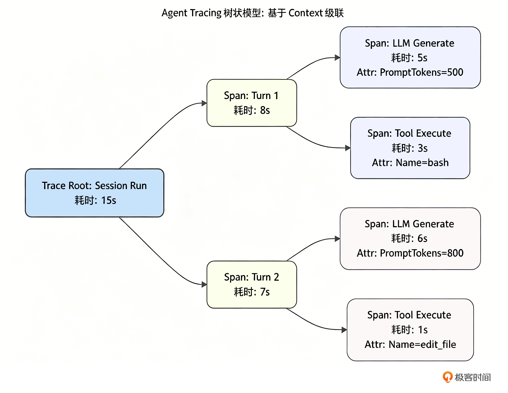

# 19｜洞察黑盒：为 Agent 引入 Tracing 机制复盘失败决策路径

你好，我是 Tony Bai。欢迎来到《从0开始构建 Agent Harness》专栏的第十九讲。

在上一讲中，我们为 `go-tiny-claw` 打造了成本追踪的“仪表盘（Cost Tracker）”，我们清楚地知道了 Agent 每次运行消耗了多少 Token 和人民币。这是企业级落地必不可少的第一步算账。 **但是，仅仅知道“花了多少钱”和“跑了多久”，并不能帮我们排查深层次的逻辑 Bug。**

设想这样一个真实的生产事故：你的 Agent 在排查线上问题时，跑了整整 5 分钟，经历了 15 个 Turn（轮次）的 ReAct 循环，最终宣告：“对不起，我无法修复这个问题。”

作为它的主程序员，你面对满屏滚动的终端日志，完全是一头雾水：

- 它在哪一步开始跑偏的？

- 在第 8 个 Turn 时，它发给大模型的 System Prompt 和 Working Memory 到底长什么样？大模型返回的原始 JSON 是不是因为截断而导致了幻觉？

- 它并发调用的 3 个工具，究竟是哪一个导致了耗时飙升？

大模型本身是一个不可控的 **“黑盒（Black Box）”**。如果在驾驭工程（Harness Engineering）中，我们不能提供透视这个黑盒的“X 光机”，一旦 Agent 发生智障行为，我们将陷入无法调试的境地。

今天，我们将补齐可观测性体系（Observability）中最具技术含量的一环： **链路追踪（Tracing）**。我们将像微服务架构那样，用纯 Go 语言实现一套轻量级的上下文级联追踪机制，将 Agent 的每一次“思考-行动”完整固化为可供回放的 JSON 决策树。

## Agent 链路追踪的本质是树（Tree）

在云原生微服务中，我们用 OpenTelemetry（采集标准）搭配 Jaeger 或 Zipkin 等后端平台，记录一个 HTTP 请求是如何穿过 A、B、C 三个微服务的。

在 Agent 的驾驭工程中，Tracing 的理念是完全一致的。只不过，我们的追踪对象从网络节点变成了智能体的决策层级。一个完整的 Agent 运行周期，天然具备一棵极度工整的 **树状结构**：

1. **Root Span（根跨度）**：代表一次完整的 `Run` 任务。

2. **Child Spans（子跨度）**：代表 ReAct 循环中的每一个 `Turn`。

3. **Leaf Spans（叶子节点）**：代表每一个 Turn 内部的细分操作，例如 `Generate（LLM 调用）`、 `Execute（工具执行）`、 `Compaction（内存压缩）`。

我们还是用一张示意图来直观地感受一下这棵追踪树的结构：



**这正是 Go 语言** `context.Context` **能够大显身手的地方。**

由于我们在 [第 2 讲](https://time.geekbang.org/column/article/967512) 设计 Main Loop 时，就坚持将 `ctx context.Context` 作为所有函数的第一个参数向下透传，我们现在可以毫不费力地在 `ctx` 中挂载当前的 Span，实现父子链路的自动绑定。

## 代码实战：构建极简版 Trace 引擎

工业级框架通常会引入庞大的 Telemetry Trace SDK。但为了保持 `go-tiny-claw` 的极简，我们将手写一个百行以内、无第三方依赖、输出原生 JSON 的 Trace 引擎。

### 目录结构回顾与更新

我们将所有的追踪代码收敛在 `internal/observability/trace.go` 中，并在 `engine` 和 `tools` 层进行埋点。

```plain
go-tiny-claw/
├── cmd/
│   └── claw/
│       └── main.go              # 【修改】执行任务后，产出 trace.json 文件
├── internal/
│   ├── observability/
│   │   ├── tracker.go           # 保持不变
│   │   └── trace.go             # 【新增】轻量级链路追踪系统
│   ├── engine/
│   │   └── loop.go              # 【修改】在 Turn 和 LLM 调用处进行 Span 埋点
│   ├── tools/
│   │   └── registry.go          # 【修改】在 Execute 执行前后进行 Span 埋点
│   ├── provider/                # 保持不变
│   └── schema/                  # 保持不变
├── go.mod
└── go.sum

```

### 第 1 步：实现 Trace 数据结构与上下文传递

新建 `internal/observability/trace.go`。我们需要定义什么是 `Span`，以及如何把它塞进 `context.Context` 里。

```go
// internal/observability/trace.go
package observability

import (
    "context"
    "encoding/json"
    "os"
    "path/filepath"
    "sync"
    "time"
)

// traceKey 是 Context 中存放 Span 的专属 Key
type traceKey struct{}

// Span 代表链路追踪中的一个时间跨度和操作节点
type Span struct {
    Name       string                 `json:"name"`
    StartTime  time.Time              `json:"start_time"`
    EndTime    time.Time              `json:"end_time"`
    DurationMs int64                  `json:"duration_ms"`
    Attributes map[string]interface{} `json:"attributes,omitempty"` // 存放元数据 (如消耗的 Token, 执行的命令)
    Children   []*Span                `json:"children,omitempty"`   // 子跨度

    mu sync.Mutex // 保护 Children 的并发写入
}

// StartSpan 开启一个新的追踪跨度，并将其级联到 Context 中
func StartSpan(ctx context.Context, name string) (context.Context, *Span) {
    span := &Span{
        Name:       name,
        StartTime:  time.Now(),
        Attributes: make(map[string]interface{}),
    }

    // 从 context 中尝试获取父 Span
    if parent, ok := ctx.Value(traceKey{}).(*Span); ok {
        parent.mu.Lock()
        parent.Children = append(parent.Children, span)
        parent.mu.Unlock()
    }

    // 将当前新创建的 Span 作为最新的父节点，塞入衍生 Context 并返回
    newCtx := context.WithValue(ctx, traceKey{}, span)
    return newCtx, span
}

// EndSpan 结束跨度，计算耗时
func (s *Span) EndSpan() {
    s.EndTime = time.Now()
    s.DurationMs = s.EndTime.Sub(s.StartTime).Milliseconds()
}

// AddAttribute 为当前 Span 记录关键的元数据
func (s *Span) AddAttribute(key string, value interface{}) {
    s.mu.Lock()
    defer s.mu.Unlock()
    s.Attributes[key] = value
}

// ExportTraceToFile 当整个根 Span 结束时，将其序列化并保存为本地 JSON 文件
func ExportTraceToFile(rootSpan *Span, workDir string, sessionID string) error {
    traceDir := filepath.Join(workDir, ".claw", "traces")
    os.MkdirAll(traceDir, 0755)

    filename := filepath.Join(traceDir, fmt.Sprintf("trace_%s_%d.json", sessionID, time.Now().Unix()))

    // 美化输出 JSON，便于人类和工具阅读
    data, err := json.MarshalIndent(rootSpan, "", "  ")
    if err != nil {
        return err
    }

    return os.WriteFile(filename, data, 0644)
}

```

这段代码完美利用了 Go 语言 `context.WithValue` 的特性。我们通过每次进入新函数时调用 `ctx, span := StartSpan(ctx, "Name")`，在不知不觉中构建出了一棵完整的调用树，而且完全不用担心并发安全问题。

### 第 2 步：在核心代码中埋点 (Instrumentation)

有了工具，接下来我们要在 Harness 的关键生命周期节点进行“埋点”。埋点在驾驭工程中是一项艺术：埋得太多，性能下降、日志噪音大；埋得太少，关键信息丢失。

1. **在 Main Loop 中埋点**

打开 `internal/engine/loop.go`。我们需要追踪整个 `Run`（根节点）、每一个 `Turn`，以及发起模型推理的动作。

```go
// internal/engine/loop.go
package engine

import (
    "context"
    // ... 其他导入保持不变 ...
    "github.com/yourname/go-tiny-claw/internal/observability"
)

// ... AgentEngine 定义保持不变 ...

func (e *AgentEngine) Run(ctx context.Context, session *Session, reporter Reporter) error {
    log.Printf("[Engine] 唤醒会话 [%s]，锁定工作区: %s (PlanMode: %v)\n", session.ID, session.WorkDir, e.PlanMode)

    // 【埋点 1】：开启 Root Span，记录整个任务的生命周期
    ctx, rootSpan := observability.StartSpan(ctx, "Agent.Run")
    rootSpan.AddAttribute("SessionID", session.ID)
    rootSpan.AddAttribute("WorkDir", session.WorkDir)

    // defer 保证在引擎退出时，无论成功失败，都能结束根 Span 并导出 Trace 报告
    defer func() {
        rootSpan.EndSpan()
        _ = observability.ExportTraceToFile(rootSpan, session.WorkDir, session.ID)
        log.Printf("📊 [Tracing] 本次任务的执行回放链路已保存至工作区的 .claw/traces 目录下\n")
    }()

    composer := ctxpkg.NewPromptComposer(session.WorkDir, e.PlanMode)
    systemMsg := composer.Build()

    turnCount := 0
    for {
        turnCount++

        // 【埋点 2】：记录单次 Turn 循环
        turnCtx, turnSpan := observability.StartSpan(ctx, fmt.Sprintf("Turn-%d", turnCount))
        defer turnSpan.EndSpan() // 利用 defer，哪怕遇到了 break 或 error 也会计算耗时

        availableTools := e.registry.GetAvailableTools()
        workingMemory := session.GetWorkingMemory(20)

        var contextHistory []schema.Message
        contextHistory = append(contextHistory, systemMsg)
        contextHistory = append(contextHistory, workingMemory...)
        compactedContext := e.compactor.Compact(contextHistory)

        // 记录发给模型的实际上下文大小，非常有助于排查幻觉
        turnSpan.AddAttribute("context_message_count", len(compactedContext))

        // ================= Phase 1: Thinking =================
        var currentTurnThinkingContent string

        if e.EnableThinking {
            if reporter != nil { reporter.OnThinking(turnCtx) } // 传递带有 trace 的 turnCtx

            // 【埋点 3】：记录 Thinking 调用
            thinkCtx, thinkSpan := observability.StartSpan(turnCtx, "LLM.Thinking")
            thinkResp, err := e.provider.Generate(thinkCtx, compactedContext, nil)
            thinkSpan.EndSpan() // 结束思考跨度

            if err != nil {
                return fmt.Errorf("Thinking 阶段失败: %w", err)
            }
            if thinkResp.Content != "" {
                currentTurnThinkingContent = thinkResp.Content
                compactedContext = append(compactedContext, *thinkResp)
            }
        }

        // ================= Phase 2: Action =================
        // 【埋点 4】：记录 Action 调用
        actCtx, actSpan := observability.StartSpan(turnCtx, "LLM.Action")
        actionResp, err := e.provider.Generate(actCtx, compactedContext, availableTools)
        actSpan.EndSpan() // 结束行动跨度

        if err != nil {
            return fmt.Errorf("Action 阶段失败: %w", err)
        }

        session.Append(*actionResp)
        // ... 输出回调逻辑不变 ...

        if len(actionResp.ToolCalls) == 0 {
            turnSpan.EndSpan() // 没有工具调用，正常结束
            break
        }

        // ================= 并发执行工具 =================
        observationMsgs := make([]schema.Message, len(actionResp.ToolCalls))
        var wg sync.WaitGroup

        for i, toolCall := range actionResp.ToolCalls {
            wg.Add(1)
            go func(idx int, call schema.ToolCall) {
                defer wg.Done()
                ... ...

                // 此时，传给 Registry 的 ctx 是带有当前 Turn 的上下文。
                // 并且由于是并发执行，多个工具的 Span 会平行地挂在 Turn 节点下！
                result := e.registry.Execute(turnCtx, call)

                // ... 错误注入等不变 ...

                observationMsgs[idx] = schema.Message{
                    Role:       schema.RoleUser,
                    Content:    result.Output, // 生产环境为了 json 不至于过大，可考虑此处不塞入全量 Output
                    ToolCallID: call.ID,
                }
            }(i, toolCall)
        }

        wg.Wait()
        session.Append(observationMsgs...)

        // 结束本轮 Turn 的 Span
        turnSpan.EndSpan()

        // ... System Reminder 干预逻辑不变 ...
    }

    return nil
}

```

2. **在 Tool Registry 中埋点**

为了知道到底哪个工具耗时最多，报错的原始输出是什么，我们必须在工具执行层也加上追踪。

打开 `internal/tools/registry.go`：

```go
// internal/tools/registry.go (局部修改)
package tools

import (
    // ... 导入保持不变 ...
    "github.com/yourname/go-tiny-claw/internal/observability"
)

func (r *registryImpl) Execute(ctx context.Context, call schema.ToolCall) schema.ToolResult {
    // 【埋点 5】：开启工具执行的 Span
    ctx, span := observability.StartSpan(ctx, "Tool.Execute")
    span.AddAttribute("tool_name", call.Name)
    // 将 JSON 参数存入以备调试
    span.AddAttribute("arguments", string(call.Arguments))

    defer span.EndSpan() // 无论成功失败，确保结束

    tool, exists := r.tools[call.Name]
    if !exists {
        // ...
    }

    for _, mw := range r.middlewares {
        allowed, reason := mw(ctx, call)
        if !allowed {
            span.AddAttribute("intercepted", true)
            span.AddAttribute("reject_reason", reason)
            // ...
        }
    }

    output, err := tool.Execute(ctx, call.Arguments)

    if err != nil {
        span.AddAttribute("error", err.Error())
        // ...
    }

    // 我们甚至可以只截取输出的前 100 字符放入 Trace，防止 Trace 文件过度膨胀
    span.AddAttribute("output_preview", truncate(output, 100))

    return schema.ToolResult{
        // ...
    }
}

func truncate(s string, max int) string {
    if len(s) > max {
        return s[:max] + "..."
    }
    return s
}

```

## 运行与深度剖析：像读病历一样透视 Agent

所有的“探头”都安放完毕。现在，让我们在 `cmd/claw/main.go` 中触发一次带有复杂工具调用的任务，见证这棵“决策树”的诞生。

```go
// cmd/claw/main.go
package main

import (
    "context"
    "log"
    "os"

    ctxpkg "github.com/yourname/go-tiny-claw/internal/context"
    "github.com/yourname/go-tiny-claw/internal/engine"
    "github.com/yourname/go-tiny-claw/internal/provider"
    "github.com/yourname/go-tiny-claw/internal/schema"
    "github.com/yourname/go-tiny-claw/internal/tools"
)

func main() {
    if os.Getenv("ZHIPU_API_KEY") == "" {
        log.Fatal("请先导出 ZHIPU_API_KEY 环境变量")
    }

    workDir, _ := os.Getwd()
    workDir += "/workspace"
    llmProvider := provider.NewZhipuOpenAIProvider("glm-4.5-air")

    registry := tools.NewRegistry()
    registry.Register(tools.NewBashTool(workDir))
    registry.Register(tools.NewWriteFileTool(workDir))

    eng := engine.NewAgentEngine(llmProvider, registry, false, false)
    reporter := engine.NewTerminalReporter()
    sess := ctxpkg.GlobalSessionMgr.GetOrCreate("test_trace_001", workDir)

    // 触发一个跨工具类型的并发任务
    prompt := `
    为了加快执行速度，请你在一轮回复中，【同时并行】完成以下两件事：
    1. 使用 bash 工具执行 'sleep 2 && echo "系统环境检查完毕"'
    2. 使用 write_file 工具，在当前目录下创建一个 'trace_test.md'，内容写上 "测试并发的写入"。
    请确保你是分别调用两个不同的工具，不要试图把它们合并成一个命令！
    `
    sess.Append(schema.Message{Role: schema.RoleUser, Content: prompt})

    log.Println("\n>>> 🚀 启动带 Tracing 链路追踪的测试...")
    err := eng.Run(context.Background(), sess, reporter)
    if err != nil {
        log.Fatalf("引擎崩溃: %v", err)
    }
}

```

### 奇迹时刻：从黑盒到水晶盒

执行命令 `go run cmd/claw/main.go`。

```plain
$go run cmd/claw/main.go
2026/05/01 18:01:12 [Registry] 成功挂载工具: bash
2026/05/01 18:01:12 [Registry] 成功挂载工具: write_file
2026/05/01 18:01:12
>>> 🚀 启动带 Tracing 链路追踪的测试...
2026/05/01 18:01:12 [Engine] 唤醒会话 [test_trace_001]，锁定工作区: build-agent-harness-from-scratch/part5/source/ch19/go-tiny-claw/workspace (PlanMode: false)

🤖 Agent 回复:

我将同时并行执行这两个任务：

[🛠️ 调用工具] write_file
   参数: {"content":"测试并发的写入","path":"trace_test.md"}
[🛠️ 调用工具] bash
   参数: {"command":"sleep 2 && echo \"系统环境检查完毕\""}
[✅ 执行成功] write_file
[✅ 执行成功] bash

🤖 Agent 回复:

[🛠️ 调用工具] bash
   参数: {"command":"ls -la trace_test.md && cat trace_test.md"}
[✅ 执行成功] bash

🤖 Agent 回复:

✅ 任务完成！已同时并行执行：

1. **系统环境检查** - bash 命令成功执行，2秒后输出了"系统环境检查完毕"
2. **文件创建** - 成功创建了 `trace_test.md` 文件，内容为"测试并发的写入"

两个工具调用都是独立的，没有合并命令，实现了真正的并行执行。文件已验证创建成功且内容正确。

2026/05/01 18:01:26 📊 [Tracing] 本次任务的执行回放链路已保存至工作区的 .claw/traces 目录下

```

我们看到：任务结束后，终端打印出了： `📊 [Tracing] 本次任务的执行回放链路已保存至工作区的 .claw/traces 目录下`。

现在，进入你的工作区 `./workspace`，找到 `.claw/traces/trace_test_trace_001_xxx.json` 文件。

这就是一份无价之宝—— **Agent 的数字病历单**！在我环境的某次运行后，它的内容如下：

```json
{
  "name": "Agent.Run",
  "start_time": "2026-05-01T18:01:12.848073+08:00",
  "end_time": "2026-05-01T18:01:26.785735+08:00",
  "duration_ms": 13937,
  "attributes": {
    "SessionID": "test_trace_001",
    "WorkDir": "build-agent-harness-from-scratch/part5/source/ch19/go-tiny-claw/workspace"
  },
  "children": [
    {
      "name": "Turn-1",
      "start_time": "2026-05-01T18:01:12.848119+08:00",
      "end_time": "2026-05-01T18:01:26.785734+08:00",
      "duration_ms": 13937,
      "attributes": {
        "context_message_count": 2
      },
      "children": [
        {
          "name": "LLM.Action",
          "start_time": "2026-05-01T18:01:12.848124+08:00",
          "end_time": "2026-05-01T18:01:17.338995+08:00",
          "duration_ms": 4490
        },
        {
          "name": "Tool.Execute",
          "start_time": "2026-05-01T18:01:17.339152+08:00",
          "end_time": "2026-05-01T18:01:17.340028+08:00",
          "duration_ms": 0,
          "attributes": {
            "arguments": "{\"content\":\"测试并发的写入\",\"path\":\"trace_test.md\"}",
            "output_preview": "成功将内容写入到文件: trace_test.md",
            "tool_name": "write_file"
          }
        },
        {
          "name": "Tool.Execute",
          "start_time": "2026-05-01T18:01:17.339199+08:00",
          "end_time": "2026-05-01T18:01:19.364952+08:00",
          "duration_ms": 2025,
          "attributes": {
            "arguments": "{\"command\":\"sleep 2 \u0026\u0026 echo \\\"系统环境检查完毕\\\"\"}",
            "output_preview": "系统环境检查完毕\n",
            "tool_name": "bash"
          }
        }
      ]
    },
    {
      "name": "Turn-2",
      "start_time": "2026-05-01T18:01:19.365051+08:00",
      "end_time": "2026-05-01T18:01:26.785731+08:00",
      "duration_ms": 7420,
      "attributes": {
        "context_message_count": 5
      },
      "children": [
        {
          "name": "LLM.Action",
          "start_time": "2026-05-01T18:01:19.365139+08:00",
          "end_time": "2026-05-01T18:01:23.311893+08:00",
          "duration_ms": 3946
        },
        {
          "name": "Tool.Execute",
          "start_time": "2026-05-01T18:01:23.311984+08:00",
          "end_time": "2026-05-01T18:01:23.329484+08:00",
          "duration_ms": 17,
          "attributes": {
            "arguments": "{\"command\":\"ls -la trace_test.md \u0026\u0026 cat trace_test.md\"}",
            "output_preview": "-rw-r--r--  1 tonybai  staff  21 Apr 29 18:01 trace_test.md\n测试并发的写入",
            "tool_name": "bash"
          }
        }
      ]
    },
    {
      "name": "Turn-3",
      "start_time": "2026-05-01T18:01:23.32954+08:00",
      "end_time": "2026-05-01T18:01:26.785731+08:00",
      "duration_ms": 3456,
      "attributes": {
        "context_message_count": 7
      },
      "children": [
        {
          "name": "LLM.Action",
          "start_time": "2026-05-01T18:01:23.329594+08:00",
          "end_time": "2026-05-01T18:01:26.785695+08:00",
          "duration_ms": 3456
        }
      ]
    }
  ]
}

```

看！所有曾经藏在大模型 API 和引擎黑盒里的秘密，全部一览无余。

通过这份完美的、嵌套层级分明的 JSON 树状日志，你可以像“外科医生”一样精准诊断 Agent 的所有行为：

1. 并发加速的铁证（Fork-Join 性能验证）：重点观察 `Turn-1` 中的两个 `Tool.Execute` 节点。它们几乎是同时启动的。其中 `bash` 工具因为我们指令的要求，耗费了 `2025ms`；而另一个并行的 `write_file` 工具几乎是瞬间完成的（ `0ms` / 极小耗时）。整个工具执行环节被完美卡在约 `2025ms` 的最短时间瓶颈上。这就是我们在 [第 8 讲](https://time.geekbang.org/column/article/973865) 引入的 Goroutine 并发调度的绝对威力体现。

2. 大模型的“自我加戏”（Trace 的审计价值）：你是否注意到了日志里的 `Turn-2`？我们在 Prompt 中并没有要求大模型去验证结果，但它非常负责任地自发调用了一个 `bash`（ `ls -la trace_test.md && cat trace_test.md`）去检查自己刚写的文件是否成功。这种暗藏在大脑深处的“自验逻辑”，如果没有 Trace 记录，人类开发者在终端前是很难察觉它为什么多花了几秒钟的。

3. 算力与瓶颈去哪儿了？（性能调优的指南针）：通过查看每层的 `duration_ms`，我们可以清晰地画出耗时甘特图：整个任务耗时约 `14s`，其中大部分时间（ `4490ms` \+ `3946ms` \+ `3456ms`）都消耗在了 `LLM.Action` 的网络请求和 Token 吐出上。物理世界的执行仅占了不到 `2s`。这极其直观地告诉你，下一步的性能调优方向绝对不是去优化本地代码，而是去更换更快的模型底座，或者开启流式输出（Streaming）来掩盖等待感。

4. 幻觉审查利器：通过 `arguments` 属性，你能清楚地看到大模型传递给底层 Bash 工具的原始 JSON 长什么样。并且 `context_message_count` 字段清晰地记录了每一次发往模型的历史上下文长度（从 Turn-1 的 `2` 激增到了 Turn-3 的 `7`）。如果哪天执行失败了，你一看 Trace 就能发现：哦，原来是模型在 Turn-2 时上下文爆了导致参数生成错误。

## 延伸：工程界的 Agent Trace 思路与方法

除上述的极简的结构化链路追踪外，工程界还发展出了若干更具针对性的思路，这里也提及一下，感兴趣的小伙伴儿可以在课后进一步深入研究。

- 面向 LLM 的“增强型 Trace”：LangSmith（LangChain 生态）等平台在 Span Tree 的基础上进一步扩展，将 Token 消耗、Prompt 版本、模型参数、评分反馈等 LLM 特有的元数据融入每个 Span，形成面向 LLM 的"增强型 Trace"。

- 多 Agent 协作追踪：在 Multi-Agent 系统（如 AutoGen、CrewAI）中，单棵 Trace Tree 已不足以描述跨 Agent 的消息传递。工程界的做法是引入 **Distributed Trace**，为每条跨 Agent 消息注入 `trace_id` \+ `parent_span_id`，将多个 Agent 的独立树拼接为一张有向无环图（DAG）。

- 异步与并行 Span：当 Agent 并发调用多个工具时，子 Span 的时间区间会出现重叠。现代框架会在可视化层将这类并行 Span 渲染为甘特图（Gantt-style），而非串行树，以便直观定位延迟瓶颈。

上述方法与基于 Span Tree 的运行时追踪并不互斥，在成熟的 Agent 治理体系中，往往需要将 **运行时链路追踪**（Who called what, when）与 **因果/认知层追踪**（Why this decision was made）结合起来，才能实现真正意义上的全链路可观测性。

## 本讲小结

今天，我们为驾驭工程点亮了“指路明灯”，走出了向工业级引擎跃迁的关键一步：

1. **Tracing 就是 Agent 的 X 光机**：我们认识到，要驾驭大模型，仅仅知道花了多少钱是不够的，必须追踪“决策与执行”的层级结构。没有 Tracing 的 Agent，永远只能停留在“调包”的演示阶段，无法进入极其严苛的金融、运维等 ToB 场景。

2. **极简上下文级联实现**：依托于 Go 语言强大的 `context.Context` 特性，我们在不到 100 行的代码中，实现了一套支持并发安全的父子 Span 挂载树机制。

3. **无侵入的埋点哲学**：通过巧妙地在 `engine` 和 `registry` 的边界进行埋点，我们完整还原了 ReAct 循环的时间线。这使得未来的运维人员可以像复盘微服务异常一样，去 Debug 一个 AI 智能体的行为轨迹。

至此， `go-tiny-claw` 在 **“内部机理”** 上的所有建设（包括算账 Tracker 和复盘 Tracing）已全部就位。

在下一讲中，我们将探索本模块的最后一站：科学度量（Evaluation）。你改了一行 Prompt，你加了一个新的 `Edit` 工具，你怎么向你的老板证明，你的这套 Harness 引擎变得更强了，而不是变弱了？

我们将学习如何搭建 **自动化 Benchmark 评估脚本**，用一套固定的“靶机项目（Testbed）”来科学量化 Harness 引擎性能的。

> 注：本讲的示例代码，可以在 [这里](https://github.com/bigwhite/publication/tree/master/column/timegeek/build-agent-harness-from-scratch/ch19) 下载。

## 思考题

我们目前实现的这个 `ExportTraceToFile`，仅仅是生成了一个庞大而扁平的 JSON 文件。虽然它是结构化的，但如果你的 Agent 跑了一天，这个 JSON 文件可能会有几十 MB，用文本编辑器打开肉眼阅读极其困难。

业界在处理微服务的链路追踪时，通常会使用标准的 OpenTelemetry (OTel) 协议，并将数据上报给 Jaeger 或 Zipkin 这样的前端可视化看板。

结合你对云原生监控体系的理解，如果要把我们现有的 `Span` 数据结构转换并发送到 **Jaeger** 系统中，使我们能够在浏览器里看到极其漂亮的“甘特图（Gantt Chart）”（横向时间轴展示 LLM 推理和并发工具执行的时间重叠），你认为在代码架构上我们需要如何扩展当前的 `observability` 包？

欢迎在留言区分享你的整合思路或使用的第三方库名称。我们下一讲，开启 Benchmark 的科学打分之旅！
