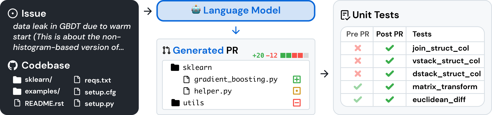
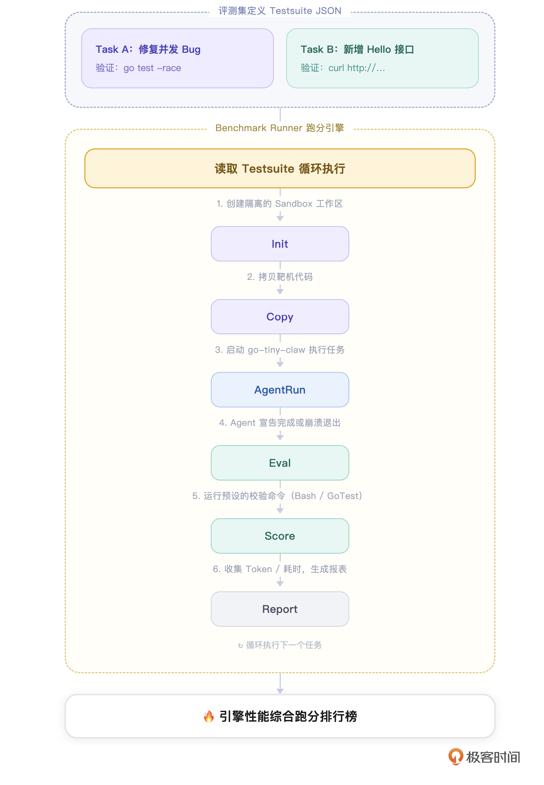

# 20｜科学度量：如何构建 Benchmark 自动化评估脚本，科学量化 Harness 引擎性能？

你好，我是 Tony Bai。欢迎来到《从0开始构建 Agent Harness》专栏的第二十讲。

在过去的 19 讲中，我们为 `go-tiny-claw` 打造了完善的基础设施。它能慢思考、能防内存溢出、能挂起审批，甚至在上一讲，我们还为它装上了“X 光机”，让你能看到它每一步运转的 Token 与耗时。

但是，作为一名严谨的架构师，你肯定会面临这样一个极其现实的考验：当你把 `Compactor` (上下文压缩器) 的阈值从 20000 字符调整到了 10000 字符；或者你在 `AGENTS.md` 里新加了一条“务必写单元测试”的规矩。 **你如何向老板证明，你的这些改动让 Agent 变“聪明”了，而不是变“笨”了？**

在传统的 Web 开发中，我们有 QPS、延迟和单元测试来衡量代码的质量与执行性能。但在充满概率与黑盒的 AI Agent 开发中，如果你只能靠“每次改完代码，去终端里跟它聊几句，看看感觉还行”这种玄学方式来测试，你的引擎永远无法走向工业级应用。

这就是顶级驾驭工程与其他开源玩具的最核心区别： **建立可被科学量化的自动评估体系（Benchmark & Evaluation）。今天，我们将通过纯 Go 语言，构建一个极其硬核但又极其简单的自动化 Benchmark 跑分框架**，让你真正体会到用“工程方法”调优 AI 的快感！

## 如何评估一个 Agent 的好坏？

评估大模型（比如测试它的成语接龙能力）很简单，你只需要比对它的纯文本输出即可。但评估一个能在操作系统里到处穿梭、修改文件的 Agent 却极其困难。因为它的输出不是文本，而是对物理世界（操作系统）产生的实际影响——即副作用。

目前业界公认的最权威的Coding Agent AI System 评测集是 **SWE-bench**，它源自普林斯顿大学的研究，通过爬取 12 个流行开源 Python 仓库的 Issue 与 Pull Request，构建了 2294 个真实软件工程任务（截止至发文时）。其评估核心逻辑可以凝练为四个字： **基于测试（Test-Driven Evaluation）**。



每个任务实例中，在未应用 Pull Request 变更的状态下，一组测试用例会失败；而在 Pull Request 合入后，同一组测试用例会通过。这些由失败转为通过（Fail-to-Pass）的测试，就是评估的核心信号。

Agent 提交的不是一段描述，而是一个可以被直接应用的 **git patch（代码差异文件）**，评估全程在隔离的 Docker 容器环境中执行，以确保结果可精确复现。一个 patch 被接受，当且仅当所有由失败转为通过的测试都翻转成功，且没有引入任何新的测试失败（即不产生回归）。

在驾驭工程中，我们不需要引入庞大的 SWE-bench 环境，但我们可以借鉴它的核心评估范式，我们同样以程序员最熟悉的修正bug的场景为例：

1. **准备靶机（Testbed）**：提供一个有明确 Bug 的代码库。

2. **设定指令（Prompt）**：告诉 Agent 有什么现象（比如运行 `main.go` 时抛出了空指针异常），让 Agent 自己去改。

3. **客观断言（Assertion）**：Agent 说自己改好了不算数。我们通过执行一段验证脚本（比如 `go test`），来判断 Agent 是否真的让原本失败的测试变为通过，且没有破坏其他测试——这正是 SWE-bench Fail-to-Pass 范式的精髓。

4. **计算综合得分**：结合我们在第 18、19 讲收集到的成本（Cost）、耗时（Duration）和轮数（Turns），给这次任务打一个综合分数。

我们可以用一张流程图来看看我们即将手写的自动化评估流水线（Evaluation Pipeline）：



通过这套自动化的跑分流水线，当你未来修改了任何引擎底层的提示词或压缩逻辑后，你只需要运行一次 `go run cmd/bench/main.go`。几分钟后，你就能拿到一份客观的数据报告，用数字决定架构的演进方向。

## 业界前沿：AI Agent 评估方法论全景

SWE-bench 奠定了 Coding Agent 评估的基石，但“如何评估 AI Agent”这个问题，在更广泛的场景下，业界正在形成一套更体系化的方法论。以下是目前最前沿的几个核心方向，感兴趣的小伙伴儿可以在课后深入了解一下。

1. 结果评估（Outcome-Based）vs 轨迹评估（Trajectory-Based）

这是当前评估领域最核心的分歧。

**结果评估** 只看最终答案对不对，类似于“考试只看最终分数”。SWE-bench 的 pass/fail 就是典型的结果评估，简单客观，易于自动化。

**轨迹评估** 则关注 Agent 走过的每一步是否合理。它会比对 Agent 实际执行的工具调用序列与标准答案中期望的序列是否一致。轨迹层面的指标能够暴露推理过程中的失败，而结果层面的指标只能验证任务是否完成。举个例子：两个 Agent 都修好了 Bug，但一个走了 3 步、另一个走了 20 步，仅看结果你无从区分优劣，只有轨迹评估才能发现这种效率差距。

2. LLM-as-Judge 与 Agent-as-Judge

对于那些没有标准答案的开放性任务（如帮我重构这段代码的可读性），测试脚本无法判断对错，于是出现了 **用 LLM 来评判 LLM** 的范式。

Agent-as-Judge 框架则将这一思路延伸到了自主 Agent 领域。它提出用一个“裁判 Agent”来评估另一个“选手 Agent”，从而实现对完整轨迹的评估，而不仅仅是最终结果。在实践中，“多 Agent 裁判”范式会让多个具备不同视角的 LLM Agent 同时担任评委，模拟多维度的人类判断，以提升评估结论的可靠性。

3. 子目标完成率

复杂任务往往不是一个简单的 pass/fail 可以衡量的。业界越来越多地采用 **分解子目标** 的方式：将一个大任务拆分为若干可独立验证的子步骤，分别打分，再加权求和。主流评估引擎会在多个粒度上同时计算指标：最终成功率、子目标完成情况、延迟、成本以及工具调用准确率。这种方式既能给出整体得分，也能精确定位 Agent 在哪个环节掉链子。

4. 持续评估与防过拟合

一个容易被忽视的问题是：当所有人都在同一个静态 Benchmark 上“卷”时，模型很容易通过记忆测试集来“虚假刷分”，而非真正具备解题能力。 [SWE-bench-Live](https://github.com/microsoft/SWE-bench-Live) 应运而生，它是一个可持续更新的动态评测集，任务全部来源于 2024 年以后产生的真实 GitHub Issue，以此规避数据污染和过拟合风险。这种“动态 Benchmark”的思路，持续引入新数据、让模型无法背答案，正在成为业界共识。

5. 与 CI/CD 流水线集成

将评估嵌入 CI/CD 流水线，已经成为让 Agent 真正走向生产可信的基础设施。每一次 Prompt 模板变更、工具函数修改或模型版本升级，都自动触发一次 Benchmark 跑分，并对比历史基线，才能真正做到"每次改动心中有数"。这也正是我们本讲要为 `go-tiny-claw` 构建自动化评估脚本的核心工程意义所在。

接下来，我们就来看看如何构建这套自动化的跑分流水线吧！

## 代码实战：构建微型 Benchmark 框架

### 目录结构回顾与更新

我们在本讲将引入一个全新的、处于系统最上层的包：internal/eval（自动化评估模块），新增 `internal/eval/benchmark.go` 来封装评估逻辑。它负责调度 engine 和 tools，并利用 observability 进行度量，它是我们测试框架的绝对中枢。同时新增一个入口 `cmd/bench/main.go`。

```plain
go-tiny-claw/
├── cmd/
│   ├── claw/
│   │   └── main.go              # CLI 入口 (保持不变)
│   └── bench/
│       └── main.go              #【新增】自动化跑分入口！
├── internal/
│   ├── observability/           # 保持不变
│   ├── eval/                    #【新增】顶层测试评估模块
│   │   └── benchmark.go         #【新增】跑分核心逻辑
│   ├── engine/                  # 保持不变
│   ├── tools/                   # 保持不变
│   ├── feishu/                  # 保持不变
│   ├── context/                 # 保持不变
│   ├── tools/                   # 保持不变
│   ├── provider/                # 保持不变
│   └── schema/                  # 保持不变
├── go.mod
└── go.sum

```

### 第 1 步：定义评测用例（TestCase）数据结构

在 `internal/eval/benchmark.go` 中，我们首先定义什么是“一个测试任务”。

```go
// internal/eval/benchmark.go
package observability

import (
    "context"
    "fmt"
    "log"
    "os"
    "os/exec"
    "time"

    ctxpkg "github.com/yourname/go-tiny-claw/internal/context"
    "github.com/yourname/go-tiny-claw/internal/engine"
    "github.com/yourname/go-tiny-claw/internal/observability"
    "github.com/yourname/go-tiny-claw/internal/provider"
    "github.com/yourname/go-tiny-claw/internal/schema"
    "github.com/yourname/go-tiny-claw/internal/tools"
)

// TestCase 定义了一个需要 Agent 去完成并验证的独立任务
type TestCase struct {
    ID             string   // 用例唯一标识
    Name           string   // 用例名称
    SetupScript    string   // 【可选】在 Agent 运行前执行的 bash 脚本 (用于初始化靶机代码)
    TaskPrompt     string   // 发送给 Agent 的任务指令
    ValidateScript string   // 【核心】在 Agent 运行结束后执行的 bash 校验脚本。exit 0 视为成功，其他视为失败
    MaxTurns       int      // 允许 Agent 尝试的最大轮数 (超时算失败)
}

// TestResult 存放单次跑分结果
type TestResult struct {
    TestCaseID   string
    Passed       bool
    TotalCostUSD float64
    DurationMs   int64
    ErrorMsg     string
}

```

注意 `ValidateScript`，这是我们摆脱“玄学评估”的锚点。Agent 吹得再天花乱坠没用，只要跑不过我们预先写好的 `bash` 验证脚本（比如去检测某个文件里是否包含了特定的字符串，或者单元测试是否通过），它就是 0 分。

### 第 2 步：实现 Benchmark Runner（跑分执行器）

接下来，我们编写执行器。它将遍历所有的 TestCase，为每一个用例分配一个干净的工作区和被 `CostTracker` 包裹的大脑，然后启动 Agent。

```go
// internal/eval/benchmark.go (续)

type BenchmarkRunner struct {
    modelName string
}

func NewBenchmarkRunner(model string) *BenchmarkRunner {
    return &BenchmarkRunner{modelName: model}
}

// RunSuite 执行一组评测集，并返回跑分报告
func (b *BenchmarkRunner) RunSuite(ctx context.Context, testcases []TestCase) {
    log.Println("==================================================")
    log.Printf("🚀 启动自动化 Harness Benchmark 评估... | 模型: %s\n", b.modelName)
    log.Println("==================================================")

    var results []TestResult
    passedCount := 0
    totalCost := 0.0

    for _, tc := range testcases {
        log.Printf("\n>>> ⏳ 正在执行用例 [%s]: %s\n", tc.ID, tc.Name)

        res := b.runSingleTest(ctx, tc)
        results = append(results, res)

        if res.Passed {
            passedCount++
            log.Printf(">>> ✅ 用例 [%s] 测试通过! | 耗时: %dms | 花费: $%.6f\n", tc.ID, res.DurationMs, res.TotalCostCNY)
        } else {
            log.Printf(">>> ❌ 用例 [%s] 测试失败! | 错误: %s\n", tc.ID, res.ErrorMsg)
        }
        totalCost += res.TotalCostCNY
    }

    // 打印终极报表
    log.Println("\n================ 🏆 跑分终极报告 ================")
    log.Printf("总用例数: %d | 成功数: %d | 成功率: %.2f%%\n", len(testcases), passedCount, float64(passedCount)/float64(len(testcases))*100)
    log.Printf("总消耗成本: $%.6f\n", totalCost)
    log.Println("==================================================")
}

func (b *BenchmarkRunner) runSingleTest(ctx context.Context, tc TestCase) TestResult {
    startTime := time.Now()

    // 1. 为每个用例创建一个绝对干净的沙箱目录 (物理隔离)
    workDir, _ := os.Getwd()
    workDir += fmt.Sprintf("/workspace/%s_%d", tc.ID, time.Now().Unix())
    _ = os.MkdirAll(workDir, 0755)

    // 2. (可选) 执行 Setup 脚本准备靶机代码
    if tc.SetupScript != "" {
        cmd := exec.Command("bash", "-c", tc.SetupScript)
        cmd.Dir = workDir
        if err := cmd.Run(); err != nil {
            return TestResult{TestCaseID: tc.ID, Passed: false, ErrorMsg: "靶机 Setup 失败"}
        }
    }

    // 3. 组装具备打点能力 (Tracker) 的引擎
    realProvider := provider.NewZhipuOpenAIProvider(b.modelName) // 使用真实的 GLM API
    session := ctxpkg.NewSession(tc.ID, workDir)                 // 为本次跑分单独建一个 Session 记账
    trackedProvider := observability.NewCostTracker(realProvider, b.modelName, session)

    registry := tools.NewRegistry()
    registry.Register(tools.NewReadFileTool(workDir))
    registry.Register(tools.NewWriteFileTool(workDir))
    registry.Register(tools.NewBashTool(workDir))
    registry.Register(tools.NewEditFileTool(workDir))

    eng := engine.NewAgentEngine(trackedProvider, registry, false, false)

    // 4. 让 Agent 开始干活
    session.Append(schema.Message{Role: schema.RoleUser, Content: tc.TaskPrompt})
    // 我们传入一个空的 reporter 屏蔽普通日志，防止刷屏
    err := eng.Run(ctx, session, nil)

    if err != nil {
        return TestResult{TestCaseID: tc.ID, Passed: false, ErrorMsg: fmt.Sprintf("Agent 崩溃: %v", err)}
    }

    // 5. 【核心断言】Agent 跑完了，我们来验收成果！
    cmd := exec.Command("bash", "-c", tc.ValidateScript)
    cmd.Dir = workDir
    out, err := cmd.CombinedOutput()

    duration := time.Since(startTime).Milliseconds()

    if err != nil {
        return TestResult{
            TestCaseID:   tc.ID,
            Passed:       false,
            TotalCostCNY: session.TotalCostCNY,
            DurationMs:   duration,
            ErrorMsg:     fmt.Sprintf("验证脚本执行失败: %s", string(out)),
        }
    }

    return TestResult{
        TestCaseID:   tc.ID,
        Passed:       true,
        TotalCostCNY: session.TotalCostCNY,
        DurationMs:   duration,
    }
}

```

注意到了吗？ **我们通过代码在机器里构建了一个“考试环境”！** 每次测试，它都会在一个全新的、隔离的 `workspace/xxx` 目录下进行。这保证了每一次跑分都是完全客观、互不干扰的。

## 运行与实战测试：给 go-tiny-claw 安排一场期末考试

引擎搭好了，现在我们要写一套评测集（Testsuite）。打开 `cmd/bench/main.go`。在这里，我们将编写两个极其经典的软件工程测试题：

1. **文本替换题**：考察 Agent 的 `edit_file` 工具是否稳定。

2. **代码分析与生成题**：考察 Agent 是否能读懂代码并按要求创建新文件。

```go
// cmd/bench/main.go
package main

import (
    "context"
    "log"
    "os"

    "github.com/yourname/go-tiny-claw/internal/eval"
)

func main() {
    if os.Getenv("ZHIPU_API_KEY") == "" {
        log.Fatal("请先导出 ZHIPU_API_KEY 环境变量进行跑分测试")
    }

    // 构建一套微型评测集
    testcases := []eval.TestCase{
        {
            ID:   "test_001_edit",
            Name: "测试模糊替换工具的准确性",
            // 准备靶机：生成一个有错误的 json 文件
            SetupScript: `echo '{"name": "tiny-claw", "version": "v1.0.0"}' > config.json`,
            // 考题：要求修改版本号
            TaskPrompt: `当前目录下有一个 config.json。请你使用 edit_file 工具，将其中的 version 从 v1.0.0 改为 v2.0.0。不要做其他多余操作。`,
            // 判卷脚本：使用 grep 检查文件是否包含 v2.0.0
            ValidateScript: `grep '"version": "v2.0.0"' config.json`,
        },
        {
            ID:   "test_002_code_gen",
            Name: "测试代码阅读与创建新文件的综合能力",
            // 准备靶机：生成一个简单的乘法函数
            SetupScript: `echo 'package math\n\nfunc Multiply(a, b int) int {\n\treturn a * b\n}' > math.go`,
            // 考题：要求 Agent 根据刚才的代码，自己去写一份单元测试
            TaskPrompt: `当前目录下有一个 math.go。请你仔细阅读它，然后在同级目录下，帮我写一个规范的单元测试文件 math_test.go，用来测试 Multiply 函数。请务必包含正常的测试用例。`,
            // 判卷脚本：直接运行 go test！如果不通过则直接 0 分。
            ValidateScript: `go mod init bench && go test -v ./...`,
        },
    }

    // 启动跑分执行器！
    // 我们选用国内极其廉价但能力不错的 glm-4.5-air 跑分，省点钱。
    runner := eval.NewBenchmarkRunner("glm-4.5-air")
    runner.RunSuite(context.Background(), testcases)
}

```

### 见证“数据驱动”的奇迹时刻

在终端中执行启动命令：

```bash
go run cmd/bench/main.go

```

喝口水，静静地看着终端里的进度日志。整个评测过程中，所有的闲杂日志都被我们屏蔽了，你看到的将是“裁判视角”的裁决：

```plain
$go run cmd/bench/main.go
2026/05/01 20:19:12 ==================================================
2026/05/01 20:19:12 🚀 启动自动化 Harness Benchmark 评估... | 模型: glm-4.5-air
2026/05/01 20:19:12 ==================================================
2026/05/01 20:19:12
>>> ⏳ 正在执行用例 [test_001_edit]: 测试模糊替换工具的准确性
2026/05/01 20:19:12 [Registry] 成功挂载工具: read_file
2026/05/01 20:19:12 [Registry] 成功挂载工具: write_file
2026/05/01 20:19:12 [Registry] 成功挂载工具: bash
2026/05/01 20:19:12 [Registry] 成功挂载工具: edit_file
2026/05/01 20:19:12 [Engine] 唤醒会话 [test_001_edit]，锁定工作区: build-agent-harness-from-scratch/part5/source/ch20/go-tiny-claw/workspace/test_001_edit_1777616352 (PlanMode: false)
2026/05/01 14:19:17 [Tracker] 📊 API 调用完成 | 耗时: 5.313421502s | 输入: 750 tk | 输出: 103 tk | 花费: ¥0.000128
2026/05/01 14:19:17 [Tracker] 💰 当前会话 (test_001_edit) 累计花费: ¥0.000128
2026/05/01 14:19:19 [Tracker] 📊 API 调用完成 | 耗时: 2.035826774s | 输入: 815 tk | 输出: 146 tk | 花费: ¥0.000144
2026/05/01 14:19:19 [Tracker] 💰 当前会话 (test_001_edit) 累计花费: ¥0.000272
2026/05/01 14:19:22 [Tracker] 📊 API 调用完成 | 耗时: 3.175982738s | 输入: 887 tk | 输出: 160 tk | 花费: ¥0.000157
2026/05/01 14:19:22 [Tracker] 💰 当前会话 (test_001_edit) 累计花费: ¥0.000429
2026/05/01 14:19:22 📊 [Tracing] 本次任务的执行回放链路已保存至工作区的 .claw/traces 目录下
2026/05/01 14:19:22 >>> ✅ 用例 [test_001_edit] 测试通过! | 耗时: 10565ms | 花费: $0.000429
2026/05/01 14:19:22
>>> ⏳ 正在执行用例 [test_002_code_gen]: 测试代码阅读与创建新文件的综合能力
2026/05/01 14:19:22 [Registry] 成功挂载工具: read_file
2026/05/01 14:19:22 [Registry] 成功挂载工具: write_file
2026/05/01 14:19:22 [Registry] 成功挂载工具: bash
2026/05/01 14:19:22 [Registry] 成功挂载工具: edit_file
2026/05/01 14:19:22 [Engine] 唤醒会话 [test_002_code_gen]，锁定工作区: build-agent-harness-from-scratch/part5/source/ch20/go-tiny-claw/workspace/test_002_code_gen_1777616362 (PlanMode: false)
2026/05/01 14:19:24 [Tracker] 📊 API 调用完成 | 耗时: 2.294828181s | 输入: 751 tk | 输出: 118 tk | 花费: ¥0.000130
2026/05/01 14:19:24 [Tracker] 💰 当前会话 (test_002_code_gen) 累计花费: ¥0.000130
2026/05/01 14:19:31 [Tracker] 📊 API 调用完成 | 耗时: 6.185434483s | 输入: 816 tk | 输出: 571 tk | 花费: ¥0.000208
2026/05/01 14:19:31 [Tracker] 💰 当前会话 (test_002_code_gen) 累计花费: ¥0.000338
2026/05/01 14:19:33 [Tracker] 📊 API 调用完成 | 耗时: 2.00786286s | 输入: 1261 tk | 输出: 38 tk | 花费: ¥0.000195
2026/05/01 14:19:33 [Tracker] 💰 当前会话 (test_002_code_gen) 累计花费: ¥0.000533
2026/05/01 14:19:34 [Tracker] 📊 API 调用完成 | 耗时: 1.564657742s | 输入: 1365 tk | 输出: 20 tk | 花费: ¥0.000208
2026/05/01 14:19:34 [Tracker] 💰 当前会话 (test_002_code_gen) 累计花费: ¥0.000741
2026/05/01 14:19:36 [Tracker] 📊 API 调用完成 | 耗时: 1.804823601s | 输入: 1792 tk | 输出: 90 tk | 花费: ¥0.000282
2026/05/01 14:19:36 [Tracker] 💰 当前会话 (test_002_code_gen) 累计花费: ¥0.001023
2026/05/01 14:19:37 [Tracker] 📊 API 调用完成 | 耗时: 920.88596ms | 输入: 1898 tk | 输出: 20 tk | 花费: ¥0.000288
2026/05/01 14:19:37 [Tracker] 💰 当前会话 (test_002_code_gen) 累计花费: ¥0.001311
2026/05/01 14:19:40 [Tracker] 📊 API 调用完成 | 耗时: 1.037956742s | 输入: 2051 tk | 输出: 38 tk | 花费: ¥0.000313
2026/05/01 14:19:40 [Tracker] 💰 当前会话 (test_002_code_gen) 累计花费: ¥0.001624
2026/05/01 14:19:42 [Tracker] 📊 API 调用完成 | 耗时: 1.685212028s | 输入: 2115 tk | 输出: 77 tk | 花费: ¥0.000329
2026/05/01 14:19:42 [Tracker] 💰 当前会话 (test_002_code_gen) 累计花费: ¥0.001953
2026/05/01 14:19:43 [Tracker] 📊 API 调用完成 | 耗时: 852.749339ms | 输入: 2207 tk | 输出: 20 tk | 花费: ¥0.000334
2026/05/01 14:19:43 [Tracker] 💰 当前会话 (test_002_code_gen) 累计花费: ¥0.002287
2026/05/01 14:19:47 [Tracker] 📊 API 调用完成 | 耗时: 3.389124446s | 输入: 2486 tk | 输出: 185 tk | 花费: ¥0.000401
2026/05/01 14:19:47 [Tracker] 💰 当前会话 (test_002_code_gen) 累计花费: ¥0.002688
2026/05/01 14:19:47 📊 [Tracing] 本次任务的执行回放链路已保存至工作区的 .claw/traces 目录下
2026/05/01 14:19:48 >>> ✅ 用例 [test_002_code_gen] 测试通过! | 耗时: 25605ms | 花费: $0.002688
2026/05/01 14:19:48
================ 🏆 跑分终极报告 ================
2026/05/01 14:19:48 总用例数: 2 | 成功数: 2 | 成功率: 100.00%
2026/05/01 14:19:48 总消耗成本: $0.003117
2026/05/01 14:19:48 ==================================================

```

漂亮！在这个短短的几十秒钟内， `go-tiny-claw` 分别在两个完全隔离的沙箱目录下，自主探索并成功完成了 JSON 修改和 Go 单元测试的编写。

更重要的是，这两次成功不是它自己吹的，而是被严格的 `grep` 和 `go test` 脚本硬性校验通过的！并且，这略复杂的两个动作，只花了很少的的成本。

## 本讲小结

今天，我们在驾驭工程的基础上插了一面叫做“科学度量”的旗帜。

1. **从“玄学”到“工程学”**：我们不再依靠在对话框里凭感觉测试 Agent。通过构建自动化的 Benchmark 跑分框架，我们把大模型这种充满概率的黑盒，拉入了软件工程的确定性范畴。

2. **Test-Driven Evaluation（测试驱动评估）**：在编写 `TestCase` 时，我们通过注入 `SetupScript` 初始化靶机状态，通过 `ValidateScript` (如 `go test`) 执行硬核验收。这排除了大模型擅长“花言巧语伪装”的幻觉干扰，只看最终物理世界是否被正确改变。

3. **驱动底层架构进化**：有了这个跑分框架后。以后你再想修改 [第 12 讲](https://time.geekbang.org/column/article/977397) 里的 `Compactor` 阈值，或者修改 [第 7 讲](https://time.geekbang.org/column/article/970299) 的 `Fuzzy Edit` 正则算法。你只需要跑一次 Benchmark。如果成功率从 100% 掉到了 50%，那就说明你的代码改烂了，立刻回滚！数据驱动，这才是顶级架构师底气十足的原因。

至此，《从零开始构建 Agent Harness》所有关于内核机制、内存管理、稳定性拦截以及性能评估的“内功心法”，已经全部讲解完毕。

在最后剩下的两讲（第 21 和 22 讲）中，我们将迎来令人热血沸腾的 **端到端实战串讲** 大结局。

我们将运用之前 20 讲打造的所有神兵利器，不写一行 Mock 代码，真刀真枪地完成两次工业级的演示：一次是对大型未知项目源码的逆向破解与 Bug 修复；另一次，则是将我们的引擎打包成飞书机器人，在真实的群聊中应对“险象环生”的运维排障挑战！

> 注：本讲的示例代码，可以在 [这里](https://github.com/bigwhite/publication/tree/master/column/timegeek/build-agent-harness-from-scratch/ch20) 下载。

## 思考题

在当前的 Benchmark Runner 中，如果某个任务非常复杂（例如：重构 10 个代码文件），大模型在我们的 `go-tiny-claw` 引擎中可能会发生 20 个 Turn 的循环交互，然后才完成任务。如果在这期间，它有一次 `bash` 敲错了命令（比如漏了一个路径斜杠），触发了底层报错。但得益于我们在 [第 14 讲](https://time.geekbang.org/column/article/978759) 中写的 Error Recovery 机制，它在下一轮自己纠正了错误，并最终通过了 `ValidateScript`。

对于这种“中途摔了一跤，但最终依然完成任务”的情况，我们目前的计分板只是简单地标记为 `Passed: true`。但在极其苛刻的性能调优（Performance Tuning）中，“一发入魂完成”和“重试了 5 次才完成”，其对系统架构（Prompt、工具设计）好坏的评判价值是完全不同的。

基于我们之前在第 18 讲（Cost Tracker）和第 19 讲（Tracing 链路追踪）中沉淀的数据收集能力，如果让你在跑分的 `TestResult` 结构体中，增加两个能够精准度量这种“试错成本”或“驾驭顺滑度”的新指标，你会添加哪两个关键指标？为什么？

欢迎在留言区分享你的高阶数据分析思路。我们下一讲，开启最终的实战串讲！
