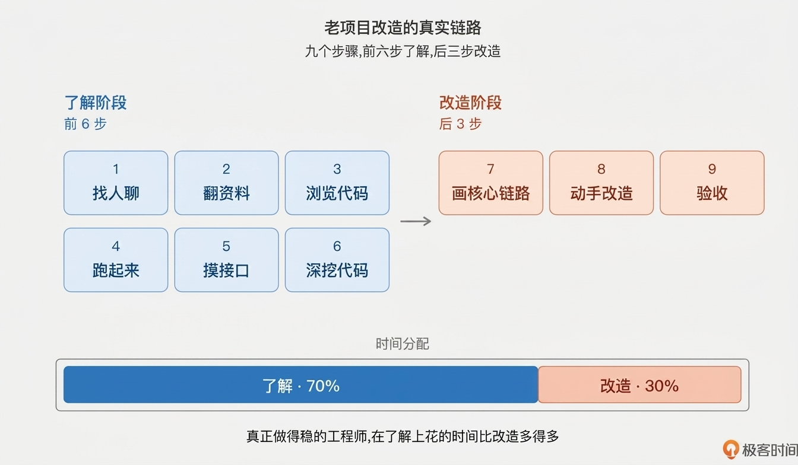
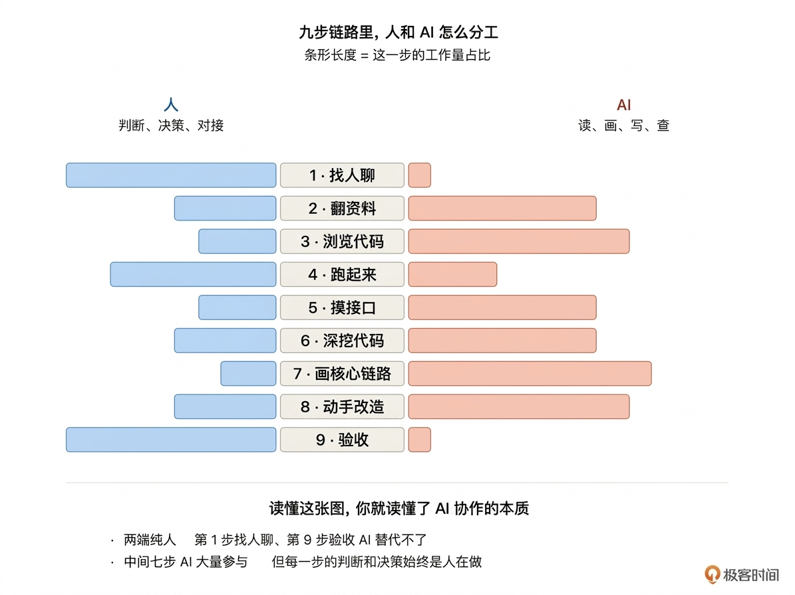
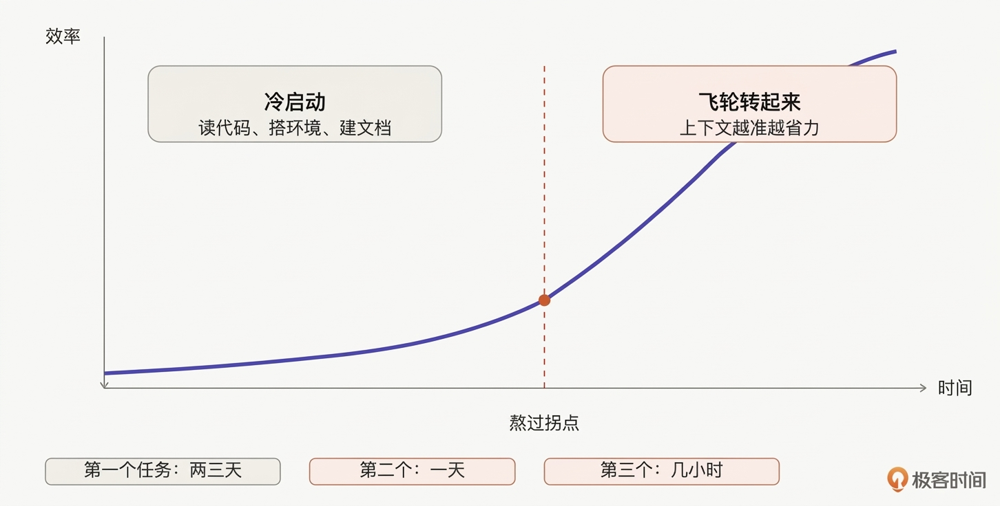

# 01｜老项目改造的真实链路：从接手到交付，人到底做了什么？

**作者：Robert**

🎧 **文章音频**: [🎧 点击播放：_assets/974062.mp3]

> 把 AI 来之前，人接手一个老项目的真实链路，从头到尾讲一遍。

你好，我是 Robert。

从这一讲开始我们正式进入课程。第一部分的 5 讲是方法论基础。这一部分不讲工具怎么用，不讲提示词怎么写，目的是把认知底座打好。学完这五讲，你应该获得三件东西：**一个正确的 AI 协作心智、一张工具地图、一套判断力框架**。接下来的课程内容，全部在这个底座上展开。

好，我们从 01 开始。这门课要回答的问题是：**面对你公司里那个跑了几年的老项目，怎么用好 Claude Code 改它？**

要回答这个问题，我想先带你回到一个更基础的问题：AI 来之前，我们是怎么接手一个老项目的？这个问题听起来有点傻。你可能会想，接手老项目不就是读代码、跑起来、改 bug、上线嘛，有什么好讲的。但我发现很多人用 Claude Code 用得不顺，根源就在这里：**他们在 AI 时代跳过了那些看似傻但其实关键的步骤，结果传递给 AI 的上下文是空的，改完之后自己也没法判断对不对**。

所以这一讲我想做一件事：**把 AI 来之前，人接手一个老项目的真实链路，从头到尾讲一遍**。这条链路 AI 没有推翻，只是改变了每一步的分工。链路清楚了，后面我们讲 AI 怎么进来、哪些步骤变了、哪些没变，才有参照系。

## 一个真实的场景

想象下这样一个场景：

> 某天 leader 走过来，指着一个 GitLab 仓库说：“老张走之前维护的 xxx-scheduler，你接一下，下周一上线一个批处理任务。”  
> 老张是上个季度离职的。这个项目部门里几个核心业务都靠它跑，公司早期几位资深工程师好多年前写的，后来换了几拨维护者，也没人完整梳理过技术资料。

打开 README，几行部署命令加一张架构图，看两遍感觉像懂了又没懂。接着翻代码，Java + Spring Boot + MyBatis，每个类都很长，散落着各种注释。有的写着“2020-08 临时方案，等下个版本重构”，下个版本是哪个版本没说。翻到一段业务逻辑写着“// 不要删，某某对接方需要”，某某对接方是谁？删了会出什么事？代码没说。再往下是一段注释掉的代码：“// 2021-11 回滚原因:影响某个对接方的 PR 流程”。

去问 leader，文档没有，历史背景老张应该清楚，但他入职新公司了，估计不方便联系。一下午就这么过去了，一行代码都没写。

## 你可能遇到过类似的场景

这个故事你可能觉得熟悉。不一定是 xxx-scheduler，可能是公司里那个跑了三五年的订单系统、那个谁也说不清历史的交易中台、那个每次发版都要提前拉全部门开评审会的核心服务。**老项目最难的不是代码本身，是代码之外的那些东西**。

是那些“不要删”的注释，是那些早已离职、再也问不到的前辈，是那些每次你想动它、都不敢动的隐性约定，是那些六年前的设计决策，当时可能是对的，今天看起来像炸药……

这些东西代码里没写，也不会写。因为写它们的人觉得“这都是常识”。离职时也不会留下来，因为谁也说不清。**这才是老项目改造的真实起点**。

## 面对这样的场景，人本来会怎么做

假设你是那个接手项目的人，不急着写代码，而是先想办法了解它，通常会这么走。

**第一件事，找人聊**。

把项目里看到的疑点列一个清单，去问身边还在这个项目周边工作过的同事。问产品，问隔壁组的架构师，问运维。每个人知道一点，拼起来至少能搞清楚“某某对接方”是谁、“2021-11 回滚”背后发生了什么。有些问题问不到答案，标记“未知”，先搁置。

**第二件事，把能找到的资料都翻一遍**。

README、仓库里的 docs 目录、wiki、Confluence 里的旧设计文档、企微里的历史群聊记录、jira 里相关的 epic。不是要全部搞懂，是要把手头所有线索都扫一遍，有个整体的感觉。

**第三件事，clone 项目，浏览一遍代码**。

不是从第一行读到最后一行，是看结构。有哪些模块？哪些是核心？哪些是工具类？哪些看起来是很久没人动过的老代码？哪些看起来是最近还在改的？脑子里画一张粗糙的地图。

**第四件事，搭起开发环境，把项目跑起来**。

这一步出奇的难。依赖 MySQL 版本有要求、Redis 的 key 格式需要特定配置、有一个对接的内部服务需要 VPN，可能要折腾一整天。但跑起来的那一刻心里就有底了，能用 debug 模式断点、能看到真实的数据流向、能观察请求进来之后的完整链路。

**第五件事，用 curl 访问几个核心接口**。

不是为了测业务，是为了验证项目确实跑通了、能看到输入输出、能复现问题。接口通了之后，才敢说“初步了解这个项目了”。

**第六件事，带着疑点深挖代码**。

前面梳理时留下的那些“未知”标记，现在带着具体的问题去翻代码。某个业务分支是什么时候加的？谁在调用这段逻辑？有没有类似功能的调用链路？这时候代码读起来不一样了，每一处都带着上下文在读。

**第七件事，画出核心链路**。

几张粗糙的手绘图。主流程从入口到出口、核心数据表之间的关系、依赖的外部服务。画完之后，整个项目才算在脑子里立起来。

**第八件事，开始动手改那个批处理任务**。

改的时候也不是一口气改完。先小改一处、跑通、看结果、确认没有副作用，再改下一处。每一步都带着前面建立的那份地图。

**第九件事，改完了做验收**。

curl 接口看主流程没有被破坏、跑了几个相关的业务场景、找人 review。然后才敢说“这个改造做完了”。

顺序可能微调，但这九件事一件都少不了。总结一下：

这就是老项目改造的原始链路。这个链路不是谁发明的。工作几年、接过几个老项目，或多或少都会走到这里。区别只是你没把它写下来，或者没意识到它是一个可以复用的模式。

真正重要的是一个比例。**九步里，前六步都是了解项目，只有后三步是改造。70% 的时间花在理解上，30% 的时间才是动手**。这个比例和很多人的直觉是反的。大部分人接手新项目，恨不得第一天就开始改代码。真正做得稳的工程师，反而在了解上花了更多时间。

## 为什么这件事对 AI 协作特别关键

说到这儿，你可能已经开始嗅到一些味道。AI 没有改变这条链路，**但它把每一步里人和 AI 的分工打乱了**。

在传统的流程里，这九步全部是人在做。有些步骤慢（比如画核心链路）、有些步骤繁琐（比如梳理接口）、有些步骤需要耐心（比如读一个陌生的业务分支），但都是人的事。

Claude Code 进来以后，每一步都在被重新分配。读 README 这种事，AI 一次能给你出个漂亮的摘要。画架构图这种事，AI 可以扫完整个仓库给你出一份 Mermaid。梳理接口清单这种事，AI 比你手动翻快十倍。

但也有一些事 AI 帮不上。比如“某某对接方是谁”，代码里没写的事 AI 说不出来。比如“这段逻辑删了会出什么事”，AI 只能猜，不能承担责任。比如“最终这个改造要不要上线”，这是人的决策，不是 AI 的。

**所以用 Claude Code 用得好的工程师，其实就是在这条九步链路上，把人和 AI 的分工搞清楚的工程师**。

他们知道哪一步让 AI 冲在前面、哪一步自己必须守住、哪一步需要和 AI 来回确认。这种分工不是 AI 天生就会的，是经过一段磨合才建立起来的。

**这门课要做的，就是帮你把这段磨合时间压缩到最短**。开篇词里我说过，差的不是 AI，差的是用法，大部分人还没把这个体系摸出来。这门课就是把我这两年用过的提示词、走过的工作流、踩过的坑，系统讲一遍。

## 为什么“前六步”特别容易被跳过

我接触过不少在老项目上用 Claude Code 用得不顺的工程师，共同的问题是同一个。

**他们跳过了前六步**。

具体表现是这样。项目刚拿到手，他们第一件事就是打开 Claude Code，贴一段代码问“这个项目是做什么的”。Claude Code 当然能回答，但回答得浅。然后他们拿着这个浅层的认知，直接让 Claude Code 开始改代码。改完后跑不通，或者跑通了但没达到预期，或者看起来达到了但上线就炸了。然后他们回过头来怪 Claude Code：“这玩意真没法用。”

**但问题不在 Claude Code，问题在于没有前六步打底，AI 就是瞎的**。它不知道这个项目有什么坑、哪段代码动不得、哪些历史约定存在。这些东西你不告诉它，它就永远看不见。

反过来，如果你扎扎实实把前六步做完，把了解到的东西整理成文档，然后把这些文档交给 Claude Code，它的表现会完全不同。它会基于你提供的上下文做判断，它给的方案会贴合这个项目的实际情况，它改的代码会知道哪些地方要绕开。

这就是为什么这一讲我要花大篇幅讲“人原本是怎么做的”。**因为 AI 时代，这些步骤一步不能少，只是每一步人和 AI 的分工变了**。

具体怎么变，下一讲我们展开。

## 冷启动慢，飞轮转起来就快

这一讲的最后，我想再说一件事，算是给你一个心理预期。

开篇词里我说过，改造一个跑了几年的老项目，像推动一辆满载的大卡车。**冷启动永远慢。**这一讲讲的九步链路，就是冷启动那一段。你要先找人聊、翻资料、读代码、搭环境、跑起来、摸接口、画链路。这一通操作下来可能要一两天甚至一两周。这段时间你感觉什么都没产出，心里容易焦虑。

**这种焦虑很正常，但你要知道，这不是浪费时间，是投资**。做完冷启动之后，你会进入一个飞轮。

你对项目的理解越深，后续的改造越轻松。你积累的文档越厚，下次打开代码时的心智成本越低。你和 AI 协作时提供的上下文越准，AI 给的方案越贴合。

第一个改造任务可能要磨两三天，第二个可能一天，第三个几小时就搞定。老项目改造的核心心法就一句话：**熬过冷启动**。熬过去了，后面全是复利。

## 小结

这一讲我讲了一件事：**老项目改造的真实链路**。九个步骤，从了解到改造，从头到尾。AI 没有推翻这条链路，只是改变了每一步里人和 AI 的分工。

记住那个比例：**70% 的时间花在了解上，30% 的时间才是动手**。这个比例和直觉相反，但它决定了你和 AI 协作能不能稳。

记住那个心态：**熬过冷启动**。老项目改造不存在一口吃成胖子，但只要熬过起步阶段，后面越来越轻松。

这一讲还没讲到 Claude Code 具体怎么用。我希望你先理解那条人的原始链路，后面讲 AI 怎么进来、哪一步帮你做 80%、哪一步帮你做 30%、哪一步几乎插不上手，你才能对上焦。在你那个跑了三五年的老系统上，一步一步把自己的节奏跑出来。这个节奏建立起来之后，那个老项目就不再是负担，它会变成你最熟悉的工作对象。

## 思考题

1. 回想你上一次接手一个老项目，大致是怎么做的？和我讲的九步相比，你跳过了哪几步？跳过的那几步，事后给你带来了什么问题？
2. 你现在手里正在维护或改造的那个项目，如果让你把“代码之外的那些东西”（隐性约定、历史原因、对接方细节）写下来，你能写多少？这些东西有没有写进项目的文档？如果没有，它们目前存在哪儿？

欢迎在评论区把你的答案写出来。如果今天的课程让你有所收获，也欢迎转发给有需要的朋友，邀请他来一起学习，我们下节课再见！

---

## 精选评论

**重来**: 0、这两年接手了 两个老项目，第一个用了3月稳定了，第二个用了一年，老项目最恶心的就是 接手的人很多，一个项目可能有5、6个研发接手过。领导让你做老项目会带有想让你优化的出发点，你是要考虑到位的。
1、步骤和你说基本一致，当然我在做的时候没有想步骤，就是凭经验。找人聊非常关键，对于代码中的点，任何细节不能放过，追问为啥之前这么写，研发不知道就去问产品，产品不知道就让产品评估还要不要，变相逼着产品跟你一起熟悉项目承担风险，这期间有很多人的沟通，成本不低，也会发现很多可有可无的代码，这个阶段你是不敢动代码的。
3、跑起来是让我能心里踏实的关键因素吧，没有跑起来的项目一点可信度都没有，需要有并行，我在重构的时候并不负责交付，所以可以做对比，这点上心理压力会小。
4、跑起来后，才能去查问题，深度看代码，优化 分层 重构。
5、阶段性的产出报告，如某一个模块的依赖图，重构后的依赖关系，看代码要带着目的，带着你想要调整什么的目的。
6、我觉得脑子里的关系图远比文档中要的多，如果我脑子里面没有概览，我不敢下手，AI时代让我有点动脑变少了，落地文档不是我的知识。
7、最后就是 验收的本质就是死缠烂打，踩坑是必不可少的，甚至出问题是好事，能让你专注去深入地理解项目，带着问题去看代码，比为了了解而去看代码有用太多了。
8、最后提一个问题老师：也属于偏个人情况，老项目会涉及到技术壁垒问题。在ai的现代发展下，公司会让你去做不属于你领域的工作，·如让一个数据开发去写前后端代码·，这个路子我走过，也走通了，但是苦难很多，因为我以前的经验不可用了，以前的项目我起码能看的明白代码，现在的项目我看不明白，我会缺失前几步的流程，判断能力下降。当然我也不是完全不懂代码，只是关于技术壁垒上隐性知识和判断能力下降。如何接手一个领域有偏差的项目呢？

> **作者回复**: 感谢分享🌹🌹。
> 0～7我都特别同意。特别是7，老项目改造AI对我们来说是加速不是替代。AI生成基准的材料后，需要人去校准、跑起来、修改、才敢放心用。所以老项目改造效率很重要，但不是最高优先级，“改好”才是第一优先级。
> “如何接手一个领域有偏差的项目呢” 这点我的答案其实和你说的第七点一样。死磕
> 
> 我不认为数据开发写不了前后端代码，在实际的工作中，数据开发写前后端太常见了。也是日常的工作。所以不理解就去学，死磕。我理解没其他好办法。而且死磕我觉得是一个很好的素养。
> 
> 另外AI时代，知识的提炼总结很快了。所以跨领域开发成本降低了很多。比如按照课程后续的内容去理解项目，然后让AI总结一些系统的知识学习，一套积累下来，我觉得是可以做好的。 
> 
> 判断力是养出来的，只能靠时间。但是AI可以帮我们加速这个时间，加速了解项目，帮我们分析我们理解不对的地方，帮我们找出bug。
> 
> 我理解经过几轮的这种跨领域，你的经验和感觉就有了。所以应该问题不大。

---

**yphust**: 磨刀不误砍柴工，现实情况是你入职就要你干活产出

> **作者回复**: 所以其实有CC辅助，可以花少量的时间，去做那些边界不明，以前苦活累活的事情。
> 在日常工作中，能够多做边界不明、以前觉得投入ROI不高又很重要的事情，其实对自己，对团队的好处很多。
> 我个人的体感是，在AI的辅助下，可以多做这类的事情，其实现实意义对绩效、个人价值的作用其实挺大的。
> 因为你花了不高的成本给团队带来了大的价值（脏活累活不是不重要，而是投入ROI不高，所以大家忍者。但是用了AI，ROI就高了。）

---

**孟晴晨**: 曾经接过一个前端大型项目，那时候AI还没普及，几乎全靠人工完成。先是翻资料看代码，把疑惑点专门整理了一个清单，找项目老前辈去聊，后面成功跑通项目，接着对现有功能进行小修改，摸清套路，最后才开始写需求。从投入项目到第1个MR提交，花了一个多月时间，其中前期准备工作有两周多。

> **作者回复**: 是的，AI的出现其实就是压缩我们了解老项目的时间，这块蛮重要的。 是加速不是替代。
> 
> 替我梳理接口、替我画图、替我整理schema、生成sql文档说明。帮我梳理以来，启动项目。好多脏活累活替我干，我只要reveiw、补充，校准。
> 
> 这块效率提升很多。我基本都这么干，AI 用顺手了，人都轻松了。

---

**Geek_055a06**: 那么这里我有一个问题，找人聊这一个步骤，有没有可能我把AI当成一个新入职的员工让他来找我聊，我负责答疑，关键的问题是，我不清楚怎么能让AI提问的好，到底哪些属于疑点，要看到什么程度，现在不会有人入职直接咔咔看代码了吧

> **作者回复**: ”让他来找我聊，我负责答疑“ 这是第二步了。我们要先给这个”新入职的员工“ 先大概讲一下，然后他自己去理解去看。看完后再你找你聊，你负责答疑。才是合理的流程。这样效率也最高。

---

**欧尔佳凯尔**: 如果找不到人聊，也没有相关的项目文档。是不是可以让cc基于项目代码本身去学习去熟悉呢？ 

> **作者回复**: 是的，你可以往下看，我的思路是让cc生成第一个版本，准确率可能只有60%（举例的），然后靠人来补充、修正。但实践下来，多维度下来，准确率在我的经验中能到70+%

---

**欧尔佳凯尔**: 如果找不到人聊，或者没有相关的文档，可否让cc基于代码先去学习理解这个项目呢？

> **作者回复**: 是的，你可以往下看，我的思路是让cc生成第一个版本，准确率可能只有60%（举例的），然后靠人来补充、修正。但实践下来，多维度下来，准确率在我的经验中能到70+%

---

**Geek_055a06**: 如果是刚入职的新人，对于业务需求不理解，项目又是跑了五六年的项目，要如何怎么借助AI去理解需求，以前需求文档不一定有，负责的人员都换了，没有人可以问

> **作者回复**: 你可以往下看哈～。看后面的内容是不是你要的。我理解是的。我也是用这一套去理解这个项目的。

---

**聪少 Jeff**: 确实要先了解一下之前项目的情况才能知道未来的方向

> **作者回复**: 是的，不管项目多复杂，业务逻辑是什么。老项目改造的第一步一定是先了解项目。只有了解了才能开始下一步。

---

**Leo**: 大佬有微信群可以加吗？

> **作者回复**: 已经有了哈，欢迎加群讨论～～～🌹🌹

---

**欧尔佳凯尔**: 如果找不到人聊，也没有相关的项目文档。是不是可以让cc基于项目代码本身去学习去熟悉呢？ 

