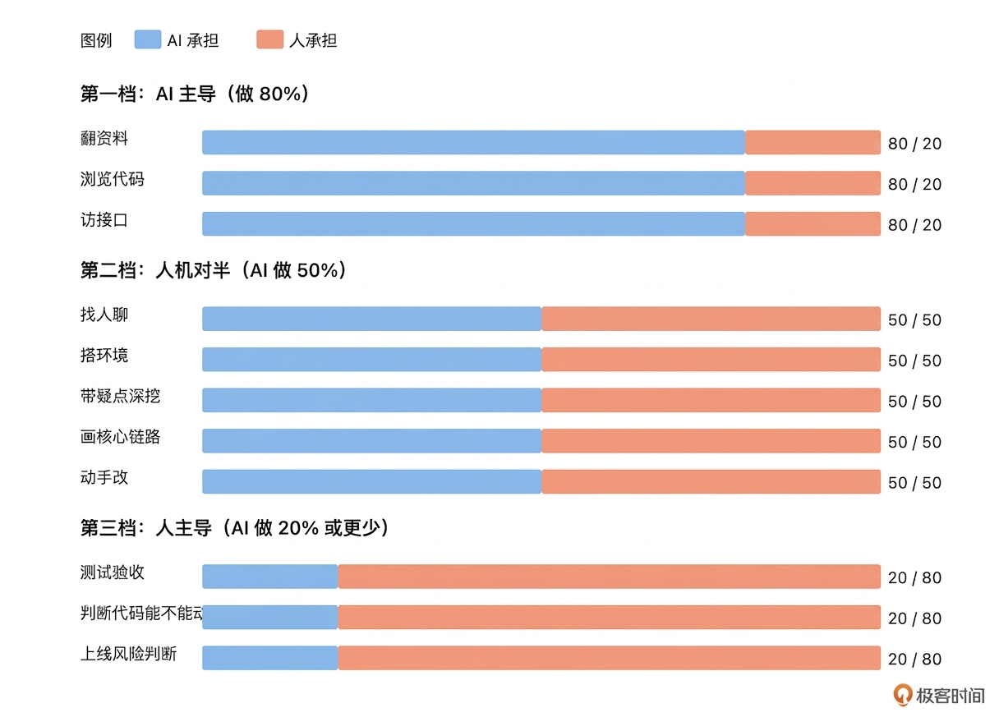

# 02｜Claude Code 进来后：哪一步变了，哪一步没变？

**作者：Robert**

🎧 **文章音频**: [🎧 点击播放：_assets/974095.mp3]

> 20% 的盲区，经常就是 100% 的事故。AI 做不到的那 20%，你不主动补，它就是 0。

你好，我是 Robert。

上一讲讲了九步真实链路。学完那一讲你可能会想：**链路是清楚了，那 AI 进来之后，每一步我到底该让它做多少、自己守多少？**这一讲就回答这个问题。

读完这一讲，你会获得一张人机分工图。面对任何一个陌生老项目的任何一步，你都能快速判断：这一步应该让 Claude Code 冲在前面，还是应该自己在前头、AI 辅助。

## 分工别搞错了

先澄清一件事，**分工不是“会不会用 AI”，是“什么时候用、用多少”**。很多人用 Claude Code 用得不顺，不是他们不会用，是分工搞错了。具体有两种典型错误：

一种是**过度依赖：**把 AI 当成一个什么都能干的外包。项目拿到手第一件事就让 AI 改代码，出了问题再怪 AI 不靠谱。这种用法的本质是把 AI 当成“能自动理解项目的开发者”，但开篇词里我说过，AI 是上下文缺失的实习生，你不传递，它就是瞎的。

另一种是**过度保守：**AI 能做的事也不让它做。还在一行一行手动读 README、手动画架构图、手动数接口。最后确实改得稳，但速度慢到没有优势，等于白用了工具。

真正稳的工程师在这两端之间找平衡。他们对九步链路里每一步都有清晰的认知：哪一步 AI 冲在前面，哪一步自己在前头、AI 辅助。这一讲把这张图给你。把 01 讲的九步拿出来，按 AI 能承担的比例归成三档。

### 第一档：AI 主导，做 80%

这一档的共同点是：**内容都写在代码或公开文档里，AI 能直接读到**。

* 翻资料（第 2 步）：AI 读 README、wiki、Confluence、jira 比你快十倍
* 浏览代码结构（第 3 步）：让 AI 扫一遍仓库，生成一张模块图、数据流图
* 访接口（第 5 步）：让 AI 从代码里梳理出所有接口清单 + curl 示例

这几步你基本可以放手。让 AI 做初稿，你花几分钟校一眼。有问题就让它“把这个地方再细化一下”，没问题就往下走。

### 第二档：人机对半，AI 做 50%

这一档的共同点是：**AI 能做一半，但另一半需要人的判断或人脉**。

* 找人聊（第 1 步）：AI 能帮你整理疑点清单、草拟要问的问题，但去问谁、怎么问、怎么把答案串起来，是你的事
* 搭环境跑起来（第 4 步）：AI 能帮你写启动脚本、调依赖版本，但公司内部的 VPN、数据库授权、服务调通，多数情况下 AI 不知道
* 带疑点深挖（第 6 步）：AI 能扫描代码给你找调用链路，但“这段逻辑为什么这样写”的答案经常只有问到人才能得到
* 画核心链路（第 7 步）：AI 能给你出一张不错的 Mermaid 图，但关键的业务约定、历史坑点要靠你补进去
* 动手改（第 8 步）：AI 能把你描述的改造写成代码、写测试，但“方案 A 还是 B”、“这段要不要重构”、“边界条件怎么处理”这些决策是你要做的

这一档是大家最常遇到的情况，因为老项目里很少有一点信息都读不到的情况。所以整门课大部分内容会围绕这一档展开。讲你和 AI 怎么配合、提示词怎么写、什么时候该打断它、什么时候该让它继续。

### 第三档：人主导，AI 做 20% 或更少

这一档的共同点是：**答案不在代码里，在人的脑子里或工程判断里**。

* 判断哪些代码不能动：像 01 讲那个“// 不要删，某某对接方需要”的注释，AI 看不出它背后意味着什么，只有经历过那次 incident 的人知道
* 判断对接方是谁、对接方的诉求变了没有：AI 可能猜得到对接方叫什么，但猜不到最近有没有人改动他们的调用
* 最终验收（第 9 步）：跑了几个业务场景、看了主流程、找人 review，这件事 AI 能帮你列 checklist，但“按下上线按钮”这个动作必须是你来做
* 上线前的风险判断：对回滚成本、灰度方案、影响面的判断，AI 能给参考，但决策权在你

这一档要的不是更强的 AI，是更清醒的你。

## 最危险的情况是什么

在我看来，最危险的情况是：**AI 做了 80% 后，你却把剩下的 20% 当成 0，当个甩手掌柜**。现在给你一个更具体的场景，感受一下三档分工有多重要。

回到 01 讲那个接手 xxx-scheduler 的场景。假设这次不是人在干，是有 AI 辅助的版本。把仓库给 Claude Code，让它帮忙读 README、梳理代码结构、数接口、列数据表。AI 做得很快、很好，半小时之内就拿到了一份相当完整的项目摘要。

看着那份摘要，你觉得自己已经懂这个项目了。接下来让 AI 改那个批处理任务。AI 基于它读到的那份上下文，给你一个看起来合理的方案。改完跑通了，测试也过了。

然后上线，炸了。炸的是那段“// 不要删，某某对接方需要”的逻辑。

问题在哪里？不在 AI 的 80%。AI 在第一档那些步骤上做得都挺好，摘要也完整、代码也干净。问题在于忘了还有 20% 没被覆盖。**那 20% 是 AI 根本读不到的历史、默契、隐性约定**。

用 AI 用得不好的工程师最常见的错误，就是把 80% 的完成度当成 100% 的完成度。

1. AI 读完 README，你以为项目就懂了。但 README 里没写的那些事，AI 也不知道。
2. AI 画完架构图，你以为全貌都在手里了。但那几个“曾经踩过的坑”不会出现在架构图上。
3. AI 写完代码，你以为改造就做完了。但“这段上线后会不会影响另一个对接方”这件事，AI 给不了答案。

**AI 覆盖不了的那 20%，如果你不主动去补，它就是 0。20% 的盲区，经常就是 100% 的事故**。

## 那 20% 就是你的位置

说到这儿，你应该能感觉到这门课要教的是什么了。**不是教你怎么让 AI 做 100% 的事**。这做不到，也不应该追求。**是教你怎么把能交给 AI 的 80% 稳定交出去，同时把那 20% 自己守住**。

这件事说起来简单，做起来要分成几件事。

1. **你要知道哪些步骤属于哪一档**。这张分工图要内化成你的本能。拿到任何一个新老项目、任何一个改造需求，你能瞬间判断：这一步 AI 冲在前面，那一步我要自己在前头、AI 辅助。
2. **第一档和第二档要快**。AI 能做的事就让它做，别慢吞吞。不放手，AI 就没有价值。很多人用 Claude Code 用不出效率就是卡在这里。
3. **第三档要稳**。该你判断的时候别想偷懒，别问 AI “你觉得呢”。你问 AI 它一定有答案，但那个答案没有承担责任，最后出事还是你的事。
4. **每一档之间的衔接要清晰**。AI 做完初稿，什么时候该你接过来验？验完之后，什么时候再让 AI 继续？这个节奏是整门课最想教会你的事。后面的课程都在讲这件事。

## AI 改变的不是链路，是节奏

最后想跟你说一件事。AI 没有改变九步链路本身，你该找人聊还得找人聊，该搭环境还得搭环境，该判断风险还得你判断，**但 AI 改变了节奏**。没有 AI 的时候，你读 README 要一小时，梳理接口要一下午，画架构图要一整天。整个了解阶段要一到两周。

有了 AI，这些步骤都能压缩到以分钟为单位。一个大周期下来，可能半天就进入改造阶段了。这是 AI 真正的价值：**不是替代人，是把人从低信息含量的工作里解放出来，去做那些真正需要人的事**。

那些真正需要人的事是什么？就是第二档里你要做的那些判断、第三档里你要守的那些边界。AI 能做的事你交出去，节省下来的时间就能用在第三档上。你对项目理解更深，你对边界更清醒，你给 AI 的上下文更准，这是一个正循环。

不会用 AI 的工程师，是把所有时间都花在第一档那些事上，累死累活也谈不上效率。用错 AI 的工程师，是让 AI 把第一、第二、第三档都一起做了，出事再回头。**用对 AI 的工程师，是把第一档的速度和第三档的稳当都兼顾住**。这门课就是要把你训练成用对 AI 的工程师。

## 小结

这一讲给了你一张人机分工图。

九步链路按 AI 能承担的比例分三档。

第一档 AI 主导做 80%，翻资料、浏览代码结构、访接口都在这里，放手让 AI 做就行。

第二档人机对半 AI 做 50%，找人聊、搭环境、深挖、画链路、动手改都在这里，整门课大部分功夫花在这一档。

第三档人主导 AI 做 20% 或更少，判断代码能不能动、对接方是谁、最终验收、上线风险识别都在这里。

记住那句话：**20% 的盲区，经常就是 100% 的事故**。AI 做不到的那 20%，你不主动补，它就是 0。

下一讲我们展开三层控制：理解、约束、验证。光有分工图还不够，要让 AI 在第一档和第二档里真正可信地帮你干活，还需要一套让它不乱来的框架。

## 思考题

1. 拿你手上正在维护的那个项目，按九步走一遍。对照每一步，写一写：如果现在让 Claude Code 做，它能做多少？剩下的是什么？剩下的那部分目前存在哪儿？(你脑子里？文档里？某个同事的脑子里？)
2. 回想你最近一次用 Claude Code 改老项目的经历，如果改造结果有问题，问题发生在九步里的哪一步？那一步你把它归为哪一档？归错档了没？

欢迎在评论区把你的答案写出来。如果今天的课程让你有所收获，也欢迎转发给有需要的朋友，邀请他来一起学习，我们下节课再见！

---

## 精选评论

**西蒙**: 在原来老的系统上面，增加一个新模块（问题反馈模块）采用AI编程开发总结
一、开发工具
Agent+IDE+模型：ClaudeCode + Trae + doubao-seed-2.0-code
开源开发框架：Open Spec + Superpower

二、初步实践产出与成果：
1、生成初步前后端的开发规范；
2、生成数据库表设计文档、接口清单列表、生成Agent开发计划；
3、生成数据库表脚本、后端接口规范文档；

三、目前存在问题
1、新开发的功能没有和已有功能剥离，存在交叉的情况；
2、虽然前后端可以开发完成，但是前后端联调报错存在卡点，把报错反馈给AI，不能很快定位；
3、产品经理转换以后md格式的需求内容没有进行确认；
4、前后端开发规范没有补全和确认；
5、设计文档、开发计划没有补全和确认；
6、生成前端存在的问题：验证码错误与显示异常、用户名和密码登录出错；

四、调整和迭代
1、目前是使用doubao-seed-2.0-code模型，下一个版本开发要切换成Claude-Opus；
2、问题反馈模块需要单独做成一个全新的模块，不要和其它模块融合在一起；
3、产品经理：对需求分析结果（业务框架、业务逻辑、原型页面）转换成md格式文档；
4、后端功能开发：需要经验丰富的后端开发配合，后端开发配合事项：
第一、对需求分析结果的确认、补充，确认开发的范围与边界；
第二、开发规范的补充和确认，需要逐条确认；
第三、设计文档的补充和确认，含数据库表、接口清单、开发计划；
5、前端页面开发：需要经验丰富的前端开发配合；
第一、分别分析前端(服务端和运营端)代码，生成代码目录和框架，进行前端开发规范补充和确认；
第二、在前端目录(服务端和运营端)新增问题反馈模块，新功能和以前的代码区分，明确说明不要修改老代码；

> **作者回复**: 👍，非常好的总结，存在的问题也都是大家经常会遇到的。调整思路也很清晰。可以看到在“调整和迭代”部分，有很多人工介入的部分，这部分人工介入的很合理，因为AI干不了这部分的事情。这部分是 AI 没法解决的。
>
> 这个总结有非常好的参考价值。我们在后面的第17讲里面“停下来”的部分，就是用来做这个事情的。这个总结可以作为17讲，讲“停下来”时，要做的事情的参考了。

---

**Beginning**:  找人聊这个流程，01讲（大部分人工）和02讲（人工和AI各50%）人工和ai分配占比差距比较大呢

> **编辑回复**: 在每一步中，AI 和人工的占比是不一样的。从我平时的编码来看，就我自己而言，保证质量的前提下，目前 AI 和人的比例大概是 8:2，有可能说少了，也有可能说多了。
>
> 因为我自己的习惯是，自己先想清楚怎么做，知道最后是什么样子，然后有一个基础的拆分，再给 AI 执行。也就是需要思考的部分，AI给我的信息只是借鉴。但是从执行来看，大概应该也有 8:2 了。
>
> 我做的事情是公司的项目和开源社区的项目，目前为止我感觉效果挺好的，提效非常明显。我觉得关键是，我自己想清楚了，不会让 AI 自由发挥。
