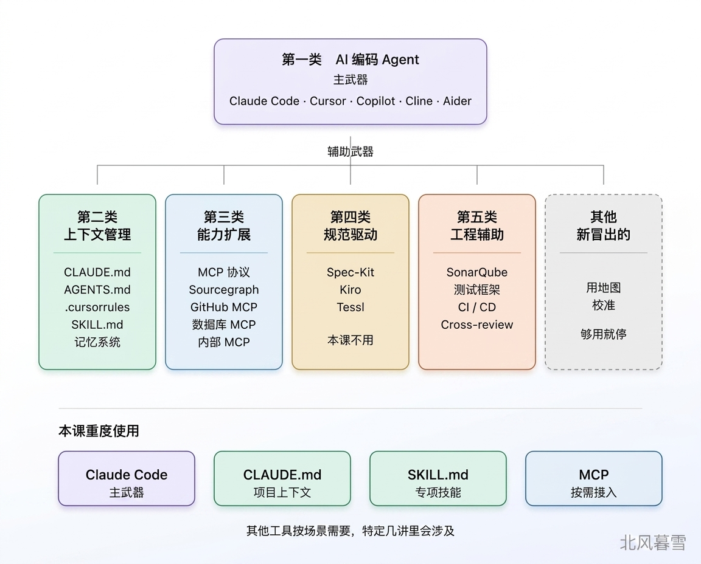

# 04｜AI 编程工具全景：武器库里有什么，什么时候拿哪一件？

**作者：Robert**

🎧 **文章音频**: [🎧 点击播放：_assets/975241.mp3]

> 主武器永远是 AI 编码 Agent，辅助工具根据场景复杂度加减。

你好，我是 Robert。

上一讲我们讲了三层控制：理解、约束、验证。这一讲来看具体的工具。

讲到工具，你可能已经有点焦虑了。Claude Code、Cursor、Copilot、Cline、CLAUDE.md、AGENTS.md、SKILL.md、Spec-Kit、Kiro、MCP、Sourcegraph、SonarQube、SDD、Harness……一连串的概念、工具、仓库，还有层出不穷的新名字。每个看上去都得学，每个看了又都没太用上。

这一讲我想做的，不是告诉你每个工具怎么用，**是把整个武器库铺给你看**。看完你会知道：市面上真正在讨论的工具有哪些，每类解决什么问题，老项目改造这门课实际要用到的是哪几件。**分清主次，才知道该把精力投在哪儿**。

## 为什么需要一张武器库地图

先说为什么要做这件事。用 AI 编程这两年，**最折磨人的不是工具难用，是工具太多**。

你打开一篇技术博客，看到作者在吹 Cursor 的 composer 模式。你刚准备去试，又看到另一篇文章说 Claude Code 的 CLAUDE.md 这么写才有效。你点进去看完，评论区有人推荐 Spec-Kit。你收藏了，顺手在知乎又刷到一篇 “MCP 正在改变 AI 编程”。

一周下来，你的浏览器收藏夹堆了十几个工具名。但你真正坐下来改代码的时候，还是只打开了你最熟悉的那个，其他工具都没碰过。这不是你的问题，是缺一张地图。

地图的作用不是让你学会每个工具，**是让你看清全局**。知道哪些工具属于同一类，哪些工具解决的是同一个问题，哪些是主战场、哪些是旁支。有了地图，你就能判断：这个新出的东西，我要不要学？学了放在武器库的哪个位置？**这比你把每个工具都装一遍要有用得多**。

## 武器库里有什么

按解决的问题分类，AI 编程这个武器库大概分成五类。

### 第一类：AI 编码 Agent

这是你的主武器。你跟 AI 打交道的入口。

代表工具：Claude Code（Anthropic）、Cursor（Anysphere）、GitHub Copilot（微软 + OpenAI）、Cline（开源，VS Code 插件）、Codeium、Aider 等。

形态有两种。一种是 **IDE 内置型**，像 Cursor、Copilot、Cline，在你的编辑器里直接对话、直接改代码。另一种是**命令行型**，像 Claude Code 和 Aider，在终端里开一个会话，你用自然语言指挥它。

这类工具你选一个就够了。本课用 Claude Code，不是因为它是唯一的选择，**是因为它在老项目改造这个场景下最顺手**。用其他工具也是可以的，比如 CodeX，效果基本一样。

### 第二类：上下文管理

光有 AI Agent 不够。你得告诉它这个项目是什么、哪些地方不能动、哪些规矩要守。代表形式：

* CLAUDE.md（Claude Code 的项目级上下文文件）
* AGENTS.md（其他 Agent 工具的类似约定）
* .cursorrules（Cursor 的规则文件）
* SKILL.md（专项技能文件，本课会重度使用）
* 各种记忆系统（Cline Memory Bank、MemGPT、Zep 等）

这类工具的共同特点：**把上下文从“每次对话临时说一遍”变成“常驻在项目里 AI 自动读”**。你一次写好，后面每次会话都自动加载，不用重复讲。**这一类是老项目改造最核心的一类。**三层控制里的理解层和约束层大部分动作都落在这里。

### 第三类：能力扩展

AI 默认只能读代码。让它能做别的事，需要扩展。代表工具：

* MCP（Model Context Protocol，给 AI 接外部能力的标准协议）
* Sourcegraph（代码搜索和依赖分析）
* GitHub / GitLab MCP Server（让 AI 能直接读 PR、issue、commit 历史）
* 数据库 MCP Server（让 AI 能查 schema、跑查询）
* 各类内部系统的 MCP Server（企业自己搭的）

这一类的共同特点：**让 AI 从“只能看代码”升级到“能看到代码之外的东西”**。历史、依赖、数据库、线上指标，都可以通过这一类工具接进来。**老项目改造里，这一类有用但不是必需**。你可以零 MCP 跑一个完整改造，但有了关键几个 MCP，很多事会快很多。

### 第四类：规范驱动开发（SDD）

这是近一年冒出来的一类。代表工具：

* Spec-Kit（GitHub 开源的 spec-driven 开发框架）
* Kiro（AWS 出的 Agentic IDE，主打规范驱动）
* Tessl（商业产品）

这一类的共同特点：**强调先写规范再写代码**。先定义 spec、验收标准、接口契约，再让 AI 基于 spec 生成代码。

老项目改造这门课不专门讲 SDD。原因很简单：**老项目本来就没有清晰的 spec**，你强行给一段老代码“补 spec”意义不大。而且 SDD 的核心思想（先约束、再动手）已经在 03 讲三层控制里了，我们不需要再给它一个流程化的壳。但你知道有这么一类工具就够了。将来做新项目，可以正经学一下。

### 第五类：工程辅助

最后一类是一些提升工程质量的工具。代表工具：

* SonarQube / Sonar（静态代码分析）
* 测试框架（Jest、JUnit、pytest 等，本来就有，AI 时代更关键）
* CI / CD 集成（让 AI 的产出必须跑过 CI 才能合入）
* Cross-provider review（让 Codex 和 Claude Code 互相 review 对方的产出）

这一类不是 AI 时代特有的，是传统工程工具。但在 AI 协作下，它们的重要性被放大了。原因很直接：**AI 写代码的速度远快于人的 review 速度，传统的人肉把关不够了，工程工具必须进来兜底**。三层控制里的验证层，很多动作就落在这一类。

## 怎么判断该拿哪件武器

武器库铺开了，下一个问题：场景来了，拿哪一件？我给你几个具体场景和对应的判断。

1. **场景一：接手一个陌生项目的第一天**。主武器是 AI 编码 Agent，比如 Claude Code。辅武器是上下文管理（准备好接收你整理的项目信息）+ 能力扩展（如果项目大，上 Sourcegraph MCP）。这一天你要做的是理解，让 AI 帮你扫仓库、画架构、梳接口、列数据表。产出沉淀到 CLAUDE.md。
2. **场景二：改一个小 bug**。主武器是 AI 编码 Agent，辅武器无。直接上，不需要复杂准备，不需要 MCP，不需要一堆 SKILL.md。给 AI 上下文（相关文件 + 需求），让它改，你 review，完事。
3. **场景三：跨模块的中等改造**。主武器是 AI 编码 Agent + CLAUDE.md + SKILL.md，辅武器是测试框架 + CI。这是本课大部分实战的场景。理解层靠 CLAUDE.md 沉淀，约束层靠 SKILL.md 和明确的提示词，验证层靠测试。
4. **场景四：一个你完全陌生的项目，语言也不熟**。主武器是 AI 编码 Agent + CLAUDE.md，辅武器是 MCP（GitHub / Sourcegraph）+ 语言学习助手模式。这是这门课最后（挑战开源）的场景。陌生语言 + 陌生项目，你既要让 AI 帮你理解项目，又要让 AI 帮你学语言。
5. **场景五：高风险改造**，比如安全、跨核心服务，上线代价高。主武器是 AI 编码 Agent + SKILL.md（专项技能），辅武器是 Sourcegraph（找全调用路径）+ 独立 review（从攻击者视角等多角度审一遍）。容错空间小的场景，常规工具 + 专项 SKILL + 额外的验证环节。

这五个场景覆盖大多数情况。你会发现一件事：**主武器永远是 AI 编码 Agent，其他工具是辅助**。根据场景复杂度，辅助工具会增加。这也回答了开头那个困惑：为什么你学了一堆工具，真坐下来干活的时候，还是只用了那一个 AI 编码 Agent。

## 老项目改造真正要重度用的工具

再收窄一点，本课会重度使用的工具就是这么四件：

* Claude Code（AI 编码 Agent）
* CLAUDE.md（项目级上下文）
* SKILL.md（专项技能文件）
* MCP（按需接入外部能力），MCP 用得相对较少，主要是前面三个。

其他都是点缀或者不用。不是说别的工具不好，是我们要聚焦。老项目改造的核心不是工具数量，是把这几件用熟。**你把 CLAUDE.md 写出来能让 AI 稳定工作，比你学会 10 个新工具重要得多**。

那 Sourcegraph、SonarQube、Cross-provider review 这些呢？会在特定场景提到，但不是主线。

Spec-Kit、Kiro 这些 SDD 工具呢？不用。不是说它们不好，是跟老项目改造的主线不对路。你现在不需要学。

各种新冒出来的工具怎么办？**用地图校准**。拿到一个新工具，先问自己：它属于武器库哪一类？解决的是理解、约束、验证哪一层的问题？相比我现在用的工具，有什么增量价值？想清楚再决定要不要花时间学。不对路的工具，知道有就够了。

## 够用就停

这里你可能会想，怎么不用 Spec-Kit 和 OpenSpec？在 2026 年 SDD 生态里，它们是两个核心的 SDD 工具。

* Spec-Kit，GitHub 官方开源的项目，流程重，适合从0到1做项目。
* OpenSpec 是社区的组件，相对Spec-Kit 较轻，适合 brownfield / 改造。

在本次课程中，我想尽量让你深入细节，拆解项目，所以会尽量不用成熟的工具。

在我看来，**工具不是学得越多越好，是够用就停**。这句话每次我跟同事说，都有人不太信，觉得“多学一个总没坏处吧”。但真不是，每学一个新工具，你的认知成本就上去一点。学的时候觉得懂了，真要用的时候又发现模糊的地方，反复回查。**注意力被工具切碎，真正花在项目上的思考反而少了**。

老项目改造这件事，你需要的不是一套花哨的工具栈，是对那几件核心工具的肌肉记忆。CLAUDE.md 闭着眼都能写，SKILL.md 看一眼就知道哪些该加，MCP 知道什么时候该接、什么时候不该接。**这些熟到不用思考，你的脑子才能留给项目本身**。

所以这门课后面只重度讲那四件工具，其他工具在特定场景提一下就行。如果你学了之后觉得还不够，再去扩展。但在没把这四件吃透之前，不要着急学更多。

“够用就停”，也呼应 01 讲里说的“熬过冷启动”，都是一个意思：**老项目改造是个长跑，节奏比花样重要**。

## 小结

这一讲给了你一张 AI 编程工具的武器库地图。按解决的问题分五类：AI 编码 Agent 是主武器；上下文管理、能力扩展、规范驱动开发、工程辅助是四类不同性质的辅助武器。

按场景选武器：主武器永远是 AI 编码 Agent，辅助工具根据场景复杂度加减。

本课聚焦的是 Claude Code + CLAUDE.md + SKILL.md + MCP 这四件**。**其他工具知道有就够了，特定场景会用到。

记住那个心法：**够用就停**。工具数量不代表能力，熟练度才代表能力。

## 思考题

1. 你现在经常用的 AI 编程工具有几件？按这一讲的五类分，它们分别属于哪类？你有没有哪一类工具完全没用过、但可能应该用起来？
2. 回想你最近学过但没用起来的某个 AI 工具，为什么没用起来？是场景不匹配，还是其实不需要？如果用这一讲的武器库地图来判断，你当时该不该学它？

欢迎在评论区把你的答案写出来。如果今天的课程让你有所收获，也欢迎转发给有需要的朋友，邀请他来一起学习，我们下节课再见！

---

## 精选评论

**yphust**: 老项目改造这门课不专门讲 SDD。原因很简单：老项目本来就没有清晰的 spec，你强行给一段老代码“补 spec”意义不大。
-------------------
老师，在老项目上继续做开发，也不推荐引入SDD了吗？

> **作者回复**: SDD的思想是贯穿到课程全部的。claude.md本身也是SDD的一种实现。“补 spec意义不大”是指不引入重型的SDD框架，比如spec kit。 老项目不适合引入重型的SDD框架。OpenSpec这种轻量的可以考虑，只是我个人比较少使用。
> 
> 结论就是SDD思想是贯穿到课程始终的。

---

**七月无为**: 关于 个人写 SKILLS 的理解，用来补充一下 前面几楼的说明
个人写 SKILLS 一般可以用在 公共组件的模块。在一个旧项目中，关于 Redis、SMS 等等这些公共组件，一般都已经存在了具体使用了，那么在用 ai 解决问题的时候，如果完全放权，就要看 AI 能不能读到或者能不能理解了，这是一个黑箱，你也不确定的情况。
但是如果自己使用 SKILLS 详细说明，这样子更加方便 AI 理解，要是后续优化或者迭代公共组件，你也可以直接更新SKILLS 就行

> **作者回复**: 我自己的看法是：SKILLS 时一个模板，把一些可重复的流程固化下来。本质上skills的定义也是这样。
> 
> 比如后面我就会写一个SKILL来维护我们生成的文档，同步更新。
> 
> 我觉得没办法完全放权的，至少我个人不行，我都得review，不然不知道哪里有坑。就很麻烦。
> 
> “但是如果自己使用 SKILLS 详细说明，这样子更加方便 AI 理解，要是后续优化或者迭代公共组件，你也可以直接更新SKILLS 就行” 像这种功能说明，我更倾向于落到docs文档里面，避免skills膨胀
> 

---

**重来**: 1、AI 编程工具有几件：claude、codex、superpower 讲真的，自己写的skill、claude.md、rules比较少，更多借助superpower的能力去做开发。对于测试，playwright、pytest等能力是一定要存在的。上下文记忆更依赖于IDE本身能力。关于对接内部系统的MCP服务，我觉得应该要用起来，需要考虑的是生产环节的连贯性，已经度过了个人开发的阶段了。
2、没用起来的某个 AI 工具：很多，SDD框架有很多中道放弃，实际上是自己不够清晰，不明确想要什么，导致使用SDD框架不理想。我认为是需要了解一下的，OpenSpec 主攻文档结构标准，以文档驱动；superpower 主攻头脑风暴，逼你思考，但是落地的文档部分管理缺失。工具都是组合使用，我认为是要取精华去糟粕。
3、“熟练度才代表能力”：非常认同这句话，很多都是停留在表面，把对claude.md和skill等基础能力当做你常识才行。

> **作者回复**: 是的，我自己在开发中主要用的就是claude.md和skill等基础能力这些基础能力。不用追求把所有工具都用起来，我觉得没必要。
> 有些SDD框架太重了，反而降低效率。因为很多开发任务其实我们也是一边开发一边想清楚的。
> 
> “OpenSpec 主攻文档结构标准，以文档驱动；superpower 主攻头脑风暴，逼你思考，但是落地的文档部分管理缺失。工具都是组合使用，我认为是要取精华去糟粕。” 非常同意这句话。所以，我认为是要了解业界所有常用的工具，知道有什么，才能做到去选择合适的。

---

**wiekern**: 用了第三方的一些工具，用一下总感觉太”重“了，完全不适合自己的项目。 openspec/spec-kit/bmad 这些规范驱动的都用过，对于我的老项目，用下来还是自己写命令来创建 PRD/PLAN/TASK文档最舒服。这些第三方工具可以给我指导，让我沉淀自己的skill/command。

> **作者回复**: +1，我目前个人的技能包就是claude.md + SKILLS+DOCS。
> 
> 不过类似openspec/spec-kit 这些工具有它的场景，比如规范化流程，标准化SDD的思想。会让大部分人把SDD用起来。我觉得这是它们最主要的作用。
> 
> 我的看法是，大部分功能开发基础的技能就够了，没必要引入第三方工具。
> 
> 但是在一些大的项目中，我建议不要排斥openspec/spec-kit等工具。多尝试，可能效率会有不错的提升。我最近就在尝试深度使用openspec/spec-kit。

---

**重来**: “注意力被工具切碎，真正花在项目上的思考反而少了”   这个说的非常真实了。

> **作者回复**: 是的，在我看来不是工具越多越好，合适的，用顺手的最好。
> 
> 以前咱们编程会追求vim、spring 的一切奇技淫巧。我觉得这个坏习惯不能带到AI编程。
> 
> AI 编程的目的是提高效率，做出东西，而不是炫技。炫技反而把自己绕进去了。

---

**毁灭吧**: 很有价值的分享，记住Claude Code + CLAUDE.md + SKILL.md + MCP就够了

> **作者回复**: 感谢感谢🌹，是的，我大部分时间还是只使用到这四个工具。

