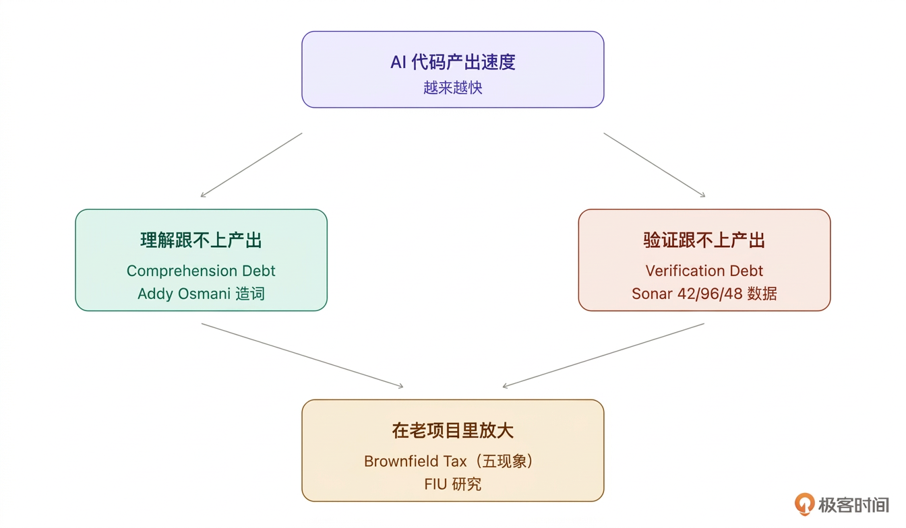
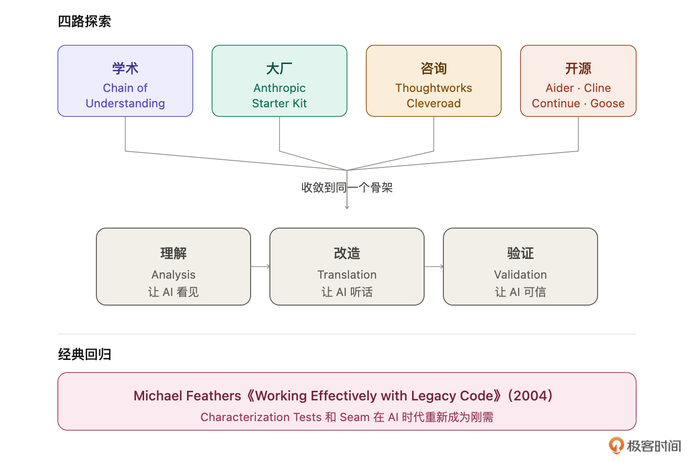

# 05｜业界在做什么？2026 年 AI + 老项目改造的学术与工程全景

**作者：Robert**

🎧 **文章音频**: [🎧 点击播放：_assets/975267.mp3]

> 这门课讲的方法论不是我的个人套路，是业界从学术到工程，不同角度同时收敛出来的方向。

你好，我是 Robert。

这一讲特殊一点。前面四讲讲的是方法论：**九步链路、人机分工、三层控制、武器库**，这些是“技”。这一讲想给你“道”。

业界现在教 AI 编程的课太多，讲工具的更多。你已经学了 Claude Code 怎么用、CLAUDE.md 怎么写，但我不希望你只停在“技”上。我想让你知道：**这门课讲的方法论不是我的个人套路，是业界从学术到工程，不同角度同时收敛出来的方向**。

所以这一讲我会带你扫一遍 2025-2026 年这个领域最值得关注的进展。看完你会有底：我们这门课讲的方法论，是有扎实学术和工程基础的，不是野路子。如果你只想学操作，可以快读这一讲，但如果有时间，我建议你认真读完。后面 28 讲所有的方法论，根都在这一讲对应的业界共识里。

## 业界看到的三个真实问题

先说业界看到了什么。这两年业界用大量数据和研究给出了一个共识：**问题不在 AI 的能力，在老项目这个场景本身对 AI 不友好**。

核心是三个“债”。理解它们，你就理解了老项目改造里 AI 踩坑的全部原因。

### Comprehension Debt：理解债

这个词是 Google 的 Addy Osmani 造的。他的观察：**AI 帮你写代码的速度，和你真正理解这些代码的速度，正在快速拉开差距**。

你过去写 100 行代码，自己写、自己 review，你对这 100 行是熟的。现在 AI 帮你生成 1000 行，你还是只有时间理解那 100 行，剩下 900 行在代码库里，不在你的脑子里。短期没事，真要出 bug、要改造、要对接新需求，你回头读自己的代码库像读别人的代码。

Anthropic 自己做过一个 52 人的随机对照实验验证这件事：**用 AI 辅助的那组，在代码理解测试上比对照组低 17%，debugging 维度差距最大**。

**对你的意义：**老项目本来就欠了十年的理解债，AI 一边帮你改、一边加新债。如果没有系统的方法把 AI 的产出“理解进来”，这个债永远还不清。CLAUDE.md、SKILL.md 这些不是简单的笔记工具，**是对抗 Comprehension Debt 的方法论**。

### Brownfield Tax：棕地税

这个词来自佛罗里达国际大学（FIU）的研究。他们专门研究 AI 在有历史包袱项目里的表现，总结出五个典型现象。

1. Dumb Zone：AI 的 context 使用率一旦超过 40%，输出质量就开始下降。老项目随便塞点代码和文档，context 很容易就到 40%。
2. Cross-session Forgetting：AI 每开一个新对话，前面你辛苦教它的东西全忘了。
3. Context-blind suggestions：AI 不知道代码为什么写成现在这样，会给你更现代的方案，但和你的架构完全不兼容。
4. Translation Tax：senior 开发者用 AI 反而变慢，因为要花时间纠正 AI 的 naive 建议。**经验越丰富，被 AI 浪费的时间越多**。
5. Context Overflow：老项目相关代码和依赖分布在几十个文件里。全喂给 AI 爆掉，不喂全又看不见全貌。

五个现象合起来叫 **Brownfield Tax**：老项目向 AI 征的“税”。

**对你的意义：**这五种税每一种都有对应的打法。Dumb Zone 靠上下文压缩和蒸馏，Cross-session Forgetting 靠 CLAUDE.md 打，Context-blind suggestions 靠 MCP 接入历史数据打，Translation Tax 靠 SKILL.md 固化流程打，Context Overflow 靠 Context Map 打。**不是我在凑方法，是业界看到了问题，这些方法是被逼出来的**。

### Verification Debt：验证债

Sonar 的 State of Code Developer Survey 有一组数据很扎眼：

* 42% 的代码是 AI 辅助生成的
* 96% 的开发者不完全信任 AI 的输出
* 只有 48% 每次都 review AI 生成的代码

一半的代码是 AI 写的，一半没被认真 review。**中间的 gap 就是验证债**。

Veracode 2025 年的报告更狠：45% 的 AI 生成代码引入了安全漏洞。几乎一半。

Ox Security 给这个现象起了个名字，**Army of Juniors（实习生大军）**：AI 产出“功能性极高，但系统性地缺乏架构判断力”。就像你招了一千个实习生，每个都能写代码，但没一个能对架构负责。

**对你的意义：**你必须有工具兜底验证，不能靠人肉 review。这是第三部分“运行和测试：编译、测试、建立护栏”要解决的核心问题。Characterization Tests、跨模型 review、CI 门禁，**不是最佳实践，是验证债逼出来的刚需**。

## 三个债背后是同一件事

这三个债看起来是三件事，实际上是一件事的三个侧面。

AI 的写代码速度跑在前面，人的理解和验证能力在后面追，老项目放大了这个差距。**这是一个结构性问题，不是模型再变强就能解决的**。模型越强，产出越快，差距越大。

业界的解法不是让模型变弱，是给人配上一套能追上模型产出速度的方法论。

这也是为什么开篇词里我说，差的不是 AI，差的是用法。AI 不会变弱，但工程师可以补上方法论这条腿。

## 业界在收敛的共同方向

看完问题，看业界的解法。我扫了一圈学术、大厂、咨询、开源社区的动作，**发现所有认真做这件事的人都在收敛到同一个骨架**。

### 学术：怎么让 AI 像专家一样读代码

学术界最值得关注的一篇论文叫 **Chain of Understanding**，2025 年 4 月发在 arXiv，2026 年 4 月在 ICPC（程序理解领域的顶级会议）正式发表。

作者做了件很朴素的事：找了 8 位代码审计专家，问他们怎么读一个陌生代码库。

结果非常一致。所有专家都按同一条链走：**全局理解 → 局部理解 → 关系理解**。先把代码库当系统看（做什么的、几个模块、数据怎么流），再挑具体模块看内部逻辑，再回到系统层看这个模块和其他部分的关系。

这条链不是单向的，**是螺旋上升的**。下到局部再回到全局，反复几次，理解才算建立。

作者基于这个做了工具叫 CodeMap，用户实验的结果：**用 CodeMap 的人对 LLM 回答的依赖降低了 79%**。

另一个学术方向是**代码知识图谱**。思路是把代码先解析成一张图（节点是类、函数、模块，边是调用、继承、依赖），AI 基于图查询而不是搜文本。Thoughtworks Technology Radar 2026 年把这个方向推荐为值得采纳的实践。

**对你的意义：**我们这门课第二部分（了解项目）就是 Chain-of-Understanding 的落地版。画 Context Map 对应全局理解，识别 Seam 对应局部 + 关系理解。你不用读原论文，但可以知道自己在走的路有 ICPC 2026 的学术背书。

### 大厂：Anthropic 把老项目改造标准化了

2026 年 3 月，Anthropic 在 $100M Claude Partner Network 下推出了 **Code Modernization Starter Kit**。

这不是一个工具，是一套工作流模板。Anthropic 把他们和企业客户合作改造老项目的经验，打包成了标准化资产，企业客户能直接用。

核心结构是三阶段：**代码库分析 → 渐进式迁移 → 等价性验证**。

你看这三个词，和我们这门课的**理解层、约束层、验证层**是不是很像？

不是巧合。Anthropic 在官方文档里明确说：**CLAUDE.md 承担“持久化项目记忆”的角色**，把业务规则、边界情况、架构决策写进去，让 context 能跨 session、跨工程师传递。Custom Project Commands（本课里叫 SKILL.md）把改造方法论编码成可复用的脚本，保证每个模块被处理的方式一致。

**对你的意义**：这门课的底层方法论和 Anthropic 官方背书的方向完全一致。差别是 Anthropic 的 Starter Kit 面向 COBOL 到 Java 这种跨语言翻译，我们这门课更贴近日常工作里的同语言改造。

### 咨询：Thoughtworks 和 Cleveroad 的判断

企业咨询公司是真正在帮客户改真实老系统的，他们的经验更接地气。

Thoughtworks 有个内部工具叫 **CodeConcise**，用知识图谱做 COBOL 等老系统的逆向工程。他们 2025 年底公布的数据：**用 AI + 知识图谱做 COBOL 老系统逆向，时间比传统方法减少 66%**。

他们的核心方法论叫 **Multi-pass Enrichment（多轮富化）**：一轮一轮地给代码图加料，先拿 AST 抽结构，再让 LLM 补语义，再注入业务知识，再交叉验证。

这和我们这门课讲的**“理解是长出来的”**本质是一回事。

Cleveroad 是一家做了 15 年的咨询公司。他们 2026 年 3 月发的报告里，有几段判断讲得很透：

> * 三个失败模式反复出现：试图一次性改造整个系统、在翻译过程中丢失嵌入的业务逻辑、技能鸿沟没有团队能独立跨越。
> * AI 把数周的代码库分析压缩到几天。但这种压缩不是捷径，而是让人类判断能从实际知识出发而不是假设。
> * 架构决策、业务规则背后的监管解读，这些 AI 无法从代码里推断。没有 AI 能读一条计费规则就知道这是 2009 年某地区监管审计之后加上去的。这种 context 只存在于你的领域专家脑子里。

三句话把老项目改造的三个核心判断讲清楚了：**不要一次性改造、AI 做的是压缩分析不是替代判断、代码之外的 context 永远要靠人**。

### 开源：社区在验证不同可能性

最后看开源社区。2024-2026 年冒出了一批优秀的开源 AI 编程工具，和闭源产品走不一样的路线。

* Aider 完全基于 git 工作流，每次改动自动 commit，失败了随时 reset。“永远有保险”的设计对老项目改造特别友好。
* Cline 是 VSCode 插件，最大特点是透明，每一步的 plan、action、result 都显示出来，你可以看着它思考，再决定是否执行。
* Continue 支持多模型 backend，你可以混用 Claude 和 GPT。
* Goose 是 Block 开源的 Agent 框架，核心是 toolkit 机制，支持自定义 toolkit 让 Agent 完成特定领域任务。

这四个工具不是让你都去用，是让你知道：**闭源产品定义方向的时候，开源社区在验证这个方向的多种可能性**。Aider 验证了“永远可回滚”的价值，Cline 验证了“透明执行”的价值。

## 殊途同归

扫完这四路，你会发现一个规律。**所有主流实践都在收敛到一个共同骨架：理解 → 改造 → 验证，三段式**。

名字不一样，骨架一致。**被现实逼出来的事，所有严肃从业者都会得出同样的结论**。这是一个领域走向成熟的标志。

## 图片

## 一本 20 年前的书

最后讲一件特别有意思的事。这本书叫**《Working Effectively with Legacy Code》**，作者是 Michael Feathers，2004 年出版，它在 2024-2026 年重新火了起来。

工作了几年的工程师可能都听过，它是遗留代码改造领域的“圣经”。但 2020 年之前，它的主要读者只是那些不得不维护老系统的倒霉工程师。

从 2024 年开始，这本书的讨论量、引用量开始显著上升。今天几乎每一篇讨论 “AI + legacy code” 的文章都会引用它。

为什么？因为 Feathers 20 年前提出的两个核心概念，**在 AI 时代重新成了刚需：Characterization Tests 和 Seam。**

Characterization Tests 的定义很简单：**测试代码“现在实际”做什么，不是“应该”做什么**。步骤特别土：把代码放进测试框架，写一条你知道会失败的断言，让失败告诉你真实行为，再把断言改成和真实行为一致。测试通过，这就是你的“行为基线”。

听起来像废话？但它在 AI 时代变成刚需。因为 AI 改代码速度远超人 review 速度，你不可能靠 review 确保 AI 没改坏。**你必须有一个外部的、机械的、可回归的契约**。

CodeGeeks Solutions 2026 年初的报告里有段话特别扎心：

> 这是 AI refactoring 领域最被低估的实践之一，因为它降低了 AI 的最大风险：沉默的行为偏移。

沉默的行为偏移（silent behavioral drift）：AI 改完代码，测试跑通了、diff 看起来干净，但在某个没测到的路径上行为已经变了，你发现不了。Characterization Tests 就是对抗它的方法。

Seam 是程序里一个能改变行为、但不需要在那个位置编辑代码的地方。直白说：**一个让代码改造可以被隔离的缝隙**。把直接 new 的依赖抽成一个可覆写方法、把硬编码的配置抽成注入、把静态调用换成接口，这些都是在制造 Seam。

**AI 改一段没有 Seam 的代码，风险远高于有 Seam 的代码**。因为 seam 让影响范围可预测，AI 出错时爆炸半径小。

Augment Code 2026 年的报告里把这套讲得很完整：**先 Characterization Test 锁行为，再 Seam 做隔离，再 Refactor 做改造**。

一本 2004 年的书，在 2026 年反而更必要。原因很简单：**AI 改代码暴露的问题，和 20 年前遗留代码暴露的问题，本质上是同一个**，都是“怎么改一个你不完全理解的系统”。方法没变，只是执行者从人变成了 AI + 人。

如果你还没读过 Feathers 的这本书，现在是最好的时机。它不长，20 年前的例子不影响理解，核心概念至今完全有效。读完你会发现，这门课很多“新”方法，其实是 Feathers 20 年前就讲过的东西。

## 这门课站在哪里

扫完业界，最后讲一件事。

我之前犹豫要不要讲业界，怕你觉得重，像读报告，但我还是决定讲一下。原因是：**学到后面你会积累很多具体方法、工具、流程，这些多了以后，很容易怀疑“这些真的是业界共识吗？还是我的个人套路？”**，这一讲就是回答这个疑问。

从 ICPC 2026 的学术论文，到 Anthropic 官方 Starter Kit，到 Thoughtworks 15 年咨询经验，到 Feathers 20 年前的经典，**所有这些源头，你在接下来的课程里都会以某种形式见到它们的落地，你学的方法论不是一家之言**。

你可以把这一讲当成一张地图。每学完一讲，回头翻一翻这张地图，看看刚学的东西对应哪一块。

最后还想再强调。这门课不管讲得多好，也解决不了你 100% 的问题。每个人的项目、技术栈、团队习惯都不一样，不可能面面俱到。我能做的是把业界现在真实的样子让你看到，把我自己怎么判断、怎么做的讲给你听，剩下的路要你自己走。

从这门课学到东西，然后自我演进，这才是真正属于你的能力。

## 小结

这一讲扫完了 2026 年 AI + 老项目改造的业界全景。

业界看到的三个债 ：Comprehension Debt（理解债）、Brownfield Tax（棕地税）、Verification Debt（验证债）。三个债本质是同一件事：**AI 产出速度远超人的理解和验证能力，老项目放大了这个差距**。

业界收敛的共同骨架：**理解 → 改造 → 验证**。学术（Chain of Understanding、知识图谱）、大厂（Anthropic Starter Kit）、咨询（Thoughtworks、Cleveroad）、开源（Aider、Cline）四路殊途同归。

一本 20 年前的经典图书复兴：Working Effectively with Legacy Code（Michael Feathers， 2004）。**Characterization Tests 和 Seam 在 AI 时代重新成为刚需。**

你学这门课，方法论底层和业界共识完全对齐。带着这张地图往下学，你对每一步都能看到更深的来源。

下一讲开始第二部分，我们真正上手，拿一个项目用这套方法论走一遍。

## 思考题

1. 三个债（理解债、棕地税、验证债）里，你在自己项目上感受最强烈的是哪一个？能不能具体描述一下？
2. 你以前接触过 Feathers 的 Characterization Tests 或 Seam 这两个概念吗？如果有，你觉得它们在 AI 时代和 AI 之前有什么不同？如果没有，这一讲之后你会不会去读一读那本书？

欢迎在评论区把你的答案写出来。如果今天的课程让你有所收获，也欢迎转发给有需要的朋友，邀请他来一起学习，我们下节课再见！

## 参考资料

**核心论文：**

* Chain of Understanding： Supporting End-user Developers’ Code Understanding with Large Language Models，Jie Gao 等，ICPC 2026，arXiv：2504.04553

**企业实践报告：**

* AI-Assisted Legacy Code Modernization Guide 2026，Cleveroad
* Using GenAI to understand legacy codebases，Thoughtworks Technology Radar
* How to Refactor Legacy Code，Augment Code，2026
* Best Practices for AI Refactoring Legacy Code，CodeGeeks Solutions，2026

**风险数据源：**

* Addy Osmani 关于 Comprehension Debt 的系列文章
* Florida International University 关于 Brownfield Tax 的联合研究
* Sonar State of Code Developer Survey (2026)
* Veracode 2025 年度安全报告
* Ox Security 关于 Army of Juniors 的分析报告
* Anthropic 内部 52 人随机对照实验

**经典书籍：**

* Working Effectively with Legacy Code，Michael Feathers，2004

**开源工具：**

* Continue、Aider、Cline、Goose：各自 GitHub 仓库

---

## 精选评论

**zhangwq**: 这是在vibe coding 热大背景下敢说真话的文章，太少见了。我一直觉得ai没有创造什么东西，只是信息的搬运工，就像文字，书籍，网页一样是信息的传播媒介，不知道怎么就被吹上天了，提效数据越来离谱，然后到现在的零人工代码，都在说提效但是没人说清楚提效的产出物是什么？每次都是做个demo就是遥遥领先，就是颠覆，更可笑的是自媒体们蹭流量也就算了，公司的管理层竟然不具备独立的思考能力，领导们看到提效然后照着做个demo跑通了然后就在公司强推，我特么简直了，自己的一线员工的实际体验数据不要，只愿意相信自己愿意相信的

> **作者回复**: 🌹🌹🌹🌹🌹

---

**Tommy**: “这些真的是业界共识吗？还是我的个人套路？”
在思考一些问题时， 我也有过类似的想法，但我从来没能够像老师这样系统性的去论证过自己的想法，顶多就是翻翻网页，向老师学习！

> **作者回复**: 感谢感谢～～～共勉🌹🌹

---

**bearlu**: 修改代码的艺术，这本书，有没有凝聚下来，现在有没有现成的SKILL可以使用？

> **作者回复**: 这个我还真没有去研究诶，没从这角度想过问题。你去研究下，也教我下。我理解应该有吧。🤣

---

**VentusDeus**: 这篇太好了！客观多元视角

> **作者回复**: 感谢感谢～🙏
