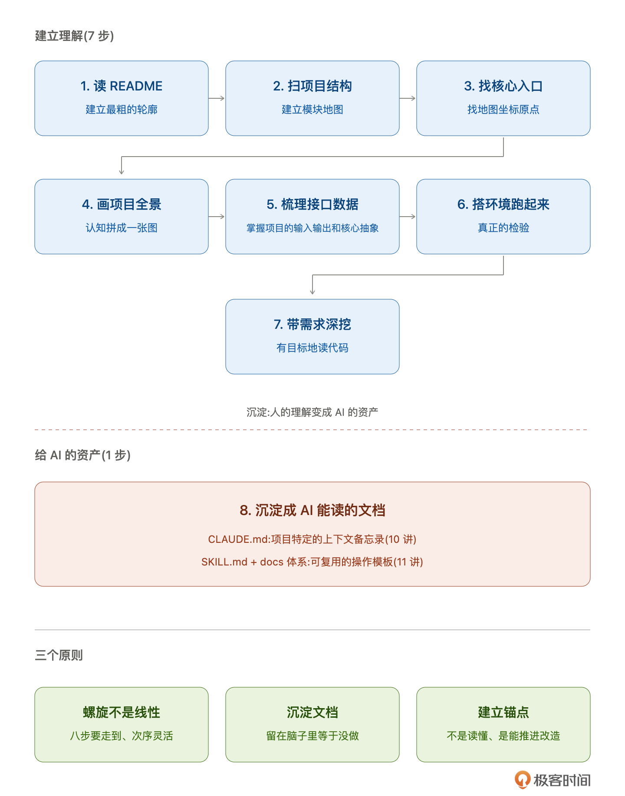

# 06｜了解项目的八步心法：从 README 到核心链路

**作者：Robert**

🎧 **文章音频**: [🎧 点击播放：_assets/975378.mp3]

> 总结讲师多年接老项目的一套动作，你拿去在自己的项目上走一走、改一改，走出属于你自己的节奏。

你好，我是 Robert。

从这一讲开始，我们真正上手开始改造。这部分的核心议题叫做“了解项目”。在标准的流程中或者在我看来，**一个老项目到手，不管你准备改什么，第一件事永远是先把它摸清楚。这一步没走扎实，后面所有动作都是瞎动**。

第二部分的六讲围绕一件事：**怎么用 Claude Code 高效地摸清一个陌生老项目**。这一讲是开篇，给你一套心法，接下来每一讲对应心法里的一个具体动作。

## 为什么要一套“心法”

你可能会问：了解项目不就是读 readme、看代码、搭环境这些事嘛，需要什么“心法”？**正是因为这些事太“日常”，反而容易走偏**。我见过的两种典型失败模式。

**第一种，从头到尾读代码**。

项目拿到手，打开 IDE，从 controller 开始，一个方法一个方法读下去。读到第三天还没读完 service 层，进度条只往前推了 10%。老板在群里问“项目看得怎么样了”，你说“还在看”。

这种方式的问题不是慢，是**读过的东西一会就忘**。项目没改，你只是在通读，没有锚点，没有目标。一周之后再回来，代码好像又变陌生了。

**第二种，直接让 AI 干**。

反过来，有人信奉“AI 时代不需要自己读代码”。项目拿到手直接打开 Claude Code：“帮我总结一下这个项目是做什么的”，AI 给一段漂亮的总结；“帮我找出改造点”，AI 给一个 todo list；“帮我写改造方案”，AI 给一个方案。照着改，上线，出事。

这种方式的问题更隐蔽：**你看起来很快，但其实什么都不懂**。AI 的总结是基于它看到的代码给的，它看不到的那些历史、对接方、隐性约定，你也没去补。你以为自己上手了，其实还在地面。

这两种失败的共同原因是同一个：**没有一套“最小完备的锚点清单”**。

从头到尾读是无重点，让 AI 全盘托管是无参与。你需要一个清晰的骨架，知道要搞清楚哪些事、不搞清楚哪些事、哪些事 AI 做、哪些事必须自己做。这就是心法。

## 八步心法

把“了解老项目”这件事拆开，我归纳出八步。这八步不是我发明的，是任何一个接过老项目的工程师或多或少都在走的路径，只是没有写下来。

这八步我一件一件跟你说。

**第一步，读 README 和根目录的文档**。

打开项目先看 README，再看 docs 目录。别嫌弃 README 写得简陋，能看多少算多少。这一步不是为了“懂”，是为了建立一个**最粗的轮廓**：这个项目做什么的、跑在什么环境、有哪些核心概念。

**第二步，扫项目结构**。

把仓库 clone 下来，看目录和包组织。Java 项目看 pom.xml 的 module 划分，Go 项目看 cmd 和 internal，TypeScript 项目看 packages 或 src 一级目录。

这一步的核心是建立一张**模块地图**：项目分几块、每块大概干什么、哪些是核心、哪些是边缘。不看代码细节，只看结构。

**第三步，找到核心入口**。

知道模块地图之后，找具体的入口。HTTP 服务找 controller 和 main 函数；定时任务找调度注册处；消息消费找 consumer 或 listener。

入口很重要。它是从用户到代码的**第一个接触点**，代码所有的主流程都从入口出发。找到入口你就找到了地图上的坐标原点。

**第四步，画出项目全景**。

到这一步你对项目有了基础认知，但散碎。第四步要把散碎的认知**拼成一张图**：架构图、模块依赖图、核心数据流图。

这张图不需要精细，粗糙的手绘都行。关键是画出来，不要只停在脑子里。一画你就会发现哪里想不清楚、哪里的关系没理顺。这一步是 07 和 08 讲的主题。

**第五步，梳理接口和数据模型**。

有了全景之后深入一层：项目对外暴露什么接口？内部核心数据结构是什么？

接口是项目的“对外契约”，数据模型是项目的“内部骨骼”。把这两样梳理清楚，你就掌握了这个项目的**输入输出**和**核心抽象**。这一步是 09 讲的主题。

**第六步，搭起环境跑起来**。

理论上你已经对项目有了相当的认知，但**真正的检验是跑起来**。

搭环境经常比想象的难。依赖的数据库版本、中间件、内部服务、环境变量，每一个都可能卡你半天。跑不起来是正常的，跑起来的那一刻你对项目会有质的认知飞跃：能打断点、能看日志、能复现问题。这一步跨到第三部分 13 讲详细展开。

**第七步，带着需求深挖代码**。

跑起来之后，不要继续通读。开始带着具体需求深挖：我要改哪个模块？我要加什么功能？带着这个问题回到代码里，沿着调用链路深挖。

这一步读的代码是有目标的。每一处都带着问题：这里为什么这么写？这段逻辑会被谁调用？改了会影响哪里？**有目标的读胜过无目标的读一百倍**。

**第八步，沉淀成 AI 能读的文档**。

前面七步做完，你脑子里清楚了，但这不够。你得把这些理解沉淀到文档里，让 AI 也能读到。

具体就是两份东西：CLAUDE.md（项目特定的上下文备忘录）和 SKILL.md（可复用的操作模板）。前七步的产出一股脑写进这两份文档里。这一步是 10 和 11 讲的主题。

八步合起来干一件事：**把你脑子里的理解，变成 AI 也能看见的资产**。

## 三个原则让心法落地

光有八步清单不够，还有三个原则决定你能不能用好它。

### 第一个原则：螺旋不是线性

八步是清单，不是顺序流水。真实工作里，你读 README 的时候顺手扫了项目结构，搭环境的时候发现了一个接口要回去查代码，画全景的时候意识到核心入口漏了一个。

**这些来回是正常的，甚至是必要的**。八步是一个锚点清单，告诉你“这几件事都要做”，不是必须按 1 到 8 的顺序做。

你可以在第四步“画全景”画到一半发现自己对某个模块理解不够，回第二步重看结构；你可以在第六步“跑起来”的时候发现一个没见过的接口，回第五步补接口清单。这些都没问题。**重点是八步最后都要走到，不是次序**。

### 第二个原则：沉淀文档，不是留在脑子里

我反复强调过这件事。人的脑子有极限，今天搞懂的东西下周可能就忘一半。更关键的是，**留在你脑子里的东西 AI 读不到**。每走完一步，问自己一个问题：**这一步的产出我写到哪里了？**

第一步读完 README，有没有把关键点抄到一份笔记里？第三步找到核心入口，有没有记在项目 map 的某一行？第五步梳理出接口清单，有没有存成一份可查的 markdown？

没沉淀等于没做。这也是为什么第八步专门拎出来讲“沉淀成 AI 能读的文档”。前七步做了一堆，最后一步是把它们固化下来。**前七步是理解，第八步是资产**。两件不同的事。

### 第三个原则：建立锚点，不是读懂

最后一个原则最反直觉。很多人接老项目第一反应是“我要把这个项目读懂”，然后陷进代码里出不来。**你的目标不是读懂，是建立锚点**。

什么叫锚点？**是你要改这个项目时能抓住的把手**。知道核心链路从哪到哪、知道哪些模块是高风险、知道哪些接口是对外契约、知道历史上有哪些坑。

有了这些锚点，你就算还没读懂整个项目，也能安全地改造。真要改某个具体模块，到时候再深挖那个模块就行。

老项目改造里有一个残酷的真相：**你永远不会真的读懂一个老项目**。代码几万几十万行，写它的人换过好几拨，历史细节没人记得全。你要做的是**建立“足以推进改造”的理解**，不是“完整无缺的理解”。

八步心法就是在帮你建立这份“足以推进改造”的最小理解。

## 接下来六讲要做什么

说完心法，说项目。从 07 讲开始，我会带你把这八步心法在一个具体项目上走一遍。这个项目叫 **Spring AI Alibaba Admin**。

它是阿里巴巴官方开源的 Agent Studio 管理平台，在 spring-ai-alibaba 这个主仓库下面作为子项目。定位是 AI Agent 的一站式开发平台，支持 Prompt 管理、Dataset 管理、Evaluator、实验、Observability、多模型配置。启动后是一个跑在 8080 端口的 Web 服务，有前端管理界面、有一套 REST API、有 MySQL 和 Nacos 作为依赖。Apache 2.0 协议，Java + React 前后端分离。

**为什么选它当主线？**三个理由。

1. **它长的和你每天打交道的那种老项目很像**。在公司维护的项目大概率就是这种形态：一个 HTTP 服务、Spring Boot，连着 MySQL，对外提供一堆 REST 接口，前端是独立的管理界面，可能还集成了 Nacos 做配置中心、OpenTelemetry 做链路追踪。一个标准的企业级微服务。Spring AI Alibaba Admin 就是这个样子。它不是什么简化的 demo 项目，是一个**真实形态的、完整的企业级微服务**。多模块 Maven（4 个 server 子模块 + frontend）、前后端分离、接数据库、接中间件、有 Actuator。你在这个项目上练出的方法论，能**一比一迁移到公司那个跑了几年的老系统上**。这是拿它当主线最根本的理由。
2. **AI 方向贴合**。你作为一个 AI 时代的工程师，改 AI 相关的项目有代入感。Prompt 管理、Evaluator、Trace 观测这些功能，你日常在用，改起来能快速进入状态。
3. **开源相对活跃、背书强**。阿里巴巴官方维护，Apache 2.0。你学完课程可以真实地给它提 issue、提 PR。Google 一下能搜到一堆中文资料，有不懂的地方自己能深挖。这种活跃的开源项目做教学材料最稳，不会出现“项目失联”或者“文档过时到没法用”的情况。

接下来六讲，每一讲要做什么事？

* **07 讲：**在讲怎么画之前，得先让 Claude Code 真的能画图。你会拿到一个装好画图能力的 Claude Code，以及一张“什么场景用什么图”的心智地图。
* **08 讲**：让 AI 画出 Spring AI Alibaba Admin 的全景（对应八步心法的第四步）。你会拿到一张架构图、一张模块依赖图、一张核心数据流图。
* **09 讲**：梳理 Spring AI Alibaba Admin 的接口和数据模型（对应第五步）。你会得到一份完整的 REST 接口清单和核心数据结构说明。
* **10 讲**：写 CLAUDE.md（对应第八步的一半）。把前面的产出沉淀成 AI 协作的项目备忘录。
* **11 讲**：搭 SKILL.md 和文档体系（对应第八步的另一半）。把可复用的操作模板固化下来。
* **12 讲**：实操。把 06 到 11 讲的所有东西在 Spring AI Alibaba Admin 上完整跑一遍，作为第二部分的收尾。

六讲下来，你会**拿到一份摸透了的 Spring AI Alibaba Admin**，为第三部分的编译运行和护栏打基础，再为第四部分的真实改造做最终铺垫。

然后你就可以拿着这套体系套用到每一个老项目中了。**提示词都不用改。**这就是这门课想同时交给你的：“技”和“道”。

## 小结

这一讲给了你一套了解老项目的**八步心法**：读 README、扫项目结构、找核心入口、画项目全景、梳理接口和数据模型、搭环境跑起来、带需求深挖代码、沉淀成 AI 能读的文档。

三个原则让心法落地：**螺旋不是线性**、**沉淀文档不是留在脑子里**、**建立锚点不是读懂**。

这一讲没有具体动手，是给你一个骨架。从 07 讲开始，每一讲你都会拿着 Claude Code 在 Spring AI Alibaba Admin 上干一件具体的事。干的这些事合起来，就是八步心法的完整落地。

老项目改造最难的第一步从来不是改，是摸清。摸清这件事过去靠工程师的经验和韧性，现在有 AI，但方法论不变，只是执行更快。

这门课教不了你把每一个项目都摸到完美，也不承诺你走完八步就万事大吉。**我能做的是把我自己多年接老项目的一套动作诚实地交给你**，你拿去在自己的项目上走一走、改一改，走出属于你自己的节奏。熬过冷启动，后面全是复利。

## 思考题

1. 回想你最近接手的一个老项目，八步心法里哪几步你没走到或者走得不扎实？如果让你重来一次，你会补哪几步？
2. 你手上现在正在维护的项目，如果让你给下一个接手的同事留一份 CLAUDE.md，你能写多少？写不出来的部分，是因为你自己也没搞清楚，还是因为没来得及沉淀？

欢迎在评论区把你的答案写出来。如果今天的课程让你有所收获，也欢迎转发给有需要的朋友，邀请他来一起学习，我们下节课再见！

---

## 精选评论

**wiekern**: 老项目可能连 README 都没有，什么时候点生成 README 合适？

> **作者回复**: 你往下看，在生成claude.md那一步就可以生成readme了。而且这时候生成的readme 的内容会蛮准确的。

---

**笑傲流云**: 作为新入职的人，如何快速上手项目是不是也可以按您说的8步法执行？现在遇到一个问题是，公司内部的跟代码相关的文档包括需求文档，技术方案文档等，claude code没办法阅读到，因为公司内部的文档外网没法访问，这种情况一般怎么处理？

> **作者回复**: 1. 可以的，而且非常适合。你可以实践看看，遇到问题这里反馈。
> 2. 这就是一个很敏感的问题了。 这里涉及到内部文档的安全问题，所以安全问题不说的话。 我的做法就是，复制+粘贴，一个一个文档喂给Claude。
>
> 你看一下你的电脑能连接Claude话，那就复制黏贴给Claude就好了，顺便让Claude 给你把文档整理整理。
>
> 打开项目源码，打开Claude，把文档给claude，然后让claude 一边理解代码和一边理解文档

---

**西蒙**: 如果不是很懂JAVA，也能参与改吗？

> **作者回复**: 可以的，这个课程会涉及到三门语言，java、python、rust。主要的想法是想表达课程是和语言无关的。而且，AI 辅助编程确实降低了语言之间的壁垒。

---

**周建普**: 这个项目的提示词可以直接用到我自己的老项目里吗？都不用改的吗，理解层和约束层的规则不一定一样的吧，不是很理解。

> **作者回复**: 你可以往后看内容，基本是可以直接用的。虽然每个业务逻辑不一样，但是生成基础信息的原则一样的
>

---

**Steven.HD**: 老项目bug的解决有推荐什么步骤么？目前分析下来bug多就是前期架构设计不好 + 迭代开发 太快导致的

> **作者回复**: 从逻辑上看，跟当前的步骤差不多，但是又不太一样。一样的地方是：得先了解项目，然后再改。不一样的地方是，bug的分析是非常细节的，我们当前这个流程太粗了，不适合。
>
> 但是思路上：还是让Claude 多了解项目。我实际的开发中，把前面这些信息都整理给Claude的话，还是能解决一些bug的。
>
> 但是如果是架构设计不好，那最终只能重新设计了
