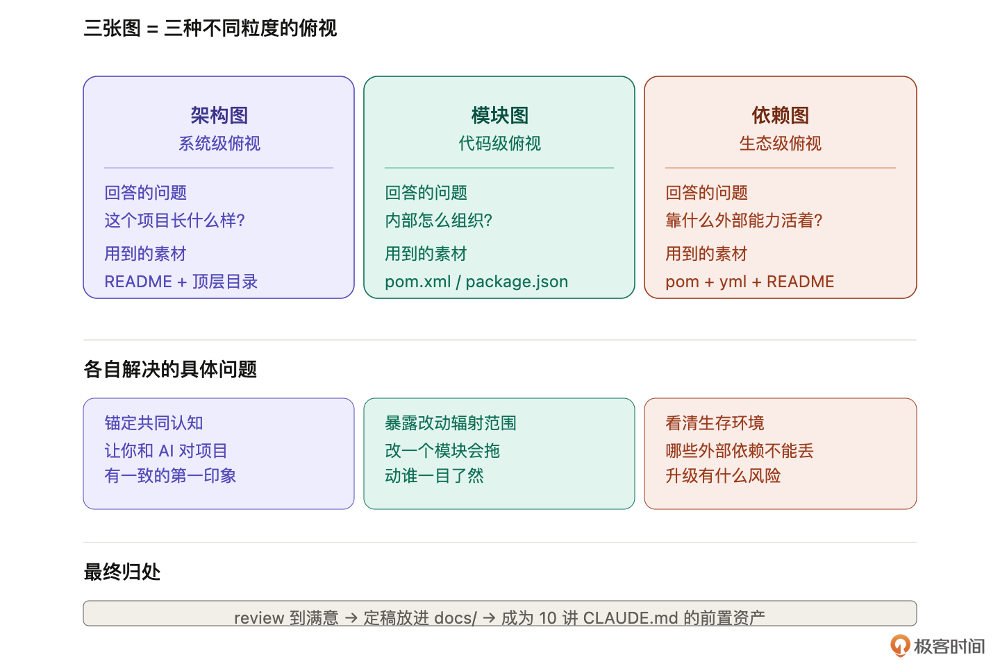
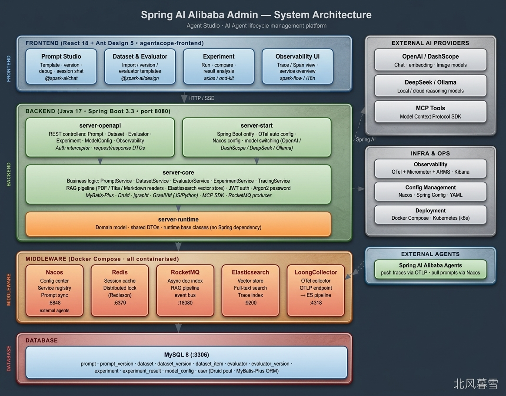
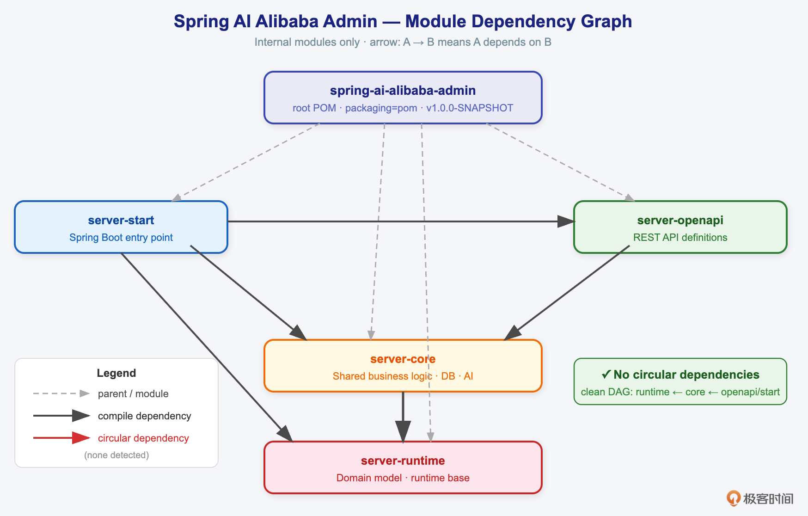
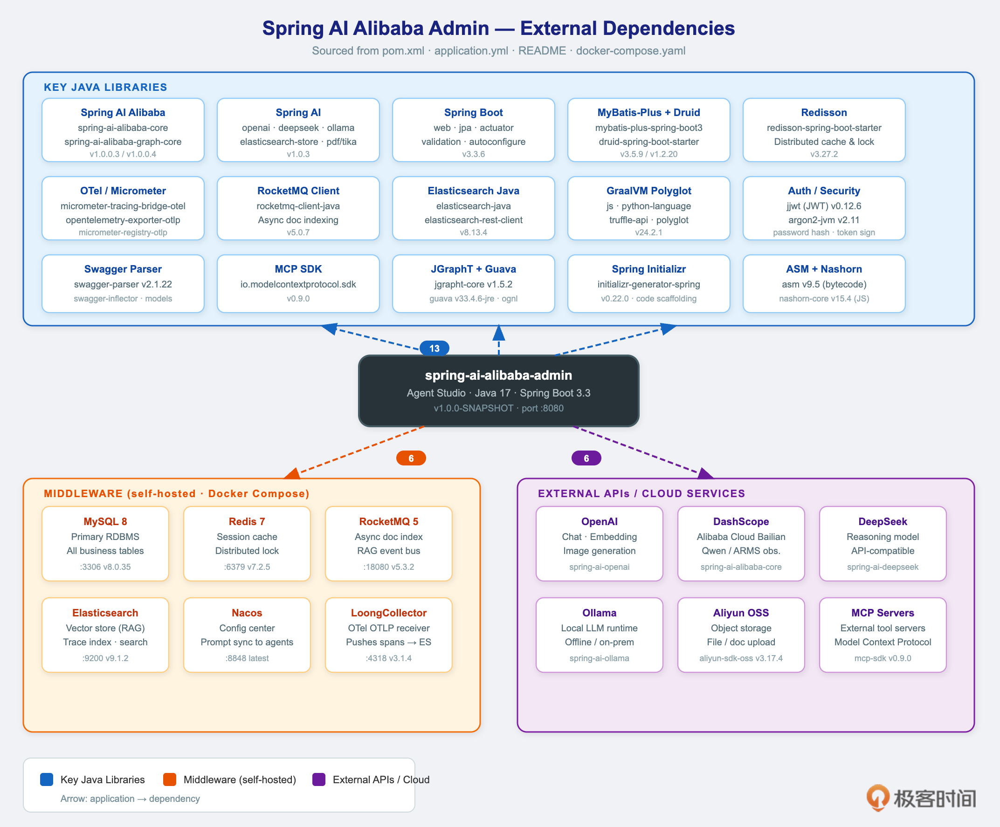

# 08｜俯视项目全景：用提示词画出架构图、模块图、依赖图

**作者：Robert**

🎧 **文章音频**: [🎧 点击播放：_assets/975832.mp3]


> 画完不是终点，review 和存档才是。

你好，我是 Robert。

上一讲装好了画图能力，这一讲我们正式拿 Spring AI Alibaba Admin 开刀，开始干活了。

从这一讲开始，第二部分剩下的五讲（08 到 12），每一讲都在这个项目上做事。**所有出现的提示词、产出的图、沉淀的文档，都围绕它展开。你跟着一起操作会收获最大**。

## 先把项目 clone 下来

花两分钟准备一下：

```plain
git clone https://github.com/alibaba/spring-ai-alibaba.git
cd spring-ai-alibaba/spring-ai-alibaba-admin
```

**这一讲只看代码、不跑项目**。你可能手痒想 `mvn spring-boot:run` 跑起来看看，先按住这个冲动。13 讲专门讲怎么让 AI 帮你把编译运行搞定，那时候一次性讲透。这一讲我们只让 AI 读代码、画图。

**一个约定**：后面我们课程里所有产出的图、文档、学习笔记，都统一放在 `docs/` 目录下。这是一个固定的规范，不会变。我们今天画的三张图就是第一批住进 `docs/` 的资产。准备好了就开始。

## 为什么先画三张图

老项目改造八步心法的第 4 步是“画项目全景”。全景不是一张图，是三张。



**架构图回答“这个项目长什么样”**。前端、后端、数据库、中间件的系统边界和调用关系。一张图告诉你，这是个什么样的系统、跑起来的时候各部分怎么协作。是**系统级**的俯视。

**模块图回答“项目内部怎么组织”**。具体到代码仓库里的模块划分和模块之间的依赖关系。一张图告诉你，这个仓库里有几个模块、谁依赖谁、改一个会拖动谁。是**代码级**的俯视。

**依赖图回答“项目靠什么外部能力活着”**。这个项目用了哪些第三方库、连了哪些中间件、对接了哪些外部 API。一张图告诉你，这个系统的生存环境长什么样、哪些外部依赖不能丢。是**生态级**的俯视。

三张图不重复，它们从三个不同的高度俯视同一个项目。

## 开始画图

你可能觉得，画一张架构图也就罢了，另外两张真有必要吗？真有必要。每一张图解决一个你迟早会遇到的具体问题。

**没有架构图**，你和 AI 对这个项目的基线认知不同步。后面每次让 AI 改造，它都要重新猜一次项目长什么样。你猜一个版本，AI 猜另一个版本，改着改着就跑偏了。架构图的作用是锚定共同认知，改造之前先对表。

**没有模块图**，你不知道一个改动的辐射范围。改 server-core 会不会波及 server-runtime？改 server-openapi 会不会动到 server-start？这些问题，没有模块图你只能看 pom.xml 一行一行翻。有了图，影响范围一眼就看清。

**没有依赖图**，你不知道项目的命门在哪。升级 Spring AI 的版本会不会炸？Nacos 连不上整个应用还能不能启动？MySQL 换成 PostgreSQL 要改几处？这些都是依赖图一眼看得到的事情。

还有一个更关键的理由：**这三张图是 10 讲 CLAUDE.md 的前置资产**。写 CLAUDE.md 时你需要给 AI 一份项目概貌，三张图就是概貌的骨架。今天画好，明天就能用上。理论讲完，开始画。

你可以直接复制下面的提示词到你自己的项目运行，生成自己的架构图、模块图、依赖图。

提示：这些图在上一节课已经出现过，但是上一讲是演示画图效果，本节课才是真正的开始了解项目。

### 第一张：架构图

**提示词**：

```plain
读一下这个项目的 README 和顶层目录，给我画一张架构图。
前端、后端、数据库、中间件分层画，核心模块写一句话职责。
周边基础设施（日志、监控、配置）用一个方框概括就行，
不用展开。保存到 docs/architecture.svg。
```

**关键点**：

分层说清楚。Spring AI Alibaba Admin 是前后端分离的项目，前端 React 一层、后端 Java 一层、下面挂 MySQL 和 Nacos、在下面对接外部模型 API。没有分层的提示，AI 会把所有东西堆到一起。

“核心模块写一句话职责”，这一条很关键。AI 默认只写模块名，画出来的图每个方框里只有一个词，别人看了还是不知道 server-core 到底是干嘛的。加一句职责，图的信息密度立刻上来。

画出来的效果如下：



**常见坑**：

第一个坑，AI 容易把 frontend 画成一个跟后端并列的小方框，实际上 frontend 是一整个独立的前端工程。review 的时候看一下，前端是不是被合理展开、UI 路由和后端 API 的调用关系是不是画出来了。

第二个坑，AI 容易漏掉 OpenTelemetry。Spring AI Alibaba Admin 的 observability 能力是通过 OTel 集成实现的，架构图里应该体现“服务发出 trace → OTel Collector → 存储”这条链路。第一张出来如果没画，你直接说“把 OpenTelemetry trace 链路补上”，AI 会基于上下文迭代一版。

第三个坑，一次画不完美是常态。画完说“放大 Server 层，把四个子模块之间的调用关系画细一点”，“数据库层加上表名”。迭代三五轮才能拿到一张真正能用的架构图。

### 第二张：模块图

**提示词**：

```plain
看一下项目的 pom.xml，画一张内部模块依赖图。
只画项目自己的模块，外部库不画。有循环依赖用红色标出来。
保存到 docs/module-deps.svg。
```

**关键点**：

强调“看 pom.xml”。Spring AI Alibaba Admin 下面有四个 server 子模块加一个 frontend，AI 只要读 parent pom 和各子模块的 pom，关系就清楚了。不让它读，它可能根据模块名瞎猜依赖方向。

“外部库不画”也是必须的。Spring Boot 一个项目 transitive 依赖能到几百个，全画进来图就废了。

画出来的效果如下：



**常见坑**：

第一个坑，AI 可能把 server-start 模块漏掉。start 模块通常是 entry point（main 方法在里面），AI 容易认为它是“运行时入口”而不是“代码模块”。review 的时候看 start 模块有没有在图里，以及它有没有正确地依赖其他三个 server 模块。

第二个坑，依赖方向可能画反。正确的方向是 start 依赖 runtime 和 openapi，openapi 和 runtime 都依赖 core。如果图里出现 core 反过来依赖 runtime 这种，就是错的，要让 AI 重画。

第三个坑，frontend 不应该出现在这张图里。模块图只画 Java 模块之间的依赖关系，frontend 是独立的 React 工程，通过 HTTP 调用后端，不通过 Maven 依赖。AI 有时候会把 frontend 也塞进去，要让它去掉。

### 第三张：依赖图

**提示词**：

```plain
综合看 pom.xml、application.yml 和 README，帮我梳理这个项目。
对外依赖了什么，分成三类：关键 Java 依赖、中间件、外部 API。
画出来，每类用不同颜色。保存到 docs/external-deps.svg。
```

**关键点**：

分三类是这张图的灵魂。Java 依赖看 pom（Spring AI、Spring Boot Actuator、Micrometer 等），中间件看 application.yml 和 docker-compose（MySQL、Nacos、OTel Collector），外部 API 看 README 和配置样例（DashScope、OpenAI、DeepSeek 等模型提供商）。

三类分开画，你才能一眼分辨，哪些是代码层面的依赖、哪些是运行时要连的中间件、哪些是外部第三方服务。

画出来的效果如下：



**常见坑**：

第一个坑，AI 容易把 transitive dependency 全列出来。Spring Boot 一个 starter 就能拉几十个间接依赖，全画进来就没法看了。提示词里强调“关键”，review 的时候挑出真正的项目主干依赖，砍掉无关的。

第二个坑，AI 可能不知道“应该看 application.yml 才知道中间件”。如果第一版画出来只有 Java 依赖没有中间件，直接告诉它“去读 application.yml 和 application-\*.yml，看项目连了什么中间件”。

第三个坑，外部模型 API 这一类容易漏。因为它们在代码里是通过配置注入的，不在 pom.xml 里。README 的 Configure Your API Keys 一节会说清楚项目支持哪些 API。让 AI 读 README 的这一节。

## 画完不是终点，review 和存档才是

07 讲留了一条硬线：**AI 画的图一定有错**。这一讲把这条线具体化。

架构图画完先问自己几个问题。**核心模块是不是都在？前端后端的边界是不是画对了？数据流向是不是真实？有没有把 observability 漏掉？有没有把已经废弃的东西画成核心？**问到哪一条不对，就让 AI 调到对为止。

这一步是需要停下来的，因为 AI 完成了主要工作，需要我们自己来做校对。但是不一定全对，只要大致对即可。

模块图 review 的重点是依赖方向。start 依赖 runtime 和 openapi，runtime 和 openapi 依赖 core。这个方向一定要对。循环依赖出现了不要忽略，这是真实存在的架构问题。

依赖图 review 的重点是三类是不是齐全，Java 依赖有没有列主干？中间件有没有遗漏？外部 API 是不是反映了当前 README 写的那几个模型提供商？

**review 到你满意为止，然后定稿放进 `docs/`**。定稿之后，这三张图就是你和 AI 的共同记忆。10 讲写 CLAUDE.md 会引用它们，后面改造的每一讲都可能翻出来对照。图画得扎实，后面所有课程都轻松。

如果你画到一半发现某张图特别难画，那通常不是你的问题，是项目本身就有问题。循环依赖是架构问题，模块职责不清也是架构问题，外部依赖一团乱麻更是架构问题。**画不出整齐的图，说明这个项目本身需要整理**。这本身就是一个信号。

## 小结

这一讲做了三件事。

1. 把 Spring AI Alibaba Admin clone 下来，确认从现在开始实操都在这个项目上做，所有产出都放在 `docs/` 目录下。
2. 讲清楚了为什么要画三张图：**架构图锚定系统级共识**、**模块图暴露代码级依赖**、**依赖图展示生态级牵挂**。三张图是三种不同粒度的俯视，不重复。
3. 给了三套提示词，分别画出这三张图。提示词像人说话的风格，不堆格式化要求，只把关键指令和关键约束说清楚。每一张图都附上常见坑和 review 要点，让你不至于画到一半一头雾水。

## 思考题

1. 你手上正在维护的那个老项目，如果让你画这三张图，哪一张最难画？为什么？是因为项目本身就乱，还是因为你自己没想清楚？
2. 架构图、模块图、依赖图这三张图里，团队里哪一张最容易被反复翻出来看？这张图更新频率高不高？如果不高，为什么？是因为项目很稳定，还是因为没人维护？

欢迎在评论区把你的答案写出来。如果今天的课程让你有所收获，也欢迎转发给有需要的朋友，邀请他来一起学习，我们下节课再见！

---

## 精选评论

**百炼钢**: claude + minimax ，画的图根本没法看，svg画不出来，png可以，但是内容太少了；
切换到 deeepseek v4 pro ，明显靠谱很多，是真的读取了各个目录和文件（minimax貌似没有……）
但是，svg特别长，横板的，要放大很多倍，才能看清楚；
分了，数据库 + 后端 + 前端
mysql , redis, elasticsearch, nacos, rocketmq 都放到 （DATABASE MIDDLEWARE）
后端，内容是最多的，没有概括的，是一个一个的小模块，线条也比较多，
前端，就三个： 国际化核心库，工作流可视画布引擎，AI Agent可视化开发主应用；
只体验了“架构”

> **作者回复**: 我用的cc ，能力蛮强的。画的图我挺满意。不过经常会出现重叠、紧凑、覆盖，溢出。要我给提示让它调整。
> 
> 风格的话，可以给一章你喜欢的图的风格，比如我课程中的图片，让cc学着画。效果就不错。我最近经常这么搞。
> 
> 不同的模型能力肯定有差异。我比较少用deeepseek。cc 给我的效果很好


---

**庄周梦蝶**: 老师，最后会把课程中所产出的内容 放在git上吗？

> **作者回复**: 会的，已经有了，我整理下放出来哈
> 


---

**重来**: https://github.com/imxv/Pretty-mermaid-skills. 用这个skills，加上作者的示例，基本能达到 作者图片的效果。

> **作者回复**: 谢谢补充～ 


---

**张三**: 老师，我看您在文中会写出踩坑点，但是对于一个老项目来说，在我自己都不清楚项目结构的前提下，我怎么知道AI画出来图是正确的呢？还是说需要我自己先理解项目，AI只充当一个画手？

> **作者回复**: 你可以往下看。我的思路是：先让AI自己了解项目，自己读代码了解项目。然后形成基本的材料。然后你去理解这些材料，对着代码或者咨询老员工去核对这些材料是否对。也就是AI帮你生成的知识基础的资料。但是在我的经验中，一些架构图、依赖、模块组成、接口文档、数据库schema等资料，基本正确率能到80%吧。整体下来，AI生成的初版材料准确率会有60%～70%左右。


---

**Hackeren**: 是直接存成svg？还是存成mmd？

> **作者回复**: 我都是生成svg的。mmd太丑了，没法复制保存


---

**晚点_Ken**: 上节课讲的是4张图，但是这节课只有前3张，这个时序图是可有可无的嘛

> **作者回复**: 时序图是接口粒度的，每个接口有自己的时序图。所以不用在这里画，在后面的内容中，会画接口粒度的时序图


---

**VentusDeus**: 老师 为什么我用claude画出来是那种很传统的mermaid图 不是上面那些带颜色的svg图 要做什么配置吗

> **作者回复**: 你可以问一下cc ，提示词是：风格我不喜欢，有什么风格可以选。然后根据输出去选。CC 有提供了多种风格的选择。
> 
> 我画图其实不喜欢只有一种风格，看腻了，我经常让它给我换风格画图。或者你告诉它： 带颜色，背景实心图。好看点，科技感。之类的
> 
> 你试试，我们一起看看。


---

**yan**: 同问老师，推荐使用什么模型，目前是用的claude code+第三方api，使的国内的code plan，画出来很丑很难看

> **作者回复**: claude code+第三方api。这个是没问题的。能说怎么丑吗。
> 
> 如果丑，你可以让cc 改，比如换个风格，换个色系。调整布局，cc都能干的很好。
> 
> 我给一句话结论：我现在所有的都图都是cc画的，我特别特别满意。精美的很。
> 


---

**不矫情不做作那是我**: 不同的模型 不同的工具画出来的图差距很大，我用claude code + miniMax 画出来的图很难看,问题也比较多，codex+gpt5.5 就好看很多，你老师你的图就有些相似了

> **作者回复**: 是的，这就是模型能力的差别。模型的理解很重要的。所以我目前为了效率基本都是用claude code或者codex。
> 另外，在我看来claude code和codex 的差别不大。我用claude code 画的图也挺好看的。
> 比我自己画的好看。

