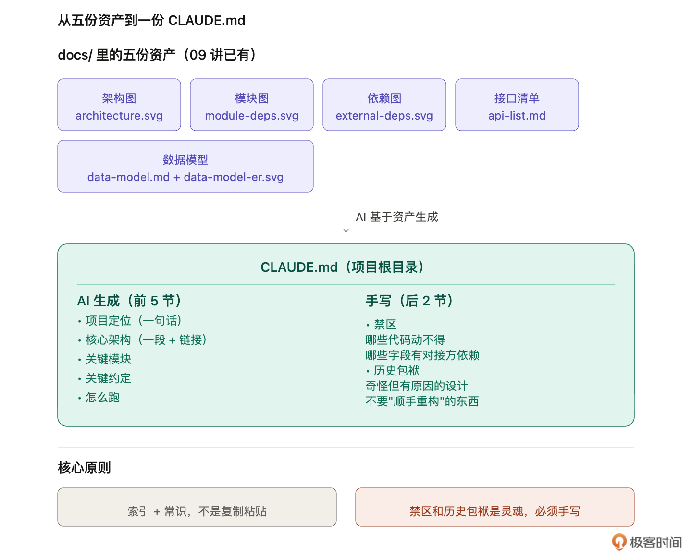
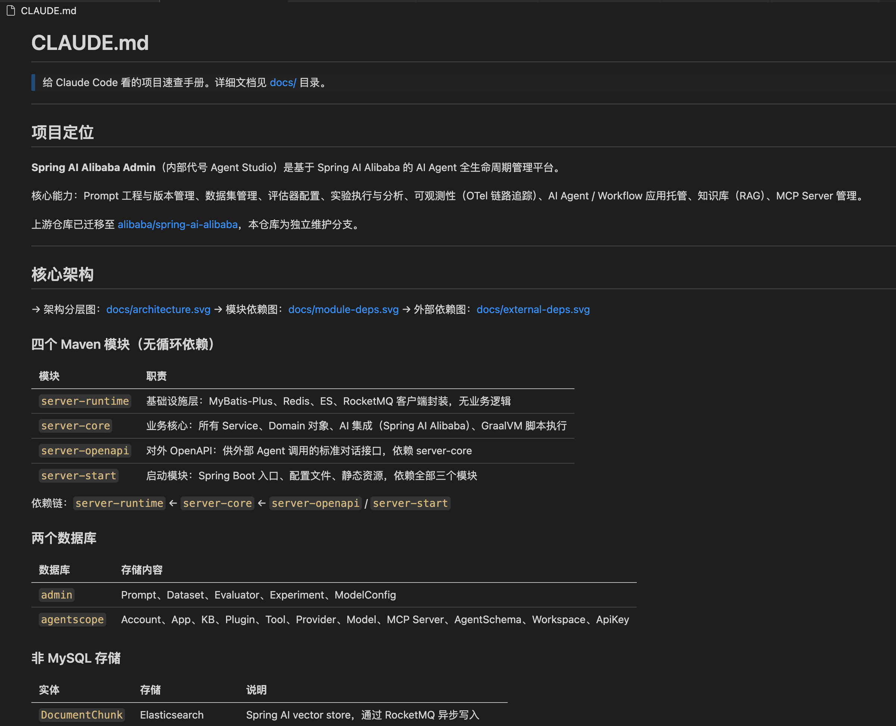

# 10｜老项目的 CLAUDE.md 怎么写？从五份资产到一份项目常识

**作者：Robert**

🎧 **文章音频**: [🎧 点击播放：_assets/976338.mp3]


> 从“我理解了项目”到“AI 也能理解项目”。

你好，我是 Robert。

上一讲结束时，`docs/` 目录里住了五份资产：架构图、模块图、依赖图、接口清单、数据模型。你和 AI 对这个项目已经有了相当多的共识。

但有一件事还没做：**让 AI 在每次启动时就带着这些共识进来**。

这一讲就做这件事。我们把五份资产凝成一份 CLAUDE.md，放进项目根目录。下次任何人（包括你自己）打开这个项目，Claude Code 启动时会自动读它，AI 一上手就知道“这是什么项目、核心架构是什么、哪些地方不能动”。

这是第二部分的关键节点：**从“我理解了项目”到“AI 也能理解项目”**。

## 新老项目的 CLAUDE.md 不一样

先说一件容易被忽略的事。新项目写 CLAUDE.md 不难，比如有个技巧，就是参考阿里巴巴Java规范生成CLAUDE.md的约束。因为你是作者，代码是你写的，规矩是你定的，CLAUDE.md 凭经验就能写出来。

老项目不一样。你是接手者，项目不是你写的，很多设计决策背后的原因你自己都没搞清楚。这种情况下你凭什么写 CLAUDE.md？凭五天前刚读的代码？凭零散的印象？

写出来的东西要么空洞（这是一个 Spring Boot 项目），要么错误（把你猜的当成事实），要么遗漏（没写出最关键的那几条禁区）。

**老项目写 CLAUDE.md 的正确姿势不是从零写，是从已有资产里提炼**。

这就是为什么 08 讲画三张图、09 讲做两份清单。这五份资产不只是给自己看的笔记，它们是 CLAUDE.md 的**前置条件**。有了它们，CLAUDE.md 才有得提炼；没有它们，CLAUDE.md 就是空中楼阁。

这一讲要做的事，其实就是把前两讲的积累，**凝成一份 AI 每次启动都能看到的项目常识**。

## 里面放什么、不放什么

对于新项目来说，规矩越多，AI 约束得越好，代码质量越高。

而在老项目中，如果手动给 CLAUDE.md 塞太多内容，就可能会和原先的规范形成冲突（说实话，不是可能，基本是百分百）。因此在老项目改造中最常见的写法错误是**写得太多**。把架构图的内容用文字重抄一遍、把接口清单全塞进去、把数据模型每张表每个字段都列出来。结果 CLAUDE.md 几千行，AI 每次启动都加载一大堆 context，掉进 Dumb Zone（05 讲讲过的那个东西）。

在老项目中，**CLAUDE.md 的定位是索引 + 常识**，而不是大量的约束。索引负责指向我们提炼出来的详细内容，常识负责让 AI 一启动就知道关键信息。超过 300 行就是写多了。

**放进来的东西，按我的经验有这几类：**

* 项目定位：一句话说清楚这是什么。比如 “Spring AI Alibaba Admin 是阿里巴巴开源的 Agent 管理平台，提供 Prompt 管理、Dataset、Evaluator、Trace 观测等能力”。
* 核心架构：一段话 + 一个指向 docs/architecture.svg 的链接。不要把图里的内容文字化重写。
* 关键模块：一个小表，列出每个模块一句话职责。详细的依赖关系在 module-deps.svg 里。
* 关键约定：硬规则。比如“所有 REST 接口响应统一包装 Result”，“数据库字段一律用 snake\_case，Java 字段用 camelCase”。不展开理由，直接说规则。
* 怎么跑：一句话 + 指向 docs/ 运行文档的链接。这部分 13 讲会单独做。
* 禁区：老项目的灵魂一节。
* 历史包袱：老项目的灵魂另一节。

后两节是老项目 CLAUDE.md 最重要的部分，下一节单独讲。**不放的东西：**

* 完整架构细节：那是 architecture.svg 的事。
* 完整接口清单：api-list.md 就在 docs/ 里，不要重复。
* 完整数据模型：data-model.md 就在 docs/ 里，不要重复。
* 通用代码规范：阿里 Java 开发手册这种东西不是你项目特有的，进 CLAUDE.md 只会稀释重点。
* 背景故事：AI 不需要读一篇项目诞生史才能工作。

**核心原则一句话**：CLAUDE.md 里的每一条，要么是 “AI 启动就必须知道的常识”，要么是“指向 docs/ 的入口”。不满足这两条的，删掉。



## 让 AI 帮你生成初稿

有了 docs/ 里的五份资产，生成 CLAUDE.md 就简单了。

**提示词**：

```plain
读 docs/ 下的所有资产，给我生成一份 CLAUDE.md 初稿。
精简：项目定位、核心架构、关键模块、关键约定、怎么跑，
外加两节空着的：禁区、历史包袱。
架构图、接口清单、数据模型的详细内容不要复制进来，
用链接指向 docs/ 就好。保存到项目根目录的 CLAUDE.md。
```

**关键点**：

* “读 docs/ 下的所有资产”让 AI 基于你已有的产出提炼，不是凭空写。
* “用链接指向 docs/ 就好”防止 AI 把架构图文字化、把清单复制进来。
* “两节空着的：禁区、历史包袱”这一条是最关键的一招。**让 AI 留出这两节的位置，但不要让它填**。因为 AI 填不出这两节的真实内容，它会瞎编或者写得很泛。留空让你自己填。

生成的 CLAUDE.md 如下：



**常见坑**：

第一个坑，AI 第一次生成会忍不住把 architecture.svg 的内容用文字描述一遍，塞进“核心架构”那节。初稿出来检查一下，如果看到长段的模块描述，直接说“这一段太长了，压成一句话+链接”。

第二个坑，“关键约定”这一节 AI 容易写通用的（比如“代码要有注释”），不写项目特有的。如果出现这种情况，直接让 AI 从代码风格里反推项目真实的硬规则，而不是抄通用开发手册。

第三个坑，AI 可能贴心地把两节空着的也填上。这时候直接让它恢复空白：“禁区和历史包袱这两节留给我自己写，别帮我猜”。

## 禁区和历史包袱

AI 生成的 CLAUDE.md 里一定没有真正有价值的禁区和历史包袱，因为这两节的信息**不在代码里、不在 docs/ 里、只在你脑子里**。这两节必须手写，它们是老项目 CLAUDE.md 区别于新项目 CLAUDE.md 的根本所在，是这节课最硬的部分。

**禁区写什么：**哪些代码动不得、哪些字段有对接方依赖、哪些配置改了会出事。

示例（不是真实的内容，每个项目的禁区是不一样的）：

```plain
## 禁区

- `server-core/PromptEntity` 的 `external_key` 字段：某 SDK 客户依赖
  此字段做缓存键，删掉或改名会导致该 SDK 直接报错。不要重构。

- `application.yml` 里 `nacos.server-addr` 的默认值：部分企业用户依赖
  这个默认值做灰度发布，改动需要发公告。

- `POST /api/prompts/search` 接口路径：曾经公开给过社区，更改路径
  会造成外部调用失败。新增同义接口可以，删除原接口不行。
```

**历史包袱写什么：**项目里看起来奇怪但有原因的东西。  
示例：

```plain
## 历史包袱

- `Dataset` 和 `DatasetItem` 的表结构看起来冗余，是 2024 年某个
  实验性功能留下的。功能已下线但数据保留中，勿删。

- 前端 `PromptTemplate.vue` 用的是 Vue 不是 React，是早期遗留。
  整个 admin 其他地方都用 React，这里例外。不要"顺手重构"统一。

- `LegacyEvaluatorAdapter` 这个类是 v0.x 时代的兼容层，看起来很乱，
  是因为要同时支持三种老 API。v1.0 之后新代码一律走 EvaluatorV1。
```

看出来了吗？这两节每一条都是 **AI 永远猜不出来的东西**。只有你这个接手者和项目原作者聊过，或者自己踩过坑之后才知道，但这两节每一条都价值百倍。AI 改造时一旦看到“禁区”里某条，会自动避开。有了“历史包袱”的说明，AI 不会“好心”把 Vue 组件改成 React。

**老项目 CLAUDE.md 写得好不好，就看这两节写得深不深**。其他内容 AI 都能帮你生成，这两节必须你自己投入时间。如果你现在还列不出几条禁区、几条历史包袱，那是一个信号：**你对这个项目的理解还不够深**。再回去挖一挖，和老同事聊一聊，翻翻 git log 里那些奇怪的 commit。花时间填这两节，是给你自己、给团队、给 AI 一起做的最值得的一件事。

## review 的三个检查点

CLAUDE.md 写完，review 一下。我的三个检查点：

1. **有没有禁区和历史包袱**。没有就是漏了。每个老项目都有，只是你可能还没挖出来。至少现在列一两条，后面遇到了再补。
2. **是不是太长**。超过 300 行就是塞了太多详细内容。扫一下看哪些段落可以下放到 docs/，CLAUDE.md 里只保留一句话 + 链接。
3. **有没有重复 docs/**。如果 CLAUDE.md 里把 architecture.svg 的内容用文字重写了一遍，那是在复制，不是在索引。你遇到“核心架构”这一节应该看到的是引导（架构分为前端、后端、数据库三层，详见 docs/architecture.svg），不是替代（把架构图的每个模块都文字化描述一遍）。

通过这三个检查，CLAUDE.md 才算定稿。

## 小结

这一讲做了一件事：把 docs/ 里的五份资产凝成一份 CLAUDE.md，放进项目根目录。

* 核心原则：CLAUDE.md 是索引 + 常识，不是 docs/ 的复制粘贴。里面放项目定位、核心架构、关键模块、关键约定、怎么跑、禁区、历史包袱。不放完整架构、完整接口清单、完整数据模型、通用代码规范、背景故事。
* 生成路径：前 5 节让 AI 基于 docs/ 自动生成，禁区和历史包袱这两节自己手写。AI 写不出这两节的真实内容，必须你自己投入时间。老项目 CLAUDE.md 区别于新项目的根本，就在“禁区”和“历史包袱”这两节。写得深不深，决定了这份 CLAUDE.md 有没有用。

写完这一讲，docs/ 里有五份资产，项目根目录多了一份 CLAUDE.md。这是老项目的“脑图”基本成型的时刻。但还有一类东西没落地：**反复要做的操作流程**。比如改造前要跑的体检、PR 前要过的 checklist、资产更新后要做的校对。这些不是常识，是操作。放进 CLAUDE.md 会让它臃肿，每次启动都加载没必要，它们应该住到另一个地方。下一讲我们讲怎么从老项目里**挖出这些重复流程**，写成你的第一个 SKILL。

## 思考题

1. 你手上的项目如果现在让你写 CLAUDE.md 的“禁区”和“历史包袱”两节，你能列出几条？列不出的原因是真的没有这些坑，还是你自己还没搞清楚？如果是后者，这些信息目前存在哪里，同事脑子里？Jira 的某个老 ticket 里？还是没人知道？
2. 想想你们团队正在运行的老项目，有没有一个类似 CLAUDE.md 的东西（比如项目的 README 或者内部 wiki）？如果有，里面写的是“索引 + 常识”，还是变成了什么“都塞的大杂烩”？如果是后者，你觉得问题出在哪？

欢迎在评论区把你的答案写出来。如果今天的课程让你有所收获，也欢迎转发给有需要的朋友，邀请他来一起学习，我们下节课再见！

---

## 精选评论

**阿斯顿**: 老师，如果是跨语言的项目重构，比如java项目用golang重构。docs及claude.md还有什么内容需要补充吗

> **作者回复**: 这个是另外一个议题了。我感觉这个课程整理出来的东西只能当数据源，让新项目了解老项目有什么功能。
> 
> 但是不适合直接用文章的思路来重构。
> 
> 因为跨语言重构，相当于翻译了。需要把老项目的代码、功能和结构等细节都一一比对清楚。相当于把老项目的细节都扣清楚。需要更加细致。
> 
> 比如接口的输入输出、代码规范、schema、代码逻辑等等。在我看来，这是另外的议题了。


---

**面向工资编程**: 这个和直接 /init 生成 claude.md 的差别是啥？

> **作者回复**: /init 生成的是完全靠AI它自己的理解，每次理解是没有固定逻辑的。
> 用这个流程的话，从架构、API、ER图，依赖、模块这些固定的角度出发。相当于告诉AI 你要从这五个角度去思考生成CLAUDE.md。
> 而且在整理这五份资料的过程，需要你输入和调整某些信息，这样生成的CLAUDE.md的更完整、质量更高。


---

**Jxin**: 看着脑壳疼，真实项目真这么玩？
1.图人好理解，现在 ai 比如走 CC + 5.5 也好理解。但是图比文字 token 多啊。一样的内容变成 DSL AI 依旧能理解。
2.所谓企业级老项目，那可能是下来几十个服务的一套系统。想用 claude.md 来维护上下文，根本搞不了。即便上了 rule 走 path 匹配也有很大缺陷。 CC 只提供了 claude.md 和 rule 这两类系统级的提示词。但用起来真的不好覆盖所有场景。
3.所以，现在我的做法其实是自己搞了一整套 plan with file。借助 hook 在自己想要的时机去加载上下文，模拟 claude.md 和 rule  的系统级权重，保障这些内容，在合适的时候，不压缩的传递进去。

> **作者回复**: 是给人看的没错。人看不懂，怎么知道AI 是不是看懂了。 AI 可以不靠人的输入直接一把理解，一把开发吗？ 老项目开发就是因为只有人知道的背景逻辑多，不沉淀在代码或者文档。人不看懂，怎么把这些信息喂给AI。
> 
> 另外那真实项目怎么玩？
> “企业级老项目，那可能是下来几十个服务的一套系统”。这句话没问题。我问个问题：几十个服务的项目就是微服务架构了。这种项目几十个服务都是你（或者一个人）维护吗？一个需求会把几十个服务都改一遍吗？
> 
> “.所以，现在我的做法其实是自己搞了一整套 plan with file。借助 hook 在自己想要的时机去加载上下文，模拟 claude.md 和 rule  的系统级权重，保障这些内容，在合适的时候，不压缩的传递进去。”  这里你想表达的是，几十个项目同时开发，或者关联到N个项目的开发，也不用理解原子项目，你直接一整套 plan with file去跑吗？ 这样你真的敢用吗？
> 
> “想用 claude.md 来维护上下文，根本搞不了。即便上了 rule 走 path 匹配也有很大缺陷。 ” ，这个跟claude.md 一点没关系。即使上了你说的“上了 rule 走 path 匹配”也解决不了问题。
> 
> 问题的核心在于： 首先是要对每个原子服务的理解都要达到一定程度。从原子项目的理解扩展到对多个项目，N个微服务架构的理解，甚至业务的理解。这也是这门课的核心思路。原子不理解，啥都干不好。
> 
> 这就是为什么企业都在建立业务级别的知识库，包括产品逻辑、设计等等。但是实际在企业中，这种全流程，大的改动效果真的真的真的一般般。
> 
> 微服务的理念就是，每个服务守住自己的边界。如果守不住边界，那就是爆炸，就是架构问题，跟人和AI就没关系。
> 
> 守住边界，那就是走对每个原子服务的理解，然后一开始单个服务改，后面拆plan，多个项目联动（不过这点我保持谨慎）。
> 
> 或者你可以展开说说这个：“现在我的做法其实是自己搞了一整套 plan with file”


---

**许凯**: 我最近有个claudecode的使用心得：让claudecode做任务时，都面向markdown文件进行沟通，不懂的地方就让它在markdown文件里面补充说明，然后我来学习审核并修改确认markdown文件，确认好之后，**/new一下清空claudecode的上下文**，让它按照最新的markdown文件进行完成任务。完成任务后我验收，不合适的地方继续改markdown文件，然后重复上面步骤直到满意，这样做的好处：可以最大限度避免上下文干扰和最大限度节省token

编写markdown文档的过程中要做好层级区分，通用的抽取引用关联，要遵循加载优先级和渐进式披露，沉淀验证完了就可以直接按需转skill了

我还发现任务文档的主体一定要自己写，自己精准控制（大语言模型可以辅助提建议，但一定要自己阅读和精准控制），用一些技能或者插件生成会有很多附加内容，导致自己的吸收和精准把控能力变弱

真正长期稳定的，反而是：markdown + 小上下文 + 状态驱动 + 人类主导架构

利用Obsidian可以很好组合各类markdown文档引用，CLAUDE.md里面放项目全局的描述，主要说明白：是什么（要素和连接关系）、为什么（什么场景下使用达到什么目的，可监控、高安全、高可用、高扩展、高性能、低成本、功能与配置一致单一完整正交等，可以充分发挥模型的能动性）、怎么样（要素和连接关系怎么配合运转起来的、约束、规则。具体的实现步骤可以分要素在引用的文件里面详细说明，保持CLAUDE.md文件的干净简洁）。具体到要素和连接关系的描述文档编写时，也可以按照上面是什么、为什么、怎么样的逻辑进行编写，做到有总有分，可以精准控制上下文的范围和描述。

> **作者回复**: 哈哈哈哈，自建 agent memory。context compact。压缩token的经典思路。
> 说实话，这个思路挺好用的，我也一直在用。我课程的思路基本也是这个思路。人来主导架构，文档沉淀，更新文档。从我的经验来看，效率蛮高的，可控。
> “markdown + 小上下文 + 状态驱动 + 人类主导架构” 很同意这个，我自己的经验就是，没用太多工具。目的是我可控，可控是为了我能理解代码，能够长期维护演进。
> 
> 

