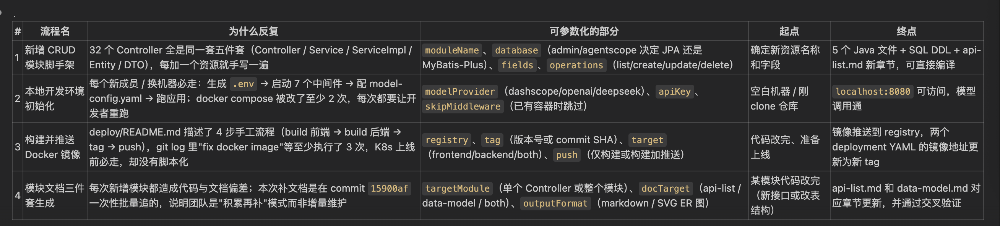
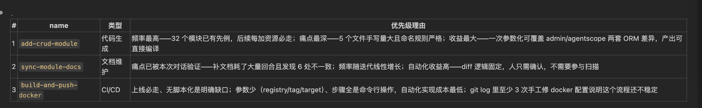
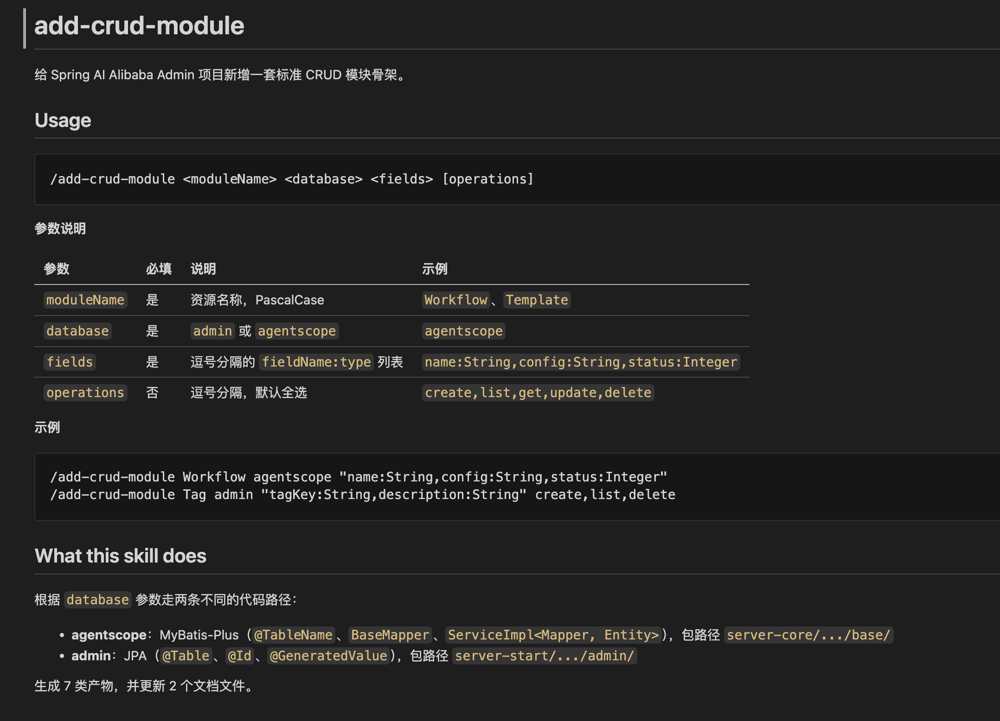
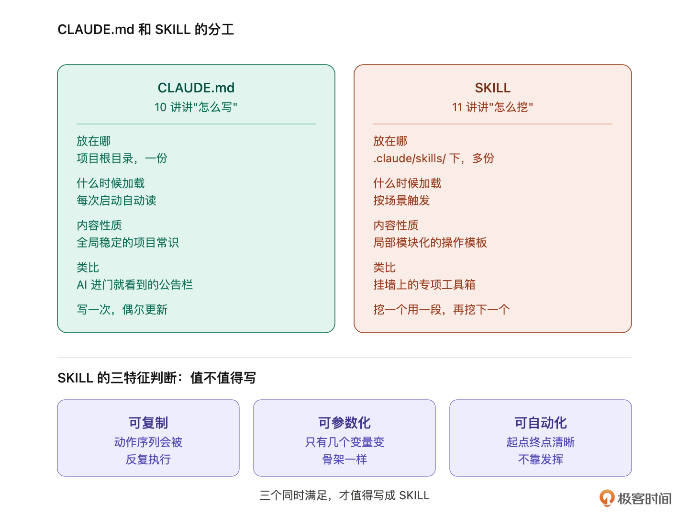

# 11｜老项目的 Skill 怎么挖？把重复流程变成可复用的技能

**作者：Robert**

🎧 **文章音频**: [🎧 点击播放：_assets/976622.mp3]

> SKILL 是养出来的，不是设计出来的。

你好，我是 Robert。

上一讲结尾我留了一句话：还有一类东西没落地，就是反复要做的操作流程。这类东西放不进 CLAUDE.md，因为它不是常识、是操作。改造前的体检、PR 前的检查、文档跟着代码走，**这些每次改造都要走一遍的流程，应该住到另一个地方，这个地方就是 SKILL**。

07 讲里我们装过一个别人写的 SKILL（画图），那是消费者视角。这一讲换角度，教你**从自己的老项目里挖出重复流程，写成第一个可用的 SKILL**，这是生产者视角。

学完这一讲，你会在项目的 `.claude/skills/` 目录里多一个实际能用的 SKILL。项目的 AI 协作基础设施从“别人给的”变成了“你自己养的”。

## 老项目的 SKILL 的一些特点

### 老项目特别需要 SKILL

先说为什么老项目和 SKILL 是天作之合。新项目你自己起的，每件事第一次做你都印象深，写不写 SKILL 差别不大。

老项目不一样，老项目的特征是“很多事情你反复做了很多次，但每次都凭记忆”。改造前体检、PR 前检查、文档同步、新增接口前对齐，这些事你每周都做，但因为没沉淀，每次都得重新想一遍流程。漏一步、错一步是常态。

更扎心的是：**这些流程不只是你一个人在做，团队里每个人都在做，每个人做的细节还不一样**。A 提 PR 前会跑测试和格式化，B 会顺手 review changelog，Robert 总是先做一次资产校对。三个人的 PR 过 review 的速度差三倍，原因不是能力差，是流程没标准化。

SKILL 的价值就在这里：**把这些反复做但没沉淀的流程，固化成一个 AI 能自动执行的资产**。A 装上之后，提 PR 前 AI 自动跑一遍 Robert 的全套流程；B 装上之后，AI 自动同步文档不会忘。**整个团队的下限被拉到上限**。

老项目恰恰是 SKILL 的富矿，因为这种“反复做但没沉淀”的流程多到挖不完。等你挖完，你后面的开发就非常顺畅了。

### SKILL 的起点是“挖”，不是“设计”

讲挖之前先说清一件事，很多人开始写 SKILL 时第一反应是研究 YAML 格式、`description` 怎么写、`allowed-tools` 有哪些，这些都是有用的知识，但它们应该在挖到具体场景之后才学。

**SKILL 的起点是识别“我反复在做某件事”**。没有重复流程就硬写 SKILL，产出的是一堆没人用的代码。Claude Code 扫 `~/.claude/skills/` 时每个 SKILL 都会被索引，不是性能问题，是 **SKILL 写多了 AI 在多个 SKILL 之间会判断混乱、互相冲突**。所以写之前先想清楚：这件事我是不是真的在反复做。

怎么判断一件事值不值得写成 SKILL？三个特征判断法：

1. **可复制**。同样的动作序列会被反复执行。不是“偶尔做一次”，是“这个月已经做了五次”。
2. **可参数化**。只有几个变量在变，骨架是同一个。比如“新增一个接口”的流程：具体接口名不一样、入参出参不一样，但流程是一样的（先看 docs/api-list.md 里现有接口的路径规范、再看 data-model.md 里相关实体、再写实现、再补测试、再回头更新接口清单）。
3. **可自动化**。动作序列有明确的起点和终点。起点：触发信号清晰；终点：产出物明确。不是那种“改着改着凭感觉做完了”的事。

**三个特征同时满足，才值得写成 SKILL**。差一个都别硬写。偶尔做的事写进文档就好，流程太发散的事留在脑子里就好，做成 SKILL 反而会把 AI 卡在错误的框里。

### 老项目里哪些流程值得挖

老项目里有四类流程几乎家家都有，挖出来就能用：

1. **技术文档自动更新**。docs/ 里的接口清单、数据模型、架构图，代码每次改动都让其中某一份漂移。如果不主动同步，三份资产慢慢就和真实代码对不上了，半年后整个 docs/ 没人敢相信，最后变成“代码即文档”。这是老项目最常见的痛点：**文档腐烂**。一个 SKILL 把这件事自动化掉，团队再也不用花人力维护文档。
2. **改造前体检**。动手改代码前至少要确认：当前测试是不是绿的、编译是不是通过、依赖的中间件是不是连得上。每次改造前都要跑一次。
3. **PR 前检查**。提 PR 前的固定 checklist：测试跑过、格式化过、changelog 更新了、相关文档改了、找谁 review。团队有明确 checklist 的项目，这件事零变化地反复执行。
4. **新增接口前对齐**。加一个新接口前，先看现有接口的路径风格、统一响应格式、错误码规则。对齐完再写，不然每个人加出来的接口各自为政。

四个都符合三特征：可复制、可参数化、可自动化。这节课我们挑第一个，技术文档自动更新，作为示范动手写。理由很简单：**它解决了老项目最普遍、最让人头疼的问题**。这种 SKILL 的价值，最容易被人直接感受到。

### 一个老项目到底需要多少个 SKILL

挖之前先说克制。你可能一下子兴奋起来，想把上面四个场景全写成 SKILL，再加几个自己想到的。我不建议。**一个老项目 5-10 个 SKILL 够用了，甚至可能会小于 3 个**。如果一定让我说，我建议控制在 5 个以内（当然需要看你系统的复杂度）。

太多会出现“一句话匹配多个 SKILL”的情况，AI 判断哪个该触发会迷茫。**SKILL 数量不代表 AI 协作能力，写得准、用得勤才是**。

我的节奏建议：**先挖 3 个最高频的流程写成 SKILL，用一个月，觉得真的有用再扩展**。第一个就按这一讲的“技术文档自动更新”写，后面两个留给你自己挖。

记得，挖的时候回到三特征判断法：你最近一个月在反复做什么，这件事可复制吗？可参数化吗？可自动化吗？三个都满足，就写。

不要追求“一开始就写一套完美的 SKILL 体系”。**SKILL 是养出来的，不是设计出来的**。第一版只要能跑，能解决一个具体痛点就够了。

## 实操开始：让 AI 帮你挖

理论讲完，开始挖。挖 SKILL 这件事本身不是手动一条条想，**让 AI 帮你扫一遍项目，给你一份候选清单**，然后你来选哪个先做。

### 第一步：让 AI 分析项目重复流程

提示词：

```plain
扫一下当前项目（包括 git log、CLAUDE.md、docs/、README、CONTRIBUTING、
.github/），找出团队反复在做的操作流程。
判断标准是三特征：可复制、可参数化、可自动化。三个都满足才算值得做 SKILL 的候选。

把找到的候选列出来，每个写明：流程名、为什么是反复的、能参数化的部分是什么、
起点和终点是什么。最后给我用一个表格总结。
```

跑完你会拿到一份清单，可能 5-10 项，这是这个项目里所有候选 SKILL 的集合。运行后 Spring AI Alibaba Admin 这个项目生成了四个点。我第一眼就看到了CRUD脚手架，这也是我们最经常遇到的。



### 第二步：让 AI 出 Top 3 推荐

提示词：

```plain
从上面的清单里挑 3 个最高优先级的，给我做成候选 SKILL。
每个候选写：name（英文）、description、预期 steps、allowed-tools。
优先级判断标准：频率高、痛点深、自动化收益大。用表格总结，包含类型和理由。
```

跑完你会拿到三个候选。我的预期：**Top 3 大概率会包含“技术文档自动更新”这一类**，因为它的频率最高、痛点最深（文档腐烂）、自动化收益最大（一个 SKILL 替代每周几小时人力维护）。你看，第二个就是文档。



### 第三步： 让 AI 生成完整的 CRUD SKILL

提示词：

```plain
生成代码中 CRUD 的 SKILL。
注意按照标准格式和放在标准目录。
结果放到 .claude/skills/ 目录中。
```

这句话的提示词基本就是通用的，你复制就行。



### 第四步：生成技术文档自动更新的 SKILL

提示词：

```plain
基于上面的候选，给我生成完整的 SKILL.md。要求：
- 名字 docs-auto-sync
- description 写清楚什么场景触发、产出是什么
- steps 清晰可执行
- allowed-tools 限制到最小
- 重要：只汇报不一致的地方，不要自动改文件，让人决定怎么处理
保存到 .claude/skills/docs-auto-sync/SKILL.md。
```

AI 给你生成的内容大概长这样（这是一个我跑出来的版本，给你做参考）：

```plain
# docs-auto-sync

对照代码（Controller、Entity、SQL）与文档（`docs/api-list.md`、`docs/data-model.md`）做交叉比对，输出不一致清单，**不自动修改任何文件**，由人决定如何处理。

## 触发场景

- 新增或修改了 Controller（接口变更、路径变更、参数变更）
- 新增或修改了 Entity 类或 SQL 表定义（字段变更、新表、删表）
- 怀疑文档与代码已经偏移，想做一次全量对齐检查
- PR review 前确认文档是否跟上了代码变更

## 产出

一份结构化差异报告，分两节：

1. **接口差异**（代码 vs `docs/api-list.md`）：新增接口、删除接口、路径/方法变更、入参/返回类型变更
2. **数据模型差异**（Entity/SQL vs `docs/data-model.md`）：新增表/实体、删除表/实体、字段增删、类型变更、枚举值变更

每条差异标注：来源文件 + 行号、当前代码实际值、文档记录值、建议动作（更新文档 / 核实代码 / 忽略）。

## Usage

```

/docs-auto-sync [targetModule] [docTarget]

```

| 参数 | 必填 | 默认值 | 说明 |
|------|------|--------|------|
| `targetModule` | 否 | `all` | 模块名（如 `MCP`、`AgentSchema`）或 `all` 全量扫描 |
| `docTarget` | 否 | `both` | `api`（只查接口）、`model`（只查数据模型）、`both` |

**示例**

```

/docs-auto-sync                        # 全量扫描，两个文档都对比
/docs-auto-sync McpServer api          # 只对比 MCP 模块的接口清单
/docs-auto-sync all model              # 全量扫描数据模型

```

## allowed-tools

`Read`、`Bash`（仅用于 `find` / `grep` 定位文件）

**不使用** `Write`、`Edit`、`Agent`。

---

## Instructions

When the user runs `/docs-auto-sync [targetModule] [docTarget]`:

### Step 0 — 解析参数

1. `targetModule` 默认 `all`；`docTarget` 默认 `both`
2. 若 `targetModule` 不是 `all`，后续所有 find/grep 限定到包含该模块名的文件

---

### Step 1 — 收集代码侧接口清单（当 docTarget 为 `api` 或 `both`）

用 Bash 扫描所有 Controller 文件：

```bash
find . -name '*Controller.java' -not -path '*/test/*'
```

对每个目标 Controller（`targetModule=all` 则全部），提取：

```bash
grep -n '@RequestMapping\|@GetMapping\|@PostMapping\|@PutMapping\|@DeleteMapping\|@PatchMapping' <file>
```

从代码中记录每个 endpoint 的：

- HTTP 方法（GET/POST/PUT/DELETE/PATCH）
- 完整路径（`@RequestMapping` 前缀 + 方法注解路径拼接）
- 方法签名中的入参类型（`@RequestBody`、`@RequestParam`、`@PathVariable`）
- 返回类型（`Result<T>`、`Flux<T>`、`SseEmitter` 等）
- 所在文件 + 行号

---

### Step 2 — 收集代码侧数据模型清单（当 docTarget 为 `model` 或 `both`）

**2a. 扫描 Entity 类**

```bash
# agentscope 侧（MyBatis-Plus）
find . -name '*Entity.java' -not -path '*/test/*'

# admin 侧（JPA）
find . -name '*DO.java' -not -path '*/test/*'
```

对每个目标 Entity 文件，提取：

- `@TableName` 或 `@Table(name=...)` → 表名
- 所有字段名（驼峰）+ Java 类型
- `@TableId` / `@Id` 标注的主键字段
- `@TableField("snake_name")` 映射的列名

**2b. 扫描 SQL 文件**

```bash
grep -n 'CREATE TABLE\|^\s*`\|^\s*[a-z]' docker/middleware/init/mysql/admin-schema.sql
grep -n 'CREATE TABLE\|^\s*`\|^\s*[a-z]' docker/middleware/init/mysql/agentscope-schema.sql
```

从 SQL 中记录每张表的：表名、列名、列类型、是否有 NOT NULL / DEFAULT、注释

---

### Step 3 — 读取现有文档

```bash
# 读 docs/api-list.md，按 ## 章节分组
# 读 docs/data-model.md，按 ### 表名分组
```

用 `Read` 工具读取两个文档，解析出：

- api-list.md：每个模块的接口列表（方法 + 路径 + 入参说明 + 返回说明）
- data-model.md：每张表的字段列表（字段名 + 类型 + 说明）

---

### Step 4 — 交叉比对：接口

对每个从代码提取的 endpoint，在 api-list.md 中查找对应记录：

**匹配规则**：HTTP 方法 + 路径完全相同为同一接口。

对每条 endpoint 判断：

| 情况 | 标记 |
|------|------|
| 代码有，文档无 | `[新增接口]` — 文档缺失 |
| 文档有，代码无 | `[已删接口]` — 文档过期 |
| 路径相同但方法不同 | `[方法变更]` |
| 入参类型与文档描述不符 | `[入参变更]` |
| 返回类型与文档描述不符 | `[返回变更]` |
| 完全一致 | 不输出，只统计通过数 |

---

### Step 5 — 交叉比对：数据模型

对每张从 Entity/SQL 提取的表，在 data-model.md 中查找对应 `### {tableName}` 章节：

| 情况 | 标记 |
|------|------|
| 代码/SQL 有表，文档无章节 | `[新增表]` — 文档缺失 |
| 文档有章节，代码/SQL 无表 | `[已删表]` — 文档过期 |
| 表存在，但字段在代码中有、文档无 | `[新增字段]` |
| 表存在，但字段在文档中有、代码无 | `[已删字段]` |
| 字段存在，但类型不符 | `[类型变更]` |
| 字段存在，但枚举值说明不符 | `[枚举变更]` |
| 完全一致 | 不输出，只统计通过数 |

---

### Step 6 — 输出差异报告

**格式要求**：

```
## docs-auto-sync 差异报告
扫描范围：{targetModule} / {docTarget}
扫描时间：{当前日期}

### 摘要
- 接口：{通过数} 条一致，{差异数} 条不一致
- 数据模型：{通过数} 条一致，{差异数} 条不一致

---

### 接口差异（共 N 条）

#### [新增接口] POST /console/v1/xxx
- 代码位置：`XxxController.java:42`
- 文档现状：docs/api-list.md 中无此接口
- 建议动作：在 docs/api-list.md 对应章节追加该接口说明

#### [已删接口] DELETE /api/prompt/session
- 文档位置：`docs/api-list.md:105`
- 代码现状：未找到对应 Controller 方法
- 建议动作：确认是否已废弃，若是则从 api-list.md 中删除

#### [入参变更] GET /console/v1/accounts
- 代码位置：`AccountController.java:67`
- 代码实际：入参 `AccountQuery { page, size, keyword, type }`
- 文档记录：入参 `BaseQuery { page, size, keyword }`
- 差异：文档缺少 `type` 字段
- 建议动作：更新 docs/api-list.md 对应入参说明

---

### 数据模型差异（共 N 条）

#### [新增字段] 表 account — 字段 `gmt_last_login`
- 代码位置：`AccountEntity.java:45` / `agentscope-schema.sql:28`
- 文档现状：docs/data-model.md ### account 章节无此字段
- 建议动作：在 data-model.md account 表中补充该字段

#### [类型变更] 表 experiment_result — 字段 `score`
- 代码位置：`ExperimentResultDO.java:33`
- 代码实际：`BigDecimal`（SQL: `DECIMAL(3,2)`）
- 文档记录：`Float`
- 建议动作：修正 data-model.md 中 score 字段的类型说明

---

### 无需处理的已知情况

以下差异是已知的设计决策，不代表文档错误：
- `ChatSession`：无 MySQL 表，存 Redis，文档中已有"非 MySQL 实体"节说明
- `DocumentChunk`：无 MySQL 表，存 Elasticsearch，同上
- `GlobalConfig`：运行时 DTO，非持久化，同上
```

---

### Step 7 — 结束

报告输出后：

- **不修改任何文件**
- 告知用户：如需逐条修复，可用 `/add-crud-module` 补充新模块，或手动 Edit 对应章节
- 若差异数为 0，输出"文档与代码完全一致，无需更新"

---

## Notes

- 比对时忽略注释风格、空白行、措辞差异，只关注结构性不一致（路径、方法、字段名、类型）
- Entity 字段用驼峰，文档字段用 snake_case，比对时统一转换后再匹配
- `targetModule` 模糊匹配：输入 `MCP` 可匹配 `McpServerController`、`mcp_server` 表
- 若同一路径在多个 Controller 中出现（如继承/覆盖），以最终注册到 Spring 的为准，扫描时注意 `@RequestMapping` 前缀叠加
- `docs/data-model.md` 中"非 MySQL 实体"节（ChatSession / DocumentChunk / GlobalConfig）不参与 SQL 比对，跳过

```

### 第五步：测试 SKILL 真的能被触发

写完 SKILL 最容易犯的错是放那儿不验证。三个测试动作必做：

* **测试一**，说一句应该匹配的话：“我刚改完一批 Controller，帮我看看文档还对不对得上”。Claude Code 应该自动加载 `docs-auto-sync` 并按步骤跑。
* **测试二**，说一句故意不匹配的话：“帮我检查一下这段代码”。这句话和文档同步无关，SKILL 不应该被加载。如果 AI 错误加载了，说明 description 太宽泛。
* **测试三**，真跑一次，看输出符不符合预期。检查：是不是按 5 个步骤走了、是不是列了具体不一致点、有没有自作主张改文件。

三个测试过了，SKILL 才算上线。

## 几个注意点

### CLAUDE.md 和 SKILL 的分工

到这里第二部分的核心都讲完了。回头看看 10 讲和 11 讲的关系。



两讲对称：10 讲讲“怎么写”（CLAUDE.md 的常识），11 讲讲“怎么挖”（SKILL 的流程）。

**一起看才完整**：CLAUDE.md 告诉 AI 这是什么项目，SKILL 告诉 AI 怎么做特定的事。前者是静态知识，后者是动态能力。

### 60 分起步，养到 90 分

SKILL 不是一次写完美的。AI 帮你生成的第一版大概只能到 60 分。不要追求第一版就完美，追求“能跑、能解决一个具体痛点”就够了。

跑完 AI 初版，你手动补 10-20 分到 70-80：调 description 让触发更精准、改 steps 按你团队真实流程走、收紧 allowed-tools 避免越权。这部分调整大概花一两个小时。

用一个月，在每次实际触发中打磨到 80+：发现误触发就收紧 description、发现漏触发就扩展场景、发现步骤不对就调 steps。这个阶段每次发现问题改一点，半年后 SKILL 才真正成熟。

持续迭代到 90+：这个 SKILL 就成了团队的标配资产。新人入职装上就能用，老人改造时不用每次想流程。

SKILL 是养出来的，不是写出来的。

### 不要堆工具，要在场景里用工具

这个模块快结束了，我想再强调下这门课的“道”。

回想 04 讲我给你的那张工具全景图，我说过：**工具箱要全，但你不需要每天深度研究每个工具**。你只要知道地图、知道最好用的几件工具的用法、其他大概有什么、用在哪里。这节课就是这个思想的具体演绎。

你团队的“文档腐烂”问题，这是场景、是事。你需要“自动同步文档”的方案，这是工具、是 SKILL。你打开工具箱发现 SKILL 这个东西，刚好能用。

**不是因为“我要学 SKILL”才学 SKILL，是因为“我有这个问题”才用 SKILL**。

整门课从 04 讲铺武器库地图、到 06 讲八步心法、到这一讲挖 SKILL，这条线就是想告诉你：**学 AI 编程不是堆工具的过程，是建立“场景驱动用工具”的思维方式**。

美团创始人王兴有句经典的话：和高人聊，从书上学，在事上练。一定要在“事上练”，工具是死的，场景是活的，带着场景去用工具，工具才有价值，盯着工具不看场景，学多少都用不上。

## 小结

这一讲核心就一件事：**从老项目里挖出一个重复流程，写成第一个 SKILL**。

老项目和 SKILL 天然契合：老项目里“反复做但没沉淀”的流程多得挖不完，SKILL 让团队的下限被拉到上限。

挖的方法：让 AI 扫项目找候选清单、让 AI 出 Top 3 推荐、你选一个让 AI 生成完整 SKILL.md。三步走，比手动想快十倍。

我们这一讲挑的是“技术文档自动更新”，解决文档腐烂这个老项目通病。这个 SKILL 的价值你一旦用上就回不去了。

挖完不要贪多。**5-10 个够用，先挖 3 个用一个月**。

写完不要追求完美。60 分起步，养到 90 分。SKILL 是养出来的，不是设计出来的。

到这里第二部分的方法论全部讲完了。docs/ 里有五份资产（架构图、模块图、依赖图、接口清单、数据模型）、项目根目录有一份 CLAUDE.md、`.claude/skills/` 里有一个你自己挖出来的 SKILL。这就是老项目的 AI 协作基础设施。

下一讲是第二部分的实操课，我会把 08-11 这四讲的提示词全部串起来，在 Spring AI Alibaba Admin 上跑一遍完整流程。第三部分就进入编译运行和护栏了。

## 思考题

1. 你手上项目最让你头疼的“反复做但没沉淀”的流程是什么？这件事符合三特征（可复制、可参数化、可自动化）吗？如果让 AI 帮你出 Top 3 候选 SKILL，你猜会包括它吗？
2. 你们团队现在有没有“文档腐烂”的问题？docs/ 里的内容多久没更新了？如果一个 SKILL 能自动同步代码和文档，它能给你团队省多少时间？

欢迎在评论区把你的答案写出来。如果今天的课程让你有所收获，也欢迎转发给有需要的朋友，邀请他来一起学习，我们下节课再见！

---

## 精选评论

**守仁的小猫咪**: 老师，我们现在团队就是按这个思路建设的知识库更新的 skills，在这之前团队成员也投入了不少精力用 AI 生成+人工二次校验订正项目的知识库

背景：
现在遇到一个实际的业务问题：我们想要评估这个知识库在实际研发流程中的效果（比如 prd 到技术设计文档），到底加载了哪些知识库内容，是否存在知识库内容加载遗漏、错误加载不相关的内容，使用实际可以衡量的数据和指标，从而持续提升知识库的质量和实际开发中的效果

问题：
请教老师这种业务场景需求是如何实践的？谢谢（目前我们的想法是再写一个 skills 和借助 hook 机制把 claude code 实际用到的内容写到文件中，然后人工评估和优化，但是耗时耗力，很难推行）

> **作者回复**: 我们公司其实就是做这个事情。高强度去做。全链路的AI Coding。知识库是核心的输入。
> 
> 先说效果吧，跟你遇到的问题是一样的，效果不太好。“我们想要评估这个知识库在实际研发流程中的效果（比如 prd 到技术设计文档）” 我们也在做这个事情。
> 
> 说实话，我其实没有多少可以教的。因为结论是：也是耗时耗力，效果也是一般般吧，说实话。
> 
> 我们折腾下来，我的经验是：
> 1. 现在这种工作流的效果，或者知识库更新的方式，可能还需要底层工具的发展。
> 2. 短期要有效果，就需要投入更多的人力。
> 3. 我们公司现在的一个思路是：让AI 自己去理解，然后人再调整。尽量省力吧。
> 4. 你说的评估这个事情，我们当前是按照结果来评估的，就是事情做的结果好不好，然后通过不断优化输入（也就是上下文，也就是知识库）不断对比。因为AI底层对我们是黑盒。难搞～
> 
> 如果让我说一句话结论：当前这种AI自动生成，人调整的方式是我目前看到最合理的了。结果评估的话，按产出结果来评估会更客观。 根因的话，我理解需要一些底层的能力升级（anyway 我也讲不太清，可能是模型，也可能是是指知识库的生成方法）


---

**张飞蓬**: 这还是程序员吗，这不就是作家么

> **作者回复**: 啊哈～～

