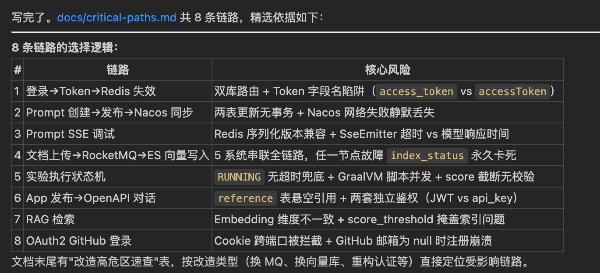
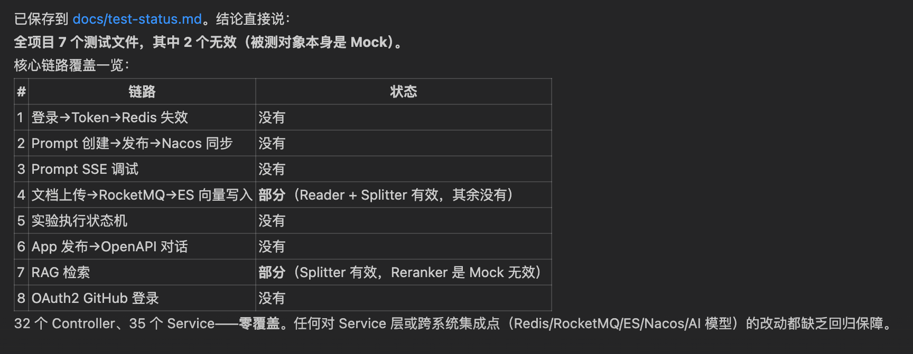
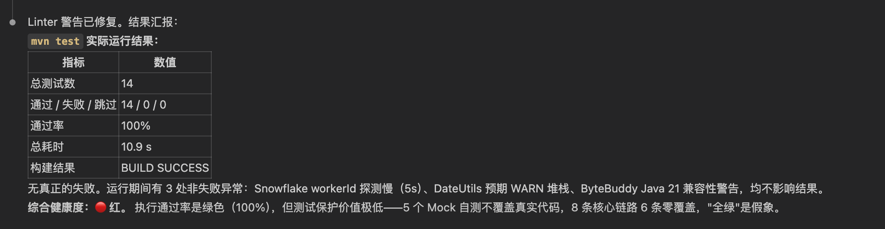
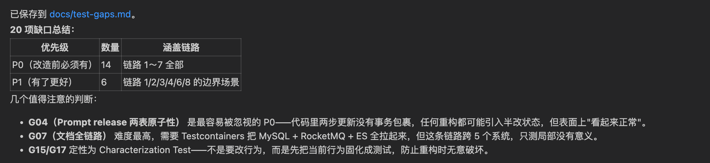
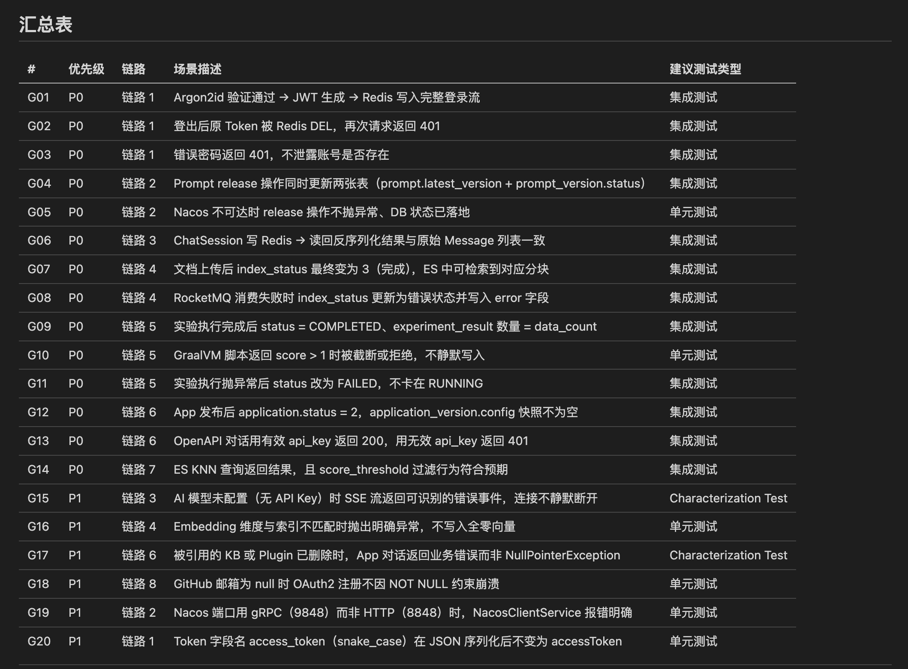

# 14｜摸清现有测试：能跑通吗？覆盖度怎样？

**作者：Robert**

🎧 **文章音频**: [🎧 点击播放：_assets/977594.mp3]


> 老项目改造的护栏，不是测试覆盖率指标，是改造路径上的关键节点都有兜底。

你好，我是 Robert。

13 讲跑完，应用活在你电脑上。中间件起来了、应用编译启动了、核心接口 curl 通了。看起来万事俱备，可以动手改造了。

**别急，还差一步：摸清测试**。

老项目改造里最常见的事故是这样的：你让 AI 帮你改一个 service 方法，AI 改完一行，悄悄改坏了五行。如果没测试，这五行被改坏的事实你两周后才能发现。可能是某个对接方报 bug 来找你，可能是上线后客诉，可能是某个边角接口跑不出预期值。

这种事故的根源，05 讲讲业界综述时说过：Sonar 数据显示 **96% 的开发者不完全信任 AI 输出，但只有 48% 每次都 review**。中间这 48% 的差距叫验证债。老项目里这个债更深，因为老项目通常没多少测试，AI 改完没人能验证。

这一讲做的事，不是补测试（那是 15 讲的事），是摸清现状：这个项目应该测什么、现在测了什么、缺口在哪里。

学完这一讲你会知道：动手改造之前，至少要补哪几条测试，AI 才能放心地改。

## 为什么先“摸”再“补”

你可能会想，缺测试就直接补呗，为什么要先花一讲摸底？因为**没摸清就开始补，多数会补错地方**。

AI 默认会按通用代码质量标准给你列一堆“应该补的测试”：每个 controller 加单元测试、每个 service 加 mock、每个 util 加边界测试。这些列出来就是 200 条。看起来都合理，但你根本没法补完。

老项目改造的目标不是“达到 80% 覆盖率”，是“改造路径上的关键节点都有兜底”。这两个目标差别巨大：

1. 通用目标（覆盖率）：补到死、补不完，改造迟迟动不了。
2. 改造目标（关键路径）：聚焦、可控，能让改造启动。

**所以摸底要解决的是“什么是关键路径”这个问题**。回答了它，缺口清单自然就收敛到一个可执行的范围（5-10 项 P0，不是 200 项 P0）。

这一讲就是把“什么是关键路径”和“现状离它差多远”两件事讲清楚。

## 摸底四步法

四步走：摸核心链路 → 摸现有测试 → 跑一遍看实际状态 → 算出缺口清单。

每一步对应一份资产，最终 docs/ 里多三份新资料。

### Step 1：摸核心链路

先回答“应该测什么”。

让 AI 基于前面的资产（接口清单、数据模型、CLAUDE.md），找出这个项目里**最值得测的核心链路**。

**提示词**：

```plain
基于 docs/api-list.md、docs/data-model.md、CLAUDE.md，给我列出
这个项目最值得测的核心链路。要求：
- 总数不超过 8 条，宁少勿多
- 必须是"改造时容易出问题"的链路，不是所有链路
- 每条写：链路名、起点（哪个接口）、关键节点（哪些 service / DB 操作）、
终点（什么状态算成功）

输出用表格总结。保存到 docs/critical-paths.md。
```

产出：`docs/critical-paths.md`。

产出如下。你会发现就是8条，而且如果你对这个项目熟悉，就会发现这8条就是核心链路了。

  
review 重点：

* **是不是真的核心**。Spring AI Alibaba Admin 的核心链路应该包括登录、Prompt 创建和运行、Dataset 创建和导入、Evaluator 跑批、实验执行、Trace 写入这几条。账号详情查询、Trace 列表分页这种不算核心。如果 AI 列出“账号信息修改”作为核心链路，要让它重新选。
* **起点和终点要明确**。一条链路不能含糊地写“用户登录后做事”。要写清楚“POST /console/v1/auth/login → 校验密码 → 写入 Token → 返回 200 + accessToken”。这种明确的描述才能直接转成测试断言。

### Step 2：摸现有测试

再回答“现在测了什么”。

**提示词**：

```plain
扫一下项目里所有的测试目录（src/test、tests/、e2e/ 等），
统计现有测试情况。要求：
- 单元测试 / 集成测试 / E2E 各多少个文件
- 哪些 Controller 有对应的测试，哪些没有
- 哪些核心 Service 有测试，哪些没有
- 不要给覆盖率百分比，那是 JaCoCo 干的事
- 不要列出每个测试方法，只关注"哪些核心链路被覆盖"

对照 docs/critical-paths.md，标出每条核心链路当前的测试覆盖情况（有 / 部分 / 没有）。
输出用表格总结。
保存到 docs/test-status.md。
```

产出：`docs/test-status.md`。跑出的结果是：



你会发现，这个项目其实也非常缺测试，这是非常典型的情况。大部分的项目基本是没有测试的，质量基本靠人，而靠人靠不住，嘿嘿。所以AI是我们最好的战友了。

**review 重点**：

* AI 容易把“有测试文件”等同于“链路被覆盖”。比如 PromptControllerTest.java 存在不代表 Prompt 创建链路被测了，可能这个测试只测了一个简单的 GET 接口。让 AI **按链路验证**，不是按文件验证。

老项目最常见的现象：测试文件不少，但真正覆盖核心链路的不到一半。这一步要诚实暴露这个事实。

### Step 3：跑一遍看实际状态

虽然不多，但还是多多少少有一些测试的。所以**前面两步是看代码静态分析，这一步看动态执行结果**。老项目里测试文件存在不代表能跑，十年没维护的测试，跑起来一半失败、一半跳过是常态。

**提示词**：

```plain
跑一遍 mvn test（或项目的标准测试命令），统计真实结果：
- 通过 / 失败 / 跳过 各多少
- 失败的分类：代码 bug / 测试本身坏了 / 环境问题
- 跑总耗时多少
- 不要试图修复失败的测试，只汇报状态

最后给一个"测试健康度"的判断：绿（90% 通过）/ 黄（60-90%）/红（< 60%）。
输出用表格总结。
追加到 docs/test-status.md 的"实际运行结果"小节。
```

产出：追加到 `docs/test-status.md`。从结果来看，一个直观的结论，测试用例太少了，需要补。



review 重点：

* **失败分类要靠谱**。AI 容易把所有失败都归类成“环境问题”，让你觉得没大事。要追问“代码 bug 类型的失败有几个？具体是哪些？”。一个真正的代码 bug 类失败，就值得马上停下来确认。
* **不要被乐观结论骗了**。“绝大多数测试通过”听起来很好，但如果跳过的有 30%、失败的有 10%，那真实健康度是黄、甚至红，不是绿。让 AI 把跳过的和失败的合在一起看健康度。

### Step 4：算出缺口清单

所以接下来最关键的一步。对照 Step 1 的“应该测什么”和 Step 2-3 的“实际测了什么”，算出缺口。

这一步对提示词的约束尤其严格。AI 默认会输出 200 项“建议补”，必须把它压到一个可执行的范围。

**提示词**：

```plain
对照 docs/critical-paths.md（应该测什么）和 docs/test-status.md
（现在测了什么），算出测试缺口。

严格遵守以下原则：
- 总数不超过 20 项，宁少勿多
- 只列在核心链路上的缺口，不在主链路上的不要列
- 每项标 P0（改造前必须有）/ P1（有了更好）
- 不要追求覆盖率指标，追求"关键路径有兜底"
- 每项写：场景描述、为什么必须、建议测试类型（集成 / 单元 / Characterization Test）

输出用表格总结。保存到 docs/test-gaps.md。
```

产出：`docs/test-gaps.md`。输出如下：

  
到这里，其实你会发现，你已经把测试用例摸底得差不多了。如果你足够用心，就会发现，你对 Spring AI Alibaba Admin 这个项目的功能也会有充分的了解，因为测试是跟着功能走的。

review 重点：

* **P0 数量控制在 5-10 个**。如果 AI 给了 15 个 P0，要追问“哪几个必须改造前有，哪几个改造中补也来得及”，让它再砍一刀。
* **P0 必须对应明确的核心链路**。每个 P0 都要能直接回答“如果不补这个，AI 改了什么我会发现不了”。回答不了的不是 P0。
* **P1 不超过 10 个**。剩下的所有想得到的测试缺口写在备注里就好，不进缺口清单。

## 最大的坑：不要让 AI 大而全

这一讲我必须单独留一节强调这件事，**老项目摸测试最容易翻车的点是 AI 大而全**。第一版让它出测试缺口，它一定会列 100+ 项给你。看起来都合理，但你看完只有一个感觉：补不动，干脆不补了。

这是老项目改造里最常见的“被 AI 推着走偏”的场景：**AI 给了一份“完美但不可执行”的清单，你要么硬补到怀疑人生，要么放弃整个补测试这件事。两个结果都不对**。

约束 AI 不要大而全的三条原则：

1. **数量上限**。每个产出文件都明确写“不超过 X 项”。Step 1 不超过 8 条核心链路，Step 4 不超过 20 项缺口清单（P0 上限 10 个）。AI 看到具体数字，真的会去筛选。
2. **关联核心路径**。“不在主链路上的不要列”，这一句必须写进提示词。没这一句，AI 会按通用代码质量标准列出每个 util 函数都该有边界测试。
3. **优先级强制分层**。P0 / P1 必须分开列，混在一起 AI 会把“建议补的”和“必须补的”搅成一锅粥，让你无从下手。

如果第一版输出还是过多，直接说“P0 砍到 5 个、P1 砍到 10 个，砍掉多余的”。AI 会按你的限制重新筛选，砍完后会显著更聚焦。

**这一招也适用于其他实操内容**。老项目改造里只要让 AI 列清单，记得加这三条约束，避免被大而全反噬。

## 小结

这一讲做了一件事：**摸清这个项目的测试现状，算出动手改造前必须补的测试缺口**。

四步法：摸核心链路 → 摸现有测试 → 跑一遍看实际状态 → 算出缺口清单。每一步都让 AI 在严格约束下产出，避免大而全。

跑完这一讲，docs/ 里多三份资产：critical-paths.md（应该测什么）、test-status.md（现在测了什么）、test-gaps.md（缺什么、必须补什么、有了更好的有什么）。

加上 13 讲的环境产出，第三部分到这里完成了“环境跑通 + 测试摸清”两件事。下一讲我们基于 test-gaps.md 真正补出测试，特别是 Characterization Test 这种锁住老项目“现实行为”的方法。补完之后改造前的护栏就齐了。

**老项目改造的护栏，不是测试覆盖率指标，是改造路径上的关键节点都有兜底。摸清比补全重要十倍。**

## 思考题

1. 你手上项目如果让 AI 出一份测试缺口清单，你预测它会给多少项？这些项里你判断真正必须改造前补的有几项？这两个数字之间的差距，反映了什么？
2. 你们团队现在跑测试是绿、黄、还是红？如果是黄或红，是因为代码本身有 bug 还是测试本身没维护？这两种情况你会怎么处理？

欢迎在评论区把你的答案写出来。如果今天的课程让你有所收获，也欢迎转发给有需要的朋友，邀请他来一起学习，我们下节课再见！
