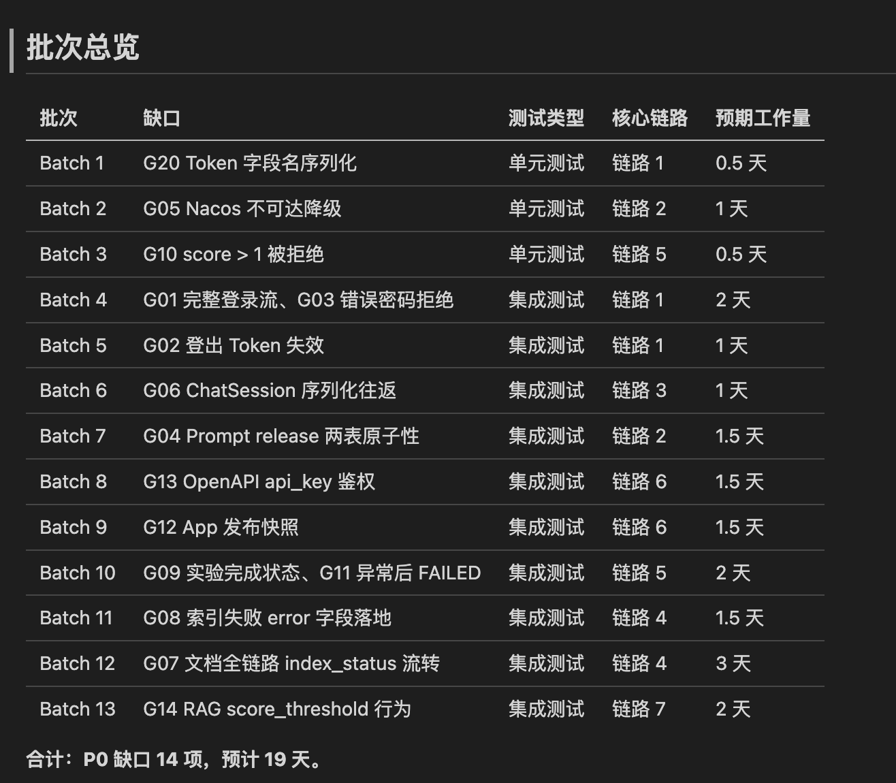
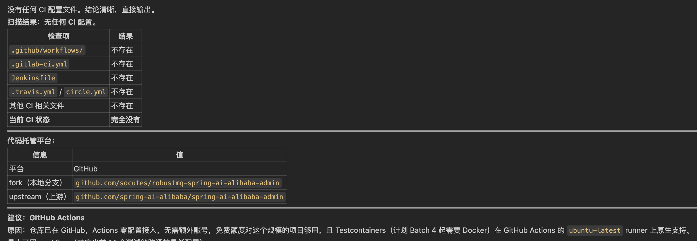
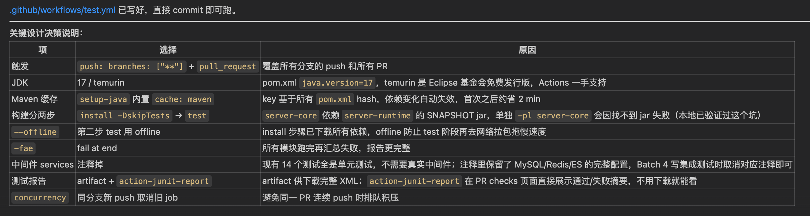
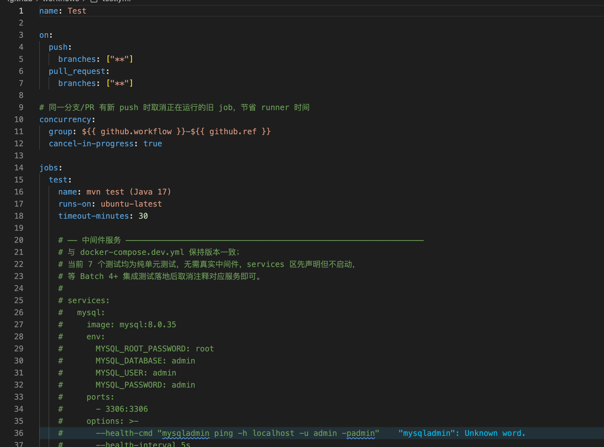

# 15｜补出一套兜底测试：让 AI 用 Characterization Test 锁住行为

**作者：Robert**

🎧 **文章音频**: [🎧 点击播放：_assets/978185.mp3]


> 老项目改造的目标不是 80% 测试覆盖率，是改造路径上的关键节点都有兜底。

你好，我是 Robert。

14 讲跑完，你手上有一份 `docs/test-gaps.md`，里面是动手改造之前必须补的测试缺口清单。

如果你的项目本来就有一些测试，那 15 讲对你来说很轻，按缺口清单一项一项让 AI 补就行。

但更多同学面对的是另一种情况：**项目几乎没测试，或者 14 讲跑出来发现测试根本不能跑**。这种情况下“补”的工作量大到让人退缩。这一讲就是为这种情况写的。

## 为什么以前没人补，现在能补了

老项目里“该补测试但没补”是常态。不是工程师不想补，是这件事性价比太低。

写测试是工程师最不愿意做的事之一。没业务价值、没产出感、老板不催、自己也不想干。一个 controller 写一组测试要半天，整个项目补完一个月都不够。最后变成“知道应该有但永远没有”的状态。

AI 改变了这件事的成本结构。AI 写一组测试是分钟级的事，不是半天。AI 能基于现有代码反推预期行为、能跑测试看失败、能自动调整。这件事第一次真正有解。

但 AI 也有它的问题：**默认会“大而全”补一堆不必要的测试**（这是 14 讲反复强调的事）。所以光有 AI 还不够，还要**控制 AI 补的范围和节奏**。

15 讲教的就是这个控制。学完你会知道三件事：**该不该补、要补哪些、怎么补**。

## 该不该补：先做决策

不是所有项目都需要立刻补测试。先回答这个决策问题。

**必须补的情况**：

即将动手改造的接口或链路目前没测试。改造完之后没办法验证有没有改坏。改造涉及核心业务逻辑（计费、权限、数据写入）。这三种情况下不补就是裸奔。AI 改了什么、改没改坏，全凭运气。

**可以暂时不补的情况**：

改造范围非常小（改一个 log 输出、改一个文案）。改造涉及的代码本身就被高质量集成测试覆盖了。项目即将下线或重写，改造只是临时维持。这三种情况补测试是浪费时间，够用就停。

判断的核心是 04 讲的“够用就停”心法。**老项目改造的目标不是 80% 测试覆盖率，是改造路径上的关键节点都有兜底**。两个目标差别巨大：前者补到死、补不完；后者聚焦、可控、能让改造启动。

回到 14 讲的 test-gaps.md：里面的 P0 项就是必须补的，P1 项可以暂时放着。先按 P0 走。

## 要补哪些：按价值排优先级

决策完该补，下一步是排顺序。同样的工作量补不同类型的测试，价值差几倍。

**优先级一：改造路径上的 Characterization Test**

如果接下来要改 `PromptService.create()`，先给它加一个 Characterization Test 锁住当前行为。

Characterization Test 是 Michael Feathers 在 *Working Effectively with Legacy Code* 里提的方法（05 讲业界综述讲过）。它的核心思想反直觉：**不是测代码“应该做什么”，是锁住代码“现在实际做什么”**。

具体怎么做：先让代码跑一遍，记录它实际的输入输出。把这个行为转成测试断言。改造前跑一次记录基线，改造后跑一次看有没有偏移。

这种测试在老项目里特别有用，因为老项目的“应该做什么”经常没人说得清，但“现在实际做什么”是确定的。锁住“现在”，改造后只要行为没变就放心。

**优先级二：核心数据写入的集成测试**

登录、Prompt 创建、Dataset 写入这种“数据进库”的核心链路，集成测试比单元测试值钱。

集成测试覆盖一条完整链路（HTTP → Service → DB），改造时一条集成测试比十个单元测试更能兜底。AI 改了 Service 层但 DAO 层挂了？集成测试一跑就发现，单元测试可能各自都过但合起来挂。

**优先级三：业务逻辑复杂的单元测试**

算分、状态流转、权限校验这种纯逻辑代码值得加单元测试。逻辑分支多，集成测试不好覆盖所有分支，单元测试能精准命中边界。

**优先级四（其实可以不补）：简单 CRUD 的单元测试**

getter/setter、简单 SELECT 这种放最后甚至不补。AI 改这种代码出错的概率本来就低，加测试是性价比最差的。

四个优先级合起来一句话：**改造路径上的 Characterization > 核心链路集成 > 复杂逻辑单元 > 简单 CRUD（可不补）**。

## 怎么补：两步走，每批严格控量

实操核心。两步走。

### Step 1：让 AI 出补测试计划

把 14 讲的 test-gaps.md 拆成可执行的批次。

**提示词**：

```plain
基于 docs/test-gaps.md，把 P0 缺口拆成多批，每批 1-3 个（最好 1 个），
给我一份补测试计划。每批写：批次号、测试类型（Characterization
Test / 集成测试 / 单元测试）、覆盖的核心链路、预期工作量。

按"改造路径上的 Characterization > 核心链路集成 > 复杂逻辑单元"的顺序排批次。
简单 CRUD 不进计划。

输出用表格总结。保存到 docs/test-plan.md。
```

产出：`docs/test-plan.md`。给你看看跑出来的效果，蛮好的。从第二列，你就可以读取好多信息。

说句题外话，**到了这里，你会发现在不断来回的过程中，你的信息越来越全，AI 的信息也越来越全。此时就是我们前面说的，60 分到 80 分的过程。所以重点不是一句话让 AI 给我搞定，而是一个方法论，一个固定的步骤。**而这门课想教给你的就是这个方法论和这个步骤。我的目的是，让你能抄作业，拿着提示词就能干活。



review 重点：

* 每批严格 1-3 个不能更多，最好就 1 个一批。
* 批次顺序按价值优先级。
* 简单 CRUD 真的没进计划。

### Step 2：让 AI 一批一批补

不要让 AI 一口气把所有批次补完。一批补完跑通，人 review 通过，再开下一批。

**提示词**：

```plain
按 docs/test-plan.md 的第 1 批，给项目补出对应的测试。

对 Characterization Test 类型：先跑一次现有代码记录实际行为，
再把行为转成断言。不要凭"应该是什么"写断言，凭"实际是什么"写。

对集成测试类型：需要真实启动应用 + 数据库。
用 SpringBootTest 的方式起完整 context 跑。

补完跑一遍 mvn test 确保都通过。
输出用表格总结每个测试覆盖的场景、预期结果、实际跑出来的状态。
```

产出：第 1 批 1-3 个测试 + 测试运行结果汇总。这里我就不一一输出结果了，你可以拿着提示词，自己去试试。

review 重点（这一步最关键）：

* **测试是不是测了“现在实际做什么”**。这是 Characterization Test 的灵魂。如果你看到 AI 写的测试断言“`amount` 应该等于 100”这种基于“应该”的断言，要追问“100 是从哪来的？是跑代码跑出来的，还是你猜的？”。AI 经常会贴心地用业务直觉补断言，这反而是最危险的。
* **测试覆盖的场景对不对**。AI 容易补一堆 happy path，忽略 edge case。如果 14 讲的 test-gaps.md 里某条说“测试空入参的处理”，要确认这条真的有对应的测试，不是被 AI 默认 skip 掉了。
* **测试都能跑通嘛。**失败的测试不能进下一批。要么修代码、要么修测试、要么承认这条暂时跑不了先标记，三选一。

review 通过后再开第 2 批。

第 2 批的提示词稍微调整一下：让 AI **参考第 1 批的风格继续写**。这样整套测试一致性强，方便后续维护。

```plain
按 docs/test-plan.md 的第 2 批补测试，
参考第 1 批已经跑通的测试风格，保持一致。
其他要求同前。
```

## 让 CI 当你的兜底护栏

测试补完了，但还差最关键的一步：**让这套测试真正持续跑起来**。

很多团队的悲剧故事是这样的：花两周辛苦补了一套测试，跑通了，commit 进仓库，结束。三个月后某次改造把代码改坏了，测试明明能发现，但没人主动跑测试，bug 就这么进了生产。

测试不持续跑等于白补。让测试持续跑的标准做法是 **CI（Continuous Integration）**：每次 push 代码、每次提 PR，CI 系统自动跑全部测试，失败就拦着不让 merge。

为什么这件事在 AI 时代特别值得做？

1. **CI 配置高度标准化**。无论 GitHub Actions 还是 GitLab CI，配置文件就那么几样东西：触发条件（哪些分支 push 触发）、运行环境（什么镜像、什么 JDK 版本）、跑什么命令（`mvn test`）、产物存哪（测试报告、覆盖率）。**AI 写这种标准化配置文件特别准**，因为它见过无数个类似的项目。你自己写要查文档查半天，AI 30 秒搞定。
2. **CI 是改造的长期复利**。你今天花 30 分钟让 AI 写好 CI 配置，未来每一次 push、每一次同事 PR、每一次自己 merge，都自动跑一遍测试。一年下来这件事运行了上千次。**前期一次性投入 30 分钟，换长期上千次自动检查**，性价比之王。
3. **CI 让测试这件事从自觉变成强制**。靠自觉跑测试这件事在团队里是不可持续的，deadline 紧的时候第一个被砍的就是测试。但 CI 失败 block merge，没人能跳过。**强制比自觉可靠十倍**。

具体怎么做？让 AI 先扫一下项目，再写一份贴合项目的 CI 配置。

### Step 1：让 AI 分析项目当前的 CI 状态

**提示词**：

```plain
扫一下项目里有没有现成的 CI 配置
（看 .github/workflows/、.gitlab-ci.yml、Jenkinsfile、circle.yml 之类）。
如果有，告诉我现在跑了什么、什么时候触发、有没有跑测试。
如果没有，告诉我项目代码托管在哪个平台，建议用哪种 CI。

输出用表格总结。
```

产出如下，你会发现，这个项目根本没配置 Git CI。这也从某个角度说明了，这个项目不是那么的成熟。**这不就是我们自己公司内的老项目的常态吗？这也是我选择讲解这个项目的原因。**



CI 现状分析，三种典型情况：

* 项目有 CI 但没跑测试：补 test job 就行
* 项目完全没 CI：从零建一份
* 项目有 CI 也跑了测试但配置过期：升级配置

### Step 2：让 AI 写完整的 CI workflow

**提示词**：

```plain
基于上一步的分析，给我写一份完整的 CI workflow。要求：
- 触发条件：push 到任何分支 + 提 PR 时
- 运行环境：用项目对应的 JDK 版本（看 pom.xml 里 java.version）
- 启动需要的中间件（参考 docker-compose.dev.yml）
- 跑 mvn clean test，失败就 block merge
- 输出测试报告到 CI artifact 区方便 review
- 加合理的 cache（Maven 依赖缓存）让跑得快一点

输出完整的 .github/workflows/test.yml（或对应平台的配置文件），
我直接 commit 进仓库就能跑。
```

产出：`.github/workflows/test.yml` 或 `.gitlab-ci.yml`。结果如下。  
**我想提醒的是，建议你深入去学习下 Git 的 Workflow，这真是一个神器。**



review 重点：

* **触发条件对不对**。push 任何分支 + PR 是基础配置。如果你团队规定“只有 develop 和 master 分支跑 CI 节省额度”，让 AI 调整。
* **中间件配置完整**。CI 跑集成测试需要 MySQL / Nacos 这些中间件起来。AI 应该用 `services` 字段把这些中间件配进去（GitHub Actions 支持这种），不是默认期待中间件已经存在。
* **JDK 版本对**。项目要 17 别给写成 21。AI 容易用最新版本，要让它读 pom.xml 里 `<java.version>` 严格对齐。

### Step 3：跑通 CI

push 代码触发一次 CI，看是不是真的跑过了。常见失败：

* 中间件起不来（CI 环境网络问题、版本不匹配）
* Maven 镜像源访问不到（特别是国内项目，CI 默认用 maven central 慢）
* 测试在本地通过但 CI 上失败（环境差异，比如本地有缓存但 CI 没有）

每个失败让 AI 自己 debug 自己改。CI 跑通的那一刻，**这套测试从“个人资产”变成了“团队级护栏”**。

跑通之后，14 讲列出的 P0 缺口、15 讲补出的测试，全部进入“自动守护”状态。改造时谁不小心改坏了什么，CI 立刻报错、PR 被 block。这是改造前能给自己最值钱的东西。

## 最容易翻车的点：不要让 AI 一口气补

最后，我想再强调一件事。

老项目补测试最大的风险：让 AI 一口气补一二十个测试，跑下来一半失败一半通过。问题来了，你没法判断哪些测试是对的、哪些是 AI 瞎写的。整批不可信，等于白做。

**正确节奏：每批 1-3 个（最好 1 个），跑通一批 review 一批，review 通过再下一批**。慢，但每一批都是可信资产。一次看一两个测试你能仔细看，一次看十个就只能扫一眼放过。

另外，review 时要重点看一件事：测试是不是测了“现在实际做什么”，不是测了“AI 觉得应该做什么”。这是 Characterization Test 的灵魂。

为什么这条这么重要？因为 AI 写测试有一个隐性偏差：**它会用业务直觉补断言。**它读了你的代码，猜你的业务意图，然后按“应该”写断言。但老项目的代码经常和“应该”不一致，那些不一致的地方往往是历史包袱、是对接方依赖、是禁区（10 讲的 CLAUDE.md 灵魂两节）。AI 按“应该”写出来的测试一跑代码就失败，让你以为代码有 bug，**实际上是测试错了**。

防止这个的唯一办法：**强制 AI 先跑代码记录实际行为，再把实际行为转成断言**。提示词里那句：不要凭“应该是什么”写断言，凭“实际是什么”写，是最关键的一句。

如果你跑出来一批测试发现失败率高，AI 又改了好几轮还是失败，先停下来检查：是不是 AI 写的断言基于“应该”而不是“实际”？多数时候问题在这里。

## 小结

这一讲回答了三个问题。

**该不该补**：按改造路径判断。即将改的、改完没法验证的、涉及核心业务逻辑的，必须补。改 log 输出这种小改动可以不补，够用就停。

**要补哪些**：按价值排优先级。改造路径上的 Characterization Test > 核心链路集成测试 > 复杂逻辑单元测试 > 简单 CRUD（可不补）。

**怎么补**：两步走加一道护栏。AI 出计划 → 一批一批补（每批 1-3 个，跑通 review 通过再下一批）→ 配 CI 让测试持续自动跑。

整个过程的核心约束是 14 讲讲过的“不要大而全”，加上 15 讲新加的“不要一口气”。不大而全靠数量上限，不一口气靠分批 review。

这两条加起来，老项目补测试这件事第一次从“知道应该做但永远做不完”变成“几天就能做完，且做完就有可信的护栏”。

**AI 写测试 = 不再有借口拖延**。以前不补是因为成本太高，现在 AI 把成本降到零。从今天起，改造前没护栏，不能再怪工作量了，只能怪自己的判断。

跑完这一讲，第三部分的方法论全部讲完。docs/ 里的资产、scripts/ 下的脚本、CI 里的护栏全部到位。改造前的所有准备工作都搞定了。

下一讲是第三部分的实操课，我会把 13-15 讲的提示词全部串起来，在 Spring AI Alibaba Admin 上跑一遍完整流程。跑完 16 讲，第三部分收尾，第四部分就要开始真正动手做需求改造了。

## 思考题

1. 你手上项目最近一次改造，有没有出现过“AI 改了什么悄悄改坏”的事？如果当时有 Characterization Test 锁住改造路径，会不会发现得更早？
2. “AI 写测试 = 不再有借口拖延”这句话你认同吗？如果认同，你打算从哪个项目、哪条核心链路开始补？如果不认同，你认为还有什么因素让团队拖着不补测试？

欢迎在评论区把你的答案写出来。如果今天的课程让你有所收获，也欢迎转发给有需要的朋友，邀请他来一起学习，我们下节课再见！

---

## 精选评论

**大卫**: 如果老项目底层数据访问层改动了，对外接口没动是不是通过流量录制回访也ok，还需要补齐ut么

> **作者回复**: 是的，“流量录制回放”也可以。但是我建议还是要不足ut。因为ut的测试更轻量，场景更丰富，能发现更多问题，也能更快解决。
> 
> 本质上“流量录制回放”和ut的作用时不一样的。虽然流量回放游泳，但是我建议ut得加。


---

**大卫**: 老师，要将老项目底层dao 各种散落mapper repo 迁移到基础rpc服务上，对外rpc接口较多但协议不动仅改dao层，分策略大规模迁移，这类补测试如何补呢，如何覆盖到repo，如果用spock test，单纯mock repo可能覆盖不到改动的测试了

> **作者回复**: 我建议的是还是两层：
> 1. ut：也就是针对dao层的单元测试
> 2. 集成测试，也就是rpc接口测试，通过对rpc的接口的类似crud的测试，保证接口的逻辑符合预期。因为协议不动，所以输入输出是固定的，这块测试起来应该比较快，AI可以快速搞定。
> 
> 要覆盖repo的话，我觉得就是接口粒度的测试。
> 
> “如果用spock test，单纯mock repo可能覆盖不到改动的测试” 这句话我没太理解哈。理论上不是可以覆盖的嘛？


---

**Zhong.Sir**: 如果AI补充这个测试案例时，测试通过了，实际运行却没有通过（假绿）的问题，如果经常出现这种问题，人 review也很累，这个主要是通过要求AI使用下面的提示词进行分析么：“
对 Characterization Test 类型：先跑一次现有代码记录实际行为，再把行为转成断言。不要凭"应该是什么"写断言，凭"实际是什么"写。”

还需要增加哪些提示词或者步骤？

> **作者回复**: “测试通过了，实际运行却没有通过（假绿）的问题”，这算是一个bug了。AI 执行出错。
> 
> 我自己的行为一般是：先判断哪些主链路的功能要测试。单测我一般全部交给AI。但是写出来的单测我都会看，看逻辑是否对。不看的话错了也不知道。有一种思路是，定义好输入和输出，让AI根据输入和输出来校验。也可以让AI来来生成输入和输出。然后让它写代码。
> 
> 也就是分两步，让AI分析要做哪些测试，输入输出是什么。你只要review这部分就可以。然后让AI去写测试，然后你做一个简单的review。

