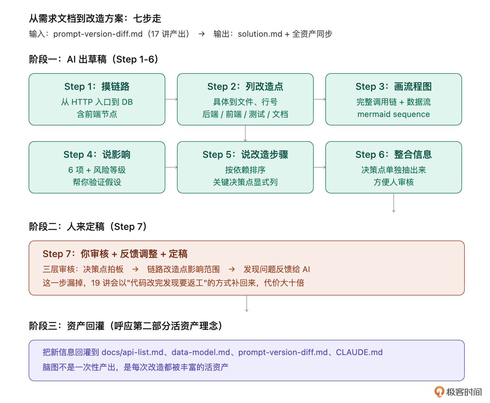
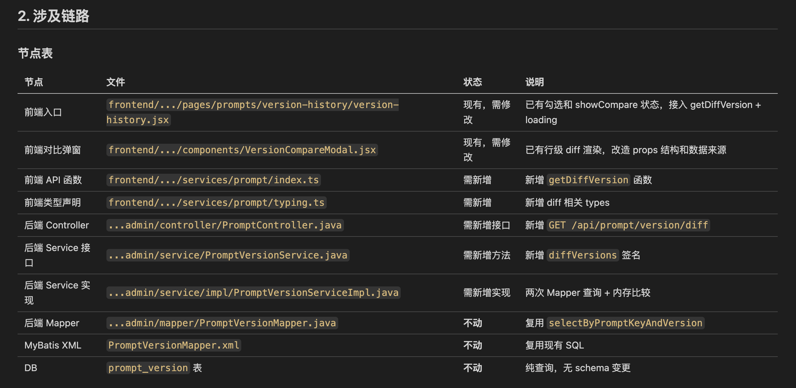
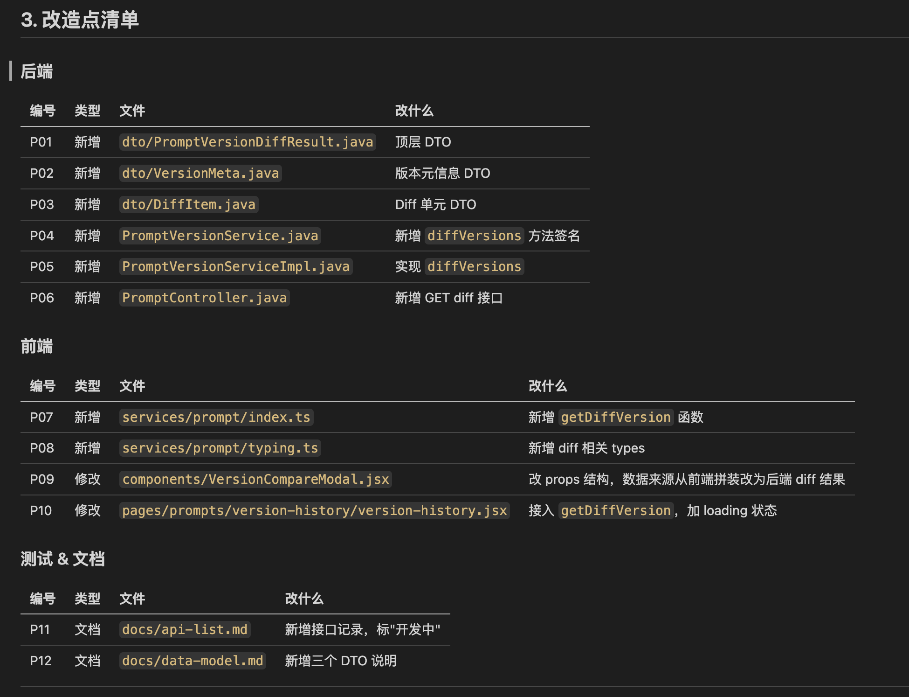
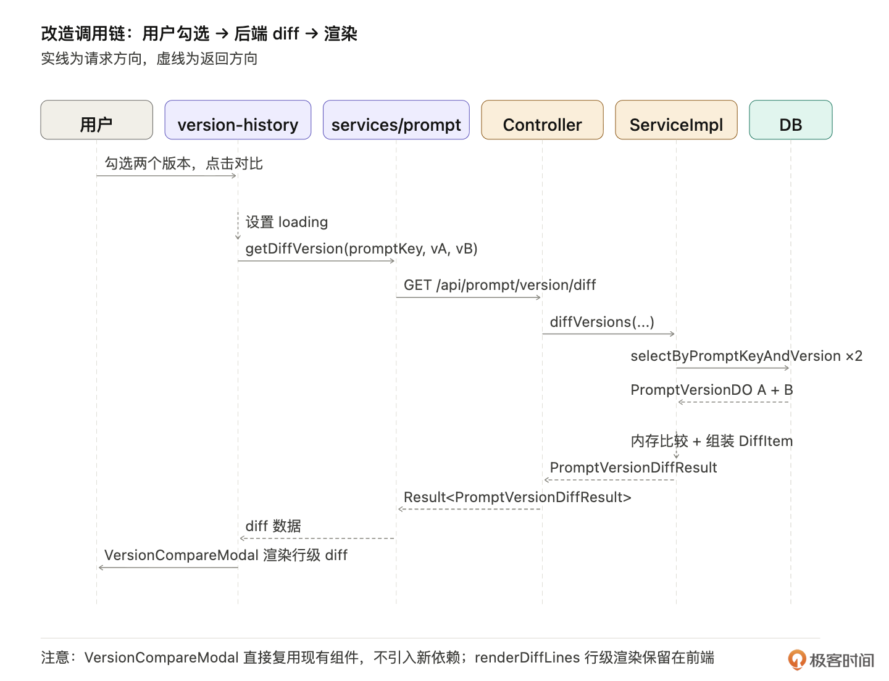
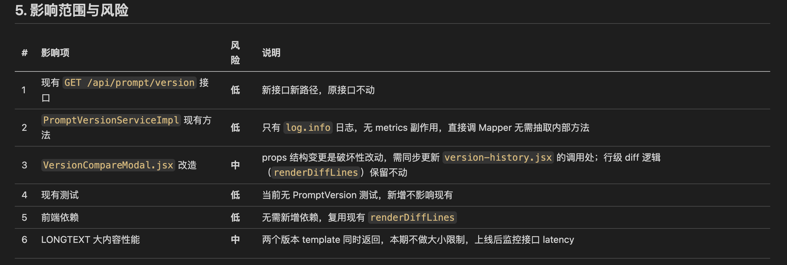
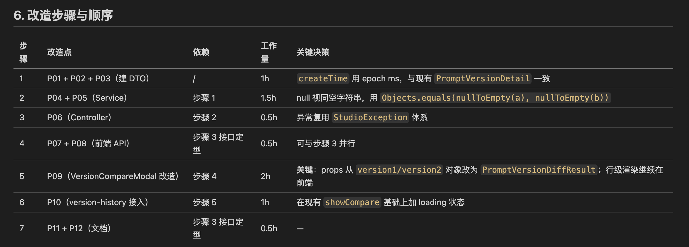
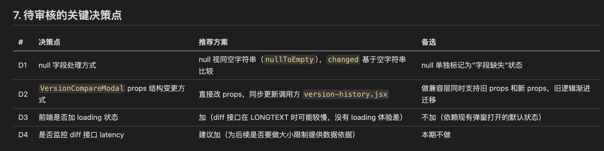
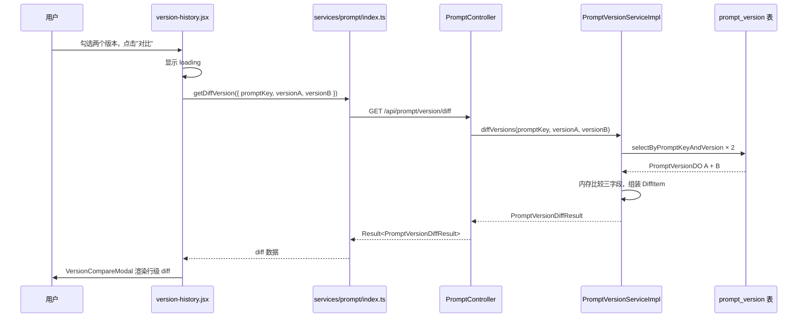
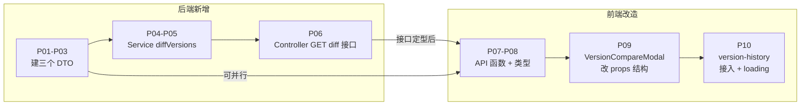

# 18｜从需求文档到改造方案：让 AI 帮你把改造想透

**作者：Robert**

🎧 **文章音频**: [🎧 点击播放：_assets/978730.mp3]

> 让 AI 把改造想透，你审核拍板，60 分钟出一份方案文档。

你好，我是 Robert。

上一讲我们完成了需求文档的整理，接下来是不是动手写代码了呢？依然不是。需求清楚不等于可以开始开发。因为需求讲“做什么”、改造讲“怎么改”，中间隔着一份方案文档。**这一讲就教你怎么用 AI 把这份方案文档跑出来**。

## 这一步要解决什么问题

需求文档拿到手，我们常做的一件事是：扫一眼、心里大概有数，然后直接上手写代码。其实这个思路本身是没问题的，但是这个操作很看开发者的水平和经验。这也是**老项目改造里最常见的翻车原因**。

因为老项目不是新项目，“心里大概有数”远远不够。比如你以为只改一个 Controller，实际牵动整条链路（Service / DAO / 配置 / 异常处理 / 测试）；你以为这次只动后端，实际前端要加按钮、加组件、加调用；这些坑不在动手前想清楚，就在动手中、动手后才发现。代价是返工。

接下来我们的思路是：**让 AI 帮你把“怎么改”一次性展开**。AI 读现有代码、画链路、列改造点、说影响、说改造步骤，最后整合成一份方案文档让你审。你看着方案文档审核、补漏、调整，才动手写代码。

两个特别要注意的点：

1. **让 AI 显式考虑前端**。AI 默认只看接口层，会把改造缩成“加一个后端接口”，但有些老项目改造需要涉及前端，所以提示词必须明确要求 AI 考虑前端调整，不然会漏掉前端的工作量。
2. **让 AI 整合信息聚焦给你审**。前面几步 AI 会输出一堆零散内容（链路、改造点、流程图、影响、步骤），最后必须让 AI 把这些整合成一份结构清晰、易于审核的方案文档。AI 默认会平铺直叙，你要明确要求“按改造方案标准格式整合”。

## 七步走

从逻辑上看，这一讲的内容很固定，对所有项目基本是通用的。如下所示，主要分为7步。



### Step 1：让 AI 摸出改造涉及的链路

动手前我们要先看清“这次改动会牵动哪条链路”。一条链路从 HTTP 入口到 DB 落地，每个节点上有什么现有逻辑、哪些是不能破坏的、哪些是要新增的。

**提示词**：

```plain
基于 docs/requirements/prompt-version-diff.md 的需求，扫一下代码：
- 找出这次改造涉及的完整链路（从 HTTP 入口到 DB 查询）
- 每个节点说明：文件、类、方法、关键逻辑（只看相关的）
- 标出"现有节点"和"需要新增/修改的节点"
- 不要漏前端节点（前端入口、调用、组件）

输出用表格 + 链路图（可以是 mermaid）。
保存到 docs/requirements/prompt-version-diff-impact.md。
```

产出片段（链路表格）：

  
如上图所示，可以看到 AI 扫出来的**前端节点有两个是现有代码**：`version-history.jsx` 已经有勾选交互和 `showCompare` 状态，`VersionCompareModal.jsx` 已经实现了行级 diff 渲染（`renderDiffLines`）。这正是“显式要求考虑前端”那一句提示词的效果，AI 扫出来了已有组件，**不需要新建**，改造成本比预期低。如果不强调前端，AI 默认会跳过这些，直接从后端 Controller 开始列。

这里你会发现输出特别清晰，原因是提示词约束的很清晰。

review 有 2 个重点：

1. **前端节点列得对不对**。关键是要区分“现有节点（需修改）”和“不存在（需新建）”。如果 AI 把现有组件标成“需新建”，你要核查实际文件是否已经存在。
2. **链路完整性**。从 HTTP 入到 DB 出有没有断点。AI 容易跳过中间的拦截器、AOP 切面、统一异常处理这些“非主链路但相关”的节点。

### Step 2：让 AI 列出所有改造点

链路清楚了，下一步把每个节点上的具体改造点列出来。

**提示词**：

```plain
基于上一步的链路分析，把整个改造拆成具体的改造点列表。
每条改造点写：
- 编号（P01, P02, ...）
- 类型：新增 / 修改 / 测试 / 文档
- 涉及文件（路径 + 大概行号）
- 改什么（一句话说清）

后端、前端、测试、文档都列出来，不要漏前端工作量。

输出用表格，追加到 prompt-version-diff-impact.md。
```

产出片段（改造点表格）：

  
可以看到 AI 这次输出 **12 条改造点，没有引入新前端依赖**（比如 react-diff-viewer），也没有 i18n 文件变更。原因是链路扫描发现 `VersionCompareModal.jsx` 已经实现了 `renderDiffLines` 行级渲染，**完全不需要新建组件或引入新库**。

如果你的需求里 AI 凑出来了“引入 react-diff-viewer”，但实际项目已经有类似组件，Step 1 的链路扫描就是用来防止这种重复造轮子的。

review 重点：

1. **前端列得齐不齐**。P07-P10 四条都是前端。要特别检查 AI 有没有把“现有组件改造”和“新建组件”搞混，现有组件改造是 P09/P10 这样的“修改”，不需要引入新依赖。
2. **测试有没有列**。这次 AI 没有单独列测试改造点，因为项目当前测试覆盖有限，方案里把测试归入步骤而非单独 P 编号。

### Step 3：让 AI 画改造流程图

文字看不出节点间的依赖关系，画图最直观。

**提示词**：

```plain
基于已经列出的改造点，画一张改造流程图（用 mermaid）。
图里要展示：
- 用户从前端发起对比请求的完整调用链
- 后端处理流程（Controller → Service → DAO → 返回）
- 数据流（入参怎么变成 DiffItem 返回）
- 如果有表结构变更，单独画 schema 变更图（本需求不改表，明确说"不改表"）

保存到 docs/requirements/prompt-version-diff-flow.svg（或 mermaid 代码块）。
```

产出：一张完整的 sequence diagram。此时你会发现在最开始我们安装的画图 Skill 特别好用。



注意图里**没有“新建 diff 组件”这个节点**，`VersionCompareModal` 直接复用现有的。流程图也明确画出了 `selectByPromptKeyAndVersion` 调两次，这是后面 Step 4 影响范围分析的依据。

review 重点：

1. **前端 → 后端的调用链有没有画完整**。要确认画到了“前端拿到响应、渲染 diff 组件”完整往返。
2. **数据流有没有画清楚**。两个版本的内容怎么变成 DiffItem 的 valueA/valueB、changed 字段是怎么计算的，这些是改造的核心逻辑，画图能让你一眼看出 AI 理解得对不对。

### Step 4：让 AI 说明影响范围

改造点列了、流程图画了，下一步明确这次改造对现有系统的影响。

**提示词**：

```plain
基于改造点和流程图，说明这次改造的影响范围：
1. 现有接口受不受影响（列出可能受影响的接口和判断依据）
2. 现有调用链路受不受影响（改动会不会影响其他用 PromptVersionService 的地方）
3. 测试影响（现有测试需不需要改）
4. 文档影响（api-list.md、data-model.md、CLAUDE.md 哪些要更新）
5. 前端兼容性（引入新依赖会不会和现有依赖冲突）
6. 性能影响（新接口在 LONGTEXT 字段大时的网络传输和序列化）

每条标"高/中/低"风险等级。输出用表格。
```

产出片段如下：



这里需要注意一下第 2 条：AI 扫到了 `PromptVersionServiceImpl.getByPromptKeyAndVersion` 只有 `log.info`，没有 metrics 副作用。这和你脑子里想的“复用 service 方法会双倍打点”不一样，**AI 帮你验证了这个假设是错的**，这次不需要抽取 `getVersionInternal`。这正是 AI 当调研员、帮你验证假设的价值：你以为的坑，AI 扫一遍告诉你“这个坑不存在”。

review 重点：

1. **风险等级合理吗？**AI 容易把所有项标“低”或“中”。如果你觉得某条实际是“高”（比如某个改造确实有破坏性），追问让 AI 重新评估。
2. **有没有漏的影响项**。AI 列的 6 项是常见的，但具体项目可能有特殊影响（比如分布式事务、多租户隔离、灰度发布机制），这些要主动让 AI 检查。

### Step 5：让 AI 说明准备怎么改

知道改什么、影响范围清楚了，下一步 AI 给出改造步骤和顺序。

**提示词**：

```plain
基于改造点和影响范围，给出 AI 准备的改造步骤和顺序。
要求：
- 按依赖关系排序（后端任务在前、前端任务跟上、测试穿插）
- 每步说明：做什么、依赖哪些前置步骤、预估工作量
- 关键决策点显式列出（比如"null 字段怎么处理"）
- 如果某个改造点有多个实现方式且优劣明显，给 2 个方案 + 推荐
- 如果改造点没有方案分歧，直接给一个方案就行（不要为了"显得调研全"硬凑方案）

输出用表格，追加到 prompt-version-diff-impact.md。
```

注意提示词最后两行：**有分歧给方案、没分歧直接给**。这避免了 AI 为每个改造点都凑 2-3 个方案的“过度调研”。老项目改造里大多数改造点没什么方案分歧（比如加一个 DTO），不需要硬列对比。

产出片段：



如上图所示，合计约 7 小时。注意步骤 5 列了关键决策：`VersionCompareModal` 的 props 结构变更。这是真正有破坏性的改动（Step 4 第 3 条标的“中”风险），需要同步更新调用方。其他步骤没有分歧就一句话带过。

review 重点：

1. **关键决策点对不对**。AI 列出的决策项是不是真的需要决策。如果 AI 把“用 try-catch 还是 if-null”这种小事也列成决策点，让它精简。
2. **前端步骤的“前置依赖”对不对**。步骤 4 写“可与步骤 3 并行（有接口 mock 就能开始）”，这个细节很关键。前端不需要等后端跑通再开始，只要接口契约定型 + mock 数据，前端就能并行。AI 容易把前端依赖写成“后端必须全部完成”，让前端工作开始得太晚。

### Step 6：让 AI 整合信息，方便审核

前 5 步产出了一堆零散内容：链路图、改造点表、流程图、影响范围、改造步骤。最后让 AI 把这些整合成一份结构清晰的改造方案。

**提示词**：

```plain
把前面五步的产出整合成一份完整的改造方案文档，结构如下：

1. 一句话概要
2. 涉及链路（链路图 + 节点表格）
3. 改造点清单（后端 / 前端 / 测试 / 文档分类列出）
4. 改造流程图
5. 影响范围与风险（表格）
6. 改造步骤与顺序（表格 + 关键决策标注）
7. 待审核的关键决策点（单独提取出来，方便人 review）

第 7 节是关键：把前面散落在各步骤的"需要人决策"的点集中列出来，
让我能在一个地方一次性审核所有决策。

保存到 docs/requirements/prompt-version-diff-solution.md。
```

注意第 7 节“待审核的关键决策点”，这是 Step 6 的灵魂。AI 默认会平铺直叙，你必须明确要求它把决策点单独抽出来，不然前 5 步散落的决策点你要翻几页才能看全。集中在一处，人审核效率最高。

产出片段（第 7 节示例）：



看完这一节就知道 4 个决策要拍板，不用翻整篇文档找决策点。这次的 D1-D4 和你预想的可能不一样，没有“是否抽取 getVersionInternal”（Step 4 已经确认不需要），没有“split 还是 unified 模式”（现有组件已经解决了这个问题）。AI 扫出真实代码后，方案里的决策点就是真实的决策点，而不是基于假设的假决策点。

review 重点：

1. **决策点提取得齐不齐**。前 5 步里所有 AI 标注“需要决策”或“建议”或给了多方案的，都要在第 7 节出现。
2. **结构清不清晰**。整合后的文档应该一眼能看出“链路 → 改造点 → 流程 → 影响 → 步骤 → 决策”的逻辑递进。如果读起来像散文，让 AI 重整一版。

```plain
# Prompt 版本 Diff — 改造方案（定稿）

> 状态：方案定稿，待实施
> 来源：prompt-version-diff-impact.md 整合
> 关联需求：docs/requirements/prompt-version-diff.md

---

## 1. 一句话概要

在 `version-history.jsx` 的现有"勾选对比"交互基础上，新增后端 `GET /api/prompt/version/diff` 接口，将当前"两次单版本请求 + 前端拼装"的对比方式改为"后端统一返回 diff 结果"，前端 `VersionCompareModal.jsx` 保留现有行级 diff 渲染逻辑，仅改造数据来源。

---

## 2. 涉及链路

### 节点表

| 节点 | 文件 | 状态 | 说明 |
| --- | --- | --- | --- |
| 前端入口 | `frontend/.../pages/prompts/version-history/version-history.jsx` | 现有，需修改 | 已有勾选和 showCompare 状态，接入 getDiffVersion + loading |
| 前端对比弹窗 | `frontend/.../components/VersionCompareModal.jsx` | 现有，需修改 | 已有行级 diff 渲染，改造 props 结构和数据来源 |
| 前端 API 函数 | `frontend/.../services/prompt/index.ts` | 需新增 | 新增 `getDiffVersion` 函数 |
| 前端类型声明 | `frontend/.../services/prompt/typing.ts` | 需新增 | 新增 diff 相关 types |
| 后端 Controller | `...admin/controller/PromptController.java` | 需新增接口 | 新增 `GET /api/prompt/version/diff` |
| 后端 Service 接口 | `...admin/service/PromptVersionService.java` | 需新增方法 | 新增 `diffVersions` 签名 |
| 后端 Service 实现 | `...admin/service/impl/PromptVersionServiceImpl.java` | 需新增实现 | 两次 Mapper 查询 + 内存比较 |
| 后端 Mapper | `...admin/mapper/PromptVersionMapper.java` | **不动** | 复用 `selectByPromptKeyAndVersion` |
| MyBatis XML | `PromptVersionMapper.xml` | **不动** | 复用现有 SQL |
| DB | `prompt_version` 表 | **不动** | 纯查询，无 schema 变更 |

### 调用链路图



---

## 3. 改造点清单

### 后端

| 编号 | 类型 | 文件 | 改什么 |
| --- | --- | --- | --- |
| P01 | 新增 | `dto/PromptVersionDiffResult.java` | 顶层 DTO |
| P02 | 新增 | `dto/VersionMeta.java` | 版本元信息 DTO |
| P03 | 新增 | `dto/DiffItem.java` | Diff 单元 DTO |
| P04 | 新增 | `PromptVersionService.java` | 新增 `diffVersions` 方法签名 |
| P05 | 新增 | `PromptVersionServiceImpl.java` | 实现 `diffVersions` |
| P06 | 新增 | `PromptController.java` | 新增 GET diff 接口 |

### 前端

| 编号 | 类型 | 文件 | 改什么 |
| --- | --- | --- | --- |
| P07 | 新增 | `services/prompt/index.ts` | 新增 `getDiffVersion` 函数 |
| P08 | 新增 | `services/prompt/typing.ts` | 新增 diff 相关 types |
| P09 | 修改 | `components/VersionCompareModal.jsx` | 改 props 结构，数据来源从前端拼装改为后端 diff 结果 |
| P10 | 修改 | `pages/prompts/version-history/version-history.jsx` | 接入 `getDiffVersion`，加 loading 状态 |

### 测试 & 文档

| 编号 | 类型 | 文件 | 改什么 |
| --- | --- | --- | --- |
| P11 | 文档 | `docs/api-list.md` | 新增接口记录，标"开发中" |
| P12 | 文档 | `docs/data-model.md` | 新增三个 DTO 说明 |

---

## 4. 改造流程图



---

## 5. 影响范围与风险

| # | 影响项 | 风险 | 说明 |
| --- | --- | --- | --- |
| 1 | 现有 `GET /api/prompt/version` 接口 | **低** | 新接口新路径，原接口不动 |
| 2 | `PromptVersionServiceImpl` 现有方法 | **低** | 只有 `log.info` 日志，无 metrics 副作用，直接调 Mapper 无需抽取内部方法 |
| 3 | `VersionCompareModal.jsx` 改造 | **中** | props 结构变更是破坏性改动，需同步更新 `version-history.jsx` 的调用处；行级 diff 逻辑（`renderDiffLines`）保留不动 |
| 4 | 现有测试 | **低** | 当前无 PromptVersion 测试，新增不影响现有 |
| 5 | 前端依赖 | **低** | 无需新增依赖，复用现有 `renderDiffLines` |
| 6 | LONGTEXT 大内容性能 | **中** | 两个版本 template 同时返回，本期不做大小限制，上线后监控接口 latency |

---

## 6. 改造步骤与顺序

| 步骤 | 改造点 | 依赖 | 工作量 | 关键决策 |
| --- | --- | --- | --- | --- |
| 1 | P01 + P02 + P03（建 DTO） | / | 1h | `createTime` 用 epoch ms，与现有 `PromptVersionDetail` 一致 |
| 2 | P04 + P05（Service） | 步骤 1 | 1.5h | null 视同空字符串，用 `Objects.equals(nullToEmpty(a), nullToEmpty(b))` |
| 3 | P06（Controller） | 步骤 2 | 0.5h | 异常复用 `StudioException` 体系 |
| 4 | P07 + P08（前端 API） | 步骤 3 接口定型 | 0.5h | 可与步骤 3 并行 |
| 5 | P09（VersionCompareModal 改造） | 步骤 4 | 2h | **关键**：props 从 `version1/version2` 对象改为 `PromptVersionDiffResult`；行级渲染继续在前端 |
| 6 | P10（version-history 接入） | 步骤 5 | 1h | 在现有 `showCompare` 基础上加 loading 状态 |
| 7 | P11 + P12（文档） | 步骤 3 接口定型 | 0.5h | — |

**合计约 7 小时。**

---

## 7. 待审核的关键决策点

| # | 决策点 | 推荐方案 | 备选 |
| --- | --- | --- | --- |
| D1 | null 字段处理方式 | null 视同空字符串（`nullToEmpty`），`changed` 基于空字符串比较 | null 单独标记为"字段缺失"状态 |
| D2 | `VersionCompareModal` props 结构变更方式 | 直接改 props，同步更新调用方 `version-history.jsx` | 做兼容层同时支持旧 props 和新 props，旧逻辑渐进迁移 |
| D3 | 前端是否加 loading 状态 | 加（diff 接口在 LONGTEXT 时可能较慢，没有 loading 体验差） | 不加（依赖现有弹窗打开的默认状态） |
| D4 | 是否监控 diff 接口 latency | 建议加（为后续是否要做大小限制提供数据依据） | 本期不做 |

```

### Step 7：你审核 + 调整 + 定稿

前面六步都是 AI 跑的，Step 7 是人主导：你审核、调整、定稿。审核要走三个层次。

**第一层：决策点拍板**。打开第 6 步整合的方案文档，先看第 7 节“待审核的关键决策点”。每条决策给出你的判断：

* D1（null 字段处理）：**null 视同空字符串**。理由：与历史数据兼容，不想在 UI 上区分“字段缺失”和“字段为空”。
* D2（props 变更方式）：**直接改 props，同步更新调用方**。理由：兼容层增加长期维护负担，改造点不多直接改干净。
* D3（前端 loading）：**是**。理由：diff 接口在 LONGTEXT 时可能慢，没 loading 体验差
* D4（监控 latency）：**是**。理由：观测一段时间再决定要不要加大小限制。

**第二层：链路、改造点、影响范围审核**。需要逐节看：

* 链路有没有漏（特别是前端节点）。
* 改造点有没有漏（特别是文档、i18n 这种容易漏的）。
* 影响范围有没有漏（特别是分布式事务、多租户、灰度等项目特定的影响）。

**第三层：把发现的问题反馈给 AI 调整**。review 中你会发现这样的问题：

* P10 修改 version-history.jsx 漏了一个细节：用户选中两条版本后要禁用其他版本的勾选（防止选超过 2 个）。
* 影响范围漏了：Spring Security 配置中需要把新接口加白名单。
* 工作量合计 7 小时，太乐观了，VersionCompareModal 改造涉及状态联动，实际可能就得 3 小时。

把所有发现汇总反馈给 AI 让它调整：

```plain
我审核了方案文档，以下几点需要调整：

1. P10 补充细节：用户在版本列表选中两条后，要禁用其他版本的勾选
2. 影响范围漏了：Spring Security 配置中需要把 GET diff 接口加白名单（新增 P13 改造点）
3. 第 7 节决策全部拍板：D1 null 视同空字符串，D2 直接改 props，D3 加 loading，D4 加监控

更新 prompt-version-diff-solution.md，把这些反馈整合进去。
特别注意第 7 节的决策点要全部更新成最终决策（不再是"待审核"）。
```

AI 调整完，你再 review 一遍。多数情况下两轮就够。

**为什么 Step 7 这么重要？**因为前 6 步 AI 给的是“基于代码反推 + 通用最佳实践”的输出，有些东西 AI 看不到：你团队的隐性约束、某个老接口的副作用、某个配置文件的特殊处理、产品历史决策的延续。这些必须人 review 补进去。

省下 Step 7 直接进 19 讲，到时候要补回来。而且是以“代码改完发现要返工”的方式补，代价大十倍。

## 把改造方案沉淀回 docs/

七步跑完，你手上有一份审核过的 `prompt-version-diff-solution.md`，但**这一轮的产出不只这份文档**。审核过程中你和 AI 反复交流，产生了一堆新信息：新发现的边界、新的老项目约束、新的项目级判断。

**这些新信息要回灌到 docs/，否则下次类似改造又要从头摸索**。提示词：

```plain
基于已定稿的 prompt-version-diff-solution.md（已含审核调整），
更新所有相关 docs/ 资产：

1. docs/api-list.md：
   预先把 GET /api/prompt/version/diff 接口加进去，标"开发中"，
   入参和返回结构按方案最终版本

2. docs/data-model.md：
   加新增的 PromptVersionDiffResult / VersionMeta / DiffItem 三个 DTO

3. docs/requirements/prompt-version-diff.md：
   把审核中新发现的边界（Spring Security 白名单等）补进对应小节

4. CLAUDE.md：
   有没有新发现的"老项目约束"应该补进去。具体判断：
   - 这条约束是项目级的（影响所有未来类似改造）→ 写进 CLAUDE.md
   - 这条约束只是这一次的特殊处理 → 留在 solution.md 就行

   比如"复用现有 Service 方法前先确认有无 metrics 副作用"是项目级约束，
   应写进 CLAUDE.md。"VersionCompareModal props 改造方式"是这次的
   特殊处理，留在 solution.md 即可。

输出每份文件的改动 diff 给我 review。
```

跑完这一步，你手里所有 docs/ 资产被这一轮深度思考反向丰富了一轮。**第二部分讲过的“docs/ 是项目脑图”在这一刻被验证 + 升级**：脑图不是一次性产出，是每次改造都被丰富的活资产。

这一步呼应 11 讲挖的 docs-auto-sync SKILL。也可以直接调用 SKILL 跑这一步，效果一样。

## 最终产出

整轮跑完你手上有：

1. **主产出**：`docs/requirements/prompt-version-diff-solution.md`（审核定稿 + 决策落定）
2. **资产同步产出**：

   a. `docs/api-list.md`：加了新接口（标“开发中”）

   b. `docs/data-model.md`：加了三个新 DTO

   c. `docs/requirements/prompt-version-diff.md`：补了审核新发现的边界

   d. `CLAUDE.md`：加了一条项目级约束（如适用）

   e. `docs/requirements/prompt-version-diff-impact.md`：链路 + 改造点 + 影响 + 步骤的详细文档（作为 solution.md 的引用源）

整个七步 + 文档维护更新跑下来 60-90 分钟，比手写方案文档省一天，且文档质量比手写高得多，有 AI 调研员的扫描 + 你审核的深度。19 讲拿这份方案文档动手改后端，每个改造点对应明确的代码改动，不用再决策、不用再调研、不用再纠结。

## 小结

这一讲的核心内容：**让 AI 把改造想透，你审核拍板，60 分钟出一份方案文档**。七步走：

1. 摸涉及的链路（含前端）
2. 列改造点（后端 + 前端 + 测试 + 文档）
3. 画改造流程图
4. 说影响范围与风险
5. 说改造步骤与顺序
6. 整合信息聚焦给人审核
7. 你审核 + 反馈调整 + 定稿

加一步文档维护更新：把这一轮的新信息回灌到所有 docs/。

docs/ 资产不是一次性产出，是每次改造都被验证、被丰富的活资产，这一讲是“活资产闭环”的第一次落地。后面 19/20 讲做完代码改造后，资产还会再被更新一轮。

下一讲我们带着这份方案文档动手写代码。先做后端：建 DTO、加 Service 方法、加 Controller 接口、补 Characterization Test、跑通集成测试。

## 思考题

1. 你最近一次做改造，动手前有没有画过改造流程图、列过改造点、评估过影响范围？如果只是在脑子里大概有数就直接动手了，那次改造踩了几个本来可以提前发现的坑？
2. 这一讲的七步法里，你觉得哪一步对你团队价值最大？是 Step 1（摸链路）、Step 4（说影响）、还是 Step 6（整合给人审核）？为什么？

欢迎在评论区把你的答案写出来。如果今天的课程让你有所收获，也欢迎转发给有需要的朋友，邀请他来一起学习，我们下节课再见！

---

## 精选评论

**一眼万年**: step数量这么多，如果复杂需求是先按照接口粒度拆解需求？

> **作者回复**: 当你理解了每个step的目的后，你可以根据你的理解压缩step。现在的step是让你理解要做什么，怎么做。当你形成感觉、理解全流程后，那就是可以压缩步骤。甚至一个提示词搞定。
>
> 课程的逻辑是，把底层的原理、步骤讲清楚。底层原子、步骤清楚了后，那上层是可以压缩的。
>
> 课程后面的内容也会讲这个。你可以往下看
