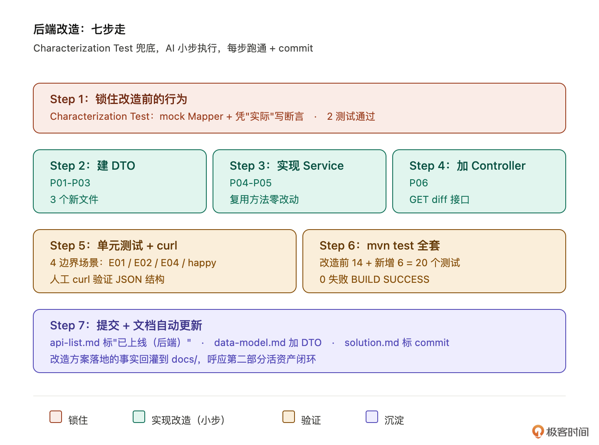
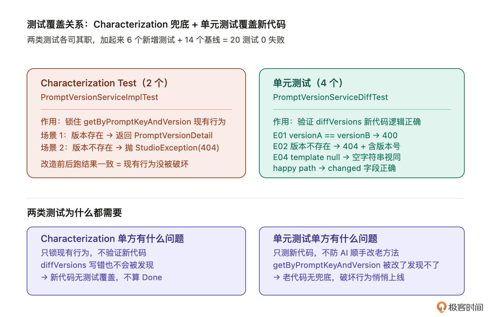

# 19｜执行改造（上）：后端开发跑通测试

**作者：Robert**

🎧 **文章音频**: [🎧 点击播放：_assets/979207.mp3]

> 老项目改造，慢就是快。

你好，我是 Robert。

18 讲跑完，你手上有一份审核过的改造方案。终于到动手写代码这一步。这一讲做后端，对应方案里的 P01-P06：建 DTO、实现 Service、加 Controller、补集成测试、跑通 mvn test。

**这节课的提示词会写得比较细，约束比较多。**因为本节课就是让 Claude Code 完成后端接口的开发，越详细的提示词和约束，效果越好。建议你多琢磨下提示词的内容和思路。

在执行阶段，最大的风险是 AI 的两个默认行为：

1. **爱“顺手”优化老代码**（你让它加方法，它顺手把现有方法重构了）
2. **爱凭“应该”写测试断言**（断言全过，但根本没跑过现有代码）

两类坑不在提示词里硬约束，就会一路埋到生产。我们的思路是：**AI 小步执行 + 你严格 review + Characterization Test 兜底**。七步跑下来，后端代码可运行、有测试覆盖、不破坏现有行为，commit 后等前端联调（20 讲）。

## 怎么改才算合格

### 改造前先锁住现有行为

15 讲讲过 Characterization Test：**不是测代码“应该做什么”，是锁住代码“现在实际做什么”**。这一讲是它在真实改造里第一次落地。

为什么改造前必须锁现有行为？因为 18 讲的方案里 P05（实现 `diffVersions`）要复用 `getByPromptKeyAndVersion`。复用就意味着 AI 可能“顺手”动这个老方法，比如改个返回类型、加个参数、调整空值处理。

**这些改动单看都合理，但只要现有行为变了，所有调用方都受影响**——这句话其实很细节，也是 AI 经常会犯的问题。而在我们真实的老项目改造中，改造质量的差异或者改出问题，往往都是来自于这种很细的细节。这就是为什么我们在前面花了那么多时间在整理文档和上下文，并且让你停下来花时间去确认、调整。

锁现有行为的做法很简单：**改造前先跑一次现有代码，把它的实际输入输出记下来，作为测试断言**。改造后再跑一遍，断言通过就说明现有行为没变。

这一步是必选项。没有 Characterization Test 兜底，AI 改坏了你可能得两周后才发现。

### 改造执行的四个原则

第二件要说的事是改造执行的四个原则。这四条贯穿后面的七步：

1. **小步执行**。AI 默认会一口气把 P01-P06 全改完。这样改完出错你不知道是哪一步出的，回退也不好回。明确要求 AI 按改造点分批：P01-P03 一批、P04-P05 一批、P06 一批，每批跑通了 review + commit 再下一批。
2. **自主修复加 3 次兜底**。改造过程中编译报错、测试失败、依赖冲突都是常态。AI 要能自己修、自己重试，但连续 3 次同一错误必须停下来问你。13 讲讲过这个机制，这里直接复用。
3. **复用现有结构**。Spring AI Alibaba Admin 有自己的代码风格：统一返回结构 `Result<T>`、JPA `@Table` 风格、`StudioException` 异常处理体系。AI 容易按业界最佳实践写一套和项目不一致的，必须明确要求“对齐项目现有风格”。
4. **补测试不补到位不算完成**。每个改造点跑完都要有对应的测试，没有测试的改造点不算 Done。

四条原则的本质是一句话：**让 AI 走小步、走对方向、能验证**。

## 怎么用 AI 跑通后端改造

七步走，每步给提示词 + 真实输出 + review 重点。



### Step 1：锁住改造前的行为（Characterization Test）

动手前先给 `getByPromptKeyAndVersion` 加 Characterization Test。这一步是 15 讲心法在真实改造里的第一次落地。

**提示词**：

```plain
我要改造 PromptVersionServiceImpl，在改之前需要先用 Characterization Test
锁住 getByPromptKeyAndVersion 方法的现有行为。

要求：
- 不要凭"应该是什么"写断言，凭"实际跑出来是什么"写
- 先读 getByPromptKeyAndVersion 的实现，记录它实际做的事，再照实际行为写断言
- 测试覆盖两种场景：正常返回（版本存在）、版本不存在抛 StudioException
  （注意：该方法不做状态过滤，不要凭假设加"状态过滤"场景）
- 用 Mockito mock PromptVersionMapper，不依赖真实数据库
- 测试加在 spring-ai-alibaba-admin-server-start 模块下新建（原因：
  PromptVersionServiceImpl 和 StudioException 都在 server-start，server-core
  没有依赖 server-start，无法访问这些类）
  路径：src/test/java/.../admin/service/impl/PromptVersionServiceImplTest.java
- 跑命令：mvn test -pl spring-ai-alibaba-admin-server-start -am
  -Dtest=PromptVersionServiceImplTest -Dsurefire.failIfNoSpecifiedTests=false

跑完汇报：测试覆盖了哪些场景、断言基于的实际值是什么、跑通的状态。
```

这个提示词很细，基本你只有理解上一节课获得的改造点，才能理解这个提示词的意思。这里我想提醒的是，建议你详细琢磨。因为老项目改造需要的是细心、细节和经验，而这些就是在琢磨中训练出来的。  
产出：2 个 Characterization Test，全部通过。实际跑出来的两个场景和断言依据：

* **场景 1（版本存在）**：mock Mapper 返回一个 `PromptVersionDO`，调用后拿到 `PromptVersionDetail`。断言依据 `fromDO` 的实际转换逻辑：`createTime` 由 `LocalDateTime` 经系统时区转 epoch ms，`previousVersion` 为 null 时返回 null（不是空字符串）。
* **场景 2（版本不存在）**：mock Mapper 返回 null，断言抛出 `StudioException`，`errCode == 404`，`errMsg == "Prompt版本不存在: no-key@v99"`（消息格式从源码读出，不是猜的）。

```plain
Tests run: 2, Failures: 0, Errors: 0, Skipped: 0, Time elapsed: 0.573 s
BUILD SUCCESS
```

review 重点（最关键）：

1. **断言是不是凭“实际”写的**。打开测试文件看 `assertEquals(...)` 里的预期值。如果你看到 AI 写 `assertEquals(100, result.getXxx())`这种，追问“100 这个值是从哪来的？是跑现有代码跑出来的，还是你猜的？”。AI 经常会用业务直觉补断言，这是 15 讲讲过的最大隐性偏差。
2. **测试能跑通**。如果有测试失败，先不要修测试，先确认是不是测试逻辑写错了。如果测试逻辑没问题但跑不过，那是你对现有行为的认知错了。这反而是 Characterization Test 的价值，让你看到代码“实际做什么”和你“以为它做什么”的差距。

### Step 2：建 DTO（P01-P03）

锁住现有行为后，正式开始改造。第一批是建三个 DTO：`PromptVersionDiffResult`、`VersionMeta`、`DiffItem`。

**提示词**：

```plain
基于 docs/requirements/prompt-version-diff-solution.md 的 P01-P03，
建三个 DTO 类：PromptVersionDiffResult、VersionMeta、DiffItem。

要求：
- 严格按 solution.md 第 7 节的最终决策（D1 null 视同空字符串等）
- 字段名、类型、注释和 solution.md 对齐
- 对齐项目现有 DTO 风格（lombok 注解、字段命名、null 处理）
- createTime 用 epoch ms（与现有 PromptVersionDetail.createTime 一致）
- 不要顺手改其他文件

只做 P01-P03 这三个 DTO，做完汇报，不要继续做 P04-P05。
```

最后一句“只做 P01-P03，不要继续 P04-P05”是关键约束。AI 默认会一口气改完，明确告诉它停在这一步。产出是3 个新建的 DTO 文件（这里代码可以看我们的代码仓库，就不展开细讲了），全部加 `@Data @Builder @NoArgsConstructor @AllArgsConstructor`，字段对齐 solution.md 文件的内容。

review 重点：

1. **字段是不是和 solution.md 对得上**。打开 solution.md 第 3 节改造点表格 + 第 6 节决策点，逐字段对照 AI 写的 DTO。
2. **有没有顺手改其他文件**。git status 看一下，应该只有三个新建的 java 文件。如果发现 AI 还动了别的文件，让它解释为什么改，然后让它撤销不必要的改动。

### Step 3：实现 Service（P04-P05）

第二批是 Service 接口和实现。

**提示词**：

```plain
基于 solution.md 的 P04-P05，给 PromptVersionService 加 diffVersions 方法
+ 在 PromptVersionServiceImpl 里实现。

要求：
- 严格按 solution.md 步骤 2 的设计：调 Mapper 两次 → 校验 → 内存比较三字段 → 组装返回
- null 处理用 Objects.equals(nullToEmpty(a), nullToEmpty(b))，对应 D1 决策
- 复用 getByPromptKeyAndVersion 现有方法（18 讲 solution.md 影响范围第 2 条
  已确认该方法只有 log.info 无 metrics 副作用，不需要抽 getVersionInternal）
- 不要重构 getByPromptKeyAndVersion 任何细节，只调用它
- 异常用 StudioException + INVALID_PARAM/NOT_FOUND 错误码

实现完跑一遍 mvn test，确认 Step 1 的 Characterization Test 全部通过
（行为没偏移）。如果有测试失败，stop，告诉我具体是哪个测试、什么原因。

只做 P04-P05，不要做 P06。
```

注意提示词最后一段：让 AI 跑 Step 1 的 Characterization Test，有失败就 stop，这是兜底机制。Characterization Test 失败，说明改造意外破坏了现有行为，必须人介入判断。

这里实际有 3 个实现要点（执行后记录）：

1. `diffVersions` 先校验 `versionA == versionB`（抛 `INVALID_PARAM`），再查 `promptMapper` 确认 promptKey 存在（抛 `NOT_FOUND`），再两次调 Mapper 查版本（各自抛 `NOT_FOUND`），最后内存比较组装返回。
2. null 处理用局部变量 `String sa = a != null ? a : ""`，再 `!Objects.equals(sa, sb)` 判断 changed，等价于 `nullToEmpty` 语义，用标准库不引入额外依赖。
3. `getByPromptKeyAndVersion` 原方法零改动，Characterization Test 验证通过：

```plain
Tests run: 2, Failures: 0, Errors: 0, Skipped: 0
BUILD SUCCESS
```

review 重点：

1. **有没有动** `getByPromptKeyAndVersion`**。**git diff 看 PromptVersionServiceImpl，应该只有新增 `diffVersions` 方法以及两个私有辅助方法（`toVersionMeta`、`diffItem`），原方法一行不动。如果 AI 动了原方法（哪怕只是格式化），让它撤销。
2. **null 处理对不对**。打开 `diffItem` 实现，确认空值处理是 `a != null ? a : ""` 后再 `Objects.equals` 比较，而不是 AI 凭直觉用的 `a == null && b == null`（后者语义完全不同）。
3. **Characterization Test 全过**。这是硬指标。

### Step 4：加 Controller（P06）

**提示词**：

```plain
基于 solution.md 的 P06，给 PromptController 加 GET /api/prompt/version/diff 接口。

要求：
- 三个入参：promptKey、versionA、versionB，全部 @RequestParam，加 @NotBlank
- 正常路径返回 Result.success(data)，对齐 PromptController 现有接口写法
- 异常处理走全局 GlobalExceptionHandler（@RestControllerAdvice），
  不要在 Controller 里 try-catch，不要自己包装错误响应
- 接口路径 /api/prompt/version/diff，注意路径不冲突（已确认现有
  /api/prompt/version 是单版本查询）
- 不要重构 PromptController 现有的其他接口

跑一遍 mvn test 确认全部通过（含 Step 1 的 Characterization Test）。
然后用 curl 跑一下新接口，看返回结构对不对。

只做 P06，不要继续做集成测试，那是下一步。
```

产出：`PromptController` 新增一个方法，`import` 新增 `PromptVersionDiffResult`，其余接口零改动。Characterization Test 继续全过。

实际加进去的接口签名：

```plain
@GetMapping("/prompt/version/diff")
public Result<PromptVersionDiffResult> diffPromptVersions(
        @RequestParam @NotBlank String promptKey,
        @RequestParam @NotBlank String versionA,
        @RequestParam @NotBlank String versionB) throws StudioException {
    log.info("对比Prompt版本差异请求: promptKey={}, versionA={}, versionB={}", promptKey, versionA, versionB);
    return Result.success(promptVersionService.diffVersions(promptKey, versionA, versionB));
}
Tests run: 2, Failures: 0, Errors: 0, Skipped: 0
BUILD SUCCESS
```

review 重点：

1. **接口签名对**。和 solution.md 第 3 节里 P06 的描述完全一致。
2. **没有重构其他接口**。git diff PromptController.java，应该只有新增方法 + 一行 import，其余内容一字不动。
3. **curl 返回结构对**。手动 curl 一下，看返回 JSON 结构和 solution.md 第 3 节的接口契约对得上。这一步人来做：AI 报告“接口跑通了”不一定可信，自己跑一次最稳。

### Step 5：补单元测试 + curl 验证返回结构

新接口跑通了，分两部分：先补 Service 层单元测试，再 curl 验证真实 HTTP 响应结构。

两者不能互相替代：单元测试验证 Service 逻辑正确，curl 验证序列化到 JSON 的结构对得上接口契约。JSON 字段名拼错、类型序列化异常这类问题单元测试发现不了。

**提示词（单元测试）**：

```plain
给 diffVersions 补单元测试，测试加在 server-start 模块下（原因同 Step 1：
PromptVersionServiceImpl 和 StudioException 在 server-start，server-core 无法访问）
PromptVersionServiceDiffTest.java（如果不存在就新建）。

注意：项目当前没有 Testcontainers 基础设施，不能用 SpringBootTest + 真实 DB。
用 @ExtendWith(MockitoExtension.class) + Mockito mock PromptVersionMapper 和 PromptMapper
（diffVersions 内部调了两个 Mapper，两个都要 mock）。

覆盖需求文档 prompt-version-diff.md 第 4 节的关键边界：
  * E01 versionA == versionB → 抛 StudioException(INVALID_PARAM)
  * E02 versionA 不存在 → 抛 StudioException(NOT_FOUND)，errMsg 含版本号
  * E04 template 为 null → valueA/valueB 返回 ""，changed=false（两个都是空字符串）
  * 正常 happy path（两版本 template 不同 → changed=true，variables 相同 → changed=false）

测试断言凭"实际跑出来是什么"写，不凭"应该是什么"。
跑命令：mvn test -pl spring-ai-alibaba-admin-server-start -am
  -Dtest=PromptVersionServiceDiffTest -Dsurefire.failIfNoSpecifiedTests=false

汇报每个测试覆盖的场景和实际跑通的状态。
```

产出：4 个单元测试，全部通过。

```plain
Tests run: 4, Failures: 0, Errors: 0, Skipped: 0, Time elapsed: 0.601 s
BUILD SUCCESS
```

四个场景的实际验证结果：

1. E01：`diffVersions("key","v1","v1")` → 抛 `StudioException`，`errCode=400`，无需查 DB
2. E02：mock Mapper 返回 null for versionA → 抛 `StudioException`，`errCode=404`，`errMsg` 包含版本号 `"v1"`
3. E04：两版本 template 均为 null → `valueA=""`、`valueB=""`、`changed=false`（空字符串相等）
4. happy path：template 不同 → `changed=true`；variables 相同 → `changed=false`；`promptKey/version/status`字段值与 mock 数据一致

review 重点：

1. **断言基于实际行为**。看到 `assertEquals(...)` 追问 AI “这个值是跑出来的还是猜的”。Mockito 测试里 AI 容易直接 `when(...).thenReturn(mock对象)` ，然后凭直觉写断言，而不是先想“这个 mock 会让 diffVersions 实际算出什么”。
2. **边界场景齐全**。E01/E02/E04 + happy path 四条都有，少一条让 AI 补。
3. **Mockito mock 范围对**。mock `PromptVersionMapper` 和 `PromptMapper`，不要 mock `PromptVersionService` 自身，测的是真实 `diffVersions` 实现，不是 mock 出来的壳。

**curl 验证（人来做）**：

启动应用后，用真实数据库里已有的两个版本手动 curl，看实际返回的 JSON 结构和接口契约对不对：

```plain
# 登录拿 token（替换为你的实际账号密码）
TOKEN=$(curl -s -X POST http://localhost:8080/api/account/login \
  -H "Content-Type: application/json" \
  -d '{"username":"saa","password":"123456"}' \
  | jq -r '.data.access_token')

# 调 diff 接口（替换为你数据库里真实存在的 promptKey 和两个版本号）
curl -s \
  -H "Authorization: Bearer $TOKEN" \
  "http://localhost:8080/api/prompt/version/diff?promptKey=xxx&versionA=v1&versionB=v2" \
  | jq .
```

预期返回结构（对照 solution.md 第 2 节接口契约）：

```plain
{
  "code": 200,
  "message": "success",
  "data": {
    "promptKey": "xxx",
    "versionA": { "version": "v1", "status": "release", "createTime": 1745000000000 },
    "versionB": { "version": "v2", "status": "pre",     "createTime": 1745100000000 },
    "diffs": {
      "template":    { "changed": true,  "valueA": "...", "valueB": "..." },
      "variables":   { "changed": false, "valueA": "...", "valueB": "..." },
      "modelConfig": { "changed": false, "valueA": "...", "valueB": "..." }
    }
  }
}
```

**curl 这步不要让 AI 代劳：**AI 报告“接口跑通了”不可信，自己眼睛看到 JSON 结构才算验证完。重点盯三件事：

1. `data` 字段存在（不是 `null`）
2. `diffs` 下三个字段都有（`template` / `variables` / `modelConfig`）
3. `changed` 是 boolean，`valueA` / `valueB` 是字符串（不是 null）

### Step 6：跑通 mvn test 全套

到这一步所有后端改造点（P01-P06）跑完了。最后跑一遍完整 mvn test，确认整体没问题。

**提示词**：

```plain
跑一遍完整测试，含新增的 server-start 测试：
mvn test -pl spring-ai-alibaba-admin-server-runtime,spring-ai-alibaba-admin-server-core,spring-ai-alibaba-admin-server-start
  -am -Dsurefire.failIfNoSpecifiedTests=false -fae
输出全部测试结果（通过 / 失败 / 跳过 各多少）。
失败的列出来，但不要试图修，只汇报。
```

产出：完整测试报告，0 失败。

```plain
server-core:
  Tests run: 14, Failures: 0, Errors: 0, Skipped: 0

server-start（新增）:
  Tests run: 4, Failures: 0, Errors: 0 -- PromptVersionServiceDiffTest
  Tests run: 2, Failures: 0, Errors: 0 -- PromptVersionServiceImplTest
  Tests run: 6, Failures: 0, Errors: 0, Skipped: 0

总计: 20 个测试，0 失败，BUILD SUCCESS
```



review 重点：

1. **失败数为 0**。任何失败都不能进下一步。
2. **Step 1 的 Characterization Test 全过**。`PromptVersionServiceImplTest` 2 个测试和改造前完全一致，证明 `getByPromptKeyAndVersion` 现有行为没被破坏。
3. **总测试数 = 改造前 + 新增**。改造前基线 14 个（server-core），新增 6 个（server-start：2 个 Characterization Test + 4 个 diffVersions 单元测试），合计 20 个。如果总数不对，说明有测试被意外删了或跳过了。

### Step 7：提交 + 文档自动更新

最后一步：把改造方案落地的事实回灌到 docs/。

**提示词**：

```plain
后端改造跑通了（P01-P06 + 测试）。更新相关 docs/ 资产：

1. docs/api-list.md：
   把之前标"开发中"的 GET /api/prompt/version/diff 改为"已上线（后端）"
   入参和返回结构按实际实现校对一遍

2. docs/data-model.md：
   三个新 DTO 的字段如有任何 review 中调整过的，同步更新

3. docs/requirements/prompt-version-diff-solution.md：
   在每条改造点（P01-P06）后面标注实际 commit hash 和文件路径，方便回溯

输出每份文件的改动 diff。
```

产出：三份文档同步更新。

实际执行时有一个细节要核对：`PromptVersionDiffResult` 里用了静态内部类 `DiffFields`，而不是独立顶层类。`docs/data-model.md` 里要把这个嵌套关系写清楚，不然会以为要新建四个文件（实际只有三个）。

另外 solution.md 里第 3 节写的是“P03 新增 `dto/DiffItem.java`”，但实际实现里没有独立的 `DiffFields.java`，`DiffFields` 是 `PromptVersionDiffResult` 的内部类。文档标注时要反映这个实际结构，不要照抄 solution.md 里的预期描述。

## 怎么避免最常见的翻车

后端改造里两个翻车点贯穿全程，必须特别警惕。

**翻车一：AI 顺手优化老代码**

最典型的场景：你让 AI 加 `diffVersions` 方法复用 `getByPromptKeyAndVersion`，AI 改完一看代码“这个方法可以重构得更优雅”，顺手就改了。防止办法：

1. 每个提示词里明确写“不要重构现有方法”。这一讲所有提示词都加了这一条。
2. 每步 commit 前 git diff 看一遍，超出范围的改动一律撤销。AI 的优化哪怕看起来真的更好，也不要在这次改造里做。优化是另一个改造任务，单独走流程。
3. Characterization Test 是最后兜底。哪怕 AI 偷偷改了什么，只要现有行为没变，测试会过。如果测试失败，立刻知道行为变了。

**翻车二：AI 用“应该”而不是“实际”写测试断言**

15 讲讲过的隐性偏差，这一讲是它在真实改造里的具体表现。

最典型的场景：AI 写 Characterization Test 时，看代码 `if (result == null) return Collections.emptyList()`，凭直觉写 `assertNotNull(result)`，但实际跑代码可能因为业务数据导致返回 null，于是测试反而失败。防止办法：

1. 提示词里写硬话：不要凭“应该是什么”写断言，凭“实际跑出来是什么”写——这句话每次写测试相关提示词都要加。
2. review 时盯着断言看。看到 `assertEquals(...)`、`assertTrue(...)` 就追问“这个值/这个判断是从哪来的”。
3. 测试失败时先怀疑测试，不要先怀疑代码。如果测试断言是基于“实际”写的，那它失败就说明代码确实变了，这是有用的信号。如果断言是基于“应该”写的，那测试失败可能只是 AI 猜错了，真正破坏的代码反而没被检测到。

两个翻车点背后是同一个心法：**AI 在数据 / 代码层面强，在判断 / 直觉层面弱**。这一讲（执行改造）和 15 讲（补测试）、17 讲（拆需求）、18 讲（拆方案）背后都是这一条。

## 小结

这一讲核心就一句话：让 AI 小步改后端、你严格 review、Characterization Test 兜底。

说实话，这节课信息密度很大。如果在新项目中改造，这个需求一个提示词就搞定了，Claude Code 能跑的很好。所以这里你可能有个疑问：**为啥要分这么多步，如果是我，我一步、一个提示词就搞定了？**

在我看来，这就是新项目开发和老项目开发的区别。老项目开发需要步步为营，一步一步来，越细致越好。这里你可能有另外一个疑问：**这么细不是很浪费时间吗**？那其实要回到我们这门课最开始的命题，出bug处理的时间，返工的时间，比我们在做的时候因为细致花的时间，多的多。

**所以，老项目改造，慢就是快。别急，细致点，按照流程步骤来，你会觉得真的很快，比你想象中快。**

另外本节课的提示词很详细，你不要感到烦，详细是为了能让你体验到一个细致的提示词带来的效果，你在实际项目中可以精简。但我不想这节课交给你的提示词是精简过的，提示词宁多勿少。

本节课的内容整体分为七步走：

1. 锁住改造前的行为（Characterization Test）
2. 建 DTO（P01-P03）
3. 实现 Service（P04-P05）
4. 加 Controller（P06）
5. 补单元测试 + curl 验证返回结构
6. 跑通 mvn test 全套
7. 提交 + 文档自动更新

四个原则贯穿七步：小步执行、自主修复 + 3 次兜底、复用现有结构、补测试不补到位不算完成。

最容易翻车的两点：AI “顺手”优化老代码（每步 git diff 兜底）、AI 用“应该”写断言（提示词硬约束 + review 时盯着断言）。

跑完这一讲，后端可运行（20 个测试全过）、有测试覆盖（Characterization Test + diffVersions 单元测试）、不破坏现有行为（Characterization Test 改造前后结果一致）。下一讲做前端：接入新接口、改造 VersionCompareModal、加 loading 状态、和后端联调。

## 思考题

1. 你最近一次让 AI 改老代码，有没有遇到 AI 顺手优化的情况？如果当时有 Characterization Test 兜底，会不会发现得更早？
2. 这一讲的七步走里你觉得哪一步最反直觉？是 Step 1（改之前先写测试）、Step 3（不要重构 getByPromptKeyAndVersion）、还是 Step 5（断言凭实际不凭应该）？为什么？

欢迎在评论区把你的答案写出来。如果今天的课程让你有所收获，也欢迎转发给有需要的朋友，邀请他来一起学习，我们下节课再见！

---

## 精选评论

**一眼万年**: 写提示词时间不比写代码时间少？

> **作者回复**: 还真比写代码时间少。ai写代码真的快。提示词写起来就是几句话。上下文调教的好，不用复杂的提示词
