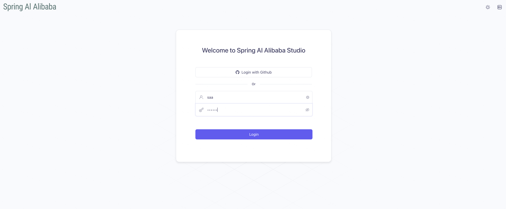
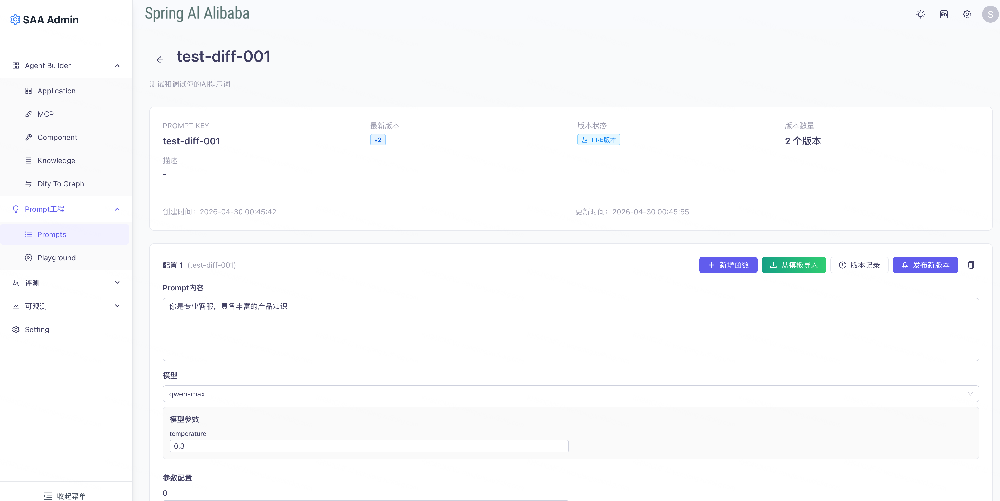
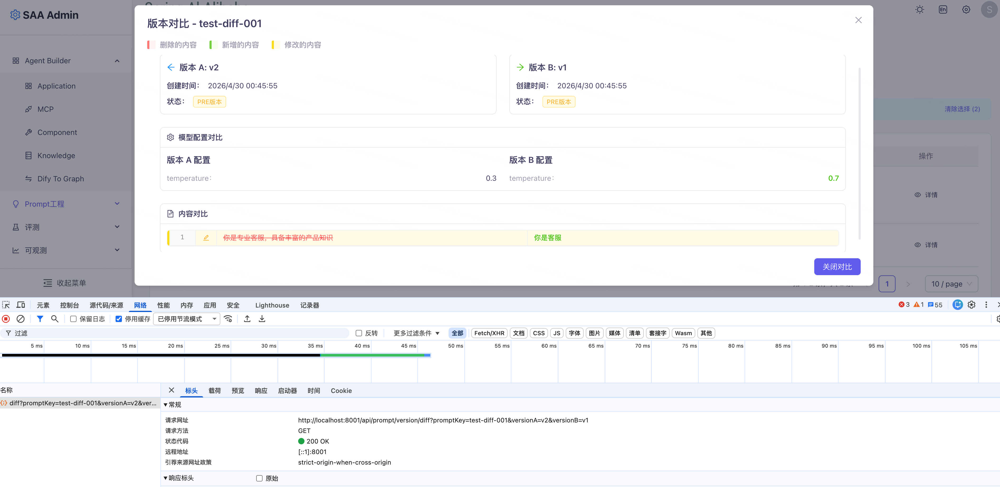
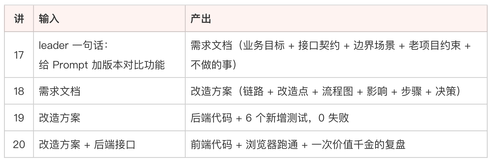

# 20｜执行改造（下）：前端开发和接口对接

**作者：Robert**

🎧 **文章音频**: [🎧 点击播放：_assets/979519.mp3]

> 改造前先点产品，AI 扫代码不能替代。

你好，我是 Robert。

19 讲跑完，后端 GET diff 接口已经能用 curl 跑通。这一讲做前端，对应 18 讲方案里的 P07-P10：API 函数 + 类型声明 + 加新的对比按钮 + 接入 modal。

前端改造的特点是，没办法靠 mvn test 这种自动化验证兜底，唯一的验证方式是亲眼看效果。所以这一讲的节奏是：**先跑起来看现状、让 AI 找改造点、让 AI 改、预览效果**。

前四节按这个节奏跑，但**这一讲真正值钱的内容在后半段**：跑完之后我们要做一次复盘，你会发现一个很典型的“翻车”事件。先正常跑，跑完再讲翻车。

## 起服务，看现状

```plain
跑 ./scripts/deps-start.sh 起依赖中间件，再起后端和前端，
跑通后告诉我前端访问地址。
```

13 讲挖了 deps-start.sh / deps-stop.sh / deps-status.sh 三个脚本管中间件，前后端启动也可以让 AI 顺手调起来。

启动跑通后，浏览器打开前端，准备登录。



这里有个小插曲：我不知道默认账号密码是什么。Spring AI Alibaba Admin 没在 README 显眼位置写，我也懒得翻代码。直接问 AI：

```plain
项目默认登录账号密码是什么？看一下代码或配置。
```

AI 扫了一遍数据库初始化脚本，告诉我默认是 `saa / 123456`。**这是 AI 协作里特别常见的小动作**：碰到任何“我懒得查”的小问题就直接问，比自己翻文档快十倍。登录进去，下一步让 AI 告诉你这次改造在前端的哪个位置。

## 让 AI 告诉你前端改造在哪里

```plain
基于 prompt-version-diff-solution.md，告诉我这次改造的前端入口在哪里
（菜单路径 + UI 位置），方便我截图看现状。
```

AI 会告诉你具体的菜单路径，比如：登录后 → Prompt 管理 → 选一个 Prompt → 版本历史。

照着点一遍，**当前的版本历史页面截屏存下来**。这是改造前的现状，后面“预览效果”那一节验证改造效果时要用。



> Tips：你看一下这张图，看会发现什么

## 让 AI 改前端

两步走。第一步先让 AI 简单概述要改什么、改完是什么效果，给自己心里一个底。

```plain
基于 prompt-version-diff-solution.md，简单说一下前端要改哪些点、
改完应该是什么效果。
```

AI 会告诉你：加一个新的“对比版本”按钮、点击后调后端新接口 GET diff、拿到 diff 结果后弹出 modal 显示行级 diff。

确认效果符合预期，第二步让 AI 直接改完：

```plain
按上面说的改完前端，对齐项目风格，改完跑前端构建确认无报错。
```

不需要更多约束。改造点 18 讲的方案文档里都列清楚了，AI 自己能拿到所有信息。跑通后 `git diff` 扫一眼改动范围合理、构建无报错就行。进下一步看效果。

## 预览效果

热重载后回到浏览器（如果没开热重载就重启前端）。回到版本历史页面：



1. 勾选两个版本，点新加的“对比版本”按钮
2. 观察 loading 状态出现（diff 接口比单版本查询慢）
3. modal 弹出，看到行级 diff 渲染正常
4. 关闭 modal，重新选另两个版本再对比一次，确认稳定
5. 把新对比按钮触发的 modal 截屏

效果验证通过。**到这一刻，从 17 讲拆需求到 20 讲前端跑通，整个改造闭环正式跑完了**。

我们这次改的只有两件事：

1. **后端**：新增了 `/api/prompt/version/diff` 接口，把原来纯前端的 diff 计算移到了服务端。
2. **前端**：把 `loadVersionsAndCompare` 和 `handleVersionDetailCompare` 从调两次 `getPromptVersion` + 本地计算 diff，改成调一次 `getDiffVersion` 接口拿后端返回的结果。

勾选对比、详情弹窗、 `VersionCompareModal` 组件本身，都是改之前就存在的。

按理说这一讲应该到这里结束、进入总结。**但跑完之后我又点了点页面，发现了一件事，这件事让我意识到这次改造从一开始就走偏了。**

## 复盘：我和 AI 都没发现这个功能本来就有

这次改造，我跟 AI 一起跑了一个本来不需要跑的流程。

跑完上面那些步骤，看到新按钮的 modal 弹出来 diff 显示正常，我心里很满意，正准备写总结。出于习惯我又点了点版本历史页面其他地方，结果发现页面上**已经有一个对比按钮了**，我没加之前就有。

我点开看，弹窗弹出来，里面也是版本对比 diff，渲染得清清楚楚。这是怎么回事？我跑回去看代码。原来这个项目的版本对比功能**早就在前端实现了**：

* `version-history.jsx` 上本来就有一个对比按钮
* 点击后，前端并行调两次 `getPromptVersion` 拿到两个版本的完整数据
* 浏览器里自己做字符串 diff
* 渲染到 `VersionCompareModal`

整个流程**完全在前端，零后端 diff 接口**。也就是说：

* 17 讲我拆需求时问 AI “这个项目有没有版本对比功能”，AI 扫了 `docs/api-list.md`，没有 diff 接口，回答“没有”。
* 18 讲拆方案时 AI 扫前端代码，识别到 `VersionCompareModal` 已经存在，但它默认这是配套接口的某个组件，没主动告诉我“这个组件已经在工作”。
* 19 讲我跑通了后端 GET diff 接口、补了 6 个测试。
* 20 讲我加了新按钮调新接口，看着新 modal 显示得很好。

**整整四讲，我和 AI 都没发现这个功能本来就存在**。更尴尬的是：现在版本历史页面有两个对比按钮：一个旧的（前端 diff）、一个我新加的（后端 diff）。两个按钮做同一件事，UI 上看不出区别，用户看到一定会懵。

### 这次翻车说明什么

**第一，AI 不是万能的，它扫代码强，但理解业务功能弱**。

AI 扫一遍代码能列出所有文件、所有方法、所有调用关系，但它理解不了“这个组件正在工作、用户每天都在用”这种业务事实。它看到 `VersionCompareModal.jsx` 存在，会默认这是某个未完成的代码骨架，或者配套某个接口在工作。

它永远不会主动建议我“打开浏览器点一下看看现状”，这种动作只能人来。

**第二，改造前的兜底动作是“自己点几下产品”，不是“让 AI 扫代码”**。

如果 17 讲拆需求之前，我先打开浏览器、点几下版本历史、发现“对比”按钮已经能用，整个 17-20 讲的工作量就直接归零了。这一步只需要 30 秒，但我没做，AI 也代替不了我做。

后来我反思：为什么我没做？因为我在跟着课程节奏走、在按“先拆需求”的标准流程走、在当甩手掌柜，把“理解项目”这件事完全交给 AI 了。

**第三，老项目改造里“人是最后的兜底”不是一句空话**。

整门课反复讲“AI 当调研员、人当决策员”。这次翻车给这句话补了一条：**人不只是决策员，还是兜底员**。AI 把所有代码层面的事情扫得再细，也不可能替你点一下产品看看现状。这种“看一眼就知道”的事，AI 却做不到。

老项目改造里太多这种“看一眼就知道”的事：

* 这个功能用户在不在用？打开生产环境看 PV 就知道。
* 这个接口有没有客户依赖？看监控调用方就知道。
* 这个 bug 是不是真的影响业务？问一下客服就知道。

这些事 AI 做不了，但做改造的人不能不做。当甩手掌柜的代价是：你花 3-4 小时跑了个本来不需要跑的流程。

### 那这次改造白做了吗

我觉得没有完全白做。从教学角度，我认为效果更好地达到了预期。因为案例只是教学手段，我们的目标不是学会加版本对比功能，而是掌握用 AI 做老项目改造的全流程，所以并没有影响，意外之喜是我们收获了一条宝贵的踩坑经验。

最后 review 完代码，我把把这次教训写进 `CLAUDE.md`：

```plain
## 老项目改造前必须做的兜底动作

任何改造任务开始之前，**先打开生产/测试环境点几下，确认要做的功能
不存在**。AI 扫代码无法发现"已存在的功能"，必须人手验证。
```

下次类似情况，CLAUDE.md 里这一条会被加载到上下文，AI 会主动提醒我先去点产品。**这次踩的坑变成了下次的护栏**，这就是 docs/ 活资产的价值。

## 总结

到这里 17-20 讲的完整改造闭环跑完了，包括最后这场“翻车”。为了还原真实的企业生产环境中的各种情况，我把这个典型事件也保留下来了，你也可以理解是“课程效果”。重要的是过程，但产生的结果也很有代表性，值得分享。

回过头看走了哪些步：



这一轮改造的真实意义不只是代码，**还有一条新加的 CLAUDE.md 约束**：“改造前先点产品，AI 扫代码不能替代”。

回想整门课讲过的心法在这次改造里的落地路径：

* **AI 当调研员、人当决策员**（17/18 讲）：业务目标方向人定、产品决策人定、技术方案人选
* **人是最后的兜底员**（这次新加的）：AI 扫代码再细也不能替你点几下产品看现状
* **小步执行 + 自主修复 + 3 次兜底**（13/19 讲）
* **Characterization Test 兜底**（15/19 讲）
* **断言凭“实际”不凭“应该”**（15/19 讲）
* **文档自动更新**（10/18 讲）：包括把这次的翻车教训写进 CLAUDE.md

## 思考题

1. 你最近一次接手老项目改造，开工前有没有先把生产/测试环境点几下、确认现状？这次复盘里我犯的错（跟着 AI 跑一圈才发现功能已有），你有没有犯过类似的？
2. 这一讲的复盘里，“人是最后的兜底员”这句话和整门课之前讲的“AI 当调研员、人当决策员”是什么关系？是补充、替代、还是彻底的反转？

欢迎在评论区把你的答案写出来。如果今天的课程让你有所收获，也欢迎转发给有需要的朋友，邀请他来一起学习，我们下节课再见！

---

## 精选评论

**Geek_e81865**: 催更！！

> **作者回复**: 努力ing～～🌹🌹
