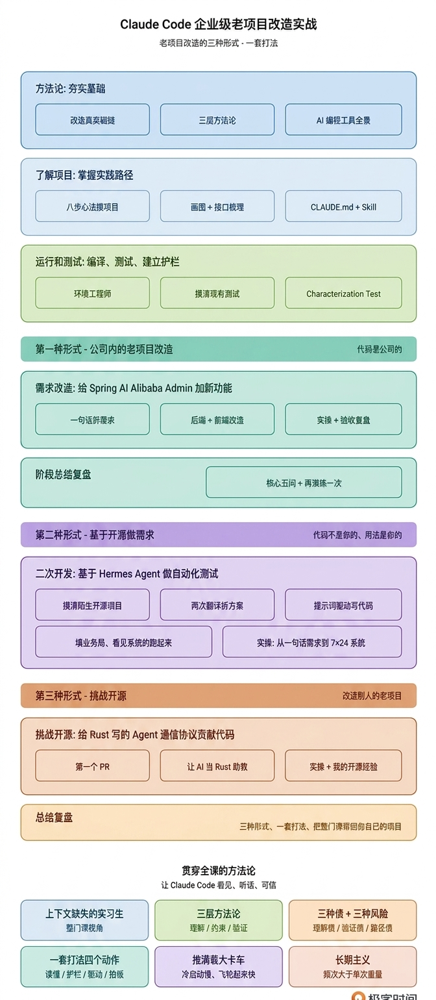

# 开篇词｜怎么用 Claude Code 改好一个跑了几年的老项目？

**作者：Robert**

🎧 **文章音频**: [🎧 点击播放：_assets/973962.mp3]

> 老项目改造用 AI，真正的瓶颈不是 AI 能做什么，是你能传递多少。

你好，我是 Robert。

在正式开始之前，先聊聊我做这门课的初衷。

Claude Code 出来这两年，大家都在用它改自己手上的代码。从写新功能、改 bug、加测试，到现在很多工程师也开始拿它动那个跑了几年的老系统。

但很多人改着改着会发现，效果跟自己预期差距挺大。同样的工具、同样在改老代码，有人改出来又稳又快，有人改完一上线就出问题。有人觉得 AI 真的能帮到自己，有人觉得 AI 比自己还能添乱；有人在做第三个任务时已经摸出门道，有人改了三个月还是心里没底。**同一个工具，用法不同，结果差得很远。**

差的不是 AI，差的是用法。这件事是有体系的，只是大部分人还没把这个体系用起来。

这门课要做的事，就是把我这两年改老项目踩过的坑、用过的提示词、跑过的工作流、以及沉淀出来的一套打法，系统讲一遍。学完之后，你用 Claude Code 或者其他主流 AI 编程工具，改一个跑了几年的老项目，就能用得对、用得稳、用得越来越省力。

## 大家都在踩同一种坑

你应该也有类似的体感。这两年业界其实已经在认真讨论“AI 改造老项目”这件事，踩过坑的不只是你和我。

Google 的 Addy Osmani 给出了一个词叫 **Comprehension Debt（理解债）**，指代码产出速度和团队真正理解代码的速度之间的差距。AI 帮你写代码越多，这个差距越大。Anthropic 自己做了一项 52 人的对照实验，AI 辅助开发者在代码理解测试上比对照组低 17%，debugging 方面差距最大。

Sonar 的开发者调研给出了另一组数据：42% 的代码是 AI 辅助生成的，但 96% 的开发者不完全信任 AI 的输出，只有 48% 每次都 review。结果是普遍存在的 **Verification Debt（验证债）**，改完跑通了测试、看着 diff 也没问题，到生产环境才发现坏了。

Florida International University 的研究给 AI 在老项目里的失效方式起了个名字叫 **Brownfield Tax（棕地税）**，具体表现是 context 超过 40% 后模型质量下降，跨 session AI 记不住昨天的决策，AI 不知道老代码为什么这样写所以提的“现代方案”跟现有架构不兼容。

这些不是论文里的概念，是我们日常都遇到过的事。Claude Code 写新代码用得越多，你越能感觉到改老代码这件事有点不一样。

## 我自己也踩过的一个典型坑

业界讨论的现象，我自己也踩过，而且踩得还挺典型。

半年多前我带着 Claude Code 去改一个公司内部老系统，跑了五六年、业务逻辑盘根错节那种。我把任务丢给 Claude Code：加一个字段，调整几处相关业务逻辑。它给的方案专业、代码干净、测试也写了。我 review 一遍没发现问题，上线。

那天晚上监控告警来了。

炸的不是我让它改的部分，是另一个看似毫不相关的接口。翻代码才发现，**那个字段在六年前被一个早已下线的对接方用过**，当时有个隐性约定。AI 不知道这件事，代码里也没写，只有当年做这个对接的同事知道，他半年前就离职了。

我一边回滚一边想，问题不在 AI，在我。不是它不够聪明，是我把它当成“能自动理解项目的开发者”了。但它不可能自动理解，那些代码之外的历史、隐性约定、踩过的坑，我不告诉它，它就是瞎的。

那次之后我换了做法。动手之前先花时间告诉它项目是什么、哪些地方有雷、哪些接口不能碰。一开始觉得这是额外成本，跑通几次发现：**这些时间不是成本，是投资**。前期传递得越充分，后面它帮我做的事越多越稳。

## 后来我摸出来的几件事

踩过几次类似的坑之后，我慢慢摸出来一件事。**AI 在老项目里不是“更强的开发者”，更像一个“上下文缺失的实习生”**。

这个实习生技术能力可能比你强。代码写得比你快，算法比你熟，开源项目看得比你多。但他有一个致命短板，他对你公司这个项目一无所知。面对这样一个实习生，你不会直接把复杂任务扔给他自己搞，你会先带他熟悉项目、告诉他哪些地方不能动、给他明确的小任务、让他做完给你看、你 review 完才让他继续。

视角立住之后，这件事的瓶颈就清楚了。**老项目改造用 AI，真正的瓶颈不是 AI 能做什么，是你能传递多少**。围绕“传递”这件事，我摸出来的打法分三层。

1. **理解层：**你和 AI 一起读懂这个项目。用 SonarQube 扫债务地图、用 git log 看历史脉络、用 Seam 识别方法找改造关键入口。让 AI 用 CLAUDE.md 装上下文、用 SKILL.md 装专项技能、用 MCP 扩展感知能力。**人的理解和 AI 的理解，是两件事，都要做**。
2. **约束层：**看见不等于听话。今天你让 AI 加个字段，它顺手重构整个类；明天让它修个 bug，它把项目编码风格全改了。所以你得告诉它哪些地方不能动、哪些规矩必须守、哪些设计模式这个项目不用。**约束写清楚了，AI 的产出自然可控**。
3. **验证层：**AI 改完跑通了测试，你 review 觉得没问题，但你测试覆盖本来就不全、review 本来就看不到所有路径。**你没法靠“感觉没问题”判断一个改动安不安全**。所以改造之前要把现有行为锁住，改造之后用基准对照。不是靠信心，是靠基准。

三层加起来，**让 AI 看见、让 AI 听话、让 AI 可信**。这三层做到位，AI 能完成 80% 到 90% 的工作。剩下 10% 到 20%，质量把关、流程正确、最终决策这些，必须由你来做。

业界其实也在分别讨论这三层，有人讲 Strangler Fig、有人讲 Characterization Tests、有人讲 SDD Brownfield、有人讲 Harness Engineering。每一块都有价值，但拼起来是散的，中文社区几乎没人系统讲过。**这门课要做的就是把这些碎片拼成一个完整的、可执行的方法论**。

## 这门课你要走的路

讲清楚方法论，接下来讲整门课怎么设计。

这门课不教 Claude Code 的全部功能，而是带你跑通“老项目改造”这件事。但这件事其实不只一种形式，所以我们会沿着老项目改造的三种形式展开，难度依次递进。

1. **第一种形式：公司内的老项目**。代码是公司的、bug 是公司的、方向是业务定的。这是大多数工程师日常面对的场景。整门课前五部分（01-23 讲）是以 Spring AI 这个真实开源项目作为镜子，带你完整走过“摸项目 → 建护栏 → 拆需求 → 跑通改造”全流程。**镜子是别人的代码，但学到的方法论是套到你公司那个老系统上用的**。
2. **第二种形式：基于开源做需求**。代码不是你的，但用法是你的。运维做内部巡检平台先看 Prometheus 生态，后端接工作流引擎先看 Temporal，算法做 RAG 先看 LlamaIndex。先看看开源里有没有现成的，再基于它二次开发，这是工程师的标准动作。第六部分（24-29 讲）演示从一句话需求到完整跑通的全流程，基于开源 Hermes Agent 控制平面做二次开发，**产出一个 7×24 不间断运行的真实自动化测试系统。**
3. **第三种形式：挑战开源**。代码不是你的，bug 也不是你的，你做贡献，让自己的名字进入别人的项目。这同样是老项目改造，只是改造的对象是别人的老项目。第七部分（30-32 讲）带你基于一个真实活跃的 Rust 开源项目，跑通两个 PR + 一个 issue，**收获一个真实可点击验证的开源 contributor 身份**。简历上多这一行，在 AI 时代尤其值钱。

最后，我们还会针对整门课做总结复盘，让你真的把这门课带回你自己的项目和工作里。

三种形式背后是同一套方法论：**读懂陌生代码、找到改造点、用 Claude Code 高效产出、保住质量**。整门课所有的动作都在训练这套姿势，我们把它放进三种不同的项目载体上去强化，最终内化为你自己的专业能力。

## 推满载大卡车的飞轮

最后，在课程正式开始之前，我想告诉你一件事。

即便方法论摸熟了，**老项目改造永远不可能像新项目那样丝滑**。任何一次老项目改造，都像推动一辆满载的大卡车。冷启动的时候特别慢，你要花时间让 AI 读懂上下文、建立约束、锁定基准，感觉进展缓慢。

但只要推动起来，飞轮就开始转了。CLAUDE.md 积累得越完整，AI 对项目的理解越深；SKILL.md 写得越好，改造的标准化程度越高；验收体系越成熟，你敢放手让 AI 做的事就越多。推到第三个任务的时候，你会发现自己已经不再需要手把手带 AI。

冷启动过去了，飞轮越转越快、越转越轻松，这就是这门课要帮你建立的节奏。

跟着课程一讲一讲走，不要跳。前面五部分把方法论建起来，中间两部分把方法论铺到不同形式上，最后一部分把方法论带回你自己的项目。每一讲都有具体提示词、具体工作流、具体 review 重点，你可以照着跑。

老项目改造这件事做久了你会发现，**它不容易，但也不像很多人说的那样难到碰不得**。难在它有历史、有包袱、有你看不见的约束，但只要你按课程中的这套体系来，AI 就会越做越熟。

**改得好老项目的人，是真的在长能力**。愿你通过这门课完善 AI 能力体系，沉淀实战判断力，从容领跑 AI 开发新时代！

---

## 精选评论

**Jxin**: 其实知识不是提取起来就完了。治理和渐进加载机制的设计也是个难题。
另外，其实真正的遗留系统，其债务可能还不止项目和业务本身，甚至还有公司的流程（为了降低人事上审批的成本，采用一些不合理的技术方案）和部署环境的限制（部署环境的不稳定极大影响 ai 做 e2e）。
很期待这些难题是否有得到回答，毕竟真干这个事总会碰到。

---> 其实做了一段时间我更觉得遗留系统该干掉，不适合 ai 的流程该改掉，一切以过度到能让 ai 自主迭代来铺路，最合适。 遗留系统不是ai native 的新项目，那就先把遗留系统过度到ai native 的新项目，而不是举债前行。（特殊的上下文越大，这个越难走）

> **作者回复**: 说实话，你说的这些都是客观问题。AI很难解决。AI 只能提速其中一部分的工作。换句话说，这些事情也不应该AI来干，这些是决策和架构部分，这些是AI干不好的。
>
> 比如“ 公司的流程（为了降低人事上审批的成本，采用一些不合理的技术方案）和部署环境的限制（部署环境的不稳定极大影响 ai 做 e2e）。”这点其实AI肯定无法解决，即使去问AI也解决不了。这部分是人的价值所在。
>
> “遗留系统该干掉” 我是同意的。因为有了AI后，干掉老系统成本没之前那么高了。AI辅助改造，也是AI的优势。比如最近的Bun用rust重写的例子。
>
> 我觉得AI 时代，没有历史包袱，重新设计系统是一个很不错的idea。因为AI提速下，成本遍地了。反而维护老项目成本更高。
>
> 我一直在强调，AI是提速，不是万金油。

---

**Geek_8bc76a**: 干净推倒重来更划算啊

> **作者回复**: 😂😂 每次都推倒重来吗？我感觉我经验中，推倒重来的次数感觉不多。

---

**Q:-_-**: 监控告警那块没太懂，为什么一个已下线的对接方用到会触发这个问题，你不是新增字段而不是删减字段么？

> **作者回复**: 因为代码中有对这个“已下线的对接方”的调用。代码遗留着，正常逻辑是不会触发的。改动后这个逻辑被触发了，从而导致出问题了。

---

**毁灭吧**: Robert老师又出新课了啊，这效率嘎嘎高，学不过来，根本学不过来，，，，，，

> **作者回复**: 去年就开始准备了😂😂，只是最近一起上线而已。

---

**菜鸟程序员**: 很期待，预计什么时候能够全部更新完成？

> **作者回复**: 内容都写完了～ ，努力更新ing。争取这个月内都更新完～

---

**zhangwq**: 从内容规划上来说很实用，覆盖了日常场景啊。终于不再是新项目了

> **作者回复**: 谢谢🙏 ～～～

---

**减**: 一个用ant和junit做的测试框架，打算学习一下看用deepseek-tui来改造不知道老师有没有什么建议

> **作者回复**: 你可以按照课程的思路来改。就按照课程的思路，你去了解项目、改项目。我蛮期待你试试后的反馈的🌹。

---

**许凯**: 老哥，两个专栏写得真好

> **作者回复**: 哎呀，谢谢～🌹 哈哈哈哈

---

**大王叫我来巡山**: 按照作者这种方式，不单单Claude code可以这样做，其他比如codex, cursor 等主流的agent都能做到吧

> **作者回复**: 是的，都可以的。不限制工具的。我其实蛮喜欢codec和cursor的。特别cursor，有多个模型可以选择。我都准备买curcor了

---

**Lehman**: 老师能否组织个微信群，这样大家还能互相切磋技艺！

> **作者回复**: 可以的可以的，马上拉，这两天就有了

---

**gsz**: 将AI调教的对老项目理解越到位，防护性编程越来越没有用了

> **作者回复**: 防护性编程是兜底。没兜底的话，是很难放心的。
> 当AI 对项目的理解越来越多，后面的开发确实会非常轻松。然后再把兜底测试，单元测试、功能测试做好，人就会更轻松了。

---

**木子皿**: 这个月就能更新完，太强了

> **作者回复**: 希望能对大家有帮助~~ 🎉🎉🎉

---

**Geek_a11502**: 终于期待的课程来了，感谢老师

> **作者回复**: 感谢感谢~~

---

**yphust**: 现实中确实更多都是在老项目上改造

> **作者回复**: 是的，大部分都是在老项目中做开发。

---

**不矫情不做作那是我**: 很期待哈哈

> **作者回复**: 感谢感谢～～

---

**灰二**: 想要跟老师讨论一个现象，现在打开不管什么社交平台都是在讨论ai.非程序员在用、程序员也在用，对于非程序员来说我认为ai确实已经到了工业革命的程度，但是对于程序员来看最大的价值是仿佛有一个非常博学的人可以互相讨论完成一些不管是程序编写、架构设计等等事情.诸如课程中提到ai是提效不是万能，至少现在的llm底层架构没变 还是概率模型.但是在企业中上层对ai的认知是到了无所不能的程度 好像大家现在不关心业务架构 全部都在卷ai，从我个人是一个java业务开发 我觉得ai现在能产生价值就是两个方面 1.内部工具提效 2.外部商业模型 .像我们内部最近有一个提效工具还没落地 上层希望提效30% ，现在比较焦虑的是 我们这种业务开发后续应该怎么发展 有机会老师可以再说一下这个话题 是继续深耕业务还是ai开发

---

**水木**: 面对老项目的“屎山代码”，我想大多数人会选择推倒重来~
