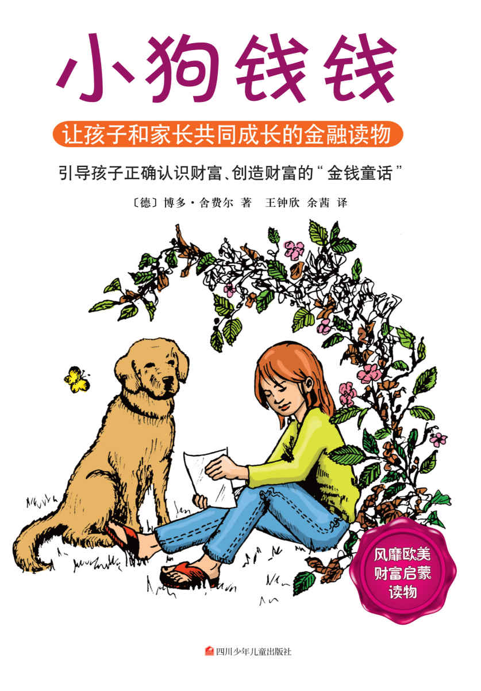
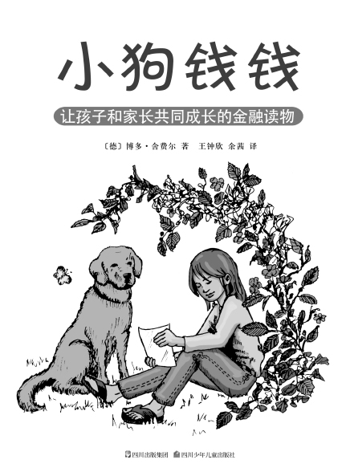

图书在版编目（CIP）数据

小狗钱钱／（德）舍费尔（Schafer, B.）著；王钟欣，余茜译．—成都：四川少年儿童出版社，2014.1

ISBN 978-7-5365-6358-2

Ⅰ．①小…　Ⅱ．①舍…②王…③余…　Ⅲ．①财务管理—少儿读物　Ⅳ．①TS976.15-49

中国版本图书馆CIP数据核字（2013）第315643号

Money oder das 1×1 des Geldes

By Bodo Schäfer

Copyright © 2000 by F. A. Herbig

Published by arrangement with The Rights Company

All Rights Reserved.

未经出版者书面许可，任何单位或个人不得以任何形式复制或传播本书的部分或全部内容。版权所有，侵权必究。

著作权合同登记号　国字：21-2014-38

XIAOGOUQIANQIAN

小狗钱钱

〔德〕博多·舍费尔著　王钟欣　余　茜译

出 版 人　常　青

出　　品　读书人文化

责任编辑　郭志平　李明颖

封面设计　朱　红

责任印制　王　春

出　　版　四川少年儿童出版社

地　　址　成都市槐树街2号

印　　刷　三河市中晟雅豪印务有限公司

经　　销　新华书店

成品尺寸　215mm×152mm　1/32

印　　张　6.75

网　　址　http://www.sccph.com.cn

网　　店　http://shop.sccph.com.cn

版　　次　2014年3月第1版

印　　次　2014年3月第1次印刷

书　　号　ISBN 978-7-5365-6358-2

定　　价　22.00元

目录

[童话与理财](./03-童话与理财.md)

[前　言](./04-前言.md)

[第一章　白色的拉布拉多犬](./05-第一章-白色的拉布拉多犬.md)

[第二章　梦想储蓄罐和梦想相册](./06-第二章-梦想储蓄罐和梦想相册.md)

[第三章　达瑞，一个很会挣钱的男孩](./07-第三章-达瑞，一个很会挣钱的男孩.md)

[第四章　堂兄的挣钱之道](./08-第四章-堂兄的挣钱之道.md)

[第五章　钱钱以前的主人](./09-第五章-钱钱以前的主人.md)

[第六章　爸爸妈妈犯下的错误](./10-第六章-爸爸妈妈犯下的错误.md)

[第七章　在金先生家](./11-第七章-在金先生家.md)

[第八章　陶穆太太](./12-第八章-陶穆太太.md)

[第九章　冒险经历](./13-第九章-冒险经历.md)

[第十章　在地下室里](./14-第十章-在地下室里.md)

[第十一章　爸爸妈妈不明白](./15-第十一章-爸爸妈妈不明白.md)

[第十二章　陶穆太太归来](./16-第十二章-陶穆太太归来.md)

[第十三章　巨大的危机](./17-第十三章-巨大的危机.md)

[第十四章　投资俱乐部](./18-第十四章-投资俱乐部.md)

[第十五章　演　讲](./19-第十五章-演-讲.md)

[第十六章　俱乐部的投资行动](./20-第十六章-俱乐部的投资行动.md)

[第十七章　爷爷奶奶害怕风险](./21-第十七章-爷爷奶奶害怕风险.md)

[第十八章　大冒险的结局](./22-第十八章-大冒险的结局.md)

[自力更生——写给成年人的后记](./23-自力更生——写给成年人的后记.md)

[附　录](./24-附-录.md)

[返回总目录](./01-目录.md)
