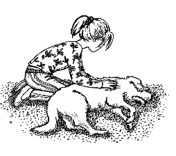
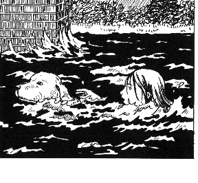

第一章　白色的拉布拉多犬

很久很久以前，我就梦想着有一只属于自己的狗。可是我们全家住在租来的房子里，而房东又明令禁止养狗。爸爸曾经几次试着和房东商量，但都无济于事。唉，世上就是有那么一些不好商量的人。

房东声称，其他的房客不希望看见房子里有狗。这简直是胡说八道——我认识住在三楼和四楼的人家，他们都很想养一只狗。事实上是房东自己不喜欢狗。

我爸爸曾说：“其实这跟喜不喜欢狗无关，他是因为不喜欢自己，所以也不愿意让别人过得快乐。”

于是我找机会仔仔细细地观察了一下房东，他的长相看上去真的是很粗俗。

后来我妈妈又向他提起养狗的事情，他竟然给我们寄来了一封挂号信，恐吓我们，要我们从房子里搬出去！

直到今天我仍然认为，没有谁有权禁止别人养狗。

但从能不能养宠物这一点来看，自己买房子真的是一件非常必要的事情。

过了一段时间，爸爸妈妈真的买了一栋带花园的房子。于是我有了自己的房间，感觉真是好极了，像生活在天堂一般。

但爸爸妈妈却没有那么快乐了，他们总是愁云满面，因为买房的实际费用比原先计划的要高。我隐隐约约地听出，家里的钱现在变得很紧张了。所以我决定在几周之内先把我的愿望藏在肚子里，不对爸爸妈妈说，虽然我真的非常渴望有一只属于自己的小狗。

一天早上，妈妈激动地把我从梦中叫醒：“吉娅，快起来，咱们房前躺着一只受伤的狗！”

我一下子从床上弹起来，冲到楼下。

是真的！在房子和车库之间的角落里躺着一只白色的小狗。它睡着了，但睡得不太安稳。

它的背上有一道长长的伤口，一直延伸到后腿，流了很多血，可能是被别的狗咬伤的。它一定是拖着受伤的身子爬到了这里，最后筋疲力尽地睡着了。

我心疼极了，心里不由得嘀咕：“是哪条可恶的恶狗咬伤了这么漂亮的小狗？”

忽然间，小狗醒了，它睁开一双圆圆的眼睛，望了望我，然后努力撑起身体。可是它实在是太虚弱了，浑身颤抖着，爪子在光滑的石板路上撑不住，一下子又趴倒在地上。我立即把它搂在了怀里。

我和妈妈小心翼翼地把它抱上车，然后来到兽医诊所。医生给小狗缝合了伤口，又给它打了一针。它渐渐放松下来，睡着了。医生告诉我们，它确实是被咬伤的，但伤得不是很重，很快就会痊愈。他还向我们介绍说，这是一条拉布拉多猎犬。这种狗非常善良、聪明，而且对孩子特别友善。因为这些特点，拉布拉多通常会被训练成导盲犬。当医生讲解的时候，我轻轻抚摸着小狗柔软的毛，心里暗暗想着，它真是太可爱了。

当我们把它带回家的时候，它还在甜甜地睡着。我们把它小心地安置在一块软垫上。我的目光一直都离不开它，心里想：“但愿它能好起来。”

正如医生所说，小狗很快就恢复了健康。这时候我又开始担心：这只小狗是从哪里跑来的？它的主人是谁？我们能这样就把它养在家里吗？我的心中突然充满了恐惧：如果爸爸妈妈不想要这只小狗怎么办？因为我们现在正缺钱呢。想到这些，我就像一只泄了气的皮球，一下子变得无精打采起来。

我们当然得去寻找失主，可是我心里暗暗希望永远也不要找到。

爸爸先是登了一则广告，还给附近的动物收容所打了电话，可是没有人听说过这只白色的拉布拉多犬。

在寻找失主的这段日子里，小狗每天都和我们在一起，我们对它的疼爱也与日俱增。不久，它便成为了我们家的一员。

一天早晨，我和小狗在一起玩，一直玩到累得跑不动了，我才来到餐桌旁吃早饭。爸爸妈妈又在谈论钱的事情了。这是我最不愿意听到的话题：一方面，我根本不懂他们在说些什么；另一方面，只要他们说到这个话题，大家就都变得垂头丧气。

当他们停下来的时候，我把话题引到一件我认为更重要的事情上：“小狗到底叫什么名字？”爸爸妈妈都回答不上来，因为我们根本不知道小狗的名字。

我觉得这太糟糕了。小狗真的需要一个名字。这个毛茸茸的小家伙正蜷成一团睡在我脚边的软垫上，我目不转睛地盯着它，绞尽了脑汁，可是怎么也想不出一个合适的名字。

这时候爸爸妈妈还在继续讨论钱的问题。突然，爸爸大声叹了口气，说道：“Money，Money，Money……什么东西都需要Money！”

小狗一下子从睡梦中惊醒了，迷迷糊糊地凑到了爸爸身边。

“Money！”我叫起来，“它对‘Money’这个词有反应！”小狗听到我的声音，又立刻跑到我的身边。

“Money在英文中是‘钱’的意思，它应该叫‘钱钱’，因为这是它自己选的名字。”我这样认为。

可是妈妈一点也不高兴，她说：“我们怎么能把一只狗叫作‘钱’呢？”

爸爸却觉得这个名字很有趣，他说：“这样的话，我们呼唤‘钱’，然后‘钱’就来了，很不错嘛！如果真的是这样，我们大家就都可以无忧无虑了。”当然，他说这句话的时候根本没有意识到，一切正和他说的一样……

于是，这条拉布拉多犬就有了“钱钱”这个名字。

6个星期过去了，我们还是没有失主的消息——当然这正合我的心意。如果找到了失主，我们就必须把钱钱送回去了，而我是多么想把钱钱永远留在身边啊。

爸爸妈妈也已经习惯了和钱钱一起生活，于是钱钱就留在了我们家。

我想，不用我说，你们也猜得到，钱钱和我已经成为最好的朋友了。

可是我还是隐隐地担心，有一天失主会突然来到我们家门前，把钱钱从我们身边带走……

那件事发生的时候，钱钱在我们家已经住了整整半年了。

它真的是一只友善温顺、善解人意的小狗。我第一次从一只狗的眼中看到了如此充满智慧的目光。有时候我甚至敢肯定，它完全听得懂我说的话。

拉布拉多犬喜欢游泳。但是我觉得，钱钱比其他任何狗都更喜欢游泳，每次遇见小溪或是湖泊，它都要下去畅游一番。我很想带它去真正的海边，在广阔的沙滩上飞奔，与浪花嬉戏，那时它该多快乐呀。可是爸爸妈妈说，这种事情现在想都不要想，因为爸爸的生意不太景气，去海边度假是根本不可能的。

星期天，我和钱钱常会沿着一条流经全城的大河散步。这条河宽得简直像大海一样，当我们站在桥下的时候，就能看到河水汹涌而过，气势逼人。

我不知道那个星期天钱钱是怎么了。早上它还是兴高采烈的，但当我们照例去散步，走到河边的时候，它突然丢下我，飞快地跑了，很快消失在我的视线里。我呼唤着它的名字，到处也找不到它，简直快要绝望了。突然，我看见湍急的河水中有一只小狗在挣扎，是钱钱！至今我仍然不知道它是怎么掉到河里去的，因为它知道我们不允许它跳进这样的河里。水流很急，它划动着四肢，奋力向桥边游去。两个桥墩中间拉着一张网，而钱钱偏偏被网缠住了。波浪一次一次淹没它的头，它越来越喘不过气来。它已经快没有力气了，眼看就要被河水完全吞没。

我要救钱钱！我不能看着它淹死！我什么都来不及想，毫不犹豫地跳入水中，因为当时已经没有时间让我再考虑其他理智的方法了，我必须救钱钱！

一切都发生得太快，我立即被水淹没。我大口大口地呛水，心里害怕极了。到处都是又脏又冷的水，而我完全分不清东南西北。后来我晕了过去，失去了知觉，之后发生的事情我完全想不起来了。

后来爸爸妈妈告诉我，我也掉到了缠住钱钱的那张网里。幸亏当时有一艘水上警察的巡逻船就在附近，他们把我和钱钱同时从水里救了出来，那时我的胳膊还紧紧地搂着钱钱。

我在医院待了几个小时，然后回了家。但这之后的几天里，我仍然非常虚弱，必须卧床休息。

钱钱恢复得比我快多了，它寸步不离地守在我的床边，一连几个小时蹲在我的面前，一动不动地望着我。我从它的眼神里看出，它明白发生过的一切。

狗懂得用感恩的目光看着你，这是许多人都做不到的。钱钱就是这样连续几个小时充满友善和感激地望着我。

当然，我当时还无法预料之后发生的一切……

不久，我12岁了。一切还是保持原样，我们还是没有去海边度过假。爸爸妈妈仍然一再说，生意受到“经济衰退”的影响。他们的意思是，国内经济形势是导致他们财务问题的根源。可我却有一个疑问，为什么在同样的经济形势下，我朋友莫尼卡的爸爸妈妈的财务状况却越来越好呢？每当我这样问起，爸爸妈妈总是很生气，对我的问题置之不理。一年中有好几个月，爸爸的收入都不理想，家里的气氛常常十分压抑。妈妈偶尔念叨着，要是我们没有买这栋房子就好了。我认为这样想纯粹是浪费时间，因为时间是无法逆转的。另外，如果没有买这栋房子，我也就不能养钱钱了。

一天，发生了一件令人难以置信的事。

当时，我正决定打电话预订一张我最喜欢的乐队新出的CD。我刚刚从电视中看到了有关的广告，记录下了订购电话。

我坐到电话机旁，开始拨号码。突然，我听见一个声音对我说：“吉娅，你应该首先考虑一下，你是不是真的买得起这张CD！”

我大吃一惊，向四周望去，门是关着的，屋子里只有我一个人。也就是说，屋子里没有其他人——只有钱钱和我在一起。也许这个声音是我自己想象出来的。我冷静下来，拾起了听筒——刚才因为受到惊吓，我连手里的听筒都扔了。我又开始拨号。突然，那个声音再次响起来：“吉娅，如果你买了CD，这个月的零用钱就都花光了。”

钱钱蹲在我面前，歪着头望着我。那个声音是它发出来的？这不可能。我又激动，又害怕。“狗是不会讲话的，即使像钱钱这样聪明的狗也不可能会讲话。”我想。

“很久以前，所有的狗都会说话——只是它们说话的方式和人不一样罢了，可是后来这种能力逐渐退化了。”钱钱望着我说，“不过我还保留着这个能力。”

我曾在电影里看到一头会说话的骆驼。“可那是在电影里面，”我琢磨着，“而我们现在不是在演电影，这是现实生活啊。”立刻又有一个念头钻入我的脑海：“也许我是在做梦。”我迅速地捏了一下自己的胳膊，哇！好疼！——看来我并没有做梦。

钱钱一直望着我。过了一会儿，我听见那个声音再次响起来：“我们现在是不是可以正常地谈话了？还是你要再捏一会儿，再惊讶一阵子呢？”

我突然觉得自己能听见钱钱说话是一件十分普通和正常的事情，仿佛我们这样对话已经有好几年的时间了。我无法解释为什么会有这样的感觉。只是有一点我觉得很奇怪：钱钱说话的时候，它的嘴是一动不动的。

“我们狗说话的方式比你们人类要先进许多。当我们想传达某个信息的时候，我们就将信息直接送入对方的大脑里，”钱钱说，“因此，我也知道你在想什么。”

听到这里，我简直惊呆了。“你是说，你可以读到我的全部想法？”我问道，同时拼命地回忆自己之前都想过什么。

可是钱钱打断了我的思路。它说：“我当然知道你的想法。我只要靠近一个人，就能够在一定程度上读懂他的思想。所以我知道你很难过，因为你的爸爸妈妈出现了很多财务问题，而且我还知道你也正要犯同样的错误，步他们的后尘。一个人能否安排好自己的花费，是在他人生的早期就决定了的。其实，我本不想和你说话，因为一旦科学家知道我有这个本领，他们就会把我关进笼子，在我身上做各种各样的实验。所以我从来没有告诉过任何人我有说话的能力。但是你冒着生命危险救过我的命，所以我要为你破例。可你必须保密，不能让任何人知道。”

我有一大堆问题要问钱钱。我想知道，它是从哪里来的，它以前的主人是谁，是谁弄伤了它……但是没等我问，它就说：“我们能谈话，是上天的恩赐——你将来会更理解我这句话的。现在我们不应该浪费时间来回答这么多的问题。我建议，我们只谈有关钱的问题，因为我想尽可能地帮你降低风险。”

“可是我对其他话题更感兴趣。”我心想，况且妈妈常说，钱并不是人一生中最重要的东西。

“我也不认为钱是人一生中最重要的东西。可是假如我们缺钱的话，钱就会变得格外重要。你回想一下那次我们差点淹死在河里的情形，当时我们想的只是必须从河里爬上来，其他的一切都变得无关紧要了。而你的爸爸妈妈现在面临的正是这样一种局面。因为他们的经济状况太糟糕了，所以才会不停地谈论钱这个问题——他们就像是掉进河里的人，随时都有被淹没的危险。我想帮助你，是因为我希望你不要重蹈他们的覆辙。如果你愿意，我可以帮助你，让钱成为你生活中一种令人愉快的力量。”

我还从来没有考虑过这个问题。我当然希望爸爸妈妈能有更多的钱，可是我不免有点怀疑：让一只小狗来当经济顾问，能行吗？

“等着瞧吧。”钱钱的笑容似乎带着一点点骄傲。它接着说：“还有一点更为重要，那就是只有在你真的愿意的情况下，我才帮得了你。所以请你认真考虑一下。你们人类总是被自己的思想欺骗，所以我建议你，有些时候应该把自己的想法用笔记录下来。请你在明天之前想出10个你想变得富有的原因，也就是你的10个愿望，然后用笔写下来。明天下午6点钟，我们一起去树林里散步。”

我觉得，现在就学习金钱方面的知识对自己来说似乎有点太早了。而且爸爸妈妈的经历让我觉得，钱不是什么好东西。

钱钱当然又读出了我的想法。我立刻听见它的声音在说：“你的爸爸妈妈之所以陷入经济困境，是因为他们在像你这么大的时候没有学会理财的艺术。中国的智者老子说过：‘天下难事，必作于易；天下大事，必作于细。’金钱有一些秘密和规律，我可以慢慢解释给你听。但前提条件是，你自己必须真的有‘想要变得富有’这个愿望，所以你必须找到10个‘想要变得富有’的理由。在此之前我不会再和你谈话了。”

在那天剩下的时间里，我绞尽脑汁地想啊想啊。我要思考的东西实在是太多了，可是无论如何，我都决定不对任何人说出我的这个新发现。我绝对不希望钱钱成为科学家们无数实验的牺牲品。我仿佛已经看见他们把钱钱装进一个狭小的笼子，又在它身上接上许许多多的管子。不！我绝不允许有人这样对待钱钱！所以我不能把钱钱会说话的事告诉任何人。而且我也决定不继续追究钱钱以及它身上发生的奇迹的问题，我预感到自己永远也弄不清楚这些事。

而且，我也不明白为什么从现在起就必须考虑钱的问题。我想起那句中国的名言：“天下难事，必作于易；天下大事，必作于细。”这究竟是什么意思呢？

我突然想到了邻居家的狗——亨瑞。邻居得到亨瑞的时候，它已经5岁了。亨瑞一点儿也不听话。邻居总是说，现在要改变它已经很困难了。如果在它年幼时就训练它，会容易许多。

要爸爸妈妈学习金钱的知识，或许和亨瑞的情况有点相似。而且看钱钱说话的架势，它好像是认真的。所以我必须找到10个我想变得富有的原因，也就是10个愿望。这可不容易，因为我的许多愿望其实并不需要很多钱就可以实现了。

我用了足足3个小时，才列出了下面这个单子：

1．一辆18挡的变速自行车。

2．所有我想要的CD。

3．向往已久的漂亮运动鞋。

4．经常给住在200千米外的好朋友打电话，想打多久就打多久。

5．明年夏天参加交换学生项目去美国，提高自己的英语水平。

6．帮爸爸妈妈还清债务，让他们不再那么伤心。

7．请全家去意大利餐厅吃大餐。

8．帮助和我一样不太富裕的孩子。

9．黑色的名牌牛仔裤。

10．一台笔记本电脑。

写完这份清单以后，我突然觉得“富有”是一件很值得去争取的事情——富人可以轻易买到这些东西，也能做许多有趣的事情。列单子的时候，我还想到了我的几个朋友。我决定问一下钱钱，我是否可以将自己学到的有关金钱的知识告诉我的朋友们。我忽然希望时间能过得快一点儿，让第二天下午的6点钟快一些到来。那时，我就可以知道自己怎样才能变得富有了。
