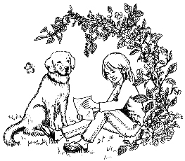

第二章　梦想储蓄罐和梦想相册

我根本没办法集中精力做家庭作业。当闹钟的时针终于挪到“6”的位置时，我迅速地跑向花园。钱钱已经等候在那里了。我立即牵着它走进树林。我心里非常紧张，一路上一句话都不敢和钱钱说。终于，我们来到了秘密据点。

这是一片葱郁的树林，秘密据点就是林中一个隐蔽的小土洞。要进入洞内，首先得爬过一条5米长的狭窄通道。洞里面被我布置得十分舒适——真的很舒服！除了我和钱钱，没有人知道这个地方。在这里我们感到很安全。

我的心紧张得要跳出来了。但愿钱钱还能说话，可是谁知道呢，没有人能预测下一分钟将会发生什么。我有那么多的问题想问它，可是我立刻回想起钱钱说过的话，它只和我讨论有关钱的话题，所以我等着它开口。

钱钱看着我说：“吉娅，你有没有找到想要变得富有的原因？”

“当然了！”我急忙答道，从口袋里掏出单子。

“把它读给我听听。”钱钱说。于是我照着单子念出了我的10个愿望。

“这当中哪些对你是最重要的呢？”它接着问。

“全都重要。”我答道。

“这点我相信，”钱钱回答说，“可是尽管如此，我还是要请你再仔细看一看你的单子，并且把最重要的3项圈出来。”

我的注意力再次回到单子上，我又逐一阅读了我的愿望。要决定哪3个愿望是最想实现的，真是一件困难的事情。我终于完成了这项任务，圈出了其中的3项：

1．明年夏天参加交换学生项目去美国，提高自己的英语水平。

2．一台笔记本电脑。

3．帮爸爸妈妈还清债务，让他们不再那么伤心。

“很好的愿望，你做了很聪明的选择。”钱钱兴奋地说，“我要祝贺你！”

我心里洋溢着自豪感。可是我还是不明白做这个练习到底有什么意义。钱钱又一次看出了我的想法，马上回答说：“大多数人并不清楚自己想要的是什么，他们只知道，自己想得到更多的东西。你可以把自己的生活想象成一家很大的邮购公司。如果你给一家邮购公司写信说‘请给我寄一些好东西来’，你肯定什么都得不到。我们的愿望也是一样。我们必须确切地知道自己心里渴望的是什么才行。”

我有点怀疑：“是不是只要我明确知道自己想要什么，就真的能实现呢？”

“当然你还要为此付出努力，”钱钱答道，“但是至少你已经迈出了关键的第一步。”

“是因为我写下了自己的愿望吗？”我问道。

“是的。”钱钱说，“从现在开始，你必须每天都把这张写着自己的愿望的单子从头到尾看一遍，它会不断地提醒你自己想得到什么，那么你就会密切关注一切可以帮助你实现这些愿望的机遇了。”

“我想知道，这种方法会不会有效？”我有些怀疑地问道。

钱钱严肃地盯着我的眼睛说：“如果你带着这样一种态度来做这件事的话，我的方法肯定发挥不了作用。但是只要你做3件事，就可以轻易改变自己的想法。第一，我建议你拿一本相册作为你的梦想相册。收集一些与自己的愿望有关的照片，把它们贴在相册里。我们要通过图片来思考。”

“通过图片来思考？”

“就是说，不借助文字。”钱钱答道，“当你想到加利福尼亚的时候，你的脑海里浮现出的是‘加利福尼亚’这几个字，还是某一幅画面？”

钱钱说得有道理，我的眼前立刻浮现出迪士尼乐园、旧金山和好莱坞的画面。

“那我到哪里去找这些照片呢？”我问钱钱。

钱钱用一种奇怪的眼神看着我，好像在嘲笑我似的。

“好吧，”我赶紧说，“笔记本电脑的照片我可以从广告里剪下来，关于美国的照片我也许可以向交换学生机构要。可是尽管如此，我还是不太明白为什么要做这些。”

“有的时候我们不需要完全明白这种方法为什么有效，也不必管它是怎样起作用的，关键是它有效。比如说，你能给我解释一下电是如何工作的吗？”钱钱反问我。

我没料到它会向我提出这个问题。为什么钱钱问的偏偏是关于电的问题？要是我能说出一点儿什么就好了，其实我在学校里刚刚学过这个内容。

“你看，”钱钱继续它的话题，“你并不需要解释电的原理，但是你知道一按灯的开关，灯就亮了。我们狗对理论术语不感兴趣，我们只要知道一样东西是有用的就足够了。所以，你去准备一本相册，然后开始往里面贴照片。”

“我只是有点好奇罢了。”我忍不住嘟囔了一句。

钱钱立刻说：“好奇是好的，但是绝不能让好奇阻碍你做事。太多的人做事犹豫不决，就是因为他们觉得没有完全弄懂这件事。真正付诸实践要比纯粹的思考有用多了。”

“我同意，”我向钱钱保证说，“我会试试看。”

没等我说完，钱钱就又打断了我的话：“不是试试看，而是去切实行动！如果你只是抱着试试看的心态，那么你只会以失败告终，你会一事无成。‘尝试’纯粹是一种借口，你还没有做，就已经给自己想好了退路。不能试验，你只有两个选择——做或者不做。”

我陷入了沉思。我记得自己身边有一个人总是喜欢说“我试着做……”，对了，是爸爸。他总是说，他今天要试着赢得一个新客户，可是大多数时候他都失败了。也许钱钱说对了，成功与否也许真的和“试”这个词有一点关系。所以我决定试着不再用“试”这个词。

钱钱突然轻轻地嘟囔了一句。

该死的！我又用了这个词！我不能说我“试”着，而要说我从今以后不再用这个词了。

钱钱一直注视着我：“这不太容易，对吗？”

我想起钱钱刚才说过，只要做到3件事，我就会相信自己的愿望真的可以实现。第一件事就是准备一本相册，贴满与我的梦想有关的照片。那么另外的两件事是什么呢？

我立即得到了回答：“第二件你可以做的事，就是每天看几遍相册，然后想象着，你已经在美国了，已经拥有笔记本电脑了，还要想象你替爸爸还清债务后自豪的神情。”

我诧异地说：“这和做梦是一样的呀！可是妈妈总是告诉我，不要做白日梦。”

钱钱耐心地解释道：“人们把这种行为称作‘视觉化’。成功的人之所以成功，就是因为他们一直梦想着自己成功的那一天，不停地想象着自己实现了理想时的情形。当然，人不能停留在梦想里，你妈妈要对你说的是这一层意思。”

我觉得这一切都显得很可笑。这跟我设想中的关于金钱的第一课完全不同。

“这就叫学习，”我立即听见了钱钱的回答，“学习就是认识新观念和新想法的过程。假如人们始终以同一种思维方式来考虑问题的话，那么始终只会得到同样的结果。因为我对你讲述的许多内容是你以前从未接触过的，所以我建议你，在你还没有做之前，不要轻易下结论。没有想象力的人是很难成就大事的。我们对一件事投入的精力越多，成功的可能性也越大。可是大多数人把精力放在自己并不喜欢的事情上，而不去想象自己希望得到的东西。”

我马上联想到我的克里丝特阿姨。她总是觉得要做的事情太多，无法应付，她的神经快要崩溃了。结果就是她连一件小事都做不成。我也想到了爸爸。爸爸的脑子里装的全是“如何让我们渡过眼前的难关”这样的问题，而他的这种想法却在某种程度上使情况越来越糟。

“你可以做的第三件事就是准备一个梦想储蓄罐。”钱钱继续说。

“梦想储蓄罐？”我不解地问。

钱钱笑了，解释道：“是的，因为没有钱的话，你就去不成加利福尼亚。最好的攒钱方法之一就是使用梦想储蓄罐。你随便拿一个罐子，然后在这个罐子上写上你的梦想，把它作为你的储蓄罐。但是你要为自己的每一个梦想各准备一个储蓄罐。一旦储蓄罐准备好，你就应当把省下的每一分钱放进去。”

我的脑子里立刻有了许多反对意见：“那我得准备许许多多的储蓄罐。而且即使我每次能往每一个储蓄罐里放上1马克（马克：原德国货币单位，现在已经被欧元所取代。）我最早也得等到20岁生日的时候才能攒够钱。何况这样一来，我就没有钱来满足其他的愿望了……”

钱钱静静地看着我说：“你首先考虑的总是事情做不成的原因，你有没有注意到这一点？”

“也许有时候是吧。”我轻声嘟囔着说，“如果我们考虑的是如何让我得到更多的零花钱的问题，那样是不是要好得多呢？比如说，假如我得到的零花钱是现在的两倍，那么我肯定觉得棒极了。”

钱钱的声音一下子变得严肃起来：“吉娅，你现在可能不相信我说的话，但如果你的零花钱是现在的10倍的话，你的问题只会变得更加严重。因为我们的支出永远是随着我们的收入而增长的。”

在我看来，这也太夸张了。如果我的零花钱是现在的10倍，我一定感觉像生活在天堂里一般。

可是钱钱一点儿也不放过我：“看看你的爸爸妈妈，他们拥有的钱比你零花钱的10倍还要多得多，也许是你的100倍。尽管如此，他们的情况也并不好。钱的数目并不是决定性因素，更重要的是我们怎么来使用它。我们首先必须学会量入为出，只有这样，我们才有能力获得更多的钱。这些我会在今后几天里解释给你听，现在还是回到梦想储蓄罐这个话题上来。你马上就开始做这件事怎么样？”

“可是这么多的储蓄罐，我会弄糊涂的。”我答道。

“所以我让你从你列的单子里找出了最重要的愿望。”钱钱解释说。

我又看了一眼我的清单。不错，我最大的愿望是去美国旅行，买一台笔记本电脑，并且帮爸爸妈妈从债务中解脱出来。我可以为前两个愿望准备一个储蓄罐，而帮爸爸妈妈还债的希望简直是太渺茫了。

“的确如此。”钱钱看出了我的想法，“过几天，我们会讨论你爸爸妈妈的债务问题。其实，解决这个问题比你想象的要容易许多。你只需要两个储蓄罐，这肯定不难办到吧？”

“好的，我试一下……不是，我是说，我会去做。”我向钱钱保证道。

“那就马上开始吧。”钱钱要求我。

我有点吃惊：“你是说，现在立即开始？”

钱钱点了点头。

于是我闭上眼睛，首先想象我用自己的笔记本电脑写着家庭作业，这样作业就显得整齐多了，而且修改起来也会更方便；当然我也会得到更高的分数；而且我还能用它来玩超级棒的电子游戏……

接着我又开始想象自己在旧金山度过了3个星期。我住在一户友善的人家里；我还设想自己认识了一个很可爱的女孩，我们在一起共同度过了美妙的时光，我还从来没有遇见过这么投缘的朋友；而且我学到了许多东西，见识了许多不同的事物……

我还看见爸爸送我去机场，他的心情很好，因为他已经不必为还债而发愁了。瞧，他有多自豪。这简直太棒了。他甚至还吹着口哨——他最好还是别吹了，都走调了，但我还是喜欢他的这副样子，因为他看起来是那么高兴。

过了一会儿，我再次睁开眼睛。

“怎么样？”钱钱想立即知道我的感受。

“好极了，”我告诉它，“我真的很喜欢这种感觉。但我还是不明白这样做为什么会有用。”

“想一想电的问题，”钱钱提醒我说，“你不必明白其中的奥秘，你只需要知道这是有用的就够了。而且老实说，我也没办法给你解释清楚。有一只海鸥曾经对我说过：‘在你展翅飞翔之前，你就必须相信自己能到达目的地。’你必须设想自己已经拥有了这些东西，这样你的一个小愿望才会变成一种强烈的渴望。你想象得越多，你的愿望就越强烈，那么你就会开始寻找机会来实现自己的梦想。吉娅，机会到处都是，但是只有在你寻找它的时候，你才能看见它。只有当你心中有了强烈的渴望，你才会去寻觅机会。而当你想象的时候，强烈的渴望就产生了。”

“也许你是对的，”我一边回答，一边还在回味刚才的感觉，“我还从来没有认真考虑过去旧金山的事情。有一次我婉转地征求过妈妈的意见，她立即回答我说：‘根本别想这件事。’从那以后，我就没有再真正考虑过这个问题。现在我的愿望突然又变得非常强烈了。”

钱钱满意地咕噜道：“为此我应该得到一块饼干作为奖赏。”

我惊讶地看着它——自从钱钱成了我的老师，在我的眼里，它根本不再是一只狗了。我得赶快把心态调整过来才行。我迅速掏出一些饼干喂它。钱钱吃得津津有味，一下子就吃完了。

我还有好多问题要问它——我突然觉得世间有那么多秘密。可是钱钱说过，它和我只谈钱的问题，所以我只得把那些问题吞回肚子里。但是有一个问题始终困扰着我，我必须弄清楚，于是我问道：“钱钱，你是从哪里学会这些东西的？”

钱钱被逗乐了，答道：“因为狗绝顶聪明呗。”

“原来如此。”我说，“那么看家狗和卷毛狗为什么不会呢？”

钱钱笑了，答道：“我曾经住在一个非常富有的男人家里，但是我现在不想谈这件事，你以后会知道的。我们现在回去吧，已经很晚了。”

钱钱说对了，差不多快到吃晚饭的时间了。于是我们跑回家去。

吃晚饭的时候我完全心不在焉，而且也没有什么胃口。妈妈担心地看着我说：“吉娅，你不舒服吗？”

我只是大声地叹了口气，什么也没有说。我什么也不能说，我要思考那么多事情、那么多问题。

晚饭终于结束了，我回到房间，立即开始行动。

我需要一本相册。我拿出了一本旧的纪念册——这个应该可以派上用场。现在我要把笔记本电脑和加利福尼亚的照片贴进去。但是我惊讶地发现，我没有任何有关加利福尼亚的照片或是广告，什么也没有。我意识到我真的没有重视过自己的愿望。于是我决定明天立即去收集广告。

现在我至少可以准备一下储蓄罐。我找到一个装巧克力的空盒子，用透明胶带把盒盖封住，然后在盒盖上开了一个口——就像小猪储蓄罐上的开口一样。我用签字笔在盒盖上面写上了“笔记本电脑”几个大大的字。我想，等我找到照片后，我要把一张特别漂亮的笔记本电脑的照片贴在储蓄盒上面。也许我能找到一张特别大的，那样我就可以把整个盒盖都蒙住了。那时候，储蓄盒看起来就像一台笔记本电脑一样——开了一个口的笔记本电脑。我觉得这个主意很棒。随后，我又拿了爸爸的一个雪茄烟盒，并在上面写上“旧金山”几个大字。

现在梦想储蓄罐已经有了，但是我往里面放什么呢？我每个月的零花钱是20马克，用这笔钱我正好可以买一张CD。我想了想，假如我现在给每个盒子里放上5马克，那么剩下的钱就不够买一张CD了。真是个艰难的决定。我想，也许我每隔两三个月买一张CD会好一些，那么我就可以把一半的零用钱存起来了。这样一段时间以后，也许我真的能实现我的愿望。我越来越喜欢这个主意，所以我最终决定往每个梦想储蓄罐里放进5马克。

我骄傲地看着这两个梦想储蓄罐。它们突然显得那么重要。我觉得我一定会成功的。我的感觉棒极了！

我躺在床上，心里激动极了。我今天学到了那么多的东西。我的生活突然变得那样激动人心！肯定没有人能像我一样拥有这样一只不同寻常的狗。过了好久，我才终于进入梦乡。我梦见了钱钱，梦见了美国，还梦见了许许多多的笔记本电脑……
