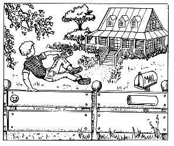

第三章　达瑞，一个很会挣钱的男孩

“吉娅，该起床了！”我听见妈妈在喊我。要不是妈妈叫醒我，我肯定睡过头了。我觉得，有时候人想多睡一会儿，是因为想让梦做得更长一点儿。

我在床上伸了个懒腰。妈妈拉开了窗帘，阳光顿时洒满了整个房间。看到屋里乱七八糟，妈妈生气地摇了摇头。她一下子就发现了我的梦想储蓄罐，于是把两个都拿起来看。当她看见我写在上面的“笔记本电脑”和“旧金山”时，眉头紧紧地皱到了一起。“你怎么会有这么古怪的念头？”她问道。

我涨红了脸，感到全身发热。我答道：“你知道我一直想参加交换学生项目去美国的。另外，我要是有了一台电脑，写作业就更方便了，所以我想开始存钱。”

妈妈两手各拿着一个被我当作梦想储蓄罐的盒子，吃惊地看着我。她把一个盒子摇了摇，里边的那枚5马克硬币撞在盒壁上，发出沉闷的响声。“这里面真的有钱，”她感到很惊讶，“究竟有多少钱？”

我不想和妈妈谈论下去，于是含含糊糊地说：“5马克。”

“5马克就想买笔记本电脑，就想去美国旅行？你等的时间一定不会太长。”妈妈开始咯咯地笑起来，“假如你旅行需要3000马克的话，那么……”她在脑子里计算着，这可不是她的强项，“一个月攒5马克，一年12个月就是60马克，10年就是600马克……等到你攒够了钱，已经过去50年了！”她终于得出了一个结论，然后笑得前仰后合。

我讨厌妈妈嘲笑我的样子，泪水不争气地夺眶而出。我不想让妈妈看见我哭，所以拼命地忍着，可是怎么努力都没用，这让我更加恼火了。

妈妈跑出房间，大声叫爸爸：“哎，乔治，我们的女儿是个理财天才，她马上就要去旧金山了，哈哈哈！”

我再也控制不住了。我对着走廊大吼道：“你们等着瞧吧，我一定会去的！而且我明年暑假就去！我连一张明信片都不会给你们寄！你们就自己背着一屁股烂债吧！我不会帮你们的！”

接着我摔上了门，扑倒在床上放声大哭。我生自己的气，谁让我告诉她的呢，闭上嘴不就行了吗？我恨不得把盒子踩个粉碎。这种存钱的想法太可笑了，肯定没有用的。放学以后我要马上告诉钱钱，这是多无聊的一件事。等我成了老太婆的时候再去美国，这主意真是绝妙透顶！

学校里的一天糟糕透了。在课堂上，我根本没办法集中注意力。幸好这天没有测验，甚至不用做任何课堂作业，否则我的成绩肯定一塌糊涂。我也没和我的好朋友——同桌莫尼卡说一句话。我一言不发地想着心事，迫不及待地盼着能马上放学。最后莫尼卡忍不住了，她写了张字条递给我，而我连看也没看就塞进了牛仔裤兜。

休息的时候，我飞快地跑出教室。我只想一个人待着。但是莫尼卡跑过来追上我，问道：“你这是怎么了？是病了还是丢了什么东西？和爸爸妈妈吵架了吗？还是钱钱的主人来找你们了？别难过，一切都会过去的。”

“全都不是。”我不耐烦地打断了莫尼卡，否则她会一刻不停地问下去的。莫尼卡就是太喜欢说话了，而且根本守不住任何秘密，所以我们的班长亚森总是说，如果谁把什么事情告诉莫尼卡的话，就和登在报纸上没什么不同了。

莫尼卡还在锲而不舍地刨根问底。她和所有爱说话的人有同样的毛病——好奇心特别强。我知道这下子我别想安静了，于是在心里盘算着，怎么对她说才不会对钱钱有任何威胁。我决定告诉她梦想储蓄罐和妈妈嘲笑我的事。对她说完这些之后，我又补充说：“所以我必须有很多钱——而且要快。”

莫尼卡迷惑不解地看着我说：“那你就问你的爷爷奶奶要嘛，他们肯定会给你的。要是我就这么做。”

“莫尼卡，我爷爷奶奶的钱自己还不够用呢。”我答道。莫尼卡家里很有钱，跟我家的情况完全不同。

“那就问你叔叔婶婶要。”莫尼卡建议道。

“你烦死了，”我对她说，“我们家的人都没有钱，我没办法拿到钱。”

“也许确实是这么一回事，但是我还是要说，你太容易放弃了，连试一下都不愿意。在做什么事之前，你总是首先想‘这事是做不成的’，这样肯定不会成功。”她回答说。

我心里一动，钱钱也对我说过类似的话。也许他们真的说对了。

莫尼卡的确有很多缺点，但是她有一个优点，那就是从不气馁。在学校里她不算是特别聪明的学生，但是她的功课却很好。

休息时间结束了，我们又回到教室。我暗暗告诉自己，不能再这样悲观了。

终于熬到了放学。我一路跑回家，狼吞虎咽地吃完饭，就牵着钱钱跑进了树林。当我们好不容易来到秘密据点的时候，我简直等不及了，把憋在心里要说的话一股脑儿地告诉了钱钱：“我都快被你的主意气死了。妈妈发现了我的梦想储蓄罐后，嘲笑了我一番。她给我算了算，说我得用上50年的时间才能去美国，那时候我早成老太婆了。”

钱钱沉默地看了看我，然后低下了头，它看上去有一点儿忧伤。

终于我听见它低声问道：“你是真的想去美国，真的想拥有一台笔记本电脑吗？”

“当然了。”我坚定地回答。我必须承认，我坚定的语气让我自己都吃了一惊。昨天的想象、梦想储蓄罐以及梦想相册真的让我对自己的愿望非常确定。

“那好，”钱钱的目光似乎要将我看透一样，“因为这是最关键的。知道如何去实现并不是目前最重要的事情。最重要的是，你真的有这样的愿望，否则你一遇到困难就会放弃了。”

它说得对。和妈妈的争吵让我更加坚定了自己的想法，我一定要做成这件事。

“我从来也没有说过这件事很容易成功啊。”钱钱继续说。

“但是我真没想到我妈妈会是那种态度。”我伤心地说。

“让我们痛心的阻力总是从我们最想不到的地方来的。”钱钱答道，“我们现在应当考虑的是，怎样才能让你在变成老太婆之前就攒够这笔钱。”

“没指望了，”我回答钱钱，“我已经和莫尼卡讨论过这个问题了。我的亲戚都不富裕，我没办法向他们要钱。我简直快绝望了。”

钱钱气呼呼地用前爪刨着地说：“你不要总去想做不到的事情，你完全可以通过打工来挣钱呀！”

我开始生自己的气，我总是往事情的消极面去想，我一定要改掉这个习惯。可是我只是一个12岁的女孩，怎么才能去挣钱呢？我有了一个主意：“也许我可以定期在我们家的花园里割草，这样我肯定可以有几马克的收入。”

钱钱显得有点激动，它说：“你自己也住在这栋房子里，你自己也享用这个花园，你帮忙干点活是理所应当的，不能因此跟爸爸妈妈要钱。再说，爸爸妈妈为你做了很多事，他们也没有要你付过什么钱呀！”

“你说得也对，那我该到哪里去挣钱？”我问它。

“没有比这更容易的了。”我立即听见了钱钱的回答，“我会给你讲一个有趣的故事，一个名叫达瑞的美国男孩，他在17岁的时候就已经挣到了几百万马克，而他其实只不过是一个非常普通的男孩。但是在讲故事之前，我先要告诉你一个非常重要的道理：你是否能挣到钱，最关键的并不是你有没有好点子，也不是你有多聪明，而是你的自信程度。”

“我的自信程度？”我重复着钱钱的话，又问道，“这和挣钱有什么关系呢？”

钱钱一脸严肃地直立起来，它是在向我表明，这是非常重要的内容：“你的自信程度决定了你是否相信自己的能力，是否相信你自己。假如你根本不相信你能做到的话，那么你就根本不会动手去做，而假如你不开始去做，那么你就什么也得不到。”

我不能肯定自己是否真的听明白了，但是我想起了一件事。不久前有一次，我忘记第二天有课堂测验，事先没有复习。早晨到了学校，班里的同学和我说起了测验的事。我相信自己可以在很短的时间里复习完，于是逃了两节美术课，躲在校园里的一张长椅上开始复习。结果那次测验我真的得了个“良”。如果我不相信自己的能力的话，我就根本不会开始复习了。

“太棒了，”钱钱欢呼道，“这就是自信。”

我总是忘记它能读懂我的想法。

我还没有完全从自己的回忆中走出来，于是有点恍惚地说：“我不觉得自己特别自信。”

“那没关系，”钱钱说，“自信是很容易树立的。你想知道应该怎样做吗？”

“当然了。”我赶紧回答。

“那么我可以告诉你。你去准备一个本子，给它取名叫‘成功日记’，然后把所有做成功的事情记录进去。你最好每天都做这件事，每次都写至少5条你的个人成果，任何小事都可以。开始的时候也许你觉得不太容易，可能会问自己，这件或那件事情是否真的可以算作成果。在这种情况下，你的回答应该是肯定的。过于自信比不够自信要好得多。”

钱钱想了一会儿，然后接着说：“你最好立即开始做这项工作。我们一会儿晚饭后再见。到那时我会给你讲达瑞的故事。”

我很想立即听到达瑞的故事，可是我越来越信任钱钱了，相信它的安排是有道理的。看上去似乎所有的事情都在它的掌握之中，所以我同意了。我们一起散步回家。

一回到家，我就钻进自己的房间。我拿出一本旧的练习本，这是我以前的化学作业本。我把写了字的几张纸撕掉，然后在本子的封面上贴了一张新的标签，写上“成功日记”。

我写下今天的日期，准备开始我的第一篇成功日记。我目不转睛地盯着面前的白纸，我昨天都做成什么事了呢？想了好一会儿，除了准备梦想储蓄罐这件事，我什么都想不起来了。但是另一方面我又不敢确定这件事是不是成功。我问自己，是不是能算上这件事。

我突然想起钱钱对我说过，开始时，如果不能肯定是否应该写下一件事，那就应该作出肯定的回答。

于是我开始写：

1．我做了两个梦想储蓄罐。尽管我不能肯定这是否会成功，但我还是这样做了。如果我不做，就绝对不会成功。

2．我在每个储蓄罐里放进了5马克。

3．我开始制作梦想相册。

4．今天开始撰写我的成功日记。

5．我决定挣很多的钱。

6．我决定永不气馁。

7．我要学很多有关钱和挣钱的知识。

我看了看自己列的单子，突然感到非常自豪。做这些事的孩子肯定不会多。我觉得自己甚至有点骄傲自大了，但是也许所有不同寻常的人都有些疯狂吧。

接着我写完了家庭作业。吃完晚饭，我和钱钱走进了树林。现在是夏天，天黑得很晚。妈妈不喜欢我晚上还去树林，但是我必须和钱钱单独说话。

我先得意扬扬地告诉钱钱，我真的在成功日记里写下了5件我做成功的事情。钱钱对此很满意。

然后我急切地等着听关于达瑞的故事。

钱钱不再吊我的胃口，它开始讲故事——

“有一次达瑞对别人讲自己的故事，而我正好听见了。故事是这样开始的。在达瑞8岁的时候，有一天，他想去看电影但是没有钱。他面临一个基本的问题，是问爸爸妈妈要钱还是自己挣钱。最后他选择了后者。他自己调制了一种汽水，把它放在街边，向过路的行人出售。可那时正是寒冷的冬天，没有人来买，只有两个人例外——他的爸爸和妈妈。

“他偶然得到了一个机会，可以与一位非常成功的商人谈话。当他对商人讲述了自己的‘破产史’后，商人给了他两个重要的建议：第一，为别人解决一个难题，那么你就能赚到许多钱；第二，把精力集中在你知道的、能做的和拥有的东西上。

“这两个建议很关键。因为对于一个8岁的男孩而言，他不会做的事情有很多。于是他一边沿着大街小巷漫步，一边不停地思考人们会有什么难题，他又该如何利用这个机会为他们解决难题。

“这其实很不容易。好点子似乎都躲起来了，他什么办法都想不出来。但是有一天，他的爸爸无意中给他指出了一条路。吃早饭时，爸爸让达瑞去取报纸。这里必须补充一点，美国的送报员总是把报纸塞进花园篱笆上挂着的报箱里。假如你想穿着睡衣舒舒服服地一边吃早饭一边看报的话，就必须先离开温暖的房间，冒着寒风到房子的入口处去取。即使在天气不好的时候也是如此。虽然有时候只需要走二三十米路，但也是非常麻烦的事情。

“达瑞为父亲取报纸的时候，突然冒出了一个主意。当天他就挨个按响邻居的门铃，对他们说，只需每个月付给他1美元，他就负责每天早上把报纸塞到他们的房门底下。大多数人都同意了，达瑞很快有了70多个顾客。一个月后，当他第一次自己赚到了钱的时候，他高兴得简直快飞上了天。

“高兴的同时他并没有满足于现状，他还在寻找新的机会。成功了一次之后，他很快就找到了其他的机会。他让他的顾客每天早上把垃圾袋放在门前，然后由他丢到垃圾桶里——每个月加1美元。另外他还负责喂宠物、看房子、给植物浇水。但是他从来不以小时计费，因为用其他方法计费挣的钱更多。

“9岁时，他开始使用父亲的电脑，学着写广告。他还把孩子能够挣钱的方法记录下来。因为他不断有新的主意，所以很快就有了丰厚的积蓄。他的妈妈帮他记账，好让他知道什么时候该向谁收钱。

“他也雇别的孩子帮他的忙，然后把收入的一半付给他们。如此一来，钱如潮水般地涌进了他的腰包。

“一个出版商注意到了他，并说服他按自己的经历写了一本书，书名为《孩子挣钱的250个方法》。因此，达瑞在他12岁的时候就已经成为了一名畅销书作家。

“后来电视台发现了他，邀请他参加了许多儿童谈话节目。他在电视节目里表现得非常自然，受到许多观众的欢迎。15岁的时候他创办了自己的谈话节目。后来，他通过做电视节目以及广告挣的钱多得真的让人难以置信。

“当达瑞17岁的时候，他已经拥有了几百万美元。”

故事讲完了，钱钱向我提了一个问题：“你认为他在获得成功的道路上最关键、最重要的因素是什么？”

我还沉浸在达瑞神奇的经历之中。我很想回答钱钱，最关键的因素是电视台，但是如果没有写书，他也不会上电视，如果他没有在挣钱上获得成功的话，他也不会写书……

钱钱打断了我的思路，它说：“的确如此。其实从达瑞把精力集中在他知道、能做和拥有的东西上的那一天起，他的成功就已经拉开了序幕。这一决定使得一个孩子完全有能力挣到比成人更多的钱，因为成人经常把一生的时间都用来考虑他们不知道、不能做或没有的东西上。”

“原来又是自信的问题，”我发现了问题的本质，“但这些想法在我们这里也有效吗？美国的孩子拥有的条件肯定比我们好多了。”

钱钱响亮地叫了3声。

我怔住了。钱钱以前几乎从来不叫。我害怕地四处张望，也许我们遇到危险了。可是我什么可疑的东西也没有发现。突然我领悟过来，是我说了不该说的话。我真恨不得咬掉自己的舌头。我又做了我不应该做的事，又把注意力放在了我做不到和没有的东西上面了。虽然我不是住在美国，可是这里肯定也有其他的机会。

钱钱满意地说：“太好了！现在我们都应该得到奖励了。”

我赶紧从口袋里拿出几块饼干，喂给钱钱。它吃得津津有味。

我仿佛一下子充满了勇气。我觉得自己肯定能找到赚到钱的方法。我轻轻挠了挠钱钱的脖子，它舒服地抖了抖身上的毛，发出像小猫一样的呼噜声。几分钟之后，我们往家里走去。
