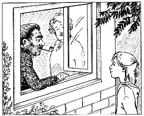
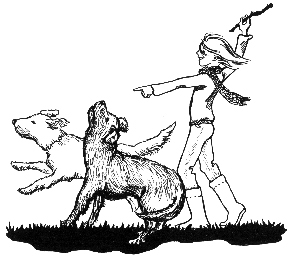

第四章　堂兄的挣钱之道

今天和钱钱的谈话引起了我许多的思考。我躺在床上，辗转难眠。我无论如何也得想出一个能让我挣到许多钱的方法。可是我该怎么做呢？我又该从哪里开始呢？达瑞获得的成功实在令人惊叹，但他毕竟只是一个特例，而且美国的条件也好多了。另外，他的爸爸妈妈也允许他做这些事情——并不是所有的孩子都有这么开明的父母。也许我做这些事情的确太早了……

我又一次想起钱钱对我说过的关于自信的话。假如我对自己的能力多一分自信的话，事情就会简单多了。我差一点又掉进昨天的陷阱中了。于是我决定立即写我的成功日记。我很快就想起了两件可以写进日记的事情：

1．我能成功地保守秘密。

2．当妈妈嘲笑我的时候，我没有灰心丧气。

我考虑了几分钟，又找到了另外4件“成功事迹”。

我一边写日记，一边想，我认识的人里有谁和达瑞有相似之处？能和这样的人聊天一定很痛快。

我突然想到了我的堂兄马塞尔，他只比我大10个月。我们一年里能见上一两次。我听说，他一直都很有钱。可他实在很讨厌，我以前从来不和他一起玩。不过，也许他现在可以帮助我。虽然现在已经很晚了，我还是马上给他打了电话。幸好他还没有睡觉。

他刚拿起电话，我就迫不及待地说出了我的愿望：“嗨，马塞尔，是我，吉娅。我有一件重要的事情要对你说。我明年想参加交换学生项目去旧金山，所以我需要一笔钱。爸爸妈妈帮不了我，所以我得自己去挣这笔钱。”

马塞尔在电话那边笑起来：“没有比这更简单的了。可是你真让我吃了一惊，我一直以为你是一个只会抱洋娃娃的笨丫头呢，所以我从来没有认真和你说过话。现在你却突然提出了一个非常有水平的问题。”

我真想马上挂断电话，他简直太不像话了，这个狂妄自大的家伙！我强忍着心中的怒火说：“你真不客气啊，不过我还是想知道你是怎么赚到那么多钱的。”

马塞尔挑衅地答道：“我以为你会立即挂上电话大哭一场呢。看来，你并不像我想的那么脆弱嘛。哦，我觉得，挣钱其实真的很容易。”

他一定不会想到，我费了多大的劲才没让眼泪掉下来。我不愿意让他察觉到我心中的不快，于是我接着他的话问道：“真的很容易吗？”

马塞尔傲慢地大声笑道：“哪儿都可以挣到钱，你只要四处看看就能发现机会了。”

我想，如果是达瑞也会这么说的。但我还是有一些不相信：“马塞尔，我的一些朋友也想挣钱，可是他们却什么机会都找不到，这是怎么回事呢？”

“那是因为他们从来没有认真找过，也许他们的时间都花在玩洋娃娃上了。”马塞尔答道。我真的开始生气了，他要是再提什么洋娃娃的事，我就……

但是他接着说：“吉娅，你真的认真找过工作了吗？我是说，你有没有用一整个下午的时间来考虑如何挣到钱的问题呢？”

我不得不承认，我考虑这个问题的时间加起来甚至还不到一个小时。其实每次想这件事，我总是很快就认定自己是不会有机会的。于是我告诉他没有。

“看见了吧，”马塞尔继续说，“这也就是你还没有找到机会的原因。不去寻找机会的人，最多不过是在走运的时候捡到天上掉下来的馅饼。告诉你吧，我之所以能挣到这么多的钱，那是因为我自己有一家公司。”

“你不是才12岁吗？”我惊讶地叫出声来。

“是啊，但我有自己的公司。我派送面包，我现在已经有14个顾客了。”他解释道。

“好棒的公司呀！”现在轮到我笑话他了，“你就像一个送报员，只不过你送的是面包。”

“傻瓜，”马塞尔低声骂道，“根本不是你想的那样。我只在星期天送面包，因为星期天的面包比平时贵，而且大多数人星期天都不愿意自己上街去买，所以我提出为他们送货上门。我们的面包师人很好，他给我出了许多好点子。他以平时的价格把面包卖给我，我再按星期天的价格卖出去，这样每个面包我可以赚到0.2马克。另外，我每次送货上门都收取同样的费用，也就是1.5马克。这样，我每个星期天只工作两三个小时，平均给每个顾客送5个面包，每个月就能有140马克的收入了。”

“140马克？这怎么可能！”我激动地叫出声来。

“这还没完呢，”马塞尔得意地说，“我每星期还有3个下午在敬老院工作。”

“你在哪儿工作？”我吃惊地问道。

“在敬老院。我替老人们去买东西，或者陪他们散步。有时候我只是陪他们聊天或者做做游戏什么的。敬老院每小时付给我10马克的工资，这样每个星期我又有了70～90马克的收入。最多的时候一个月可以挣到300马克。”

这个消息让我兴奋极了：“一个月你总共可以有400多马克的收入，这简直是太酷了！”我想了想又说：“可是我家附近没有敬老院……”

“而且你不叫马塞尔，你只是一个女孩子。”他嘲弄地说，“你能不能不去想做不到的事情？你只需要去找合适的机会就够了。”

又和钱钱说的一样。我又一次回想起达瑞的故事。他把注意力放在他所知道、能做以及拥有的东西上，而我却在想我家周围没有敬老院，这样做显然是不明智的，何况钱钱已经一再提醒过我应该怎么做了。

没等我想完，马塞尔就接着说：“你最好想清楚你喜欢做什么，然后再考虑你怎么用它来挣钱。我就是这样想出派送面包这项服务的。我喜欢骑自行车，而现在我可以边骑车边挣钱，两不误。这种感觉太美妙了，真的。我每天都要敲几户人家的门，问他们要不要我送面包上门。我的目标是赢得50个顾客。那样的话，单这一项的月收入就能超过500马克。”

我听得入了神，但是我能找到什么机会呢？我叹了口气说：“我觉得，我想不出自己能干什么。”

“你究竟喜欢做什么呢？”马塞尔问。

“我喜欢游泳，还喜欢玩洋……”我赶紧改口说，“还喜欢和可爱的小狗玩。”

“原来如此！”马塞尔热心地问，“你怎么不用这种爱好挣钱呢？”

“用狗挣钱？”我自语道。这回我没有听出马塞尔在讽刺我。

“真是傻瓜！”马塞尔叫道，“你每天不是必须带你的狗散步吗？”

“不是必须，我喜欢和钱钱一起散步，”我抗议道，“而且不许你以后再叫我傻瓜！”

“就是呀！”马塞尔大声说，“那你可以同时带其他狗散步，然后让狗的主人付钱给你。”

听到这里，我兴奋起来：“这个主意太妙了。虽然你很讨厌，但毕竟还是一个聪明的家伙。”我匆匆表示感谢，挂上了电话，因为我要立即开始制订计划了。

我认识几乎每一户邻居家的狗，它们也都认识我，而且其中的大多数狗我都非常喜欢。现在我既可以和它们一起散步，还可以挣到钱……

许多念头闪过我的脑海。直到几十分钟前我还在想，我的亲戚都很穷。而当我把注意力放到钱上的时候，我的想法已经变了。我首先“发现”了马塞尔。集中精力做一件事，这个办法的作用太惊人了。谁能预测今后将会发生什么呢？我又一次想到了达瑞。

不知道什么时候，我进入了梦乡。

第二天上学的时候，我仍在考虑我的计划。我们的邻居中有一对老夫妻，他们养了一只叫“拿破仑”的狗。老爷爷长着一张狼一样凶巴巴的脸，他得了轻度中风，再也走不利落了。所以一直以来，总是老太太带这条狗散步，而她根本不喜欢做这件事。那只狗是牧羊犬、罗特韦尔犬和其他什么犬种的混血犬，不太听话，一不留神，它就不知道跑到哪里去了。也许问题出在老太太身上，因为她压根儿不懂得如何与狗打交道。

我决定与“狼面人”和他的妻子谈谈。可是我连他们姓什么都不知道。

在回家的路上，我绕了一个弯，先去了拿破仑的家。刚走到门口，我就失去了勇气。我该说什么呢？我该要多少钱呢？我能直接要钱吗？我想，我还是干脆逃走算了。

可是正在院子里打盹的拿破仑认出了我，径直跑到了门口，习惯性地大叫起来。于是老爷爷走到窗前，想看一下是谁来了。他看见了我，问我想做什么。机会来了。我鼓足了勇气，一口气对他说：“我想参加交换学生项目去美国，所以我需要钱，我想自己挣这笔钱。我观察过您太太，我觉得她不太喜欢带拿破仑散步。所以我想，我可以每天帮你们带拿破仑去散步。您觉得怎么样？”

我不敢看这位老人的眼睛。我感觉到我的脸开始发烫。

他用很友好的语气邀请我进屋：“我认为这是一个绝妙的主意。来，进屋坐坐，我们可以好好谈谈这件事。”

他的妻子打开了门，我们在客厅里坐下来。一开始，我还是不敢抬头看“狼面人”的脸，他看起来凶巴巴的。当他的妻子开始说话的时候，我松了一口气。她说：“你知道吗？每天带拿破仑散3次步，这对我来说实在是太麻烦了。要是路上碰上别的什么狗，我根本牵不住拿破仑。你觉得你能做这件事吗？”

“拿破仑总是喜欢和钱钱待在一起，”我答道，“它会跟着我和钱钱走的。我们可以先试一下。”

“我见过你和狗打交道的情形，”老人插话说，“我想，没人能在这方面超过你。”他转过头对妻子说：“爱拉，我们完全可以放心了。这个女孩天生知道如何对待狗。我觉得，她几乎可以和它们说话了。”

我强忍着才没有笑出声来。有谁知道呢？我确实可以跟狗说话。

当老爷爷和他的妻子说话时，我小心地打量了他一下。在近处看，他显得一点儿也不可怕，还带着一丝神秘，好像有过很沧桑的经历，这使得他看起来很善良，而且充满了智慧。

老爷爷转过身来对我说：“我们应该先互相认识一下。她是爱拉，我叫瓦德马，我们姓汉内坎普。”

“我叫吉娅，吉娅·克劳斯米勒。”我也向他们介绍了我自己。

“很高兴认识你，小姑娘。”汉内坎普先生庄重地点点头说，“我给你提个要求吧，你每天带拿破仑散步，梳理它的毛，而且还要教导它听话。”老爷爷停了一会儿，又问道：“那么你要多少钱呢？”

我的脸一下子涨得通红。我还没有考虑过这个问题。他们满怀期待地看着我。我该要多少呢？

“我也不知道。”我轻声说。

“那我给你提个建议吧，”老爷爷说，“你觉得每天2马克怎么样？”

我轻声算着。这就是说，一个月60马克，这是我零花钱的3倍。天呀，这么多钱！但是我一言不发，这让他们俩误会了我的意思，以为我失望了，于是老爷爷又建议说：“而且你每教会拿破仑一个本领，你还会再得到20马克。”

这次我赶紧说：“我觉得好极了。我非常高兴。你们真是好人！”

他们俩满意地对视了一下。“好吧，你从今天下午就可以开始工作了。”老太太充满期待地说。

“没问题。”我答道，然后赶快起身告辞，妈妈肯定还在等我吃午饭呢。

我一溜烟跑回了家，兴奋地想，挣钱真是太容易了。我就像吃了蜂蜜蛋糕一样，心里美滋滋的。我抑制不住心中的喜悦，哼起了歌。

刚到家，我就温柔地亲吻了钱钱。我对着它的耳朵低声说，我现在已经能挣到很多钱了。它高兴地举起前腿，扑到我的怀里。我看得出，它也乐坏了。

吃完中午饭，我立即给马塞尔打电话，告诉他我找到了第一份工作。“看吧，吉娅，你能行的。”他只对我说了这么一句。我有一点儿失望，因为我本来以为他会表扬我几句，但是我突然发现，他第一次没有再提“洋娃娃”的事，而是叫了我的名字吉娅。这已经是一个好兆头了。

“但是，我想提醒你两件重要的事情。”我听见马塞尔说，“第一，无论在什么时候都不能把希望只寄托在一份工作上，它持续的时间不会像你设想的那么长，所以你要立即寻找另一份替代的工作。”

虽然我觉得他有点夸张，但我还是决定听从他的劝告。

“第二，你肯定会遇到一些困难，”马赛尔接着说，“这些困难是你现在还难以预料的。到那时候就能看出来，你到底是一个洋娃娃似的胆小鬼呢，还是一个像我一样能挣很多钱的人。情况顺利的时候，人人都能挣到钱。只有在逆境中，一切才能见分晓。”

我还不太明白他的第二个建议的含义。尽管如此，我还是礼貌地向他道谢，然后带着钱钱去拿破仑家。正如我所预料的，拿破仑是一条很温顺的狗。能和钱钱一起玩，它高兴得不得了。它们俩不停地追着我带去的小球跑呀跑呀，直到累得再也跑不动为止。

路上遇见其他狗的时候，拿破仑会停下，好奇地凑上去。我决定，在接下来的几天里，首先要教会它听懂“坐下”和“躺下”的命令。之后我还要教它，当别的狗经过身边的时候，它应该守规矩才行。

当我终于回到家的时候，姑妈爱娜来做客了。虽然她住的地方离我们只有35千米的路程，可是我们已经有很长时间没有见到她了。自从我们有了钱钱以后，她还没有来过我们家。

当我们互相问好时，她的目光落在了钱钱的身上。妈妈对她解释，这只狗是自己跑到我们家来的，我们一直都没有找到狗的主人。姑妈仔细地打量着钱钱，然后皱起了眉头。肯定是出了什么问题。

“这只狗你们养了多久了？”她问道。当她说话的时候，目光一刻都没有从钱钱的身上移开。

“大约9个月了。”妈妈回答道。

“我想，我有一个重要的消息要告诉你们，”姑妈严肃地说，“我确信，我知道它的主人是谁！”

“它是我的！”我急忙叫出声来。

“不，它是我邻居的狗。”姑妈坚持己见。

我的心里一下子充满了恐惧。“可它现在是我们的，因为它已经和我们在一起这么长时间了！”我固执地叫喊着。

妈妈严厉地看了我一眼，说道：“不准对姑妈大喊大叫！你的礼貌到哪里去了？”

我的脑袋一下子炸开了，胃也绞在了一起。我觉得我快要窒息了。爸爸的声音好像从很远的地方传来：“那明天我们马上带着钱钱去找这位先生，解决这件事。”

我听不下去了，冲出了客厅。钱钱也跟在我后面跑出来了。一回到我的房间，我就锁上门，然后一头扑在床上。但有一点我清楚地知道：我不会把钱钱还给任何人，我们必须在一起。我们共同经历了那么多的事情，我们再也分不开了。我情愿带着钱钱一起逃走。

钱钱把头枕在我的腿上，望着我。它根本不需要对我说什么，它的目光已经对我说明了一切。它也不想离开我。
