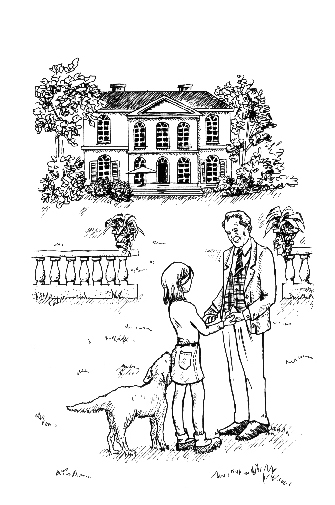

第五章　钱钱以前的主人

第二天，我一点儿都不想去上学。我害怕等我再回到家的时候，钱钱已经不在了。但是爸爸向我保证，会和我一起到姑妈的邻居家去。

莫尼卡现在已经习惯了变得不爱说话的我。但是到了第三节课，我实在忍不住要对她说出我的难题。我告诉她，我姑妈公布了一条多么可怕的消息。莫尼卡很同情我。

“如果你必须把钱钱藏起来的话，可以藏在我们家。”她想帮助我。

我觉得心里一下子轻松了许多。我突然有一种感觉，我肯定能找到什么解决方法。

尽管如此，在去往姑妈家的路上，我感到胃里难受极了。我们和姑妈一起去拜访她的邻居，来到一栋豪华的别墅前，这栋别墅坐落在一个十分美丽的花园里。门卫开了门，我们的车缓缓地驶向这座宏伟的建筑。

“不管住在这里的人是谁，他肯定非常有钱。”爸爸惊叹道。

姑妈解释说：“金先生在证券交易所赚了一大笔钱。但是我听说，前些日子，他出了车祸。我现在还不知道他出没出院。”

我用手紧紧地搂着钱钱，心里暗暗希望金先生和他的别墅都能化作一缕轻烟，消失得无影无踪。

一个身着制服的女仆已经从门卫那里得知我们到来的消息，她为我们打开了门。我们下车之后，姑妈向她说明了我们的来意。不一会儿，我们就见到了金先生。他是一个小个子男人，长着一张非常慈祥的脸。原先我是打算要恨他的，可是让我自己都很吃惊的是，我立即喜欢上了他。他十分聪明，一眼就看出我是和钱钱最亲近的人。

“你管我的宝贝叫什么呢？”他用很温和的声音问我。

我没法回答这个问题。我不得不面对钱钱以前有一个其他名字的事实。

“钱钱。”爸爸答道。

“钱钱，这个名字好，真的非常好。”金先生开心地笑着，“我更喜欢它现在的这个名字。我建议，我们以后就一直叫它钱钱吧。”

我惊讶地看着这个男人，他的语气听起来是认真的。而且我也觉得，无论如何都要保留钱钱这个名字。

金先生把我们领进了客厅。他告诉我们，他曾经带着这条狗开车经过距我们住处几千米的地方，在那里出了车祸。他当时伤势很重，昏迷了过去。当他苏醒过来的时候，已经躺在医院里了。自那以后，他再也没有见到过自己的狗。他在医院里住了几个月，一直让人找寻这只狗。但是没有人知道狗的下落。

“钱钱肯定是在回家的路上受到了别的狗的攻击，然后爬到了我们的院子里。”我告诉他有关钱钱的事情，包括它差一点儿就淹死的险情。当然我不会说出钱钱会讲话的事实，尽管我觉得金先生是一个可以信赖的人，但是我不能肯定钱钱是不是愿意让他知道。

金先生从摇椅里站起来，向我走来。我现在才发现，他走路很困难。也许是车祸留下的后遗症吧。他握住我的手，目光中充满了感激之情，他说：“你找到了我的宝贝，我简直太高兴了。我知道你把它照顾得很好，我心里的一块大石头终于落地了。”

我的脸红了，有点儿难为情。我结结巴巴地说：“我也非常非常喜欢钱钱。”

“这我能感觉到，而且我觉得很高兴，”他对我说，“因为我还要接受一系列的治疗，下一步就要到一个疗养院去住上几星期。如果你能接着照顾宝贝——我是说钱钱——的话，我就会觉得很放心了。当然我会支付一切费用的。”

我的心快乐得怦怦乱跳。钱钱可以留在我的身边了！可是我突然为这个男人觉得惋惜，我问：“您肯定非常想念钱钱，不是吗？”

“当然了，”金先生长叹了一口气，“所以我想请你帮我一个忙，你能每星期带钱钱到疗养院来看我一次吗？我的司机可以负责接送你们。”

“好的。”我赶紧说。我真的愿意帮这个男人做这件事，而且我越来越喜欢他了。

金先生转身对爸爸说：“您同意让狗留在您家里，并且让吉娅每星期带它来看我一次吗？所有的费用当然由我来承担——我指的是过去以及将来的所有费用。”

爸爸稍作推辞，说没有必要付钱，可是金先生一定坚持要这么做。我惊讶地发现，他说话的时候充满了威严。我为每星期能去看他一次感到很高兴。他和我认识的其他人是那么的不同。

这时，金先生显得十分疲惫。我们显然没有察觉，谈话已经让他过于劳累了。

姑妈建议说，我们该告辞了。

金先生感激地接受了她的建议。钱钱把头小心地在他的腿上靠了一会儿，它觉察到金先生十分虚弱。

金先生按了铃，女仆马上走了过来。我们向他告辞，女仆把我们送到了门口。

我们把姑妈送回家后径直回到了家。当爸爸对妈妈讲述刚刚发生的事情时，我带着钱钱向树林走去。我有一肚子的问题。

我们终于来到了秘密据点。我拨开了入口处的树枝，我们从掩藏在灌木丛中的通道爬到了洞里。

一到达我们的小天地，我就听见钱钱说：“你和金先生这么投缘，我很高兴。他是一个很好的人，我从他身上学到了许多东西。”

我吃了一惊，原来钱钱懂的东西也是学来的。这当然了，它也并不是天生就知道这么多东西的。

“那为什么你从来都没有向我提过金先生呢？”我问道。

“我们不是决定只谈钱的问题嘛。”钱钱答道。

“可是难道你不想念他吗？”我疑惑地问。

“出车祸的时候，我以为我亲爱的主人已经死了。”钱钱解释道，“到处都是血，他躺在那儿一动也不动。我也是昏昏沉沉的，支撑着爬到一片灌木丛下就失去了知觉。我肯定睡了很长的时间，因为当我醒来的时候，我亲爱的主人和汽车都不见了。我没有想到，我还会再见到他。”

现在我明白了。

钱钱接着说：“现在我们要再回到钱的话题上来，不谈别的事了。如果你还想知道什么的话，那下次我们去看我亲爱的主人时，你自己问他吧。”

我的脑子根本还没有转到钱的话题上来。因为今天发生了那么多激动人心的事情。而且我还想借此机会问一问钱钱，它为什么会说话。

但是钱钱的态度很坚决，它说：“我们要考虑一下如何帮你的爸爸妈妈解决财务困难的问题。可是在此之前，让我们复习一下我们以前已经讨论过的内容。你的梦想相册进展如何？”

我涨红了脸说：“我已经开始做了。可是我没有合适的笔记本电脑和旧金山的照片。我也没有为我的梦想储蓄罐找到合适的图片。我本来是打算找照片的，可是我把这件事彻底忘掉了。”

钱钱用不满的目光盯着我，毫不留情地说：“你想象了吗？你的成功日记呢？你昨天往里面写什么了吗？”

“可我一直在为其他的事烦恼呀。”我吞吞吐吐地说，“我害怕会失去你，我根本没有办法集中思想做那些事情。”

“这我理解，”钱钱答道，“可是，这正是许多没有钱的人爱犯的错误。他们总是有那么多紧急的事情要做，以至于没有时间来关注重要的事情。”

“这一点我不明白，”我对钱钱说，“有什么事情比让你留在我的身边更重要呢？”

“我已经说了，我理解你的心情，”我听见它说，“但是你姑妈来之前你为什么没有做呢？你又有什么借口呢？”

“因为带拿破仑散步能挣到许多钱，那时候我正高兴呢。”我答道。

钱钱严肃地看着我说：“我要告诉你3件很重要的事情。首先，在遇到困难的时候，仍然要坚持自己的想法。一切正常的时候，每个人都能做到这一点。只有当真正的困难出现时才能见分晓。只有少数人能坚定不移地贯彻自己的计划。那些非常成功的人，甚至有能力在他们最困难的时候作出最杰出的表现。”

我在琢磨钱钱的话。这些话似乎已经听过了，是谁对我说过的呢？对了，是马塞尔。他的第二条神秘的忠告：“情况顺利的时候，人人都能挣到钱。只有在逆境中，一切才能见分晓。”我发现，我还有那么多的东西要学。

钱钱对我点了点头，说：“困难总是在不断地出现。尽管如此，你每天还是要不间断地去做对你的未来意义重大的事情。你为此花费的时间不会超过10分钟，但是就是这10分钟会让一切变得不同。大多数人总是在现有的水平上停滞不前，就是因为他们没有拿出这10分钟。他们总是期望情况能向有利于自己的方向转变，但是他们忽视了一点，那就是他们首先必须改变自己。”

钱钱停了停，又接着说：“这10分钟就是你用来改变自己的最好机会。你最好现在大声地发誓，从现在开始会不间断地记录你的成功日记，并且不间断地设想你的未来。而且不论在什么情况下，每天都坚持这么做。”

我举起右手宣誓：我要从现在开始，每天记录我的成功，并不间断地设想我的未来，我发誓。

“第二点，”钱钱接着往下说，“在一切进展非常顺利的情况下，你也应该做这些事情。”我疑惑不解地望着它。它这么说是什么意思呢？

“当你得到带拿破仑散步的工作时，你的喜悦让你忘记了该做的事。你看，有成千上万件事情可能让你分心，因此你每天应该在固定的时间里，有规律地做这些事情。”钱钱建议说。

我思前想后，这可真不容易。晚上我也许已经太累了，白天总有这样那样的事情，剩下的其实只有早晨了。但那样我就得早起了……

“别忘了，这只需要10分钟的时间。”钱钱又看出了我的心思。

我同意了。但我知道，这不是一件简单的事情。我决定从明天开始，每天提早10分钟起床，快速梳洗，让自己清醒，然后就写我的成功日记。

“还有一点，”钱钱丝毫不同情我，接着说，“你知道你为什么没有找到照片吗？因为你没有遵守72小时规定！”

“72小时规定？”我紧接着问钱钱。

“很简单。当你决定做一件事情的时候，你必须在72小时之内完成，否则你很可能永远不会再做了。”

我想了想，问题也许出在这里，到目前为止，我计划了许多事情，可很多都没有实现。而另一方面我也完成了许多计划。钱钱讲的可能是对的。正因为它总是对的，所以我决定听从它的劝告。我要在72小时内完成我决定要做的事情。
