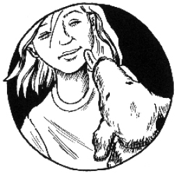

第六章　爸爸妈妈犯下的错误

我突然想到了拿破仑。啊，该死，我把它忘得干干净净了！

我对钱钱说，我们要赶紧去汉内坎普夫妇家，把拿破仑带出来散步。我决定，吃完晚饭再讨论爸爸妈妈的债务，那一定是一个非常令人兴奋的话题，因为我的3个最重要的愿望之一，就是帮助爸爸妈妈解除债务。“上帝啊，要是我能帮助爸爸妈妈，就太伟大了！”我琢磨着，不禁暗自高兴。

钱钱当然陪我一起去。汉内坎普先生已经在窗口前等着我们了。拿破仑一看见我，就兴奋地冲着我汪汪地叫起来。我向汉内坎普先生问过好之后，就带上两只狗走进了树林。才刚进入林子，拿破仑就看见了一只野兔，于是立刻像被毒蜘蛛蜇了似的飞奔过去，穷追不舍。

我吹口哨让它回来，可是拿破仑什么也听不见，它的眼里只有那只野兔。我没有办法，只能干等着。我发誓首先要训练拿破仑听从命令。

至少等了差不多10分钟，拿破仑终于回来了。之后，我们一下午都在进行训练。它每取得一点儿小小的进步，我都会表扬它，还经常给它奖励。钱钱也同样执行我的每一个命令，这对拿破仑非常有帮助。几个小时之后，拿破仑已经能很好地完成“坐下”的动作了。

我把它带回家，骄傲地向汉内坎普夫妇展示它的新本领。汉内坎普太太简直难以相信她的眼睛，喜出望外地鼓掌叫好：“我以为拿破仑已经无可救药了，可是它现在竟能准确地完成‘坐下’的动作！简直是太妙了！”

汉内坎普先生也露出了满意的微笑。他为自己判断正确而欣慰不已，因为是他建议我训练拿破仑的。他伸手从裤兜里掏出钱包，然后拿出一张20马克的钞票递给我。

接过钱时我感到有点儿惭愧。“做了这么一点儿事情就得到这么多的钱，何况我自己还从中得到了这么多的乐趣。”我心想。

汉内坎普先生有点儿失望地看着我，说道：“我以为你得到钱会高兴呢，可是你看起来却一点儿都不快乐。”

我难为情地说：“这钱挣得实在是太容易了。”

汉内坎普先生突然放声大笑。这时候他看上去倒真的有些吓人，连脸部的肌肉都扭曲变形了。可是他很快就恢复了平静，微笑地看着我。他在我的眼中顿时又亲切起来。

“大多数人都认为工作肯定是一件艰苦而令人不愉快的事情，”他向我解释道，“其实只有做自己喜欢的事情的人，才能真正获得成功。”

看着我一脸迷惑的样子，汉内坎普先生知道我不太明白他的话，他用鼓励的眼神望着我。于是我问道：“我妈妈总是说，工作第一，娱乐第二。可是您刚才说的话却完全不一样。”

“你认识的人中有没有谁会通过做自己喜欢的事情来挣钱？”老人问我。

我立即想到了堂兄马塞尔。他喜欢骑自行车，所以提供派送面包上门的服务。我给汉内坎普先生讲了堂兄的情况，他赞同地点点头说：“这个例子很好。我觉得，他的生意肯定会越做越大的。有机会的话，我可以给你讲讲我自己的经历，因为我总是在做我自己喜欢的事情，而且总能通过这些事情赚到很多钱。”

我好奇地望着这位老人，他的脸看上去就像是一本写满了冒险故事的书。他肯定经历过很多事情，有过十分不寻常的生活。

可惜我不得不告辞，因为妈妈已经在等我吃晚饭了。

她做了我最喜欢吃的烤饼，饭后甜点是巧克力布丁。尽管如此，我的注意力还是没放在晚饭上。如果你想到我在这么短的时间里经历了这么多的事情的话，就不会感到奇怪了。

我很快就把家庭作业做完了，然后牵着钱钱奔向我们的秘密据点。我迫不及待地想知道要怎么帮助爸爸妈妈摆脱债务的困扰。

但是我遇到了一个难题。我对爸爸妈妈的经济状况其实几乎一无所知——至少不了解具体的情况。我只知道他们财务上有困难，而且他们自己常说，贷款的利息高得让他们付不起了。我把我所知道的一切都告诉了钱钱。

“我以前的主人金先生有一家理财咨询公司。这家公司的工作就是教人们学会如何管理他们的财产。”钱钱意味深长地说，“虽然金先生自己只为非常富有的顾客当顾问，但是他公司里的许多工作人员会为那些在财务上遇到重大难题的普通人提供帮助。因为我可以到处跑，所以我常常听到他们的谈话。从根本上说，那些陷入债务的人只要听从4个忠告就可以解决负债问题。一切都很简单。”

接着，钱钱深深地吸了一口气，解释道：“第一，欠债的人应当毁掉所有的信用卡。”

“为什么呢？”我惊讶地问。

“因为大多数人在使用信用卡的时候，会比使用现金时花的钱要多得多。”钱钱答道。

我决定把这个忠告写下来——我不认为我能把听到的一切都记在脑子里。

钱钱接着说：“第二个忠告是，应当尽可能少地偿还贷款——也就是大人们说的分期付款。也许这个忠告听起来有点儿可笑，但你要知道，分期付款额越高，每个月剩下的生活费就越少。”

“爸爸妈妈为什么要付这么高的分期付款呢？”我疑惑不解地问道。钱钱说得完全正确，因为我的爸爸妈妈总是抱怨他们得筹那么多的钱来还贷款。

“因为他们想尽早还清贷款，这样他们就不必付利息了。”钱钱答道，“比如说，你贷款1万马克，那么你每年仅利息就必须付600马克。此外你每年还得偿还这1万马克中的一部分，假设你每年必须偿还1万马克的1％，也就是100马克。那么你每年要偿还的贷款总共为700马克，其中有600马克是利息。一旦你还清了贷款，当然也就不必再支付什么利息了。”

“因此人们想要立即还清1万马克，这听起来是完全合乎逻辑的。”我想，“因为付的利息要比偿还的钱还多。”

“第一眼看上去是这样的，”钱钱同意我的想法，说道，“如果每年偿还1％，虽然需要支付的利息逐年减少，但最后总共支付的利息数额仍会达到贷款数额的3倍左右。为了能快一点儿还清1万马克贷款，人们当然选择每年付较高的分期付款。许多人和银行约定的分期付款数额刚好在他们承受能力的上限，因此他们手里的钱一直很紧张。

“大多数情况下，他们没有估计到生活费会那么高。当他们必须购置一辆新汽车或家里的什么东西坏了的时候，他们只得通过再次贷款来偿付这些东西的账单。”

“你是说，他们用新的贷款来偿还旧的贷款？”我惊讶地问。

“正是。”钱钱答道，而且我从它的表情中看出，它感到很高兴，因为我立即明白了它的话。

“那我的爸爸妈妈现在应该怎么做呢？”我问道，“他们是不会听我的话的。”

“也许你可以让他们和金先生谈一谈，金先生可以轻松地帮助他们解决难题。”

“也许我能帮助他们挣到更多的钱。”我有点儿忘乎所以了。

“你当然应该这么做，”钱钱说，“但是他们首先必须学会量入为出，否则有了更多的钱只会给他们带来更大的麻烦，因为支出往往会和收入一同增长，除非我们学会合理分配我们的财产。这个问题我们以后再谈。”

我听懂了钱钱的话。于是我又在自己的袖珍笔记本里写上：

1．毁掉信用卡。

2．在许可范围内按最低的分期付款数目标准支付。问金先生是否可以帮助我的爸爸妈妈。

钱钱耐心地等着我把这两点记完，然后才开始讲第三点：“第三个忠告是针对消费贷款的。消费贷款是与住房无关的贷款。假如人们为了购置新的汽车、家具、电视机或其他用于生活的商品而贷款，就是消费贷款。这时候贷款的人应当遵守的一个原则，就是将不用于生活的那部分钱的一半存起来，另一半用于偿还贷款。”

“可是我奶奶常说，债务应当尽快还清，”我想起奶奶的话，“所以应该把所有不用于生活的钱都用来还债。”

“当你还清了债务的时候，又达到了什么目标呢？”钱钱问我。

“爸爸妈妈总是说，那时候他们肩上的一个重担就可以卸下来了。”我试着给钱钱解释。

“他们是这么以为的。”钱钱赞同地点点头，“可是事实上，当他们还清了债务的时候，他们拥有的财产为零，也就是一无所有。一无所有可不是目标呀。”

我吃了一惊，问道：“那么目标该是什么呢？”

“去美国旅行，买笔记本电脑——这些才是目标，”钱钱耐心地解释给我听，“或者把不花的钱都积攒起来。”

“为什么要把不花的钱攒起来呢？”我有点儿糊涂了。

“过几天我再给你解释这个问题，”钱钱安慰我说，“现在我们还是再回到债务的问题上来吧。你的爸爸妈妈应当开始攒钱，他们不需要等到还清债务以后再开始存钱，他们可以现在立即开始，只有这样，他们才有能力在不申请新的贷款的情况下，满足自己的愿望。那样他们也才能心安理得地、更好地享用这些东西。”

“你是说，他们完全可以给自己准备一个梦想储蓄罐？”我建议。

钱钱点头说：“这个主意真不错。此外，所有的消费贷款都是不明智的。聪明的做法是只把以前积攒起来的财富用于支出。”

这些我都一下子就明白了。所以我记下来：

3．将扣除生活费后剩下的钱的一半存起来，剩下的一半用于支付消费贷款。最好根本不申请消费贷款。

“然后还有最后一个忠告，”钱钱的眼中闪动着快乐的光芒，“债务人都应该在自己的钱包里贴一张纸条，上面写着‘这真的有必要吗’。这样的话，当他站在收银台前的时候，就会想到不应该花太多的钱。”

“对所有没有像我一样有一只聪明的狗的人来说，这个忠告很合适。”我笑着说。钱钱高兴地摇着尾巴，兴高采烈地凑上来舔我的脸。我轻轻拍了拍它，然后在本子上写下第四条：

4．这真的有必要吗？

现在我真的学到了许多关于债务的知识，但是与把它们传授给爸爸妈妈这个艰巨的任务相比，这只是很简单的一件事。钱钱建议请金先生和爸爸妈妈谈谈财务问题，我觉得这是个好主意。可是我和他还不太熟呢，所以我决定等上一段时间。

但是我作了一个决定：我绝不借债。为实现一个愿望，我要提前开始储蓄。我绝不要陷入和爸爸妈妈一样的困境。
