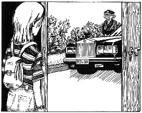
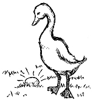

第七章　在金先生家

接下来的几天飞快地过去了。上学的时候我又能集中精力了，放学以后我就训练拿破仑。上周末，我从汉内坎普先生那里得到了14马克——每天2马克，总共7天。另外，我又教会了拿破仑2样本领，所以额外收入一共有了60马克。现在，拿破仑已经能够执行“坐下”“躺下”和“握手”三个命令了。

数钱的时候，我的心里充满了骄傲。总共74马克，这是一大笔收入。另外，我现在不会再有愧疚的感觉，能心安理得地收下我的劳动所得了。因为对于汉内坎普一家来说，如今和拿破仑相处真的轻松多了。

他们对我非常满意，问我能不能早上也带他们的狗出去散步，他们愿意为此每天再多付2马克。我征求爸爸妈妈的意见，他们同意了。

钱钱对我说，它会告诉我一个管钱的好办法，所以我暂时把我的钱小心翼翼地夹在旧的练习本中。

不过，有一件事比挣这么多钱更令人激动。今天是金先生的司机来接钱钱和我的日子。我迫不及待地想进一步了解这位富有的男人。

司机按照约定的时间，于下午3点15分准时按响了我家的门铃。

我没有想到，司机是一位中年女士，她一见到我就和善地笑了。劳斯莱斯汽车已经等候在门外，我们上了车。我对她说，以前我一直以为司机肯定是男的。她笑了，说：“金先生是一位不同寻常的人，他总是做一些非同寻常的事情。他不在乎别人做什么，只要他认为正确的事情，他就会去做。”

我非常好奇，很想听个究竟。司机好像猜到了我的心思，接着说：“有一次，我和一个女友聊天时说到我失业了，碰巧被他听见了。虽然他并不认识我，但还是问我会不会开车。我当然会了。‘好吧，’他回答我说，‘如果您愿意的话，您现在就可以得到一份工作，做我的司机，因为我正好在找一个司机。’这就是他说的全部的话，他甚至没有考察一下我的驾驶技术。他看人总是很准，所以他总是相信自己的直觉。”

这件事给我留下了深刻的印象。“开这么大一辆车，您不害怕吗？”我又问道。

“当然不，”司机告诉我，“金先生教会我如何建立自己的自信，所有和他一起工作的人都写成功日记。”

“我也写！”我得意扬扬地炫耀着。现在轮到司机惊讶了。我的心中充满了自豪，轻轻抚摸着钱钱，它飞快地舔了一下我的脸。我决定要让它改掉这个习惯。

我们终于来到了疗养院。

我不喜欢医院一类的地方，可是这家疗养院看起来更像一座豪华的度假村。能住在这么豪华的地方，这也许是有钱的好处之一吧。

司机把我们领到了金先生的房间。他坐在沙发椅里，看上去心情好极了。钱钱立即摇着尾巴向他跑去，它做的第一件事就是用舌头在他的脸上舔了一遍。

“它对我也这样，”我心想，“我已经决定要改掉它的这个习惯了。”

“你来了，我很高兴！”金先生欢迎我说。

“我也一直盼着这一天！”我说出了自己的真实感受。我弄不明白为什么会这样想，也许是因为我希望知道钱钱究竟为什么会说话吧。

金先生小心地逗着钱钱玩。看得出，每当动作剧烈一些，他的伤口就会疼，可是尽管如此，他还是很乐意这么做。

过了一会儿，他转向我，说他想知道关于钱钱近来的一切。我告诉他我喂钱钱吃什么，我们经常一起去散步。我还告诉他，我们一起带拿破仑散步，钱钱还帮助我训练拿破仑。

金先生满意地点了点头，说道：“第一次见到你，我就看出你很会和动物相处。你应该为此感到骄傲。”

“我明天一早就要把这一点写进我的成功日记。”我忍不住说。

金先生惊讶地看着我，问道：“你写成功日记？你怎么想到这个主意的？”

我涨红了脸。我该怎么向他解释呢？我可不能向他透露钱钱会说话的秘密。

金先生察觉到了我的不自在，他立即收回了疑问的表情，对我说：“你不必回答这个问题。”

“不，不！”我赶紧说，我决定要对他诚实，于是我说，“只是我不能告诉你是谁给我出了这个主意。”

出乎我的预料，金先生没有穷追不舍，而是表示了理解：“我也有自己的秘密。我的对话伙伴当然也有权保留自己的秘密。”

他的回答让我很放松，这位富有的男人显然很尊重我。

金先生若有所思地看着我说：“我在问自己，你和别的孩子有什么不同。你能回答我吗？”

我想了一会儿。在钱钱来到我们身边之前，对于这个问题我没有什么可以说的，那时候我真的相当普通。但是现在，很多事情发生了变化，因此我答道：“我想的事情和他们不一样。我想挣到很多的钱，因为我想去加利福尼亚，还想买一台笔记本电脑。”

我对金先生讲了我的10个愿望、我的梦想储蓄罐、我的梦想相册，还讲了我这个星期带拿破仑散步挣了多少钱。我还对他说了我的爸爸妈妈的财务危机，以及马塞尔的经历。

金先生全神贯注地听我说着每一句话，他是一个很好的倾听者。当我说完之后，他祝贺我说：“吉娅，我很高兴你对我说了这一切。我也相信你会达到自己的目标。但是，你不能因为任何人而放弃自己的理想。”

“我妈妈已经取笑过我了。”我打断了他，对他讲了妈妈发现我的梦想储蓄罐的事情。

“还会有各种各样的人取笑你，但也会有更多的人认可你。”金先生安慰我说，“而且我想，你妈妈也不是出于恶意，她也许觉得这个想法太疯狂了，太不切实际了。可是有的时候，疯狂的念头确实比普通的小目标更容易实现。当你定下大目标的时候，就意味着你必须付出比别人多得多的努力。”

这时，钱钱跑进了花园，在灌木丛中玩起游戏来。

“我们把一件重要的事情完全忘记了，”过了一会儿，这位富有的男人接着说，“你照顾了钱钱这么长的时间，我要支付这笔费用。”

“食物不是我买的，是我的爸爸妈妈付的钱。何况我也非常喜欢钱钱。”我答道。

“这样吧，我来提个建议，”金先生坚决地说，“我给你一张支票，你交给你的父母。另外你应该和你父母一起来一次，也许我可以和他们谈谈他们的财务状况。”

听了他的这个建议，我松了一口气，因为我已经琢磨了好一会儿，到底该怎么向他提出请求，让他给爸爸妈妈出出主意。

金先生接着说：“你当然也应该得到一点儿什么……让我想想。你照顾钱钱很长一段时间了，确切地说，是一年多。如果我一天付你10马克，你觉得怎么样？”

我一点儿都不高兴。我气呼呼地说：“我愿意照顾钱钱是因为我一见到它就喜欢上了它，而不是为了挣什么钱。”

金先生笑了，但我并不觉得他是在嘲笑我——这两者之间还是有一点儿细微差别的。他向我解释道：“吉娅，大多数人都是这么想的，我曾经也这么想。可是请你告诉我，你为什么不能因为做了一件自己喜欢的事情而挣到钱呢？”

类似的话我已经听过许多次了。的确如此，马塞尔对我说过，汉内坎普先生也说过。尽管如此，我还是觉得心里有些不安。

“我要告诉你一件事，”金先生接着说，“恰恰是因为你喜欢我的钱钱，我才要每天付你10马克，因为由此我知道，它在你身边过得很舒服，你也会继续好好地照顾它。正是你的真情实意才让你的劳动显得那样珍贵。”

我没有完全被他说服，不过还是忍不住在心里算着过去的一整年我可以赚到多少钱。

我有个很愚蠢的习惯，就是在心算的时候会轻轻地摇头，眼睛也会眯成一条缝。金先生忍不住笑了，我觉得自己被看穿了。可他严肃地说：“没错，这是一大笔钱。但我有一个条件，那就是你得把其中的一半存起来。”

“我全都存起来。”我欢呼着说，“我最想做的事是去旧金山，而且就在明年夏天。”

“这不是我说的存钱的意思。”金先生反对道，“你要花钱，这是对的，因为钱的用处正在于此。但是如果你想变得富有，你同时还要存钱，这笔钱是你绝不会再花的。”

“可是，假如我永远不能花这些钱，那我存它干什么呢？”我诧异地问。

“为了让你能依靠它来生活。”金先生给我解释说，“这样吧，我给你讲一个故事。”

我调整了一下姿势，让自己坐得舒服一点儿。我喜欢听故事。钱钱也从花园里回来了，趴在我们身边，显出一副对我们正在讨论的问题非常感兴趣的样子。

金先生讲道：“从前有一个年轻的农夫，他每天的愿望就是从鹅笼里捡一个鹅蛋当早饭。有一天，他竟然在鹅笼里发现了一只金蛋。当然，一开始他不相信这是真的。他想，也许是有人在捉弄他。为了谨慎起见，他把金蛋拿去让金匠看，可是金匠向他保证说，这只蛋完完全全是纯金铸成的。于是，农夫就卖了这只金蛋，然后举行了一个盛大的庆祝会。

“第二天清晨，他起了一个大早，赶到鹅笼处一看，那里果真又放着一个金蛋。这样的情况延续了好几天。

“可是这个农夫是一个贪婪的人，他对自己的鹅非常不满意，因为鹅没法向他解释是怎么下出金蛋的，否则也许他自己就可以制造金蛋了。他还气呼呼地想，这只懒惰的鹅每天至少应该下两只金蛋，现在这样的速度太慢了。他的怒火越来越大，最后，他终于怒不可遏地把鹅揪出鹅笼，劈成了两半。从那以后，他再也得不到金蛋了。

“我讲这个故事就是为了告诉你，‘不要杀死你的鹅’。”金先生向后靠了靠，他的眼光中充满了期待。

我很受触动。“这个农夫真笨，”我叫道，“现在他再也得不到金蛋了！”

显然金先生对我的反应很高兴。钱钱轻轻地摇着尾巴。

“你是不会这样做的，对吗？”金先生问道。

“当然不会了，”我肯定地回答，“我可不是傻瓜！”

“那么我要给你讲一讲这则小故事的寓意。”金先生慢悠悠地说，“鹅代表你的钱。如果你存钱，你就会得到利息。利息就相当于金蛋。”

我不敢肯定自己是不是真的懂了。金先生接着说：“大多数人生来并没有‘鹅’。这就是说，他们的钱不足以让他们依靠利息来生活。”

“可是要靠利息生活的话，这个人肯定得有很多很多的钱才行，是这样吗？”我不解地打断了金先生的话。

“你需要的钱其实比你想象的要少得多。”金先生答道，“如果你有2.5万马克，能得到12％的利息的话，那每年就有3000马克。”

“哇！”我兴奋地叫出了声，“那每个月就是250马克。而我根本不需要动用我的2.5万马克。”

“正是如此。”金先生对我的说法表示同意，他接着说，“那么2.5万马克就是你的‘鹅’，而你是不会‘杀’它的。”

我很喜欢这个想法，但我还有一个疑问：“但是，假如我现在开始存钱的话，我到加利福尼亚去的愿望就得搁置很长一段时间了。”

“你必须作出选择！”金先生点点头，“你可以马上拿出你的钱，用在任何一个地方——比如一旦你有了3000马克，你可以马上飞往加利福尼亚——可是那样的话，你也就‘杀死’了你的‘鹅’；你也可以选择将一部分钱存起来，那样过了一段时间之后，仅靠每年的利息，你就可以飞往加利福尼亚了。”

我觉得很有道理。尽管如此，我还是想在明年夏天去加利福尼亚。我当然也希望有这样一只‘鹅’。要是能两全其美就好了。

我叹道：“要在‘鹅’和愿望之间作取舍真难！”

“你根本不用放弃任何一个。两件事可以同时进行。”金先生微笑着说，“比如你挣了10马克，那么你可以分配一下这笔钱，把其中的大部分存入银行，然后把一部分放入你的梦想储蓄罐，剩下的当作零花钱。”

是的，这是一个解决办法。我立即开始考虑该如何以最佳方式分配这笔钱。这件事可不太容易。

“我应该怎么合理地分配呢？”我问金先生。

他不假思索地回答说：“这完全要根据你的目标来决定。如果你总是把10％的钱变成‘鹅’，那么你一定会变得富有。但如果你想有一天真的非常有钱的话，你存的比例可能得再高一些。我的习惯是把我收入的50％变成我的‘鹅’。”

我决定以金先生为榜样，我很喜欢他的生活方式，他看起来总是乐呵呵的——尽管有时候他的伤口肯定很疼。

我坚定地说：“我已经想好该怎么分配我的钱了，我也要把50％的收入变成我的‘鹅’，40％放入我的梦想储蓄罐，剩下的10％用来花。”

金先生看着我，眼光中充满了赞许。

我对自己作的决定感到很高兴。

但是有一点我还是不太明白：“既然存10％就能让人变得富有，那么我非常想知道，为什么还会有那么多的人为钱操心呢？”

“因为他们从来没有考虑过这个问题。”金先生对我解释说，“我们最好从很小的时候就开始做这件事，这样就很容易将其变成一种理所当然的习惯。你最好能立即着手做这件事。明天就去银行，给自己开一个账户。下一次见面的时候我会教你如何使用你的账户，然后再给你一张支票，你可以拿它到银行去兑现。但是现在你们俩得回去了，马上就到吃晚饭的时间了。而且我也觉得有点儿累了。”

看起来，金先生真的是在忍受着剧烈的疼痛。我真钦佩他还能保持这么好的心情，耐心地给我讲解这一切。

我问他为什么对自己的疼痛只字不提。

金先生答道：“越是把注意力放在疼痛上，我就越会觉得疼。谈论疼痛就像给植物施肥一样。所以我很多年以前就改掉了抱怨的习惯。”

我诚恳地感谢他给我的建议，然后和他告别。金先生在钱钱的身上拍了拍表示告别。随后司机把我们送回了家。
