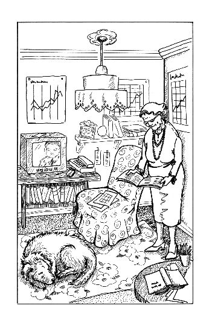

第八章　陶穆太太

一回到家，我先冲进了自己的房间，迫不及待地写我的成功日记——我已经无法等到明天早晨了。我写道：

1．金先生给我讲解的内容，我很快就明白了。

2．我作了一个很好的决定：我要把自己全部收入的50％存起来。

3．我将有一只自己的“鹅”。我现在明白了富有的含义。

4．我有生以来第一次乘坐了劳斯莱斯汽车。

5．上周挣了74马克（其中的37马克变成我的“鹅”，29.6马克放入梦想储蓄罐，7.4马克用来花）。

6．金先生表扬了我。

7．下周我将得到照顾钱钱的报酬。每天10马克，413天就是4130马克。天哪！

我还是不能确定自己写的是不是真的可以算作成功，但是我觉得很舒服。我为自己感到骄傲，而且也越来越相信自己的能力。我决定在吃晚饭的时候谨慎地和爸爸妈妈谈一谈债务问题。我迅速把写有“如何处理债务的4个忠告”的纸条塞进了牛仔裤兜里。

当全家坐到饭桌前的时候，我兴高采烈地拿出了金先生让我带给爸爸妈妈的支票。爸爸接过支票，看到上面的数目，惊呼道：“2000马克！为什么金先生要给你这么多钱？”

“为我们在这段时间里给钱钱提供的食物。”我解释说。

“我不知道我们能不能接受这笔钱，”妈妈说，“现在钱钱就像我们自己的狗一样。”

“可是话说回来，这笔钱对我们很有用，”爸爸轻声嘟囔着，“我们的贷款还有几笔没还清呢。2000马克的确能派上一些用场。”

“如果是我，我会把其中的1000马克用来还贷款，把剩余的1000马克存起来。”我忍不住说。

爸爸妈妈放下手中的刀叉，怔怔地看着我。他们的表情看上去好像我刚把一个盛满菜的碟子打碎了一样。

“你听，你听，”爸爸的语调中充满了讽刺，“我们的女儿才坐过一次劳斯莱斯就已经成了一个理财天才了。苏珊，我不知道和这些人交往对我们的吉娅是不是一件好事。”

一股怒火从心中升起，我嚷道：“聪明的做法是尽可能偿还小的数额。”

“是啊，这样我光付利息就得付一辈子了！”爸爸激动得快要说不出话来。

我紧闭嘴唇不再说话。我已经记不清楚钱钱都是怎么给我解释的了。我只记得它说，人们会不停地申请新的贷款来偿还旧的贷款。我暗暗地想：“最好是等到我已经到了美国，而且也拥有了自己肥硕的鹅时，再和他们谈这件事。”

“小孩子懂什么钱？”爸爸嘀咕着。

我再也控制不住自己了，大声地炫耀说：“有一个叫达瑞的美国男孩，17岁的时候就已经拥有几百万的财产了，可你还没有那么多的钱呢！而我有一天也会十分富有的。”

“也许他的钱是继承来的。”爸爸猜测。

“是他自己挣的，就像我也会自己挣一样。”我激动地大声说。

妈妈担忧地看着我说：“吉娅，你不应该说这样的话。我们追求的不是巨额的财产。金钱只会带给人们不幸，学会知足才是最重要的。不要忘了，普通人家的孩子是永远不会成为百万富翁的。不要好高骛远。”

我不同意她的话。金先生看上去十分快乐，而爸爸妈妈却恰恰相反，总是不太高兴。直觉告诉我，贫穷更容易产生不幸。但我决定还是先闭口不提这件事，我静静地吃完了饭。

晚饭后，我没有兴趣继续留在家里，于是给莫尼卡打了一个电话，约她见一面。可是她还没吃晚饭呢，所以我们约好一个小时以后见面。在这之前我想出去散散步。我决定拜访一下汉内坎普夫妇，顺便看望拿破仑。

汉内坎普先生一看见我，立即叫我进屋。“你有没有时间再照顾另一只狗？”他问我。

“当然有时间。”我想也没想就肯定地回答。

“是这样的，今天早晨我和陶穆太太谈了谈。”汉内坎普先生说，“你一定认识那只高大的德国牧羊犬比安卡吧？它的主人就是陶穆太太。她要出门两个星期，可是她不知道该把比安卡交给谁来照看。当她听说你把拿破仑训练得很好的时候，就请我问一下你的意思。你最好马上去找她，亲自和她谈这件事。”

我认识陶穆太太。她非常喜欢说话。每次我路过她家，她总是想和我搭话。

我们很快就来到了她家。她的房子看起来真像“巫婆小屋”。

陶穆太太已经站在门口了——汉内坎普先生给她打了电话，告诉她我们要去拜访。

我们一起进了屋。

屋里简直乱极了，我一下子就不觉得拘束了。到处都摆满了书和剪下的报纸，墙上到处挂着画着古怪线条的表格，有两台电视机同时开着。

陶穆太太注意到我在四处张望，她解释说：“这是我的爱好。我喜欢看财经书，还喜欢看股票交易方面的杂志。我丈夫去世的时候，给我留下了一笔遗产。当时我不知道该如何处理这笔钱，于是我就开始学习理财投资。这是一件非常有趣的事情，可以让钱飞速增多。”

我第一次希望陶穆太太能继续说下去，但是她可能以为我对这个话题不感兴趣。

我们谈到了比安卡。陶穆太太好几年来一直想出门度假，可是她找不到人来照看狗。比安卡很乖，但它是一只牧羊犬，体形实在是太大了，看起来有点儿吓人，可能很多人因此害怕它。所以当我表示我有兴趣时，陶穆太太很感激。她愿意买好所需的狗食，而且每天付给我10马克报酬。我很满意。当然我还要征求一下爸爸妈妈的意见，因为这只牧羊犬得在我们家里住上两个星期。

我告别了陶穆太太，因为已经到了和莫尼卡见面的时间了。我有很多话要对她说。我告诉她我挣到了钱，给她讲了金先生的事情，还告诉她我将如何分配我的钱。

莫尼卡瞪圆了眼睛，看着我说：“你是怎么做成这些事的？真令人佩服！”

她想了一会儿又对我说：“如果你做不完的话，我可以帮你。就是说，我可以给你干活。”

我忍不住笑了。莫尼卡的爸爸妈妈有那么多的钱，她总是穿得很讲究，而现在她说要给我干活。这实在是太可笑了！

天快要黑了，我回到了家。我要尽快和爸爸妈妈谈比安卡的事情。开始时，爸爸有点儿犹豫，他担心我不能把精力放在读书上，可是妈妈站在了我一边。

这时电话铃响了，妈妈拿起话筒，然后递给了我：“马塞尔找你。”她感到奇怪，因为马塞尔从来没有给我打过电话。

不出所料，这次我们有了许多共同话题。我告诉他我的收入和我的新工作，而且还对他说，我要按金先生给我讲解的那样分配我的钱。

“啊，我要告诉你一句话，”他兴致勃勃地说，“你已经不再是那个只会玩洋娃娃的笨女孩了。这种分配钱的方式真好，我自己还从来没有想过。我把全部的钱都存起来了。”

“我还得开一个自己的账户，”我自言自语，“金先生要给我一张支票，可我还不知道怎么把钱存到银行账户里。”

“如果你愿意的话，我明天过来帮你去银行开户。”马塞尔说。

我简直不敢相信自己的耳朵。马塞尔以前总是不爱搭理我，可是现在却自愿帮助我。他住的地方离我家只有7千米，可是他以前从没有来看过我。即使他的爸爸妈妈到我们家来串门的时候，他也宁愿一个人留在家里。

“你要来看我？”我惊讶地问，“不久以前你还一直躲着我呢。”

“我只和自己尊重的人打交道，”他简短地说，“而现在你第一次让我感到佩服。”

我觉得骄傲极了。

“而且我现在已经有了自己的员工，”马塞尔用大人一样的口气说，“邻居家的几个男孩为我送面包。因为我现在已经有了50个顾客，我一个人根本忙不过来。”

我想起了莫尼卡，她表示要帮助我。我现在得照顾钱钱、拿破仑和比安卡3只狗，我想有的时候我的确需要她的帮助。

和马塞尔道别之后，我盼着明天能早点儿见到他。我还给钱钱梳理了毛，它觉得舒服极了。然后我上了床，一下子就进入了梦乡。

半夜里，我从噩梦中惊醒，吓出了一身冷汗。我梦见一群凶恶的匪徒追赶我，还要杀钱钱。莫尼卡和马塞尔也出现在我的梦中，他们无能为力，帮不了我们。

好一会儿，我都一直在全身发抖。钱钱好像觉察到了这一切，它跳上床，用舌头舔我的手。我紧紧把它搂住。这个梦一定是个不祥之兆。我翻来覆去，怎么也睡不着。我提醒自己第二天要特别小心。
