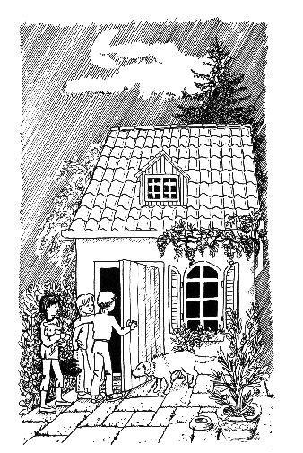

第九章　冒险经历

这一天从早晨起就不太对劲。因为噩梦一个连着一个，我醒来的时候已经精疲力竭了。爸爸起晚了，还占着浴室。天气非常糟糕。我想利用一下这段时间，就伸手去拿我的成功日记，可是它竟然不在平常放着的地方。我盯着钱钱看，它似乎什么都没有注意到。

“啊，”我心想，“你这个淘气包！我就知道是你。快还给我！”

钱钱正闹得开心，一点儿都没有放过我的意思。它跑进起居室，找出它藏起来的日记本，用嘴叼着跑开了，逗我去拿。我想抓住它，抢回本子，可是钱钱太灵活了，我追不上它。我奋力一跃，想把钱钱压在身下，它一下子就躲开了。随着一声巨响，我压在了爸爸用火柴制作的、还没有完工的轮船模型上。爸爸妈妈听到响声也跑了过来。看清发生了什么事之后，爸爸像疯了一样大声咆哮：“你毁了我4个月的心血！”完了，整个火柴模型都散架了，没有哪两根火柴还挨在一起。

我难过极了，我并不想这样的事发生。我又想起了昨晚的梦。这一天可真是开了个好头呀！

接着我误了校车，很晚才到学校。

放学后，我吃过饭就去接拿破仑。

我对汉内坎普夫妇说，我要晚一点儿送他们的狗回家，他们同意了。下午3点马塞尔要来。我同时约了莫尼卡，让她在我和马塞尔去银行开户的时候照顾这些狗。

我和马塞尔一起来到陶穆太太家接比安卡。

陶穆太太请我们进客厅，准备详细告诉我应该如何照顾她的宝贝。

在我们谈话的时候，马塞尔在屋里东张西望。他一张张地仔细阅读墙上挂的表格，不时地点着头。

“您投资股票。”他很专业地判断说。

陶穆太太奇怪地看着我的堂兄：“你也懂股票分时走势图吗？”

“不，我爸爸投资股票，我有时候跟着学一点儿。他总是说，没有别的东西比股票更能让人挣钱。但是这对我来说太复杂了，而且要付出很多精力。”马塞尔回答。

“你说对了，这不太容易，每天至少得拿出一两个小时花在这上面，也就是说得喜欢做这些事才行。”老太太笑眯眯地说，“不过，也可以让别人替你做，那样事情就简单多了，而且你自己仍然可以赚到钱。”

马塞尔的胃口一下子被吊了起来，他问道：“这听起来不错。究竟怎么做呢？”

“我很乐意解释给你听，”陶穆太太告诉他，“可是我们需要一些时间。我的飞机几个小时之后就起飞了，我建议等我度假回来以后再说这件事。”

“我想我也会感兴趣。”我赶快说。

陶穆太太又想起了别的什么事情，她问我：“吉娅，在我出门的这段时间里，你能给我养的花浇两三次水吗？”

我高兴地答应了。

我们告了别，把比安卡带回了家。

然后我跟马塞尔来到了银行。我十分兴奋，因为我马上就要拥有自己的第一个账户了。虽然我已经有了一个存折，爷爷奶奶时不时会给我往里面存些钱，可是一个真正属于自己的账户却完全是另外一回事。当我们走进银行的时候，我觉得自己真的已经是一个大人了。

银行里很热闹，许多人在排队等候。

我想站到最短的队伍后面，马塞尔拦住了我：“等一下，你得找一个适合自己的银行职员。”

“可我怎么知道这里面谁比较好呢？”我不解地问。

马塞尔笑着说：“就是找到跟你最合得来的人。你好好四处看看，找一个你觉得最亲切的人。”

我沿着几个队伍走了一圈，仔细瞧了瞧里面的银行职员。他们大多数看起来一点儿也不开心，而且没精打采的。有一个干活急匆匆的——这个人我实在有点儿害怕。

最后，我看见了一位女士，她和我妈妈的年纪相仿，脸上的表情也非常柔和。我立即喜欢上了她。

“可要是选她的话，我们得等上很长时间，这个队伍很长。”我想让马塞尔对我的决定有一点儿心理准备。

“等候是世界上最愚蠢的事情，”堂兄宣布说，“我们应该想一想如何利用这段时间。”

我们想出了一个主意，我可以给他详细讲一讲我打算如何分配我的钱。我还给他讲了会下金蛋的鹅的故事。

“比我想象的还要棒！”马塞尔大声说，“显而易见，假如我总是花光我的钱，那我就永远也得不到我的‘鹅’，所以我就总得为了赚钱而工作。而一旦我有了一只‘鹅’，我的钱就会自动为我工作了。”

“你分析得太精彩了！”我答道，“金先生的情况肯定就是这样，他的钱在为他工作。想一下吧，他出了车祸之后那么长的时间里根本无法工作，尽管如此，他还是能够轻轻松松地付清所有的账单。相反，我爸爸总是说，假如他连着两个月什么钱都挣不到的话，一切就全完了。他的意思是，到那时我们就不得不连房子都卖掉。”

“没错，金先生的情况很好，因为他拥有一只‘肥鹅’，而你爸爸却连一只‘小麻雀’都没有。”马塞尔笑了。

我们谈得很投机，根本没有觉察到队伍的移动。不一会儿就轮到了我们。那位和善的女士问我们想要做什么。

“我想为我的‘鹅’开一个账户。”我说。

“你为谁开账户？”她诧异地问。

马塞尔大声笑起来。我真想揍他，可是他的笑声感染了我。笑过之后，我们才互相作了自我介绍。这位女士姓海内。为了向她解释为什么要为我的“鹅”开一个账户，我把鹅和金蛋的故事从头到尾讲了一遍。我和她渐渐熟悉起来。

海内女士听得津津有味。“这是我听过的最好的教孩子如何理财的故事。”她高兴地说。

想了一会儿，她又说：“这个故事也许对成年人也很有用。你要开个账户是吗？我会尽力帮助你的。”

她免除了我的手续费。这就是说，银行为我提供与账户有关的全部服务，而我不需要为此付一分钱。

没有比这更好的事情了。

更让我惊讶的是，开户竟是如此简单，我只需要出示我的护照就可以了。海内女士填写了一张表格，然后我在上面签上了我的名字。这就是全部的手续。马塞尔根本不必陪我，但是他来了还是好一点儿，我们在一起很开心。

我高高兴兴地从包里拿出37马克存入我的账户。我暗暗念了一句自己想出来的咒语：“长大吧，小鹅，长大吧。”

在银行开户真的很有趣。我们和海内女士道了别，就离开了银行。

在回家的路上我想：“找到一个和善的顾问真好，我很愿意再见到她。”

我们急急忙忙往家赶。天晓得莫尼卡和那3只大狗相处得怎么样了。她实在是缺少和狗打交道的经验，虽然她自己也有威利——一只不听话的小哈巴狗，可是和大狗相处根本是另外一回事。

结果，我的担心完全是多余的，莫尼卡高兴地欢迎我们的归来。一切都井井有条。

然后我们3个人带着4只狗一起到树林里玩，玩得非常尽兴，连时间都忘了。

我们往家走的时候，天已经有点儿黑了。我请他们俩陪我一起到陶穆太太家去——我还得去取比安卡的食物。陶穆太太已经事先准备好，把食物放在了她家房子后面的小院子里。我们3个人一起去拿会轻松一点儿。

我们渐渐走近那座好像巫婆小屋的房子。它离我家只有几百米的距离，紧挨着树林。房子四周长满了杂草，因为陶穆太太很长时间没有修剪过那些树和灌木了。我们一起绕到了房子的后面，小心翼翼地从一些灌木中慢慢穿过。

这时候天已经完全黑了。虽然有钱钱、拿破仑和比安卡的陪伴，可我们还是觉得有一点儿害怕。威利在场一点儿也不能增加我们的安全感，它是最胆小的一只，只会亦步亦趋地跟着莫尼卡。我们谁都不说话，连莫尼卡都沉默不语。突然，我意识到我们为什么会觉得这么害怕了，因为四周是一片死寂，静得可怕。我们不由自主地屏住了呼吸。

我们悄无声息地往前走。脚下不时传来树枝被踩的沙沙声。我们终于走到了房子后面。狗粮果真在小院子里的平台上放着。不知为什么，我总觉得似乎有什么不太对劲。我们战战兢兢地四处张望，狗也开始发出咕噜噜的低吼声。

比安卡跑向房子的后门，我们的目光紧随着它。门只是虚掩着。它用嘴把门拱开，冲着里面汪汪地叫了几声，然后跳了进去。它的叫声一下子弱了许多，渐渐地变得越来越弱，仿佛是从很远的地方传出来似的，后来我们就什么声音都听不见了。

我们等了一会儿，比安卡也没有回来。我们轻声地叫着它的名字，可是得不到任何回答。

我们愣在了那里。我谨慎地四处张望。莫尼卡脸色惨白，威利跳到了她的怀里，她紧紧地抱住了它。

马塞尔第一个回过神来。他做了一个手势，示意我看住钱钱和拿破仑。我抓住了它俩的链圈——真庆幸自己训练过拿破仑。马塞尔紧紧地贴着墙壁，慢慢地向门口靠近。他小心翼翼地先把一只脚伸进了屋里，然后进去从里面把灯打开，又很快出现在门口。这个过程其实只有很短的时间，我们却仿佛经历了一个世纪一样。

他向我们挥手，示意我们过去。“好像没什么不对劲的。”他轻声说。

我牵着两只狗小心地跟过去。

“我绝不进去。”我们听见莫尼卡的声音。

“好吧，你等在这里！”马塞尔作了决定。

可是她立即又改变了主意，因为一个人待在小院子里对她来说更可怕，她跟着进了屋。

我们一起走进了陶穆太太的客厅。屋里的混乱让我们大吃一惊。

“有人入室盗窃。”马塞尔得出了结论。

“不，这里一直都是这么乱。”我反驳他，但声音很微弱。

马塞尔反对说：“看，门锁是被撬开的。”

他说对了。门框显然有被破坏的痕迹。

我立即明白为什么不再觉得这里舒服了——墙上所有的表格都被摘了下来，家具横七竖八地倒了一地。这种情形好像是电影里经常出现的一幕：间谍为了寻找一个缩微胶卷而把房间翻得一塌糊涂。

我想起了昨天夜里的噩梦。我本来决定今天要格外当心的，而现在我却站在一栋遭人盗窃的偏僻的房子里。盗贼会不会还在屋子里？我感到太阳穴胀得生疼。

突然，我听见门外传来轻轻的脚步声，立刻吓得不知所措。脚步声越来越近了。马塞尔急忙四处搜寻，拿起了放在沙发旁边的旧望远镜准备当武器。过了一会儿，客厅的门被推开了一条几厘米的缝。我们立刻四散跑开，莫尼卡发出一声尖叫。

就在这时，比安卡大大的脑袋从门缝里钻了进来。我们完全把它给忘掉了。大家这才松了一口气，连钱钱和拿破仑都高兴地迎上去，欢迎它回来。

马塞尔又成为我们中间最先认清形势的一个人：“盗贼已经在我们来之前逃走了，否则这些狗不会这么安静。”我看了看钱钱，它一点儿也没有显出躁动不安的样子。我伸出手搂住了它，马上觉得心里平静了许多。连威利也挣脱了莫尼卡的怀抱，独自安静地在墙角嗅来嗅去。
