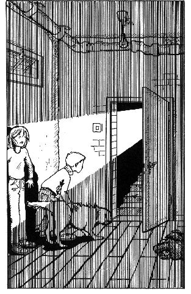

第十章　在地下室里

我们鼓起了勇气，决定检查一下这栋房子。莫尼卡想先给警察打电话，可马塞尔和我都认为这事等一会儿再做也不迟。一时之间，我们的心中充满了对冒险的期待，开始小心翼翼地一间间地察看房间。到处都是一片狼藉，但除此之外没有什么异样。

“你们还记得吗？比安卡跑进房子的时候，它的叫声仿佛是从很远的地方传来的。”马塞尔说，“我想，肯定在什么地方有一个很深的地下室。”

莫尼卡打了个冷战说：“说不定还是一个地牢……”

我忍不住笑了起来，不过我现在的感觉也不是很好。

我们又在房里走了一圈，寻找地下室的入口。最后，我们终于在楼梯下面找到了地下室的门，它看上去像一扇柜门，虚掩着。我们轻手轻脚地打开门，只见一道很陡的楼梯，一直通向下面。我们想找电灯开关，但根本就没有。

“我在客厅里看到几根蜡烛。”我说。马塞尔点点头。

我们迅速拿来了蜡烛。莫尼卡一边点蜡烛，一边试图劝阻我们。她说：“你们不是真的想要下去吧？我可不去！”

“好吧，”马塞尔作出了决定，“那你就待在这上面，和威利还有拿破仑一起等着。我和吉娅带着比安卡还有钱钱一起去地下室里看一看。”

我其实情愿和莫尼卡一起留在上面，可我又很好奇，很想知道会在下面发现什么东西。何况我也不想在堂兄面前露怯，毕竟他刚开始对我有点儿尊敬。于是，我和马塞尔带着两只狗小心地走下了楼梯。这肯定是间很旧的地下室，在烛光映照下，那些光秃秃的石头看上去十分阴森可怕。

终于，我们走到了楼梯的尽头。这是一间很大的地下室，里面堆的全是各色破烂家什，还有许多架子，上面摆满了瓶瓶罐罐。天花板相当低，马塞尔不得不把头稍微低下一些。我仔细地环顾四周，没发现什么特别的东西。

“这儿没有什么东西。”我轻声说。

可是马塞尔却指着一个架子后面墙上的一扇小门让我看。我吃了一惊，要不是他指出来，我绝不会发现这扇门。我们小心地把架子移到旁边，还得当心别让那些瓶子掉到地上。把门前清空之后，我们试着开了一下门，可是门却锁住了。马塞尔的脸上流露出失望的神情：“没办法，太遗憾了，我真想知道这扇门背后藏着什么秘密。”

“里面很可能藏着金银财宝。”我信口说道。

“当然，这里跟美国诺克斯堡的军事基地一样，藏着好多金子。”马塞尔哧哧地笑着说。诺克斯堡的军事基地是美国储藏黄金的地下金库，这一点我早就知道了。

这时比安卡用它的头轻轻碰了碰我。我看到它的嘴里衔着一个黑糊糊的东西，仔细一看，原来是一把钥匙。它摇摇尾巴，把钥匙放在地上。“聪明的小狗，”我夸奖它说，“以前它可能经常替它的主人拿钥匙。”不过我们还是不知道比安卡是从哪里把钥匙找出来的。

马塞尔捡起钥匙，缓缓地打开门。我们举起手中的蜡烛往里照去，这是一间比外面那间小一些的房间，房间里除了一只箱子以外空无一物。这只箱子是用结实的木头做的，四周包着铁皮，上面挂着一把挂锁。马塞尔走到箱子跟前，看了一下这把锁，笑着说：“这个很容易就能打开，小事一桩。”我还在犹豫，想着我们有没有权利看里面的东西，可是马塞尔已经掏出了他的万能钥匙，开始开锁。我的好奇心占了上风。这时，锁咔嚓一声弹开了。

我咯咯笑着说：“你可真像个盗贼。是送面包的时候学来的吧？”

“干这行我很擅长。”马塞尔吹嘘道。他打开箱盖，吹了声口哨，连连说道：“好家伙，现在我明白那些盗贼想找什么了。”

我也向箱子里望去，里面有一大摞文件，厚厚的一捆面值1000马克的钞票和一堆码得整整齐齐的金条。那些金条格外显眼，它们居然真的是纯金做的，简直叫人不敢相信。马塞尔说对了，这一定是那些盗贼急于要找的东西。

“我们该怎么办？”我担心地问，“要是我们把东西都留在这里，那些盗贼回来了怎么办？”

马塞尔考虑了一下，说：“你说得没错，我们现在真得给警察打电话了，他们会把这些财产保管起来。不过，我们先把箱子里有些什么一一记下来，就算以防万一吧。”

我们开始仔细地清点里面的东西，再一一记录下来。完事之后，我们很有成就感地浏览了一下我们列出的清单：100张面值为1000马克的钞票——共计10万马克，另外还有25根金条，78枚金币，163份证书文件，一个装着信件和银行交易明细表的公文包，一个装着16颗宝石的小袋子，1根金项链，还有7枚金戒指。

马塞尔满意地把单子塞进口袋，他打算给我也抄一份。要是我们能拥有这么多钱和贵重物品，一定高兴死了。我们俩都这么想。

“陶穆太太真有钱！”我惊叹道。虽然她在我们面前偶尔说起过她的富有，可是与亲眼看见这些财产相比，感觉还是不一样。

“她怎么会把这么一大笔财产藏在这里呢？”我奇怪地问。

“很多有钱人都这么干。”马塞尔对我说，“我敢打赌，陶穆太太还有好多好多钱投资在别的地方。这里的东西很可能是她留着应急的。”

“留着这么一大笔财产应急？”我怀疑地问。

“这样她才能把这些拿在手里数着玩。”马塞尔坚持道，“你知道吸血鬼德库拉伯爵吧？他的钱多得不得了，他把数钱当成他最大的爱好之一。”

我回忆起了自己看过的那些漫画，不由自主地想起妈妈总是要求我在拿过钱之后洗手。“我想有钱人肯定不会觉得钱很脏。”我自言自语。

马塞尔赞同道：“我也这么想。陶穆太太肯定会不时地来看看她的箱子，这个时候她的感觉一定好极了。要是我的话，肯定也会这样。”

我忍不住扑哧一声笑了起来，脑海里浮现出一幅画面：老太太走进地窖，打开箱子，然后把这些金条和钱拿在手里细细把玩。“我觉得光是把这些金币和金条拿在手里掂一遍，我也会很开心的。”我说。

突然，钱钱叫了起来，比安卡也立即跟着叫了起来。两条狗背对我们，脸冲着门口，一边嗅着，一边越叫越响。马塞尔走到门口，冲着门外喊：“莫尼卡，是你吗？快过来，现在我们知道那些盗贼找的是什么了。”

钱钱和比安卡的叫声停了下来，开始在喉咙里发出威胁的呼噜呼噜的声音。马塞尔忽然显出惊慌失措的样子，“发生什么事了？”他问，“狗是不会对着莫尼卡发出呼噜声的。”

这时，外面突然传来了男人说话的声音，我们被吓了一跳。钱钱的毛竖了起来。“安静，钱钱。”我嘘了一声。可是它不肯安静下来，不停地发出呼噜呼噜声。门外又传来了脚步声，越来越近，越来越响，我们无路可逃。不一会儿，我们看到一支很大的手电筒的光在门外一闪，然后一道光柱直刺我的眼睛，我尖叫了一声。

“你看，你看！我们找到什么了？”一个低沉的声音喊道。

“你们最好别过来！”马塞尔硬邦邦地说。

光线太耀眼，我们什么也看不清楚。

随后，我们又听见了另一个人的声音：“找到什么东西了吗？要是这样，就能省不少事了！”

手电筒的光柱移到了箱子上，随后这个男人发出了一声惊呼。“贝尔恩德，瞧这儿，”他喊道，“那个小姑娘没有说错，这儿真的有一大笔财产。”

“把你的脏手拿开！这是属于一个老太太的！”我怒吼。

“小姑娘，你搞错了，我们是好人。”我们听到第一个人的声音笑着说。手电筒的光从箱子上移开，照在那个人身上。我们看到的是一位警察。

马塞尔第一个镇静下来，而我却激动地笑了起来。这会儿我才意识到刚才自己是多么紧张。我一下子坐到地上，松了一口气。

“你们的朋友给她爸爸打了电话，她爸爸向我们报了警。”这位警察向我们解释。

一切都真相大白了。

“现在莫尼卡在哪里？”马塞尔问道。

“她在上面，和他爸爸还有其他警察在一起。”那位警察一边说，一边走出去叫他的同事。他的同事正坐在我们刚刚走下来的楼梯台阶上。“好了，孩子们在这里，他们都没事！”

我们一起走上去，在走廊和客厅里站着至少10个警察。莫尼卡的爸爸也在那儿，莫尼卡怯怯地依偎在他身边。

她告诉我们，她等了一会儿，就小心地站在楼梯口朝下喊，没有回音，她以为我们出了事，于是就给她爸爸打了电话。

莫尼卡的爸爸严肃地看着我们说：“你们刚才的举动太轻率了！你们应该马上报警。”

我们无言以对。我朝莫尼卡望了一眼，心中充满了歉意。她刚才一定吓坏了。我们清点那些财宝的时候，完全忘记了时间。

警察叫了一个锁匠来修理被撬坏的门，然后小心翼翼地把箱子抬走了。他们又忙了好一阵子，我们不得不回答了许多问题。那些警察都很和气，还夸奖了我们。他们说一定是我们把盗贼给吓跑了。

马塞尔和我很得意地对看了一眼，然后我们被警车送回了家。妈妈早就在担心了，当我们从停在门口的警车里钻出来的时候，她脑子里一定作出了最坏的设想。

警察很快说明了情况，然后分别送马塞尔和拿破仑回家。妈妈立即给马塞尔的妈妈打电话，还给汉内坎普家也打了电话，以免他们忽然看到警车停在门前时，会像她自己一样被吓一跳。

我兴奋得睡不着觉，向爸爸妈妈详细地讲述了一切。爸爸妈妈说，我们当时还是应该马上报警。
