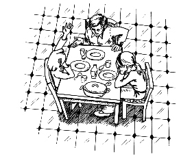

第十一章　爸爸妈妈不明白

第二天，学校里闹得沸沸扬扬的。莫尼卡绘声绘色地给大家讲述我们的冒险经历，这是当天唯一的话题。

我的身边也围了好多祝贺的人，甚至有几个男孩对我说：“你真走运啊，遇上了这么一件惊险的事情。我真想也能碰上一回。”

我不知道这算不算是运气。但不管怎么说，我觉得所有这一切都是从我的梦想储蓄罐开始的，不然的话我绝不会想到去找工作，不会认识汉内坎普夫妇；这样，我也不会从陶穆太太那里得到照看比安卡的工作，因为是汉内坎普先生把我推荐给陶穆太太的。

我们聪明的历史老师常说一句话，看来他说的是正确的，他说：“幸运其实只是充分准备加上努力工作的结果。”

不管怎么说，一时之间，我和莫尼卡成了学校里的英雄，甚至还有一个地方报社的摄影记者到学校给我们拍了照。

第二天，我们的照片登在了报纸上，上面还详细描写了我们的勇敢行为。

爸爸妈妈看到报纸后特别自豪，到处宣扬这件事情。

只是马塞尔没有和我们一起出现在照片上，我感到有一些遗憾。

一天早晨，我一边在成功日记上做记录，一边回想我们的经历。这的确是一次很棒的冒险经历，我为此感到自豪。

我发现，自从我开始想办法挣钱以来，很多事情都变得不一样了。我的生活变得更加有趣，我用和以前不同的方式认识了不少人，而且我还和大人进行了很有意思的谈话。

我学到了很多东西——这和在学校里学到的知识不一样。我真的对这些东西很感兴趣，因为我知道自己会用到它们。学习怎样挣钱去美国，比在历史课上学习查理曼大帝的枯燥事迹有趣多了。我现在觉得学英语也很有意思，因为很快我就需要使用它。

我现在会去考虑很多以前觉得无所谓的事情。我发现，最重要的是，现在我的自我感觉简直好极了。

我突然意识到，这主要不是因为我有了钱，而是因为我每天都过得很充实，因为我努力去了解一切新事物。我每天都会思考许多问题——我以前从没这样做过。

通过成功日记，我也学到了很多东西。我不再仅仅记录我取得的成绩，还常常把我取得这些成绩的原因也记录下来。比如我发现自己非常勇敢，就算我当时很害怕也无妨。因为汉内坎普先生跟我说过，勇敢的人也会害怕，一个人虽然害怕却仍然敢于前进，这才叫勇敢。

我做好了辛苦工作的准备，不过我肯定会感到快乐的。爸爸妈妈总说我很懒，也许原来的我的确是这样，但现在的我已经变得很勤快。我每天照料3只狗，给它们喂食、梳毛，带它们出去散步，还对它们进行训练。这不是什么美差，可是我爱做这些事。

最重要的是，我第一次尽最大努力去做一件事。这很可能是一个重要的变化。

以前我总是告诉自己：“一旦我真的好好学习，拼命做题，就能马上得到好成绩。”现在我发觉这只不过是自己用来推脱的一个借口而已。

此刻，当我真的付出全部努力的时候，就不再需要这个借口了。我显露出了自己真正的潜能。我对自己的这一切变化感到又惊讶又兴奋。

随后的日子过得飞快。3只狗给我带来了无穷乐趣，另外，我还和马塞尔、汉内坎普夫妇，还有金先生分别进行了好几次很有意思的谈话。我问了很多问题，每一次都学到了让我耳目一新的东西。

金先生又给了我一张3000多马克的支票，作为我照料钱钱的报酬。这件事我始终还是觉得有些滑稽，因为我做的那些事其实是我最爱做的。

但是金先生向我解释说：“假如是你丢了自己的狗，那么当你看到有人照看它的时候，也会像我一样高兴。正是因为你不计报酬地照料它，这件事才更显得珍贵。”

我得承认他说的是对的，我坚信钱钱在别人那儿不可能比在我这里过得舒服。

不管怎么说，我把支票拿到了银行，然后按照我的计划作了分配。一半的钱——也就是1500马克留在账户上，让我的鹅长大；另外的1500马克取出来，各塞600马克到我的梦想储蓄罐里，剩下300马克留做零花钱。

在把600马克分别塞进旧金山储蓄罐和笔记本电脑储蓄罐的那一刻，我心里有一种难以置信的感觉。

我真想让妈妈来看一看，但最终我还是决定到最后再给她一个惊喜。

从汉内坎普家拿到钱后，我也按同样的方式作了分配。虽然钱不多，但我一天至少也能拿到4马克，再加上每教会拿破仑一个本领，还可以得到20马克。有时我也让莫尼卡来干这份差事，然后把我拿到的钱分给她一半。

一开始我觉得这样做有一点儿不公平，因为我什么都不用做了，而莫尼卡干了全部的活，可是我却和她拿一样多的钱。

不过，马塞尔告诉了我一个重要的原则：“你干的活最多只值报酬的一半，另一半报酬源于你的想法和实施这个想法的勇气。”

我向莫尼卡解释了这一点，还建议她自己去找一只像拿破仑这样的狗。可是她却说，她不敢向陌生人搭话问有没有活干，再说她能拿到不少零花钱，她已经很满意了。

我决定以后绝不给我的孩子太多的零花钱，而是指导他们记成功日记，让他们自己挣钱，越早越好。

但是有一件事让我有些困惑，那就是我和钱钱的谈话越来越少了。我有那么多的事情要做，还经常和我的堂兄、汉内坎普夫妇聊天，和金先生的会面时间也越来越长。因此，我和钱钱几乎没有机会再去我们的秘密据点了。当然我们还常常一块儿散步，在一起玩很长时间，可是基本上不再聊天了。本来我有许多问题想问它，可是这些问题现在都已经被金先生和其他人解答了。

钱钱看来对此一点儿也不在乎，相反，它似乎更喜欢别人像对待一只普通狗一样来对待它。

它也很喜欢跟比安卡和拿破仑在一块儿玩闹嬉戏。当我在一边看着它们仨一起玩的时候，钱钱的表现跟它们完全一样，简直可以说是很正常。

这时我安慰自己说，或许本该如此。

这一天，我和爸爸妈妈一起坐在桌边吃饭。他们一言不发，面色阴郁地盯着盘子。每次吵过架后，他们就是这个样子。我原本打算再和他们谈谈他们的债务问题，事前还特意又看了一下写着钱钱给我的4个忠告的纸条。可是我发现现在实在不是合适的时候。

爸爸先打破了沉默，说道：“吉娅，我看到了你的新存折，上面有不少钱。”他审视着我，意味深长地补充了一句：“是一大笔钱。”

“这是我从金先生那里得到的，因为我把钱钱照料得很好。”我解释说。

“看到了吧，这解释很可信！”妈妈显得如释重负。

“你还取出了1500马克，”爸爸继续说，“你能说明一下，你用来干什么了吗？”

我心里有些不舒服，并不是内疚，而是有一种不被信任的感觉。

我努力使自己保持冷静。我说明了这些钱的来源，还告诉他们我对全部收入所作的分配——50％用来让我的鹅长大，40％用来实现我的两个愿望，还有10％用于零花。当然，我不得不把鹅和金蛋的故事又对他们讲了一遍，不然爸爸妈妈根本听不懂。

爸爸吃惊地看着我，他似乎放心了，因为他得到了一个合理的解释。妈妈一撇嘴，露出了像是骄傲又像是嘲讽的笑意说：“看到了吧，我女儿跟我一样有头脑。”

爸爸叹了一口气，说：“我多么希望自己也能像这样分配我的收入。”

“那你为什么不这样做呢？”我问。

“因为各种支出很快把钱全耗光了，”爸爸解释说，“不然我们靠什么来支付房子的分期付款、饭钱和水电费这些费用呢？”

“可是你至少可以把剩下的那些钱像我这样分配。就算只剩下10％的钱，你也可以把这10％像这样分配。”我说。我相信这样一定能行得通。

“没有剩的，一分钱也存不下来，”爸爸咕哝着，“光是还房贷就不止50％。”

“分期付款应该按最低的还嘛。”我再次试图说服他。

“你知道什么叫贷款合同吗？”爸爸不满地嘟哝了一句。

妈妈赶紧声援我：“嘿，不管怎么说，我女儿对挣钱还是懂一些的。”

“我的历史老师常说，”我赶紧说道，“运气其实只是充分准备加上努力工作的结果。”

爸爸若有所思地注视着我，看来我的话多少对他有所触动。

其实爸爸是一个好人，只可惜他一直以来都习惯于把责任推到别人身上，总觉得自己是个牺牲品，而别人都是幸运儿。

不过，这时他似乎愿意和我谈谈心里话：“有一次，一个在我这儿进货的老板也跟我说起过运气。是怎么说的来着……噢，对了，他说‘笨人只有一次好运，聪明人永远都有好运’。当时我没明白运气和聪明有什么关系，不过现在我理解了。如果说运气是充分准备加上努力工作的结果，那我准备得越充分，工作得越努力，运气也就越好。”

妈妈还没完全听懂。“你是怎么为挣这么多钱做准备的？”她等着我给她解答。

我讲了我每天记成功日记。为了显得更有说服力，我还提起金先生家的司机和所有其他雇员都这么做。

“这有什么用呢？”爸爸怀疑这样做的意义。

“一个人挣钱的多少是和他的自信心联系在一起的。另外，他的精力究竟是集中在自己的能力范围之内，还是放到了他力所不能及的事情上，这也是很重要的一点。没有我的成功日记本，我就不会去思考自己适合在哪些方面赚钱。”

爸爸微微点了点头。要是他偷偷开始记成功日记，我也不会觉得奇怪。不过他肯定不会那么爽快就承认的。

现在，我感觉到他愿意听一听我的想法了。

“爸爸，为什么你不和金先生谈谈你的财务状况呢？”我提了个建议。

“我想，他不会对这个有兴趣。”他犹豫地说。

“我已经跟他说过了，”我急忙说，“他会愿意的。”为了让爸爸心里轻松一点儿，我又补充说：“我们收留了他的狗，这样做是给金先生一个机会，让他也能为你做点儿事。”

“可是不应该随便跟别人开口谈钱。”妈妈说了一句。这是她小时候家人拿来教育她的理念。

我现在已经变得有勇气了。我说：“你们经常坐在桌子边上讨论你们的财务困难，每次说的都是怎么暂时渡过难关。要是明智一点儿的话，你们应该讨论一下有什么长期又有效的解决办法。”

爸爸妈妈意味深长地相互对视着。

以前要是我这么说话，一声“见鬼”早就从他们嘴里蹦了出来。可是现在他们开始接受我的想法了。

我很高兴，他们确实在听我说话，也在考虑我说的话。

妈妈先同意了和金先生谈一谈。我想，这主要是因为她至今还没见过他，所以很好奇。

我给金先生打了一个电话，替爸爸妈妈约了一个见面的时间。

我心里暗自欢喜，因为我相信金先生一定会帮助爸爸妈妈的。其实应该说，他会告诉他们怎样自己帮助自己。
