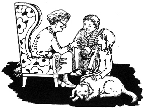

第十二章　陶穆太太归来

接下来就到了陶穆太太回家的那一天。

在她到家的时候，我也在场，我事先安排了一下，想让她对发生的事情有所准备。

同时还有两个警察也在那里，他们得知了她要回来的消息，想等她回来以后去办一些例行的手续。

她的反应出乎意料地平静。当听说了盗贼的事后，她对我们说：“这些笨家伙，他们还不如去证券交易所呢，那儿可以拿到的钱比我这里多。”

她可真是一个很酷的老太太！

警察添油加醋地对她讲了我和马塞尔、莫尼卡的勇敢行为，还把报纸上对这个事件的报道拿给她看。

然后，他们给了她一张清单，上面列出了本来放在地下室的那个箱子里的财宝，所有的这些东西现在都妥善地存放在警察局的一个保险箱里。

陶穆太太被感动了，她真诚地向我道谢。

那些警察走了以后，我终于可以不受干扰地和她说话了。

“为什么您要冒险把这么多钱和金子存放在家里呢？”我迫切地想知道。

“有很多原因。”老太太向我解释，“首先，因为我有时喜欢把这些东西拿在手里欣赏，我很喜欢黄金和钞票。”

我不甚赞同地看着她，心想，用这样的方式喜欢钱，不知道是不是正常，而她又如此坦率地承认……不过随即我又回想起那天，我和马塞尔观赏箱子里的东西，然后一一清点的情景。当我们触摸一根根金条的时候，是多么的愉快！难道一位老太太在打开箱子时不该享受同样的幸福感吗？何况这些东西都是属于她的。

陶穆太太继续说：“第二，这一笔钱是留着应急用的。不管发生什么事，我放在箱子里的东西总够我花上几年的。”

“那也未免太多了吧！”我笑着说。

“这要看你总共拥有多少钱，”陶穆太太解释说，“要是把超过财产总数10％的现金存放在家里的话，就没有意义了。”

我轻轻吹了一声口哨。这位老太太一定非常有钱。

“第三，我把很大一部分钱投到了股票上面，这包含了一定的风险。所以，至少要把一部分钱放在手头，这是明智的做法。这一点有机会我再解释给你听。”

陶穆太太看来一点儿也不着急收拾屋子。她就是喜欢说话。

“如果钱被偷走了怎么办呢？”我提醒她说。

“要是这样的话，就真的很遗憾了，因为那些盗贼不会高兴多久的。”老太太毫不犹豫地说。

“可是如果他们已经得到了所有财宝，”我惊讶地大声说，“怎么会高兴不了多久呢？”

“这挺难解释。这么说吧，钱只会留在那些为之付出努力的人身边。用非法手段取得不义之财的人，反而会比没钱的时候感觉更糟糕。”

“我不明白，”我疑惑地说，“那这些盗贼为什么还要费这么大劲呢？”

陶穆太太想了一会儿，说：“因为他们认为有了很多钱就可以改变处境。他们以为金钱会使人幸福。”

“我的爸爸妈妈也这么想，”我一边思索，一边说道，“他们相信，要是不用为钱发愁的话，他们就可以活得很好。”

“那你父母就跟许多人一样有错误的想法。要想过更幸福、更满意的生活，人就得改变自身。这和钱无关，金钱本身既不会使人幸福，也不会带来不幸。金钱是中性的，既不好，也不坏。只有当钱属于某一个人的时候，它才会对这个人产生好的影响或者坏的影响。钱可以被用于好的用途，也可以被用于坏的用途。一个幸福的人有了钱会更幸福；而一个悲观忧虑的人，钱越多，烦恼就越多。”

“我妈妈总说，金钱会使人的本性变坏。”我反驳道。

“金钱会暴露一个人的本性，”陶穆太太解释说，“金钱就像一个放大镜，它帮你更充分地展现出你本来的样子。好人可以用钱做很多好事。而如果你是盗贼，那你很可能会把钱挥霍在一些蠢事上。”

我得花点儿时间思考一下老太太的话。金钱给我带来了好处，我得到了爸爸、妈妈、堂兄马塞尔、银行职员海内女士、金先生和汉内坎普夫妇的尊重，而且我也开始尊重自己；我可以和有趣的人聊天，我的生活变得更加有意思；我开始思考更多的东西。总而言之，我感到更加幸福，体会到了更高的自我价值。

老太太像是看穿了我的想法似的：“金钱能成为我们生活中非常强大的助推力。金钱可以在一定程度上提高我们的生活水平——生活的许多方面都是以钱为基础的。有了钱，我们就更容易实现我们的目标和梦想——当然，包括好的目标和梦想，也包括坏的目标和梦想。”

我想自己可以安下心来了，因为我的目标是好的。此刻我才真正明白，为什么钱钱一开始就坚持要我首先确立自己的目标。现在我相信，金钱并不会使我的本性变坏。

我感激地看着钱钱，它正舒舒服服地躺在我的脚边睡觉。

老太太继续前面的话题说：“我只是把一部分现金放在箱子里，还有一部分存在银行的保险柜里。盗贼不可能让我陷入困境的。”

突然，她想到了一个主意，说：“我要谢谢你们。我想做一件能让你们终生受益的事情。所以我提议，由你和你的朋友们跟我一起组成一个投资俱乐部。”

“一个什么？”我问。

“我的意思是说，我们共同投资。比如每人每月拿出50马克放在一起，然后我们一块儿用这笔钱投资。”

这时我兴奋起来。“您要告诉我们，怎么让我们的‘鹅’下金蛋！”我激动地高声说道。

这会儿轮到陶穆太太迷惑不解了。因此我把鹅和金蛋的故事讲给她听，陶穆太太很感兴趣。

“这个故事其实正好说明了我所做的事情，”老太太高兴地说，“我以前就应该好好学一学。你这么小就知道了应该怎样正确理财，多幸运啊！这一点你现在还体会不到。”

她说的话当然让我很得意。我开心地朝钱钱望去，它正睡得迷迷糊糊，还轻轻地摇着尾巴。我打算明天一早就把这几句夸奖的话记在成功日记上。现在，我发现自己越来越喜欢记成功日记。以前，我首先想到的是为什么有些事情自己没做好，而现在，我把更多的注意力放在我能够做到的事情上。所以，我更多的是去寻找解决的办法，而不是寻找开脱的借口。

我本想这会儿就听听投资俱乐部怎么运作，可是陶穆太太更愿意给我们3个人一块儿讲解。我答应她与莫尼卡和马塞尔约一个时间，来跟她合作成立投资俱乐部。

临走的时候，她给了我140马克，这是照看比安卡的钱，一天10马克。我和钱钱飞快地跑到了银行，准备把一半的钱存进我的“金鹅”账户。

我刚走进银行，海内女士就朝我跑过来。她说在报上看到了我们的事迹，现在总算有机会向我表示祝贺了，她还说她为我骄傲。

她正要去休息，于是请我去喝一杯汽水。我高兴地接受了。

“你的账户情况真不错呀！”海内女士称赞我说，“我发现，你在很聪明地攒钱。虽然你没有大人挣得多，可是你比很多大人存下来的钱还要多得多。”

我感到很自豪，脸有点儿发红。海内女士的态度一向很亲切。她想了一会儿，问我：“不过除了用在‘鹅’身上的钱，其他钱你到底用来干了什么呢？”

“我把它分成5份，1份用来做零花钱，还有4份，往我的梦想储蓄罐里各放2份。因为我想去旧金山，还想买笔记本电脑。”

海内女士兴奋地看着我说：“你的方法比我一开始估计的还要聪明。你等一等，我去打个电话。”

过了几分钟，她喜滋滋地回来了，神秘兮兮地对我说：“吉娅，我觉得所有孩子都应该了解一下你的方法。我考虑了一下我们应该怎么做才能达到最佳效果。你知道，我是我孩子学校家长委员会的成员，几天以后，那里将举行一个所有学生和家长都来参加的大型活动，这是介绍你的方法的大好时机。我刚刚为这件事给校长打了个电话，跟他提了这个建议，他同意了！”

我不解地看着海内女士。

“嘿，就是说你要在他们面前演讲。”她向我解释说。

我浑身一震，耳朵开始发烧，心扑通扑通地跳。我脑海中浮现出自己走进一间挤满了人的房间作报告的场景。

“我可不干，”我坚决地说，“我害怕。”

海内女士笑了。

“再说我根本就不知道该说些什么。”我又补充说。

看来这位银行职员不想轻易放弃自己的想法。她若有所思地向窗外望去。“你知道吗？”过了片刻，她开始说，“在工作中，我看到了大多数人是怎么理财的。有好多人向我倾诉他们碰到的问题。你根本想不到，如果一个人没有学会理财的话，会生出多少痛苦和烦恼。虽说钱也许不是生活中最要紧的东西，可是在缺钱花的时候它又非常重要。没钱，生活的各个方面都会受到影响，你会整天愁眉苦脸，跟周围的人吵架，还会觉得自己很悲惨，很没用。现在没有人来告诉大家，多存一些钱，让生活过得好，这是多么容易的事情。其实学校里就应该开理财这门课。”

海内女士叹了一口气，又说：“但是现在没有这门课，所以你就更加不应该只让你的方法留在自己心里。”

我立即明白了她说的话。我自己也发现，自从我学习理财以来，生活变得多么有意思。可是，我还是认为自己绝对不会去演讲。“我会一句话也讲不出来的。”我绝望地说。

“那你觉得这个主意怎么样？我和你一起站在台上，我提问，你回答。你只要讲讲你的经历就行了。要是你停下来，我可以帮忙接下去。”

我没有被她说服：“不如干脆由您来讲呢，您熟悉这个内容，您在银行工作。”

“可是如果由你来说，给人留下的印象要深得多，”海内女士回答说，“要是让我来说，听起来就像是一个在银行里工作的女人啰里啰唆的废话。而你能被孩子们接受，你做的事情是其他孩子原本也可以做到的。”

“可是我很可能会说得结结巴巴，”我反对说，“我真的会很害怕。”

“如果你能再考虑一下，不管结果怎样，我都会很高兴的。没有人能强迫你做你不愿意做的事情。只有你自己才能强迫自己去做。”

我和她道别后，一路思索着离开了银行。海内女士的最后一句话尤其令我深思。“只有你自己才能强迫自己去做。”为什么我要强迫自己呢？

到汉内坎普家的时候，我还陷在沉思之中。我想接拿破仑出来，但是它的一只爪子发炎了，需要护理。汉内坎普先生请我吃蛋糕，是他太太烤的。蛋糕散发着好闻的香味。我狼吞虎咽地吃掉了3块，却没怎么说话。

“你今天这么沉默，”老先生注意到了，问我，“有什么问题吗？”

我把海内女士的建议和我的恐惧告诉了他。

“要是我的话，无论如何都会去做的。”他毫不犹豫地大声说。

“可是您自己说过，您始终只做那些让您开心的事。”

“一点儿没错。”老先生回答说，“我曾经有一个爱好，就是摄影。为此我中断了学业，在世界各地跑了13年，那是一段美好的时光，不过我没挣多少钱。后来我想看看自己是不是也适合做商人，就开了一家照相馆。几年以后我把它卖了个好价钱，又在加勒比海买了一家小饭店。后来我在欧洲做地产生意，又赚了不少钱。只是我在投资理财方面总是不大在行。我太太倒是对此略知一二，也有些兴趣。”

这位老人所经历的一切令我惊叹不已，那一定是一段非常有趣的生活。“但这只是证明了您总是只做您感兴趣的事。”我坚持说。

“兴趣是有的！”汉内坎普先生证实说，“不过往往也伴随着恐惧。你以为我中断了学业跑到世界各地，很轻松吗？我常常感到不安。投身商海的时候我也很担心。”

他用一种恳切的目光望着我，说：“我生命中出现了最美好的东西，是因为我做了原本不敢做的事。”

我用怀疑的目光注视着他。看来，对于只做令自己快乐的事情这一点，我把它设想得过于美好、过于轻松。

“你看看我太太，”老先生继续说，“她还是小姑娘的时候就很漂亮，而我却一直其貌不扬。在火车上，我第一眼看见她，就立刻爱上了她。我知道，如果那时不找她搭话的话，很可能再也见不到她了。车厢里坐满了人，我坐在她的对面。在这种情况下，要当着别人的面跟她搭话，我觉得这是我所经历过的最可怕的时刻。我得在下一站下车，没有多少时间了。我快要急死了。她要是拒绝我怎么办？还当着所有乘客的面，多丢脸呀！可是我还是冒险去做了。你看，我得到的奖励是什么？我生命中最宝贵的东西。”他温柔地抚摸了一下妻子的手。

汉内坎普太太补充说：“最珍贵的礼物是我们自己争取来的。克服了丢面子的恐惧，世界就会向你敞开大门！”

这些话都很有道理，可是消除不了我内心的不安。想想那些听众吧！汉内坎普先生想到一个主意，说：“吉娅，你想象一下，如果你既不害怕，也不焦虑，你会有兴致讲你的故事吗？”

我不由自主地想起，这段时间我经常对别人讲我的故事，而且总是兴致勃勃。所以我答道：“要是只有一两个人听我说，那我确实讲得很愉快。”

“你要做的只是你力所能及的事。你能和两个人讲你的故事，也就能和200个人讲你的故事。做你喜欢做的事，就会抑制住你的恐惧心理。”老先生神采飞扬地说。

我不由得想起，当初我走进陶穆太太的地下室时是多么害怕，后来我又是多么自豪。不过，我的恐惧此刻并没有因此而消失。

“生活有时候真的很难。”我唉声叹气地说。

“也很精彩！”汉内坎普太太抚摸着丈夫的手，出神地说道。

我再次深深地感觉到，他们两人过得十分幸福。从他们身上我可以学到很多东西。
