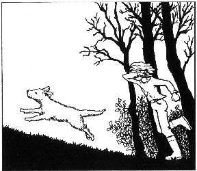

第十三章　巨大的危机

我一回到家，就发觉气氛不对劲。爸爸就像一只热锅上的蚂蚁，在屋子里不停地走来走去。妈妈趴在厨房的桌子上凄然落泪。钱钱则识趣地躲在花园的灌木丛里，一看到我，它就立刻跟着跑进了屋。

我小心翼翼地问起造成这种混乱局面的原因。妈妈没有回答，反而更大声地啜泣。爸爸竭力控制住自己的情绪，脸上带着一副大难临头的神情，告诉我说：“我们拖欠了房子的分期付款，现在收到了银行的警告信，威胁说我们必须在一定期限内付清，否则就取消贷款。”

“那又会怎样？”我问，“会发生什么事情呢？”

“银行会收走我们的房子，因为我们显然筹不到这么多钱。”爸爸的眼睛里依稀有泪光闪烁，似乎随时都会哭出声来。

“我们又得去住狭小的公寓了，真没面子！”妈妈可怜兮兮地抽泣着说。

“我们一辈子也无法摆脱这些债务。”爸爸眼中充满了悲凉。

“而且我们什么也买不起了。”妈妈又哭着补充说。

“不会的，不会的。”我试着安慰他们，但是声音听起来有些敷衍。我觉得现在自己在这里也于事无补，就连忙带着钱钱向树林跑去。此刻我真的很需要钱钱的建议。

我们走进秘密据点。自从钱钱在这里给我上过第一堂理财课后，似乎已经过去很久了。世事变化真快。

“不错，你进步了很多。”我听到了钱钱的声音。

“又能跟你说话了，感觉真好。”我一边说，一边用胳膊温柔地搂住了它。

“我只会在你需要的时候跟你说话。”钱钱说。

“我现在就非常需要你。”我毫不犹豫地回答。

“其实你根本不需要我了。和钱有关的绝大多数课程，你在和别人的谈话中都已经学过了。这些人本身都很富有，是最好的老师。你现在只差一门重要的课程，就是怎样投资。其实这方面有很多人都愿意帮助你，我只需要给你一些指点，你自己一个人就可以做到。”

“是的，是的，可是这些都不那么重要，”我说，“我现在急需你的帮助，要不然我们就会失去我们的房子。”

“别胡说，”钱钱撇了撇嘴，好像吃到了什么难吃的东西似的，“你已经采取了关键的行动，你不是替爸爸妈妈和金先生约好明天的会面了吗？他会有办法的，一切都会好的。”

噢，我差点儿把这件事给忘了。没错，那位富有的金先生的确值得信任，他一定能轻而易举地解决我们的问题。

“我想，你刚刚又找到了一个做有钱人的很好的理由。”钱钱提示我。

我疑惑地望着它。

“你可以做一个有能力帮助别人的人，而别人也会相信你，愿意接受你的帮助。”钱钱解释说。

“你是说，我可以成为像金先生那样的人？”我惊愕地问。

“可以这么说。”钱钱回答，“你可以像他一样有能力达到你计划的目标，但是你不会变得和金先生完全一样，而会拥有自己的个性。只要你继续像现在这样做，你会变得和他一样成功。”

我听得简直目瞪口呆了。就算做梦我也没有这样想过，但是钱钱说的话肯定不会错的。我决定明天马上把这几句表扬的话记到我的成功日记上，这是我一生之中听到过的最动听的赞美。我能够变得像金先生一样成功，多么不可思议！

“最重要的是，你要确定你想要的是什么。”

“这不难确定。”我顺口说道。

“大多数人当然都会说没问题，可并非所有人都愿意做出必要的努力，因为他们不想付出代价。”

“那我必须做些什么呢？”我好奇地问。

“就是你现在已经在做的这些事情。当你取得一些成功之后，不要停止写你的成功日记，这是很重要的。”

我希望它能更详细地解释一下这一点。

“这不像你现在想的那么简单。”我听见钱钱用恳切的口气接着说，“成功会使人骄傲。如果你骄傲自大，你就会停止学习。不学习，人就不会再进步。”

它停顿了一下，接着说：“当你写成功日记的时候，你会对自己，对世界，还有对成功的规律作更深入的思考，会越来越多地了解自己和自己的愿望，这样你才会有能力去理解别人。彻底了解自己和世界上的所有秘密，是我们无法完全实现的一种理想，但我们可以一步一步地慢慢接近这种理想。”

“我很喜欢写成功日记！”我自语道。

“很好。”钱钱的声音听起来很严肃，“可是还有一点，你不能在困难面前逃跑。困难、犯错误和丢面子引起的恐惧已经破坏了无数人的生活。”

我的脸红了：“眼前就有一件事真的让我很害怕。而且为这事，海内女士和汉内坎普夫妇都很诚恳地劝过我了。”

我把海内女士的建议说了一下，然后说：“我知道自己应该接受这次演讲邀请，可我真的是太害怕了，我做不到。”

钱钱给了我一个意想不到的回答：“来，我们去拿成功日记。”

说着它就一溜烟跑了。

摸不着头脑的我赶紧去追它。尽管使出了浑身的力气，我还是追不上它。等我气喘吁吁地跑到家里，它早就等在那里了。我飞快地拿出日记本，又和钱钱一起跑回树林里。回到秘密据点时，我已经跑得上气不接下气了。

“每当你觉得有些事情不好办的时候，你可以做一件事，”等我歇了口气后，钱钱说，“只要翻一翻成功日记，你就会从过去的事情中找到证据，相信自己未来也有能力完成任何事情。”

我的眼睛扫过我的日记，发现在有些情况下我并不怎么害怕，而且在那种情况下事情都很容易完成，比如当我向汉内坎普先生提议带拿破仑去散步的时候，还有当我认识金先生的时候。我又想起了走进地下室时的恐惧心情，还有害怕被妈妈取笑的心情——就像她发现了我的梦想储蓄罐时那样，以及怕失去钱钱的担忧……

“你不认为你比自己原本想象的要能干得多吗？”钱钱认真地看着我说。

真怪，想到演讲，我确实开始感到不再那么害怕了。越回想我所克服过的那些困难，我就越发对自己充满信心，那种不能自已的恐惧感已经消失了。我只是有些紧张，还有些激动，可是我忽然觉得自己是可以做到的。

钱钱依然专注地凝视着我。

“这真像变魔术，”我惊奇地说，“刚才我还深信自己绝对不会去做的，而现在我甚至觉得这无所谓，虽然我还是觉得紧张。”我心里有一种很美妙的感觉，汉内坎普夫妇和海内女士肯定也会为我的决定而骄傲的。

钱钱欢快地舔着我的脸。我还没有让它改掉这个习惯动作，而且我也不认为自己哪天能办得到这一点。

此刻我还没完全回过神来——就像变魔术一样。“怎么可能呢？”我迷惘地问。

钱钱仿佛在微笑，它说：“恐惧总是出现在我们设想事情会如何不顺的时候。我们对失败的可能性想得越多，就会越害怕。而当你看着自己的成功日记时，你就会注意到那些成功的事情，自然而然也就会想到应该怎样去做。”

我不知道自己的理解是否正确。

钱钱把自己的解释又总结了一遍，说：“当你朝着积极的目标去思考的时候，就不会心生畏惧。”

“我还没有完全明白，”我耸了耸肩说，“不过这就像使用电一样，知道怎么用就行了。”

钱钱赞同地眨眨眼睛。

我们再次离开了我们的秘密据点，不过这次我们走得很悠闲。

上床睡觉前，我还有一大堆事情要做。我得安慰爸爸妈妈。在提到和金先生的约会之后，至少妈妈不再哭泣了。然后我给马塞尔和莫尼卡打了电话，告诉他们陶穆太太要和我们组建投资俱乐部的提议。

第二天，那位很和善的司机把爸爸妈妈接走了。金先生说，或许最好由他单独和我的爸爸妈妈谈谈。我不清楚他和他们俩分别谈了些什么，又做了什么安排。他们去了很长时间，回来的时候兴高采烈。

他们告诉我，金先生帮他们把分期付款期限暂缓了几个月，而且把每个月的分期付款额调低了32％。这样一来，他们每个月手头的现金就多了。他们会将一半的钱存起来应急，另外一半他们准备用来喂一只自己的“鹅”。

我高兴地拥抱了爸爸妈妈，然后一把搂住了钱钱。他们不知道，我是多么地感激钱钱。我久久地抚摸着它的白毛。钱钱静静地望着我，然后又在我的脸上使劲地舔了一下。

然后，我脚步轻快地朝我的房间走去，拿出了夹在成功日记里记着我的愿望的纸条。上面写着我的三大愿望之一：帮助爸爸妈妈还债。这一点我做到了——虽然事实上是通过金先生的帮助，但这毕竟是由我促成的。我郑重地拿出红笔，在上面画了一个大大的对勾。然后，我在成功日记上又专门记了一笔。似乎这样还不足以表明这件事的重大意义，于是我就在成功日记的最后一页上又写下了一行大字：

我最大的成果——

帮助爸爸妈妈摆脱了债务压力，并且开始储蓄。

然后，我充满骄傲地看着我的梦想储蓄罐，这一切真是太棒了！
