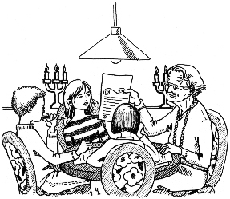

第十四章　投资俱乐部

下午，我和马塞尔、莫尼卡——当然还带着钱钱——一起来到了陶穆太太家里。

老太太为接待我们特意作了准备，在一张圆桌上铺了墨绿色的桌布，还摆上了一个插着6根蜡烛的旧式烛台。烛光营造出一种庄重的氛围。我们每个人的座位前面都摆着一个文件夹和一个信封。

刚开始时，她不让我们动这些东西。我们对于接下来的事情都充满了好奇。

“现在宣布召开我们的第一次投资会议。”陶穆太太郑重其事地说，“首先，我们需要给我们的投资俱乐部起一个名字。”

这下她算是找对人了，我们想出了好多点子：从“金库”“金鹅”“魔术师”“金币之魂”“投资梦之队”“黄金四人组”到“金钱火箭”和“王牌KIMAMO”——KIMAMO是我们取了每个人姓名的头两个字母组成的一个词。

最后，我们决定采用莫尼卡的主意：“金钱魔法师”。我们一致认为，只要学会了我们的咒语，就可以从无到有地变出钱来。

我们的咒语是：

1．确定自己希望获得财务上的成功。

2．自信，有想法，做自己喜欢做的事。

3．把钱分成日常开销、梦想目标和金鹅账户三部分。

4．进行明智的投资。

5．享受生活。

我们拿起准备好的笔，在文件夹上写下“金钱魔法师”几个字和我们的名字。马塞尔忍不住笑了出来，因为笔写出来的颜色是金色的，大家都忍不住笑了。

陶穆太太的确想得很周到。

然后我们打开文件夹，在第一页上写下我们的咒语。

接着，老太太很严肃地说：“我们需要一些规定，来保证我们的投资俱乐部能取得成功。我把这些规定写在第二页上了。”

我们立即翻过第一页，读了起来：

1．每月聚会一次。

2．出席会议是每个成员的义务。

3．每人都要交出一定数额的现金。

4．不得将该钱取出，因为我们希望“鹅”长大。

5．所有的决策由全体成员共同作出。

于是我们确定了一个每月聚会的日期，又决定每人每月投入100马克——这对大家来说都不成问题，因为我和马塞尔的收入不错，而莫尼卡拿到的零花钱很多。我们想联名开一个只有大家一起才能动用的账户。

我们把所有的决议都记录了下来。

这时，陶穆太太把气氛推向了高潮。她说：“我考虑了一下应该怎样感谢你们上一次的勇敢行为。我想到了一个主意，我向你们每个人赠送一笔钱，作为投资俱乐部的存款，你们现在可以打开信封了。”

她话音刚落，我们就立即动手。真不敢相信自己的眼睛，我们每个人的信封里都放着5张1000马克的钞票。虽然我们私下里也曾想过她也许会给我们钱，可是绝没料到会是5000马克。

我看得眼都花了——我还从来没有一下子得到过这么多的钱呢。

“这钱我们不能接受。”马塞尔迟疑地说。莫尼卡也附和说：“我们压根儿什么也没做呀！”

陶穆太太的看法完全不同，她说：“你们帮了我一个大忙。对我来说，钱被偷走了还不怎么要紧，可是我丈夫送给我的首饰对我来说却是非常重要，每戴上其中的一件，我就会想起我丈夫和我在一起的那些美好时光。”

我心里也觉得有点儿矛盾，不过我能体会到陶穆太太为什么要把钱送给我们。因此，我本能地站了起来，拥抱了她一下。一定很长时间没有人和她拥抱过了，因为她显得很激动。

莫尼卡也立即跟着拥抱了她。

接着，我又给马塞尔使了一个眼色，他才犹犹豫豫地照着做了。

我们表示了感谢，随后又回到座位上。老人脸上显出极其欣慰的神情。我们把那些钞票拿在手里细细地看了好一会儿——这么多钱！

“现在我们一共可以存入2万马克作投资了，”老太太总结说，因为她还要再拿出5000马克作为她自己的那份，“然后再加上每人每月100马克，总共是400马克，一年就是4800马克。照这样下去，算上这2万马克，6年以后我们总共能存下48800马克。可是如果我们把这笔钱用来投资，它会变得更多，远远不止这个数字。”

“那到底会有多少呢？”莫尼卡想知道答案。

“这个我以后跟你们说，”老太太回答，“现在我们得赶快去银行，开一个联名账户，把这笔钱存进去。谁知道哪家银行比较好？”

“我知道！”我急忙说。还有谁会比海内女士更好呢？于是我们把钱装进口袋，起身去银行。

当我们大家把各自的5张大钞放到柜台上的时候，海内女士显然吃了一惊。当然，她认为我们的主意非常好。

我们把账户取名叫“金钱魔法师”，存折上也会印上“金钱魔法师”这个名字的。

手续办理完毕，大家满意地离开了，我故意落在后面，因为我还想和海内女士说些事。我悄悄地告诉她，我决定在学校的大会上演讲。

海内女士满意地看着我。我们约好了一个时间，她到我家里来，跟我排练一下演讲。

我飞快地朝其他人追去，很快赶上了他们。和金钱魔法师们一起走在大街上的这种感觉真的很好。莫尼卡提议我们今后互相之间只以金钱魔法师相称，马塞尔却觉得这有些过分，但是莫尼卡坚持自己的想法。

重新回到我们的巫婆小屋后，等待着我们的是我们的第一课。我们现在将要决定把这些钱投资在什么方面。

等我们都在圆桌边坐下后，陶穆太太开始说：“投资比多数人想象的要容易得多。因为基本上我们只需注意三点。我把它们记在你们文件夹的第三页上了。”

我们迅速翻到第三页，我大声地读出来：

1．应该把钱投资在安全的地方。

“那当然，”马塞尔说，“要不然所有的钱就会全没了。”

“说得很对。”陶穆太太赞同地说。

我开始读下面一条：

2．我的钱应该下很多“金蛋”。

陶穆太太解释说：“我们当然想要最丰厚的利息，所以就应该看一看，哪种投资的利息最高。而最高的红利总是从股票上获得的，这一点你们需要知道。”

下面还有最后一条：

3．我们的投资应该简单明了。

“而且易于操作。”我加上一句。

“比如像银行账户，”陶穆太太补充说，“操作起来毫不费力。”

这一点莫尼卡觉得特别重要，因为她暗暗担心自己会弄不大清楚。

“那我们就把钱全投在股票上吧！”马塞尔得出了结论。

“股票到底是什么东西？”莫尼卡询问。

马塞尔用一种不屑的神情看着她说：“连小孩子都知道什么是股票。”

陶穆太太说：“那你就给莫尼卡简单地讲一讲什么是股票吧。”

“没问题。”马塞尔开始介绍起来，“股票是，如果……嗯，对，如果在交易所，嗯，嗯……噢，如果搞投机的话……”

他满脸通红，结结巴巴地说着。老太太和蔼地接过话茬说：“这正是很多大人也会有的问题。对股票，每个人都知道一点点，可是很少有人清楚它到底是什么东西。”

我得承认，除了“股票”这个名字之外，我对它一无所知。

“你们设想一下，”老太太继续说，“假设马塞尔花2500马克为他的面包派送业务买一台电脑，就会大大减轻他的工作量，还可以节省很多时间。可是他不想为此花自己的钱。这样的话，他可以借钱。一个选择是向银行借，也就是贷一笔款，可是那样的话，他就必须定期还贷款，另外还要支付利息。另外还有一种完全不同的选择，他可以向你们两个求助，请你们借钱给他的公司，这样不用定期还钱，也不用支付利息。假设你们每人借给他800马克。”

“为什么我们要这样做呢？”莫尼卡茫然地问道。

“这就是关键的一点，”陶穆太太连忙解释，“只有当你们能从这件事中得到好处的时候，才会去做。如果马塞尔让你们参与他公司的分红，那么你们这样做就有意义了。”

“怎么进行呢？”我想知道。

“比如说，你们可以约定，每人拥有他公司10％的股份。我们就算他的公司价值1万马克吧。”

“我们怎么知道它值多少呢？”我问。

“决定一件东西价值多少的唯一因素就是，你愿意为它支付多少钱。”老太太解释说。

马塞尔立刻又有了一个想法：“也许会有另一个面包商愿意把它买下来，这样他还会有新顾客，这肯定是划算的。”

陶穆太太赞许地点点头。“你很有商人头脑。”她夸奖说。马塞尔立即就喜形于色了。

陶穆太太接着说：“如果他现在想把公司卖掉，而且有人愿意出1万马克购买，那他的公司的市值就是1万马克。他拥有80％的股份，也就是8000马克。你们两个每人拿到10％，也就是1000马克。”

“那我拿到的钱就比给他的钱多200马克！”莫尼卡欢呼。

“机灵鬼！”马塞尔咯咯地笑着说。莫尼卡白了他一眼。

“就是说，”我边想边说，“我们只有卖掉公司，然后才能赚到钱？”

“不完全是，”老太太回答道，“也可能会有另一个人想要从你手里买下这10％，那就由你决定卖什么价钱。假设你开价1100马克，那你就能很快赚一笔。”

“那我不如开价2000马克。”莫尼卡叫道。

“这不是不可以，”陶穆太太同意说，“但这样的话，可能就没有人要买下你手里的10％了。因为只有当别人相信这些股份将来可以卖出一个更好的价钱的时候，他才会买进。这就是每天在交易所里发生的事情。交易所是人们聚在一起买卖公司股份的地方，每个人都希望将来会有人以更高的价钱买下他手里的股份。”

“但是这谁能说得准呢？”我一边思考一边说。

“你说得很对，”老太太同意我的说法，“不过还是有人可以预测马塞尔的公司是不是有升值的潜力。”

“如果我的公司升了值，那你们的股份也会更值钱。”马塞尔领悟了，说道，“如果有些人看到了继续升值的希望，可能会用更高的价钱买下我的公司的股份。”

我佩服地看着他说：“这些东西你这么快就懂了！”

“对，他是领悟得很快，”陶穆太太再次夸奖了他，“不是每个人都会这么快进入状态的。”

“我就觉得一点儿也不容易！”莫尼卡抱怨说。

“这正是股票的好处，”老太太轻快地说，“你不需要自己开公司，只要在公司参股就行，你所用的方法就是购买公司的股份，也就是股票。”

“就是说，我可以用自己的钱让别人替我工作。”莫尼卡高兴地说。

我还有点儿将信将疑：“可是要是没有人肯买我的股份怎么办？”

“那你就必须降低价格，直到有人认为‘这时买进肯定值得’为止。买主总是有的，但问题是价格是多少。”老太太解释说。

“那就是说，我也可能亏损。”我用不甚满意的语气说。我一点儿也不喜欢这样。

“是的，”陶穆太太同意我的说法，“但是只有当你出售股票的时候，你才会亏损。如果你保留着这些股份，将来可能会有人愿意付更多的钱来买进。”

“那么这段时间里我就什么也得不到？”我很想知道一切。

“不，在这期间，你参与所有的分红。”老太太马上打消了我的疑虑，“每当公司赢利，就会把利润分配给所有持有股份的人，这叫红利。”

“也就是说，马塞尔必须定时从他的收入中拿出一部分，交给我们？”莫尼卡兴奋地问。

“公司要每年计算一次赢利，然后再决定把这些钱用来做什么。比如可以用一部分钱购买新设备，让公司运作得更好，其余部分分配给所有持有股份的人。”

“这由谁来决定呢？”莫尼卡问。

“所有持有股份的人，少数服从多数，这叫股东大会。”陶穆太太告诉我们。

“我喜欢这个主意。马塞尔管理公司必须知道的东西，我自己不一定要会。”莫尼卡为自己总结了一下这次谈话的内容，“但是我凭着自己手里的股份，就能和他赚得一样多，这简直是太妙了。”

“不过你还是得对公司有相当的了解才行。”我补充说。

我又看了一遍写着投资三大原则的那张纸，对陶穆太太说：“听了您讲的这些，我觉得股票既不保险，也并不是很简单明了、容易操作。好像只有第二点符合，容易赢利。”

“要是自己去买股票，的确是这样的。”陶穆太太赞同我的说法，“但也可以让别人帮你选择买哪家公司的股票。”

“我觉得，这种方法比较适合我。”我说出了自己的感觉，“但是到底谁能帮我们做这件事呢？”

“这一点，下次聚会的时候我会慢慢告诉你们。”陶穆太太语气坚定地说，“今天我们已经学了一大堆东西，又把钱存进了银行。下次我们再讨论股票的问题吧。实际上，每个孩子都可以从股票上赢利，就算不太懂得这方面的知识也没关系。”

马塞尔说：“聪明的商人可不会让自己的钱只躺在银行里睡大觉，这样做根本没有什么利息。”

老太太笑了，说：“我觉得你很有意思。你的确很重视赢利，所以你会成功的，因为我们集中精力去做的事会在我们的生活中显出效果。”

“那我们是不是应该马上开始投资呢？”马塞尔问。

“不行！”陶穆太太反对说，“不必马上投资。在投资之前，你们得想一下自己要做些什么。在我们开始行动之前，我要给你们讲一种绝妙的投资方法。另外，我还要给你们准备有关的资料。有一种方法让你们可以做任何一家公司的股东，任何你们喜欢的公司都可以。”

“我喜欢麦当劳和可口可乐。”我急忙说。

“我喜欢玩具反斗城。”莫尼卡大叫。

“那我下次会告诉你们，怎样使自己成为这几家公司的股东。”老太太卖了个关子，神秘兮兮地说。

我们3个一致同意明天就再次会面，但陶穆太太说她还需要几天时间来准备资料。于是我们几个金钱魔法师只好决定5天以后再聚会。
