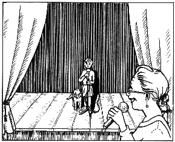

第十五章　演　讲

在这之后，海内女士来了我家，我们讨论了演讲的事。我的想法是最好逐字逐句地写下来，但是海内女士对演讲很有经验，她劝我不要这样做，否则听众会觉得相当不自然。

我们决定还是采用原来说好的方案，海内女士提问，我来回答。我们定下了几个问题，我试着回答了一下。

距离开会的日子——星期六越来越近了，我也越来越焦虑。我希望演讲取消，甚至希望自己生病。

星期六的早晨终于来临了。前一晚我睡得很糟糕，早上也醒得很早。随着时间一分一秒地流逝，我越来越惶恐，脑子里面一片空白。我根本就不想吃早饭，我连一口也吃不下去。

我原来的想法真是太愚蠢了，我怎么会被说服同意去演讲呢？一定是我一时糊涂。放着舒舒服服的事情不做，偏要自讨苦吃。我的肚子咕噜咕噜直响，该怎么办呢？我简直受不了了。

这时，钱钱摇着尾巴凑了过来。

“你这会儿也帮不了我。”我叹了口气说，“这次我完了，我还从来没有演讲过呢，可现在偏偏得马上在几百人面前讲话。”

我发现钱钱的嘴里叼着什么东西，接过来一看，是我的成功日记。

“你真可爱，钱钱，”我边说边使劲摇了摇头，“可是这没有用，我这会儿没法集中精神做任何事情。”

钱钱不为所动，它又叼起日记本，用迫切的目光看着我。

我烦躁地把它往旁边推。钱钱敏捷地闪开，把日记本丢在我的脚下。我刚想把日记本扔到一边，钱钱着急地冲我叫了几声。

我忍不住笑了起来。我打开日记本，不由自主地回想起了我们上次“谈话”时所发生的事情。正是由于看了日记，我才有勇气决定去演讲。我一边思索着，一边打开了本子，开始随意翻了起来。我还有什么没做到呢？我挣了钱，找到了活儿干，在巫婆小屋里冒险，在银行开了新的账户，学会了好的理财方法，帮爸爸改善财务状况……我沉浸在我的成功日记中，忘记了演讲。看来，我计划的事情多半还是可以做到的。

我拿着我的成功日记足足看了半个小时，感觉好多了，时间也到了。我穿好衣服，去车库推自行车。

这时爸爸妈妈从厨房走了出来，显然他们想和我一起去。我心头一震，做梦也没有想到爸爸妈妈会去听。

我呆呆地和钱钱上了爸爸的车。路不远，我一路上抱着钱钱，感觉到一些安慰。

海内女士已经在学校门口等着我了。她愉快地同我打了个招呼，拉住了我的手。我们走进学校的礼堂，里面挤满了人。人好多呀！我们坐到了第一排。虽然根本还没轮到我讲话，但我觉得好像每个人都在盯着我看。

突然，我听到了一个熟悉的声音。我顺着声音的方向转过身去，在身后的过道上，我看到了一张熟悉的脸，是金先生。他坐在轮椅上，他的和气的司机推着他朝我们走来，我高兴地向他打招呼。

“吉娅，今天对你来说是一个特别的日子！”他对我说，“我不想错过这个场面，是你爸爸妈妈跟我说的。”

我感动得说不出话来。这时我才发现，陪着金先生一起来的是一大群我熟悉的人，马塞尔、莫尼卡、陶穆太太和汉内坎普夫妇全都来了。我向大家一一问候。虽然我还是很紧张，但看到所有的朋友都在这里，我有了些信心。尽管我心里像是揣了一窝小兔子似的怦怦乱跳，但是我忽然觉得不会有什么问题了。

海内女士向我发出了信号——轮到我演讲了。我站了起来，钱钱自觉地跟了上来。我和它一起走到台上，这在别人看来大概有点儿滑稽，但我觉得很正常。

我们站在麦克风前面，海内女士开始讲话：“各位同学，各位家长，各位老师，你们好！大家知道，孩子们应该从小学会正确的理财方法，我对此一向十分关注。长期以来，我一直在寻找一种合适的方式，向你们讲解一下有关钱的知识。直到有一天，我碰上了一位年龄很小的顾客，她比大多数成年人更会理财。她现在每个月可以赚很多钱，而且她用一种很好的方法来分配这些钱。我所说的，是一个很普通的女孩。不久以前，她还觉得零花钱不够用，但后来她听取了一些很好的建议并且照着去做。现在她已经拥有很多钱，可以用自己的钱来实现她的两大愿望，去加利福尼亚旅游和买一台笔记本电脑。

“这位年轻的小姐名叫吉娅，她愿意向你们介绍一下她的方法。”

接着海内女士转过身来对我说：“欢迎你到我们学校来，吉娅。首先恭喜你取得的成功。你能回答我们几个问题吗？我的第一个问题是，你如何分配你的钱？”

我向听众讲述了我的方法和下金蛋的鹅的故事。

海内女士又问了一些有关孩子挣钱的办法、我的成功日记，以及其他方面的问题。

回答这些问题的时候，我先朝金先生的方向看去，他不停地点头。我还看见马塞尔，他不断地竖起大拇指，向我示意他觉得我回答得很好。我一点儿也不紧张了。

我终于讲完了最后一句话，海内女士郑重地向我表示感谢，台下随即响起了热烈的掌声，其中夹杂着钱钱响亮的叫声。我想快速跑下台，可是海内女士拉住了我，我只好勉强在台上又站了好长一会儿，接受这种礼遇。这真是一种不同寻常的感觉。

回到朋友们中间后，赞扬的话语纷纷朝我涌来。妈妈自豪地挽着我的胳膊，爸爸抚摸着我的头发。最初的喧闹平息之后，金先生用一种恳切的语调对我说：“我真为你骄傲。”

我羞涩地否认说：“我刚才很紧张，把一大堆我想讲的话都忘掉了。”

金先生坚持自己的说法：“你应该直截了当地接受我的称赞，因为我刚刚对你讲的这句话，我并不经常说出口，我真的为你骄傲。你很有演讲天赋，大家喜欢听你说话。其实大家根本不知道你本来还准备讲些什么。”

他停顿了片刻，接着又说：“如果你没有做今天这件事情，你就永远不会知道，给自己一些压力之后，你能够做到些什么。一个人觉得最引以为自豪的事情，往往是那些做起来最艰难的事情。这一点你千万不要忘记。”

我开心地笑了。我完成了这件事情，真好！

活动结束之后，又有一位女士挤到我面前，介绍说自己是一家出版社的老板，她想建议我把自己的故事写成书出版。

马塞尔在一边听到这话，顿时兴奋起来：“我把题目都想好了！就叫《从洋娃娃到金钱魔法师》！”

我不满地看了他一眼。虽然我对这件事不是很感兴趣，但我还是给了她我的电话号码。我没办法告诉别人，这一切都应该归功于钱钱。

我很快向这位女士道了别，又对爸爸妈妈说，我想走路回家——我迫不及待地想和钱钱单独待在一起。

我默默地和我的小狗走在街上，心情很愉快。路上我特地给它买了一大包饼干，然后我们又绕了一段路去我们的秘密据点。

我刚坐到地上，立即觉察到自己刚才有多紧张。而此刻，我完全放松下来，开始轻轻地哭泣。不过我心里并不觉得难受，相反，我觉得很幸福，很为自己自豪。我第一次在我的生命中感觉到，自己真的可以做到很多事情。我心中充满了感激之情。我的生活发生了多么巨大的改变呀！

我心潮起伏地朝钱钱望去。这时，一种感觉忽然涌上我的心头，似乎我和小白狗之间的关系不久将会发生一些变化。但不管将来发生什么事情，我不会再感到不安。
