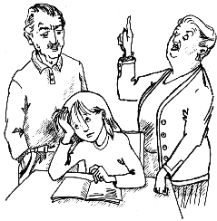

第十七章　爷爷奶奶害怕风险

我们继续定期聚会，每次都学了很多东西，又讨论了很多事情。我们还每月记录一次所买的基金的行情，这样我们卖出的时候就可以清楚地知道能得到多少钱。

刚开始时我们通过这个办法学到了很多东西。不过，陶穆太太认为以后不必这样做。她总说：“最好的办法就是，我们把钱投在一只大型的基金上，5～10年之内根本不去看它。然后，等我们再去查看它的行情的时候，肯定已经得到了丰厚的利润。”

这只基金的行情在很长一段时间内蛰伏不动，几乎可以说一点儿变化都没有，既没有赢利，也没有亏损。但是到了10月份，它的行情突然骤跌；我们的股份只值14128马克了，损失了大约25％。

震惊之下，我们垂头丧气地坐在桌边，一个个都没精打采的。我们没有预料到这种情况。在我们的想象里，我们会沿着一条很陡的直线向另一个2万马克进发。

“我们把蜡烛熄了吧。”我建议说。因为我完全提不起劲来。

马塞尔也一反常态地沉默着。只有莫尼卡很快冷静下来说：“我爸爸今天在厨房桌边站着的时候，对这件事情发表了几句评论。我记不清他说的是什么了，但他肯定没有显出不安的样子。他说他现在可以用一个好价钱进场了。逢低买进，他是这么说的。”

“他说得没错！”陶穆太太的声音响了起来，我们朝她望去。这时我们才发现，她显得非常泰然自若，不动声色，没有丝毫的不安。

“您好像对亏损一点儿也不在意。”马塞尔用疑惑的语气说。

“因为我们并没有亏损。”

“我们有啊，有5000多马克呢。我感觉一点儿也不爽。”马塞尔坚持自己的观点说。

“只有当我们把它卖出的时候，才会有亏损。可是我们并没有这么做。”

“但我还是觉得心情乱得像狗窝一样。”马塞尔嘟囔着。

“这跟狗有什么关系？”我恼火地说。

气氛顿时紧张起来。

陶穆太太被逗笑了，她说：“第一次股市行情暴跌的时候，我的反应和你们完全一样。我痛恨自己为什么要买下这些股票，而且我非常担心行情会继续下跌。在这种时候，报纸上充满了悲观的预测，说这是世界性经济危机的开端，是证券交易所永远的冬天。”

马塞尔和我震惊地对视一眼，这我们可压根儿没想到呢，行情居然还会再跌！

老太太自己一个人咯咯地笑了起来。既然她笑得这么开心，我们也就不那么担忧了。“我经历过几次这种所谓的危机，可是行情总在一两年之后又恢复了，每次都是如此。所以，以后即使再发生行情暴跌的情况，我也能保持镇定。”她说。

我完全不相信，问道：“可是，要是我们真的像您刚才提到的那样，碰到交易所永远的冬天该怎么办？”

“‘冬天’这个词已经说明了问题，这是一年四季中的一个季节。冬天过后，春天就来了，接着是夏天，每个夏天之后又跟着是秋天，然后又是冬天，年年如此。跟大自然的变化一样，交易所里也有四季更替，循环往复。”

“这样的话，我们应该等到‘冬天’，再投钱进来。”马塞尔沉思着说。

“要是我们事先知道‘冬天’就要来临，就可以像你说的那样做。但是我们没办法知道，行情可能跌，也可能会上涨——那时候如果我们没有投资，我们会后悔的，因为有一大笔收益从我们身边溜走了。”

现在正是这个时候，就像莫尼卡的爸爸说的那样，是再次买进的时候。我们可以相信，行情在今后3～5年之内不光会恢复到原来的水平，还会增长20％～30％。

我们最初投资的2万马克到时候就会价值2.4万～2.6万马克。如果我们现在还能再投入2万马克，那这2万马克在同一时期内会获得40％～50％的收益。也就是说，第二笔2万马克到那时会增加到2.8万～3万马克。

“因为我们是低价买进的。”莫尼卡学着她爸爸的样子说。

“什么叫低价买进？”我问。

“意思是说，”老太太解释说，“现在我们可以用比实际价值低的价钱购买股票和基金。不久以后，又有人会愿意付出相当于它们实际价值的钱，把它们买进。这样我们就会大赚一笔。”

跟往常一样，马塞尔想要迅速作出决定，然后行动。他说：“我们应该趁行情还处在低位的时候赶快买进。我们来看看是不是每人都有5000马克，这样我们可以再次投入2万马克。我手头拿得出这笔钱，你们怎么样？”

大家都能挣不少钱，莫尼卡额外又有很多零花钱，陶穆太太反正是没有问题。我的账上还有一点儿钱可以用来投资，但是只有2260马克，还差2740马克，而我又不想动用我的梦想储蓄罐。

但是，我也不想这件事因为我的原因而办不成，我的大脑急速地运转着。这时，我忽然想起爷爷奶奶替我办了一本存折，他们定期往里面存钱，说是给我做嫁妆用的，里面至少有六七千马克。

我把我的想法告诉了其他人，我们决定第二天额外聚会一次。在此之前，我要和爷爷奶奶谈一谈。银行存折肯定不是保存钱的最合适的地方，金先生总是把银行存折叫作“吞钱机器”。

离开巫婆小屋之后，等着我的是几只狗，我得照料它们。晚饭以后，我终于可以去找爷爷奶奶了。

我的面前摆着香甜的饼干和奶奶的拿手美味——可可奶，其他任何人都做不出这么好喝的可可奶。

我原本以为，在听我说完之后，爷爷奶奶会马上认识到现在是很好的买进时机，可是这回我完全估计错了。

爸爸妈妈已经向他们讲了很多我获得成功的故事，因此我可以开门见山地直接说重点。我一边大嚼着饼干，一边介绍我们的投资俱乐部。我身上带着陶穆太太给我们准备的文件夹，所以可以很明白地讲解我们的投资活动。我们买的两只基金的走势我也能讲得很清楚，因为我们一直在记录行情。

爷爷吃惊地说：“吉娅，你这孩子，这可太危险了！这样你会把所有的钱都亏掉的。”

我试着让他们明白我学到的东西：只有当我实际卖出基金的时候，才会有损失；行情总是会回升的，证券交易所总会有‘夏天’和‘冬天’，而总的趋势始终是逐渐上升的；过去已经出现过很多次危机，也有几次形势的确很严峻，但是行情总是一次又一次地回升。

所有这一切都没能让爷爷信服，何况还有奶奶给他撑腰。她说：“吉娅，安全是最重要的。我们活了这么一大把年纪，看到过有些人因为上了骗子的当，失去了他们全部的财产。”

“可是奶奶，这根本不是一回事，”我抗议说，“基金公司管理着几十亿的钱，没有人能卷着这些钱逃走，这是由国家或者银行监督着的。”

“股票是很危险的，”爷爷根本没有认真听我说，“千万不要陷进去呀！”

“你们又不了解股票，”我脱口而出，“怎么能这样武断地说它不好呢？在发表评论之前，你们应该先看一看投资是怎么回事。你们觉得陌生的东西，可不一定是危险的。”

奶奶竖起了一只手指，告诫我说：“年轻人得学会听老人的话，我们活了这么一大把年纪，积累了很多的经验。”

爷爷又补上一句：“骄者必败，不要好高骛远做发财梦了。”

我恨不得大喊几声，但只能赶快告别他们走出来。我连自己的请求都没能说出口，更不用想他们会借钱给我用来投资了。爷爷奶奶甚至反过来要干涉我投资。我不知道该如何是好，也不再觉得信心十足了。

一回到家，我立即给金先生打电话，幸好他这会儿有时间和我说话。我向他说了行情下跌的事情，还有我爷爷奶奶的反对意见。

他饶有兴味地听着，说道：“你要理解你的爷爷奶奶，他们是为你好。他们只是想让你免受损失，想尽他们所知来帮助你。”

“可这简直太傻了。他们根本就不想好好听我说。”

“到了他们这个年纪，很可能有过几次吃亏的经历。现在他们想保护自己，也保护你。这是可以理解的。不过说真的，你应该多谢你的爷爷奶奶，因为他们可能帮你避免了一个错误。”

“避免了什么错误？”

“我觉得，你们现在用2万马克再次买进基金不是一个好主意。我认为最多1万马克就够了。”

“这是为什么呢？如果我们现在额外多投资一些钱，不是可以赚得更多吗？”

“这当然有可能，”金先生耐心地向我解释说，“可是如果行情继续下跌怎么办呢？所以你最好不要投入太多的钱。而且如果行情真的继续下跌，那时要是你手头还有钱用来再一次买进的话，不是更好吗？”

“但我们并不知道，行情是不是真的还会继续下跌。”

“没错，我们是不知道。没有人能知道，所有试图预测未来走势的专家总是计算失误，意想不到的情况很多。正因为如此，你应该始终储备一些现金。决不能把你全部的钱都投资在股票或者基金上面。”

“我还以为基金是一种绝对保险的投资。”我怀疑地嘟哝着。

“的确很保险，尤其是当你有足够的时间可以等待的时候。就算行情暂时处于谷底，到时总会回升的。但是出于分散风险的考虑，你应该把一部分钱投资在绝对安全的地方。”

“难道你是说，我该把钱存在银行里？”我惊讶得脱口而出。

“不，你知道我对银行存折的看法。银行还提供了很多更好的选择。比如你可以投资日拆——这是一种银行向证券公司提供的短期贷款，当天结算。这种投资的收入是根据市场行情变化的，目前收益率大概是3.5％。这笔钱你随时可以动用。”

“3.5％？这还不够我零花的，这样我永远也富不起来。”

金先生亲切地说：“对，用这种方法你肯定不会变富，甚至可以说，事实上你的财产根本没有增加，因为通货膨胀会完全吞掉你的利息。”

“什么是通货膨胀？”

“就是你的钱不值钱了。比如现在你可以用0.5马克买一个小面包，而几年以后它要卖1马克，那你用0.5马克只能买到半个小面包，这样你的钱就只值原来的一半了。这就是通货膨胀。”

“我怎么知道通货膨胀率有多高，会吃掉我多少钱呢？”

“目前是3％左右。如果你现在想计算具体的数目，我可以告诉你一个相当简单的公式，就是72公式。这个公式很实用，我们可以通过它计算出自己的钱翻一倍需要多少年，也可以用来帮助我们计算通货膨胀。它可以告诉我们，在一定通货膨胀率下，我们的钱在多长时间后会贬值一半。按72除以3％的通货膨胀率计算，得到24，就是说24年以后，你的钱只值现在的一半。”

原来陶穆太太教给我们的72公式还可以这样运用。我被这么快的速度吓了一跳：“通货膨胀率几乎和我从日拆上得到的利率一样高。”

“没错！所以我把存折叫作‘吞钱机器’。因为你从这里得到的利息连通货膨胀带来的损失都抵消不了。”

“是啊，可是日拆也好不了多少。”

“你说得也对，但是我们几乎没有别的选择。你总不能把你所有的钱都投资买股票。就算你还很年轻，也该留一些现金做储备。只有这样才能达到分散风险的最佳效果。”

我将信将疑地说：“银行的利率没有超过3.5％的吗？”

“当然也有一些储蓄种类的利率比较高，可是你必须把钱放在银行里存很长一段时间。这种方式的坏处是，碰上再次买进的合适时机，你不能马上采取行动。”

“那么，我该拿百分之几的钱投资日拆呢？”

“这要根据你的具体情况而定。你还小，20％就够了。”

我感觉到，今天他不会再跟我说什么了。因此，我向他表示衷心的感谢，然后同他道了晚安。

虽然我本来还想问问金先生，我应该具体把多少马克投资日拆，又把多少钱用于目前再次买进基金，但是和他打交道的经验告诉我，他从来不会给我具体的建议。他总是只向我讲解原则，至于我怎样在实践中运用这些原则，是我自己的事情。他这样做是希望我不依赖他，自己能对自己的财务状况负责。

于是我开始计算，我现在有2260马克，明天是支付报酬的日子，我要算一下我能得到多少。

这段时间，我的业务能力大大增强了，渐渐地有越来越多的人把他们的狗交给我照料——整整16只狗。

我一个人当然忙不过来了，所以我雇了一些朋友和同学帮忙。马塞尔建议我付给他们0.5马克。开始我觉得这很少，但后来我想，这就像一家公司，这个主意是我想到的，顾客也是我去找的。而且重要的是，我的帮手们对0.5马克的报酬完全满意。

明天的账目是这样的：16只狗乘以2马克一天再乘以30天，是960马克。每2马克里我要拿出0.5马克交给帮手，就是240马克。这样我还剩下720马克。另外还有9位狗主人要我训练他们的狗，每只狗在过去这个月里都学会了两个动作，这样就又有360马克的收入。我把所有钱数加在一起，算出明天我会收到1080马克，这样总数就有3340马克了。

我决定向金钱魔法师们建议，每人只拿出2500马克用来再次买进基金，剩下840马克，可以投资在日拆上。我已经开始盼望和海内女士见面了。我意识到，在一个我一看就喜欢上的人那里开户，是多么重要啊。

我满意地躺在床上。我相信自己找到了一个很好的解决办法，同时觉得自己又经历了令人难忘的一天。其实我的每一天都是独一无二的冒险，我从来不觉得无聊。而这一切都是由钱钱教我理财开始的。

钱钱正像往常一样躺在我的床脚下。我一边抚摸着它，一边浮想联翩。发生了这么多变化，我已完全不再是一年前的那个吉娅了，我有了这么多新的兴趣，还有了这么多新的朋友——金先生、马塞尔、汉内坎普夫妇和陶穆太太。

我心中一下子充满了感激，从床上俯身下去，在钱钱的脑袋上使劲亲了一下。它飞快地舔了一下我的脸。

“淘气鬼。”我心想着，然后甜蜜地睡着了。
