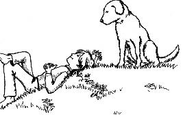

第十八章　大冒险的结局

又是几个月过去了。我开始把我的经历写下来。我也不清楚为什么要这样做，也许我只是想确保自己不会忘记。我每天写两页——这一点儿也不难，因为我的成功日记上都有记录。我从写作中获得了巨大的乐趣。

时光如流水一般逝去，我不断地尝试着新的冒险。

爸爸妈妈这段时间过得相当不错。金先生建议我的爸爸，让他雇两个帮手。爸爸开始时很为难，因为他觉得自己负担不起他们的薪水。但他如今非常信任金先生，所以最终还是听从了金先生的建议。从此一切都变了样，现在爸爸能集中精力做他喜欢的事情，而且干这些事他也相当在行。以前他曾经怀疑自己究竟适不适合独立创业，但现在他知道，只要学会把某些自己不喜欢做而又不擅长做的事情交给别人就行了。最重要的是，爸爸一直心情不错。现在，他每天早晨都高高兴兴地去上班，甚至还吹着小曲。不过我情愿他不要吹，因为他老是吹走调。而自从他买了一辆新车之后，甚至比往常提早一个小时就起床了。当一个人不需要再为钱的问题烦心之后，竟然会发生如此巨大的变化，真令人难以置信。

我自己的业务也是日渐扩大。现在我一共要照顾附近人家的21只狗，得带它们出去散步，给它们梳毛，还得训练它们。当然，这么多活我一个人早就做不过来了，我从马塞尔那里学会了让别的孩子来帮忙的办法。这段时间，莫尼卡通过帮我干活也挣了不少钱。

可是，很快我就开始困惑：下一步该从哪里赚钱呢？

有“困难”是一件好事，因为它逼得我四处寻找新的途径，可以学到很多新东西。我发现在电脑上可以做好多事情。我早就给自己买了一台笔记本电脑，现在我可以很快地完成家庭作业，而且做得整洁多了，分数也有明显提高。

现在，我正在学习用电脑做统计表。陶穆太太非常愿意帮助我，因为使用电脑和记账是她的爱好。我从她那里学到的各种知识真的棒极了。

这样一来，我赚的钱当然越来越多。我严格地按老办法分配这笔钱：50％用来让鹅长大，40％用来帮助实现我的目标，剩下10％用来零花。当初我和钱钱一起列在单子上的目标，大部分我早就逐一实现了，只是美国之行尚未达成。我有一种预感，在那里，我会有一些不同寻常的经历，它会再一次彻底改变我的生活。

我们的投资俱乐部取得了很大的成功。我们买的第一只基金的行情虽然持续下跌了7个月，但我们并没有卖出，所以没有亏损。这以后行情开始爬升，如果我们卖出的话，可以获取不少利润。不过我们没有理由这样做，我们想要的是让我们的鹅不断地长大。

马塞尔曾经想过卖出手里的基金，他说这叫提取利润。陶穆太太却问他准备怎样处置这笔钱，怎样让它继续增长。我们得出的结论是：再次选择同样的基金进行投资。于是马塞尔立即意识到现在卖出基金毫无意义。

我们现在一共买了4只基金。每当我们几个金钱魔法师聚会的时候，总是非常愉快。每次我们都从陶穆太太那里学到许多东西，就连莫尼卡现在也相当在行了。所以我们能给我们的爸爸妈妈出一些主意也就不足为奇了。他们按照我们的投资方案去做，一开始只是偷偷地进行，不过很快就不再遮遮掩掩了。

金先生这时已经完全康复了，他又重新忙于生意。钱钱还留在我身边，当然，每个星期六我会一如既往地带着它去金先生家里。我们一起去散步，然后吃非常美味的巧克力蛋糕，一边吃一边开心地聊天。他真是一个理财天才，每次我都能学到一些新东西。最重要的是，在他眼里，钱是一种再自然、再普通不过的东西。受他的影响，我渐渐也改变了对钱的态度。

金先生每个月为他的客户作一次关于理财投资的报告，我的爸爸妈妈也定期去听。

一个星期六，金先生想到了一个主意，问我愿不愿意在他作报告的同时为他客户的孩子作一次关于钱的报告，我同意了。第一次只来了7个孩子，后来这件事传开了，每次都会来二三十个孩子。于是我定期作演讲，每讲一次得到75马克的报酬。

几天以前，金先生又想出了一个新的点子。他提议跟我合伙开一家帮助孩子们投资的公司。这个主意是他在看了我从陶穆太太那儿拿到的文件夹里的资料之后想出来的。我觉得这个点子太妙了，想想看吧，我，吉娅，将和理财天才金先生合伙开公司了。

我问他为什么单单想到和我一起开公司，他回答说：“因为你的知识和你取得的成绩告诉我，你有能力做这件事情。我相信，和你一起开这家公司会比我独自一人开公司的前景好得多，不然我不会向你提出这个建议。比起我一个人，你会吸引更多的孩子成为我们的客户。”这回答真像是为我的成功日记设计好的。

我得承认他说的话是对的。我之所以能大胆承认这一点，是因为我的自信心大大增强了。

尽管如此，我还是特别激动。我相信自己很快就将尝试一次全新的冒险。

把这些事情全部写下来之后，我向椅背上靠了靠，浏览着自己在本子上写下的文字。我觉得自己写得不错。

随后，我的目光转向钱钱。我注视着这只漂亮的小狗，思绪起伏。我们很长时间没有说过话了。我早就想问它为什么会这样，可是我不敢。我说不出自己担心的到底是什么，但我隐隐约约有一种预感，似乎将要发生一些无法改变的事情。

现在，我再次意识到了这种感觉。我已经学会了不去逃避我害怕的事情，因此，我牵着钱钱走向树林。但是那种模模糊糊的感觉始终伴随着我。我高兴不起来，喉咙好像被什么东西堵住了似的，说不出话，走得也比平时慢许多。

终于，我们来到了我们的秘密据点。已经很久没人来过这里了，那个我们经常爬进爬出的通道几乎被植物遮住了，费了好一会儿工夫我们才进到了洞里。这里也不再像以前那样舒服，一切似乎都改变了。

我很伤感，久久地注视着钱钱，希望它开口说话。它很长时间没有说过一句话了，我有时甚至会想，很多事情也许只是我的想象。

我绝望地请求钱钱向我证明它确实会说话。

小狗脸上的表情开始有了变化，我觉得仿佛回到了它第一次对我开口说话的时候。

“吉娅，我会不会说话根本没那么重要。”一个声音响了起来。我暗自欢呼，我刚才听到的，清清楚楚是钱钱的声音。

钱钱继续说道：“重要的是，你能不能听到并且理解我说的话。就像你现在写的这本书，有一些人读过之后不会有任何改变，而另一些人读过之后开始聪明地理财，他们会拥有更幸福更富有的生活。”

钱钱说完了。我真的无法确定我刚才是不是做了梦。钱钱刚刚真的对我说了话吗？真是太荒谬了。

然而，刹那之间，我突然明白过来，我没有做梦。我说不出理由，但这本来就不需要什么理由。我浑身冰凉，因为我意识到这肯定是钱钱最后一次开口和我说话。我悲伤得几乎不能呼吸，伸过手去，久久地抱住了它。我把它紧紧地搂在怀里，似乎这样它就会再次开口对我说话。

这时，我想起了金先生对我说过的一句话：不要为失去的东西而忧伤，而要对拥有它的时光心存感激。对我来说，这句话的意思是：从现在开始，我再也得不到钱钱的建议了，但我还是必须应对各种情况。

但换个角度来看，这样也有好处。如果钱钱不再说话，它也就不会再有危险，不会有人想要对它进行检查，每个人都会认为我的故事只不过是一个小姑娘的幻想，不会当真。

我开始轻轻地哭泣。钱钱转过它的脑袋，舔着我的脸，我依然没有阻止它。我哭了很长时间，感觉好多了。

过了好一会儿，我才恢复了思考能力。我充满感激地回想着我从钱钱那里学到的东西，所有它教我的话现在都深深地印在了我的心里。今后我会变得很有钱，对这一点我不再怀疑，并且这个过程很可能比别人所能想到的要快得多。我还知道，有了这些钱之后，我仍然会很幸福。

另外，我可以把我的故事写得很巧妙，让别人搞不清楚钱钱开口说话的事情到底是我的想象，还是确有其事。

我心里想的东西太多了，一时说不出话来。我们在秘密据点里静静地待了很久——这是最后一次了。然后，我忽然知道了我的书应该怎样结尾。

我们回到家，我写道：

我希望能有很多人听到这本书说话的声音，我和一只名叫钱钱的小狗将会感到非常高兴。

——吉娅

