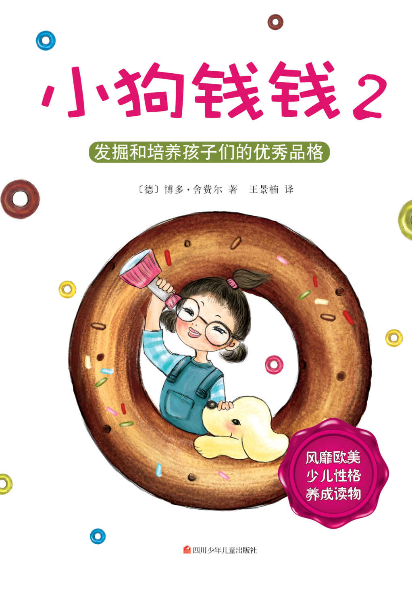
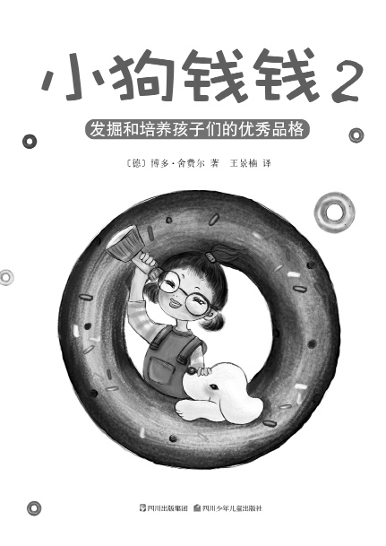

北京读书人文化艺术有限公司

www.readers.com.cn

出　　品

图书在版编目（CIP）数据

小狗钱钱．2/〔德〕舍费尔（Schafer, B.）著；王景楠译．—海口：南海出版公司，2011.12

ISBN 978-7-5442-5062-7

Ⅰ．①小…　Ⅱ．①舍… ②王…　Ⅲ．①财务管理－少儿读物　Ⅳ．①TS976.15-49

中国版本图书馆CIP数据核字（2011）第201415号

著作权合同登记号　图字：30-2011-076

Kira und der Kern des Donut

By Bodo Schäfer

Copyright © 2004 by GmbH

Published by arrangement with The Rights Company

All Rights Reserved

小狗钱钱2

〔德〕博多·舍费尔　著

王景楠　译

出　　版　南海出版公司（0898）66568511

海口市海秀中路51号星华大厦五楼　邮编　570206

出　　品　北京读书人文化艺术有限公司　www.readers.com.cn

发　　行　新经典文化有限公司

电话（010）68423599　邮箱　editor@readinglife.com

经　　销　新华书店

责任编辑　聂　敏

特邀编辑　彭　展

装帧设计　韩　笑

内文制作　邵海波

印　　刷　三河市中晟雅豪印务有限公司　

开　　本　890毫米×1270毫米　1/32

印　　张　7.75

字　　数　124千

版　　次　2011年12月第1版

印　　次　2013年8月第9次印刷

书　　号　ISBN 978-7-5442-5062-7

定　　价　28.00元

版权所有，未经书面许可，不得转载、复制、翻印，违者必究。

这是一个对孩子们和成年人的性格发展都十分有益的奇妙故事！

——博多·舍费尔

目录

[童话与理财](./26-童话与理财.md)

[第一章　奖学金](./27-第一章-奖学金.md)

[第二章　白色石头](./28-第二章-白色石头.md)

[第三章　放大镜](./29-第三章-放大镜.md)

[第四章　论文](./30-第四章-论文.md)

[第五章　前往加利福尼亚](./31-第五章-前往加利福尼亚.md)

[第六章　寄宿学校](./32-第六章-寄宿学校.md)

[第七章　好老师](./33-第七章-好老师.md)

[第八章　危险](./34-第八章-危险.md)

[第九章　好老师的秘密](./35-第九章-好老师的秘密.md)

[第十章　7条准则](./36-第十章-7条准则.md)

[第十一章　演讲比赛](./37-第十一章-演讲比赛.md)

[第十二章　事件](./38-第十二章-事件.md)

[第十三章　回家](./39-第十三章-回家.md)

[第十四章　道别](./40-第十四章-道别.md)

[养成优秀品格的7条准则](./41-养成优秀品格的7条准则.md)

[返回总目录](./01-目录.md)
