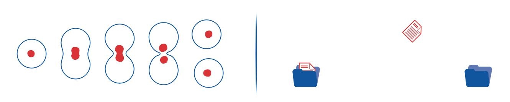
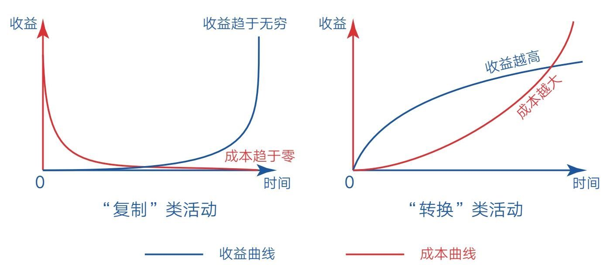
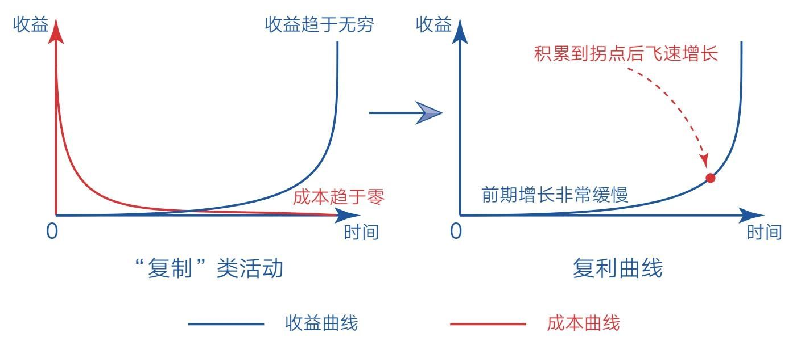

### 第一节　复制：不要浪费生命给你的无限可能

  36亿年前，地球出现生命。

  20世纪40年代，第一台计算机诞生。

  今天，人工智能已经走进我们的生活。

  从某个角度来看，人类社会正由碳基文明向硅基文明跨越。

  在漫长的碳基生命进化中，无论是单细胞生物还是有机生物体，生命若想得以延续，就必须不断复制自己——细胞分裂，旧细胞死亡，新细胞复制原有生物信息继续履行使命。巧的是，硅基生命得以存活的基本能力也是复制——人们每一次启动系统、打开软件、点开链接，本质上都是数据复制的过程，要么从硬盘加载到内存，要么从网络下载到终端（见图1-1）。

    图1-1 碳基生命和硅基生命的复制

  若是没有复制，生命和信息都将失去活力，只能像水那样，要么凝固成冰，要么蒸发为水汽，从一种形态转换成另一种形态。

  事实上，“复制”和“转换”就是大自然的两种基本存在形式，但“复制”的层级显然比“转换”要高，因为它赋予物种以灵性，并繁衍出不可思议的社会和文明。那么，这两种基本形式对我们个体成长又有什么启示呢？

#### 看到不同的世界

  人生的差异往往源于人们看待生活的不同视角。当你掌握了“复制”和“转换”这两个底层概念时，或许会看到一个不同的世界。

  比如大家都知道梅兰芳是著名的京剧表演艺术家，但在中国京剧史上，他的艺术造诣未必是最高的，那为什么最被世人熟知的却是他呢？因为20世纪30年代留声机刚好开始普及，梅兰芳的声音得以被录制成唱片并复制流传到民间。而此前，再有名气的京剧大师也只能在有限的剧场里表演。

  在更早之前，人们谋生的手段几乎只能采用“转换”的形式，裁缝做衣服、小贩卖烧饼、铁匠造农具……无一不是将自己有限的体力或时间转换为生活资料然后参与交换，做多少，是多少。只有为数不多的人，比如私塾先生、杂耍艺人，才能同时面对多人，花费一份时间，收获多份回报。

  时至今日，这规律依旧适用。外卖小哥、货车司机、酒店大厨、公司白领……绝大多数人都在通过出售自己的时间来换取有限的收入。从这个角度看，公司经理和清洁工人这两个职业在性质上是一样的——虽然收入差距较大，但本质上都是在用自己的时间和技能换取相应的收益，做多少，是多少，哪天不做了，收益也就消失了。

  而另一些职业的底层逻辑却与之完全不同。比如企业家、作家、发明家、程序员、歌手、演员等，从事这类职业的人有机会通过雇用他人或借助机器的力量对有价值的商品进行大量复制并销售出去，或将自己创造的优秀作品通过社交媒体平台（网络）无限地复制并传播出去，从而带来不可估量的收益。

  J.K.罗琳写了《哈利·波特》，周杰伦创作了诸多华语金曲，他们的作品时刻都在被复制、产生收益。流行天王迈克尔·杰克逊即使已经去世，他作品的版权收入依旧可以惠及家人。虽然这些名人的案例不具普遍性，但这种强烈对比有助于我们看清表象背后的本质，让自己对这个世界多一分理解。

#### “复制”可以带来无限可能

  “转换”和“复制”的最大区别在于边际成本不同——“转换”的边际成本越来越高，“复制”的边际成本越来越低。如果你不懂“边际成本”这个经济学术语也没有关系，看两个例子就会明白。

  比如厨师就是“转换”类职业，他想得到更多收益就必须做更多菜，或进一步提高做菜的水平。换句话说，他必须投入更多的时间和精力才能得到更高的收入，一旦投入减少，收益就会下降。而作家是“复制”类职业，当他写出一篇高质量的文章之后便可以安心睡觉去了，而这篇文章在他睡觉的时候也会被复制、传播、赞赏。只要它有长久价值，那么即使今天没有产生收益，明天、后天也可能产生，甚至五年、十年后仍能产生收益，长期收益无法估量。

  这种带有“复制”属性的生产活动，几乎做到了“一劳永逸”，因为它们只需一次投入，随着时间的推移，其成本微乎其微，而收益则源源不断（见图1-2）。就像周杰伦早期创作了很多经典歌曲，即使今后不再创作新的歌曲，其作品的收听和购买总量依旧会随着时间的推移而增长。

    图1-2 “复制”类活动与“转换”类活动的边际成本和收益趋势

  这就带来一种可能：终有一天，我们可以不再出售自己的时间就能产生收益，从而实现财富自由或人生自由，彻底解放自己。

  所以一个有追求的大厨可能会这样做：①持续研发新的特色菜品，并凭借自己的“秘密配方”技术入股餐饮企业，允许连锁酒店复制自己的技术，享受股份分红，此后即使不亲自做菜也能产生足够多的收益；②制作易懂的特色做菜教程，将其发布到网上，供需要学习的人免费或付费观看，这样就可以在现有基础上产生更多的收益，如果个人品牌打造顺利，这份收益可能会超过自己做菜的收益，此时便意味着自己实现了初步的人生自由。

  若再仔细观察，我们不难发现“复制”类活动的收益曲线和复利曲线非常一致（见图1-3）——前期增长缓慢，但只要持续积累价值，收益就能在到达拐点后飞速增长。

    图1-3 “复制”类活动的收益曲线和复利曲线

  这就是我选择写作的原因之一（最主要的原因是想让自己头脑清晰，脱离混沌）：这种非线性增长的“复制”力量，可以让自己的人生产生无限可能。如果你也想开始写作，其实有这么一条理由就够了。

#### 获得无限可能的关键在于价值

  人类科技的发展，本质上都是对自身能力的提升。

  飞机、高铁让人走得更快；雷达、望远镜让人看得更远；手机、电话让人听得更清；计算机让大脑转得更快；而互联网则让人的“复制”能力得到极大的扩展。

  如今，虽然不是人人都有雇用他人（机器）进行产品复制的机会，但每个人都有创造并复制自己作品的机会——只要敲起键盘写文章，打开手机拍视频，谁都可以发布自己的作品。

  然而，并非所有的“复制”类活动都具有无限可能，因为“复制”只是一种渠道，获得无限可能的关键依旧在于价值。如果我们生产的作品是肤浅的、低价值的、博人眼球的，那它们可能会在短时间内爆发一下，但必定无法长久流传。这也是为什么网络时代出现了信息爆炸而没有出现知识爆炸，因为真正有价值的内容依旧稀缺，所以要想获得无限可能，“复制”和“价值”缺一不可，且价值越高，可能性越大。如果你对自己的人生有追求，那就应该激励自己去创造“可复制的价值”。

  当然，现实生活中我们每个人一开始都只能通过“转换”类技能来维持自己的生活，但若你的眼光足够长远，就应该尽早储备并打磨一项“复制”类技能，让自己逐渐摆脱生活的引力，获取人生自由。

  在这个幸运的时代，只要你愿意，随时可以踏上“复制”之旅，但请一定坚守价值并保持耐心，因为机会终将属于那些“看得清且做得到”的人。

  每个人都有机会，不要浪费生命给你的无限可能！
